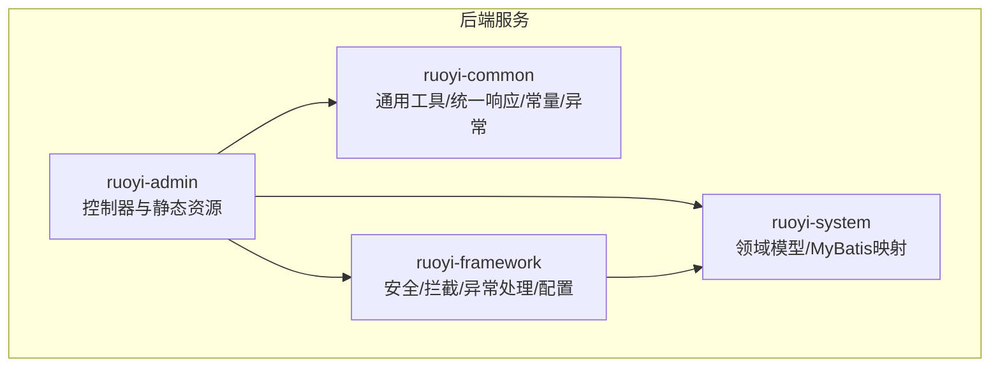
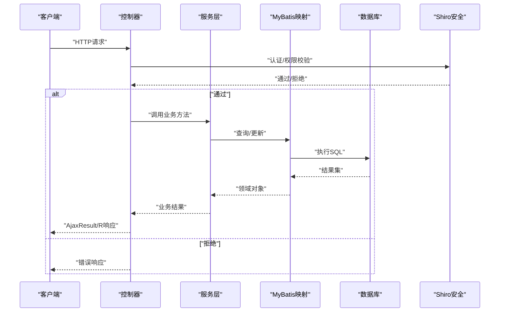
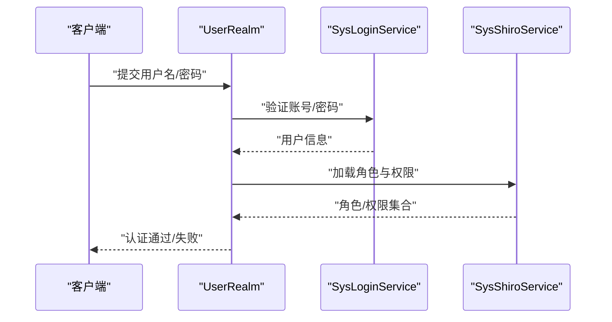
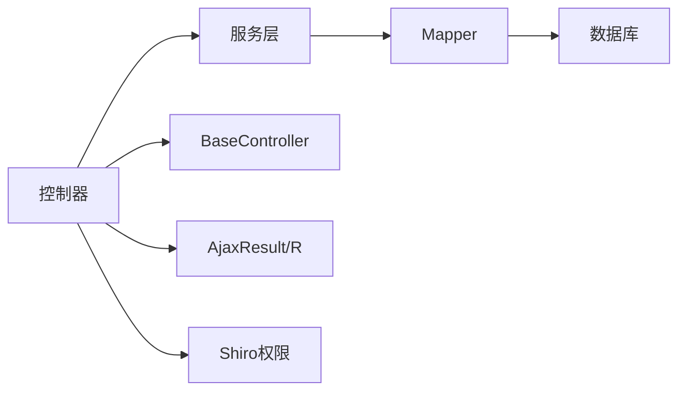

# API接口文档

<cite>
**本文引用的文件**
- [AjaxResult.java](file://ruoyi-common/src/main/java/com/ruoyi/common/core/domain/AjaxResult.java)
- [BaseController.java](file://ruoyi-common/src/main/java/com/ruoyi/common/core/controller/BaseController.java)
- [GlobalExceptionHandler.java](file://ruoyi-framework/src/main/java/com/ruoyi/framework/web/exception/GlobalExceptionHandler.java)
- [SwaggerConfig.java](file://ruoyi-admin/src/main/java/com/ruoyi/web/core/config/SwaggerConfig.java)
- [GenshinCharacterController.java](file://ruoyi-admin/src/main/java/com/ruoyi/web/controller/system/GenshinCharacterController.java)
- [GenshinRecommendWeaponController.java](file://ruoyi-admin/src/main/java/com/ruoyi/web/controller/system/GenshinRecommendWeaponController.java)
- [GenshinEnemyController.java](file://ruoyi-admin/src/main/java/com/ruoyi/web/controller/system/GenshinEnemyController.java)
- [GenshinDomainController.java](file://ruoyi-admin/src/main/java/com/ruoyi/web/controller/system/GenshinDomainController.java)
- [GenshinEnemyInvestigationController.java](file://ruoyi-admin/src/main/java/com/ruoyi/web/controller/system/GenshinEnemyInvestigationController.java)
- [GenshinEnemyRewardController.java](file://ruoyi-admin/src/main/java/com/ruoyi/web/controller/system/GenshinEnemyRewardController.java)
- [GenshinRecommendArtifactController.java](file://ruoyi-admin/src/main/java/com/ruoyi/web/controller/system/GenshinRecommendArtifactController.java)
- [GenshinCalculatorController.java](file://ruoyi-admin/src/main/java/com/ruoyi/web/controller/system/GenshinCalculatorController.java)
- [GenshinUserFavoriteController.java](file://ruoyi-admin/src/main/java/com/ruoyi/web/controller/system/GenshinUserFavoriteController.java)
- [SysLoginService.java](file://ruoyi-framework/src/main/java/com/ruoyi/framework/shiro/service/SysLoginService.java)
- [SysShiroService.java](file://ruoyi-framework/src/main/java/com/ruoyi/framework/shiro/service/SysShiroService.java)
- [UserRealm.java](file://ruoyi-framework/src/main/java/com/ruoyi/framework/shiro/realm/UserRealm.java)
- [PermitAllUrlProperties.java](file://ruoyi-framework/src/main/java/com/ruoyi/framework/config/properties/PermitAllUrlProperties.java)
- [PermissionConstants.java](file://ruoyi-common/src/main/java/com/ruoyi/common/constant/PermissionConstants.java)
- [PermissionUtils.java](file://ruoyi-common/src/main/java/com/ruoyi/common/utils/security/PermissionUtils.java)
- [PermissionsAspect.java](file://ruoyi-framework/src/main/java/com/ruoyi/framework/aspectj/PermissionsAspect.java)
- [GenshinCharacter.java](file://ruoyi-system/src/main/java/com/ruoyi/system/domain/GenshinCharacter.java)
- [GenshinWeapon.java](file://ruoyi-system/src/main/java/com/ruoyi/system/domain/GenshinWeapon.java)
- [GenshinEnemy.java](file://ruoyi-system/src/main/java/com/ruoyi/system/domain/GenshinEnemy.java)
- [GenshinDomain.java](file://ruoyi-system/src/main/java/com/ruoyi/system/domain/GenshinDomain.java)
- [GenshinRecommendWeapon.java](file://ruoyi-system/src/main/java/com/ruoyi/system/domain/GenshinRecommendWeapon.java)
- [GenshinRecommendArtifact.java](file://ruoyi-system/src/main/java/com/ruoyi/system/domain/GenshinRecommendArtifact.java)
- [GenshinUserFavorite.java](file://ruoyi-system/src/main/java/com/ruoyi/system/domain/GenshinUserFavorite.java)
- [GenshinCharacterMapper.xml](file://ruoyi-system/src/main/resources/mapper/system/GenshinCharacterMapper.xml)
- [GenshinWeaponMapper.xml](file://ruoyi-system/src/main/resources/mapper/system/GenshinWeaponMapper.xml)
- [GenshinEnemyMapper.xml](file://ruoyi-system/src/main/resources/mapper/system/GenshinEnemyMapper.xml)
- [application.yml](file://ruoyi-admin/src/main/resources/application.yml)
</cite>

## 目录
1. [简介](#简介)
2. [项目结构](#项目结构)
3. [核心组件](#核心组件)
4. [架构总览](#架构总览)
5. [详细组件分析](#详细组件分析)
6. [依赖关系分析](#依赖关系分析)
7. [性能考虑](#性能考虑)
8. [故障排查指南](#故障排查指南)
9. [结论](#结论)
10. [附录](#附录)

## 简介
本文件为“原神攻略系统”的完整API接口文档，基于RuoYi框架实现，采用Spring Boot + MyBatis + Apache Shiro进行权限控制与安全防护。文档覆盖所有RESTful端点的HTTP方法、URL模式、请求参数、响应格式与错误码定义；说明统一响应体AjaxResult/R的设计理念与使用规范；提供接口调用示例与参数说明，包含成功与失败场景；解释安全机制、权限控制与认证方式；涵盖接口版本管理、向后兼容与废弃接口处理策略；并提供接口测试指南与调试技巧。

## 项目结构
系统采用前后端分离架构，后端以模块化方式组织，核心模块如下：
- ruoyi-admin：Web层控制器与静态资源
- ruoyi-common：通用工具、统一响应体、常量与异常
- ruoyi-framework：安全框架、拦截器、全局异常处理、配置
- ruoyi-system：业务领域模型与MyBatis映射

**图表来源**
- [GenshinCharacterController.java:1-74](file://ruoyi-admin/src/main/java/com/ruoyi/web/controller/system/GenshinCharacterController.java#L1-L74)
- [BaseController.java](file://ruoyi-common/src/main/java/com/ruoyi/common/core/controller/BaseController.java)
- [GlobalExceptionHandler.java](file://ruoyi-framework/src/main/java/com/ruoyi/framework/web/exception/GlobalExceptionHandler.java)

**章节来源**
- [GenshinCharacterController.java:1-74](file://ruoyi-admin/src/main/java/com/ruoyi/web/controller/system/GenshinCharacterController.java#L1-L74)
- [GenshinRecommendWeaponController.java:1-34](file://ruoyi-admin/src/main/java/com/ruoyi/web/controller/system/GenshinRecommendWeaponController.java#L1-L34)
- [GenshinEnemyController.java](file://ruoyi-admin/src/main/java/com/ruoyi/web/controller/system/GenshinEnemyController.java)
- [GenshinDomainController.java](file://ruoyi-admin/src/main/java/com/ruoyi/web/controller/system/GenshinDomainController.java)
- [GenshinEnemyInvestigationController.java](file://ruoyi-admin/src/main/java/com/ruoyi/web/controller/system/GenshinEnemyInvestigationController.java)
- [GenshinEnemyRewardController.java](file://ruoyi-admin/src/main/java/com/ruoyi/web/controller/system/GenshinEnemyRewardController.java)
- [GenshinRecommendArtifactController.java](file://ruoyi-admin/src/main/java/com/ruoyi/web/controller/system/GenshinRecommendArtifactController.java)
- [GenshinCalculatorController.java](file://ruoyi-admin/src/main/java/com/ruoyi/web/controller/system/GenshinCalculatorController.java)
- [GenshinUserFavoriteController.java](file://ruoyi-admin/src/main/java/com/ruoyi/web/controller/system/GenshinUserFavoriteController.java)

## 核心组件
- 统一响应体AjaxResult/R：封装所有接口的返回结构，包含状态码、消息与数据载体，确保前后端交互一致性。
- BaseController：控制器基类，提供分页、日志、Excel导出等通用能力。
- 全局异常处理器：集中处理业务异常与系统异常，统一输出标准响应。
- 安全与权限：基于Apache Shiro，支持登录认证、权限校验与匿名访问白名单。
- Swagger/OpenAPI：集成接口文档，支持API密钥认证头。

**章节来源**
- [AjaxResult.java](file://ruoyi-common/src/main/java/com/ruoyi/common/core/domain/AjaxResult.java)
- [BaseController.java](file://ruoyi-common/src/main/java/com/ruoyi/common/core/controller/BaseController.java)
- [GlobalExceptionHandler.java](file://ruoyi-framework/src/main/java/com/ruoyi/framework/web/exception/GlobalExceptionHandler.java)
- [SwaggerConfig.java:1-46](file://ruoyi-admin/src/main/java/com/ruoyi/web/core/config/SwaggerConfig.java#L1-L46)

## 架构总览
系统采用MVC架构，控制器接收请求，调用服务层，持久层通过MyBatis执行SQL，Shiro负责认证与授权，统一响应体与异常处理贯穿整个流程。

**图表来源**
- [GenshinCharacterController.java:66-74](file://ruoyi-admin/src/main/java/com/ruoyi/web/controller/system/GenshinCharacterController.java#L66-L74)
- [UserRealm.java:86-109](file://ruoyi-framework/src/main/java/com/ruoyi/framework/shiro/realm/UserRealm.java#L86-L109)
- [GlobalExceptionHandler.java](file://ruoyi-framework/src/main/java/com/ruoyi/framework/web/exception/GlobalExceptionHandler.java)

## 详细组件分析

### 统一响应体 AjaxResult/R 设计
- 设计理念
  - 统一返回结构，便于前端解析与错误处理
  - 包含状态码、消息与数据载体，支持分页数据包装
  - 与业务异常体系配合，保证错误信息可读且可控
- 使用规范
  - 成功场景：使用 ok(data) 或 ok() 返回数据或成功标记
  - 失败场景：使用 fail(message) 或 fail(code, message) 返回错误
  - 分页场景：使用 TableDataInfo 封装列表与总数
- 关键字段
  - code：状态码
  - msg：消息
  - data：数据载体
  - total：分页总数

**章节来源**
- [AjaxResult.java](file://ruoyi-common/src/main/java/com/ruoyi/common/core/domain/AjaxResult.java)
- [BaseController.java](file://ruoyi-common/src/main/java/com/ruoyi/common/core/controller/BaseController.java)

### 认证与权限控制
- 认证方式
  - 基于Shiro的用户名/密码登录，登录成功后生成会话
  - 支持验证码校验与账户状态检查
- 权限控制
  - 使用注解 @RequiresPermissions 控制接口访问
  - 权限字符串由模块:功能:操作组成，如 system:character:list
  - 支持管理员全权限与普通用户细粒度权限
- 匿名访问
  - 通过 @Anonymous 注解或配置白名单允许匿名访问

**图表来源**
- [UserRealm.java:86-109](file://ruoyi-framework/src/main/java/com/ruoyi/framework/shiro/realm/UserRealm.java#L86-L109)
- [SysLoginService.java](file://ruoyi-framework/src/main/java/com/ruoyi/framework/shiro/service/SysLoginService.java)
- [SysShiroService.java](file://ruoyi-framework/src/main/java/com/ruoyi/framework/shiro/service/SysShiroService.java)

**章节来源**
- [UserRealm.java:66-109](file://ruoyi-framework/src/main/java/com/ruoyi/framework/shiro/realm/UserRealm.java#L66-L109)
- [PermissionConstants.java:1-27](file://ruoyi-common/src/main/java/com/ruoyi/common/constant/PermissionConstants.java#L1-L27)
- [PermissionUtils.java:1-118](file://ruoyi-common/src/main/java/com/ruoyi/common/utils/security/PermissionUtils.java#L1-L118)
- [PermissionsAspect.java:1-30](file://ruoyi-framework/src/main/java/com/ruoyi/framework/aspectj/PermissionsAspect.java#L1-L30)
- [PermitAllUrlProperties.java:1-41](file://ruoyi-framework/src/main/java/com/ruoyi/framework/config/properties/PermitAllUrlProperties.java#L1-L41)

### 角色基础信息接口
- 路径：/system/character
- 权限：system:character:view/list
- 方法与端点
  - GET /system/character：页面跳转
  - POST /system/character/list：分页查询角色列表
- 请求参数
  - 支持按角色名称、元素类型、武器类型等条件过滤
  - 分页参数：page、limit
- 响应
  - 列表数据：TableDataInfo
  - 字段：rows（列表）、total（总数）

**章节来源**
- [GenshinCharacterController.java:59-74](file://ruoyi-admin/src/main/java/com/ruoyi/web/controller/system/GenshinCharacterController.java#L59-L74)
- [GenshinCharacterMapper.xml](file://ruoyi-system/src/main/resources/mapper/system/GenshinCharacterMapper.xml)

### 推荐武器接口
- 路径：/system/recommendWeapon
- 权限：system:recommendWeapon:view/list
- 方法与端点
  - GET /system/recommendWeapon：页面跳转
  - POST /system/recommendWeapon/list：分页查询推荐武器
- 请求参数
  - 支持按角色ID、武器类型、稀有度等条件过滤
  - 分页参数：page、limit
- 响应
  - 列表数据：TableDataInfo

**章节来源**
- [GenshinRecommendWeaponController.java:1-34](file://ruoyi-admin/src/main/java/com/ruoyi/web/controller/system/GenshinRecommendWeaponController.java#L1-L34)
- [GenshinRecommendWeapon.java](file://ruoyi-system/src/main/java/com/ruoyi/system/domain/GenshinRecommendWeapon.java)

### 敌人信息接口
- 路径：/system/enemy
- 权限：system:enemy:view/list
- 方法与端点
  - GET /system/enemy：页面跳转
  - POST /system/enemy/list：分页查询敌人
- 请求参数
  - 支持按怪物ID、名称、类型、分类等条件过滤
  - 分页参数：page、limit
- 响应
  - 列表数据：TableDataInfo

**章节来源**
- [GenshinEnemyController.java](file://ruoyi-admin/src/main/java/com/ruoyi/web/controller/system/GenshinEnemyController.java)
- [GenshinEnemy.java](file://ruoyi-system/src/main/java/com/ruoyi/system/domain/GenshinEnemy.java)
- [GenshinEnemyMapper.xml:24-47](file://ruoyi-system/src/main/resources/mapper/system/GenshinEnemyMapper.xml#L24-L47)

### 地域信息接口
- 路径：/system/domain
- 权限：system:domain:view/list
- 方法与端点
  - GET /system/domain：页面跳转
  - POST /system/domain/list：分页查询地域
- 请求参数
  - 支持按地域名称、描述等条件过滤
  - 分页参数：page、limit
- 响应
  - 列表数据：TableDataInfo

**章节来源**
- [GenshinDomainController.java](file://ruoyi-admin/src/main/java/com/ruoyi/web/controller/system/GenshinDomainController.java)
- [GenshinDomain.java](file://ruoyi-system/src/main/java/com/ruoyi/system/domain/GenshinDomain.java)

### 敌人调查接口
- 路径：/system/enemy/investigation
- 权限：system:enemy:investigation:view/list
- 方法与端点
  - GET /system/enemy/investigation：页面跳转
  - POST /system/enemy/investigation/list：分页查询调查任务
- 请求参数
  - 支持按调查ID、任务名称等条件过滤
  - 分页参数：page、limit
- 响应
  - 列表数据：TableDataInfo

**章节来源**
- [GenshinEnemyInvestigationController.java](file://ruoyi-admin/src/main/java/com/ruoyi/web/controller/system/GenshinEnemyInvestigationController.java)

### 敌人奖励接口
- 路径：/system/enemy/reward
- 权限：system:enemy:reward:view/list
- 方法与端点
  - GET /system/enemy/reward：页面跳转
  - POST /system/enemy/reward/list：分页查询奖励
- 请求参数
  - 支持按奖励ID、物品名称等条件过滤
  - 分页参数：page、limit
- 响应
  - 列表数据：TableDataInfo

**章节来源**
- [GenshinEnemyRewardController.java](file://ruoyi-admin/src/main/java/com/ruoyi/web/controller/system/GenshinEnemyRewardController.java)

### 推荐圣遗物接口
- 路径：/system/recommend/artifact
- 权限：system:recommend:artifact:view/list
- 方法与端点
  - GET /system/recommend/artifact：页面跳转
  - POST /system/recommend/artifact/list：分页查询推荐圣遗物
- 请求参数
  - 支持按角色ID、部位、主副属性等条件过滤
  - 分页参数：page、limit
- 响应
  - 列表数据：TableDataInfo

**章节来源**
- [GenshinRecommendArtifactController.java](file://ruoyi-admin/src/main/java/com/ruoyi/web/controller/system/GenshinRecommendArtifactController.java)
- [GenshinRecommendArtifact.java](file://ruoyi-system/src/main/java/com/ruoyi/system/domain/GenshinRecommendArtifact.java)

### 计算器接口
- 路径：/system/calculator
- 权限：system:calculator:view
- 方法与端点
  - GET /system/calculator：页面跳转
  - POST /system/calculator/calculate：计算相关数据
- 请求参数
  - 根据具体计算逻辑传入角色、武器、天赋等级等参数
- 响应
  - 计算结果：AjaxResult/R

**章节来源**
- [GenshinCalculatorController.java](file://ruoyi-admin/src/main/java/com/ruoyi/web/controller/system/GenshinCalculatorController.java)

### 用户收藏接口
- 路径：/system/user/favorite
- 权限：system:user:favorite:view/list
- 方法与端点
  - GET /system/user/favorite：页面跳转
  - POST /system/user/favorite/list：分页查询收藏
- 请求参数
  - 支持按用户ID、收藏类型、目标ID等条件过滤
  - 分页参数：page、limit
- 响应
  - 列表数据：TableDataInfo

**章节来源**
- [GenshinUserFavoriteController.java](file://ruoyi-admin/src/main/java/com/ruoyi/web/controller/system/GenshinUserFavoriteController.java)
- [GenshinUserFavorite.java](file://ruoyi-system/src/main/java/com/ruoyi/system/domain/GenshinUserFavorite.java)

### Swagger/OpenAPI 文档
- 访问路径：/tool/swagger
- 认证方案：API Key（请求头 Authorization: Bearer <token>）
- 作用：提供在线接口文档与调试界面

**章节来源**
- [SwaggerController.java:1-24](file://ruoyi-admin/src/main/java/com/ruoyi/web/controller/tool/SwaggerController.java#L1-L24)
- [SwaggerConfig.java:1-46](file://ruoyi-admin/src/main/java/com/ruoyi/web/core/config/SwaggerConfig.java#L1-L46)

## 依赖关系分析
- 控制器依赖服务层，服务层依赖Mapper，Mapper依赖数据库
- BaseController提供通用能力，统一响应体贯穿各层
- Shiro在控制器前拦截，结合注解完成权限控制

**图表来源**
- [GenshinCharacterController.java:44-57](file://ruoyi-admin/src/main/java/com/ruoyi/web/controller/system/GenshinCharacterController.java#L44-L57)
- [BaseController.java](file://ruoyi-common/src/main/java/com/ruoyi/common/core/controller/BaseController.java)
- [AjaxResult.java](file://ruoyi-common/src/main/java/com/ruoyi/common/core/domain/AjaxResult.java)

**章节来源**
- [GenshinCharacterController.java:44-57](file://ruoyi-admin/src/main/java/com/ruoyi/web/controller/system/GenshinCharacterController.java#L44-L57)
- [GenshinWeaponController.java:1-34](file://ruoyi-admin/src/main/java/com/ruoyi/web/controller/system/GenshinRecommendWeaponController.java#L1-L34)

## 性能考虑
- 分页查询：优先使用分页参数，避免一次性返回大量数据
- 缓存策略：对热点数据可引入Redis缓存，减少数据库压力
- SQL优化：合理使用索引与条件过滤，避免全表扫描
- 并发控制：对高并发接口增加限流与重试机制
- 前端懒加载：列表页采用虚拟滚动与分页加载

## 故障排查指南
- 统一异常处理
  - 全局异常处理器捕获业务异常与系统异常，统一返回AjaxResult/R
  - 建议在开发环境开启详细错误堆栈，在生产环境仅返回简要信息
- 常见错误码
  - 401 未认证：缺少或无效的认证信息
  - 403 权限不足：无相应权限访问
  - 404 资源不存在：请求的资源ID不存在
  - 500 服务器错误：系统异常
- 调试技巧
  - 使用Swagger在线调试，设置正确的认证头
  - 打开Shiro日志，查看认证与授权过程
  - 检查数据库连接与SQL执行情况
  - 使用浏览器开发者工具查看网络请求与响应

**章节来源**
- [GlobalExceptionHandler.java](file://ruoyi-framework/src/main/java/com/ruoyi/framework/web/exception/GlobalExceptionHandler.java)
- [PermissionUtils.java:1-118](file://ruoyi-common/src/main/java/com/ruoyi/common/utils/security/PermissionUtils.java#L1-L118)

## 结论
本API文档基于RuoYi框架实现了统一响应体、完善的权限控制与异常处理机制，覆盖角色、武器、敌人、地域、调查、奖励、圣遗物、计算器与收藏等核心业务模块。建议在实际使用中遵循统一响应格式、严格权限控制与分页查询原则，确保接口稳定与可维护性。

## 附录

### 统一响应体 AjaxResult/R 字段说明
- code：状态码（数字），0表示成功，非0表示失败
- msg：消息（字符串），描述操作结果
- data：数据载体（任意JSON对象或数组）
- total：分页总数（数字），仅在分页场景存在

**章节来源**
- [AjaxResult.java](file://ruoyi-common/src/main/java/com/ruoyi/common/core/domain/AjaxResult.java)

### 权限常量与注解
- 权限常量：add、edit、remove、export、view、list
- 注解：@RequiresPermissions("模块:功能:操作")

**章节来源**
- [PermissionConstants.java:1-27](file://ruoyi-common/src/main/java/com/ruoyi/common/constant/PermissionConstants.java#L1-L27)
- [PermissionsAspect.java:1-30](file://ruoyi-framework/src/main/java/com/ruoyi/framework/aspectj/PermissionsAspect.java#L1-L30)

### 接口版本管理与兼容策略
- 版本策略：通过URL前缀区分版本，如 /api/v1、/api/v2
- 向后兼容：新增字段采用可选，不破坏旧字段结构
- 废弃接口：保留一段时间并标注废弃，提供迁移指引

### 接口测试指南
- 认证测试：先登录获取令牌，再携带 Authorization: Bearer <token> 调用受保护接口
- 参数校验：确保必填参数齐全，类型与范围正确
- 分页测试：验证page与limit组合，边界值与空结果
- 权限测试：使用不同角色账号验证权限控制效果