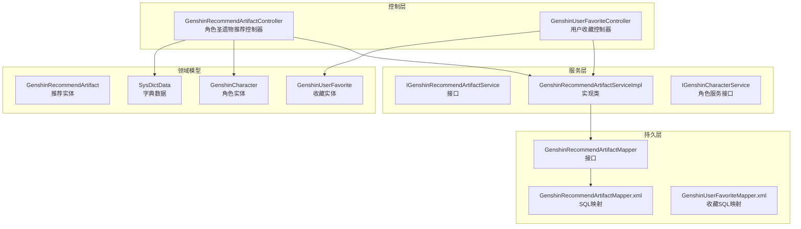
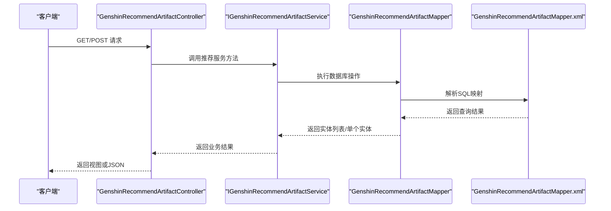
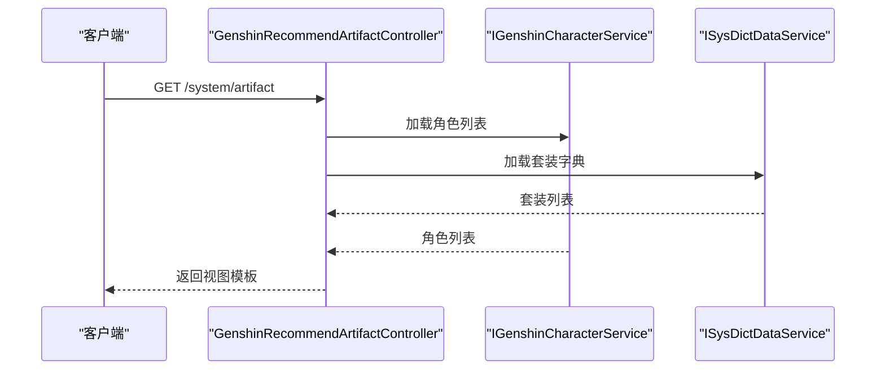
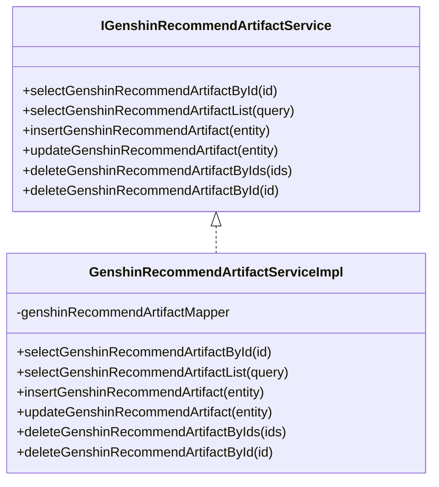
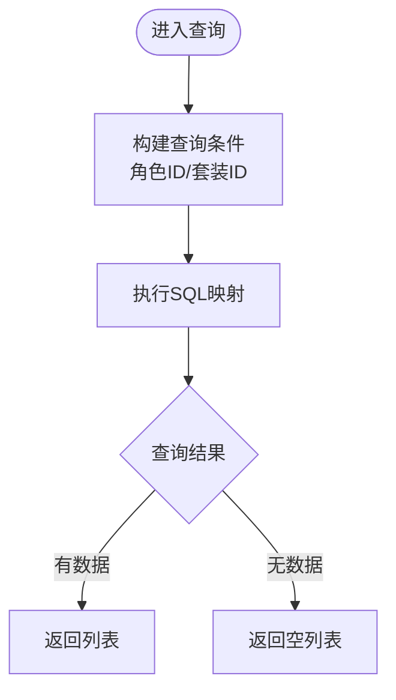
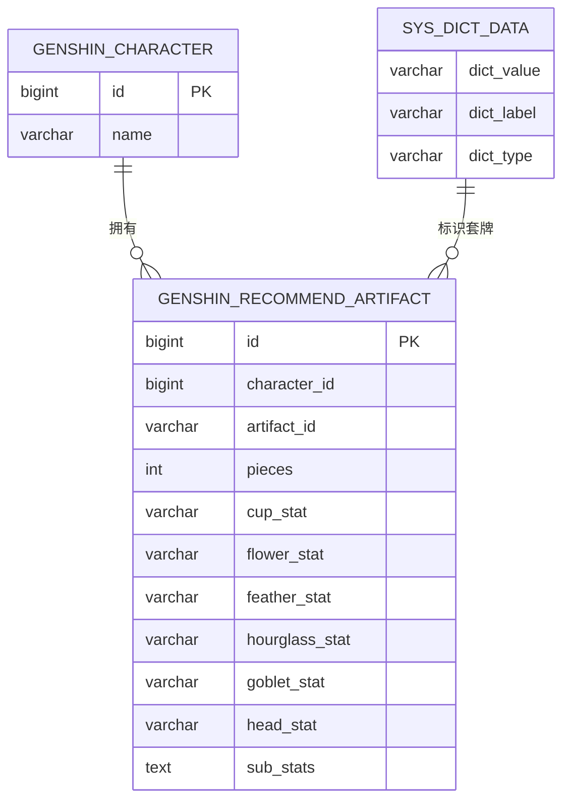
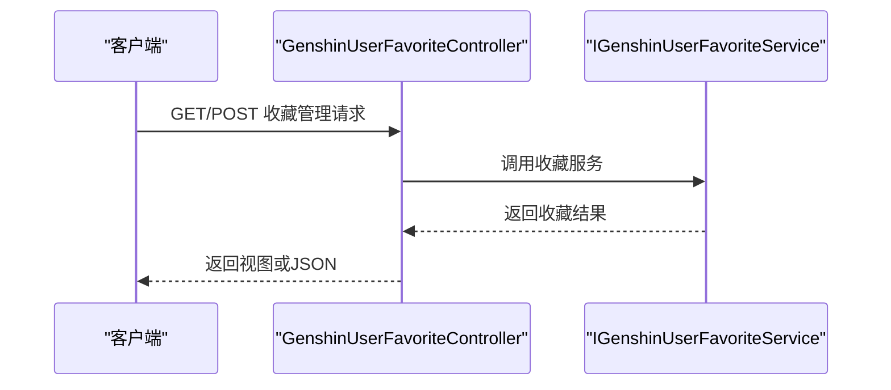
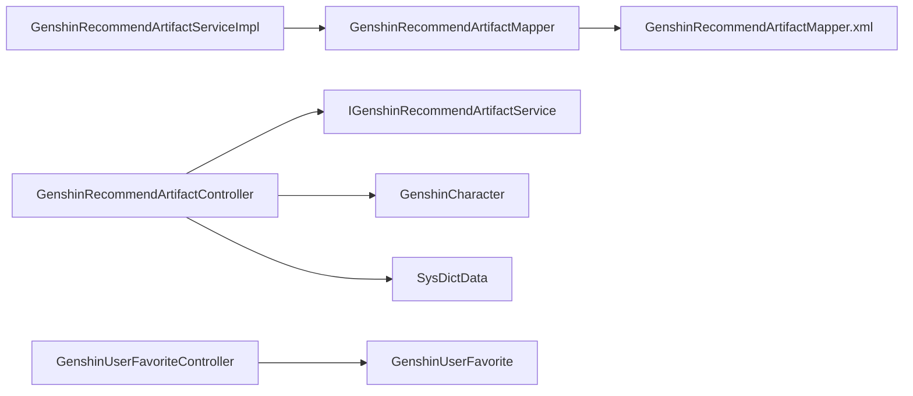

# 圣遗物推荐API

<cite>
**本文档引用的文件**
- [GenshinRecommendArtifactController.java](file://GenShin/RuoYi-master/ruoyi-admin/src/main/java/com/ruoyi/web/controller/system/GenshinRecommendArtifactController.java)
- [IGenshinRecommendArtifactService.java](file://GenShin/RuoYi-master/ruoyi-system/src/main/java/com/ruoyi/system/service/IGenshinRecommendArtifactService.java)
- [GenshinRecommendArtifactServiceImpl.java](file://GenShin/RuoYi-master/ruoyi-system/src/main/java/com/ruoyi/system/service/impl/GenshinRecommendArtifactServiceImpl.java)
- [GenshinRecommendArtifactMapper.java](file://GenShin/RuoYi-master/ruoyi-system/src/main/java/com/ruoyi/system/mapper/GenshinRecommendArtifactMapper.java)
- [GenshinRecommendArtifactMapper.xml](file://GenShin/RuoYi-master/ruoyi-system/src/main/resources/mapper/system/GenshinRecommendArtifactMapper.xml)
- [GenshinRecommendArtifact.java](file://GenShin/RuoYi-master/ruoyi-system/src/main/java/com/ruoyi/system/domain/GenshinRecommendArtifact.java)
- [GenshinUserFavoriteController.java](file://GenShin/RuoYi-master/ruoyi-admin/src/main/java/com/ruoyi/web/controller/system/GenshinUserFavoriteController.java)
- [GenshinUserFavorite.java](file://GenShin/RuoYi-master/ruoyi-system/src/main/java/com/ruoyi/system/domain/GenshinUserFavorite.java)
- [GenshinUserFavoriteMapper.xml](file://GenShin/RuoYi-master/ruoyi-system/src/main/resources/mapper/system/GenshinUserFavoriteMapper.xml)
- [SysDictData.java](file://GenShin/RuoYi-master/ruoyi-system/src/main/java/com/ruoyi/system/domain/SysDictData.java)
- [IGenshinCharacterService.java](file://GenShin/RuoYi-master/ruoyi-system/src/main/java/com/ruoyi/system/service/IGenshinCharacterService.java)
- [GenshinCharacter.java](file://GenShin/RuoYi-master/ruoyi-system/src/main/java/com/ruoyi/system/domain/GenshinCharacter.java)
</cite>

## 目录
1. [简介](#简介)
2. [项目结构](#项目结构)
3. [核心组件](#核心组件)
4. [架构总览](#架构总览)
5. [详细组件分析](#详细组件分析)
6. [依赖关系分析](#依赖关系分析)
7. [性能考虑](#性能考虑)
8. [故障排除指南](#故障排除指南)
9. [结论](#结论)
10. [附录](#附录)

## 简介
本文件为“圣遗物推荐系统”的API文档，聚焦于角色圣遗物搭配推荐、属性优化建议与套装效果计算的推荐接口。文档详细说明推荐算法的输入参数（如角色定位、武器类型、队伍配置等），提供不同场景下的推荐结果接口（输出效率、精通、暴击等不同优先级），记录推荐结果的数据结构（主词条、副词条、评分等），解释推荐算法的权重设置与自定义调整选项，并提供个性化推荐与收藏对比功能接口。

## 项目结构
该系统基于RuoYi框架构建，采用前后端分离的典型三层架构：控制层负责接收请求与返回视图/JSON；服务层封装业务逻辑；持久层通过MyBatis映射数据库表。圣遗物推荐模块位于系统模块中，控制器、服务与映射器分别对应控制层、服务层与持久层。

**图表来源**
- [GenshinRecommendArtifactController.java:39-151](file://GenShin/RuoYi-master/ruoyi-admin/src/main/java/com/ruoyi/web/controller/system/GenshinRecommendArtifactController.java#L39-L151)
- [GenshinUserFavoriteController.java:1-38](file://GenShin/RuoYi-master/ruoyi-admin/src/main/java/com/ruoyi/web/controller/system/GenshinUserFavoriteController.java#L1-L38)
- [IGenshinRecommendArtifactService.java:1-61](file://GenShin/RuoYi-master/ruoyi-system/src/main/java/com/ruoyi/system/service/IGenshinRecommendArtifactService.java#L1-L61)
- [GenshinRecommendArtifactServiceImpl.java:1-43](file://GenShin/RuoYi-master/ruoyi-system/src/main/java/com/ruoyi/system/service/impl/GenshinRecommendArtifactServiceImpl.java#L1-L43)
- [GenshinRecommendArtifactMapper.java:1-61](file://GenShin/RuoYi-master/ruoyi-system/src/main/java/com/ruoyi/system/mapper/GenshinRecommendArtifactMapper.java#L1-L61)
- [GenshinRecommendArtifactMapper.xml:28-54](file://GenShin/RuoYi-master/ruoyi-system/src/main/resources/mapper/system/GenshinRecommendArtifactMapper.xml#L28-L54)
- [GenshinUserFavoriteMapper.xml](file://GenShin/RuoYi-master/ruoyi-system/src/main/resources/mapper/system/GenshinUserFavoriteMapper.xml)

**章节来源**
- [GenshinRecommendArtifactController.java:39-151](file://GenShin/RuoYi-master/ruoyi-admin/src/main/java/com/ruoyi/web/controller/system/GenshinRecommendArtifactController.java#L39-L151)
- [GenshinRecommendArtifactMapper.xml:28-54](file://GenShin/RuoYi-master/ruoyi-system/src/main/resources/mapper/system/GenshinRecommendArtifactMapper.xml#L28-L54)

## 核心组件
- 控制器层
  - 角色圣遗物推荐控制器：提供页面跳转、查询列表、编辑与删除等接口。
  - 用户收藏控制器：提供收藏管理相关接口。
- 服务层
  - 推荐服务接口与实现：封装推荐查询、新增、更新、删除等业务逻辑。
  - 角色服务接口：用于加载角色列表，支撑推荐页面选择。
- 持久层
  - 推荐映射器与XML：定义查询、插入、更新、删除SQL。
  - 收藏映射器XML：定义收藏相关SQL。
- 领域模型
  - 推荐实体：承载推荐结果字段（主词条、副词条、套装等）。
  - 收藏实体：承载用户收藏目标类型与ID。
  - 字典数据：用于加载套装字典项。

**章节来源**
- [GenshinRecommendArtifactController.java:39-151](file://GenShin/RuoYi-master/ruoyi-admin/src/main/java/com/ruoyi/web/controller/system/GenshinRecommendArtifactController.java#L39-L151)
- [IGenshinRecommendArtifactService.java:12-61](file://GenShin/RuoYi-master/ruoyi-system/src/main/java/com/ruoyi/system/service/IGenshinRecommendArtifactService.java#L12-L61)
- [GenshinRecommendArtifactMapper.xml:28-54](file://GenShin/RuoYi-master/ruoyi-system/src/main/resources/mapper/system/GenshinRecommendArtifactMapper.xml#L28-L54)

## 架构总览
推荐系统遵循标准的MVC分层架构，控制器接收请求后调用服务层，服务层通过映射器访问数据库。推荐结果与收藏功能均通过统一的服务接口进行管理。

**图表来源**
- [GenshinRecommendArtifactController.java:63-70](file://GenShin/RuoYi-master/ruoyi-admin/src/main/java/com/ruoyi/web/controller/system/GenshinRecommendArtifactController.java#L63-L70)
- [IGenshinRecommendArtifactService.java:28-61](file://GenShin/RuoYi-master/ruoyi-system/src/main/java/com/ruoyi/system/service/IGenshinRecommendArtifactService.java#L28-L61)
- [GenshinRecommendArtifactMapper.java:28-61](file://GenShin/RuoYi-master/ruoyi-system/src/main/java/com/ruoyi/system/mapper/GenshinRecommendArtifactMapper.java#L28-L61)
- [GenshinRecommendArtifactMapper.xml:36-42](file://GenShin/RuoYi-master/ruoyi-system/src/main/resources/mapper/system/GenshinRecommendArtifactMapper.xml#L36-L42)

## 详细组件分析

### 角色圣遗物推荐控制器
- 页面入口：加载角色与套装字典，跳转至推荐页面。
- 列表查询：支持按角色ID与套装ID过滤，返回表格数据。
- 编辑与删除：支持更新推荐配置与批量删除。

**图表来源**
- [GenshinRecommendArtifactController.java:48-57](file://GenShin/RuoYi-master/ruoyi-admin/src/main/java/com/ruoyi/web/controller/system/GenshinRecommendArtifactController.java#L48-L57)
- [IGenshinCharacterService.java](file://GenShin/RuoYi-master/ruoyi-system/src/main/java/com/ruoyi/system/service/IGenshinCharacterService.java)
- [SysDictData.java](file://GenShin/RuoYi-master/ruoyi-system/src/main/java/com/ruoyi/system/domain/SysDictData.java)

**章节来源**
- [GenshinRecommendArtifactController.java:48-57](file://GenShin/RuoYi-master/ruoyi-admin/src/main/java/com/ruoyi/web/controller/system/GenshinRecommendArtifactController.java#L48-L57)

### 推荐服务接口与实现
- 接口职责：定义查询单条、查询列表、新增、更新、删除等方法。
- 实现类：注入映射器，完成具体业务逻辑。

**图表来源**
- [IGenshinRecommendArtifactService.java:12-61](file://GenShin/RuoYi-master/ruoyi-system/src/main/java/com/ruoyi/system/service/IGenshinRecommendArtifactService.java#L12-L61)
- [GenshinRecommendArtifactServiceImpl.java:17-43](file://GenShin/RuoYi-master/ruoyi-system/src/main/java/com/ruoyi/system/service/impl/GenshinRecommendArtifactServiceImpl.java#L17-L43)

**章节来源**
- [IGenshinRecommendArtifactService.java:12-61](file://GenShin/RuoYi-master/ruoyi-system/src/main/java/com/ruoyi/system/service/IGenshinRecommendArtifactService.java#L12-L61)
- [GenshinRecommendArtifactServiceImpl.java:17-43](file://GenShin/RuoYi-master/ruoyi-system/src/main/java/com/ruoyi/system/service/impl/GenshinRecommendArtifactServiceImpl.java#L17-L43)

### 推荐映射器与SQL
- 查询列表：支持按角色ID与套装ID过滤。
- 插入/更新/删除：提供完整的CRUD能力。

**图表来源**
- [GenshinRecommendArtifactMapper.xml:36-42](file://GenShin/RuoYi-master/ruoyi-system/src/main/resources/mapper/system/GenshinRecommendArtifactMapper.xml#L36-L42)

**章节来源**
- [GenshinRecommendArtifactMapper.xml:36-42](file://GenShin/RuoYi-master/ruoyi-system/src/main/resources/mapper/system/GenshinRecommendArtifactMapper.xml#L36-L42)

### 推荐实体与字段
- 主词条：如“生之花”、“死之羽”、“时之沙”、“空之杯”、“理之冠”等部位的主属性。
- 副词条：部位适用的副属性集合及数值范围。
- 套装：通过字典项标识的套装类型与生效件数。
- 其他：角色ID、推荐梯度等。

**图表来源**
- [GenshinRecommendArtifact.java:13-200](file://GenShin/RuoYi-master/ruoyi-system/src/main/java/com/ruoyi/system/domain/GenshinRecommendArtifact.java#L13-L200)
- [GenshinCharacter.java](file://GenShin/RuoYi-master/ruoyi-system/src/main/java/com/ruoyi/system/domain/GenshinCharacter.java)
- [SysDictData.java](file://GenShin/RuoYi-master/ruoyi-system/src/main/java/com/ruoyi/system/domain/SysDictData.java)

**章节来源**
- [GenshinRecommendArtifact.java:13-200](file://GenShin/RuoYi-master/ruoyi-system/src/main/java/com/ruoyi/system/domain/GenshinRecommendArtifact.java#L13-L200)

### 用户收藏控制器与实体
- 收藏类型：支持角色与配队等目标类型。
- 目标ID：对应角色ID或配队ID。
- 权限控制：基于注解的权限校验。

**图表来源**
- [GenshinUserFavoriteController.java:30-38](file://GenShin/RuoYi-master/ruoyi-admin/src/main/java/com/ruoyi/web/controller/system/GenshinUserFavoriteController.java#L30-L38)
- [GenshinUserFavorite.java:14-59](file://GenShin/RuoYi-master/ruoyi-system/src/main/java/com/ruoyi/system/domain/GenshinUserFavorite.java#L14-L59)

**章节来源**
- [GenshinUserFavoriteController.java:30-38](file://GenShin/RuoYi-master/ruoyi-admin/src/main/java/com/ruoyi/web/controller/system/GenshinUserFavoriteController.java#L30-L38)
- [GenshinUserFavorite.java:14-59](file://GenShin/RuoYi-master/ruoyi-system/src/main/java/com/ruoyi/system/domain/GenshinUserFavorite.java#L14-L59)

## 依赖关系分析
- 控制器依赖服务接口，服务实现依赖映射器，映射器依赖XML配置。
- 推荐实体与角色、字典数据存在关联关系。
- 收藏实体与用户系统集成，通过用户ID关联。

**图表来源**
- [GenshinRecommendArtifactController.java:39-151](file://GenShin/RuoYi-master/ruoyi-admin/src/main/java/com/ruoyi/web/controller/system/GenshinRecommendArtifactController.java#L39-L151)
- [GenshinRecommendArtifactMapper.xml:28-54](file://GenShin/RuoYi-master/ruoyi-system/src/main/resources/mapper/system/GenshinRecommendArtifactMapper.xml#L28-L54)

**章节来源**
- [GenshinRecommendArtifactController.java:39-151](file://GenShin/RuoYi-master/ruoyi-admin/src/main/java/com/ruoyi/web/controller/system/GenshinRecommendArtifactController.java#L39-L151)
- [GenshinRecommendArtifactMapper.xml:28-54](file://GenShin/RuoYi-master/ruoyi-system/src/main/resources/mapper/system/GenshinRecommendArtifactMapper.xml#L28-L54)

## 性能考虑
- 分页查询：列表接口已内置分页处理，建议在大数据量场景下合理设置分页参数。
- SQL过滤：查询条件仅包含角色ID与套装ID，建议在数据库层面建立索引以提升过滤性能。
- 缓存策略：可结合系统缓存机制对常用字典项与角色列表进行缓存，降低重复查询开销。
- 并发控制：服务层方法为无状态设计，适合多线程并发调用，注意避免热点数据竞争。

## 故障排除指南
- 权限不足：控制器使用权限注解保护，若出现访问受限，请检查用户权限配置。
- 数据为空：确认查询条件是否正确，以及数据库中是否存在匹配记录。
- 字段缺失：检查实体字段与数据库表结构是否一致，确保映射XML完整。
- 收藏异常：确认收藏类型与目标ID是否有效，以及用户ID是否正确传入。

**章节来源**
- [GenshinRecommendArtifactController.java:48-151](file://GenShin/RuoYi-master/ruoyi-admin/src/main/java/com/ruoyi/web/controller/system/GenshinRecommendArtifactController.java#L48-L151)
- [GenshinUserFavoriteController.java:30-38](file://GenShin/RuoYi-master/ruoyi-admin/src/main/java/com/ruoyi/web/controller/system/GenshinUserFavoriteController.java#L30-L38)

## 结论
本API文档梳理了圣遗物推荐系统的核心接口与数据结构，明确了输入参数、输出格式与扩展点。通过角色与套装字典驱动的推荐查询，结合收藏功能，可满足不同场景下的搭配推荐需求。后续可在推荐算法权重、个性化偏好与收藏对比等方面进一步增强。

## 附录

### 推荐接口定义
- 获取推荐页面
  - 方法：GET
  - 路径：/system/artifact
  - 参数：无
  - 返回：视图模板，包含角色列表与套装字典
- 查询推荐列表
  - 方法：POST
  - 路径：/system/artifact/list
  - 参数：角色ID、套装ID
  - 返回：表格数据（分页）
- 修改保存推荐
  - 方法：POST
  - 路径：/system/artifact/edit
  - 参数：推荐实体
  - 返回：操作结果
- 删除推荐
  - 方法：POST
  - 路径：/system/artifact/remove
  - 参数：ID集合
  - 返回：操作结果

**章节来源**
- [GenshinRecommendArtifactController.java:48-151](file://GenShin/RuoYi-master/ruoyi-admin/src/main/java/com/ruoyi/web/controller/system/GenshinRecommendArtifactController.java#L48-L151)

### 推荐结果数据结构
- 主词条字段：生之花、死之羽、时之沙、空之杯、理之冠
- 副词条字段：部位适用的副属性集合
- 套装字段：套装ID与生效件数
- 其他字段：角色ID、推荐梯度等

**章节来源**
- [GenshinRecommendArtifact.java:13-200](file://GenShin/RuoYi-master/ruoyi-system/src/main/java/com/ruoyi/system/domain/GenshinRecommendArtifact.java#L13-L200)

### 个性化推荐与收藏对比
- 个性化推荐：可通过扩展服务层方法，在查询时加入用户偏好权重与自定义调整选项。
- 收藏对比：通过收藏实体记录用户关注的目标类型与ID，支持后续对比与导出。

**章节来源**
- [GenshinUserFavorite.java:14-59](file://GenShin/RuoYi-master/ruoyi-system/src/main/java/com/ruoyi/system/domain/GenshinUserFavorite.java#L14-L59)