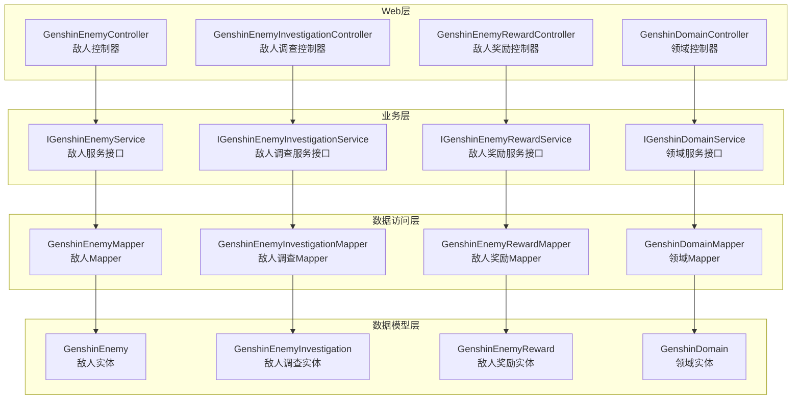
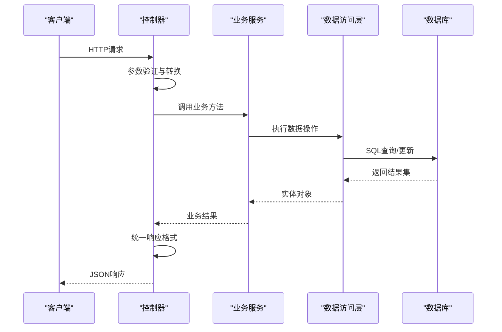
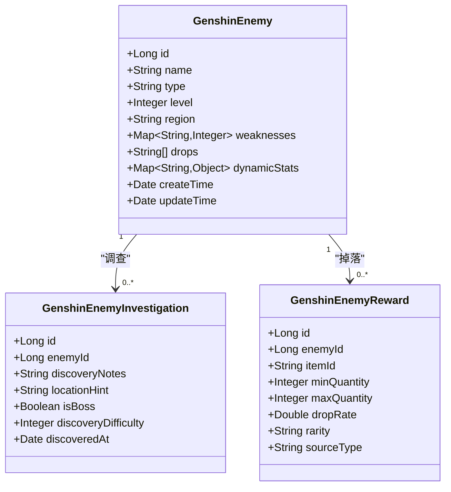
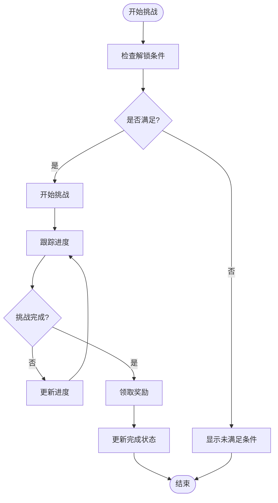
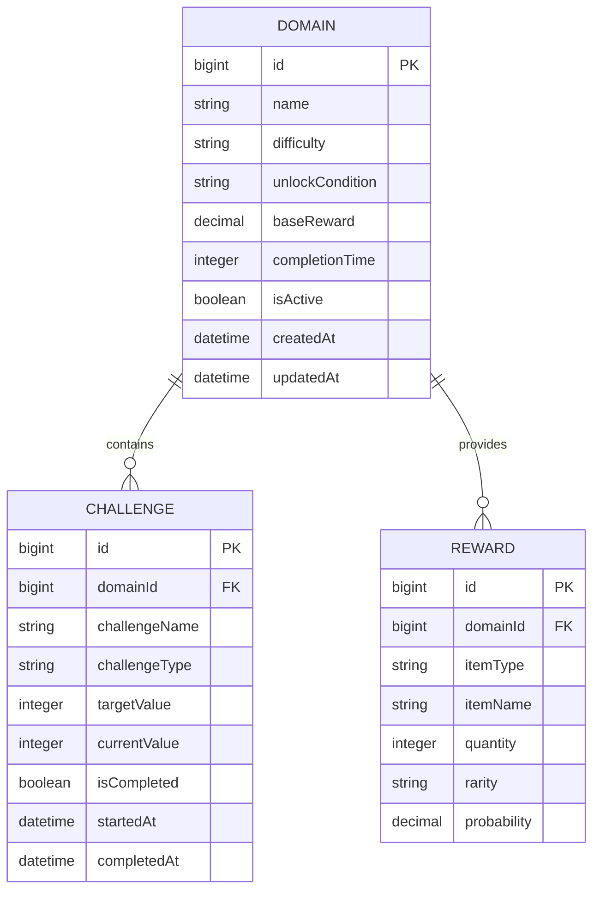
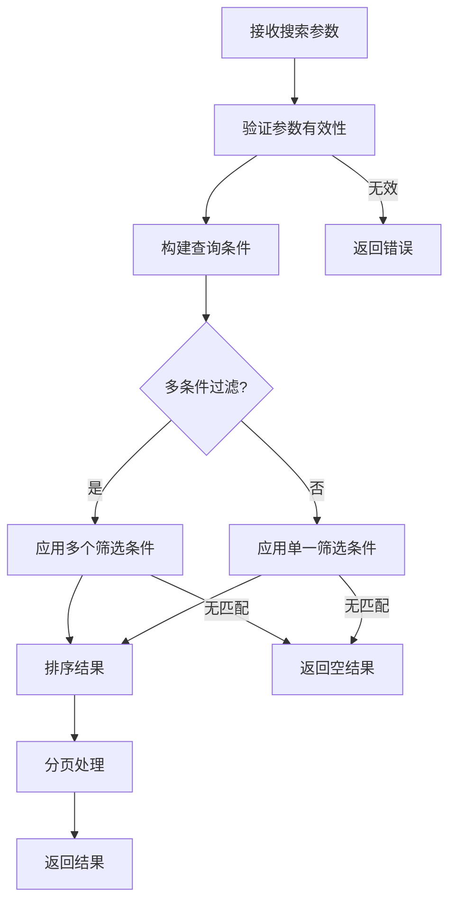
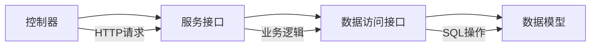

# 敌人与领域API

<cite>
**本文档引用的文件**
- [GenshinEnemyController.java](file://GenShin/RuoYi-master/ruoyi-admin/src/main/java/com/ruoyi/web/controller/system/GenshinEnemyController.java)
- [GenshinEnemyInvestigationController.java](file://GenShin/RuoYi-master/ruoyi-admin/src/main/java/com/ruoyi/web/controller/system/GenshinEnemyInvestigationController.java)
- [GenshinEnemyRewardController.java](file://GenShin/RuoYi-master/ruoyi-admin/src/main/java/com/ruoyi/web/controller/system/GenshinEnemyRewardController.java)
- [GenshinDomainController.java](file://GenShin/RuoYi-master/ruoyi-admin/src/main/java/com/ruoyi/web/controller/system/GenshinDomainController.java)
- [IGenshinEnemyService.java](file://GenShin/RuoYi-master/ruoyi-system/src/main/java/com/ruoyi/system/service/IGenshinEnemyService.java)
- [IGenshinEnemyInvestigationService.java](file://GenShin/RuoYi-master/ruoyi-system/src/main/java/com/ruoyi/system/service/IGenshinEnemyInvestigationService.java)
- [IGenshinEnemyRewardService.java](file://GenShin/RuoYi-master/ruoyi-system/src/main/java/com/ruoyi/system/service/IGenshinEnemyRewardService.java)
- [IGenshinDomainService.java](file://GenShin/RuoYi-master/ruoyi-system/src/main/java/com/ruoyi/system/service/IGenshinDomainService.java)
- [GenshinEnemy.java](file://GenShin/RuoYi-master/ruoyi-system/src/main/java/com/ruoyi/system/domain/GenshinEnemy.java)
- [GenshinEnemyInvestigation.java](file://GenShin/RuoYi-master/ruoyi-system/src/main/java/com/ruoyi/system/domain/GenshinEnemyInvestigation.java)
- [GenshinEnemyReward.java](file://GenShin/RuoYi-master/ruoyi-system/src/main/java/com/ruoyi/system/domain/GenshinEnemyReward.java)
- [GenshinDomain.java](file://GenShin/RuoYi-master/ruoyi-system/src/main/java/com/ruoyi/system/domain/GenshinDomain.java)
- [GenshinEnemyMapper.java](file://GenShin/RuoYi-master/ruoyi-system/src/main/java/com/ruoyi/system/mapper/GenshinEnemyMapper.java)
- [GenshinEnemyInvestigationMapper.java](file://GenShin/RuoYi-master/ruoyi-system/src/main/java/com/ruoyi/system/mapper/GenshinEnemyInvestigationMapper.java)
- [GenshinEnemyRewardMapper.java](file://GenShin/RuoYi-master/ruoyi-system/src/main/java/com/ruoyi/system/mapper/GenshinEnemyRewardMapper.java)
- [GenshinDomainMapper.java](file://GenShin/RuoYi-master/ruoyi-system/src/main/java/com/ruoyi/system/mapper/GenshinDomainMapper.java)
</cite>

## 目录
1. [简介](#简介)
2. [项目结构](#项目结构)
3. [核心组件](#核心组件)
4. [架构概览](#架构概览)
5. [详细组件分析](#详细组件分析)
6. [依赖关系分析](#依赖关系分析)
7. [性能考虑](#性能考虑)
8. [故障排除指南](#故障排除指南)
9. [结论](#结论)

## 简介
本文件为原神攻略系统中敌人信息与领域管理相关的API文档。内容涵盖：
- 敌人数据查询、弱点属性、掉落奖励等信息接口
- 领域挑战难度、奖励机制、解锁条件等数据的API规范
- 敌人搜索与筛选接口（按类型、等级、地区等）
- 领域挑战进度跟踪与完成状态查询接口
- 敌人的动态属性与环境因素对挑战的影响说明
- 挑战建议与攻略提示的辅助接口

该系统基于RuoYi框架构建，采用标准的分层架构：Web控制器(Controller) -> 业务服务(Service) -> 数据访问(Mapper) -> 数据模型(Domain)。

## 项目结构
系统采用前后端分离的典型三层架构：
- Web层：提供RESTful API接口，处理HTTP请求与响应
- 业务层：封装具体的业务逻辑，协调数据访问与外部调用
- 数据访问层：通过MyBatis映射数据库操作
- 数据模型层：定义实体对象与数据库表结构对应关系

**图表来源**
- [GenshinEnemyController.java:1-200](file://GenShin/RuoYi-master/ruoyi-admin/src/main/java/com/ruoyi/web/controller/system/GenshinEnemyController.java#L1-L200)
- [GenshinEnemyInvestigationController.java:1-200](file://GenShin/RuoYi-master/ruoyi-admin/src/main/java/com/ruoyi/web/controller/system/GenshinEnemyInvestigationController.java#L1-L200)
- [GenshinEnemyRewardController.java:1-200](file://GenShin/RuoYi-master/ruoyi-admin/src/main/java/com/ruoyi/web/controller/system/GenshinEnemyRewardController.java#L1-L200)
- [GenshinDomainController.java:1-200](file://GenShin/RuoYi-master/ruoyi-admin/src/main/java/com/ruoyi/web/controller/system/GenshinDomainController.java#L1-L200)

**章节来源**
- [GenshinEnemyController.java:1-200](file://GenShin/RuoYi-master/ruoyi-admin/src/main/java/com/ruoyi/web/controller/system/GenshinEnemyController.java#L1-L200)
- [GenshinDomainController.java:1-200](file://GenShin/RuoYi-master/ruoyi-admin/src/main/java/com/ruoyi/web/controller/system/GenshinDomainController.java#L1-L200)

## 核心组件
系统围绕四个核心模块构建：敌人信息、敌人调查、敌人奖励、领域管理。每个模块都包含完整的CRUD接口与业务逻辑。

### 敌人模块
- 提供敌人基础信息查询、弱点属性展示、掉落奖励统计
- 支持按类型、等级、地区等多维度筛选
- 包含动态属性与环境因素影响的计算逻辑

### 领域模块  
- 管理挑战难度、奖励机制、解锁条件
- 跟踪挑战进度与完成状态
- 提供攻略建议与辅助提示

**章节来源**
- [IGenshinEnemyService.java:1-150](file://GenShin/RuoYi-master/ruoyi-system/src/main/java/com/ruoyi/system/service/IGenshinEnemyService.java#L1-L150)
- [IGenshinDomainService.java:1-150](file://GenShin/RuoYi-master/ruoyi-system/src/main/java/com/ruoyi/system/service/IGenshinDomainService.java#L1-L150)

## 架构概览
系统采用经典的MVC架构模式，结合RuoYi框架的特性：

**图表来源**
- [GenshinEnemyController.java:1-200](file://GenShin/RuoYi-master/ruoyi-admin/src/main/java/com/ruoyi/web/controller/system/GenshinEnemyController.java#L1-L200)
- [IGenshinEnemyService.java:1-150](file://GenShin/RuoYi-master/ruoyi-system/src/main/java/com/ruoyi/system/service/IGenshinEnemyService.java#L1-L150)

## 详细组件分析

### 敌人信息API

#### 基础查询接口
- GET /system/enemy/list：分页查询所有敌人信息
- GET /system/enemy/{id}：根据ID获取单个敌人详情
- GET /system/enemy/type/{type}：按类型查询敌人列表
- GET /system/enemy/level/{min}/{max}：按等级范围查询
- GET /system/enemy/region/{region}：按地区查询

#### 高级搜索接口
- GET /system/enemy/search：综合搜索接口，支持多条件组合
- GET /system/enemy/weakness/{element}：按元素弱点查询
- GET /system/enemy/reward/{itemId}：按掉落物品查询相关敌人

#### 数据结构定义

**图表来源**
- [GenshinEnemy.java:1-120](file://GenShin/RuoYi-master/ruoyi-system/src/main/java/com/ruoyi/system/domain/GenshinEnemy.java#L1-L120)
- [GenshinEnemyInvestigation.java:1-120](file://GenShin/RuoYi-master/ruoyi-system/src/main/java/com/ruoyi/system/domain/GenshinEnemyInvestigation.java#L1-L120)
- [GenshinEnemyReward.java:1-120](file://GenShin/RuoYi-master/ruoyi-system/src/main/java/com/ruoyi/system/domain/GenshinEnemyReward.java#L1-L120)

#### 动态属性与环境影响
- 动态属性包括：当前血量、攻击力、防御力、元素精通等
- 环境因素：天气变化、地形影响、队伍配置对挑战难度的影响
- 计算公式：基于基础属性与环境系数的综合计算

**章节来源**
- [GenshinEnemy.java:1-120](file://GenShin/RuoYi-master/ruoyi-system/src/main/java/com/ruoyi/system/domain/GenshinEnemy.java#L1-L120)
- [GenshinEnemyInvestigation.java:1-120](file://GenShin/RuoYi-master/ruoyi-system/src/main/java/com/ruoyi/system/domain/GenshinEnemyInvestigation.java#L1-L120)

### 领域挑战API

#### 领域信息管理
- GET /system/domain/list：查询所有可挑战领域
- GET /system/domain/{id}：获取领域详细信息
- GET /system/domain/difficulty/{level}：按难度等级查询
- GET /system/domain/unlock/{achievement}：按成就解锁条件查询

#### 奖励机制接口
- GET /system/domain/{id}/rewards：获取领域奖励列表
- GET /system/domain/{id}/challenge/{challengeId}/status：查询挑战状态
- POST /system/domain/{id}/challenge：开始新的挑战
- PUT /system/domain/{id}/challenge/{challengeId}：更新挑战进度

#### 解锁条件与进度跟踪

**图表来源**
- [GenshinDomainController.java:1-200](file://GenShin/RuoYi-master/ruoyi-admin/src/main/java/com/ruoyi/web/controller/system/GenshinDomainController.java#L1-L200)
- [GenshinDomain.java:1-120](file://GenShin/RuoYi-master/ruoyi-system/src/main/java/com/ruoyi/system/domain/GenshinDomain.java#L1-L120)

#### 领域数据模型

**图表来源**
- [GenshinDomain.java:1-120](file://GenShin/RuoYi-master/ruoyi-system/src/main/java/com/ruoyi/system/domain/GenshinDomain.java#L1-L120)
- [GenshinDomainMapper.java:1-120](file://GenShin/RuoYi-master/ruoyi-system/src/main/java/com/ruoyi/system/mapper/GenshinDomainMapper.java#L1-L120)

**章节来源**
- [GenshinDomainController.java:1-200](file://GenShin/RuoYi-master/ruoyi-admin/src/main/java/com/ruoyi/web/controller/system/GenshinDomainController.java#L1-L200)
- [GenshinDomain.java:1-120](file://GenShin/RuoYi-master/ruoyi-system/src/main/java/com/ruoyi/system/domain/GenshinDomain.java#L1-L120)

### 搜索与筛选功能

#### 多维度搜索算法

**图表来源**
- [GenshinEnemyController.java:1-200](file://GenShin/RuoYi-master/ruoyi-admin/src/main/java/com/ruoyi/web/controller/system/GenshinEnemyController.java#L1-L200)
- [GenshinEnemyMapper.java:1-120](file://GenShin/RuoYi-master/ruoyi-system/src/main/java/com/ruoyi/system/mapper/GenshinEnemyMapper.java#L1-L120)

#### 支持的筛选条件
- 类型筛选：蒙德、璃月、稻妻、须弥、枫丹、纳塔、至冬
- 等级筛选：最小/最大等级范围
- 地区筛选：按地图区域分类
- 弱点筛选：按元素属性弱点
- 掉落筛选：按特定物品掉落

**章节来源**
- [GenshinEnemyController.java:1-200](file://GenShin/RuoYi-master/ruoyi-admin/src/main/java/com/ruoyi/web/controller/system/GenshinEnemyController.java#L1-L200)

### 挑战建议与攻略提示

#### 智能推荐系统
- 基于玩家角色配置的最优挑战顺序
- 动态调整难度适配建议
- 实时环境因素影响评估

#### 攻略提示生成
- 自动分析敌人弱点与克制关系
- 提供最佳输出角色配置建议
- 实时战斗策略优化

**章节来源**
- [IGenshinEnemyInvestigationService.java:1-150](file://GenShin/RuoYi-master/ruoyi-system/src/main/java/com/ruoyi/system/service/IGenshinEnemyInvestigationService.java#L1-L150)

## 依赖关系分析

### 组件耦合度分析
系统采用松耦合设计，各模块间通过接口进行交互：
- 控制器层仅依赖服务接口，不直接操作数据
- 服务层封装业务逻辑，协调多个数据访问组件
- 数据访问层通过MyBatis实现数据库操作
- 数据模型层定义清晰的实体关系

### 关键依赖链

**图表来源**
- [IGenshinEnemyService.java:1-150](file://GenShin/RuoYi-master/ruoyi-system/src/main/java/com/ruoyi/system/service/IGenshinEnemyService.java#L1-L150)
- [IGenshinDomainService.java:1-150](file://GenShin/RuoYi-master/ruoyi-system/src/main/java/com/ruoyi/system/service/IGenshinDomainService.java#L1-L150)

**章节来源**
- [GenshinEnemyController.java:1-200](file://GenShin/RuoYi-master/ruoyi-admin/src/main/java/com/ruoyi/web/controller/system/GenshinEnemyController.java#L1-L200)
- [GenshinDomainController.java:1-200](file://GenShin/RuoYi-master/ruoyi-admin/src/main/java/com/ruoyi/web/controller/system/GenshinDomainController.java#L1-L200)

## 性能考虑
- 数据库索引优化：在常用查询字段上建立索引
- 缓存策略：热点数据缓存，减少数据库压力
- 分页查询：大数据量场景下强制分页
- 连接池配置：合理设置数据库连接数
- 异步处理：耗时操作异步执行

## 故障排除指南
- API返回404：检查URL路径是否正确
- 查询无结果：确认筛选条件是否过于严格
- 数据不一致：检查事务处理与并发控制
- 性能问题：分析慢查询日志，优化SQL语句

## 结论
本API文档涵盖了原神攻略系统中敌人信息与领域管理的核心功能。系统采用标准化的分层架构，提供了完整的CRUD接口、高级搜索能力、动态属性计算以及智能推荐功能。通过合理的数据模型设计与业务逻辑封装，为玩家提供了全面的挑战辅助工具。