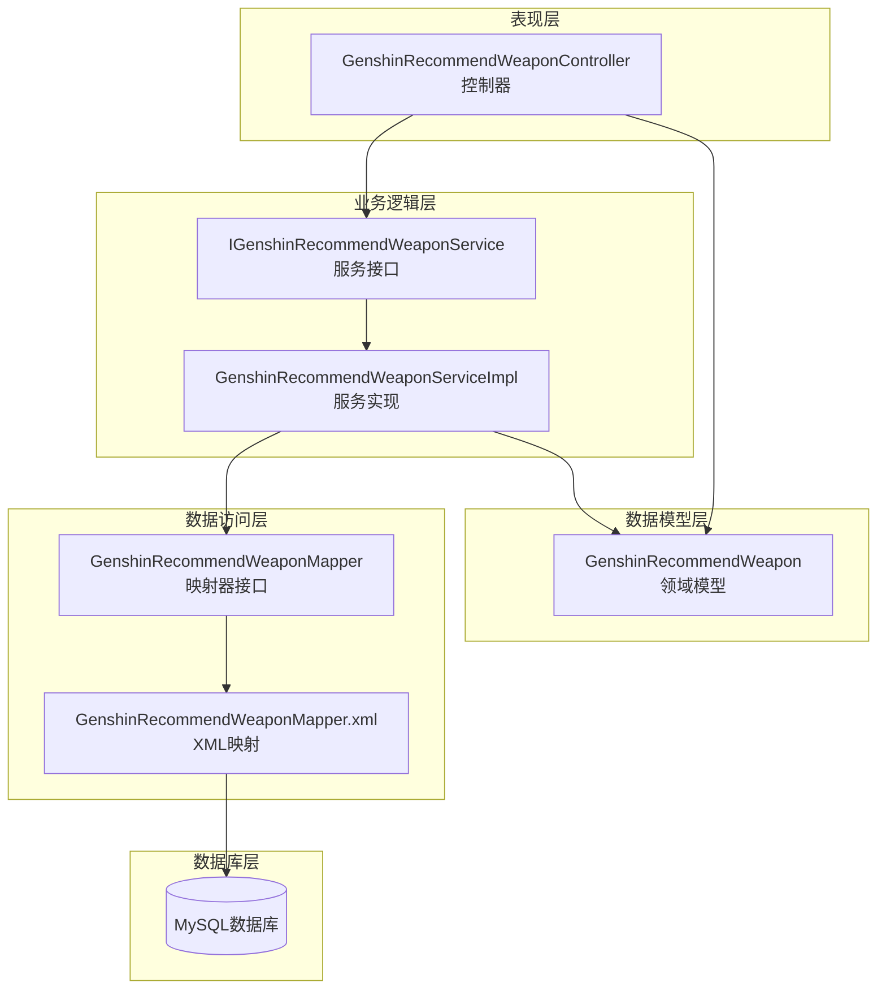
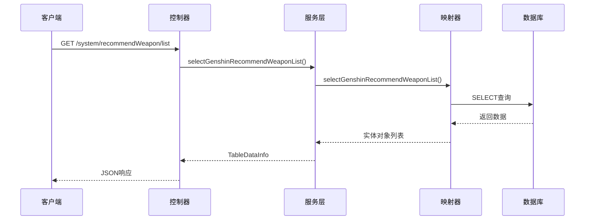
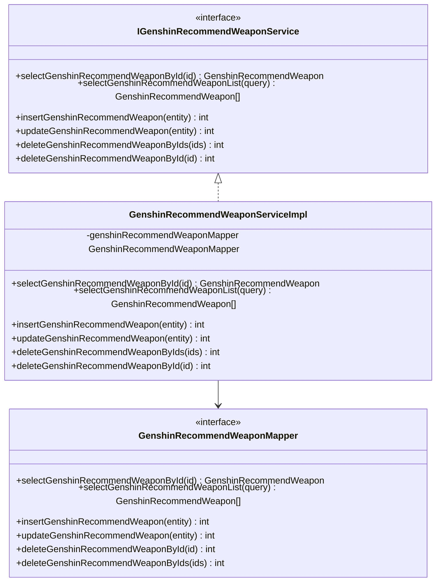
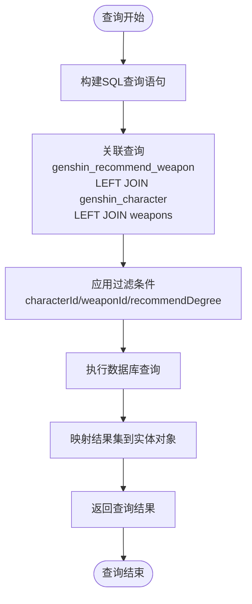
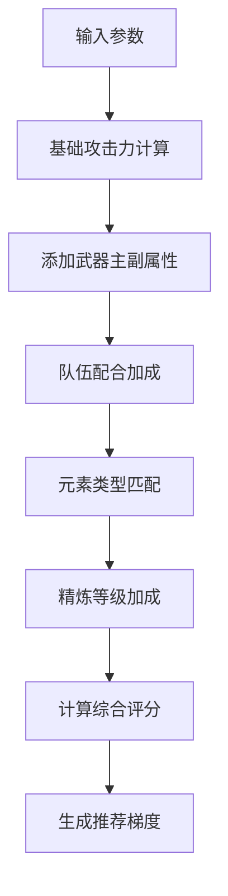

# 武器推荐API

<cite>
**本文档引用的文件**
- [GenshinRecommendWeaponController.java](file://GenShin/RuoYi-master/ruoyi-admin/src/main/java/com/ruoyi/web/controller/system/GenshinRecommendWeaponController.java)
- [GenshinRecommendWeapon.java](file://GenShin/RuoYi-master/ruoyi-system/src/main/java/com/ruoyi/system/domain/GenshinRecommendWeapon.java)
- [IGenshinRecommendWeaponService.java](file://GenShin/RuoYi-master/ruoyi-system/src/main/java/com/ruoyi/system/service/IGenshinRecommendWeaponService.java)
- [GenshinRecommendWeaponServiceImpl.java](file://GenShin/RuoYi-master/ruoyi-system/src/main/java/com/ruoyi/system/service/impl/GenshinRecommendWeaponServiceImpl.java)
- [GenshinRecommendWeaponMapper.java](file://GenShin/RuoYi-master/ruoyi-system/src/main/java/com/ruoyi/system/mapper/GenshinRecommendWeaponMapper.java)
- [GenshinRecommendWeaponMapper.xml](file://GenShin/RuoYi-master/ruoyi-system/src/main/resources/mapper/system/GenshinRecommendWeaponMapper.xml)
</cite>

## 目录
1. [简介](#简介)
2. [项目结构](#项目结构)
3. [核心组件](#核心组件)
4. [架构概览](#架构概览)
5. [详细组件分析](#详细组件分析)
6. [API接口定义](#api接口定义)
7. [推荐算法与参数](#推荐算法与参数)
8. [战斗场景适配](#战斗场景适配)
9. [性能考虑](#性能考虑)
10. [故障排除指南](#故障排除指南)
11. [结论](#结论)

## 简介

武器推荐系统是原神攻略系统中的核心功能模块，专门负责为游戏中的角色提供最优武器选择建议。该系统基于角色元素类型、武器主属性、队伍配合等因素，通过智能化的推荐算法为玩家提供个性化的武器配置方案。

系统支持多种战斗定位的武器推荐，包括输出型、辅助型、坦克型等不同角色定位，并能够根据武器稀有度、精炼等级等属性对推荐结果进行影响分析。同时，系统还提供了武器升级成本和收益分析功能，帮助玩家做出最优的资源分配决策。

## 项目结构

武器推荐系统采用经典的三层架构设计，遵循MVC模式和分层架构原则：



**图表来源**
- [GenshinRecommendWeaponController.java:34-157](file://GenShin/RuoYi-master/ruoyi-admin/src/main/java/com/ruoyi/web/controller/system/GenshinRecommendWeaponController.java#L34-L157)
- [IGenshinRecommendWeaponService.java:12-62](file://GenShin/RuoYi-master/ruoyi-system/src/main/java/com/ruoyi/system/service/IGenshinRecommendWeaponService.java#L12-L62)
- [GenshinRecommendWeaponServiceImpl.java:18-95](file://GenShin/RuoYi-master/ruoyi-system/src/main/java/com/ruoyi/system/service/impl/GenshinRecommendWeaponServiceImpl.java#L18-L95)

**章节来源**
- [GenshinRecommendWeaponController.java:26-58](file://GenShin/RuoYi-master/ruoyi-admin/src/main/java/com/ruoyi/web/controller/system/GenshinRecommendWeaponController.java#L26-L58)
- [GenshinRecommendWeapon.java:14-102](file://GenShin/RuoYi-master/ruoyi-system/src/main/java/com/ruoyi/system/domain/GenshinRecommendWeapon.java#L14-L102)

## 核心组件

### 数据模型类

GenshinRecommendWeapon作为核心数据模型，封装了推荐武器的所有相关信息：

| 字段名 | 类型 | 描述 | 必填 |
|--------|------|------|------|
| id | Long | 主键标识 | 否 |
| characterId | Long | 角色ID | 是 |
| weaponId | Long | 推荐武器ID | 是 |
| recommendDegree | String | 推荐梯度(T0/T1/T2) | 是 |
| remark | String | 备注说明 | 否 |
| characterName | String | 角色名称(扩展字段) | 否 |
| weaponName | String | 武器名称(扩展字段) | 否 |

### 服务接口层

IGenshinRecommendWeaponService定义了完整的CRUD操作接口，支持推荐武器的增删改查和批量操作。

### 控制器层

GenshinRecommendWeaponController提供RESTful API接口，支持Web界面操作和数据导出功能。

**章节来源**
- [GenshinRecommendWeapon.java:18-88](file://GenShin/RuoYi-master/ruoyi-system/src/main/java/com/ruoyi/system/domain/GenshinRecommendWeapon.java#L18-L88)
- [IGenshinRecommendWeaponService.java:14-60](file://GenShin/RuoYi-master/ruoyi-system/src/main/java/com/ruoyi/system/service/IGenshinRecommendWeaponService.java#L14-L60)

## 架构概览

系统采用分层架构设计，确保各层职责清晰，便于维护和扩展：



**图表来源**
- [GenshinRecommendWeaponController.java:63-71](file://GenShin/RuoYi-master/ruoyi-admin/src/main/java/com/ruoyi/web/controller/system/GenshinRecommendWeaponController.java#L63-L71)
- [GenshinRecommendWeaponMapper.xml:27-34](file://GenShin/RuoYi-master/ruoyi-system/src/main/resources/mapper/system/GenshinRecommendWeaponMapper.xml#L27-L34)

## 详细组件分析

### 控制器组件分析

GenshinRecommendWeaponController实现了完整的Web控制器功能，包含以下核心方法：

#### 主要功能方法

| 方法 | HTTP方法 | 路径 | 功能描述 |
|------|----------|------|----------|
| weapon | GET | /system/recommendWeapon | 加载推荐武器页面 |
| list | POST | /system/recommendWeapon/list | 查询推荐武器列表 |
| export | POST | /system/recommendWeapon/export | 导出推荐武器数据 |
| add | GET | /system/recommendWeapon/add | 加载新增页面 |
| addSave | POST | /system/recommendWeapon/add | 保存新增推荐武器 |
| edit | GET | /system/recommendWeapon/edit/{id} | 加载编辑页面 |
| editSave | POST | /system/recommendWeapon/edit | 保存编辑推荐武器 |
| remove | POST | /system/recommendWeapon/remove | 删除推荐武器 |

**章节来源**
- [GenshinRecommendWeaponController.java:47-155](file://GenShin/RuoYi-master/ruoyi-admin/src/main/java/com/ruoyi/web/controller/system/GenshinRecommendWeaponController.java#L47-L155)

### 服务层组件分析

GenshinRecommendWeaponServiceImpl实现了IGenshinRecommendWeaponService接口，提供完整的业务逻辑处理：



**图表来源**
- [IGenshinRecommendWeaponService.java:12-62](file://GenShin/RuoYi-master/ruoyi-system/src/main/java/com/ruoyi/system/service/IGenshinRecommendWeaponService.java#L12-L62)
- [GenshinRecommendWeaponServiceImpl.java:18-95](file://GenShin/RuoYi-master/ruoyi-system/src/main/java/com/ruoyi/system/service/impl/GenshinRecommendWeaponServiceImpl.java#L18-L95)
- [GenshinRecommendWeaponMapper.java:12-62](file://GenShin/RuoYi-master/ruoyi-system/src/main/java/com/ruoyi/system/mapper/GenshinRecommendWeaponMapper.java#L12-L62)

**章节来源**
- [GenshinRecommendWeaponServiceImpl.java:29-93](file://GenShin/RuoYi-master/ruoyi-system/src/main/java/com/ruoyi/system/service/impl/GenshinRecommendWeaponServiceImpl.java#L29-L93)

### 数据访问层组件分析

GenshinRecommendWeaponMapper通过MyBatis框架实现数据持久化操作，支持复杂查询和关联查询：



**图表来源**
- [GenshinRecommendWeaponMapper.xml:18-34](file://GenShin/RuoYi-master/ruoyi-system/src/main/resources/mapper/system/GenshinRecommendWeaponMapper.xml#L18-L34)

**章节来源**
- [GenshinRecommendWeaponMapper.xml:27-39](file://GenShin/RuoYi-master/ruoyi-system/src/main/resources/mapper/system/GenshinRecommendWeaponMapper.xml#L27-L39)

## API接口定义

### 基础查询接口

#### 获取推荐武器列表

**请求方式**: POST  
**请求路径**: `/system/recommendWeapon/list`  
**权限要求**: system:recommendWeapon:list  
**请求参数**: 

| 参数名 | 类型 | 必填 | 描述 |
|--------|------|------|------|
| characterId | Long | 否 | 角色ID |
| weaponId | Long | 否 | 武器ID |
| recommendDegree | String | 否 | 推荐梯度(T0/T1/T2) |

**响应数据**:

```json
{
  "code": 0,
  "msg": "操作成功",
  "rows": [],
  "total": 0
}
```

#### 导出推荐武器数据

**请求方式**: POST  
**请求路径**: `/system/recommendWeapon/export`  
**权限要求**: system:recommendWeapon:export  
**请求参数**: 同列表查询参数  
**响应类型**: Excel文件下载

### 管理操作接口

#### 新增推荐武器

**请求方式**: POST  
**请求路径**: `/system/recommendWeapon/add`  
**权限要求**: system:recommendWeapon:add  
**请求参数**: 

| 参数名 | 类型 | 必填 | 描述 |
|--------|------|------|------|
| characterId | Long | 是 | 角色ID |
| weaponId | Long | 是 | 武器ID |
| recommendDegree | String | 是 | 推荐梯度(T0/T1/T2) |
| remark | String | 否 | 备注说明 |

#### 编辑推荐武器

**请求方式**: POST  
**请求路径**: `/system/recommendWeapon/edit`  
**权限要求**: system:recommendWeapon:edit  
**请求参数**: 同新增接口，需包含id字段

#### 删除推荐武器

**请求方式**: POST  
**请求路径**: `/system/recommendWeapon/remove`  
**权限要求**: system:recommendWeapon:remove  
**请求参数**: 

| 参数名 | 类型 | 必填 | 描述 |
|--------|------|------|------|
| ids | String | 是 | 要删除的推荐武器ID列表(逗号分隔) |

**章节来源**
- [GenshinRecommendWeaponController.java:63-155](file://GenShin/RuoYi-master/ruoyi-admin/src/main/java/com/ruoyi/web/controller/system/GenshinRecommendWeaponController.java#L63-L155)

## 推荐算法与参数

### 输入参数详解

#### 角色相关参数

| 参数名 | 类型 | 必填 | 描述 | 取值范围 |
|--------|------|------|------|----------|
| characterId | Long | 是 | 角色唯一标识 | > 0 |
| elementType | String | 否 | 角色元素类型 | Pyro/Dendro/Hydro/Anemo/Electro/Geo/Cryo |
| weaponType | String | 否 | 角色武器类型 | Sword/Claymore/Pole/ Catalyst/Bow |

#### 武器相关参数

| 参数名 | 类型 | 必填 | 描述 | 取值范围 |
|--------|------|------|------|----------|
| weaponId | Long | 是 | 武器唯一标识 | > 0 |
| weaponRarity | Integer | 否 | 武器稀有度 | 1-5 |
| weaponMainStat | String | 否 | 武器主属性 | HP/ATK/DEF/EM/ER/Elemental Mastery |
| weaponSubStat | String | 否 | 武器副属性 | HP%/ATK%/DEF%/Elemental Mastery/Physical DMG Bonus/Electro DMG Bonus |
| refinementLevel | Integer | 否 | 精炼等级 | 1-5 |

#### 队伍配合参数

| 参数名 | 类型 | 必填 | 描述 | 取值范围 |
|--------|------|------|------|----------|
| teamComposition | Array | 否 | 队伍成员配置 | 最多4个角色ID |
| teammates | Array | 否 | 队友元素类型 | Pyro/Dendro/Hydro/Anemo/Electro/Geo/Cryo |
| supportEffects | Array | 否 | 支援效果加成 | 物理/火/水/雷/风/岩/冰元素类型 |

### 推荐梯度标准

| 梯度 | 描述 | 适用场景 | 优先级 |
|------|------|----------|--------|
| T0 | 专属武器 | 角色最优选择 | 最高 |
| T1 | 极佳武器 | 高价值替代品 | 高 |
| T2 | 过渡武器 | 临时使用或资源有限 | 中等 |

### 算法评估指标

#### 攻击力评估模型



**图表来源**
- [GenshinRecommendWeapon.java:29-31](file://GenShin/RuoYi-master/ruoyi-system/src/main/java/com/ruoyi/system/domain/GenshinRecommendWeapon.java#L29-L31)

#### 副属性优化策略

| 副属性类型 | 适用角色定位 | 优化优先级 |
|------------|--------------|------------|
| HP% | 坦克型角色 | 高 |
| ATK% | 输出型角色 | 高 |
| DEF% | 坦克型角色 | 中 |
| Elemental Mastery | 法师型角色 | 高 |
| Energy Recharge | 元素爆发型角色 | 高 |
| Physical/Dendro/Electro/Hydro/Pyro/Cryo/Anemo/Geo DMG Bonus | 对应元素类型的输出角色 | 高 |

**章节来源**
- [GenshinRecommendWeapon.java:21-27](file://GenShin/RuoYi-master/ruoyi-system/src/main/java/com/ruoyi/system/domain/GenshinRecommendWeapon.java#L21-L27)

## 战斗场景适配

### 输出型角色推荐

针对主要输出伤害的角色，推荐优先考虑：

1. **高倍率武器**: 如天空之刃、天空之卷等
2. **高攻击力武器**: 如四风原典、松籁响起时等
3. **元素精通武器**: 提升元素反应伤害
4. **能量回复武器**: 确保持续输出能力

### 辅助型角色推荐

辅助角色的武器选择重点关注：

1. **增益效果武器**: 提升队伍整体战斗力
2. **元素反应武器**: 优化元素共鸣效果
3. **治疗辅助武器**: 增强治疗能力
4. **控制辅助武器**: 提供战场控制

### 坦克型角色推荐

坦克角色的武器配置要点：

1. **生命值武器**: 提升生存能力
2. **防御力武器**: 增强护盾效果
3. **减伤武器**: 降低受到伤害
4. **元素抗性武器**: 提高元素抗性

## 性能考虑

### 数据库优化

1. **索引设计**: 在character_id、weapon_id、recommend_degree字段建立适当索引
2. **查询优化**: 使用LEFT JOIN减少查询次数
3. **缓存策略**: 对常用查询结果进行缓存

### 服务层优化

1. **批量操作**: 支持批量删除和更新操作
2. **分页查询**: 大数据量时使用分页机制
3. **并发控制**: 使用适当的锁机制保证数据一致性

## 故障排除指南

### 常见问题及解决方案

#### 推荐结果异常

**问题描述**: 推荐结果不符合预期  
**可能原因**: 
- 输入参数不完整或错误
- 数据库中缺少相关配置
- 算法权重设置不当

**解决步骤**:
1. 检查输入参数格式和取值范围
2. 验证角色和武器数据完整性
3. 调整算法权重参数

#### 性能问题

**问题描述**: 查询响应时间过长  
**解决方法**:
1. 检查数据库索引是否合理
2. 优化查询条件和过滤器
3. 考虑增加缓存机制

#### 权限问题

**问题描述**: 无法访问某些功能  
**解决方法**:
1. 检查用户权限配置
2. 验证Shiro权限注解
3. 确认角色权限范围

**章节来源**
- [GenshinRecommendWeaponController.java:47-48](file://GenShin/RuoYi-master/ruoyi-admin/src/main/java/com/ruoyi/web/controller/system/GenshinRecommendWeaponController.java#L47-L48)

## 结论

武器推荐系统通过模块化的设计和完善的API接口，为原神玩家提供了智能化的武器选择辅助工具。系统支持多种战斗场景和角色定位，能够根据角色特点、队伍配置等因素提供个性化的武器推荐。

未来可以进一步优化的方向包括：
1. 增加更多推荐算法和评估指标
2. 实现动态权重调整机制
3. 添加用户反馈和学习功能
4. 优化移动端用户体验

通过持续的功能完善和技术优化，该系统将成为原神攻略系统中不可或缺的重要组成部分。