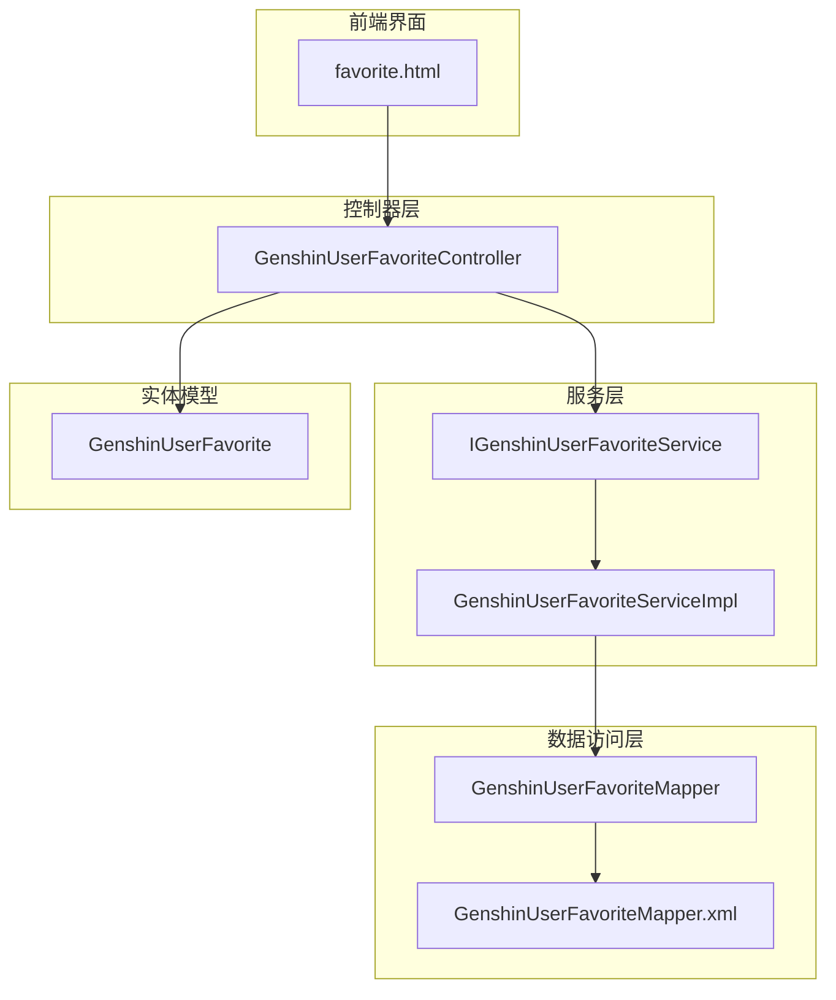
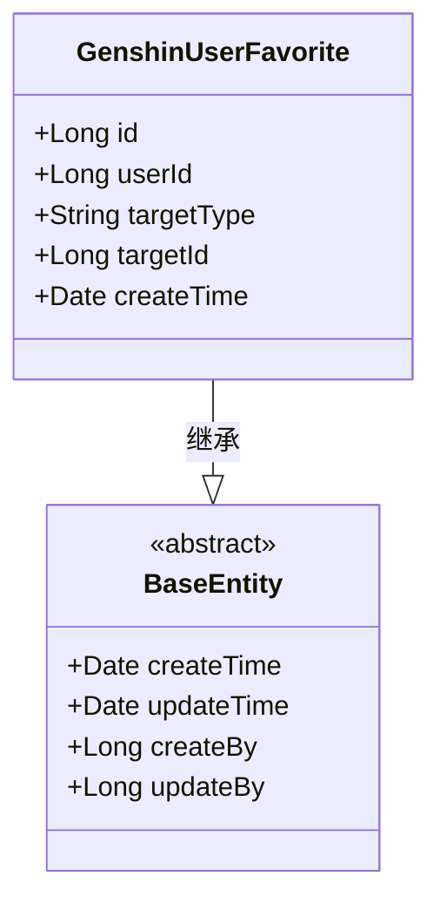
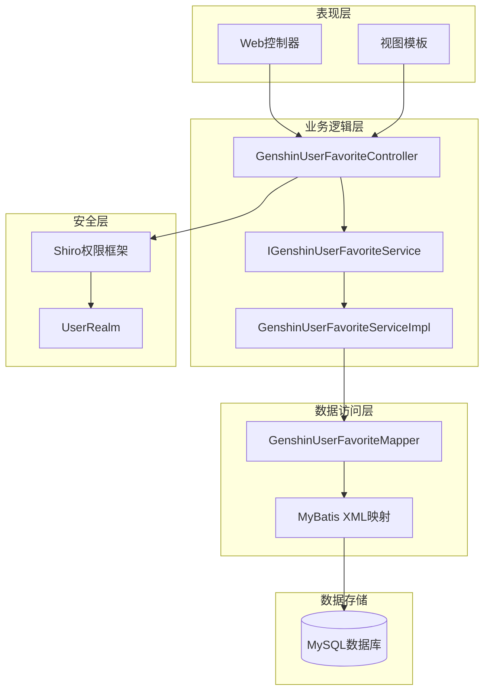
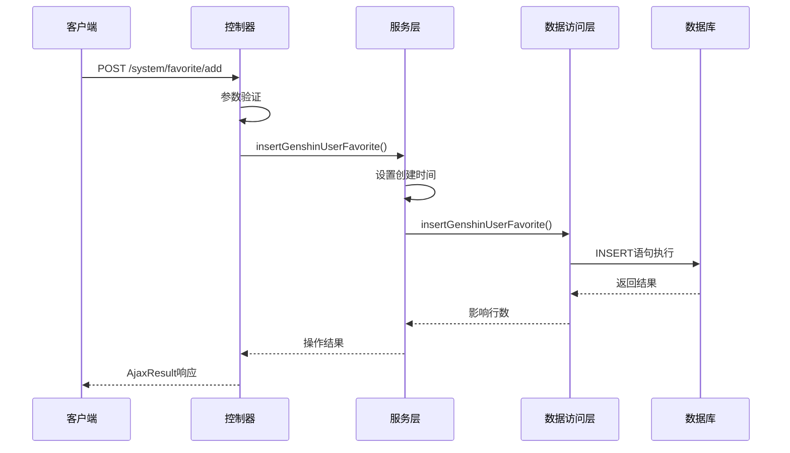
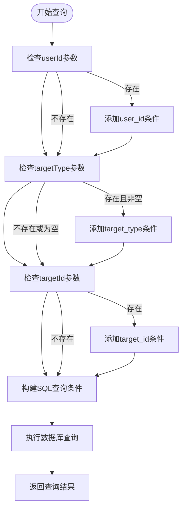
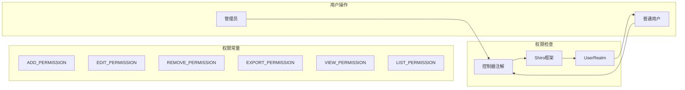
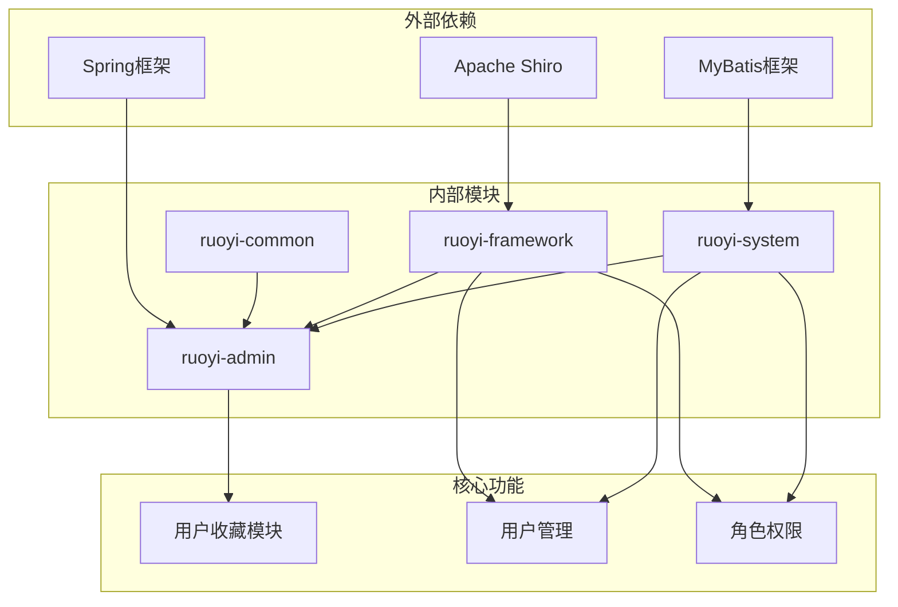
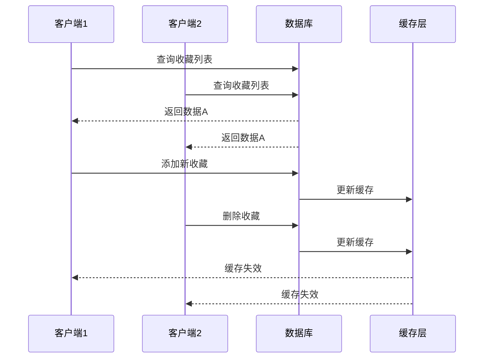

# 用户收藏API

<cite>
**本文档引用的文件**
- [GenshinUserFavoriteController.java](file://ruoyi-admin/src/main/java/com/ruoyi/web/controller/system/GenshinUserFavoriteController.java)
- [GenshinUserFavorite.java](file://ruoyi-system/src/main/java/com/ruoyi/system/domain/GenshinUserFavorite.java)
- [IGenshinUserFavoriteService.java](file://ruoyi-system/src/main/java/com/ruoyi/system/service/IGenshinUserFavoriteService.java)
- [GenshinUserFavoriteServiceImpl.java](file://ruoyi-system/src/main/java/com/ruoyi/system/service/impl/GenshinUserFavoriteServiceImpl.java)
- [GenshinUserFavoriteMapper.java](file://ruoyi-system/src/main/java/com/ruoyi/system/mapper/GenshinUserFavoriteMapper.java)
- [GenshinUserFavoriteMapper.xml](file://ruoyi-system/src/main/resources/mapper/system/GenshinUserFavoriteMapper.xml)
- [favorite.html](file://ruoyi-admin/src/main/resources/templates/system/favorite/favorite.html)
- [PermissionConstants.java](file://ruoyi-common/src/main/java/com/ruoyi/common/constant/PermissionConstants.java)
- [PermissionUtils.java](file://ruoyi-common/src/main/java/com/ruoyi/common/utils/security/PermissionUtils.java)
- [ShiroConfig.java](file://ruoyi-framework/src/main/java/com/ruoyi/framework/config/ShiroConfig.java)
- [UserRealm.java](file://ruoyi-framework/src/main/java/com/ruoyi/framework/shiro/realm/UserRealm.java)
</cite>

## 目录
1. [简介](#简介)
2. [项目结构](#项目结构)
3. [核心组件](#核心组件)
4. [架构概览](#架构概览)
5. [详细组件分析](#详细组件分析)
6. [依赖关系分析](#依赖关系分析)
7. [性能考虑](#性能考虑)
8. [故障排除指南](#故障排除指南)
9. [结论](#结论)

## 简介

用户收藏API是原神攻略系统中的核心功能模块，用于管理用户的收藏内容。该系统基于若依框架构建，提供了完整的收藏管理功能，包括角色收藏、武器收藏、圣遗物收藏、队伍收藏等多种类型的收藏管理。

系统支持多设备间的收藏数据同步，通过权限控制系统确保数据安全性和隐私性。用户可以通过统一的API接口进行收藏的添加、删除、查询和批量操作。

## 项目结构

用户收藏功能在项目中的组织结构如下：

**图表来源**
- [GenshinUserFavoriteController.java:1-129](file://ruoyi-admin/src/main/java/com/ruoyi/web/controller/system/GenshinUserFavoriteController.java#L1-L129)
- [GenshinUserFavoriteServiceImpl.java:1-97](file://ruoyi-system/src/main/java/com/ruoyi/system/service/impl/GenshinUserFavoriteServiceImpl.java#L1-L97)
- [GenshinUserFavoriteMapper.java:1-62](file://ruoyi-system/src/main/java/com/ruoyi/system/mapper/GenshinUserFavoriteMapper.java#L1-L62)

**章节来源**
- [GenshinUserFavoriteController.java:1-129](file://ruoyi-admin/src/main/java/com/ruoyi/web/controller/system/GenshinUserFavoriteController.java#L1-L129)
- [GenshinUserFavorite.java:1-84](file://ruoyi-system/src/main/java/com/ruoyi/system/domain/GenshinUserFavorite.java#L1-L84)

## 核心组件

### 数据模型设计

用户收藏系统的核心数据模型采用简洁而高效的设计：

**图表来源**
- [GenshinUserFavorite.java:14-84](file://ruoyi-system/src/main/java/com/ruoyi/system/domain/GenshinUserFavorite.java#L14-L84)

### 收藏类型标识

系统支持多种收藏类型，通过`targetType`字段进行区分：

| 类型标识 | 对象类型 | 描述 |
|---------|---------|------|
| `character` | 角色 | 原神游戏中的可玩角色 |
| `weapon` | 武器 | 角色使用的武器装备 |
| `artifact` | 圣遗物 | 角色穿戴的圣遗物套装 |
| `team` | 队伍 | 角色组合配置方案 |
| `domain` | 地区 | 游戏中的探索区域 |
| `enemy` | 敌人 | 游戏中的敌对生物 |

**章节来源**
- [GenshinUserFavorite.java:25-31](file://ruoyi-system/src/main/java/com/ruoyi/system/domain/GenshinUserFavorite.java#L25-L31)

## 架构概览

用户收藏系统的整体架构采用经典的三层架构模式：

**图表来源**
- [GenshinUserFavoriteController.java:28-35](file://ruoyi-admin/src/main/java/com/ruoyi/web/controller/system/GenshinUserFavoriteController.java#L28-L35)
- [GenshinUserFavoriteServiceImpl.java:18-22](file://ruoyi-system/src/main/java/com/ruoyi/system/service/impl/GenshinUserFavoriteServiceImpl.java#L18-L22)

## 详细组件分析

### 控制器层

控制器负责处理HTTP请求和响应，提供RESTful API接口：

#### 主要接口

| 接口 | 方法 | 路径 | 权限 | 功能描述 |
|------|------|------|------|----------|
| 收藏列表 | POST | `/system/favorite/list` | `system:favorite:list` | 查询收藏列表 |
| 添加收藏 | POST | `/system/favorite/add` | `system:favorite:add` | 创建新的收藏 |
| 编辑收藏 | POST | `/system/favorite/edit` | `system:favorite:edit` | 更新收藏信息 |
| 删除收藏 | POST | `/system/favorite/remove` | `system:favorite:remove` | 删除收藏记录 |
| 导出收藏 | POST | `/system/favorite/export` | `system:favorite:export` | 导出收藏数据 |

**章节来源**
- [GenshinUserFavoriteController.java:37-127](file://ruoyi-admin/src/main/java/com/ruoyi/web/controller/system/GenshinUserFavoriteController.java#L37-L127)

### 服务层

服务层提供业务逻辑处理，包含完整的CRUD操作：

**图表来源**
- [GenshinUserFavoriteController.java:84-91](file://ruoyi-admin/src/main/java/com/ruoyi/web/controller/system/GenshinUserFavoriteController.java#L84-L91)
- [GenshinUserFavoriteServiceImpl.java:54-59](file://ruoyi-system/src/main/java/com/ruoyi/system/service/impl/GenshinUserFavoriteServiceImpl.java#L54-L59)

**章节来源**
- [IGenshinUserFavoriteService.java:12-61](file://ruoyi-system/src/main/java/com/ruoyi/system/service/IGenshinUserFavoriteService.java#L12-L61)
- [GenshinUserFavoriteServiceImpl.java:18-96](file://ruoyi-system/src/main/java/com/ruoyi/system/service/impl/GenshinUserFavoriteServiceImpl.java#L18-L96)

### 数据访问层

数据访问层使用MyBatis框架实现数据持久化：

#### 查询条件过滤

系统支持灵活的查询条件过滤：

**图表来源**
- [GenshinUserFavoriteMapper.xml:19-26](file://ruoyi-system/src/main/resources/mapper/system/GenshinUserFavoriteMapper.xml#L19-L26)

**章节来源**
- [GenshinUserFavoriteMapper.java:12-61](file://ruoyi-system/src/main/java/com/ruoyi/system/mapper/GenshinUserFavoriteMapper.java#L12-L61)
- [GenshinUserFavoriteMapper.xml:15-26](file://ruoyi-system/src/main/resources/mapper/system/GenshinUserFavoriteMapper.xml#L15-L26)

### 权限控制系统

系统采用Shiro框架实现细粒度的权限控制：

**图表来源**
- [PermissionConstants.java:8-27](file://ruoyi-common/src/main/java/com/ruoyi/common/constant/PermissionConstants.java#L8-L27)
- [GenshinUserFavoriteController.java:37-127](file://ruoyi-admin/src/main/java/com/ruoyi/web/controller/system/GenshinUserFavoriteController.java#L37-L127)

**章节来源**
- [PermissionConstants.java:1-27](file://ruoyi-common/src/main/java/com/ruoyi/common/constant/PermissionConstants.java#L1-L27)
- [PermissionUtils.java:47-81](file://ruoyi-common/src/main/java/com/ruoyi/common/utils/security/PermissionUtils.java#L47-L81)

## 依赖关系分析

用户收藏系统的依赖关系如下：

**图表来源**
- [GenshinUserFavoriteController.java:1-20](file://ruoyi-admin/src/main/java/com/ruoyi/web/controller/system/GenshinUserFavoriteController.java#L1-L20)
- [GenshinUserFavoriteServiceImpl.java:1-11](file://ruoyi-system/src/main/java/com/ruoyi/system/service/impl/GenshinUserFavoriteServiceImpl.java#L1-L11)

**章节来源**
- [ShiroConfig.java:60-371](file://ruoyi-framework/src/main/java/com/ruoyi/framework/config/ShiroConfig.java#L60-L371)
- [UserRealm.java:40-70](file://ruoyi-framework/src/main/java/com/ruoyi/framework/shiro/realm/UserRealm.java#L40-L70)

## 性能考虑

### 数据库优化

1. **索引设计**
   - `user_id`：用户维度查询优化
   - `target_type`：类型维度查询优化  
   - `target_id`：目标对象查询优化

2. **查询优化**
   - 使用条件过滤避免全表扫描
   - 支持多条件组合查询
   - 分页查询避免大数据量传输

3. **缓存策略**
   - 前端表格缓存
   - 后端查询结果缓存
   - 配置信息缓存

### 并发控制

系统通过以下机制保证数据一致性：

## 故障排除指南

### 常见问题及解决方案

| 问题类型 | 症状 | 可能原因 | 解决方案 |
|----------|------|----------|----------|
| 权限不足 | 403 Forbidden | 缺少相应权限 | 检查用户角色权限 |
| 数据查询异常 | 查询结果为空 | 查询条件不匹配 | 验证查询参数 |
| 数据更新失败 | 更新操作返回0 | 主键不存在或版本冲突 | 检查数据状态 |
| 批量操作异常 | 部分数据未删除 | ID格式错误 | 验证ID格式和权限 |

### 日志监控

系统提供完善的日志记录机制：

1. **操作日志**：记录所有收藏操作
2. **异常日志**：捕获并记录异常信息
3. **性能日志**：监控查询性能
4. **安全日志**：记录权限访问情况

**章节来源**
- [GenshinUserFavoriteController.java:59-69](file://ruoyi-admin/src/main/java/com/ruoyi/web/controller/system/GenshinUserFavoriteController.java#L59-L69)

## 结论

用户收藏API模块提供了完整、高效的收藏管理功能。系统采用现代化的技术栈和设计模式，具有以下特点：

1. **功能完整**：支持收藏的全生命周期管理
2. **扩展性强**：模块化设计便于功能扩展
3. **安全性高**：完善的权限控制和数据保护
4. **性能优良**：合理的数据库设计和查询优化
5. **易维护**：清晰的代码结构和文档

该模块为原神攻略系统提供了坚实的基础，能够满足用户对收藏内容管理的各种需求，并为未来的功能扩展奠定了良好的基础。