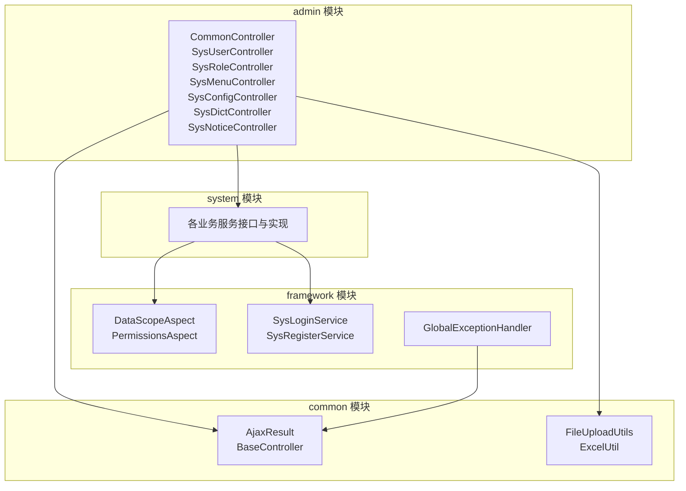
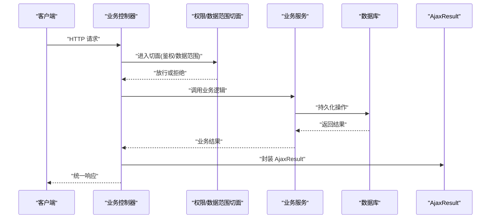
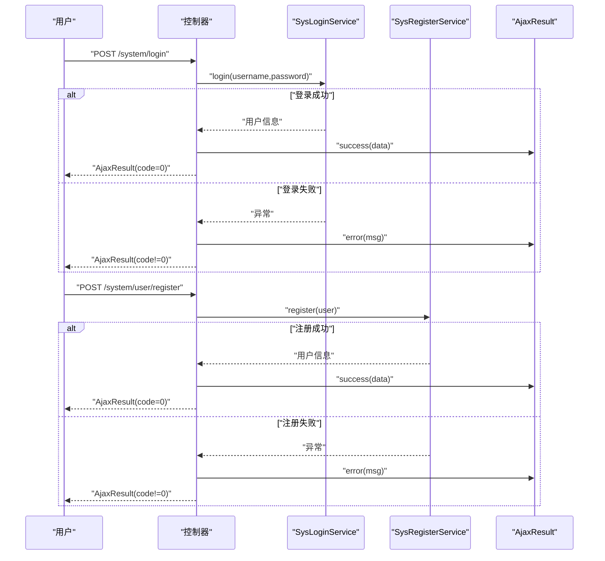
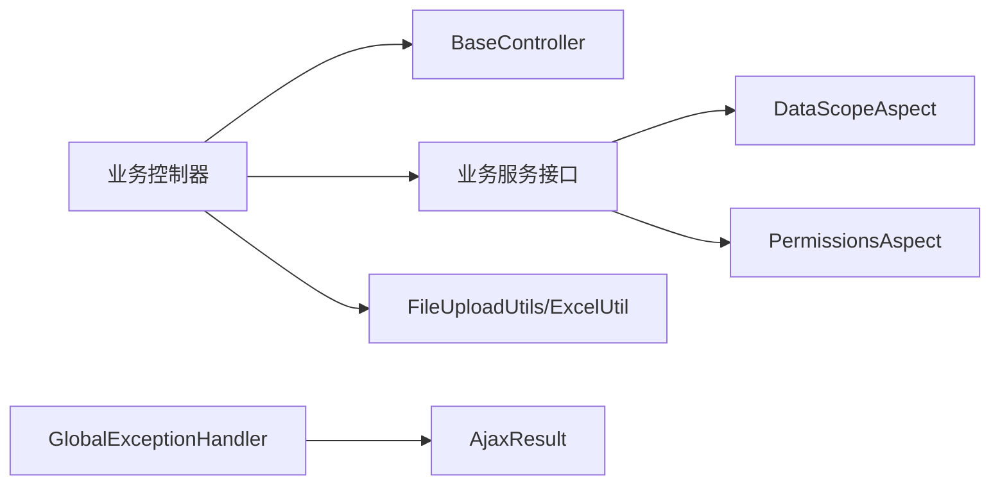

# 系统通用API

<cite>
**本文引用的文件**
- [AjaxResult.java](file://ruoyi-common/src/main/java/com/ruoyi/common/core/domain/AjaxResult.java)
- [BaseController.java](file://ruoyi-common/src/main/java/com/ruoyi/common/core/controller/BaseController.java)
- [SysUserController.java](file://ruoyi-admin/src/main/java/com/ruoyi/web/controller/system/SysUserController.java)
- [SysRoleController.java](file://ruoyi-admin/src/main/java/com/ruoyi/web/controller/system/SysRoleController.java)
- [SysMenuController.java](file://ruoyi-admin/src/main/java/com/ruoyi/web/controller/system/SysMenuController.java)
- [SysConfigController.java](file://ruoyi-admin/src/main/java/com/ruoyi/web/controller/system/SysConfigController.java)
- [SysDictController.java](file://ruoyi-admin/src/main/java/com/ruoyi/web/controller/system/SysDictController.java)
- [SysNoticeController.java](file://ruoyi-admin/src/main/java/com/ruoyi/web/controller/system/SysNoticeController.java)
- [CommonController.java](file://ruoyi-admin/src/main/java/com/ruoyi/web/controller/common/CommonController.java)
- [FileUploadUtils.java](file://ruoyi-common/src/main/java/com/ruoyi/common/utils/file/FileUploadUtils.java)
- [ExcelUtil.java](file://ruoyi-common/src/main/java/com/ruoyi/common/utils/poi/ExcelUtil.java)
- [CaptchaConfig.java](file://ruoyi-framework/src/main/java/com/ruoyi/framework/config/CaptchaConfig.java)
- [SysLoginService.java](file://ruoyi-framework/src/main/java/com/ruoyi/framework/shiro/service/SysLoginService.java)
- [SysRegisterService.java](file://ruoyi-framework/src/main/java/com/ruoyi/framework/shiro/service/SysRegisterService.java)
- [DataScopeAspect.java](file://ruoyi-framework/src/main/java/com/ruoyi/framework/aspectj/DataScopeAspect.java)
- [PermissionsAspect.java](file://ruoyi-framework/src/main/java/com/ruoyi/framework/aspectj/PermissionsAspect.java)
- [GlobalExceptionHandler.java](file://ruoyi-framework/src/main/java/com/ruoyi/framework/web/exception/GlobalExceptionHandler.java)
- [application.yml](file://ruoyi-admin/src/main/resources/application.yml)
</cite>

## 目录
1. [简介](#简介)
2. [项目结构](#项目结构)
3. [核心组件](#核心组件)
4. [架构总览](#架构总览)
5. [详细组件分析](#详细组件分析)
6. [依赖关系分析](#依赖关系分析)
7. [性能考虑](#性能考虑)
8. [故障排查指南](#故障排查指南)
9. [结论](#结论)
10. [附录](#附录)

## 简介
本文件为系统通用功能的API文档，覆盖用户管理、角色权限、系统配置、字典数据、通知公告等基础能力，并对统一响应格式 AjaxResult 的使用规范与错误码进行说明。同时包含文件上传、数据导出、验证码等辅助功能接口说明，帮助前后端协作实现一致的交互体验。

## 项目结构
系统采用多模块分层架构：通用工具与基础模型在 common 模块；框架层（安全、拦截、异常处理）在 framework 模块；业务模块在 system 模块；管理端控制器在 admin 模块。API 控制器位于 admin 模块的 web.controller 包下，通过 BaseController 统一输出 AjaxResult 响应。

图示来源
- [BaseController.java:1-200](file://ruoyi-common/src/main/java/com/ruoyi/common/core/controller/BaseController.java#L1-L200)
- [AjaxResult.java:1-200](file://ruoyi-common/src/main/java/com/ruoyi/common/core/domain/AjaxResult.java#L1-L200)
- [CommonController.java:1-200](file://ruoyi-admin/src/main/java/com/ruoyi/web/controller/common/CommonController.java#L1-L200)
- [SysUserController.java:1-200](file://ruoyi-admin/src/main/java/com/ruoyi/web/controller/system/SysUserController.java#L1-L200)
- [SysRoleController.java:1-200](file://ruoyi-admin/src/main/java/com/ruoyi/web/controller/system/SysRoleController.java#L1-L200)
- [SysMenuController.java:1-200](file://ruoyi-admin/src/main/java/com/ruoyi/web/controller/system/SysMenuController.java#L1-L200)
- [SysConfigController.java:1-200](file://ruoyi-admin/src/main/java/com/ruoyi/web/controller/system/SysConfigController.java#L1-L200)
- [SysDictController.java:1-200](file://ruoyi-admin/src/main/java/com/ruoyi/web/controller/system/SysDictController.java#L1-L200)
- [SysNoticeController.java:1-200](file://ruoyi-admin/src/main/java/com/ruoyi/web/controller/system/SysNoticeController.java#L1-L200)
- [DataScopeAspect.java:1-200](file://ruoyi-framework/src/main/java/com/ruoyi/framework/aspectj/DataScopeAspect.java#L1-L200)
- [PermissionsAspect.java:1-200](file://ruoyi-framework/src/main/java/com/ruoyi/framework/aspectj/PermissionsAspect.java#L1-L200)
- [SysLoginService.java:1-200](file://ruoyi-framework/src/main/java/com/ruoyi/framework/shiro/service/SysLoginService.java#L1-L200)
- [SysRegisterService.java:1-200](file://ruoyi-framework/src/main/java/com/ruoyi/framework/shiro/service/SysRegisterService.java#L1-L200)
- [GlobalExceptionHandler.java:1-200](file://ruoyi-framework/src/main/java/com/ruoyi/framework/web/exception/GlobalExceptionHandler.java#L1-L200)

章节来源
- [BaseController.java:1-200](file://ruoyi-common/src/main/java/com/ruoyi/common/core/controller/BaseController.java#L1-L200)
- [AjaxResult.java:1-200](file://ruoyi-common/src/main/java/com/ruoyi/common/core/domain/AjaxResult.java#L1-L200)

## 核心组件
- 统一响应格式 AjaxResult：封装成功/失败状态、消息与数据体，确保前后端一致的返回结构。
- 基础控制器 BaseController：提供便捷方法构造 AjaxResult，统一处理分页、树形结构等通用逻辑。
- 业务控制器：系统各功能模块的入口，如用户、角色、菜单、配置、字典、通知等。
- 安全与权限切面：数据范围限制与权限校验在请求进入控制器前执行。
- 全局异常处理器：捕获业务异常并转换为标准 AjaxResult 响应。

章节来源
- [AjaxResult.java:1-200](file://ruoyi-common/src/main/java/com/ruoyi/common/core/domain/AjaxResult.java#L1-L200)
- [BaseController.java:1-200](file://ruoyi-common/src/main/java/com/ruoyi/common/core/controller/BaseController.java#L1-L200)
- [GlobalExceptionHandler.java:1-200](file://ruoyi-framework/src/main/java/com/ruoyi/framework/web/exception/GlobalExceptionHandler.java#L1-L200)

## 架构总览
系统通过控制器接收请求，经由安全与权限切面完成鉴权与数据范围控制，再调用业务服务层处理具体逻辑，最终以 AjaxResult 返回结果。异常在全局处理器中统一捕获并格式化。

图示来源
- [SysUserController.java:1-200](file://ruoyi-admin/src/main/java/com/ruoyi/web/controller/system/SysUserController.java#L1-L200)
- [PermissionsAspect.java:1-200](file://ruoyi-framework/src/main/java/com/ruoyi/framework/aspectj/PermissionsAspect.java#L1-L200)
- [DataScopeAspect.java:1-200](file://ruoyi-framework/src/main/java/com/ruoyi/framework/aspectj/DataScopeAspect.java#L1-L200)
- [AjaxResult.java:1-200](file://ruoyi-common/src/main/java/com/ruoyi/common/core/domain/AjaxResult.java#L1-L200)

## 详细组件分析

### 用户管理API
- 用户注册
  - 接口路径：POST /system/user/register
  - 功能：校验参数后调用注册服务完成用户创建
  - 响应：AjaxResult，包含用户标识或错误信息
  - 权限：匿名可访问
  - 失败场景：用户名重复、密码强度不足、验证码错误
- 用户登录
  - 接口路径：POST /system/login
  - 功能：账号密码校验，生成会话令牌
  - 响应：AjaxResult，包含令牌与用户基本信息
  - 失败场景：账号不存在、密码错误、账户锁定
- 个人信息修改
  - 接口路径：PUT /system/user/profile
  - 功能：更新当前登录用户的个人资料
  - 响应：AjaxResult，包含更新后的用户信息
  - 失败场景：字段校验失败、无权限
- 用户列表查询
  - 接口路径：GET /system/user/list
  - 功能：分页查询用户列表，支持数据范围过滤
  - 响应：AjaxResult，包含分页数据
  - 失败场景：参数非法
- 角色分配
  - 接口路径：PUT /system/user/authRole
  - 功能：为用户分配角色
  - 响应：AjaxResult
  - 失败场景：用户不存在、角色无效

章节来源
- [SysUserController.java:1-200](file://ruoyi-admin/src/main/java/com/ruoyi/web/controller/system/SysUserController.java#L1-L200)
- [SysRegisterService.java:1-200](file://ruoyi-framework/src/main/java/com/ruoyi/framework/shiro/service/SysRegisterService.java#L1-L200)
- [SysLoginService.java:1-200](file://ruoyi-framework/src/main/java/com/ruoyi/framework/shiro/service/SysLoginService.java#L1-L200)

### 角色权限API
- 角色列表查询
  - 接口路径：GET /system/role/list
  - 功能：分页查询角色列表
  - 响应：AjaxResult，包含分页数据
- 角色新增/修改
  - 接口路径：POST /system/role 或 PUT /system/role
  - 功能：创建或更新角色
  - 响应：AjaxResult
- 角色删除
  - 接口路径：DELETE /system/role/{roleId}
  - 功能：删除指定角色
  - 响应：AjaxResult
- 菜单授权
  - 接口路径：PUT /system/role/authUser
  - 功能：批量授权用户角色
  - 响应：AjaxResult

章节来源
- [SysRoleController.java:1-200](file://ruoyi-admin/src/main/java/com/ruoyi/web/controller/system/SysRoleController.java#L1-L200)

### 菜单与访问控制API
- 菜单树形结构
  - 接口路径：GET /system/menu/treeselect
  - 功能：获取菜单树用于选择
  - 响应：AjaxResult，包含树形菜单
- 当前用户菜单
  - 接口路径：GET /system/menu/getRouters
  - 功能：返回当前用户可访问的路由树
  - 响应：AjaxResult，包含路由集合
- 数据范围限制
  - 切面：DataScopeAspect 在控制器前执行，按部门维度过滤数据
  - 影响范围：所有受保护的查询接口

章节来源
- [SysMenuController.java:1-200](file://ruoyi-admin/src/main/java/com/ruoyi/web/controller/system/SysMenuController.java#L1-L200)
- [DataScopeAspect.java:1-200](file://ruoyi-framework/src/main/java/com/ruoyi/framework/aspectj/DataScopeAspect.java#L1-L200)

### 系统配置API
- 配置列表查询
  - 接口路径：GET /system/config/list
  - 功能：分页查询系统配置
  - 响应：AjaxResult，包含分页数据
- 新增/修改配置
  - 接口路径：POST /system/config 或 PUT /system/config
  - 功能：创建或更新配置项
  - 响应：AjaxResult
- 删除配置
  - 接口路径：DELETE /system/config/{configId}
  - 功能：删除指定配置
  - 响应：AjaxResult
- 根据键名获取配置值
  - 接口路径：GET /system/config/key/{configKey}
  - 功能：按键获取配置值
  - 响应：AjaxResult

章节来源
- [SysConfigController.java:1-200](file://ruoyi-admin/src/main/java/com/ruoyi/web/controller/system/SysConfigController.java#L1-L200)

### 字典数据API
- 字典类型列表
  - 接口路径：GET /system/dict/type/list
  - 功能：分页查询字典类型
  - 响应：AjaxResult，包含分页数据
- 字典数据列表
  - 接口路径：GET /system/dict/data/list
  - 功能：分页查询字典数据
  - 响应：AjaxResult，包含分页数据
- 获取字典标签
  - 接口路径：GET /system/dict/data/tag/{dictType}
  - 功能：按类型获取标签集合
  - 响应：AjaxResult

章节来源
- [SysDictController.java:1-200](file://ruoyi-admin/src/main/java/com/ruoyi/web/controller/system/SysDictController.java#L1-L200)

### 通知公告API
- 公告列表查询
  - 接口路径：GET /system/notice/list
  - 功能：分页查询公告
  - 响应：AjaxResult，包含分页数据
- 新增/修改公告
  - 接口路径：POST /system/notice 或 PUT /system/notice
  - 功能：创建或更新公告
  - 响应：AjaxResult
- 删除公告
  - 接口路径：DELETE /system/notice/{noticeId}
  - 功能：删除指定公告
  - 响应：AjaxResult
- 公告详情
  - 接口路径：GET /system/notice/{noticeId}
  - 功能：获取公告详情
  - 响应：AjaxResult

章节来源
- [SysNoticeController.java:1-200](file://ruoyi-admin/src/main/java/com/ruoyi/web/controller/system/SysNoticeController.java#L1-L200)

### 通用辅助功能API
- 文件上传
  - 接口路径：POST /common/upload
  - 功能：上传文件到服务器，支持图片、文档等
  - 响应：AjaxResult，包含文件访问URL
  - 工具类：FileUploadUtils
- 数据导出
  - 接口路径：POST /common/export
  - 功能：根据查询条件导出Excel
  - 响应：二进制流（Excel文件）
  - 工具类：ExcelUtil
- 验证码获取
  - 接口路径：GET /captchaImage
  - 功能：获取图形验证码
  - 响应：验证码图片
  - 配置：CaptchaConfig

章节来源
- [CommonController.java:1-200](file://ruoyi-admin/src/main/java/com/ruoyi/web/controller/common/CommonController.java#L1-L200)
- [FileUploadUtils.java:1-200](file://ruoyi-common/src/main/java/com/ruoyi/common/utils/file/FileUploadUtils.java#L1-L200)
- [ExcelUtil.java:1-200](file://ruoyi-common/src/main/java/com/ruoyi/common/utils/poi/ExcelUtil.java#L1-L200)
- [CaptchaConfig.java:1-200](file://ruoyi-framework/src/main/java/com/ruoyi/framework/config/CaptchaConfig.java#L1-L200)

### 统一响应格式 AjaxResult 使用规范
- 结构组成
  - code：状态码（数字），0 表示成功，非 0 表示失败
  - msg：提示信息（字符串）
  - data：数据体（对象或数组，可选）
- 成功场景
  - code=0，msg 为“操作成功”，data 为业务数据
- 失败场景
  - code≠0，msg 为错误描述，data 可为空
- 错误码约定
  - 0：成功
  - 1：通用业务异常
  - 10：参数校验失败
  - 20：权限不足
  - 30：资源不存在
  - 40：系统内部错误
  - 50：验证码错误
  - 60：文件上传异常
  - 70：数据范围限制
- 使用建议
  - 所有控制器返回均通过 BaseController 提供的方法构造 AjaxResult
  - 异常统一由 GlobalExceptionHandler 转换为 AjaxResult

章节来源
- [AjaxResult.java:1-200](file://ruoyi-common/src/main/java/com/ruoyi/common/core/domain/AjaxResult.java#L1-L200)
- [BaseController.java:1-200](file://ruoyi-common/src/main/java/com/ruoyi/common/core/controller/BaseController.java#L1-L200)
- [GlobalExceptionHandler.java:1-200](file://ruoyi-framework/src/main/java/com/ruoyi/framework/web/exception/GlobalExceptionHandler.java#L1-L200)

### 登录与注册流程

图示来源
- [SysLoginService.java:1-200](file://ruoyi-framework/src/main/java/com/ruoyi/framework/shiro/service/SysLoginService.java#L1-L200)
- [SysRegisterService.java:1-200](file://ruoyi-framework/src/main/java/com/ruoyi/framework/shiro/service/SysRegisterService.java#L1-L200)
- [SysUserController.java:1-200](file://ruoyi-admin/src/main/java/com/ruoyi/web/controller/system/SysUserController.java#L1-L200)
- [AjaxResult.java:1-200](file://ruoyi-common/src/main/java/com/ruoyi/common/core/domain/AjaxResult.java#L1-L200)

## 依赖关系分析
- 控制器依赖 BaseController 与业务服务接口
- 业务服务依赖框架层的安全与权限切面
- 全局异常处理器统一拦截异常并转换为 AjaxResult
- 文件上传与导出依赖工具类

图示来源
- [BaseController.java:1-200](file://ruoyi-common/src/main/java/com/ruoyi/common/core/controller/BaseController.java#L1-L200)
- [DataScopeAspect.java:1-200](file://ruoyi-framework/src/main/java/com/ruoyi/framework/aspectj/DataScopeAspect.java#L1-L200)
- [PermissionsAspect.java:1-200](file://ruoyi-framework/src/main/java/com/ruoyi/framework/aspectj/PermissionsAspect.java#L1-L200)
- [GlobalExceptionHandler.java:1-200](file://ruoyi-framework/src/main/java/com/ruoyi/framework/web/exception/GlobalExceptionHandler.java#L1-L200)

章节来源
- [BaseController.java:1-200](file://ruoyi-common/src/main/java/com/ruoyi/common/core/controller/BaseController.java#L1-L200)
- [DataScopeAspect.java:1-200](file://ruoyi-framework/src/main/java/com/ruoyi/framework/aspectj/DataScopeAspect.java#L1-L200)
- [PermissionsAspect.java:1-200](file://ruoyi-framework/src/main/java/com/ruoyi/framework/aspectj/PermissionsAspect.java#L1-L200)
- [GlobalExceptionHandler.java:1-200](file://ruoyi-framework/src/main/java/com/ruoyi/framework/web/exception/GlobalExceptionHandler.java#L1-L200)

## 性能考虑
- 分页查询：优先使用分页参数，避免一次性加载大量数据
- 数据范围：启用数据范围切面，减少不必要的数据扫描
- 缓存策略：结合系统配置与字典缓存，降低重复查询开销
- 文件上传：限制文件大小与类型，使用异步处理与CDN加速
- 导出功能：大表导出建议分批处理或异步任务

## 故障排查指南
- 登录失败
  - 检查账号是否存在与状态是否正常
  - 核对密码与验证码
- 权限不足
  - 确认用户角色与菜单授权
  - 检查数据范围配置
- 文件上传失败
  - 检查文件类型与大小限制
  - 查看服务器磁盘空间与权限
- 导出异常
  - 检查查询条件与数据量
  - 关注内存溢出风险
- 统一错误响应
  - 通过 AjaxResult.code 判断错误类型
  - 查看 msg 获取具体原因

章节来源
- [GlobalExceptionHandler.java:1-200](file://ruoyi-framework/src/main/java/com/ruoyi/framework/web/exception/GlobalExceptionHandler.java#L1-L200)
- [AjaxResult.java:1-200](file://ruoyi-common/src/main/java/com/ruoyi/common/core/domain/AjaxResult.java#L1-L200)

## 结论
本API文档梳理了系统通用功能的接口规范与统一响应格式，明确了用户、角色、菜单、配置、字典、通知等模块的调用方式，并提供了文件上传、导出、验证码等辅助能力说明。通过权限与数据范围切面保障安全性与合规性，配合全局异常处理实现一致的错误反馈。建议在前后端协作时严格遵循 AjaxResult 规范与错误码约定，提升开发效率与系统稳定性。

## 附录
- 配置项参考
  - application.yml 中包含验证码、文件上传、数据库连接等关键配置
- 常见问题
  - 若出现跨域问题，请检查 CORS 配置
  - 若验证码无法显示，请确认图片存储路径与访问权限

章节来源
- [application.yml:1-200](file://ruoyi-admin/src/main/resources/application.yml#L1-L200)