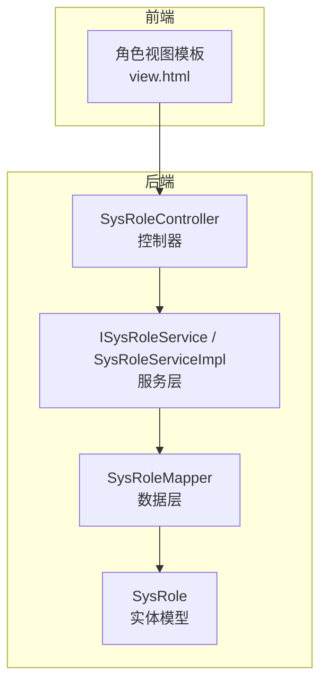
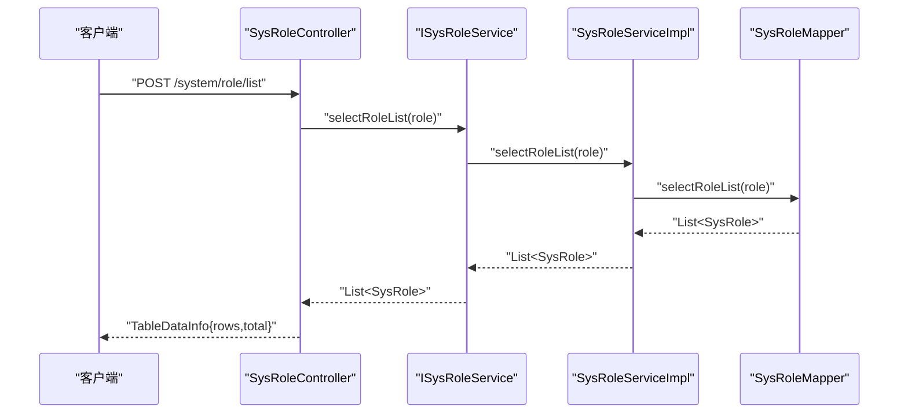
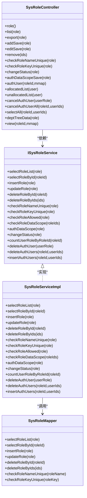

# 角色管理API

<cite>
**本文档引用的文件**
- [SysRoleController.java](file://GenShin/RuoYi-master/ruoyi-admin/src/main/java/com/ruoyi/web/controller/system/SysRoleController.java)
- [SysRole.java](file://GenShin/RuoYi-master/ruoyi-common/src/main/java/com/ruoyi/common/core/domain/entity/SysRole.java)
- [ISysRoleService.java](file://GenShin/RuoYi-master/ruoyi-system/src/main/java/com/ruoyi/system/service/ISysRoleService.java)
- [SysRoleServiceImpl.java](file://GenShin/RuoYi-master/ruoyi-system/src/main/java/com/ruoyi/system/service/impl/SysRoleServiceImpl.java)
- [SysRoleMapper.java](file://GenShin/RuoYi-master/ruoyi-system/src/main/java/com/ruoyi/system/mapper/SysRoleMapper.java)
- [view.html](file://GenShin/RuoYi-master/ruoyi-admin/src/main/resources/templates/system/role/view.html)
</cite>

## 目录
1. [简介](#简介)
2. [项目结构](#项目结构)
3. [核心组件](#核心组件)
4. [架构总览](#架构总览)
5. [详细接口规范](#详细接口规范)
6. [依赖关系分析](#依赖关系分析)
7. [性能考虑](#性能考虑)
8. [故障排除指南](#故障排除指南)
9. [结论](#结论)

## 简介
本文件面向原神攻略系统的角色管理模块，提供完整的RESTful API文档，覆盖角色的增删改查（CRUD）、导出、状态变更、数据权限配置、用户授权等能力。文档详细说明每个接口的HTTP方法、URL路径、请求参数、响应格式、状态码，并给出请求与响应示例说明。同时解释角色数据的验证规则与业务约束，如角色名称与权限字符的唯一性检查、角色状态控制、数据范围权限控制等。

## 项目结构
角色管理API位于后端三层架构中的Web控制器层，通过服务层实现业务逻辑，持久层负责数据库交互。前端采用Thymeleaf模板渲染，部分列表查询通过AJAX异步加载。

图表来源
- [SysRoleController.java:36-354](file://GenShin/RuoYi-master/ruoyi-admin/src/main/java/com/ruoyi/web/controller/system/SysRoleController.java#L36-L354)
- [ISysRoleService.java:13-167](file://GenShin/RuoYi-master/ruoyi-system/src/main/java/com/ruoyi/system/service/ISysRoleService.java#L13-L167)
- [SysRoleServiceImpl.java:34-418](file://GenShin/RuoYi-master/ruoyi-system/src/main/java/com/ruoyi/system/service/impl/SysRoleServiceImpl.java#L34-L418)
- [SysRoleMapper.java:11-85](file://GenShin/RuoYi-master/ruoyi-system/src/main/java/com/ruoyi/system/mapper/SysRoleMapper.java#L11-L85)
- [SysRole.java:16-212](file://GenShin/RuoYi-master/ruoyi-common/src/main/java/com/ruoyi/common/core/domain/entity/SysRole.java#L16-L212)

章节来源
- [SysRoleController.java:36-354](file://GenShin/RuoYi-master/ruoyi-admin/src/main/java/com/ruoyi/web/controller/system/SysRoleController.java#L36-L354)
- [SysRole.java:16-212](file://GenShin/RuoYi-master/ruoyi-common/src/main/java/com/ruoyi/common/core/domain/entity/SysRole.java#L16-L212)

## 核心组件
- 控制器层：SysRoleController 提供角色管理的HTTP接口，包含列表查询、新增、修改、删除、导出、状态变更、数据权限配置、用户授权等。
- 服务层：ISysRoleService 定义角色业务接口；SysRoleServiceImpl 实现具体业务逻辑，包括角色唯一性校验、数据范围校验、批量删除前的使用情况检查、角色菜单与部门关联维护等。
- 数据层：SysRoleMapper 定义角色的数据库操作接口，包括分页查询、新增、更新、删除、唯一性校验等。
- 实体模型：SysRole 定义角色表字段及校验规则，如角色名称、权限字符、显示顺序、状态、数据范围等。

章节来源
- [ISysRoleService.java:13-167](file://GenShin/RuoYi-master/ruoyi-system/src/main/java/com/ruoyi/system/service/ISysRoleService.java#L13-L167)
- [SysRoleServiceImpl.java:34-418](file://GenShin/RuoYi-master/ruoyi-system/src/main/java/com/ruoyi/system/service/impl/SysRoleServiceImpl.java#L34-L418)
- [SysRoleMapper.java:11-85](file://GenShin/RuoYi-master/ruoyi-system/src/main/java/com/ruoyi/system/mapper/SysRoleMapper.java#L11-L85)
- [SysRole.java:16-212](file://GenShin/RuoYi-master/ruoyi-common/src/main/java/com/ruoyi/common/core/domain/entity/SysRole.java#L16-L212)

## 架构总览
角色管理API遵循典型的MVC架构，控制器接收HTTP请求，调用服务层完成业务处理，服务层通过数据层访问数据库，最终返回统一的响应格式。

图表来源
- [SysRoleController.java:62-69](file://GenShin/RuoYi-master/ruoyi-admin/src/main/java/com/ruoyi/web/controller/system/SysRoleController.java#L62-L69)
- [ISysRoleService.java:21](file://GenShin/RuoYi-master/ruoyi-system/src/main/java/com/ruoyi/system/service/ISysRoleService.java#L21)
- [SysRoleServiceImpl.java:54-59](file://GenShin/RuoYi-master/ruoyi-system/src/main/java/com/ruoyi/system/service/impl/SysRoleServiceImpl.java#L54-L59)
- [SysRoleMapper.java:19](file://GenShin/RuoYi-master/ruoyi-system/src/main/java/com/ruoyi/system/mapper/SysRoleMapper.java#L19)

## 详细接口规范

### 通用约定
- 基础路径：/system/role
- 认证与授权：接口均需具备相应权限标识，如 system:role:list、system:role:add、system:role:edit、system:role:remove、system:role:export 等。
- 分页查询：列表接口默认使用分页参数，由控制器内部调用分页工具进行处理。
- 响应格式：统一使用 AjaxResult 或 TableDataInfo 返回，包含状态码、消息与数据体。

章节来源
- [SysRoleController.java:54-69](file://GenShin/RuoYi-master/ruoyi-admin/src/main/java/com/ruoyi/web/controller/system/SysRoleController.java#L54-L69)

### 获取角色列表
- 方法：POST
- 路径：/system/role/list
- 权限：system:role:list
- 请求参数：SysRole 对象（支持按角色名称、权限字符、状态、数据范围等条件过滤）
- 响应：TableDataInfo，包含 rows（角色列表）与 total（总数）
- 示例请求：
  - Content-Type: application/x-www-form-urlencoded
  - Body: roleName=旅行者&status=0
- 示例响应：
  - {
      "code": 0,
      "msg": "成功",
      "rows": [
        {"roleId": 2, "roleName": "旅行者", "roleKey": "pvp:*", "roleSort": "2", "dataScope": "1", "status": "0", "remark": "..."}
      ],
      "total": 1
    }

章节来源
- [SysRoleController.java:62-69](file://GenShin/RuoYi-master/ruoyi-admin/src/main/java/com/ruoyi/web/controller/system/SysRoleController.java#L62-L69)
- [ISysRoleService.java:21](file://GenShin/RuoYi-master/ruoyi-system/src/main/java/com/ruoyi/system/service/ISysRoleService.java#L21)

### 导出角色数据
- 方法：POST
- 路径：/system/role/export
- 权限：system:role:export
- 请求参数：SysRole 对象（同上）
- 响应：AjaxResult，包含导出结果
- 示例响应：
  - {
      "code": 0,
      "msg": "导出成功",
      "url": "download/excel/..."
    }

章节来源
- [SysRoleController.java:71-80](file://GenShin/RuoYi-master/ruoyi-admin/src/main/java/com/ruoyi/web/controller/system/SysRoleController.java#L71-L80)

### 新增角色
- 方法：POST
- 路径：/system/role/add
- 权限：system:role:add
- 请求参数：SysRole 对象（含角色名称、权限字符、显示顺序、数据范围、状态等）
- 校验规则：
  - 角色名称唯一性检查
  - 权限字符唯一性检查
- 响应：AjaxResult
- 示例请求：
  - Content-Type: application/json
  - Body: {"roleName":"测试角色","roleKey":"test:*","roleSort":"1","dataScope":"1","status":"0"}
- 示例响应：
  - {
      "code": 0,
      "msg": "操作成功"
    }

章节来源
- [SysRoleController.java:95-113](file://GenShin/RuoYi-master/ruoyi-admin/src/main/java/com/ruoyi/web/controller/system/SysRoleController.java#L95-L113)
- [SysRoleServiceImpl.java:280-307](file://GenShin/RuoYi-master/ruoyi-system/src/main/java/com/ruoyi/system/service/impl/SysRoleServiceImpl.java#L280-L307)
- [SysRoleMapper.java:75-83](file://GenShin/RuoYi-master/ruoyi-system/src/main/java/com/ruoyi/system/mapper/SysRoleMapper.java#L75-L83)

### 修改角色
- 方法：POST
- 路径：/system/role/edit
- 权限：system:role:edit
- 请求参数：SysRole 对象（含角色ID）
- 校验规则：
  - 不允许修改超级管理员角色
  - 角色名称唯一性检查
  - 权限字符唯一性检查
- 响应：AjaxResult
- 示例请求：
  - Content-Type: application/json
  - Body: {"roleId":2,"roleName":"旅行者","roleKey":"pvp:*","roleSort":"2","dataScope":"1","status":"0"}
- 示例响应：
  - {
      "code": 0,
      "msg": "操作成功"
    }

章节来源
- [SysRoleController.java:130-149](file://GenShin/RuoYi-master/ruoyi-admin/src/main/java/com/ruoyi/web/controller/system/SysRoleController.java#L130-L149)
- [SysRoleServiceImpl.java:314-344](file://GenShin/RuoYi-master/ruoyi-system/src/main/java/com/ruoyi/system/service/impl/SysRoleServiceImpl.java#L314-L344)
- [SysRoleServiceImpl.java:280-307](file://GenShin/RuoYi-master/ruoyi-system/src/main/java/com/ruoyi/system/service/impl/SysRoleServiceImpl.java#L280-L307)

### 删除角色
- 方法：POST
- 路径：/system/role/remove
- 权限：system:role:remove
- 请求参数：ids（字符串，多个ID以逗号分隔）
- 校验规则：
  - 不允许删除已分配使用的角色
  - 不允许删除超级管理员角色
  - 校验当前登录用户对角色数据范围的访问权限
- 响应：AjaxResult
- 示例请求：
  - Content-Type: application/x-www-form-urlencoded
  - Body: ids=3,4
- 示例响应：
  - {
      "code": 0,
      "msg": "操作成功"
    }

章节来源
- [SysRoleController.java:182-189](file://GenShin/RuoYi-master/ruoyi-admin/src/main/java/com/ruoyi/web/controller/system/SysRoleController.java#L182-L189)
- [SysRoleServiceImpl.java:154-173](file://GenShin/RuoYi-master/ruoyi-system/src/main/java/com/ruoyi/system/service/impl/SysRoleServiceImpl.java#L154-L173)

### 校验角色名称唯一性
- 方法：POST
- 路径：/system/role/checkRoleNameUnique
- 权限：system:role:list
- 请求参数：SysRole 对象（含角色名称）
- 响应：boolean（true表示唯一，false表示已存在）

章节来源
- [SysRoleController.java:194-199](file://GenShin/RuoYi-master/ruoyi-admin/src/main/java/com/ruoyi/web/controller/system/SysRoleController.java#L194-L199)

### 校验角色权限唯一性
- 方法：POST
- 路径：/system/role/checkRoleKeyUnique
- 权限：system:role:list
- 请求参数：SysRole 对象（含权限字符）
- 响应：boolean（true表示唯一，false表示已存在）

章节来源
- [SysRoleController.java:204-209](file://GenShin/RuoYi-master/ruoyi-admin/src/main/java/com/ruoyi/web/controller/system/SysRoleController.java#L204-L209)

### 角色状态变更
- 方法：POST
- 路径：/system/role/changeStatus
- 权限：system:role:edit
- 请求参数：SysRole 对象（含角色ID与新状态）
- 校验规则：
  - 不允许修改超级管理员角色
  - 校验当前登录用户对角色数据范围的访问权限
- 响应：AjaxResult

章节来源
- [SysRoleController.java:225-232](file://GenShin/RuoYi-master/ruoyi-admin/src/main/java/com/ruoyi/web/controller/system/SysRoleController.java#L225-L232)
- [SysRoleServiceImpl.java:314-344](file://GenShin/RuoYi-master/ruoyi-system/src/main/java/com/ruoyi/system/service/impl/SysRoleServiceImpl.java#L314-L344)

### 分配数据权限（角色部门树）
- 方法：GET
- 路径：/system/role/deptTreeData
- 权限：system:role:edit
- 请求参数：SysRole 对象
- 响应：List<Ztree>（部门树形结构）

章节来源
- [SysRoleController.java:324-330](file://GenShin/RuoYi-master/ruoyi-admin/src/main/java/com/ruoyi/web/controller/system/SysRoleController.java#L324-L330)

### 角色详情查看
- 方法：GET
- 路径：/system/role/view/{roleId}
- 权限：system:role:list
- 请求参数：路径变量 roleId
- 响应：视图模板（包含菜单树、部门树、关联用户数量等）
- 说明：该接口返回HTML视图，用于前端展示角色详情与权限信息

章节来源
- [SysRoleController.java:336-353](file://GenShin/RuoYi-master/ruoyi-admin/src/main/java/com/ruoyi/web/controller/system/SysRoleController.java#L336-L353)
- [view.html:227-531](file://GenShin/RuoYi-master/ruoyi-admin/src/main/resources/templates/system/role/view.html#L227-L531)

### 用户授权相关接口（辅助说明）
- 分配用户授权页面
  - GET /system/role/authUser/{roleId}
- 已分配用户列表（AJAX分页）
  - POST /system/role/authUser/allocatedList
- 未分配用户列表（AJAX分页）
  - POST /system/role/authUser/unallocatedList
- 取消授权
  - POST /system/role/authUser/cancel
- 批量取消授权
  - POST /system/role/authUser/cancelAll
- 批量选择用户授权
  - POST /system/role/authUser/selectAll

章节来源
- [SysRoleController.java:238-318](file://GenShin/RuoYi-master/ruoyi-admin/src/main/java/com/ruoyi/web/controller/system/SysRoleController.java#L238-L318)
- [view.html:500-531](file://GenShin/RuoYi-master/ruoyi-admin/src/main/resources/templates/system/role/view.html#L500-L531)

## 依赖关系分析

图表来源
- [SysRoleController.java:36-354](file://GenShin/RuoYi-master/ruoyi-admin/src/main/java/com/ruoyi/web/controller/system/SysRoleController.java#L36-L354)
- [ISysRoleService.java:13-167](file://GenShin/RuoYi-master/ruoyi-system/src/main/java/com/ruoyi/system/service/ISysRoleService.java#L13-L167)
- [SysRoleServiceImpl.java:34-418](file://GenShin/RuoYi-master/ruoyi-system/src/main/java/com/ruoyi/system/service/impl/SysRoleServiceImpl.java#L34-L418)
- [SysRoleMapper.java:11-85](file://GenShin/RuoYi-master/ruoyi-system/src/main/java/com/ruoyi/system/mapper/SysRoleMapper.java#L11-L85)

## 性能考虑
- 分页查询：列表接口默认启用分页，建议前端传入合理的 pageNum 与 pageSize 参数，避免一次性加载过多数据。
- 批量操作：删除角色时会进行多表关联清理（角色菜单、角色部门），建议批量删除时控制每次操作的ID数量。
- 缓存清理：新增/修改角色后会清除授权缓存，确保权限生效及时性。
- 前端异步加载：用户授权列表采用AJAX分页加载，提升用户体验与性能。

## 故障排除指南
- 权限不足
  - 现象：返回错误或无数据
  - 排查：确认当前登录用户是否具备 system:role:* 权限
- 角色已分配
  - 现象：删除失败，提示“已分配,不能删除”
  - 排查：先取消用户与角色的授权，再执行删除
- 超级管理员限制
  - 现象：修改/删除超级管理员角色失败
  - 排查：超级管理员角色不可被修改或删除
- 唯一性冲突
  - 现象：新增/修改角色时报错“角色名称已存在”或“角色权限已存在”
  - 排查：使用唯一性校验接口确认后再提交

章节来源
- [SysRoleServiceImpl.java:163-166](file://GenShin/RuoYi-master/ruoyi-system/src/main/java/com/ruoyi/system/service/impl/SysRoleServiceImpl.java#L163-L166)
- [SysRoleServiceImpl.java:317-320](file://GenShin/RuoYi-master/ruoyi-system/src/main/java/com/ruoyi/system/service/impl/SysRoleServiceImpl.java#L317-L320)
- [SysRoleController.java:101-108](file://GenShin/RuoYi-master/ruoyi-admin/src/main/java/com/ruoyi/web/controller/system/SysRoleController.java#L101-L108)
- [SysRoleController.java:142-144](file://GenShin/RuoYi-master/ruoyi-admin/src/main/java/com/ruoyi/web/controller/system/SysRoleController.java#L142-L144)

## 结论
本角色管理API提供了完善的CRUD与扩展功能，结合严格的权限校验与业务约束，确保系统角色数据的安全与一致性。通过统一的响应格式与清晰的接口规范，便于前后端协作与后续扩展。