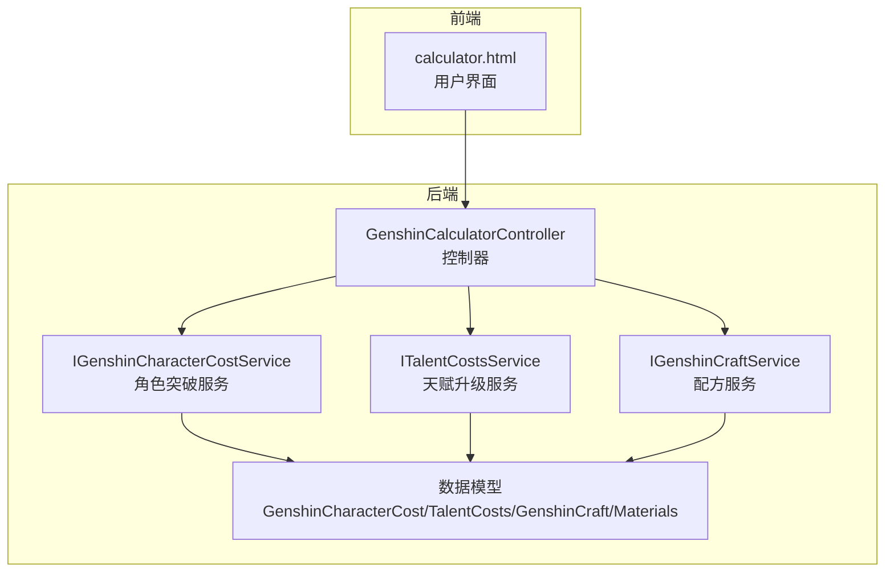
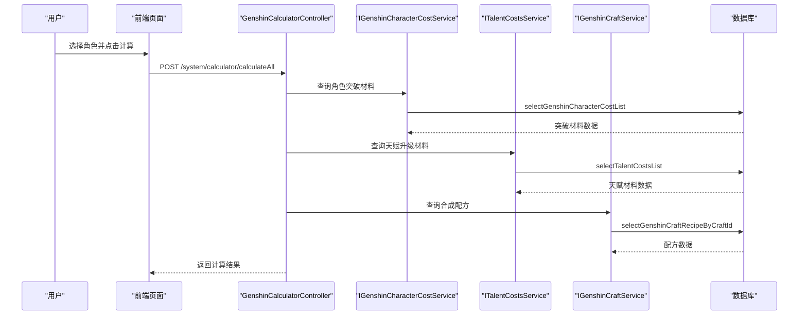
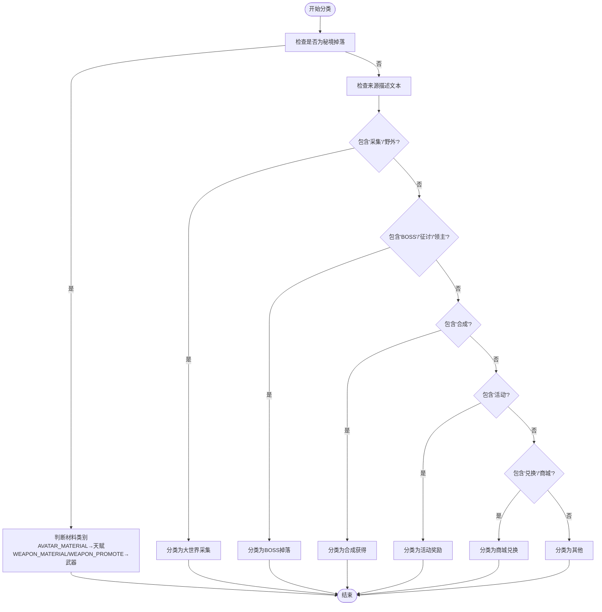
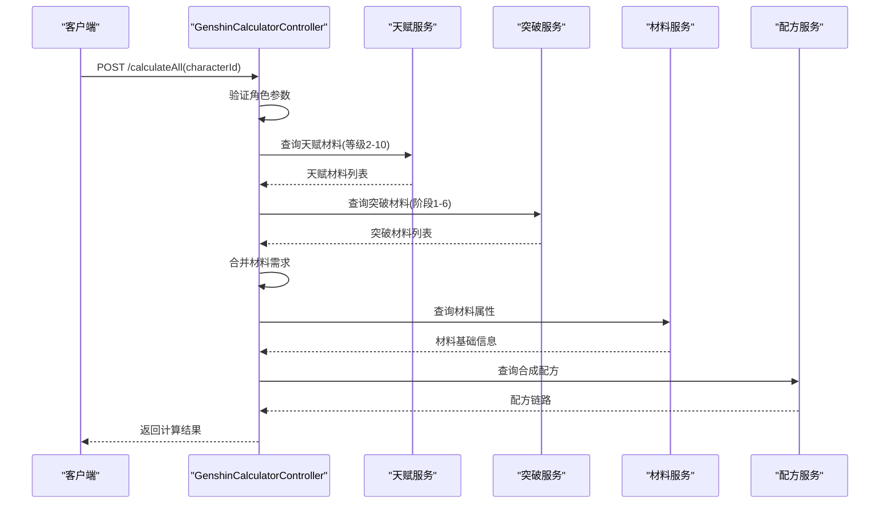
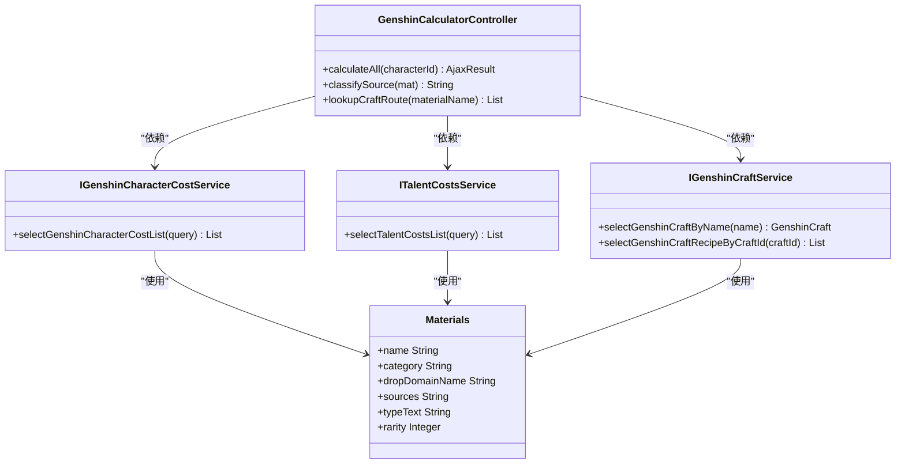

# 计算器API

<cite>
**本文档引用的文件**
- [GenshinCalculatorController.java](file://ruoyi-admin/src/main/java/com/ruoyi/web/controller/system/GenshinCalculatorController.java)
- [calculator.html](file://ruoyi-admin/src/main/resources/templates/system/calculator/calculator.html)
- [IGenshinCharacterCostService.java](file://ruoyi-system/src/main/java/com/ruoyi/system/service/IGenshinCharacterCostService.java)
- [ITalentCostsService.java](file://ruoyi-system/src/main/java/com/ruoyi/system/service/ITalentCostsService.java)
- [IGenshinCraftService.java](file://ruoyi-system/src/main/java/com/ruoyi/system/service/IGenshinCraftService.java)
- [GenshinCharacterCost.java](file://ruoyi-system/src/main/java/com/ruoyi/system/domain/GenshinCharacterCost.java)
- [TalentCosts.java](file://ruoyi-system/src/main/java/com/ruoyi/system/domain/TalentCosts.java)
- [GenshinCraft.java](file://ruoyi-system/src/main/java/com/ruoyi/system/domain/GenshinCraft.java)
- [Materials.java](file://ruoyi-system/src/main/java/com/ruoyi/system/domain/Materials.java)
</cite>

## 目录
1. [简介](#简介)
2. [项目结构](#项目结构)
3. [核心组件](#核心组件)
4. [架构概览](#架构概览)
5. [详细组件分析](#详细组件分析)
6. [依赖关系分析](#依赖关系分析)
7. [性能考虑](#性能考虑)
8. [故障排除指南](#故障排除指南)
9. [结论](#结论)

## 简介
本文件为原神攻略系统中计算器功能的API文档，重点记录培养成本计算、材料需求统计、摩拉消耗估算等计算接口。文档详细说明了输入参数格式（角色等级、突破次数、天赋等级等）、计算逻辑（单角色与多角色组合计算）、返回结果格式（材料清单、总成本、时间估算等），以及计算精度、单位换算和汇率处理方式。同时提供批量计算和历史记录查询的接口规范。

## 项目结构
计算器功能主要由以下模块组成：
- 前端页面：负责用户交互与展示，包含角色选择、计算按钮、材料列表、摩拉统计等区域
- 控制器层：提供REST接口，处理计算请求并返回结果
- 服务层：封装业务逻辑，调用数据访问层获取材料、突破、天赋等数据
- 数据模型层：定义角色、材料、配方等实体对象

**图表来源**
- [GenshinCalculatorController.java:33-61](file://ruoyi-admin/src/main/java/com/ruoyi/web/controller/system/GenshinCalculatorController.java#L33-L61)
- [calculator.html:55-144](file://ruoyi-admin/src/main/resources/templates/system/calculator/calculator.html#L55-L144)

**章节来源**
- [GenshinCalculatorController.java:33-61](file://ruoyi-admin/src/main/java/com/ruoyi/web/controller/system/GenshinCalculatorController.java#L33-L61)
- [calculator.html:55-144](file://ruoyi-admin/src/main/resources/templates/system/calculator/calculator.html#L55-L144)

## 核心组件
计算器API的核心组件包括：
- 单角色综合计算接口：计算指定角色从突破0→90、天赋1→10所需的材料与摩拉，并按来源分类展示
- 材料来源分类：根据秘境、采集、BOSS掉落、合成、活动、商城等类型进行归类
- 合成路线查询：查询低阶材料到目标材料的合成配方
- 返回结果：包含角色信息、材料清单、摩拉统计、按来源分类的统计信息

**章节来源**
- [GenshinCalculatorController.java:63-210](file://ruoyi-admin/src/main/java/com/ruoyi/web/controller/system/GenshinCalculatorController.java#L63-L210)

## 架构概览
计算器API采用经典的三层架构：
- 表现层：Thymeleaf模板渲染的HTML页面，提供用户交互界面
- 控制层：Spring MVC控制器，接收HTTP请求并调用服务层
- 业务层：服务接口与实现，封装具体的计算逻辑
- 数据访问层：MyBatis映射器，负责数据库操作

**图表来源**
- [GenshinCalculatorController.java:67-210](file://ruoyi-admin/src/main/java/com/ruoyi/web/controller/system/GenshinCalculatorController.java#L67-L210)

## 详细组件分析

### 接口定义与参数规范

#### 单角色综合计算接口
- 请求方法：POST
- 请求路径：/system/calculator/calculateAll
- 权限要求：system:calculator:list
- 请求参数：
  - characterId: Long（必填）- 角色唯一标识符
- 返回值：AjaxResult（统一响应包装）

计算范围与参数：
- 角色突破：从等级0→90，对应突破阶段1-6
- 天赋升级：从等级1→10
- 输入校验：角色必须存在且已选择

**章节来源**
- [GenshinCalculatorController.java:63-79](file://ruoyi-admin/src/main/java/com/ruoyi/web/controller/system/GenshinCalculatorController.java#L63-L79)

#### 材料来源分类算法
系统根据材料属性和描述文本对材料来源进行智能分类：
- 秘境掉落：当材料具有秘境掉落名称时，进一步区分天赋培养和武器突破两类
- 采集：包含"采集"、"野外"等关键词
- BOSS掉落：包含"BOSS"、"征讨"、"领主"等关键词
- 合成获得：包含"合成"关键词
- 活动奖励：包含"活动"关键词
- 商城兑换：包含"兑换"、"商城"关键词
- 默认分类：未知

**图表来源**
- [GenshinCalculatorController.java:215-267](file://ruoyi-admin/src/main/java/com/ruoyi/web/controller/system/GenshinCalculatorController.java#L215-L267)

**章节来源**
- [GenshinCalculatorController.java:212-295](file://ruoyi-admin/src/main/java/com/ruoyi/web/controller/system/GenshinCalculatorController.java#L212-L295)

### 数据模型与字段说明

#### 角色突破材料模型
- 字段：characterId、ascendLevel、itemName、itemCount
- 用途：存储角色突破各阶段所需的材料与数量
- 关键约束：ascendLevel范围1-6

#### 天赋升级材料模型
- 字段：characterId、level、materialName、count
- 用途：存储天赋从等级1→10升级所需的材料与数量
- 关键约束：level范围2-10（起始等级1不计入消耗）

#### 合成配方模型
- 字段：craftId、materialId、materialName、materialCount、isAlt
- 用途：定义低阶材料合成高阶材料的配方关系
- 关键约束：isAlt=0表示主配方，非0表示替代配方

#### 材料属性模型
- 字段：name、category、dropDomainName、sources、typeText、rarity、sources
- 用途：存储材料的基础属性与获取方式
- 关键字段：category用于确定材料类型（角色材料、武器材料等）

**章节来源**
- [GenshinCharacterCost.java](file://ruoyi-system/src/main/java/com/ruoyi/system/domain/GenshinCharacterCost.java)
- [TalentCosts.java](file://ruoyi-system/src/main/java/com/ruoyi/system/domain/TalentCosts.java)
- [GenshinCraft.java](file://ruoyi-system/src/main/java/com/ruoyi/system/domain/GenshinCraft.java)
- [Materials.java](file://ruoyi-system/src/main/java/com/ruoyi/system/domain/Materials.java)

### 计算逻辑与流程

#### 综合计算流程
1. 输入验证：检查角色是否存在
2. 天赋材料计算：遍历天赋升级表，累加等级2-10的材料消耗
3. 突破材料计算：遍历角色突破表，累加突破阶段1-6的材料消耗
4. 材料合并：将天赋与突破的材料需求合并，相同材料进行数量累加
5. 来源分类：根据材料属性和描述文本进行智能分类
6. 合成路线查询：查询可合成该材料的配方链路
7. 结果组装：构建包含角色信息、材料清单、摩拉统计的完整结果

**图表来源**
- [GenshinCalculatorController.java:67-210](file://ruoyi-admin/src/main/java/com/ruoyi/web/controller/system/GenshinCalculatorController.java#L67-L210)

**章节来源**
- [GenshinCalculatorController.java:80-210](file://ruoyi-admin/src/main/java/com/ruoyi/web/controller/system/GenshinCalculatorController.java#L80-L210)

### 返回结果格式

#### 核心返回字段
- character：角色基本信息
- materials：材料清单数组，每项包含：
  - materialName：材料名称
  - totalCount：总需求数量
  - category：材料类别（talent/ascension/both）
  - sourceType：来源类型（gather/boss/domain/craft_only/event/shop）
  - sourceTypeName：来源类型中文名称
  - dropDomainName：秘境掉落名称
  - daysOfWeek：掉落日期（周几）
  - typeText：材料类型描述
  - rarity：稀有度
  - sources：获取来源说明
  - craftRoutes：合成路线数组
- totalMaterialTypes：材料种类总数
- talentMora：天赋摩拉消耗
- ascensionMora：突破摩拉消耗
- totalMora：总摩拉消耗
- talentFrom/talentTo：天赋计算范围
- ascensionFrom/ascensionTo：突破计算范围
- bySource：按来源分类的材料统计

#### 材料来源类型说明
- gather：大世界采集
- boss：BOSS掉落
- domain：秘境掉落
- domain_talent：秘境·天赋培养
- domain_weapon：秘境·武器突破
- craft_only：合成获得
- event：活动奖励
- shop：商城兑换
- unknown：其他/未知

**章节来源**
- [GenshinCalculatorController.java:188-209](file://ruoyi-admin/src/main/java/com/ruoyi/web/controller/system/GenshinCalculatorController.java#L188-L209)

### 前端交互与展示

#### 用户界面元素
- 角色选择下拉框：支持多角色选择与重置
- 计算按钮：触发综合计算流程
- 摩拉统计区域：显示总摩拉消耗
- 材料列表区域：按来源类型分组展示材料需求
- 合成路线区域：展示材料合成链路

#### 响应式布局
- 支持不同屏幕尺寸的自适应布局
- 材料卡片采用flex布局，支持横向滚动
- 空状态提示与加载状态处理

**章节来源**
- [calculator.html:55-144](file://ruoyi-admin/src/main/resources/templates/system/calculator/calculator.html#L55-L144)

## 依赖关系分析

### 组件耦合关系

**图表来源**
- [GenshinCalculatorController.java:33-52](file://ruoyi-admin/src/main/java/com/ruoyi/web/controller/system/GenshinCalculatorController.java#L33-L52)
- [IGenshinCharacterCostService.java:11-27](file://ruoyi-system/src/main/java/com/ruoyi/system/service/IGenshinCharacterCostService.java#L11-L27)
- [ITalentCostsService.java:12-28](file://ruoyi-system/src/main/java/com/ruoyi/system/service/ITalentCostsService.java#L12-L28)
- [IGenshinCraftService.java:12-21](file://ruoyi-system/src/main/java/com/ruoyi/system/service/IGenshinCraftService.java#L12-L21)

### 数据流依赖
- 控制器依赖多个服务接口进行数据查询
- 服务层依赖数据模型进行业务处理
- 材料来源分类依赖材料属性与描述文本
- 合成路线查询依赖配方关联关系

**章节来源**
- [GenshinCalculatorController.java:39-52](file://ruoyi-admin/src/main/java/com/ruoyi/web/controller/system/GenshinCalculatorController.java#L39-L52)

## 性能考虑
- 数据缓存：常用材料属性与配方信息可考虑缓存以减少数据库查询
- 批量查询：对于多角色计算场景，建议使用批量查询优化
- 分页处理：材料列表较多时考虑分页展示
- 异步计算：复杂计算可考虑异步执行，避免阻塞主线程
- 前端渲染：大量材料数据的前端渲染性能优化

## 故障排除指南
- 角色参数为空：检查前端角色选择是否正确提交
- 角色不存在：确认角色ID有效性与权限配置
- 计算结果异常：检查材料数据完整性与计算逻辑边界条件
- 合成路线缺失：确认配方数据是否完整导入
- 来源分类错误：检查材料描述文本与分类规则匹配情况

**章节来源**
- [GenshinCalculatorController.java:71-78](file://ruoyi-admin/src/main/java/com/ruoyi/web/controller/system/GenshinCalculatorController.java#L71-L78)

## 结论
计算器API提供了完整的原神养成成本计算能力，涵盖单角色与多角色场景。通过智能的材料来源分类与合成路线查询，为玩家提供了全面的养成规划支持。系统采用清晰的分层架构与标准化的数据模型，具备良好的扩展性与维护性。建议在实际部署中关注性能优化与用户体验改进。