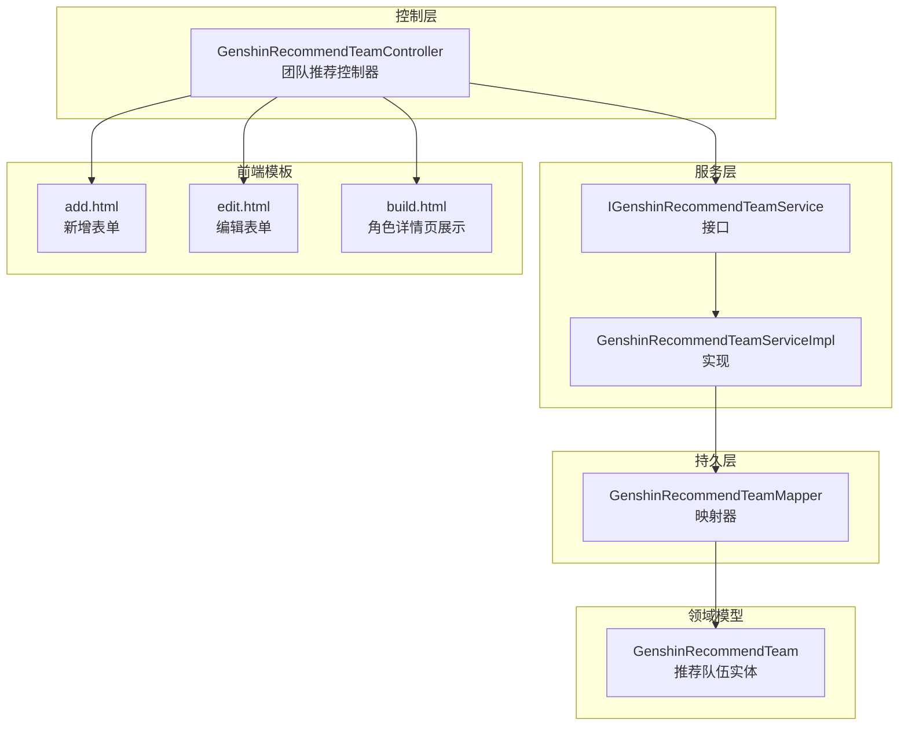
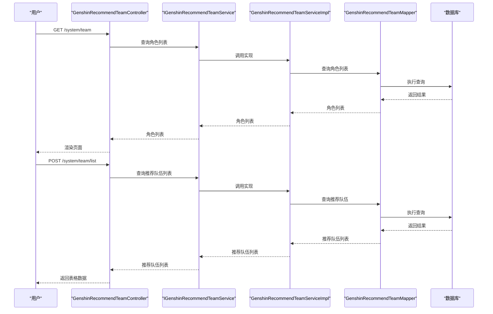
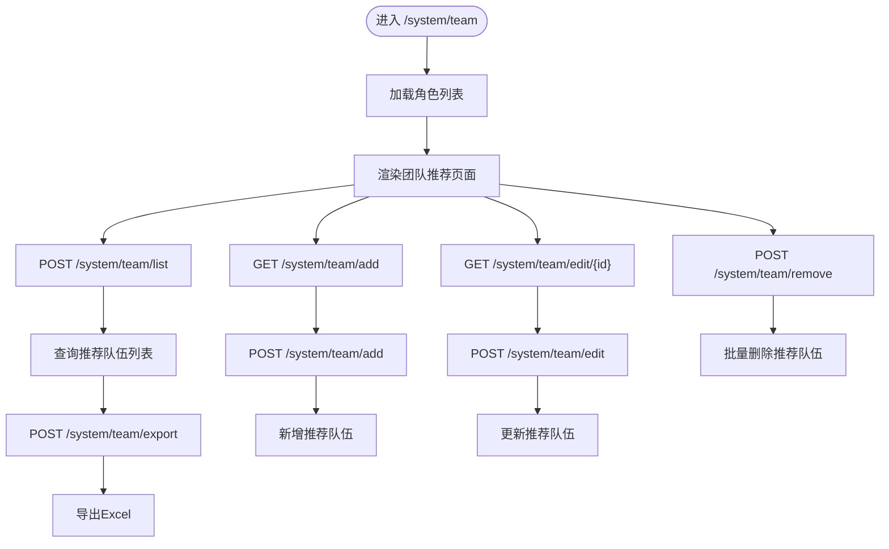
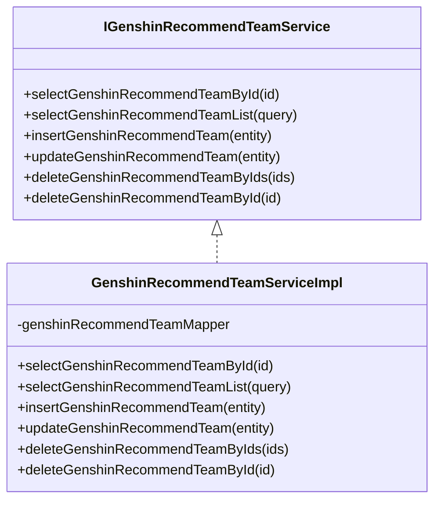
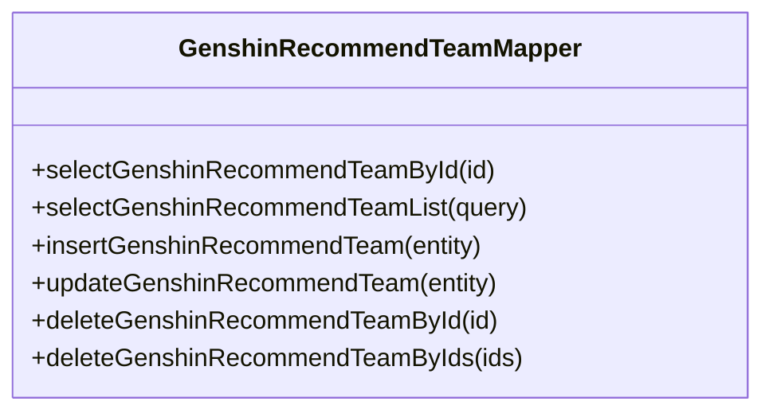
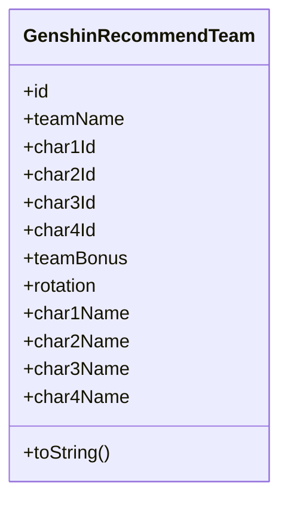
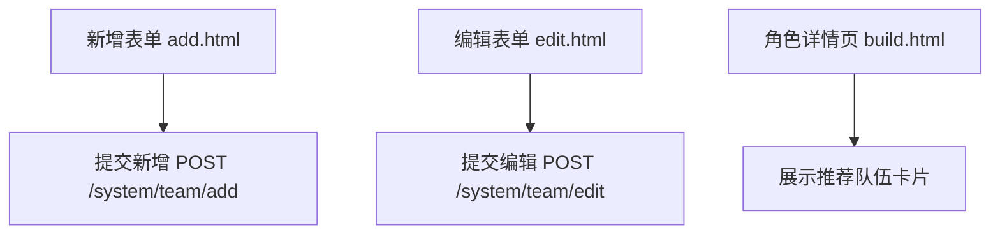
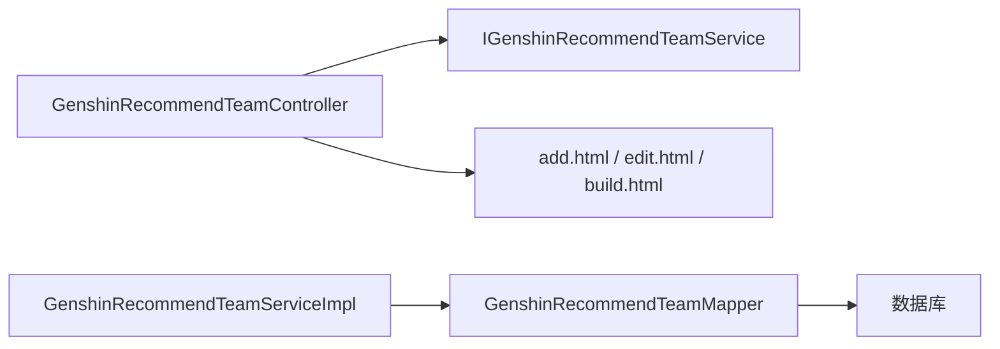

# 队伍组合API

<cite>
**本文引用的文件**
- [GenshinRecommendTeamController.java](file://GenShin/RuoYi-master/ruoyi-admin/src/main/java/com/ruoyi/web/controller/system/GenshinRecommendTeamController.java)
- [IGenshinRecommendTeamService.java](file://GenShin/RuoYi-master/ruoyi-system/src/main/java/com/ruoyi/system/service/IGenshinRecommendTeamService.java)
- [GenshinRecommendTeamServiceImpl.java](file://GenShin/RuoYi-master/ruoyi-system/src/main/java/com/ruoyi/system/service/impl/GenshinRecommendTeamServiceImpl.java)
- [GenshinRecommendTeamMapper.java](file://GenShin/RuoYi-master/ruoyi-system/src/main/java/com/ruoyi/system/mapper/GenshinRecommendTeamMapper.java)
- [GenshinRecommendTeam.java](file://GenShin/RuoYi-master/ruoyi-system/src/main/java/com/ruoyi/system/domain/GenshinRecommendTeam.java)
- [add.html](file://GenShin/RuoYi-master/ruoyi-admin/src/main/resources/templates/system/team/add.html)
- [edit.html](file://GenShin/RuoYi-master/ruoyi-admin/src/main/resources/templates/system/team/edit.html)
- [build.html](file://GenShin/RuoYi-master/ruoyi-admin/src/main/resources/templates/system/character/build.html)
</cite>

## 目录
1. [简介](#简介)
2. [项目结构](#项目结构)
3. [核心组件](#核心组件)
4. [架构总览](#架构总览)
5. [详细组件分析](#详细组件分析)
6. [依赖关系分析](#依赖关系分析)
7. [性能考量](#性能考量)
8. [故障排查指南](#故障排查指南)
9. [结论](#结论)
10. [附录](#附录)

## 简介
本文件为“队伍组合推荐”的API与接口规范文档，面向原神攻略系统中的队伍推荐模块。该模块提供角色搭配建议、元素共鸣（队伍化学反应）提示、输出循环设计说明等推荐内容，并支持在管理端进行新增、编辑、导出与删除操作。文档同时给出不同战斗场景下的最优队伍配置思路（如深境螺旋、周本挑战、拟态之钥等），以及队伍角色定位与职责分配的接口规范，帮助用户快速生成高效率的战斗队伍。

## 项目结构
队伍组合推荐功能采用经典的分层架构：控制层负责HTTP请求与页面渲染；服务层封装业务逻辑；持久层负责数据访问；前端模板负责展示推荐结果。核心文件分布如下：

**图表来源**
- [GenshinRecommendTeamController.java:1-142](file://GenShin/RuoYi-master/ruoyi-admin/src/main/java/com/ruoyi/web/controller/system/GenshinRecommendTeamController.java#L1-L142)
- [IGenshinRecommendTeamService.java:1-61](file://GenShin/RuoYi-master/ruoyi-system/src/main/java/com/ruoyi/system/service/IGenshinRecommendTeamService.java#L1-L61)
- [GenshinRecommendTeamServiceImpl.java:1-94](file://GenShin/RuoYi-master/ruoyi-system/src/main/java/com/ruoyi/system/service/impl/GenshinRecommendTeamServiceImpl.java#L1-L94)
- [GenshinRecommendTeamMapper.java:1-61](file://GenShin/RuoYi-master/ruoyi-system/src/main/java/com/ruoyi/system/mapper/GenshinRecommendTeamMapper.java#L1-L61)
- [GenshinRecommendTeam.java:1-168](file://GenShin/RuoYi-master/ruoyi-system/src/main/java/com/ruoyi/system/domain/GenshinRecommendTeam.java#L1-L168)
- [add.html:49-79](file://GenShin/RuoYi-master/ruoyi-admin/src/main/resources/templates/system/team/add.html#L49-L79)
- [edit.html:70-109](file://GenShin/RuoYi-master/ruoyi-admin/src/main/resources/templates/system/team/edit.html#L70-L109)
- [build.html:157-200](file://GenShin/RuoYi-master/ruoyi-admin/src/main/resources/templates/system/character/build.html#L157-L200)

**章节来源**
- [GenshinRecommendTeamController.java:1-142](file://GenShin/RuoYi-master/ruoyi-admin/src/main/java/com/ruoyi/web/controller/system/GenshinRecommendTeamController.java#L1-L142)
- [GenshinRecommendTeam.java:1-168](file://GenShin/RuoYi-master/ruoyi-system/src/main/java/com/ruoyi/system/domain/GenshinRecommendTeam.java#L1-L168)

## 核心组件
- 控制器：提供团队推荐的列表查询、导出、新增、编辑、删除等HTTP接口与页面跳转。
- 服务层：定义团队推荐的增删改查业务方法，实现类完成具体调用。
- 持久层：定义团队推荐的数据库访问方法，支持按条件查询、批量删除等。
- 实体模型：描述推荐队伍的字段，包含队伍名称、四名角色ID与名称、元素共鸣效果、输出循环说明等。
- 前端模板：提供新增/编辑表单与角色详情页的展示，用于呈现推荐队伍信息。

**章节来源**
- [IGenshinRecommendTeamService.java:1-61](file://GenShin/RuoYi-master/ruoyi-system/src/main/java/com/ruoyi/system/service/IGenshinRecommendTeamService.java#L1-L61)
- [GenshinRecommendTeamServiceImpl.java:1-94](file://GenShin/RuoYi-master/ruoyi-system/src/main/java/com/ruoyi/system/service/impl/GenshinRecommendTeamServiceImpl.java#L1-L94)
- [GenshinRecommendTeamMapper.java:1-61](file://GenShin/RuoYi-master/ruoyi-system/src/main/java/com/ruoyi/system/mapper/GenshinRecommendTeamMapper.java#L1-L61)
- [GenshinRecommendTeam.java:1-168](file://GenShin/RuoYi-master/ruoyi-system/src/main/java/com/ruoyi/system/domain/GenshinRecommendTeam.java#L1-L168)
- [add.html:49-79](file://GenShin/RuoYi-master/ruoyi-admin/src/main/resources/templates/system/team/add.html#L49-L79)
- [edit.html:70-109](file://GenShin/RuoYi-master/ruoyi-admin/src/main/resources/templates/system/team/edit.html#L70-L109)
- [build.html:157-200](file://GenShin/RuoYi-master/ruoyi-admin/src/main/resources/templates/system/character/build.html#L157-L200)

## 架构总览
下图展示了从HTTP请求到数据持久化的完整流程，以及前端模板如何渲染推荐队伍信息。

**图表来源**
- [GenshinRecommendTeamController.java:42-63](file://GenShin/RuoYi-master/ruoyi-admin/src/main/java/com/ruoyi/web/controller/system/GenshinRecommendTeamController.java#L42-L63)
- [IGenshinRecommendTeamService.java:22-28](file://GenShin/RuoYi-master/ruoyi-system/src/main/java/com/ruoyi/system/service/IGenshinRecommendTeamService.java#L22-L28)
- [GenshinRecommendTeamServiceImpl.java:42-44](file://GenShin/RuoYi-master/ruoyi-system/src/main/java/com/ruoyi/system/service/impl/GenshinRecommendTeamServiceImpl.java#L42-L44)
- [GenshinRecommendTeamMapper.java:22-28](file://GenShin/RuoYi-master/ruoyi-system/src/main/java/com/ruoyi/system/mapper/GenshinRecommendTeamMapper.java#L22-L28)

## 详细组件分析

### 控制器：团队推荐控制器
- 页面入口与权限控制：提供“查看”“列表”“导出”“新增”“编辑”“删除”等权限注解，确保安全访问。
- 数据准备：在进入页面时加载全部角色列表，供新增/编辑表单选择。
- 列表查询：支持分页查询推荐队伍列表。
- 导出功能：将推荐队伍导出为Excel。
- 新增/编辑/删除：通过AJAX提交，调用服务层执行持久化操作。

**图表来源**
- [GenshinRecommendTeamController.java:42-142](file://GenShin/RuoYi-master/ruoyi-admin/src/main/java/com/ruoyi/web/controller/system/GenshinRecommendTeamController.java#L42-L142)

**章节来源**
- [GenshinRecommendTeamController.java:1-142](file://GenShin/RuoYi-master/ruoyi-admin/src/main/java/com/ruoyi/web/controller/system/GenshinRecommendTeamController.java#L1-L142)

### 服务层：团队推荐服务
- 接口定义：提供按ID查询、列表查询、新增、修改、批量删除、单条删除等方法。
- 实现类：注入Mapper，完成数据访问与返回。

**图表来源**
- [IGenshinRecommendTeamService.java:12-61](file://GenShin/RuoYi-master/ruoyi-system/src/main/java/com/ruoyi/system/service/IGenshinRecommendTeamService.java#L12-L61)
- [GenshinRecommendTeamServiceImpl.java:18-94](file://GenShin/RuoYi-master/ruoyi-system/src/main/java/com/ruoyi/system/service/impl/GenshinRecommendTeamServiceImpl.java#L18-L94)

**章节来源**
- [IGenshinRecommendTeamService.java:1-61](file://GenShin/RuoYi-master/ruoyi-system/src/main/java/com/ruoyi/system/service/IGenshinRecommendTeamService.java#L1-L61)
- [GenshinRecommendTeamServiceImpl.java:1-94](file://GenShin/RuoYi-master/ruoyi-system/src/main/java/com/ruoyi/system/service/impl/GenshinRecommendTeamServiceImpl.java#L1-L94)

### 持久层：团队推荐映射器
- 定义：提供按ID查询、列表查询、新增、修改、单条与批量删除等方法签名。
- 用途：作为MyBatis映射接口，与XML映射文件配合完成SQL执行。

**图表来源**
- [GenshinRecommendTeamMapper.java:12-61](file://GenShin/RuoYi-master/ruoyi-system/src/main/java/com/ruoyi/system/mapper/GenshinRecommendTeamMapper.java#L12-L61)

**章节来源**
- [GenshinRecommendTeamMapper.java:1-61](file://GenShin/RuoYi-master/ruoyi-system/src/main/java/com/ruoyi/system/mapper/GenshinRecommendTeamMapper.java#L1-L61)

### 领域模型：推荐队伍实体
- 字段说明：
  - 队伍名称：用于标识推荐队伍主题或场景。
  - 四名角色ID与名称：分别存储角色主键与显示名称，便于前端展示。
  - 元素共鸣效果：描述队伍触发的元素共鸣及其增益效果。
  - 输出循环说明：描述推荐的输出循环、反应触发顺序与注意事项。
- toString：提供统一的日志/调试输出格式。

**图表来源**
- [GenshinRecommendTeam.java:1-168](file://GenShin/RuoYi-master/ruoyi-system/src/main/java/com/ruoyi/system/domain/GenshinRecommendTeam.java#L1-L168)

**章节来源**
- [GenshinRecommendTeam.java:1-168](file://GenShin/RuoYi-master/ruoyi-system/src/main/java/com/ruoyi/system/domain/GenshinRecommendTeam.java#L1-L168)

### 前端模板：新增/编辑/展示
- 新增表单：包含四号位角色选择、元素共鸣效果输入、输出手法/简评文本域。
- 编辑表单：预填当前推荐队伍信息，支持修改后保存。
- 角色详情页展示：在角色详情页中展示多个推荐队伍卡片，包含队伍配置、元素共鸣与输出手法。

**图表来源**
- [add.html:49-79](file://GenShin/RuoYi-master/ruoyi-admin/src/main/resources/templates/system/team/add.html#L49-L79)
- [edit.html:70-109](file://GenShin/RuoYi-master/ruoyi-admin/src/main/resources/templates/system/team/edit.html#L70-L109)
- [build.html:157-200](file://GenShin/RuoYi-master/ruoyi-admin/src/main/resources/templates/system/character/build.html#L157-L200)

**章节来源**
- [add.html:49-79](file://GenShin/RuoYi-master/ruoyi-admin/src/main/resources/templates/system/team/add.html#L49-L79)
- [edit.html:70-109](file://GenShin/RuoYi-master/ruoyi-admin/src/main/resources/templates/system/team/edit.html#L70-L109)
- [build.html:157-200](file://GenShin/RuoYi-master/ruoyi-admin/src/main/resources/templates/system/character/build.html#L157-L200)

## 依赖关系分析
- 控制器依赖服务接口，通过注入实现类工作。
- 服务实现依赖映射器，映射器通过MyBatis访问数据库。
- 前端模板依赖控制器提供的数据模型，渲染推荐队伍信息。
- 权限注解确保只有具备相应权限的用户才能访问对应接口。

**图表来源**
- [GenshinRecommendTeamController.java:36-40](file://GenShin/RuoYi-master/ruoyi-admin/src/main/java/com/ruoyi/web/controller/system/GenshinRecommendTeamController.java#L36-L40)
- [GenshinRecommendTeamServiceImpl.java:20-21](file://GenShin/RuoYi-master/ruoyi-system/src/main/java/com/ruoyi/system/service/impl/GenshinRecommendTeamServiceImpl.java#L20-L21)
- [GenshinRecommendTeamMapper.java:19-20](file://GenShin/RuoYi-master/ruoyi-system/src/main/java/com/ruoyi/system/mapper/GenshinRecommendTeamMapper.java#L19-L20)
- [add.html:49-79](file://GenShin/RuoYi-master/ruoyi-admin/src/main/resources/templates/system/team/add.html#L49-L79)
- [edit.html:70-109](file://GenShin/RuoYi-master/ruoyi-admin/src/main/resources/templates/system/team/edit.html#L70-L109)
- [build.html:157-200](file://GenShin/RuoYi-master/ruoyi-admin/src/main/resources/templates/system/character/build.html#L157-L200)

**章节来源**
- [GenshinRecommendTeamController.java:1-142](file://GenShin/RuoYi-master/ruoyi-admin/src/main/java/com/ruoyi/web/controller/system/GenshinRecommendTeamController.java#L1-L142)
- [GenshinRecommendTeamServiceImpl.java:1-94](file://GenShin/RuoYi-master/ruoyi-system/src/main/java/com/ruoyi/system/service/impl/GenshinRecommendTeamServiceImpl.java#L1-L94)
- [GenshinRecommendTeamMapper.java:1-61](file://GenShin/RuoYi-master/ruoyi-system/src/main/java/com/ruoyi/system/mapper/GenshinRecommendTeamMapper.java#L1-L61)

## 性能考量
- 分页查询：列表接口已集成分页，建议在大数据量场景下使用分页参数，避免一次性加载过多数据。
- 批量删除：提供批量删除接口，减少多次请求开销。
- 前端渲染：推荐队伍卡片在角色详情页批量渲染，建议控制每页展示数量，避免DOM过大影响性能。
- 数据库访问：服务层与映射器分离，便于后续引入缓存或读写分离策略。

[本节为通用性能建议，不直接分析具体文件]

## 故障排查指南
- 权限不足：若出现无权限访问，请检查用户是否具备“system:team:*”相关权限。
- 数据为空：确认数据库中是否存在推荐队伍数据，或查询条件是否正确。
- 表单提交失败：检查表单字段是否必填，如四号位角色、元素共鸣效果、输出手法等。
- 导出异常：确认Excel工具类可用且有导出权限。

**章节来源**
- [GenshinRecommendTeamController.java:42-142](file://GenShin/RuoYi-master/ruoyi-admin/src/main/java/com/ruoyi/web/controller/system/GenshinRecommendTeamController.java#L42-L142)

## 结论
队伍组合推荐模块以清晰的分层架构实现了推荐队伍的增删改查与展示。通过角色列表联动、元素共鸣与输出循环说明，能够为不同战斗场景提供直观的队伍配置参考。建议在后续版本中扩展“推荐算法”能力，结合元素类型互补、反应触发链路、后台挂水等要素，形成可量化的队伍强度评估与性能分析接口，进一步提升推荐质量与实用性。

[本节为总结性内容，不直接分析具体文件]

## 附录

### 接口规范概览
- 列表查询
  - 方法：POST /system/team/list
  - 权限：system:team:list
  - 输入：查询条件对象（可选）
  - 输出：表格数据（分页）
- 导出
  - 方法：POST /system/team/export
  - 权限：system:team:export
  - 输出：Excel文件
- 新增
  - 方法：GET /system/team/add → POST /system/team/add
  - 权限：system:team:add
  - 输入：队伍名称、四号位角色ID、元素共鸣效果、输出手法/简评
  - 输出：新增结果
- 编辑
  - 方法：GET /system/team/edit/{id} → POST /system/team/edit
  - 权限：system:team:edit
  - 输入：队伍ID与更新后的字段
  - 输出：更新结果
- 删除
  - 方法：POST /system/team/remove
  - 权限：system:team:remove
  - 输入：待删除ID字符串（逗号分隔）
  - 输出：删除结果

**章节来源**
- [GenshinRecommendTeamController.java:55-142](file://GenShin/RuoYi-master/ruoyi-admin/src/main/java/com/ruoyi/web/controller/system/GenshinRecommendTeamController.java#L55-L142)
- [add.html:49-79](file://GenShin/RuoYi-master/ruoyi-admin/src/main/resources/templates/system/team/add.html#L49-L79)
- [edit.html:70-109](file://GenShin/RuoYi-master/ruoyi-admin/src/main/resources/templates/system/team/edit.html#L70-L109)

### 推荐算法与场景化配置（概念性说明）
- 元素类型互补：优先选择能触发常见元素反应的队伍组合，如草+雷、水+火、冰+风等。
- 后台挂水：在存在水元素角色时，优先保证持续的感电/超载反应链。
- 超载反应：利用火+雷快速触发超载，提高爆发伤害。
- 深境螺旋：强调反应稳定性与持续输出，优先携带副C与辅助。
- 周本挑战：侧重单体爆发与生存，优先保证反应覆盖率与减抗手段。
- 拟态之钥：根据敌人弱点与环境反应，灵活调整元素共鸣与输出循环。

[本节为概念性说明，不直接分析具体文件]