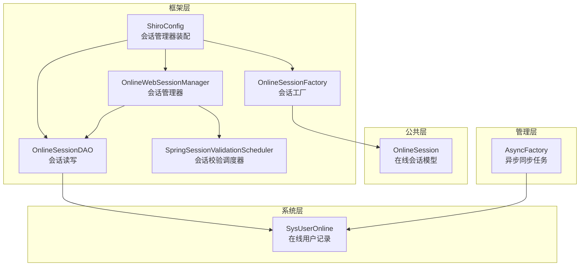
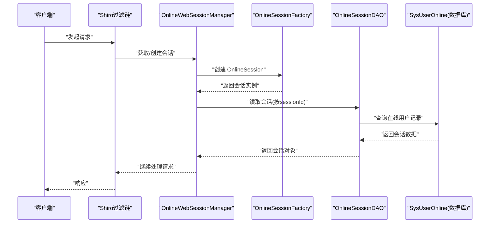
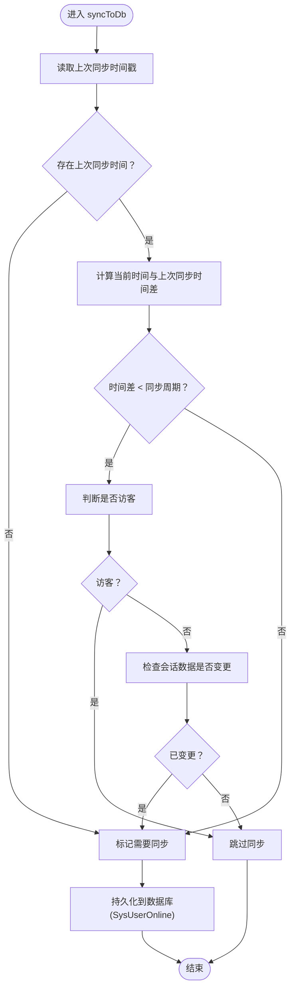
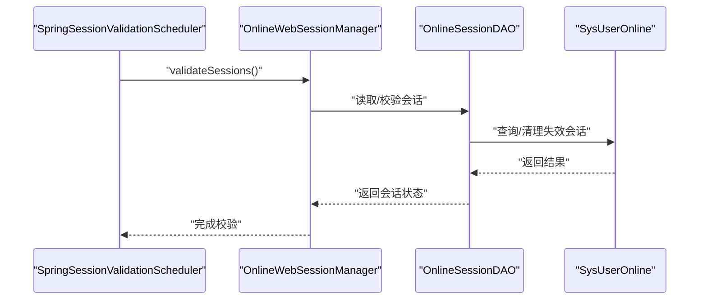
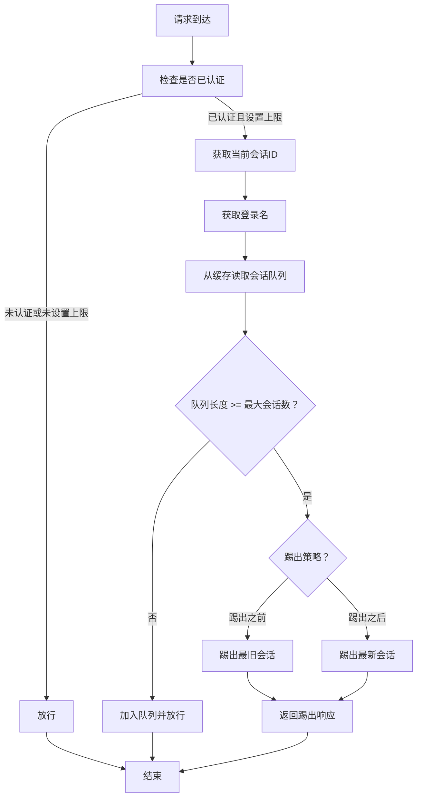
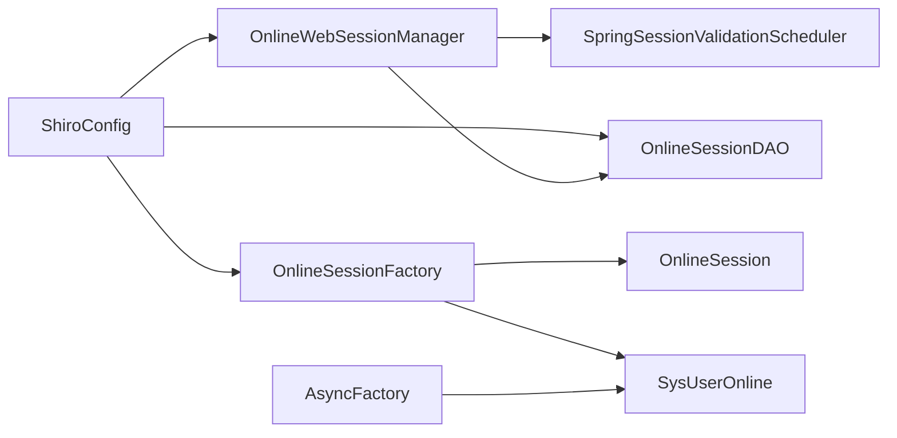

# 会话管理

<cite>
**本文引用的文件**
- [OnlineSessionDAO.java](file://ruoyi-framework/src/main/java/com/ruoyi/framework/shiro/session/OnlineSessionDAO.java)
- [OnlineSessionFactory.java](file://ruoyi-framework/src/main/java/com/ruoyi/framework/shiro/session/OnlineSessionFactory.java)
- [OnlineWebSessionManager.java](file://ruoyi-framework/src/main/java/com/ruoyi/framework/shiro/web/session/OnlineWebSessionManager.java)
- [ShiroConfig.java](file://ruoyi-framework/src/main/java/com/ruoyi/framework/config/ShiroConfig.java)
- [AsyncFactory.java](file://ruoyi-framework/src/main/java/com/ruoyi/framework/manager/factory/AsyncFactory.java)
- [SysUserOnline.java](file://ruoyi-system/src/main/java/com/ruoyi/system/domain/SysUserOnline.java)
- [KickoutSessionFilter.java](file://ruoyi-framework/src/main/java/com/ruoyi/framework/shiro/web/filter/kickout/KickoutSessionFilter.java)
- [application.yml](file://ruoyi-admin/src/main/resources/application.yml)
</cite>

## 目录
1. [简介](#简介)
2. [项目结构](#项目结构)
3. [核心组件](#核心组件)
4. [架构总览](#架构总览)
5. [详细组件分析](#详细组件分析)
6. [依赖关系分析](#依赖关系分析)
7. [性能考虑](#性能考虑)
8. [故障排查指南](#故障排查指南)
9. [结论](#结论)

## 简介
本文件面向原神攻略系统的在线会话管理子系统，围绕以下目标展开：深入解析 OnlineSessionDAO 的会话存储与检索实现、OnlineSessionFactory 的会话工厂设计（创建、配置与生命周期）、OnlineWebSessionManager 的会话管理器能力（过期处理、并发会话控制、会话同步），并提供超时配置、最大并发会话数限制与强制下线的实现方法。同时覆盖会话状态监控、在线用户统计、会话清理策略，以及会话安全配置（会话固定攻击防护、会话劫持检测、CSRF 防护）与持久化存储及分布式共享机制。

## 项目结构
会话管理相关代码主要分布在框架层与系统层：
- 框架层（ruoyi-framework）：Shiro 扩展的会话 DAO、会话工厂、会话管理器、Shiro 配置与调度器
- 公共层（ruoyi-common）：在线会话模型 OnlineSession
- 系统层（ruoyi-system）：在线用户记录实体 SysUserOnline 及服务接口
- 管理层（ruoyi-framework/manager）：异步任务工厂，负责周期性同步会话到数据库

**图表来源**
- [ShiroConfig.java](file://ruoyi-framework/src/main/java/com/ruoyi/framework/config/ShiroConfig.java)
- [OnlineSessionDAO.java](file://ruoyi-framework/src/main/java/com/ruoyi/framework/shiro/session/OnlineSessionDAO.java)
- [OnlineSessionFactory.java](file://ruoyi-framework/src/main/java/com/ruoyi/framework/shiro/session/OnlineSessionFactory.java)
- [OnlineWebSessionManager.java](file://ruoyi-framework/src/main/java/com/ruoyi/framework/shiro/web/session/OnlineWebSessionManager.java)
- [AsyncFactory.java](file://ruoyi-framework/src/main/java/com/ruoyi/framework/manager/factory/AsyncFactory.java)
- [SysUserOnline.java](file://ruoyi-system/src/main/java/com/ruoyi/system/domain/SysUserOnline.java)

**章节来源**
- [ShiroConfig.java](file://ruoyi-framework/src/main/java/com/ruoyi/framework/config/ShiroConfig.java)

## 核心组件
- OnlineSessionDAO：基于数据库的会话读写实现，负责根据 sessionId 读取会话，并在必要时将会话同步到数据库，支持按时间周期与数据变更触发同步。
- OnlineSessionFactory：会话工厂，负责创建 OnlineSession 实例，从数据库恢复会话时进行反序列化，失败则降级重建基础字段会话。
- OnlineWebSessionManager：扩展的 Web 会话管理器，负责会话属性变更标记、批量删除失效会话、禁用不支持的活动会话查询等。
- AsyncFactory：异步工厂，提供定时将 OnlineSession 同步到数据库的任务，包含序列化会话数据以便重启后恢复。
- SysUserOnline：在线用户记录实体，承载会话持久化所需的关键字段（如 sessionId、登录名、IP、浏览器、操作系统、开始时间、最后访问时间、过期时间、状态、会话二进制数据等）。

**章节来源**
- [OnlineSessionDAO.java](file://ruoyi-framework/src/main/java/com/ruoyi/framework/shiro/session/OnlineSessionDAO.java)
- [OnlineSessionFactory.java](file://ruoyi-framework/src/main/java/com/ruoyi/framework/shiro/session/OnlineSessionFactory.java)
- [OnlineWebSessionManager.java](file://ruoyi-framework/src/main/java/com/ruoyi/framework/shiro/web/session/OnlineWebSessionManager.java)
- [AsyncFactory.java](file://ruoyi-framework/src/main/java/com/ruoyi/framework/manager/factory/AsyncFactory.java)
- [SysUserOnline.java](file://ruoyi-system/src/main/java/com/ruoyi/system/domain/SysUserOnline.java)

## 架构总览
在线会话管理采用“Shiro 会话 + 自定义 DAO + 在线用户持久化 + 异步同步 + 调度器”的组合架构。会话生命周期从创建、访问、更新到过期清理贯穿整个系统，通过管理器统一调度，DAO 负责持久化，工厂负责会话重建，异步任务负责周期性同步。

**图表来源**
- [OnlineWebSessionManager.java](file://ruoyi-framework/src/main/java/com/ruoyi/framework/shiro/web/session/OnlineWebSessionManager.java)
- [OnlineSessionFactory.java](file://ruoyi-framework/src/main/java/com/ruoyi/framework/shiro/session/OnlineSessionFactory.java)
- [OnlineSessionDAO.java](file://ruoyi-framework/src/main/java/com/ruoyi/framework/shiro/session/OnlineSessionDAO.java)
- [SysUserOnline.java](file://ruoyi-system/src/main/java/com/ruoyi/system/domain/SysUserOnline.java)

## 详细组件分析

### OnlineSessionDAO：会话存储与检索
- 读取逻辑：根据 sessionId 从系统服务中获取会话，实现对会话的按需加载。
- 更新与同步：提供同步到数据库的方法，基于“最后同步时间戳”与“数据库同步周期”判断是否需要同步；同时支持基于访客身份与数据变更的同步触发。
- 与数据库交互：通过 SysUserOnline 实体承载会话持久化字段，DAO 负责将 OnlineSession 的关键信息映射到该实体并持久化。

**图表来源**
- [OnlineSessionDAO.java](file://ruoyi-framework/src/main/java/com/ruoyi/framework/shiro/session/OnlineSessionDAO.java)
- [SysUserOnline.java](file://ruoyi-system/src/main/java/com/ruoyi/system/domain/SysUserOnline.java)

**章节来源**
- [OnlineSessionDAO.java](file://ruoyi-framework/src/main/java/com/ruoyi/framework/shiro/session/OnlineSessionDAO.java)
- [SysUserOnline.java](file://ruoyi-system/src/main/java/com/ruoyi/system/domain/SysUserOnline.java)

### OnlineSessionFactory：会话工厂设计
- 会话创建：在 Web 上下文中根据请求初始化 OnlineSession，填充主机、浏览器、操作系统等信息。
- 会话恢复：优先尝试从数据库中的会话二进制数据进行反序列化恢复；若失败则降级使用基础字段重建会话，避免因序列化问题导致无法登录。
- 生命周期：确保会话 ID 与数据库记录一致，保证后续同步与查询的正确性。

```mermaid
classDiagram
class OnlineSessionFactory {
+createSession(initData)
+onScheduleSync(session)
}
class OnlineSession {
+getId()
+getHost()
+getBrowser()
+getOs()
+getStartTimestamp()
+getLastAccessTime()
+getTimeout()
+getStatus()
}
class SysUserOnline {
+getSessionId()
+getLoginName()
+getIpaddr()
+getBrowser()
+getOs()
+getStartTimestamp()
+getLastAccessTime()
+getExpireTime()
+getStatus()
+getSessionData()
}
OnlineSessionFactory --> OnlineSession : "创建/恢复"
OnlineSessionFactory --> SysUserOnline : "读取/降级重建"
```

**图表来源**
- [OnlineSessionFactory.java](file://ruoyi-framework/src/main/java/com/ruoyi/framework/shiro/session/OnlineSessionFactory.java)
- [OnlineSession.java](file://ruoyi-common/src/main/java/com/ruoyi/common/core/session/OnlineSession.java)
- [SysUserOnline.java](file://ruoyi-system/src/main/java/com/ruoyi/system/domain/SysUserOnline.java)

**章节来源**
- [OnlineSessionFactory.java](file://ruoyi-framework/src/main/java/com/ruoyi/framework/shiro/session/OnlineSessionFactory.java)

### OnlineWebSessionManager：会话管理器
- 属性变更标记：当会话属性被修改时进行标记，便于后续 DAO 同步。
- 批量失效处理：定期扫描并批量删除数据库中的失效会话，减少冗余数据。
- 功能限制：明确不支持获取活动会话集合的查询操作，避免不必要的性能开销。
- 与调度器集成：通过 SpringSessionValidationScheduler 定时触发会话校验，确保过期会话及时失效。

**图表来源**
- [OnlineWebSessionManager.java](file://ruoyi-framework/src/main/java/com/ruoyi/framework/shiro/web/session/OnlineWebSessionManager.java)
- [SpringSessionValidationScheduler.java](file://ruoyi-framework/src/main/java/com/ruoyi/framework/shiro/web/session/SpringSessionValidationScheduler.java)
- [OnlineSessionDAO.java](file://ruoyi-framework/src/main/java/com/ruoyi/framework/shiro/session/OnlineSessionDAO.java)
- [SysUserOnline.java](file://ruoyi-system/src/main/java/com/ruoyi/system/domain/SysUserOnline.java)

**章节来源**
- [OnlineWebSessionManager.java](file://ruoyi-framework/src/main/java/com/ruoyi/framework/shiro/web/session/OnlineWebSessionManager.java)
- [SpringSessionValidationScheduler.java](file://ruoyi-framework/src/main/java/com/ruoyi/framework/shiro/web/session/SpringSessionValidationScheduler.java)

### 并发会话控制与强制下线
- 控制策略：通过 KickoutSessionFilter 对同一用户的最大会话数进行限制，支持“踢出之前登录用户”或“踢出之后登录用户”的策略。
- 缓存队列：使用缓存维护每个登录名对应的会话 ID 队列，按策略决定是否拒绝新会话或踢出旧会话。
- 统一处理：与会话管理器配合，在会话创建或访问时进行并发控制，保障资源与安全。

**图表来源**
- [KickoutSessionFilter.java](file://ruoyi-framework/src/main/java/com/ruoyi/framework/shiro/web/filter/kickout/KickoutSessionFilter.java)

**章节来源**
- [KickoutSessionFilter.java](file://ruoyi-framework/src/main/java/com/ruoyi/framework/shiro/web/filter/kickout/KickoutSessionFilter.java)

### 会话超时配置与清理策略
- 全局超时：通过会话管理器设置全局会话超时时间，结合调度器定时校验，确保过期会话被及时清理。
- 同步周期：DAO 中的数据库同步周期参数控制会话数据写回数据库的时间间隔，平衡实时性与性能。
- 清理策略：管理器在会话校验阶段批量删除数据库中的失效会话，避免脏数据积累。

**章节来源**
- [ShiroConfig.java](file://ruoyi-framework/src/main/java/com/ruoyi/framework/config/ShiroConfig.java)
- [OnlineSessionDAO.java](file://ruoyi-framework/src/main/java/com/ruoyi/framework/shiro/session/OnlineSessionDAO.java)
- [OnlineWebSessionManager.java](file://ruoyi-framework/src/main/java/com/ruoyi/framework/shiro/web/session/OnlineWebSessionManager.java)

### 会话状态监控与在线用户统计
- 在线用户统计：SysUserOnline 实体记录登录名、IP、浏览器、操作系统、开始时间、最后访问时间、过期时间与状态，可用于统计在线用户数量与活跃度。
- 异步同步：AsyncFactory 提供定时任务，将 OnlineSession 序列化后写入数据库，便于系统重启后恢复会话状态。
- 日志输出：管理器在批量删除失效会话后输出日志，便于运维监控与审计。

**章节来源**
- [SysUserOnline.java](file://ruoyi-system/src/main/java/com/ruoyi/system/domain/SysUserOnline.java)
- [AsyncFactory.java](file://ruoyi-framework/src/main/java/com/ruoyi/framework/manager/factory/AsyncFactory.java)
- [OnlineWebSessionManager.java](file://ruoyi-framework/src/main/java/com/ruoyi/framework/shiro/web/session/OnlineWebSessionManager.java)

### 会话安全配置
- 会话固定攻击防护：通过禁用 URL 重写（不使用 JSESSIONID）与严格的会话创建上下文，降低会话固定风险。
- 会话劫持检测：结合 IP、浏览器、操作系统等字段进行会话绑定与校验，异常变化时触发强制下线或重新认证。
- CSRF 防护：系统提供 CSRF 过滤器与令牌机制，建议在会话管理中启用并结合会话属性进行令牌校验。

**章节来源**
- [ShiroConfig.java](file://ruoyi-framework/src/main/java/com/ruoyi/framework/config/ShiroConfig.java)
- [OnlineSessionFactory.java](file://ruoyi-framework/src/main/java/com/ruoyi/framework/shiro/session/OnlineSessionFactory.java)

### 分布式会话共享机制
- 缓存共享：会话管理器配置了缓存管理器，会话数据在内存缓存中进行共享，便于多节点环境下的会话一致性。
- 数据库持久化：通过 SysUserOnline 实体实现会话数据的持久化，支持跨节点恢复与审计。
- 异步同步：异步任务定时将会话序列化写入数据库，增强重启后的会话恢复能力。

**章节来源**
- [ShiroConfig.java](file://ruoyi-framework/src/main/java/com/ruoyi/framework/config/ShiroConfig.java)
- [AsyncFactory.java](file://ruoyi-framework/src/main/java/com/ruoyi/framework/manager/factory/AsyncFactory.java)
- [SysUserOnline.java](file://ruoyi-system/src/main/java/com/ruoyi/system/domain/SysUserOnline.java)

## 依赖关系分析
- 组件耦合：OnlineWebSessionManager 依赖 OnlineSessionDAO 与 SpringSessionValidationScheduler；OnlineSessionFactory 依赖 OnlineSession 与 SysUserOnline；ShiroConfig 负责装配上述组件。
- 外部依赖：使用 EhCache 作为缓存管理器，应用配置文件提供会话校验间隔等参数。

**图表来源**
- [ShiroConfig.java](file://ruoyi-framework/src/main/java/com/ruoyi/framework/config/ShiroConfig.java)
- [OnlineWebSessionManager.java](file://ruoyi-framework/src/main/java/com/ruoyi/framework/shiro/web/session/OnlineWebSessionManager.java)
- [OnlineSessionDAO.java](file://ruoyi-framework/src/main/java/com/ruoyi/framework/shiro/session/OnlineSessionDAO.java)
- [OnlineSessionFactory.java](file://ruoyi-framework/src/main/java/com/ruoyi/framework/shiro/session/OnlineSessionFactory.java)
- [AsyncFactory.java](file://ruoyi-framework/src/main/java/com/ruoyi/framework/manager/factory/AsyncFactory.java)
- [SysUserOnline.java](file://ruoyi-system/src/main/java/com/ruoyi/system/domain/SysUserOnline.java)

**章节来源**
- [ShiroConfig.java](file://ruoyi-framework/src/main/java/com/ruoyi/framework/config/ShiroConfig.java)

## 性能考虑
- 同步周期权衡：数据库同步周期过短会增加写压力，过长可能导致数据延迟；应结合业务场景调整。
- 缓存命中率：合理配置缓存容量与淘汰策略，提升会话读取性能。
- 定时任务并发：调度器与异步同步任务应避免高并发冲突，建议使用分布式锁或限流策略。
- 查询优化：SysUserOnline 表应建立合适的索引（如登录名、最后访问时间），以支持高效统计与清理。

## 故障排查指南
- 会话无法恢复：检查数据库中的会话二进制数据是否完整，确认序列化版本兼容性。
- 并发会话被频繁踢出：核对 KickoutSessionFilter 的最大会话数与踢出策略配置，评估业务合理性。
- 会话清理不生效：确认 SpringSessionValidationScheduler 已启用且调度间隔合理，检查管理器的批量删除逻辑。
- CSRF 或会话劫持问题：检查会话绑定字段（IP、UA、OS）是否与实际访问一致，必要时开启更严格的安全策略。

**章节来源**
- [OnlineSessionFactory.java](file://ruoyi-framework/src/main/java/com/ruoyi/framework/shiro/session/OnlineSessionFactory.java)
- [KickoutSessionFilter.java](file://ruoyi-framework/src/main/java/com/ruoyi/framework/shiro/web/filter/kickout/KickoutSessionFilter.java)
- [OnlineWebSessionManager.java](file://ruoyi-framework/src/main/java/com/ruoyi/framework/shiro/web/session/OnlineWebSessionManager.java)
- [SpringSessionValidationScheduler.java](file://ruoyi-framework/src/main/java/com/ruoyi/framework/shiro/web/session/SpringSessionValidationScheduler.java)

## 结论
原神攻略系统的会话管理通过 Shiro 扩展与自定义组件实现了完善的在线会话生命周期管理。OnlineSessionDAO、OnlineSessionFactory、OnlineWebSessionManager 协同工作，结合数据库持久化与异步同步，提供了可靠的会话存储、检索与清理能力。配合并发控制与安全策略，系统能够在保证用户体验的同时满足安全与性能要求。建议在生产环境中根据业务负载调整同步周期与缓存策略，并完善监控与告警机制。