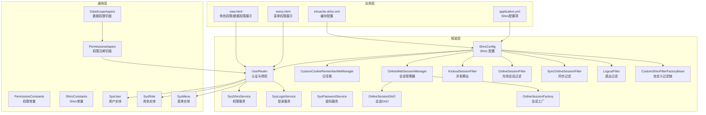
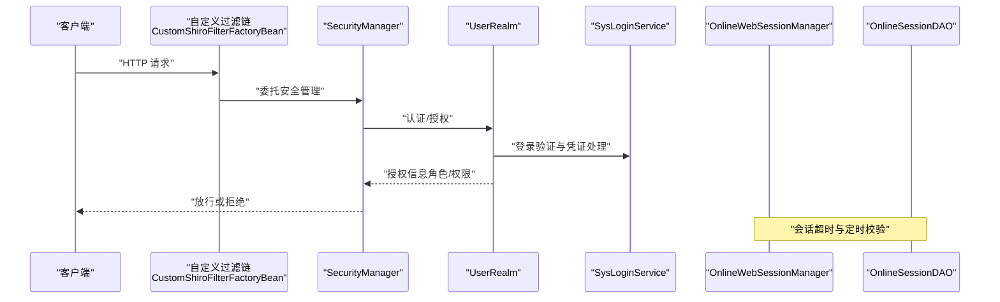
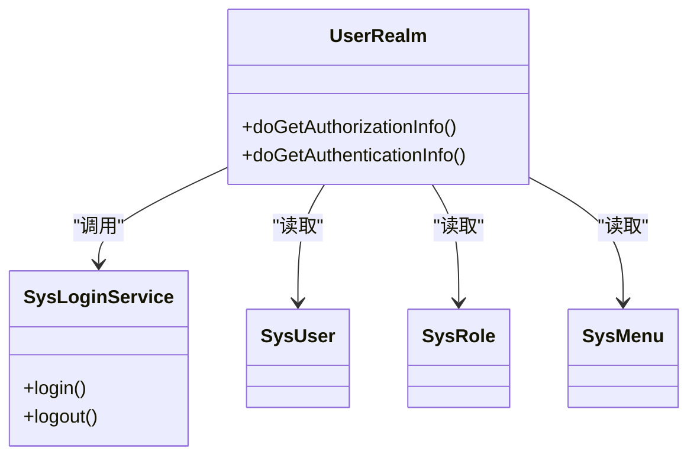
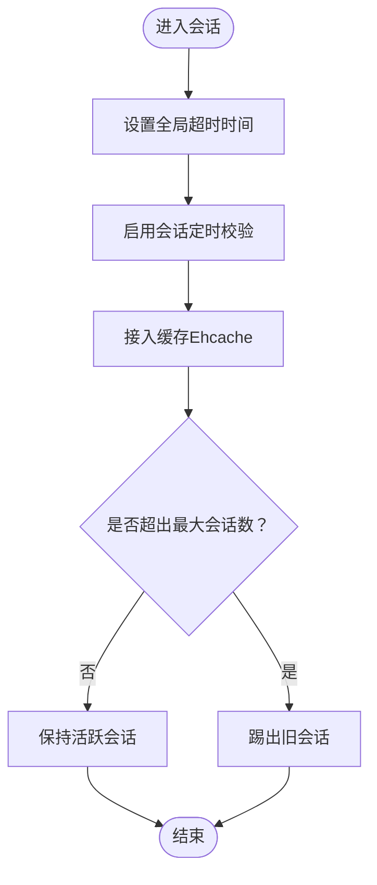
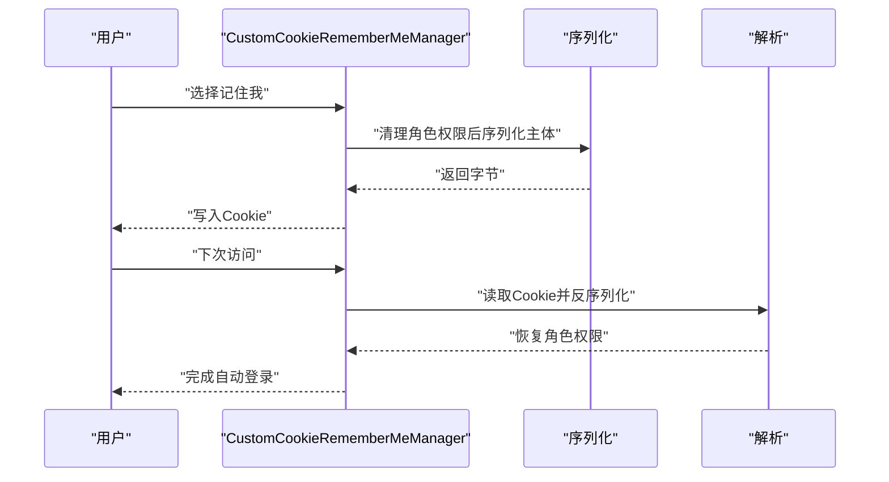
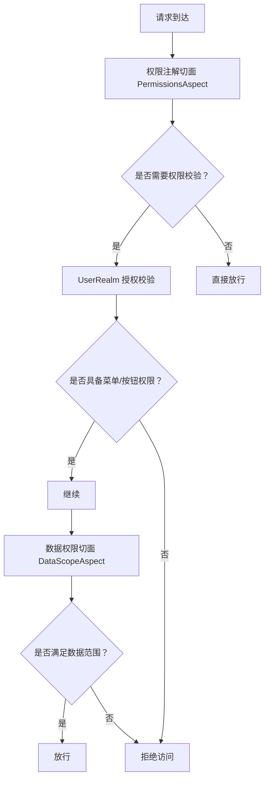
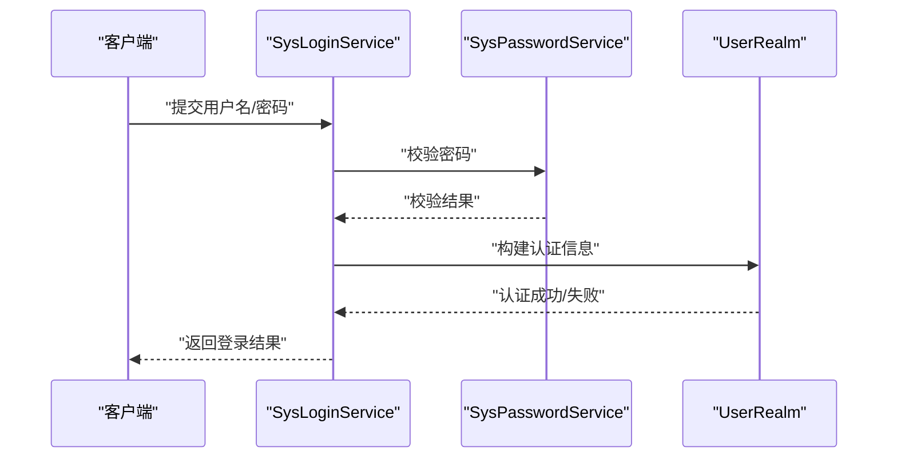
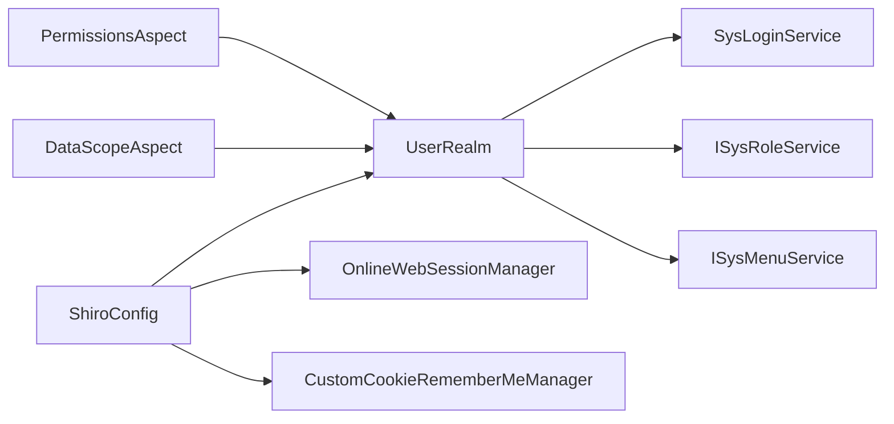

# 安全与权限

<cite>
**本文引用的文件**
- [UserRealm.java](file://ruoyi-framework/src/main/java/com/ruoyi/framework/shiro/realm/UserRealm.java)
- [ShiroConfig.java](file://ruoyi-framework/src/main/java/com/ruoyi/framework/config/ShiroConfig.java)
- [CustomCookieRememberMeManager.java](file://ruoyi-framework/src/main/java/com/ruoyi/framework/shiro/rememberMe/CustomCookieRememberMeManager.java)
- [AuthorizationUtils.java](file://ruoyi-framework/src/main/java/com/ruoyi/framework/shiro/util/AuthorizationUtils.java)
- [SysShiroService.java](file://ruoyi-framework/src/main/java/com/ruoyi/framework/shiro/service/SysShiroService.java)
- [SysLoginService.java](file://ruoyi-framework/src/main/java/com/ruoyi/framework/shiro/service/SysLoginService.java)
- [SysPasswordService.java](file://ruoyi-framework/src/main/java/com/ruoyi/framework/shiro/service/SysPasswordService.java)
- [OnlineSessionDAO.java](file://ruoyi-framework/src/main/java/com/ruoyi/framework/shiro/session/OnlineSessionDAO.java)
- [OnlineSessionFactory.java](file://ruoyi-framework/src/main/java/com/ruoyi/framework/shiro/session/OnlineSessionFactory.java)
- [OnlineWebSessionManager.java](file://ruoyi-framework/src/main/java/com/ruoyi/framework/shiro/web/session/OnlineWebSessionManager.java)
- [LogoutFilter.java](file://ruoyi-framework/src/main/java/com/ruoyi/framework/shiro/web/filter/LogoutFilter.java)
- [KickoutSessionFilter.java](file://ruoyi-framework/src/main/java/com/ruoyi/framework/shiro/web/filter/kickout/KickoutSessionFilter.java)
- [OnlineSessionFilter.java](file://ruoyi-framework/src/main/java/com/ruoyi/framework/shiro/web/filter/online/OnlineSessionFilter.java)
- [SyncOnlineSessionFilter.java](file://ruoyi-framework/src/main/java/com/ruoyi/framework/shiro/web/filter/sync/SyncOnlineSessionFilter.java)
- [CustomShiroFilterFactoryBean.java](file://ruoyi-framework/src/main/java/com/ruoyi/framework/shiro/web/CustomShiroFilterFactoryBean.java)
- [PermissionConstants.java](file://ruoyi-common/src/main/java/com/ruoyi/common/constant/PermissionConstants.java)
- [ShiroConstants.java](file://ruoyi-common/src/main/java/com/ruoyi/common/constant/ShiroConstants.java)
- [DataScopeAspect.java](file://ruoyi-framework/src/main/java/com/ruoyi/framework/aspectj/DataScopeAspect.java)
- [PermissionsAspect.java](file://ruoyi-framework/src/main/java/com/ruoyi/framework/aspectj/PermissionsAspect.java)
- [SysRole.java](file://ruoyi-common/src/main/java/com/ruoyi/common/core/domain/entity/SysRole.java)
- [SysUser.java](file://ruoyi-common/src/main/java/com/ruoyi/common/core/domain/entity/SysUser.java)
- [SysMenu.java](file://ruoyi-common/src/main/java/com/ruoyi/common/core/domain/entity/SysMenu.java)
- [application.yml](file://ruoyi-admin/src/main/resources/application.yml)
- [ehcache-shiro.xml](file://ruoyi-admin/src/main/resources/ehcache/ehcache-shiro.xml)
- [menu.html](file://ruoyi-admin/src/main/resources/templates/system/menu/menu.html)
- [view.html](file://ruoyi-admin/src/main/resources/templates/system/role/view.html)
</cite>

## 目录
1. [简介](#简介)
2. [项目结构](#项目结构)
3. [核心组件](#核心组件)
4. [架构总览](#架构总览)
5. [详细组件分析](#详细组件分析)
6. [依赖关系分析](#依赖关系分析)
7. [性能考量](#性能考量)
8. [故障排查指南](#故障排查指南)
9. [结论](#结论)
10. [附录](#附录)

## 简介
本文件面向原神攻略系统的安全与权限管理，基于 Apache Shiro 实现，覆盖用户认证、授权机制、会话管理、记住我、并发登录控制、密码加密、数据权限与菜单/按钮权限等。文档同时提供角色管理、用户管理与权限分配的操作指南，并总结安全配置最佳实践与常见风险防范。

## 项目结构
围绕安全与权限的关键模块分布于 framework、common 与 admin 模块：
- framework 模块：Shiro 配置、Realm、会话管理、过滤器、服务层（登录/注册/密码服务）、工具类
- common 模块：常量（权限、Shiro）、实体模型（用户、角色、菜单）
- admin 模块：前端模板展示菜单/角色权限与数据权限配置界面

图表来源
- [ShiroConfig.java:28-248](file://ruoyi-framework/src/main/java/com/ruoyi/framework/config/ShiroConfig.java#L28-L248)
- [UserRealm.java:40-200](file://ruoyi-framework/src/main/java/com/ruoyi/framework/shiro/realm/UserRealm.java#L40-L200)
- [SysShiroService.java:1-200](file://ruoyi-framework/src/main/java/com/ruoyi/framework/shiro/service/SysShiroService.java#L1-L200)
- [SysLoginService.java:1-200](file://ruoyi-framework/src/main/java/com/ruoyi/framework/shiro/service/SysLoginService.java#L1-L200)
- [SysPasswordService.java:1-200](file://ruoyi-framework/src/main/java/com/ruoyi/framework/shiro/service/SysPasswordService.java#L1-L200)
- [CustomCookieRememberMeManager.java:16-57](file://ruoyi-framework/src/main/java/com/ruoyi/framework/shiro/rememberMe/CustomCookieRememberMeManager.java#L16-L57)
- [OnlineWebSessionManager.java:1-200](file://ruoyi-framework/src/main/java/com/ruoyi/framework/shiro/web/session/OnlineWebSessionManager.java#L1-L200)
- [OnlineSessionDAO.java:1-200](file://ruoyi-framework/src/main/java/com/ruoyi/framework/shiro/session/OnlineSessionDAO.java#L1-L200)
- [OnlineSessionFactory.java:1-200](file://ruoyi-framework/src/main/java/com/ruoyi/framework/shiro/session/OnlineSessionFactory.java#L1-L200)
- [KickoutSessionFilter.java:1-200](file://ruoyi-framework/src/main/java/com/ruoyi/framework/shiro/web/filter/kickout/KickoutSessionFilter.java#L1-L200)
- [OnlineSessionFilter.java:1-200](file://ruoyi-framework/src/main/java/com/ruoyi/framework/shiro/web/filter/online/OnlineSessionFilter.java#L1-L200)
- [SyncOnlineSessionFilter.java:1-200](file://ruoyi-framework/src/main/java/com/ruoyi/framework/shiro/web/filter/sync/SyncOnlineSessionFilter.java#L1-L200)
- [LogoutFilter.java:1-200](file://ruoyi-framework/src/main/java/com/ruoyi/framework/shiro/web/filter/LogoutFilter.java#L1-L200)
- [CustomShiroFilterFactoryBean.java:61-85](file://ruoyi-framework/src/main/java/com/ruoyi/framework/shiro/web/CustomShiroFilterFactoryBean.java#L61-L85)
- [PermissionConstants.java:1-200](file://ruoyi-common/src/main/java/com/ruoyi/common/constant/PermissionConstants.java#L1-L200)
- [ShiroConstants.java:1-200](file://ruoyi-common/src/main/java/com/ruoyi/common/constant/ShiroConstants.java#L1-L200)
- [DataScopeAspect.java:1-200](file://ruoyi-framework/src/main/java/com/ruoyi/framework/aspectj/DataScopeAspect.java#L1-L200)
- [PermissionsAspect.java:1-200](file://ruoyi-framework/src/main/java/com/ruoyi/framework/aspectj/PermissionsAspect.java#L1-L200)
- [SysUser.java:1-200](file://ruoyi-common/src/main/java/com/ruoyi/common/core/domain/entity/SysUser.java#L1-L200)
- [SysRole.java:1-200](file://ruoyi-common/src/main/java/com/ruoyi/common/core/domain/entity/SysRole.java#L1-L200)
- [SysMenu.java:1-200](file://ruoyi-common/src/main/java/com/ruoyi/common/core/domain/entity/SysMenu.java#L1-L200)
- [application.yml:1-200](file://ruoyi-admin/src/main/resources/application.yml#L1-L200)
- [ehcache-shiro.xml:1-200](file://ruoyi-admin/src/main/resources/ehcache/ehcache-shiro.xml#L1-L200)
- [menu.html:124-160](file://ruoyi-admin/src/main/resources/templates/system/menu/menu.html#L124-L160)
- [view.html:105-160](file://ruoyi-admin/src/main/resources/templates/system/role/view.html#L105-L160)

章节来源
- [ShiroConfig.java:28-248](file://ruoyi-framework/src/main/java/com/ruoyi/framework/config/ShiroConfig.java#L28-L248)
- [UserRealm.java:40-200](file://ruoyi-framework/src/main/java/com/ruoyi/framework/shiro/realm/UserRealm.java#L40-L200)

## 核心组件
- 自定义 Realm（UserRealm）：负责认证与授权，从当前 Subject 中获取用户信息，查询角色与菜单权限，管理员拥有通配权限
- Shiro 配置（ShiroConfig）：装配 Realm、会话管理器、记住我、并发控制、过滤器链等
- 会话管理：OnlineWebSessionManager + OnlineSessionDAO + OnlineSessionFactory，支持全局超时、定时校验、缓存
- 记住我：CustomCookieRememberMeManager 在序列化时临时清理角色权限字符串，避免请求头过大
- 权限服务：SysShiroService、SysLoginService、SysPasswordService 提供登录、权限刷新、密码处理能力
- 权限注解与数据权限：PermissionsAspect、DataScopeAspect 在业务层拦截并执行权限校验与数据范围控制
- 前端模板：menu.html 展示菜单类型（目录/菜单/按钮）与权限标识；role/view.html 展示数据权限范围与菜单权限树

章节来源
- [UserRealm.java:40-200](file://ruoyi-framework/src/main/java/com/ruoyi/framework/shiro/realm/UserRealm.java#L40-L200)
- [ShiroConfig.java:28-248](file://ruoyi-framework/src/main/java/com/ruoyi/framework/config/ShiroConfig.java#L28-L248)
- [CustomCookieRememberMeManager.java:16-57](file://ruoyi-framework/src/main/java/com/ruoyi/framework/shiro/rememberMe/CustomCookieRememberMeManager.java#L16-L57)
- [SysShiroService.java:1-200](file://ruoyi-framework/src/main/java/com/ruoyi/framework/shiro/service/SysShiroService.java#L1-L200)
- [SysLoginService.java:1-200](file://ruoyi-framework/src/main/java/com/ruoyi/framework/shiro/service/SysLoginService.java#L1-L200)
- [SysPasswordService.java:1-200](file://ruoyi-framework/src/main/java/com/ruoyi/framework/shiro/service/SysPasswordService.java#L1-L200)
- [OnlineWebSessionManager.java:1-200](file://ruoyi-framework/src/main/java/com/ruoyi/framework/shiro/web/session/OnlineWebSessionManager.java#L1-L200)
- [OnlineSessionDAO.java:1-200](file://ruoyi-framework/src/main/java/com/ruoyi/framework/shiro/session/OnlineSessionDAO.java#L1-L200)
- [OnlineSessionFactory.java:1-200](file://ruoyi-framework/src/main/java/com/ruoyi/framework/shiro/session/OnlineSessionFactory.java#L1-L200)
- [PermissionsAspect.java:1-200](file://ruoyi-framework/src/main/java/com/ruoyi/framework/aspectj/PermissionsAspect.java#L1-L200)
- [DataScopeAspect.java:1-200](file://ruoyi-framework/src/main/java/com/ruoyi/framework/aspectj/DataScopeAspect.java#L1-L200)
- [menu.html:124-160](file://ruoyi-admin/src/main/resources/templates/system/menu/menu.html#L124-L160)
- [view.html:105-160](file://ruoyi-admin/src/main/resources/templates/system/role/view.html#L105-L160)

## 架构总览
Shiro 安全架构由“配置装配 + 过滤器链 + Realm 授权 + 会话与记住我 + 切面权限”构成，贯穿请求生命周期。

图表来源
- [CustomShiroFilterFactoryBean.java:61-85](file://ruoyi-framework/src/main/java/com/ruoyi/framework/shiro/web/CustomShiroFilterFactoryBean.java#L61-L85)
- [UserRealm.java:40-200](file://ruoyi-framework/src/main/java/com/ruoyi/framework/shiro/realm/UserRealm.java#L40-L200)
- [SysLoginService.java:1-200](file://ruoyi-framework/src/main/java/com/ruoyi/framework/shiro/service/SysLoginService.java#L1-L200)
- [OnlineWebSessionManager.java:1-200](file://ruoyi-framework/src/main/java/com/ruoyi/framework/shiro/web/session/OnlineWebSessionManager.java#L1-L200)
- [OnlineSessionDAO.java:1-200](file://ruoyi-framework/src/main/java/com/ruoyi/framework/shiro/session/OnlineSessionDAO.java#L1-L200)

## 详细组件分析

### UserRealm 认证与授权
- 认证流程：通过 SysLoginService 校验用户名/密码，失败抛出相应异常
- 授权流程：读取当前用户的角色与菜单，管理员授予通配权限；普通用户按角色/菜单生成权限集合
- 缓存策略：授权信息缓存由 AuthorizationUtils 统一清理，避免权限变更不生效

图表来源
- [UserRealm.java:40-200](file://ruoyi-framework/src/main/java/com/ruoyi/framework/shiro/realm/UserRealm.java#L40-L200)
- [SysLoginService.java:1-200](file://ruoyi-framework/src/main/java/com/ruoyi/framework/shiro/service/SysLoginService.java#L1-L200)
- [SysUser.java:1-200](file://ruoyi-common/src/main/java/com/ruoyi/common/core/domain/entity/SysUser.java#L1-L200)
- [SysRole.java:1-200](file://ruoyi-common/src/main/java/com/ruoyi/common/core/domain/entity/SysRole.java#L1-L200)
- [SysMenu.java:1-200](file://ruoyi-common/src/main/java/com/ruoyi/common/core/domain/entity/SysMenu.java#L1-L200)

章节来源
- [UserRealm.java:40-200](file://ruoyi-framework/src/main/java/com/ruoyi/framework/shiro/realm/UserRealm.java#L40-L200)
- [AuthorizationUtils.java:1-30](file://ruoyi-framework/src/main/java/com/ruoyi/framework/shiro/util/AuthorizationUtils.java#L1-L30)

### 会话管理与超时控制
- 全局超时：通过 ShiroConfig 注入 expireTime，设置 OnlineWebSessionManager 的全局会话超时
- 定时校验：启用 SessionValidationScheduler，周期扫描失效会话并删除
- 缓存集成：结合 Ehcache 实现会话持久化与共享
- 并发控制：KickoutSessionFilter 控制同一账号最大会话数，超过则后登录者踢出

图表来源
- [ShiroConfig.java:210-248](file://ruoyi-framework/src/main/java/com/ruoyi/framework/config/ShiroConfig.java#L210-L248)
- [OnlineWebSessionManager.java:1-200](file://ruoyi-framework/src/main/java/com/ruoyi/framework/shiro/web/session/OnlineWebSessionManager.java#L1-L200)
- [OnlineSessionDAO.java:1-200](file://ruoyi-framework/src/main/java/com/ruoyi/framework/shiro/session/OnlineSessionDAO.java#L1-L200)
- [KickoutSessionFilter.java:1-200](file://ruoyi-framework/src/main/java/com/ruoyi/framework/shiro/web/filter/kickout/KickoutSessionFilter.java#L1-L200)
- [ehcache-shiro.xml:1-200](file://ruoyi-admin/src/main/resources/ehcache/ehcache-shiro.xml#L1-L200)

章节来源
- [ShiroConfig.java:210-248](file://ruoyi-framework/src/main/java/com/ruoyi/framework/config/ShiroConfig.java#L210-L248)
- [OnlineWebSessionManager.java:1-200](file://ruoyi-framework/src/main/java/com/ruoyi/framework/shiro/web/session/OnlineWebSessionManager.java#L1-L200)
- [KickoutSessionFilter.java:1-200](file://ruoyi-framework/src/main/java/com/ruoyi/framework/shiro/web/filter/kickout/KickoutSessionFilter.java#L1-L200)

### 记住我功能
- 序列化优化：在 rememberIdentity 时临时清空角色权限字符串，避免携带过多权限导致请求头过大
- 解析恢复：序列化完成后恢复角色权限，保证后续授权正确

图表来源
- [CustomCookieRememberMeManager.java:16-57](file://ruoyi-framework/src/main/java/com/ruoyi/framework/shiro/rememberMe/CustomCookieRememberMeManager.java#L16-L57)

章节来源
- [CustomCookieRememberMeManager.java:16-57](file://ruoyi-framework/src/main/java/com/ruoyi/framework/shiro/rememberMe/CustomCookieRememberMeManager.java#L16-L57)

### 权限控制粒度设计
- 菜单权限：SysMenu 的 perms 字段作为权限标识，前端 menu.html 展示按钮类型菜单，后端通过 UserRealm 授权
- 按钮权限：菜单类型为按钮时，权限标识用于前端显隐与后端校验
- 数据权限：角色视图 view.html 展示数据范围（全部/自定义/本部门/本部门及以下/仅本人），配合 DataScopeAspect 在业务层限制数据访问范围

图表来源
- [PermissionsAspect.java:1-200](file://ruoyi-framework/src/main/java/com/ruoyi/framework/aspectj/PermissionsAspect.java#L1-L200)
- [DataScopeAspect.java:1-200](file://ruoyi-framework/src/main/java/com/ruoyi/framework/aspectj/DataScopeAspect.java#L1-L200)
- [UserRealm.java:40-200](file://ruoyi-framework/src/main/java/com/ruoyi/framework/shiro/realm/UserRealm.java#L40-L200)
- [menu.html:124-160](file://ruoyi-admin/src/main/resources/templates/system/menu/menu.html#L124-L160)
- [view.html:105-160](file://ruoyi-admin/src/main/resources/templates/system/role/view.html#L105-L160)

章节来源
- [menu.html:124-160](file://ruoyi-admin/src/main/resources/templates/system/menu/menu.html#L124-L160)
- [view.html:105-160](file://ruoyi-admin/src/main/resources/templates/system/role/view.html#L105-L160)
- [DataScopeAspect.java:1-200](file://ruoyi-framework/src/main/java/com/ruoyi/framework/aspectj/DataScopeAspect.java#L1-L200)

### 密码加密与登录流程
- 密码服务：SysPasswordService 提供密码加密与校验
- 登录服务：SysLoginService 执行登录校验、失败次数限制、登录日志记录
- 异常处理：UserNotExistsException、UserPasswordNotMatchException、UserPasswordRetryLimitExceedException 等异常引导前端提示

图表来源
- [SysLoginService.java:1-200](file://ruoyi-framework/src/main/java/com/ruoyi/framework/shiro/service/SysLoginService.java#L1-L200)
- [SysPasswordService.java:1-200](file://ruoyi-framework/src/main/java/com/ruoyi/framework/shiro/service/SysPasswordService.java#L1-L200)
- [UserRealm.java:40-200](file://ruoyi-framework/src/main/java/com/ruoyi/framework/shiro/realm/UserRealm.java#L40-L200)

章节来源
- [SysLoginService.java:1-200](file://ruoyi-framework/src/main/java/com/ruoyi/framework/shiro/service/SysLoginService.java#L1-L200)
- [SysPasswordService.java:1-200](file://ruoyi-framework/src/main/java/com/ruoyi/framework/shiro/service/SysPasswordService.java#L1-L200)

### 角色管理、用户管理与权限分配操作指南
- 角色管理
  - 数据权限范围：在角色视图中选择“全部/自定义/本部门/本部门及以下/仅本人”，自定义部门权限通过树形控件勾选
  - 菜单权限：在角色视图中查看/切换“已分配菜单”树，统计菜单数量
- 用户管理
  - 分配角色：在用户详情中关联角色，角色与用户的多对多关系通过 SysUserRole 维护
  - 权限刷新：修改角色或菜单后，可通过 AuthorizationUtils 清理授权缓存，确保权限即时生效
- 权限分配
  - 菜单权限：在菜单管理中设置 perms 权限标识，按钮类型菜单在前端以按钮形式展示
  - 数据权限：在角色中配置数据范围，业务方法通过 DataScopeAspect 生效

章节来源
- [view.html:105-160](file://ruoyi-admin/src/main/resources/templates/system/role/view.html#L105-L160)
- [menu.html:124-160](file://ruoyi-admin/src/main/resources/templates/system/menu/menu.html#L124-L160)
- [AuthorizationUtils.java:1-30](file://ruoyi-framework/src/main/java/com/ruoyi/framework/shiro/util/AuthorizationUtils.java#L1-L30)
- [DataScopeAspect.java:1-200](file://ruoyi-framework/src/main/java/com/ruoyi/framework/aspectj/DataScopeAspect.java#L1-L200)

## 依赖关系分析
- 组件耦合
  - UserRealm 依赖 SysLoginService、ISysRoleService、ISysMenuService
  - ShiroConfig 统一装配 Realm、会话管理器、记住我、过滤器
  - PermissionsAspect 与 DataScopeAspect 在业务层拦截，依赖 UserRealm 的授权结果
- 外部依赖
  - Ehcache 用于会话缓存
  - Thymeleaf Shiro dialect 用于模板权限标签

图表来源
- [ShiroConfig.java:28-248](file://ruoyi-framework/src/main/java/com/ruoyi/framework/config/ShiroConfig.java#L28-L248)
- [UserRealm.java:40-200](file://ruoyi-framework/src/main/java/com/ruoyi/framework/shiro/realm/UserRealm.java#L40-L200)
- [PermissionsAspect.java:1-200](file://ruoyi-framework/src/main/java/com/ruoyi/framework/aspectj/PermissionsAspect.java#L1-L200)
- [DataScopeAspect.java:1-200](file://ruoyi-framework/src/main/java/com/ruoyi/framework/aspectj/DataScopeAspect.java#L1-L200)

章节来源
- [ShiroConfig.java:28-248](file://ruoyi-framework/src/main/java/com/ruoyi/framework/config/ShiroConfig.java#L28-L248)
- [UserRealm.java:40-200](file://ruoyi-framework/src/main/java/com/ruoyi/framework/shiro/realm/UserRealm.java#L40-L200)

## 性能考量
- 授权缓存：UserRealm 的授权信息建议开启缓存，减少数据库查询；必要时通过 AuthorizationUtils 清理缓存
- 会话缓存：OnlineSessionDAO 结合 Ehcache，降低频繁读写数据库的成本
- 过滤器链：合理配置过滤器顺序，避免重复校验；并发踢出与在线会话同步过滤应按需启用
- 前端权限：菜单/按钮权限在前端进行显隐控制，减少无效请求

## 故障排查指南
- 登录失败
  - 检查用户名是否存在与密码是否匹配，关注 UserNotExistsException、UserPasswordNotMatchException、UserPasswordRetryLimitExceedException
  - 确认 SysLoginService 的登录流程与 SysPasswordService 的加密算法一致
- 权限不生效
  - 使用 AuthorizationUtils 清理授权缓存后重试
  - 检查角色是否正确分配，菜单 perms 是否配置
- 会话异常
  - 检查 OnlineWebSessionManager 的超时与定时校验配置
  - 确认 Ehcache 配置与缓存可用性
- 并发登录问题
  - 检查 KickoutSessionFilter 的最大会话数配置，确认后登录者是否被正确踢出

章节来源
- [SysLoginService.java:1-200](file://ruoyi-framework/src/main/java/com/ruoyi/framework/shiro/service/SysLoginService.java#L1-L200)
- [SysPasswordService.java:1-200](file://ruoyi-framework/src/main/java/com/ruoyi/framework/shiro/service/SysPasswordService.java#L1-L200)
- [AuthorizationUtils.java:1-30](file://ruoyi-framework/src/main/java/com/ruoyi/framework/shiro/util/AuthorizationUtils.java#L1-L30)
- [OnlineWebSessionManager.java:1-200](file://ruoyi-framework/src/main/java/com/ruoyi/framework/shiro/web/session/OnlineWebSessionManager.java#L1-L200)
- [KickoutSessionFilter.java:1-200](file://ruoyi-framework/src/main/java/com/ruoyi/framework/shiro/web/filter/kickout/KickoutSessionFilter.java#L1-L200)

## 结论
本系统基于 Apache Shiro 构建了完善的认证、授权、会话与权限控制体系，支持菜单/按钮/数据权限的细粒度控制，并通过切面与配置实现高内聚低耦合的安全架构。遵循本文最佳实践与排障指南，可有效提升系统的安全性与稳定性。

## 附录
- 安全配置最佳实践
  - 启用 HTTPS 传输，严格 Cookie 安全属性
  - 合理设置会话超时与定时校验间隔
  - 对敏感接口启用 CSRF 校验与重复提交拦截
  - 定期清理授权缓存，确保权限变更及时生效
- 常见安全风险与防范
  - 会话劫持：启用会话定时校验与安全 Cookie
  - 权限提升：严格菜单 perms 配置与数据范围控制
  - 并发登录滥用：合理设置最大会话数并启用踢出策略
  - 密码泄露：采用强加密算法与失败次数限制