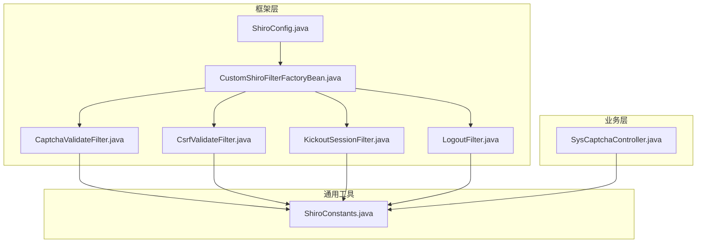
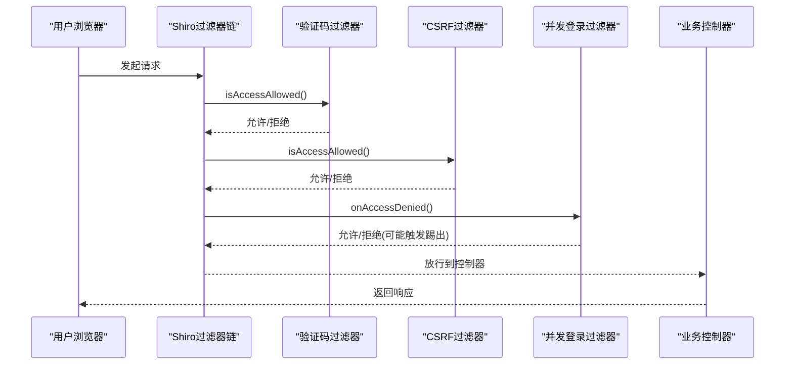
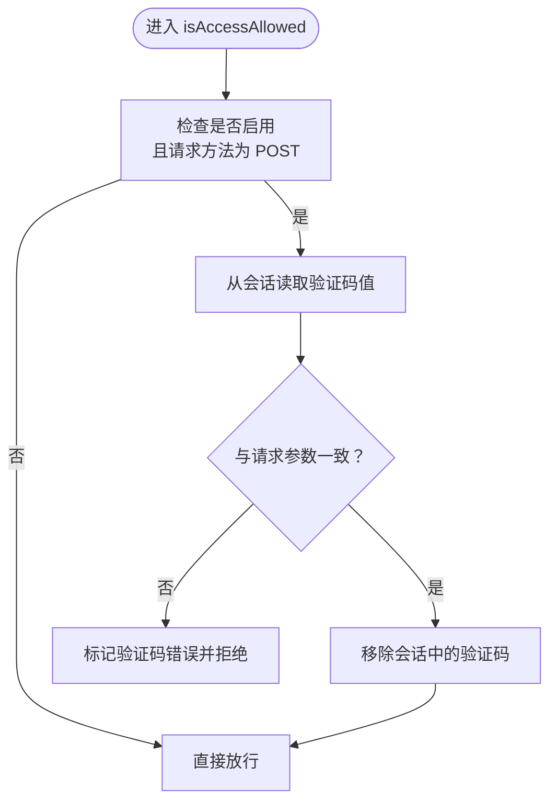
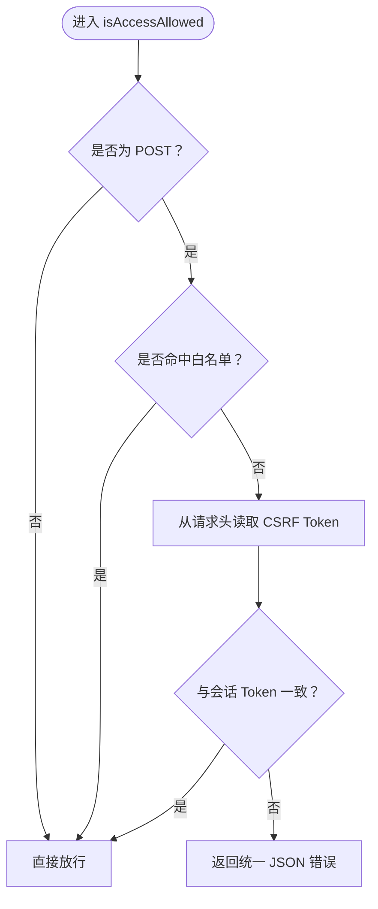
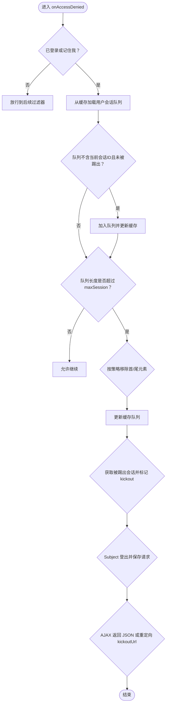
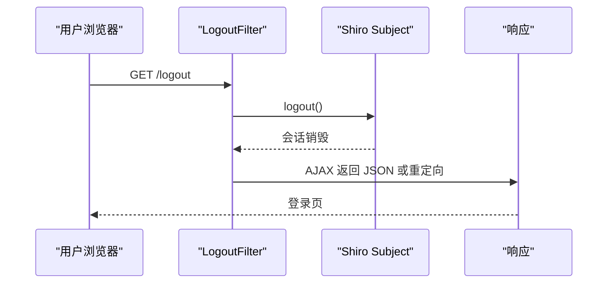
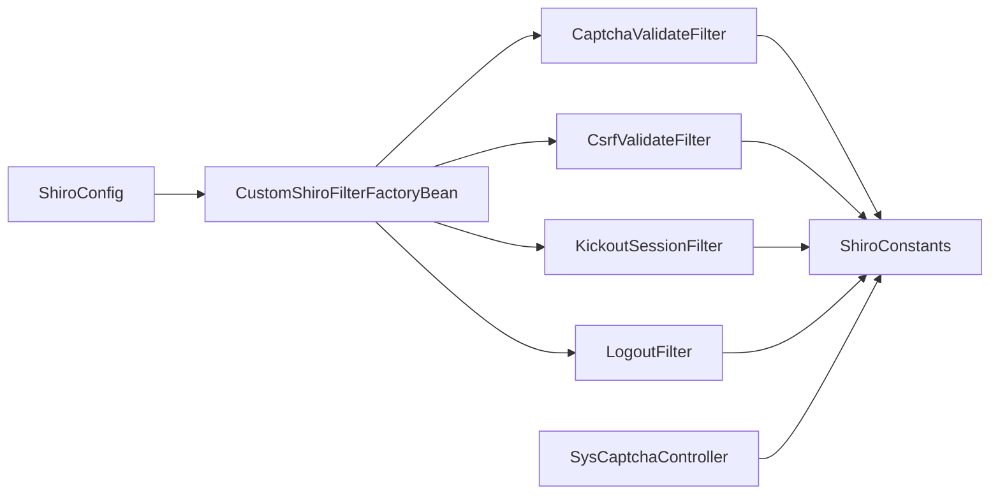

# 安全过滤器

<cite>
**本文引用的文件**
- [CaptchaValidateFilter.java](file://ruoyi-framework/src/main/java/com/ruoyi/framework/shiro/web/filter/captcha/CaptchaValidateFilter.java)
- [CsrfValidateFilter.java](file://ruoyi-framework/src/main/java/com/ruoyi/framework/shiro/web/filter/csrf/CsrfValidateFilter.java)
- [KickoutSessionFilter.java](file://ruoyi-framework/src/main/java/com/ruoyi/framework/shiro/web/filter/kickout/KickoutSessionFilter.java)
- [LogoutFilter.java](file://ruoyi-framework/src/main/java/com/ruoyi/framework/shiro/web/filter/LogoutFilter.java)
- [SysCaptchaController.java](file://ruoyi-admin/src/main/java/com/ruoyi/web/controller/system/SysCaptchaController.java)
- [ShiroConstants.java](file://ruoyi-common/src/main/java/com/ruoyi/common/constant/ShiroConstants.java)
- [ShiroConfig.java](file://ruoyi-framework/src/main/java/com/ruoyi/framework/config/ShiroConfig.java)
- [CustomShiroFilterFactoryBean.java](file://ruoyi-framework/src/main/java/com/ruoyi/framework/shiro/web/CustomShiroFilterFactoryBean.java)
</cite>

## 目录
1. [简介](#简介)
2. [项目结构](#项目结构)
3. [核心组件](#核心组件)
4. [架构总览](#架构总览)
5. [详细组件分析](#详细组件分析)
6. [依赖关系分析](#依赖关系分析)
7. [性能考量](#性能考量)
8. [故障排查指南](#故障排查指南)
9. [结论](#结论)
10. [附录](#附录)

## 简介
本文件面向“原神攻略系统”的安全过滤器体系，聚焦以下四类过滤器：验证码验证（CaptchaValidateFilter）、跨站请求伪造防护（CsrfValidateFilter）、并发登录控制（KickoutSessionFilter）与注销处理（LogoutFilter）。文档从工作机制、数据流、配置参数、扩展方式、执行顺序与优先级、性能优化、常见漏洞防护以及调试与日志策略等方面进行全面阐述，帮助开发者在不深入源码细节的前提下正确理解并安全地使用这些过滤器。

## 项目结构
安全过滤器位于框架模块中，围绕 Shiro 的 Web 过滤器体系构建，并与通用常量、配置类、验证码控制器等协同工作。

图示来源
- [ShiroConfig.java](file://ruoyi-framework/src/main/java/com/ruoyi/framework/config/ShiroConfig.java)
- [CustomShiroFilterFactoryBean.java](file://ruoyi-framework/src/main/java/com/ruoyi/framework/shiro/web/CustomShiroFilterFactoryBean.java)
- [CaptchaValidateFilter.java](file://ruoyi-framework/src/main/java/com/ruoyi/framework/shiro/web/filter/captcha/CaptchaValidateFilter.java)
- [CsrfValidateFilter.java](file://ruoyi-framework/src/main/java/com/ruoyi/framework/shiro/web/filter/csrf/CsrfValidateFilter.java)
- [KickoutSessionFilter.java](file://ruoyi-framework/src/main/java/com/ruoyi/framework/shiro/web/filter/kickout/KickoutSessionFilter.java)
- [LogoutFilter.java](file://ruoyi-framework/src/main/java/com/ruoyi/framework/shiro/web/filter/LogoutFilter.java)
- [ShiroConstants.java](file://ruoyi-common/src/main/java/com/ruoyi/common/constant/ShiroConstants.java)
- [SysCaptchaController.java](file://ruoyi-admin/src/main/java/com/ruoyi/web/controller/system/SysCaptchaController.java)

章节来源
- [ShiroConfig.java](file://ruoyi-framework/src/main/java/com/ruoyi/framework/config/ShiroConfig.java)
- [CustomShiroFilterFactoryBean.java](file://ruoyi-framework/src/main/java/com/ruoyi/framework/shiro/web/CustomShiroFilterFactoryBean.java)

## 核心组件
- 验证码过滤器（CaptchaValidateFilter）
  - 功能：在登录等敏感操作中对用户输入的验证码进行校验，支持数学式与字符式两种类型。
  - 关键点：启用开关、类型配置、请求方法限制（仅 POST）、与 Shiro 会话中的验证码值比对、校验后清理以避免复用。
- CSRF 过滤器（CsrfValidateFilter）
  - 功能：对 POST 请求进行 CSRF Token 校验，支持白名单路径跳过校验。
  - 关键点：仅拦截 POST 方法、从请求头读取 Token、与会话中的 Token 对比、白名单匹配、拒绝时返回统一 JSON 响应。
- 并发登录控制（KickoutSessionFilter）
  - 功能：基于用户维度维护会话 ID 队列，超过最大会话数时按策略踢出旧会话或新会话，并支持 AJAX 与非 AJAX 的差异化响应。
  - 关键点：最大会话数、踢出先后策略、会话管理器与缓存交互、被踢出时的登出与重定向/返回。
- 注销过滤器（LogoutFilter）
  - 功能：统一处理注销请求，销毁会话、清除权限上下文、重定向至指定页面。
  - 关键点：与 Shiro 的 Subject 登出集成、请求保存与恢复、前后端兼容的响应策略。

章节来源
- [CaptchaValidateFilter.java](file://ruoyi-framework/src/main/java/com/ruoyi/framework/shiro/web/filter/captcha/CaptchaValidateFilter.java)
- [CsrfValidateFilter.java](file://ruoyi-framework/src/main/java/com/ruoyi/framework/shiro/web/filter/csrf/CsrfValidateFilter.java)
- [KickoutSessionFilter.java](file://ruoyi-framework/src/main/java/com/ruoyi/framework/shiro/web/filter/kickout/KickoutSessionFilter.java)
- [LogoutFilter.java](file://ruoyi-framework/src/main/java/com/ruoyi/framework/shiro/web/filter/LogoutFilter.java)

## 架构总览
下图展示请求在进入业务控制器前，如何依次经过各安全过滤器的判定与处理流程。

图示来源
- [CaptchaValidateFilter.java](file://ruoyi-framework/src/main/java/com/ruoyi/framework/shiro/web/filter/captcha/CaptchaValidateFilter.java)
- [CsrfValidateFilter.java](file://ruoyi-framework/src/main/java/com/ruoyi/framework/shiro/web/filter/csrf/CsrfValidateFilter.java)
- [KickoutSessionFilter.java](file://ruoyi-framework/src/main/java/com/ruoyi/framework/shiro/web/filter/kickout/KickoutSessionFilter.java)

## 详细组件分析

### 验证码过滤器（CaptchaValidateFilter）
- 工作机制
  - 在预处理阶段向请求域写入当前是否启用验证码与验证码类型。
  - 仅当启用且请求为 POST 时才进行验证码校验；否则直接放行。
  - 校验逻辑：从会话中取出服务端验证码值，与请求参数比较，严格区分大小写；校验完成后立即从会话移除验证码，防止复用。
  - 校验失败时，向请求域标记验证码错误状态，交由后续流程处理。
- 数据流与复杂度
  - 时间复杂度：O(1)，主要为字符串比较与会话读取。
  - 空间复杂度：O(1)，仅临时变量与会话键值。
- 配置参数
  - captchaEnabled：是否启用验证码（布尔）。
  - captchaType：验证码类型（如 math/char）。
- 扩展建议
  - 可增加图形验证码与滑动验证码双模式切换。
  - 可引入 IP/用户维度的失败次数阈值与临时封禁。
- 与验证码控制器的关系
  - 验证码控制器负责生成图片与将正确答案写入会话；验证码过滤器负责读取与校验。

图示来源
- [CaptchaValidateFilter.java](file://ruoyi-framework/src/main/java/com/ruoyi/framework/shiro/web/filter/captcha/CaptchaValidateFilter.java)
- [SysCaptchaController.java](file://ruoyi-admin/src/main/java/com/ruoyi/web/controller/system/SysCaptchaController.java)

章节来源
- [CaptchaValidateFilter.java](file://ruoyi-framework/src/main/java/com/ruoyi/framework/shiro/web/filter/captcha/CaptchaValidateFilter.java)
- [SysCaptchaController.java](file://ruoyi-admin/src/main/java/com/ruoyi/web/controller/system/SysCaptchaController.java)

### CSRF 过滤器（CsrfValidateFilter）
- 工作机制
  - 仅对 POST 请求进行校验；白名单路径可直接放行。
  - 从请求头读取 CSRF Token，与会话中的 Token 进行严格比较。
  - 校验失败时返回统一 JSON 响应，提示刷新页面后重试。
- 数据流与复杂度
  - 时间复杂度：O(1)，字符串比较与会话读取。
  - 空间复杂度：O(1)，仅临时变量与会话键值。
- 配置参数
  - csrfWhites：白名单路径列表（支持通配符匹配）。
- 扩展建议
  - 支持多 Token 策略（如一次性 Token）。
  - 支持 SameSite Cookie 与 CORS 场景下的降级策略。

图示来源
- [CsrfValidateFilter.java](file://ruoyi-framework/src/main/java/com/ruoyi/framework/shiro/web/filter/csrf/CsrfValidateFilter.java)

章节来源
- [CsrfValidateFilter.java](file://ruoyi-framework/src/main/java/com/ruoyi/framework/shiro/web/filter/csrf/CsrfValidateFilter.java)

### 并发登录控制（KickoutSessionFilter）
- 工作机制
  - 拦截所有已认证或记住我的请求，根据用户维度维护会话 ID 队列。
  - 当队列长度超过 maxSession 时，依据 kickoutAfter 决定踢出“之前登录”还是“之后登录”的会话。
  - 被踢出的会话会被标记“kickout”，随后自动登出并返回统一响应（AJAX 返回 JSON，非 AJAX 重定向）。
- 数据流与复杂度
  - 时间复杂度：O(n)，n 为用户会话队列长度，通常较小；缓存读写为 O(1)。
  - 空间复杂度：O(n)，队列存储会话 ID。
- 配置参数
  - maxSession：同一账户最大会话数（-1 表示不限制）。
  - kickoutAfter：是否踢出之后登录的会话（默认踢出之前的）。
  - kickoutUrl：非 AJAX 被踢出后的重定向地址。
- 扩展建议
  - 支持管理员强制踢出某用户的所有会话。
  - 支持不同角色的最大会话数差异化配置。

图示来源
- [KickoutSessionFilter.java](file://ruoyi-framework/src/main/java/com/ruoyi/framework/shiro/web/filter/kickout/KickoutSessionFilter.java)

章节来源
- [KickoutSessionFilter.java](file://ruoyi-framework/src/main/java/com/ruoyi/framework/shiro/web/filter/kickout/KickoutSessionFilter.java)

### 注销过滤器（LogoutFilter）
- 工作机制
  - 统一处理注销请求，调用 Shiro 的 Subject.logout() 销毁会话与主体信息。
  - 保存当前请求以便登录后重定向回原页面。
  - 根据是否 AJAX 请求返回 JSON 或重定向到登录页。
- 数据流与复杂度
  - 时间复杂度：O(1)，会话销毁与重定向。
  - 空间复杂度：O(1)，无额外分配。
- 配置参数
  - 通常通过 Shiro 配置文件映射到 /logout，无需额外构造参数。
- 扩展建议
  - 记录注销事件与审计日志。
  - 清理客户端 Cookie 与本地存储。

图示来源
- [LogoutFilter.java](file://ruoyi-framework/src/main/java/com/ruoyi/framework/shiro/web/filter/LogoutFilter.java)

章节来源
- [LogoutFilter.java](file://ruoyi-framework/src/main/java/com/ruoyi/framework/shiro/web/filter/LogoutFilter.java)

## 依赖关系分析
- 过滤器与常量
  - 各过滤器均依赖 ShiroConstants 中的键名与状态常量，确保前后端约定一致。
- 过滤器与 Shiro 配置
  - ShiroConfig 负责装配 Realm、缓存、会话管理等；CustomShiroFilterFactoryBean 将上述过滤器注册到过滤器链。
- 过滤器与验证码控制器
  - SysCaptchaController 生成验证码并写入会话，验证码过滤器负责读取与校验。

图示来源
- [ShiroConstants.java](file://ruoyi-common/src/main/java/com/ruoyi/common/constant/ShiroConstants.java)
- [ShiroConfig.java](file://ruoyi-framework/src/main/java/com/ruoyi/framework/config/ShiroConfig.java)
- [CustomShiroFilterFactoryBean.java](file://ruoyi-framework/src/main/java/com/ruoyi/framework/shiro/web/CustomShiroFilterFactoryBean.java)
- [SysCaptchaController.java](file://ruoyi-admin/src/main/java/com/ruoyi/web/controller/system/SysCaptchaController.java)

章节来源
- [ShiroConstants.java](file://ruoyi-common/src/main/java/com/ruoyi/common/constant/ShiroConstants.java)
- [ShiroConfig.java](file://ruoyi-framework/src/main/java/com/ruoyi/framework/config/ShiroConfig.java)
- [CustomShiroFilterFactoryBean.java](file://ruoyi-framework/src/main/java/com/ruoyi/framework/shiro/web/CustomShiroFilterFactoryBean.java)

## 性能考量
- 缓存与会话
  - 并发登录控制依赖缓存队列存储用户会话 ID，建议使用高性能缓存（如 Ehcache/Redis），并合理设置 TTL。
- 验证码与 CSRF
  - 验证码生成与会话写入为 IO 密集型，建议在高并发场景下启用连接池与异步渲染。
  - CSRF Token 读取与比较为常量时间操作，影响极小。
- 过滤器链顺序
  - 将验证码与 CSRF 放在并发控制之前，减少无效会话占用与缓存压力。
- 响应格式
  - AJAX 请求直接返回 JSON，避免不必要的页面跳转开销。

## 故障排查指南
- 验证码无法显示或校验失败
  - 检查验证码控制器是否成功将正确答案写入会话，确认会话作用域与跨域 Cookie 设置。
  - 确认验证码过滤器的启用与类型配置正确。
- CSRF 校验失败
  - 确认请求头是否携带正确的 CSRF Token，检查 Token 是否过期或被刷新。
  - 检查白名单路径配置是否覆盖了目标接口。
- 并发登录被频繁踢出
  - 检查 maxSession 与 kickoutAfter 配置是否符合预期。
  - 观察是否存在大量短生命周期会话导致队列频繁增长。
- 注销后仍可访问受保护资源
  - 确认 LogoutFilter 是否正确注册到过滤器链，检查前端是否清除本地存储与 Cookie。

## 结论
本安全过滤器体系通过验证码、CSRF、并发登录控制与注销处理四个维度，有效提升了系统的抗攻击能力与会话安全性。结合合理的配置与扩展策略，可在保证用户体验的同时显著降低安全风险。

## 附录
- 常用配置项速查
  - 验证码：captchaEnabled、captchaType
  - CSRF：csrfWhites
  - 并发登录：maxSession、kickoutAfter、kickoutUrl
  - 注销：/logout 映射（由 Shiro 配置决定）