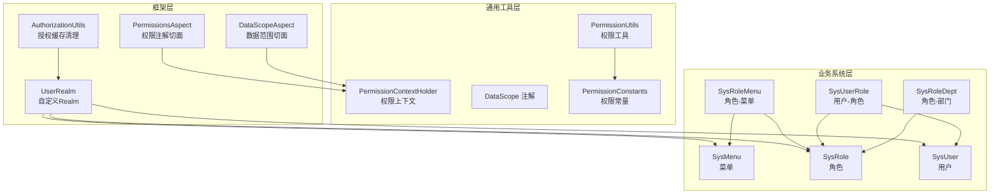
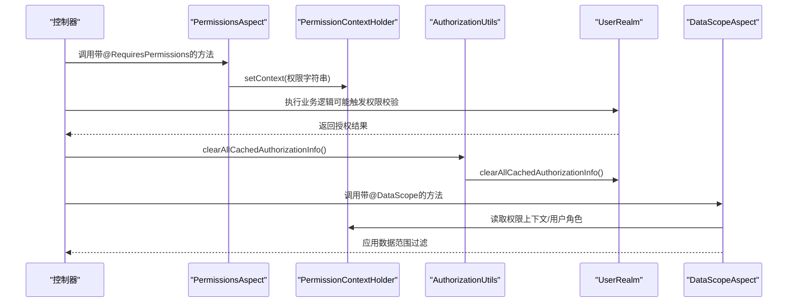
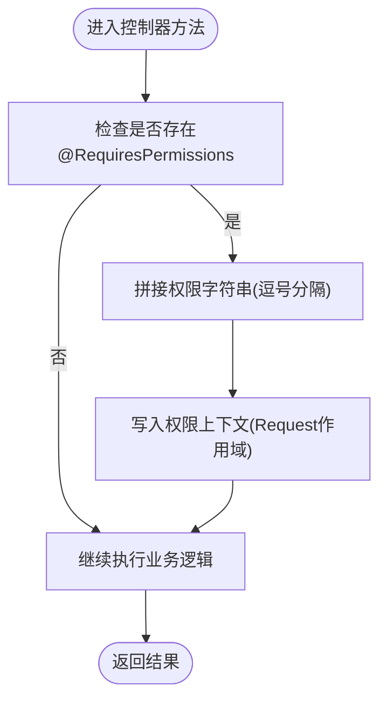
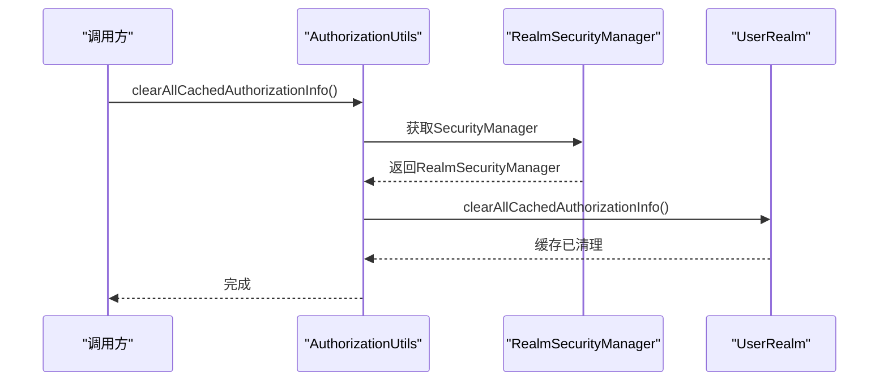
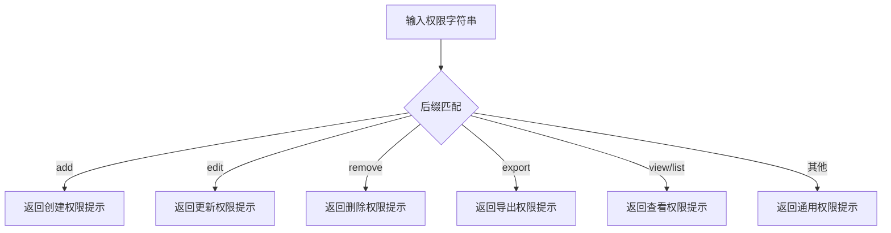
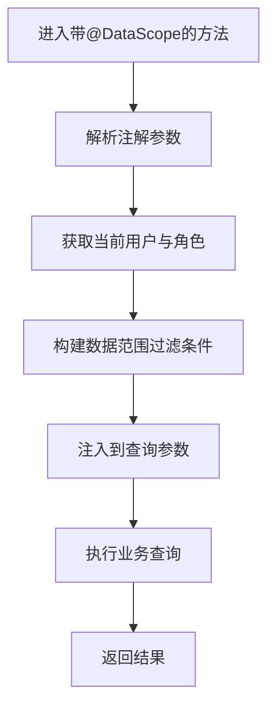
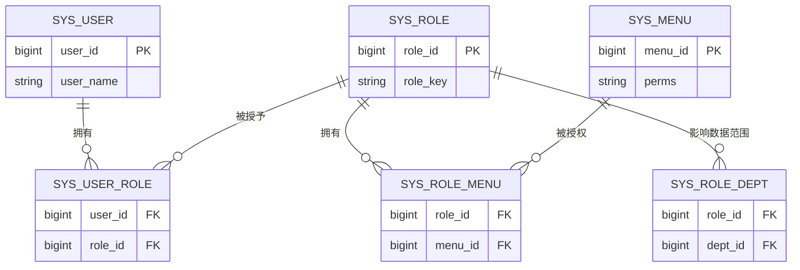
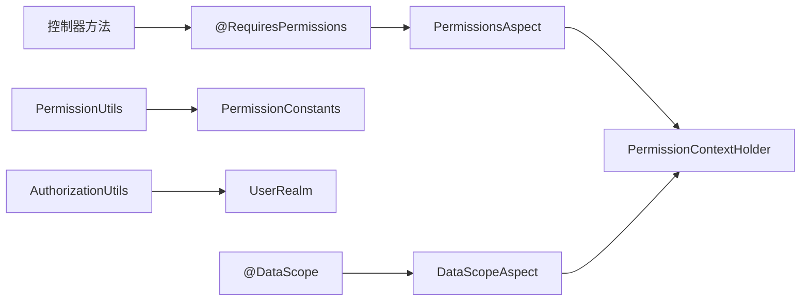

# 权限控制体系

<cite>
**本文引用的文件**
- [PermissionsAspect.java](file://GenShin/RuoYi-master/ruoyi-framework/src/main/java/com/ruoyi/framework/aspectj/PermissionsAspect.java)
- [PermissionContextHolder.java](file://GenShin/RuoYi-master/ruoyi-common/src/main/java/com/ruoyi/common/core/context/PermissionContextHolder.java)
- [AuthorizationUtils.java](file://GenShin/RuoYi-master/ruoyi-framework/src/main/java/com/ruoyi/framework/shiro/util/AuthorizationUtils.java)
- [PermissionUtils.java](file://GenShin/RuoYi-master/ruoyi-common/src/main/java/com/ruoyi/common/utils/security/PermissionUtils.java)
- [PermissionConstants.java](file://GenShin/RuoYi-master/ruoyi-common/src/main/java/com/ruoyi/common/constant/PermissionConstants.java)
- [DataScope.java](file://GenShin/RuoYi-master/ruoyi-common/src/main/java/com/ruoyi/common/annotation/DataScope.java)
- [DataScopeAspect.java](file://GenShin/RuoYi-master/ruoyi-framework/src/main/java/com/ruoyi/framework/aspectj/DataScopeAspect.java)
- [UserRealm.java](file://GenShin/RuoYi-master/ruoyi-framework/src/main/java/com/ruoyi/framework/shiro/realm/UserRealm.java)
- [SysMenu.java](file://GenShin/RuoYi-master/ruoyi-common/src/main/java/com/ruoyi/common/core/domain/entity/SysMenu.java)
- [SysRole.java](file://GenShin/RuoYi-master/ruoyi-common/src/main/java/com/ruoyi/common/core/domain/entity/SysRole.java)
- [SysUser.java](file://GenShin/RuoYi-master/ruoyi-common/src/main/java/com/ruoyi/common/core/domain/entity/SysUser.java)
- [SysRoleMenu.java](file://GenShin/RuoYi-master/ruoyi-system/src/main/java/com/ruoyi/system/domain/SysRoleMenu.java)
- [SysUserRole.java](file://GenShin/RuoYi-master/ruoyi-system/src/main/java/com/ruoyi/system/domain/SysUserRole.java)
- [SysRoleDept.java](file://GenShin/RuoYi-master/ruoyi-system/src/main/java/com/ruoyi/system/domain/SysRoleDept.java)
- [SysMenuMapper.xml](file://GenShin/RuoYi-master/ruoyi-system/src/main/resources/mapper/system/SysMenuMapper.xml)
- [SysRoleMapper.xml](file://GenShin/RuoYi-master/ruoyi-system/src/main/resources/mapper/system/SysRoleMapper.xml)
- [SysUserMapper.xml](file://GenShin/RuoYi-master/ruoyi-system/src/main/resources/mapper/system/SysUserMapper.xml)
</cite>

## 目录
1. [简介](#简介)
2. [项目结构](#项目结构)
3. [核心组件](#核心组件)
4. [架构总览](#架构总览)
5. [详细组件分析](#详细组件分析)
6. [依赖关系分析](#依赖关系分析)
7. [性能考虑](#性能考虑)
8. [故障排查指南](#故障排查指南)
9. [结论](#结论)
10. [附录](#附录)

## 简介
本文件面向原神攻略系统的权限控制体系，系统性阐述基于角色的权限控制（RBAC）实现方式，涵盖权限注解的使用与权限表达式定义、AuthorizationUtils 的权限检查工具类、PermissionContextHolder 在权限上下文中的作用与传递机制、PermissionUtils 的权限验证方法（单个权限检查、多重权限判断、权限继承规则），以及权限配置最佳实践（权限树结构设计、权限编码规范、权限更新策略）、权限缓存机制与失效处理、权限调试方法与常见问题排查。

## 项目结构
权限控制相关代码主要分布在以下模块：
- 框架层（ruoyi-framework）：权限切面、授权工具、Shiro Realm、过滤器等
- 通用工具层（ruoyi-common）：权限常量、权限上下文、权限工具类、注解等
- 业务系统层（ruoyi-system）：菜单、角色、用户、角色-菜单、角色-部门、用户-角色等实体与映射

图表来源
- [PermissionsAspect.java:1-30](file://GenShin/RuoYi-master/ruoyi-framework/src/main/java/com/ruoyi/framework/aspectj/PermissionsAspect.java#L1-L30)
- [PermissionContextHolder.java:1-27](file://GenShin/RuoYi-master/ruoyi-common/src/main/java/com/ruoyi/common/core/context/PermissionContextHolder.java#L1-L27)
- [AuthorizationUtils.java:1-30](file://GenShin/RuoYi-master/ruoyi-framework/src/main/java/com/ruoyi/framework/shiro/util/AuthorizationUtils.java#L1-L30)
- [PermissionUtils.java:1-118](file://GenShin/RuoYi-master/ruoyi-common/src/main/java/com/ruoyi/common/utils/security/PermissionUtils.java#L1-L118)
- [PermissionConstants.java:1-27](file://GenShin/RuoYi-master/ruoyi-common/src/main/java/com/ruoyi/common/constant/PermissionConstants.java#L1-L27)
- [DataScope.java:1-43](file://GenShin/RuoYi-master/ruoyi-common/src/main/java/com/ruoyi/common/annotation/DataScope.java#L1-L43)
- [DataScopeAspect.java:1-43](file://GenShin/RuoYi-master/ruoyi-framework/src/main/java/com/ruoyi/framework/aspectj/DataScopeAspect.java#L1-L43)
- [UserRealm.java](file://GenShin/RuoYi-master/ruoyi-framework/src/main/java/com/ruoyi/framework/shiro/realm/UserRealm.java)
- [SysMenu.java](file://GenShin/RuoYi-master/ruoyi-common/src/main/java/com/ruoyi/common/core/domain/entity/SysMenu.java)
- [SysRole.java](file://GenShin/RuoYi-master/ruoyi-common/src/main/java/com/ruoyi/common/core/domain/entity/SysRole.java)
- [SysUser.java](file://GenShin/RuoYi-master/ruoyi-common/src/main/java/com/ruoyi/common/core/domain/entity/SysUser.java)
- [SysRoleMenu.java](file://GenShin/RuoYi-master/ruoyi-system/src/main/java/com/ruoyi/system/domain/SysRoleMenu.java)
- [SysUserRole.java](file://GenShin/RuoYi-master/ruoyi-system/src/main/java/com/ruoyi/system/domain/SysUserRole.java)
- [SysRoleDept.java](file://GenShin/RuoYi-master/ruoyi-system/src/main/java/com/ruoyi/system/domain/SysRoleDept.java)

章节来源
- [PermissionsAspect.java:1-30](file://GenShin/RuoYi-master/ruoyi-framework/src/main/java/com/ruoyi/framework/aspectj/PermissionsAspect.java#L1-L30)
- [PermissionContextHolder.java:1-27](file://GenShin/RuoYi-master/ruoyi-common/src/main/java/com/ruoyi/common/core/context/PermissionContextHolder.java#L1-L27)
- [AuthorizationUtils.java:1-30](file://GenShin/RuoYi-master/ruoyi-framework/src/main/java/com/ruoyi/framework/shiro/util/AuthorizationUtils.java#L1-L30)
- [PermissionUtils.java:1-118](file://GenShin/RuoYi-master/ruoyi-common/src/main/java/com/ruoyi/common/utils/security/PermissionUtils.java#L1-L118)
- [PermissionConstants.java:1-27](file://GenShin/RuoYi-master/ruoyi-common/src/main/java/com/ruoyi/common/constant/PermissionConstants.java#L1-L27)
- [DataScope.java:1-43](file://GenShin/RuoYi-master/ruoyi-common/src/main/java/com/ruoyi/common/annotation/DataScope.java#L1-L43)
- [DataScopeAspect.java:1-43](file://GenShin/RuoYi-master/ruoyi-framework/src/main/java/com/ruoyi/framework/aspectj/DataScopeAspect.java#L1-L43)

## 核心组件
- 权限注解切面（PermissionsAspect）：拦截控制器上的 @RequiresPermissions 注解，将权限字符串写入当前请求的权限上下文，支持多权限逗号分隔
- 权限上下文（PermissionContextHolder）：基于 RequestContextHolder 将权限字符串保存到请求作用域，供后续切面或服务使用
- 授权工具（AuthorizationUtils）：提供清理所有用户授权信息缓存的能力，便于权限变更后快速生效
- 权限工具（PermissionUtils）：封装权限消息提示、主体属性读取、数据权限相关校验等
- 权限常量（PermissionConstants）：统一管理权限动作后缀（新增、修改、删除、导出、显示、查询）
- 数据范围注解（DataScope）：标注方法级数据权限过滤条件，支持用户/部门字段别名与权限字符串覆盖
- 数据范围切面（DataScopeAspect）：在方法执行前解析 DataScope 注解，结合用户角色与组织架构生成数据范围过滤条件

章节来源
- [PermissionsAspect.java:11-30](file://GenShin/RuoYi-master/ruoyi-framework/src/main/java/com/ruoyi/framework/aspectj/PermissionsAspect.java#L11-L30)
- [PermissionContextHolder.java:7-27](file://GenShin/RuoYi-master/ruoyi-common/src/main/java/com/ruoyi/common/core/context/PermissionContextHolder.java#L7-L27)
- [AuthorizationUtils.java:7-30](file://GenShin/RuoYi-master/ruoyi-framework/src/main/java/com/ruoyi/framework/shiro/util/AuthorizationUtils.java#L7-L30)
- [PermissionUtils.java:14-118](file://GenShin/RuoYi-master/ruoyi-common/src/main/java/com/ruoyi/common/utils/security/PermissionUtils.java#L14-L118)
- [PermissionConstants.java:3-27](file://GenShin/RuoYi-master/ruoyi-common/src/main/java/com/ruoyi/common/constant/PermissionConstants.java#L3-L27)
- [DataScope.java:9-43](file://GenShin/RuoYi-master/ruoyi-common/src/main/java/com/ruoyi/common/annotation/DataScope.java#L9-L43)
- [DataScopeAspect.java:20-43](file://GenShin/RuoYi-master/ruoyi-framework/src/main/java/com/ruoyi/framework/aspectj/DataScopeAspect.java#L20-L43)

## 架构总览
下图展示了从控制器到授权缓存、再到数据范围过滤的整体流程：

图表来源
- [PermissionsAspect.java:20-29](file://GenShin/RuoYi-master/ruoyi-framework/src/main/java/com/ruoyi/framework/aspectj/PermissionsAspect.java#L20-L29)
- [PermissionContextHolder.java:16-26](file://GenShin/RuoYi-master/ruoyi-common/src/main/java/com/ruoyi/common/core/context/PermissionContextHolder.java#L16-L26)
- [AuthorizationUtils.java:14-29](file://GenShin/RuoYi-master/ruoyi-framework/src/main/java/com/ruoyi/framework/shiro/util/AuthorizationUtils.java#L14-L29)
- [DataScopeAspect.java:34-39](file://GenShin/RuoYi-master/ruoyi-framework/src/main/java/com/ruoyi/framework/aspectj/DataScopeAspect.java#L34-L39)

## 详细组件分析

### 权限注解与上下文传递（PermissionsAspect 与 PermissionContextHolder）
- 注解拦截：通过前置通知拦截带有 @RequiresPermissions 的控制器方法，将注解中的权限字符串合并为逗号分隔的权限串
- 上下文设置：将权限串写入当前请求的权限上下文中，供后续切面或服务读取
- 多权限支持：支持在同一注解中声明多个权限，切面会将其拼接后放入上下文

图表来源
- [PermissionsAspect.java:20-29](file://GenShin/RuoYi-master/ruoyi-framework/src/main/java/com/ruoyi/framework/aspectj/PermissionsAspect.java#L20-L29)
- [PermissionContextHolder.java:16-26](file://GenShin/RuoYi-master/ruoyi-common/src/main/java/com/ruoyi/common/core/context/PermissionContextHolder.java#L16-L26)

章节来源
- [PermissionsAspect.java:11-30](file://GenShin/RuoYi-master/ruoyi-framework/src/main/java/com/ruoyi/framework/aspectj/PermissionsAspect.java#L11-L30)
- [PermissionContextHolder.java:7-27](file://GenShin/RuoYi-master/ruoyi-common/src/main/java/com/ruoyi/common/core/context/PermissionContextHolder.java#L7-L27)

### 授权缓存清理（AuthorizationUtils）
- 功能：提供清理所有用户授权信息缓存的方法，确保权限变更后立即生效
- 实现：通过 SecurityUtils 获取 RealmSecurityManager，定位 UserRealm 并调用其清理方法

图表来源
- [AuthorizationUtils.java:14-29](file://GenShin/RuoYi-master/ruoyi-framework/src/main/java/com/ruoyi/framework/shiro/util/AuthorizationUtils.java#L14-L29)
- [UserRealm.java](file://GenShin/RuoYi-master/ruoyi-framework/src/main/java/com/ruoyi/framework/shiro/realm/UserRealm.java)

章节来源
- [AuthorizationUtils.java:7-30](file://GenShin/RuoYi-master/ruoyi-framework/src/main/java/com/ruoyi/framework/shiro/util/AuthorizationUtils.java#L7-L30)

### 权限工具（PermissionUtils）
- 权限消息提示：根据权限字符串后缀（新增、修改、删除、导出、显示、查询）返回对应的国际化提示
- 主体属性读取：通过反射读取当前登录主体的指定属性值，便于在权限判断中使用
- 数据权限相关：与数据范围注解配合，支持按用户/部门维度进行数据访问控制

图表来源
- [PermissionUtils.java:59-84](file://GenShin/RuoYi-master/ruoyi-common/src/main/java/com/ruoyi/common/utils/security/PermissionUtils.java#L59-L84)
- [PermissionConstants.java:10-27](file://GenShin/RuoYi-master/ruoyi-common/src/main/java/com/ruoyi/common/constant/PermissionConstants.java#L10-L27)

章节来源
- [PermissionUtils.java:14-118](file://GenShin/RuoYi-master/ruoyi-common/src/main/java/com/ruoyi/common/utils/security/PermissionUtils.java#L14-L118)
- [PermissionConstants.java:3-27](file://GenShin/RuoYi-master/ruoyi-common/src/main/java/com/ruoyi/common/constant/PermissionConstants.java#L3-L27)

### 数据范围过滤（DataScope 注解与 DataScopeAspect）
- 注解定义：支持用户表别名、部门表别名、用户字段名、部门字段名以及权限字符串覆盖
- 切面处理：在方法执行前解析注解，结合当前用户的角色与组织架构生成数据范围过滤条件，并将其注入到查询参数中

图表来源
- [DataScope.java:17-43](file://GenShin/RuoYi-master/ruoyi-common/src/main/java/com/ruoyi/common/annotation/DataScope.java#L17-L43)
- [DataScopeAspect.java:41-43](file://GenShin/RuoYi-master/ruoyi-framework/src/main/java/com/ruoyi/framework/aspectj/DataScopeAspect.java#L41-L43)

章节来源
- [DataScope.java:9-43](file://GenShin/RuoYi-master/ruoyi-common/src/main/java/com/ruoyi/common/annotation/DataScope.java#L9-L43)
- [DataScopeAspect.java:20-43](file://GenShin/RuoYi-master/ruoyi-framework/src/main/java/com/ruoyi/framework/aspectj/DataScopeAspect.java#L20-L43)

### RBAC 数据模型与权限表达式
- 角色-菜单关联：SysRoleMenu 记录角色与菜单的绑定关系，决定角色可访问的菜单项
- 用户-角色关联：SysUserRole 记录用户与角色的绑定关系，决定用户具备的角色集合
- 角色-部门关联：SysRoleDept 记录角色与部门的绑定关系，用于数据范围过滤
- 菜单实体：SysMenu 定义菜单的权限表达式（如 sys:character:list），与权限常量组合形成完整权限标识

图表来源
- [SysMenu.java](file://GenShin/RuoYi-master/ruoyi-common/src/main/java/com/ruoyi/common/core/domain/entity/SysMenu.java)
- [SysRole.java](file://GenShin/RuoYi-master/ruoyi-common/src/main/java/com/ruoyi/common/core/domain/entity/SysRole.java)
- [SysUser.java](file://GenShin/RuoYi-master/ruoyi-common/src/main/java/com/ruoyi/common/core/domain/entity/SysUser.java)
- [SysRoleMenu.java](file://GenShin/RuoYi-master/ruoyi-system/src/main/java/com/ruoyi/system/domain/SysRoleMenu.java)
- [SysUserRole.java](file://GenShin/RuoYi-master/ruoyi-system/src/main/java/com/ruoyi/system/domain/SysUserRole.java)
- [SysRoleDept.java](file://GenShin/RuoYi-master/ruoyi-system/src/main/java/com/ruoyi/system/domain/SysRoleDept.java)

章节来源
- [SysMenu.java](file://GenShin/RuoYi-master/ruoyi-common/src/main/java/com/ruoyi/common/core/domain/entity/SysMenu.java)
- [SysRole.java](file://GenShin/RuoYi-master/ruoyi-common/src/main/java/com/ruoyi/common/core/domain/entity/SysRole.java)
- [SysUser.java](file://GenShin/RuoYi-master/ruoyi-common/src/main/java/com/ruoyi/common/core/domain/entity/SysUser.java)
- [SysRoleMenu.java](file://GenShin/RuoYi-master/ruoyi-system/src/main/java/com/ruoyi/system/domain/SysRoleMenu.java)
- [SysUserRole.java](file://GenShin/RuoYi-master/ruoyi-system/src/main/java/com/ruoyi/system/domain/SysUserRole.java)
- [SysRoleDept.java](file://GenShin/RuoYi-master/ruoyi-system/src/main/java/com/ruoyi/system/domain/SysRoleDept.java)

## 依赖关系分析
- 控制器方法通过 @RequiresPermissions 注解声明权限，由 PermissionsAspect 拦截并将权限字符串写入 PermissionContextHolder
- 权限工具类 PermissionUtils 基于 PermissionConstants 统一的权限动作后缀生成提示消息
- 授权缓存清理由 AuthorizationUtils 调用 UserRealm 的清理方法，确保权限变更即时生效
- 数据范围过滤由 DataScope 注解与 DataScopeAspect 协作，结合用户角色与部门关系生成过滤条件

图表来源
- [PermissionsAspect.java:20-29](file://GenShin/RuoYi-master/ruoyi-framework/src/main/java/com/ruoyi/framework/aspectj/PermissionsAspect.java#L20-L29)
- [PermissionContextHolder.java:16-26](file://GenShin/RuoYi-master/ruoyi-common/src/main/java/com/ruoyi/common/core/context/PermissionContextHolder.java#L16-L26)
- [PermissionUtils.java:59-84](file://GenShin/RuoYi-master/ruoyi-common/src/main/java/com/ruoyi/common/utils/security/PermissionUtils.java#L59-L84)
- [PermissionConstants.java:10-27](file://GenShin/RuoYi-master/ruoyi-common/src/main/java/com/ruoyi/common/constant/PermissionConstants.java#L10-L27)
- [AuthorizationUtils.java:14-29](file://GenShin/RuoYi-master/ruoyi-framework/src/main/java/com/ruoyi/framework/shiro/util/AuthorizationUtils.java#L14-L29)
- [UserRealm.java](file://GenShin/RuoYi-master/ruoyi-framework/src/main/java/com/ruoyi/framework/shiro/realm/UserRealm.java)
- [DataScope.java:17-43](file://GenShin/RuoYi-master/ruoyi-common/src/main/java/com/ruoyi/common/annotation/DataScope.java#L17-L43)
- [DataScopeAspect.java:41-43](file://GenShin/RuoYi-master/ruoyi-framework/src/main/java/com/ruoyi/framework/aspectj/DataScopeAspect.java#L41-L43)

章节来源
- [PermissionsAspect.java:11-30](file://GenShin/RuoYi-master/ruoyi-framework/src/main/java/com/ruoyi/framework/aspectj/PermissionsAspect.java#L11-L30)
- [PermissionContextHolder.java:7-27](file://GenShin/RuoYi-master/ruoyi-common/src/main/java/com/ruoyi/common/core/context/PermissionContextHolder.java#L7-L27)
- [PermissionUtils.java:14-118](file://GenShin/RuoYi-master/ruoyi-common/src/main/java/com/ruoyi/common/utils/security/PermissionUtils.java#L14-L118)
- [PermissionConstants.java:3-27](file://GenShin/RuoYi-master/ruoyi-common/src/main/java/com/ruoyi/common/constant/PermissionConstants.java#L3-L27)
- [AuthorizationUtils.java:7-30](file://GenShin/RuoYi-master/ruoyi-framework/src/main/java/com/ruoyi/framework/shiro/util/AuthorizationUtils.java#L7-L30)
- [DataScope.java:9-43](file://GenShin/RuoYi-master/ruoyi-common/src/main/java/com/ruoyi/common/annotation/DataScope.java#L9-L43)
- [DataScopeAspect.java:20-43](file://GenShin/RuoYi-master/ruoyi-framework/src/main/java/com/ruoyi/framework/aspectj/DataScopeAspect.java#L20-L43)

## 性能考虑
- 权限缓存清理：通过 AuthorizationUtils 清理授权缓存，避免频繁全量刷新导致的性能开销
- 请求级上下文：权限字符串仅在请求作用域内传递，减少跨线程共享带来的同步成本
- 数据范围过滤：在方法执行前解析并注入过滤条件，避免在业务层重复计算
- 权限常量复用：统一的权限动作后缀减少字符串拼接与比较次数

## 故障排查指南
- 权限提示不正确：检查权限字符串后缀是否符合 PermissionConstants 中的定义，确认 PermissionUtils 的消息映射逻辑
- 权限变更未生效：调用 AuthorizationUtils.clearAllCachedAuthorizationInfo() 后重试，确保 UserRealm 的授权缓存被清理
- 数据范围异常：检查 DataScope 注解的用户/部门字段别名与实际表结构是否一致，确认角色-部门关联是否正确
- 多权限判断失败：确认 @RequiresPermissions 中的权限字符串是否以逗号分隔，PermissionsAspect 是否正确写入上下文

章节来源
- [PermissionUtils.java:59-84](file://GenShin/RuoYi-master/ruoyi-common/src/main/java/com/ruoyi/common/utils/security/PermissionUtils.java#L59-L84)
- [AuthorizationUtils.java:14-29](file://GenShin/RuoYi-master/ruoyi-framework/src/main/java/com/ruoyi/framework/shiro/util/AuthorizationUtils.java#L14-L29)
- [DataScope.java:17-43](file://GenShin/RuoYi-master/ruoyi-common/src/main/java/com/ruoyi/common/annotation/DataScope.java#L17-L43)
- [PermissionsAspect.java:20-29](file://GenShin/RuoYi-master/ruoyi-framework/src/main/java/com/ruoyi/framework/aspectj/PermissionsAspect.java#L20-L29)

## 结论
本权限控制体系以 RBAC 为核心，结合注解驱动的权限拦截、请求级权限上下文传递、授权缓存清理与数据范围过滤，形成了完整的权限判定与执行链路。通过统一的权限常量与工具类，提升了权限表达式的可维护性与一致性；通过切面与上下文机制，实现了对控制器与数据访问的细粒度控制。

## 附录

### 权限配置最佳实践
- 权限树结构设计：以菜单为节点，采用层级化权限表达式（如 sys:character），子菜单继承父菜单权限
- 权限编码规范：使用“业务模块:资源类型:操作动作”的三段式命名，确保语义清晰且易于检索
- 权限更新策略：变更角色或菜单时，优先清理授权缓存，再进行权限生效验证

### 权限表达式定义
- 基本格式：sys:character:list（模块:资源:动作）
- 动作后缀：add/edit/remove/export/view/list（对应新增/修改/删除/导出/显示/查询）

### 权限继承规则
- 子菜单自动继承父菜单权限
- 角色通过 SysRoleMenu 与菜单建立绑定，从而获得菜单权限
- 用户通过 SysUserRole 获得角色集合，进而获得角色权限