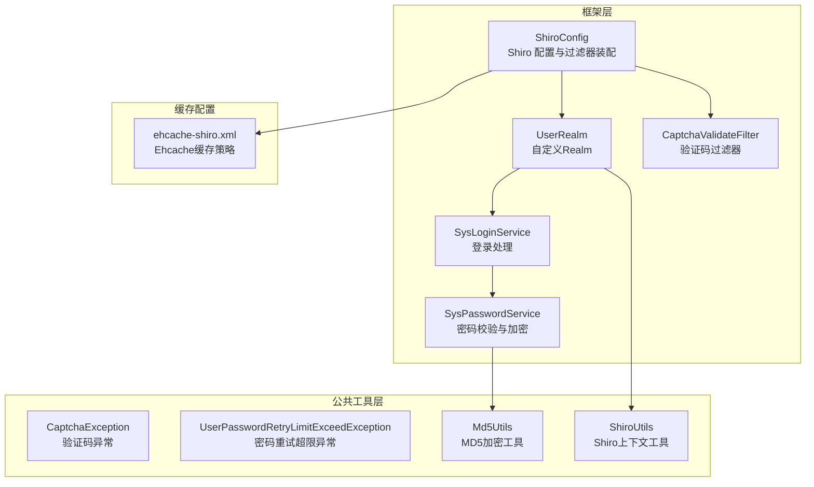
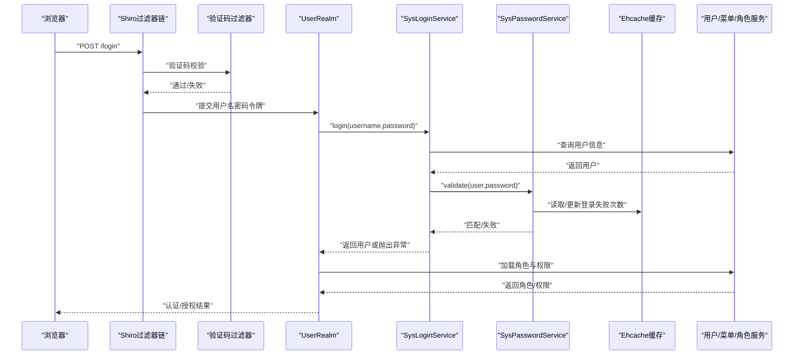
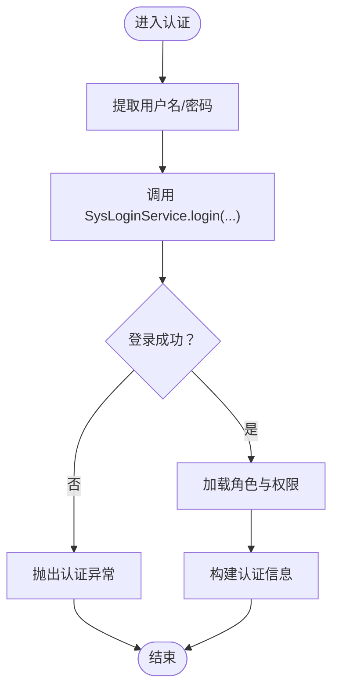
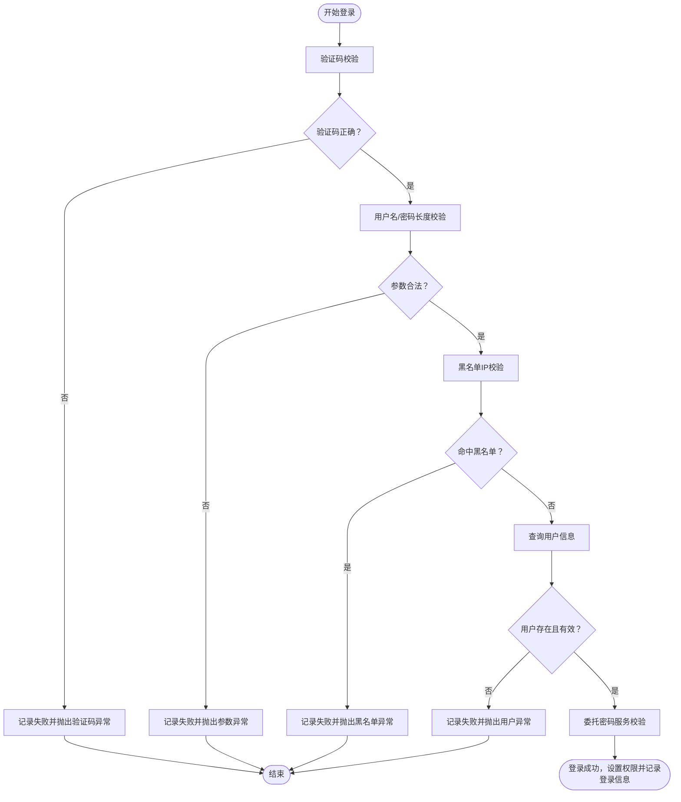
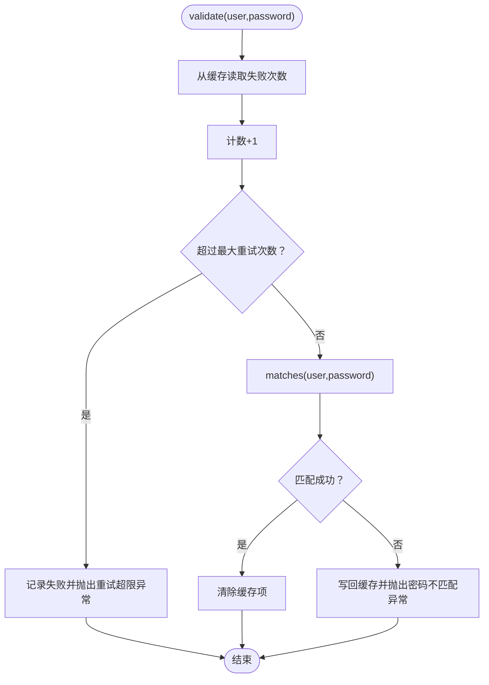
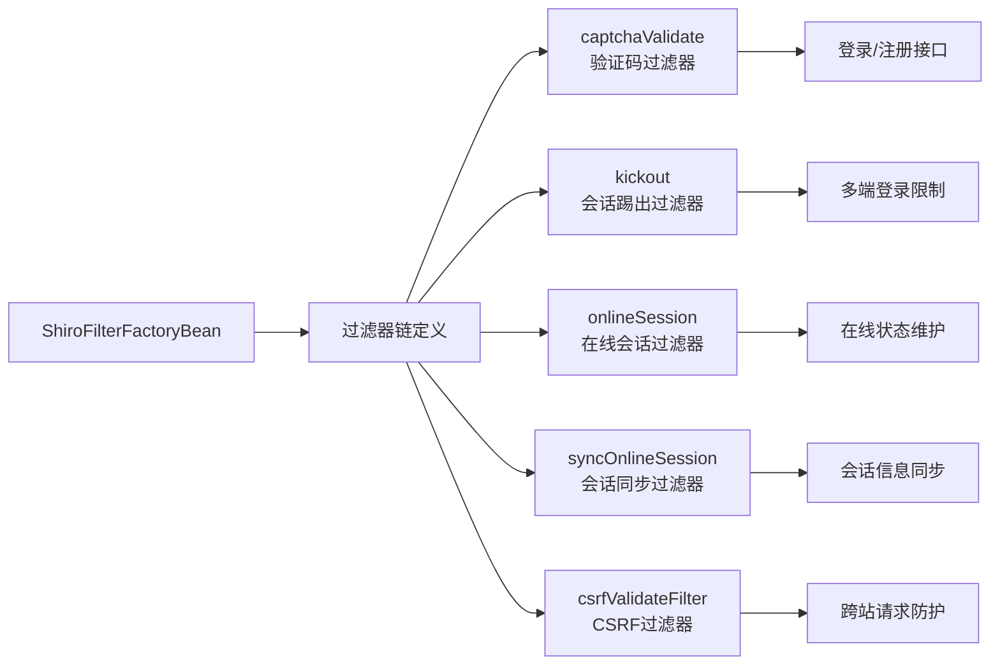
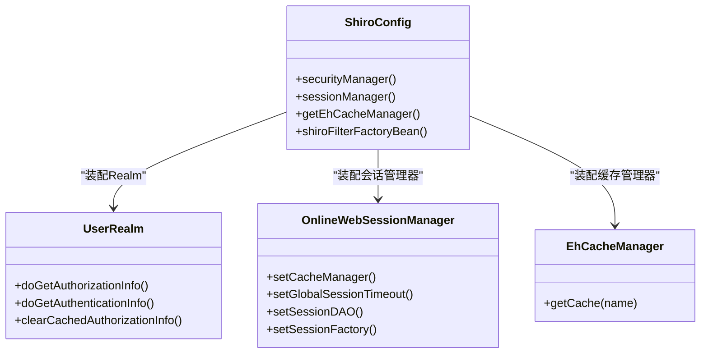
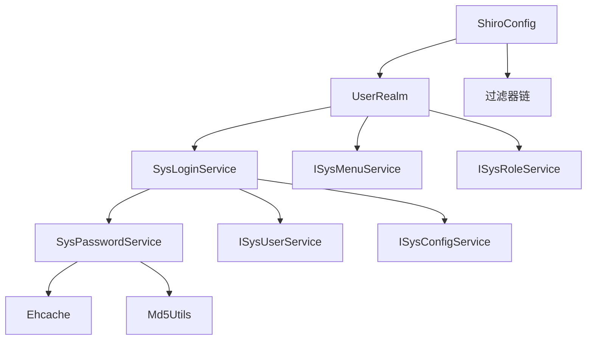

# 用户认证机制

<cite>
**本文引用的文件**
- [UserRealm.java](file://ruoyi-framework/src/main/java/com/ruoyi/framework/shiro/realm/UserRealm.java)
- [SysLoginService.java](file://ruoyi-framework/src/main/java/com/ruoyi/framework/shiro/service/SysLoginService.java)
- [SysPasswordService.java](file://ruoyi-framework/src/main/java/com/ruoyi/framework/shiro/service/SysPasswordService.java)
- [ShiroConfig.java](file://ruoyi-framework/src/main/java/com/ruoyi/framework/config/ShiroConfig.java)
- [ehcache-shiro.xml](file://ruoyi-admin/src/main/resources/ehcache/ehcache-shiro.xml)
- [CaptchaValidateFilter.java](file://ruoyi-framework/src/main/java/com/ruoyi/framework/shiro/web/filter/captcha/CaptchaValidateFilter.java)
- [CaptchaException.java](file://ruoyi-common/src/main/java/com/ruoyi/common/exception/user/CaptchaException.java)
- [UserPasswordRetryLimitExceedException.java](file://ruoyi-common/src/main/java/com/ruoyi/common/exception/user/UserPasswordRetryLimitExceedException.java)
- [Md5Utils.java](file://ruoyi-common/src/main/java/com/ruoyi/common/utils/security/Md5Utils.java)
- [ShiroUtils.java](file://ruoyi-common/src/main/java/com/ruoyi/common/utils/ShiroUtils.java)
</cite>

## 目录
1. [简介](#简介)
2. [项目结构](#项目结构)
3. [核心组件](#核心组件)
4. [架构总览](#架构总览)
5. [详细组件分析](#详细组件分析)
6. [依赖关系分析](#依赖关系分析)
7. [性能考量](#性能考量)
8. [故障排查指南](#故障排查指南)
9. [结论](#结论)
10. [附录](#附录)

## 简介
本文件面向原神攻略系统的用户认证机制，围绕基于 Apache Shiro 的认证与授权体系，系统化阐述以下内容：
- 自定义 Realm 的认证流程、密码验证机制与用户信息加载过程
- 登录服务 SysLoginService 的登录处理逻辑（用户名密码校验、失败次数限制、账户锁定）
- SysPasswordService 的密码加密策略（MD5 加密、盐值处理、重试次数控制）
- 登录拦截器配置与自定义验证码过滤器的实现方式
- 图形验证码生成与验证逻辑
- 登录状态管理、会话创建与认证缓存机制

## 项目结构
认证相关代码主要分布在如下模块与包中：
- 框架层（ruoyi-framework）：Shiro 配置、自定义 Realm、登录与密码服务、过滤器、会话管理
- 公共工具层（ruoyi-common）：异常定义、加密工具、Shiro 工具类等
- 缓存配置（ruoyi-admin）：Ehcache 的 Shiro 缓存策略

图表来源
- [ShiroConfig.java:1-449](file://ruoyi-framework/src/main/java/com/ruoyi/framework/config/ShiroConfig.java#L1-L449)
- [UserRealm.java:1-159](file://ruoyi-framework/src/main/java/com/ruoyi/framework/shiro/realm/UserRealm.java#L1-L159)
- [SysLoginService.java:1-185](file://ruoyi-framework/src/main/java/com/ruoyi/framework/shiro/service/SysLoginService.java#L1-L185)
- [SysPasswordService.java:1-86](file://ruoyi-framework/src/main/java/com/ruoyi/framework/shiro/service/SysPasswordService.java#L1-L86)
- [CaptchaValidateFilter.java](file://ruoyi-framework/src/main/java/com/ruoyi/framework/shiro/web/filter/captcha/CaptchaValidateFilter.java)
- [ehcache-shiro.xml:1-91](file://ruoyi-admin/src/main/resources/ehcache/ehcache-shiro.xml#L1-L91)

章节来源
- [ShiroConfig.java:1-449](file://ruoyi-framework/src/main/java/com/ruoyi/framework/config/ShiroConfig.java#L1-L449)

## 核心组件
- 自定义 Realm（UserRealm）：负责认证与授权入口，将用户名密码转换为认证令牌，并委托登录服务完成业务校验，随后加载用户的角色与权限信息。
- 登录服务（SysLoginService）：执行验证码校验、用户名/密码长度校验、黑名单校验、用户存在性与状态校验、调用密码服务进行密码匹配与重试次数控制，并记录登录日志与更新登录信息。
- 密码服务（SysPasswordService）：基于 Ehcache 实现登录失败次数统计与锁定阈值控制，采用 MD5 加密结合用户名、明文密码与盐值进行比对。
- Shiro 配置（ShiroConfig）：装配 Realm、SecurityManager、SessionManager、缓存管理器、过滤器链与各自定义过滤器（验证码、CSRF、在线会话、踢出会话等）。
- 缓存配置（ehcache-shiro.xml）：定义登录记录缓存、授权缓存、会话缓存等策略。

章节来源
- [UserRealm.java:1-159](file://ruoyi-framework/src/main/java/com/ruoyi/framework/shiro/realm/UserRealm.java#L1-L159)
- [SysLoginService.java:1-185](file://ruoyi-framework/src/main/java/com/ruoyi/framework/shiro/service/SysLoginService.java#L1-L185)
- [SysPasswordService.java:1-86](file://ruoyi-framework/src/main/java/com/ruoyi/framework/shiro/service/SysPasswordService.java#L1-L86)
- [ShiroConfig.java:1-449](file://ruoyi-framework/src/main/java/com/ruoyi/framework/config/ShiroConfig.java#L1-L449)
- [ehcache-shiro.xml:1-91](file://ruoyi-admin/src/main/resources/ehcache/ehcache-shiro.xml#L1-L91)

## 架构总览
下图展示了从浏览器发起登录请求到完成认证与授权的整体流程，以及各组件之间的交互关系。

图表来源
- [ShiroConfig.java:296-346](file://ruoyi-framework/src/main/java/com/ruoyi/framework/config/ShiroConfig.java#L296-L346)
- [UserRealm.java:86-133](file://ruoyi-framework/src/main/java/com/ruoyi/framework/shiro/realm/UserRealm.java#L86-L133)
- [SysLoginService.java:54-131](file://ruoyi-framework/src/main/java/com/ruoyi/framework/shiro/service/SysLoginService.java#L54-L131)
- [SysPasswordService.java:42-69](file://ruoyi-framework/src/main/java/com/ruoyi/framework/shiro/service/SysPasswordService.java#L42-L69)
- [ehcache-shiro.xml:24-32](file://ruoyi-admin/src/main/resources/ehcache/ehcache-shiro.xml#L24-L32)

## 详细组件分析

### 自定义 Realm（UserRealm）认证流程
- 授权流程（doGetAuthorizationInfo）：根据当前登录用户加载其角色键与权限集合，管理员拥有全部权限，普通用户按角色与菜单授予相应权限。
- 认证流程（doGetAuthenticationInfo）：从令牌提取用户名与密码，调用登录服务执行业务校验，捕获各类异常并映射为 Shiro 认证异常类型，最终构造认证信息返回。
- 缓存清理：支持按主体清理单个或全部授权缓存，确保权限变更后及时生效。

图表来源
- [UserRealm.java:86-133](file://ruoyi-framework/src/main/java/com/ruoyi/framework/shiro/realm/UserRealm.java#L86-L133)
- [SysLoginService.java:54-131](file://ruoyi-framework/src/main/java/com/ruoyi/framework/shiro/service/SysLoginService.java#L54-L131)

章节来源
- [UserRealm.java:56-81](file://ruoyi-framework/src/main/java/com/ruoyi/framework/shiro/realm/UserRealm.java#L56-L81)
- [UserRealm.java:86-133](file://ruoyi-framework/src/main/java/com/ruoyi/framework/shiro/realm/UserRealm.java#L86-L133)

### 登录处理逻辑（SysLoginService）
- 验证码校验：若验证码错误，记录失败日志并抛出验证码异常。
- 参数校验：用户名/密码为空或长度不在允许范围则拒绝登录。
- 黑名单校验：根据配置的黑名单 IP 列表判断是否拒绝。
- 用户存在性与状态校验：用户不存在、已删除、被禁用均拒绝登录。
- 密码校验：委托密码服务进行匹配与重试次数控制。
- 权限设置：为用户角色注入对应权限集合，便于数据权限匹配。
- 登录信息记录：成功登录后更新用户最近登录信息。

图表来源
- [SysLoginService.java:56-131](file://ruoyi-framework/src/main/java/com/ruoyi/framework/shiro/service/SysLoginService.java#L56-L131)

章节来源
- [SysLoginService.java:54-131](file://ruoyi-framework/src/main/java/com/ruoyi/framework/shiro/service/SysLoginService.java#L54-L131)

### 密码加密策略（SysPasswordService）
- 登录失败次数控制：基于 Ehcache 的登录记录缓存，以用户名为键，原子计数器为值，超过阈值则拒绝登录并记录日志。
- 密码匹配：采用 MD5 加密，输入为“用户名+明文密码+盐值”，与用户记录中的加密密码比较。
- 缓存操作：匹配成功清除缓存项；每次失败更新缓存并抛出密码不匹配异常。

图表来源
- [SysPasswordService.java:42-69](file://ruoyi-framework/src/main/java/com/ruoyi/framework/shiro/service/SysPasswordService.java#L42-L69)
- [Md5Utils.java](file://ruoyi-common/src/main/java/com/ruoyi/common/utils/security/Md5Utils.java)

章节来源
- [SysPasswordService.java:25-86](file://ruoyi-framework/src/main/java/com/ruoyi/framework/shiro/service/SysPasswordService.java#L25-L86)

### 登录拦截器与验证码过滤器
- Shiro 过滤器链：在 ShiroConfig 中定义了过滤器链与各过滤器，其中登录与注册接口启用验证码过滤器，其余请求统一走“user,kickout,onlineSession,syncOnlineSession,csrfValidateFilter”链路。
- 验证码过滤器（CaptchaValidateFilter）：根据配置决定是否启用验证码校验与类型，拦截登录请求并在通过后放行。
- 登录拦截器配置：通过 ShiroConfig 的过滤器装配与链式定义，实现对静态资源、登录、注册、注销等路径的差异化处理。

图表来源
- [ShiroConfig.java:296-346](file://ruoyi-framework/src/main/java/com/ruoyi/framework/config/ShiroConfig.java#L296-L346)
- [CaptchaValidateFilter.java](file://ruoyi-framework/src/main/java/com/ruoyi/framework/shiro/web/filter/captcha/CaptchaValidateFilter.java)

章节来源
- [ShiroConfig.java:296-346](file://ruoyi-framework/src/main/java/com/ruoyi/framework/config/ShiroConfig.java#L296-L346)

### 图形验证码集成
- 验证码生成与验证：验证码过滤器根据配置启用/禁用验证码，并在登录请求到达时进行校验。验证码错误将导致登录失败并记录日志。
- 验证码异常：验证码错误时抛出专用异常，由 Realm 映射为未知账户异常，保证前端提示与安全策略一致。

章节来源
- [CaptchaValidateFilter.java](file://ruoyi-framework/src/main/java/com/ruoyi/framework/shiro/web/filter/captcha/CaptchaValidateFilter.java)
- [CaptchaException.java](file://ruoyi-common/src/main/java/com/ruoyi/common/exception/user/CaptchaException.java)
- [UserRealm.java:102-105](file://ruoyi-framework/src/main/java/com/ruoyi/framework/shiro/realm/UserRealm.java#L102-L105)

### 登录状态管理、会话创建与认证缓存
- 会话管理：通过 OnlineWebSessionManager 统一会话生命周期，设置全局超时、定时校验、自定义 SessionDAO 与 Factory。
- 认证缓存：Realm 的授权缓存名称与 Ehcache 的 sys-authCache 对应，避免重复查询权限；登录记录缓存（loginRecordCache）用于失败次数控制。
- 在线会话：OnlineSessionDAO 与 OnlineSessionFactory 提供在线用户状态维护与会话同步能力。

图表来源
- [ShiroConfig.java:257-270](file://ruoyi-framework/src/main/java/com/ruoyi/framework/config/ShiroConfig.java#L257-L270)
- [ShiroConfig.java:232-252](file://ruoyi-framework/src/main/java/com/ruoyi/framework/config/ShiroConfig.java#L232-L252)
- [UserRealm.java:138-157](file://ruoyi-framework/src/main/java/com/ruoyi/framework/shiro/realm/UserRealm.java#L138-L157)
- [ehcache-shiro.xml:24-54](file://ruoyi-admin/src/main/resources/ehcache/ehcache-shiro.xml#L24-L54)

章节来源
- [ShiroConfig.java:232-270](file://ruoyi-framework/src/main/java/com/ruoyi/framework/config/ShiroConfig.java#L232-L270)
- [ehcache-shiro.xml:24-54](file://ruoyi-admin/src/main/resources/ehcache/ehcache-shiro.xml#L24-L54)

## 依赖关系分析
- 组件耦合：UserRealm 依赖 SysLoginService 与菜单/角色服务；SysLoginService 依赖 SysPasswordService、用户/菜单/配置服务；SysPasswordService 依赖 Ehcache 与 MD5 工具。
- 外部依赖：Shiro 核心、Ehcache、Spring 上下文与工具类。
- 过滤器链：ShiroConfig 将验证码、CSRF、在线会话、踢出会话等过滤器串联，形成统一的安全控制面。

图表来源
- [UserRealm.java:44-51](file://ruoyi-framework/src/main/java/com/ruoyi/framework/shiro/realm/UserRealm.java#L44-L51)
- [SysLoginService.java:39-49](file://ruoyi-framework/src/main/java/com/ruoyi/framework/shiro/service/SysLoginService.java#L39-L49)
- [SysPasswordService.java:28-39](file://ruoyi-framework/src/main/java/com/ruoyi/framework/shiro/service/SysPasswordService.java#L28-L39)
- [ShiroConfig.java:296-346](file://ruoyi-framework/src/main/java/com/ruoyi/framework/config/ShiroConfig.java#L296-L346)

章节来源
- [UserRealm.java:44-51](file://ruoyi-framework/src/main/java/com/ruoyi/framework/shiro/realm/UserRealm.java#L44-L51)
- [SysLoginService.java:39-49](file://ruoyi-framework/src/main/java/com/ruoyi/framework/shiro/service/SysLoginService.java#L39-L49)
- [SysPasswordService.java:28-39](file://ruoyi-framework/src/main/java/com/ruoyi/framework/shiro/service/SysPasswordService.java#L28-L39)
- [ShiroConfig.java:296-346](file://ruoyi-framework/src/main/java/com/ruoyi/framework/config/ShiroConfig.java#L296-L346)

## 性能考量
- 缓存策略：登录记录缓存与授权缓存分别针对失败次数与权限数据进行缓存，降低数据库压力；Ehcache 配置可按需调整过期与容量策略。
- 会话管理：定时校验与全局超时设置有助于释放无效会话资源；在线会话 DAO 与工厂的定制化可提升会话读写效率。
- 过滤器链：将验证码、CSRF、在线会话等过滤器组合，避免重复校验与冗余处理，提高整体吞吐。

## 故障排查指南
- 验证码错误：检查验证码过滤器配置与验证码生成/校验流程，确认验证码异常是否正确抛出与捕获。
- 密码重试超限：核对最大重试次数配置与登录记录缓存策略，确认缓存键与过期时间设置合理。
- 账户被锁定：检查用户状态字段与登录服务的状态校验逻辑，确认被禁用用户无法登录。
- 会话冲突：多端登录限制与踢出会话配置需与业务场景匹配，避免误踢或无法登录。

章节来源
- [CaptchaException.java](file://ruoyi-common/src/main/java/com/ruoyi/common/exception/user/CaptchaException.java)
- [UserPasswordRetryLimitExceedException.java](file://ruoyi-common/src/main/java/com/ruoyi/common/exception/user/UserPasswordRetryLimitExceedException.java)
- [SysLoginService.java:119-123](file://ruoyi-framework/src/main/java/com/ruoyi/framework/shiro/service/SysLoginService.java#L119-L123)
- [SysPasswordService.java:53-57](file://ruoyi-framework/src/main/java/com/ruoyi/framework/shiro/service/SysPasswordService.java#L53-L57)

## 结论
本认证机制以 Shiro 为核心，结合 Ehcache 缓存与自定义过滤器，实现了从验证码、参数校验、黑名单、用户状态到密码加密与重试控制的完整闭环。UserRealm 负责认证与授权入口，SysLoginService 与 SysPasswordService 分别承担业务校验与密码策略，ShiroConfig 统一装配与编排，形成高内聚、低耦合的安全体系。通过合理的缓存与会话配置，可在保障安全的同时兼顾性能与用户体验。

## 附录
- 关键配置项参考
  - 登录失败最大重试次数：来源于密码服务的阈值配置
  - 验证码开关与类型：来源于 ShiroConfig 的验证码过滤器配置
  - 会话超时与校验间隔：来源于 ShiroConfig 的会话管理器配置
  - 缓存策略：来源于 ehcache-shiro.xml 的各缓存配置

章节来源
- [SysPasswordService.java:33-34](file://ruoyi-framework/src/main/java/com/ruoyi/framework/shiro/service/SysPasswordService.java#L33-L34)
- [ShiroConfig.java:78-86](file://ruoyi-framework/src/main/java/com/ruoyi/framework/config/ShiroConfig.java#L78-L86)
- [ShiroConfig.java:54-62](file://ruoyi-framework/src/main/java/com/ruoyi/framework/config/ShiroConfig.java#L54-L62)
- [ehcache-shiro.xml:24-54](file://ruoyi-admin/src/main/resources/ehcache/ehcache-shiro.xml#L24-L54)