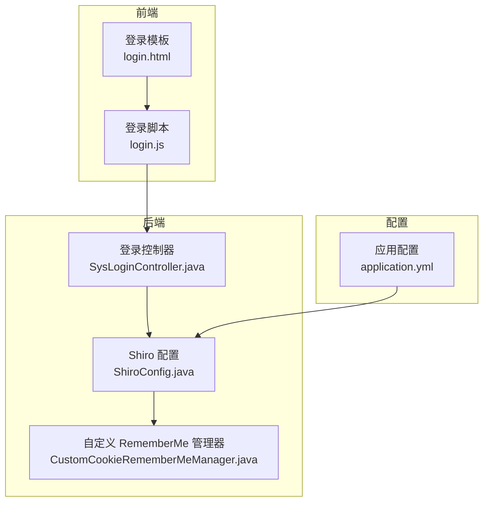
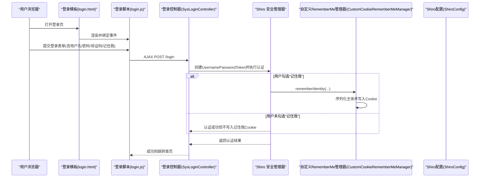
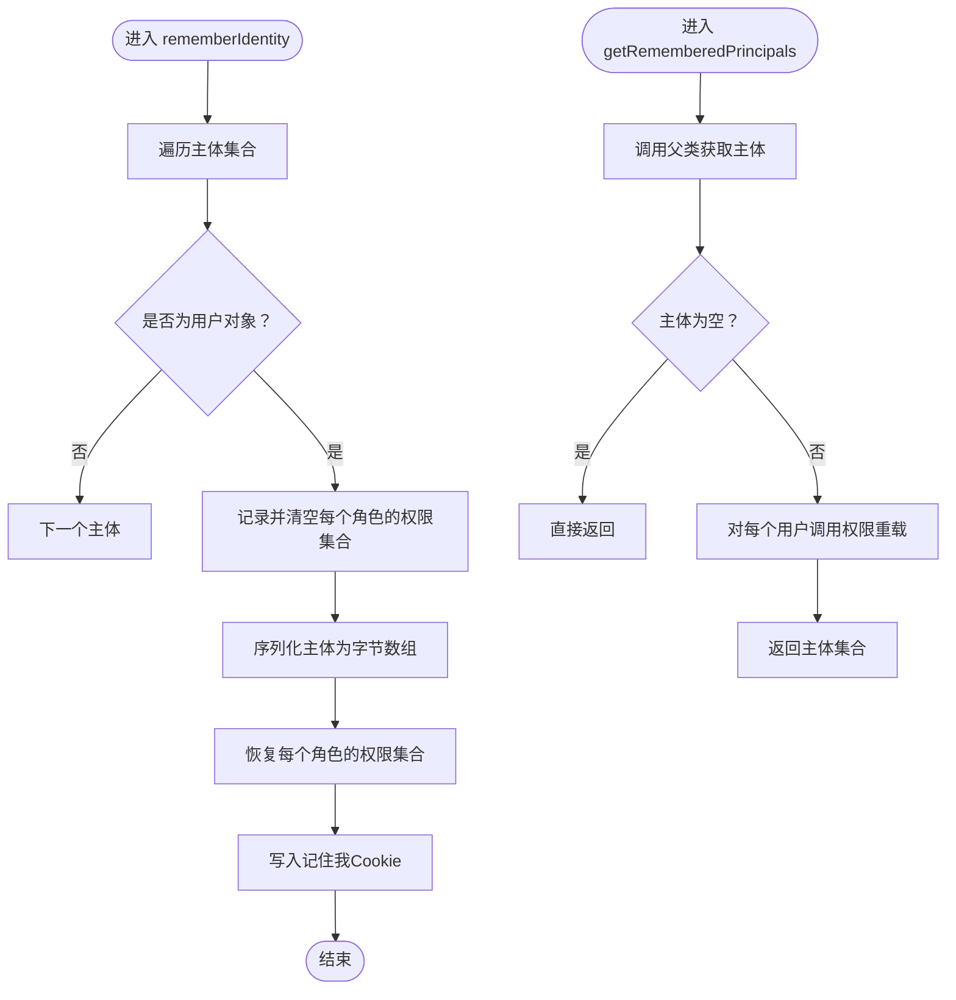
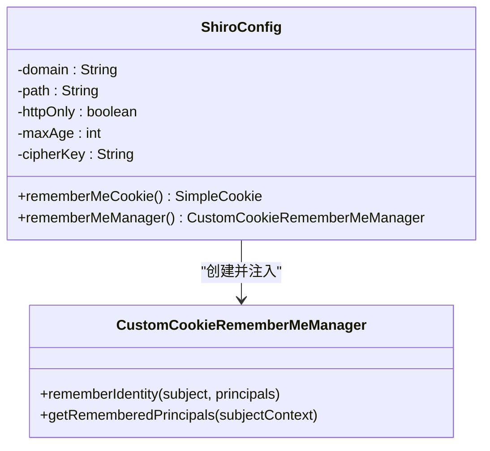
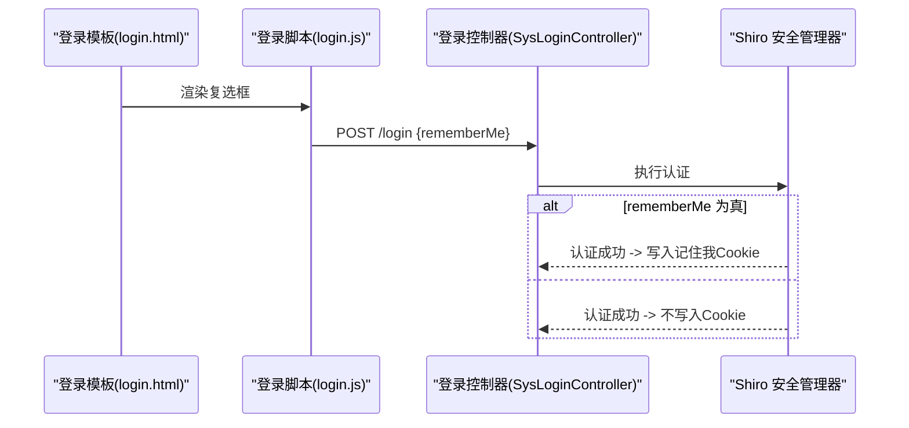
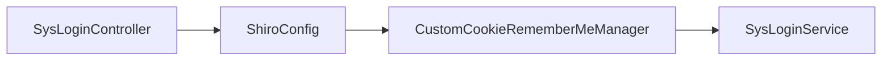

# 记住我功能

<cite>
**本文引用的文件**
- [CustomCookieRememberMeManager.java](file://ruoyi-framework/src/main/java/com/ruoyi/framework/shiro/rememberMe/CustomCookieRememberMeManager.java)
- [ShiroConfig.java](file://ruoyi-framework/src/main/java/com/ruoyi/framework/config/ShiroConfig.java)
- [SysLoginController.java](file://ruoyi-admin/src/main/java/com/ruoyi/web/controller/system/SysLoginController.java)
- [login.html](file://ruoyi-admin/src/main/resources/templates/login.html)
- [login.js](file://ruoyi-admin/src/main/resources/static/ruoyi/login.js)
- [application.yml](file://ruoyi-admin/src/main/resources/application.yml)
</cite>

## 目录
1. [简介](#简介)
2. [项目结构](#项目结构)
3. [核心组件](#核心组件)
4. [架构总览](#架构总览)
5. [组件详解](#组件详解)
6. [依赖关系分析](#依赖关系分析)
7. [性能考量](#性能考量)
8. [故障排查指南](#故障排查指南)
9. [结论](#结论)
10. [附录](#附录)

## 简介
本章节面向原神攻略系统的“记住我”功能，系统性阐述自定义 CookieRememberMeManager 的实现原理与安全策略，覆盖以下主题：
- 记住我 Cookie 的生成、加密与验证机制
- 安全策略：加密算法、签名验证、防篡改
- 有效期配置、自动续期与手动取消
- 登录页面复选框的前端实现与后端处理
- 与正常登录流程的集成：身份恢复与权限重新加载
- 安全建议（Cookie 安全设置、XSS、CSRF）
- 调试方法与常见问题

## 项目结构
围绕“记住我”的关键代码分布在如下模块与文件：
- 框架层（Shiro）：自定义 RememberMe 管理器与 Shiro 配置
- 控制器层：登录控制器接收并处理“记住我”参数
- 前端层：登录页模板与登录脚本提交“记住我”状态
- 配置层：应用配置文件中的 Shiro 与 CSRF 相关参数

图表来源
- [login.html](file://ruoyi-admin/src/main/resources/templates/login.html)
- [login.js](file://ruoyi-admin/src/main/resources/static/ruoyi/login.js)
- [SysLoginController.java](file://ruoyi-admin/src/main/java/com/ruoyi/web/controller/system/SysLoginController.java)
- [ShiroConfig.java](file://ruoyi-framework/src/main/java/com/ruoyi/framework/config/ShiroConfig.java)
- [CustomCookieRememberMeManager.java](file://ruoyi-framework/src/main/java/com/ruoyi/framework/shiro/rememberMe/CustomCookieRememberMeManager.java)
- [application.yml](file://ruoyi-admin/src/main/resources/application.yml)

章节来源
- [login.html](file://ruoyi-admin/src/main/resources/templates/login.html)
- [login.js](file://ruoyi-admin/src/main/resources/static/ruoyi/login.js)
- [SysLoginController.java](file://ruoyi-admin/src/main/java/com/ruoyi/web/controller/system/SysLoginController.java)
- [ShiroConfig.java](file://ruoyi-framework/src/main/java/com/ruoyi/framework/config/ShiroConfig.java)
- [CustomCookieRememberMeManager.java](file://ruoyi-framework/src/main/java/com/ruoyi/framework/shiro/rememberMe/CustomCookieRememberMeManager.java)
- [application.yml](file://ruoyi-admin/src/main/resources/application.yml)

## 核心组件
- 自定义 CookieRememberMeManager：扩展 Shiro 默认的 CookieRememberMeManager，实现“记住我”时对角色权限字符串的临时清理与恢复，并在取回身份时重新加载角色权限。
- ShiroConfig：集中配置 Cookie 属性（域、路径、HttpOnly、有效期）、cipherKey 加密密钥、以及记住我管理器实例化与注入。
- SysLoginController：从登录表单接收“记住我”参数，交由 Shiro 完成认证与会话持久化。
- 登录模板与脚本：前端渲染“记住我”复选框，提交用户名、密码与“记住我”布尔值。

章节来源
- [CustomCookieRememberMeManager.java](file://ruoyi-framework/src/main/java/com/ruoyi/framework/shiro/rememberMe/CustomCookieRememberMeManager.java)
- [ShiroConfig.java](file://ruoyi-framework/src/main/java/com/ruoyi/framework/config/ShiroConfig.java)
- [SysLoginController.java](file://ruoyi-admin/src/main/java/com/ruoyi/web/controller/system/SysLoginController.java)
- [login.html](file://ruoyi-admin/src/main/resources/templates/login.html)
- [login.js](file://ruoyi-admin/src/main/resources/static/ruoyi/login.js)

## 架构总览
“记住我”在系统中的调用链路如下：

图表来源
- [login.html](file://ruoyi-admin/src/main/resources/templates/login.html)
- [login.js](file://ruoyi-admin/src/main/resources/static/ruoyi/login.js)
- [SysLoginController.java](file://ruoyi-admin/src/main/java/com/ruoyi/web/controller/system/SysLoginController.java)
- [ShiroConfig.java](file://ruoyi-framework/src/main/java/com/ruoyi/framework/config/ShiroConfig.java)
- [CustomCookieRememberMeManager.java](file://ruoyi-framework/src/main/java/com/ruoyi/framework/shiro/rememberMe/CustomCookieRememberMeManager.java)

## 组件详解

### 自定义 CookieRememberMeManager 实现原理
- 角色权限字符串的临时清理与恢复
  - 在“记住我”序列化阶段，遍历主体集合，对每个用户的角色权限集合进行临时清空，避免将大量权限字符串写入 Cookie 导致请求头过大。
  - 序列化完成后，恢复角色权限集合，确保后续流程可用。
- 身份恢复与权限重新加载
  - 在从 Cookie 恢复身份时，若主体非空，则通过 SpringUtils 获取 SysLoginService 并调用 setRolePermission 对用户角色权限进行重新装载，保证权限体系完整。

图表来源
- [CustomCookieRememberMeManager.java](file://ruoyi-framework/src/main/java/com/ruoyi/framework/shiro/rememberMe/CustomCookieRememberMeManager.java)

章节来源
- [CustomCookieRememberMeManager.java](file://ruoyi-framework/src/main/java/com/ruoyi/framework/shiro/rememberMe/CustomCookieRememberMeManager.java)

### Cookie 安全策略与加密机制
- Cookie 属性
  - 名称：rememberMe
  - 域：可配置（domain）
  - 路径：可配置（path）
  - HttpOnly：可配置（httpOnly），默认启用，降低 XSS 攻击风险
  - 最大年龄：以秒为单位（maxAge），默认按天换算
- 加密与签名
  - cipherKey：可显式配置；若未配置，系统将自动生成 128 位 AES 密钥并用于 Cookie 加密
  - 加密算法：AES（基于生成的密钥）
  - 验证与防篡改：Shiro 默认对 Cookie 内容进行编码与校验，结合密钥确保完整性与机密性

图表来源
- [ShiroConfig.java](file://ruoyi-framework/src/main/java/com/ruoyi/framework/config/ShiroConfig.java)
- [CustomCookieRememberMeManager.java](file://ruoyi-framework/src/main/java/com/ruoyi/framework/shiro/rememberMe/CustomCookieRememberMeManager.java)

章节来源
- [ShiroConfig.java](file://ruoyi-framework/src/main/java/com/ruoyi/framework/config/ShiroConfig.java)

### 有效期配置、自动续期与手动取消
- 有效期配置
  - 通过配置项设置 Cookie 最大年龄（秒），ShiroConfig 将其转换为天级单位写入 Cookie
- 自动续期
  - 当用户在有效期内访问受保护资源时，Shiro 会在必要时刷新会话与 Cookie 有效期
- 手动取消
  - 用户登出或主动清除 Cookie 即可取消“记住我”状态；系统未提供专门的“取消记住我”接口，通常通过退出登录流程完成

章节来源
- [ShiroConfig.java](file://ruoyi-framework/src/main/java/com/ruoyi/framework/config/ShiroConfig.java)

### 登录页面前端实现与后端处理
- 前端
  - 登录模板中存在“记住我”复选框，仅在 isRemembered 为真时显示
  - 登录脚本在提交数据时携带 rememberMe 字段（布尔值）
- 后端
  - 登录控制器接收 rememberMe 参数，交由 Shiro 完成认证
  - 若认证成功且 rememberMe 为真，Shiro 将调用自定义 RememberMe 管理器写入 Cookie

图表来源
- [login.html](file://ruoyi-admin/src/main/resources/templates/login.html)
- [login.js](file://ruoyi-admin/src/main/resources/static/ruoyi/login.js)
- [SysLoginController.java](file://ruoyi-admin/src/main/java/com/ruoyi/web/controller/system/SysLoginController.java)

章节来源
- [login.html](file://ruoyi-admin/src/main/resources/templates/login.html)
- [login.js](file://ruoyi-admin/src/main/resources/static/ruoyi/login.js)
- [SysLoginController.java](file://ruoyi-admin/src/main/java/com/ruoyi/web/controller/system/SysLoginController.java)

### 与正常登录流程的集成
- 身份恢复
  - 用户下次访问时，若存在有效的 rememberMe Cookie，Shiro 将尝试解析并恢复主体
- 权限重新加载
  - 自定义 RememberMe 管理器在恢复主体后，调用 SysLoginService 的 setRolePermission 为用户角色重新装载权限
- 会话与权限
  - 恢复后的用户具备完整的角色与权限信息，可正常访问受保护资源

章节来源
- [CustomCookieRememberMeManager.java](file://ruoyi-framework/src/main/java/com/ruoyi/framework/shiro/rememberMe/CustomCookieRememberMeManager.java)

## 依赖关系分析
- 组件耦合
  - ShiroConfig 依赖 CipherUtils 生成密钥并配置 RememberMe 管理器
  - CustomCookieRememberMeManager 依赖 SpringUtils 获取 SysLoginService，实现权限重载
  - SysLoginController 依赖 Shiro 完成认证流程
- 外部依赖
  - Shiro Web 与 Cookie 管理
  - Spring 上下文与 Bean 注入

图表来源
- [ShiroConfig.java](file://ruoyi-framework/src/main/java/com/ruoyi/framework/config/ShiroConfig.java)
- [CustomCookieRememberMeManager.java](file://ruoyi-framework/src/main/java/com/ruoyi/framework/shiro/rememberMe/CustomCookieRememberMeManager.java)
- [SysLoginController.java](file://ruoyi-admin/src/main/java/com/ruoyi/web/controller/system/SysLoginController.java)

章节来源
- [ShiroConfig.java](file://ruoyi-framework/src/main/java/com/ruoyi/framework/config/ShiroConfig.java)
- [CustomCookieRememberMeManager.java](file://ruoyi-framework/src/main/java/com/ruoyi/framework/shiro/rememberMe/CustomCookieRememberMeManager.java)
- [SysLoginController.java](file://ruoyi-admin/src/main/java/com/ruoyi/web/controller/system/SysLoginController.java)

## 性能考量
- Cookie 体积控制
  - 通过在“记住我”序列化阶段清空角色权限字符串，显著降低 Cookie 体积，减少请求头大小
- 权限延迟加载
  - 在身份恢复后再加载权限，避免在 Cookie 中存储大量权限字符串，兼顾安全性与性能

章节来源
- [CustomCookieRememberMeManager.java](file://ruoyi-framework/src/main/java/com/ruoyi/framework/shiro/rememberMe/CustomCookieRememberMeManager.java)

## 故障排查指南
- 记住我无效
  - 检查配置项 shiro.rememberMe.enabled 是否开启
  - 确认 Cookie 域、路径与 HttpOnly 设置是否正确
  - 核对 cipherKey 是否配置或系统自动生成
- 权限缺失
  - 确认 getRememberedPrincipals 流程已触发权限重载
  - 检查 SpringUtils 能否正确获取 SysLoginService
- 前端交互异常
  - 确认登录脚本正确提交 rememberMe 字段
  - 检查登录模板中 isRemembered 的条件渲染

章节来源
- [ShiroConfig.java](file://ruoyi-framework/src/main/java/com/ruoyi/framework/config/ShiroConfig.java)
- [CustomCookieRememberMeManager.java](file://ruoyi-framework/src/main/java/com/ruoyi/framework/shiro/rememberMe/CustomCookieRememberMeManager.java)
- [login.js](file://ruoyi-admin/src/main/resources/static/ruoyi/login.js)
- [login.html](file://ruoyi-admin/src/main/resources/templates/login.html)

## 结论
原神攻略系统的“记住我”功能通过自定义 RememberMe 管理器实现了对 Cookie 的体积优化与权限的延迟加载，结合 Shiro 的加密与签名机制，提供了较为完善的身份持久化能力。配合合理的 Cookie 安全设置与 CSRF 防护，可在提升用户体验的同时保障系统安全。

## 附录

### 关键配置项说明
- shiro.rememberMe.enabled：是否启用“记住我”
- shiro.cookie.domain/path/httpOnly/maxAge：Cookie 域、路径、HttpOnly、有效期
- shiro.cookie.cipherKey：AES 加密密钥（可选，未配置时自动生成）

章节来源
- [application.yml](file://ruoyi-admin/src/main/resources/application.yml)
- [ShiroConfig.java](file://ruoyi-framework/src/main/java/com/ruoyi/framework/config/ShiroConfig.java)