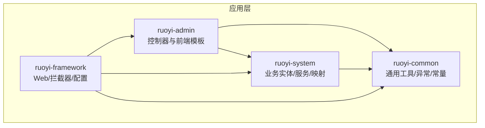
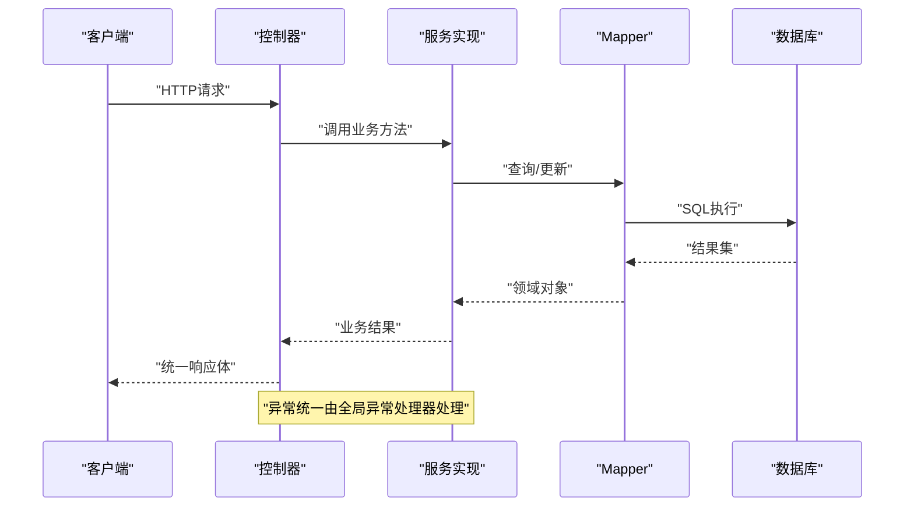
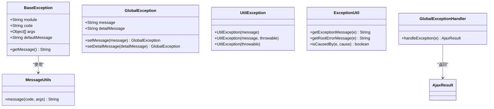
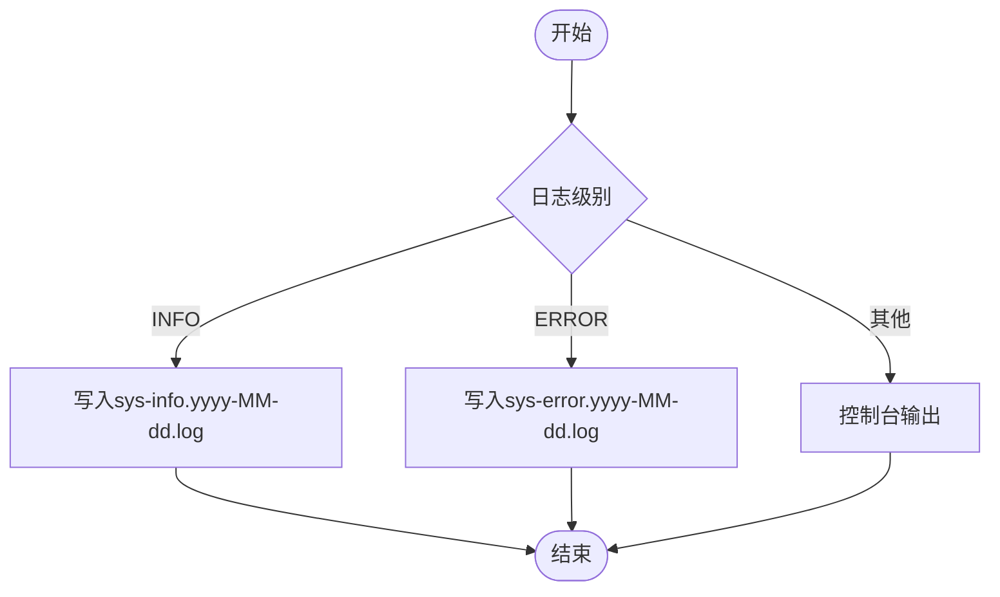
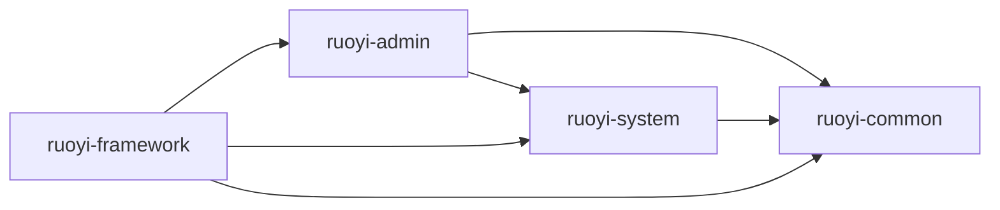

# 代码规范与最佳实践

<cite>
**本文引用的文件**
- [BaseEntity.java](file://ruoyi-common/src/main/java/com/ruoyi/common/core/domain/BaseEntity.java)
- [BaseController.java](file://ruoyi-common/src/main/java/com/ruoyi/common/core/controller/BaseController.java)
- [GlobalExceptionHandler.java](file://ruoyi-framework/src/main/java/com/ruoyi/framework/web/exception/GlobalExceptionHandler.java)
- [BaseException.java](file://ruoyi-common/src/main/java/com/ruoyi/common/exception/base/BaseException.java)
- [GlobalException.java](file://ruoyi-common/src/main/java/com/ruoyi/common/exception/GlobalException.java)
- [UtilException.java](file://ruoyi-common/src/main/java/com/ruoyi/common/exception/UtilException.java)
- [ExceptionUtil.java](file://ruoyi-common/src/main/java/com/ruoyi/common/utils/ExceptionUtil.java)
- [LogUtils.java](file://ruoyi-common/src/main/java/com/ruoyi/common/utils/LogUtils.java)
- [logback.xml](file://ruoyi-admin/src/main/resources/logback.xml)
- [DesensitizedUtil.java](file://ruoyi-common/src/main/java/com/ruoyi/common/utils/DesensitizedUtil.java)
- [Sensitive.java](file://ruoyi-common/src/main/java/com/ruoyi/common/annotation/Sensitive.java)
- [SensitiveJsonSerializer.java](file://ruoyi-common/src/main/java/com/ruoyi/common/config/serializer/SensitiveJsonSerializer.java)
- [MessageUtils.java](file://ruoyi-common/src/main/java/com/ruoyi/common/utils/MessageUtils.java)
- [R.java](file://ruoyi-common/src/main/java/com/ruoyi/common/core/domain/R.java)
- [AjaxResult.java](file://ruoyi-common/src/main/java/com/ruoyi/common/core/domain/AjaxResult.java)
- [StringUtils.java](file://ruoyi-common/src/main/java/com/ruoyi/common/utils/StringUtils.java)
- [GenshinCharacter.java](file://ruoyi-system/src/main/java/com/ruoyi/system/domain/GenshinCharacter.java)
- [IGenshinCharacterService.java](file://ruoyi-system/src/main/java/com/ruoyi/system/service/IGenshinCharacterService.java)
- [GenshinCharacterServiceImpl.java](file://ruoyi-system/src/main/java/com/ruoyi/system/service/impl/GenshinCharacterServiceImpl.java)
- [GenshinCharacterMapper.java](file://ruoyi-system/src/main/java/com/ruoyi/system/mapper/GenshinCharacterMapper.java)
- [SysUserController.java](file://ruoyi-admin/src/main/java/com/ruoyi/web/controller/system/SysUserController.java)
- [SysRoleController.java](file://ruoyi-admin/src/main/java/com/ruoyi/web/controller/system/SysRoleController.java)
- [SysMenuController.java](file://ruoyi-admin/src/main/java/com/ruoyi/web/controller/system/SysMenuController.java)
- [SysNoticeController.java](file://ruoyi-admin/src/main/java/com/ruoyi/web/controller/system/SysNoticeController.java)
- [SysDeptController.java](file://ruoyi-admin/src/main/java/com/ruoyi/web/controller/system/SysDeptController.java)
- [SysPostController.java](file://ruoyi-admin/src/main/java/com/ruoyi/web/controller/system/SysPostController.java)
- [SysRoleServiceImpl.java](file://ruoyi-system/src/main/java/com/ruoyi/system/service/impl/SysRoleServiceImpl.java)
- [SysMenuServiceImpl.java](file://ruoyi-system/src/main/java/com/ruoyi/system/service/impl/SysMenuServiceImpl.java)
- [SysNoticeServiceImpl.java](file://ruoyi-system/src/main/java/com/ruoyi/system/service/impl/SysNoticeServiceImpl.java)
- [SysDeptServiceImpl.java](file://ruoyi-system/src/main/java/com/ruoyi/system/service/impl/SysDeptServiceImpl.java)
- [SysPostServiceImpl.java](file://ruoyi-system/src/main/java/com/ruoyi/system/service/impl/SysPostServiceImpl.java)
- [SysUserMapper.java](file://ruoyi-system/src/main/java/com/ruoyi/system/mapper/SysUserMapper.java)
- [SysRoleMapper.java](file://ruoyi-system/src/main/java/com/ruoyi/system/mapper/SysRoleMapper.java)
- [SysMenuMapper.java](file://ruoyi-system/src/main/java/com/ruoyi/system/mapper/SysMenuMapper.java)
- [SysNoticeMapper.java](file://ruoyi-system/src/main/java/com/ruoyi/system/mapper/SysNoticeMapper.java)
- [SysDeptMapper.java](file://ruoyi-system/src/main/java/com/ruoyi/system/mapper/SysDeptMapper.java)
- [SysPostMapper.java](file://ruoyi-system/src/main/java/com/ruoyi/system/mapper/SysPostMapper.java)
- [SysUserController.java](file://ruoyi-admin/src/main/java/com/ruoyi/web/controller/system/SysUserController.java)
- [SysRoleController.java](file://ruoyi-admin/src/main/java/com/ruoyi/web/controller/system/SysRoleController.java)
- [SysMenuController.java](file://ruoyi-admin/src/main/java/com/ruoyi/web/controller/system/SysMenuController.java)
- [SysNoticeController.java](file://ruoyi-admin/src/main/java/com/ruoyi/web/controller/system/SysNoticeController.java)
- [SysDeptController.java](file://ruoyi-admin/src/main/java/com/ruoyi/web/controller/system/SysDeptController.java)
- [SysPostController.java](file://ruoyi-admin/src/main/java/com/ruoyi/web/controller/system/SysPostController.java)
- [SysRoleServiceImpl.java](file://ruoyi-system/src/main/java/com/ruoyi/system/service/impl/SysRoleServiceImpl.java)
- [SysMenuServiceImpl.java](file://ruoyi-system/src/main/java/com/ruoyi/system/service/impl/SysMenuServiceImpl.java)
- [SysNoticeServiceImpl.java](file://ruoyi-system/src/main/java/com/ruoyi/system/service/impl/SysNoticeServiceImpl.java)
- [SysDeptServiceImpl.java](file://ruoyi-system/src/main/java/com/ruoyi/system/service/impl/SysDeptServiceImpl.java)
- [SysPostServiceImpl.java](file://ruoyi-system/src/main/java/com/ruoyi/system/service/impl/SysPostServiceImpl.java)
- [SysUserMapper.java](file://ruoyi-system/src/main/java/com/ruoyi/system/mapper/SysUserMapper.java)
- [SysRoleMapper.java](file://ruoyi-system/src/main/java/com/ruoyi/system/mapper/SysRoleMapper.java)
- [SysMenuMapper.java](file://ruoyi-system/src/main/java/com/ruoyi/system/mapper/SysMenuMapper.java)
- [SysNoticeMapper.java](file://ruoyi-system/src/main/java/com/ruoyi/system/mapper/SysNoticeMapper.java)
- [SysDeptMapper.java](file://ruoyi-system/src/main/java/com/ruoyi/system/mapper/SysDeptMapper.java)
- [SysPostMapper.java](file://ruoyi-system/src/main/java/com/ruoyi/system/mapper/SysPostMapper.java)
</cite>

## 目录
1. [引言](#引言)
2. [项目结构](#项目结构)
3. [核心组件](#核心组件)
4. [架构总览](#架构总览)
5. [详细组件分析](#详细组件分析)
6. [依赖关系分析](#依赖关系分析)
7. [性能考虑](#性能考虑)
8. [故障排查指南](#故障排查指南)
9. [结论](#结论)
10. [附录](#附录)

## 引言
本文件面向“原神攻略系统”后端代码库，制定统一的Java编码规范与最佳实践，覆盖命名约定、缩进与格式化、注释规范、分层职责与命名、异常处理、日志记录、国际化与脱敏、代码审查要点与质量保障等内容。目标是提升代码一致性、可维护性与可读性，降低缺陷率与技术债务。

## 项目结构
系统采用典型的分层架构：控制器层(Controller)、服务层(Service)、数据访问层(Mapper)、通用工具与异常、框架与配置。前端模板与静态资源位于ruoyi-admin模块，业务实体与映射位于ruoyi-system模块，通用能力位于ruoyi-common，全局异常与Web配置位于ruoyi-framework。

图示来源
- [SysUserController.java](file://ruoyi-admin/src/main/java/com/ruoyi/web/controller/system/SysUserController.java)
- [IGenshinCharacterService.java](file://ruoyi-system/src/main/java/com/ruoyi/system/service/IGenshinCharacterService.java)
- [GenshinCharacterMapper.java](file://ruoyi-system/src/main/java/com/ruoyi/system/mapper/GenshinCharacterMapper.java)
- [BaseController.java](file://ruoyi-common/src/main/java/com/ruoyi/common/core/controller/BaseController.java)
- [BaseEntity.java](file://ruoyi-common/src/main/java/com/ruoyi/common/core/domain/BaseEntity.java)

章节来源
- [SysUserController.java](file://ruoyi-admin/src/main/java/com/ruoyi/web/controller/system/SysUserController.java)
- [IGenshinCharacterService.java](file://ruoyi-system/src/main/java/com/ruoyi/system/service/IGenshinCharacterService.java)
- [GenshinCharacterMapper.java](file://ruoyi-system/src/main/java/com/ruoyi/system/mapper/GenshinCharacterMapper.java)
- [BaseController.java](file://ruoyi-common/src/main/java/com/ruoyi/common/core/controller/BaseController.java)
- [BaseEntity.java](file://ruoyi-common/src/main/java/com/ruoyi/common/core/domain/BaseEntity.java)

## 核心组件
- 分层职责
  - 控制器层：负责HTTP请求接入、参数校验、调用服务层、封装响应结果。
  - 服务层：实现业务逻辑，协调多个Mapper，处理事务边界。
  - 数据访问层：封装数据库操作，遵循Mapper接口+XML的MyBatis模式。
  - 通用层：提供基础实体、控制器基类、统一响应体、异常体系、工具类与国际化支持。
  - 框架层：全局异常处理、日志配置、拦截器、Shiro安全配置等。

- 统一响应与结果封装
  - 使用统一响应体包装业务结果，便于前端统一处理与国际化文案展示。

章节来源
- [R.java](file://ruoyi-common/src/main/java/com/ruoyi/common/core/domain/R.java)
- [AjaxResult.java](file://ruoyi-common/src/main/java/com/ruoyi/common/core/domain/AjaxResult.java)
- [BaseController.java](file://ruoyi-common/src/main/java/com/ruoyi/common/core/controller/BaseController.java)

## 架构总览
系统通过控制器接收请求，调用服务层执行业务，服务层通过Mapper访问数据库，异常由全局异常处理器捕获并统一返回，日志通过Logback输出到不同文件。

图示来源
- [SysUserController.java](file://ruoyi-admin/src/main/java/com/ruoyi/web/controller/system/SysUserController.java)
- [GenshinCharacterServiceImpl.java](file://ruoyi-system/src/main/java/com/ruoyi/system/service/impl/GenshinCharacterServiceImpl.java)
- [GenshinCharacterMapper.java](file://ruoyi-system/src/main/java/com/ruoyi/system/mapper/GenshinCharacterMapper.java)
- [GlobalExceptionHandler.java](file://ruoyi-framework/src/main/java/com/ruoyi/framework/web/exception/GlobalExceptionHandler.java)

## 详细组件分析

### Java编码规范与命名约定
- 类名：使用PascalCase（如GenshinCharacter、SysUserController）
- 变量名：使用camelCase（如userId、userName）
- 常量：使用UPPER_CASE（如MAX_SIZE、DEFAULT_PAGE_SIZE）
- 接口：以I前缀命名（如IGenshinCharacterService）
- 实现类：接口名去掉I前缀（如GenshinCharacterServiceImpl）
- Mapper接口：以Mapper结尾（如GenshinCharacterMapper）

章节来源
- [GenshinCharacter.java](file://ruoyi-system/src/main/java/com/ruoyi/system/domain/GenshinCharacter.java)
- [IGenshinCharacterService.java](file://ruoyi-system/src/main/java/com/ruoyi/system/service/IGenshinCharacterService.java)
- [GenshinCharacterServiceImpl.java](file://ruoyi-system/src/main/java/com/ruoyi/system/service/impl/GenshinCharacterServiceImpl.java)
- [GenshinCharacterMapper.java](file://ruoyi-system/src/main/java/com/ruoyi/system/mapper/GenshinCharacterMapper.java)

### 缩进与格式化规则
- 统一使用4空格缩进
- 大括号独占一行风格
- 方法之间保留空行分隔
- 行宽不超过120字符
- 导入顺序：第三方库、项目内包，按字母排序

### 注释规范
- 类与接口：使用Javadoc描述用途、作者、日期
- 方法：说明参数、返回值、异常、注意事项
- 字段：简述含义与约束
- 复杂逻辑：在关键步骤添加行内注释

### 分层职责与命名规范
- 控制器层
  - 命名：XxxController（如SysUserController）
  - 职责：参数解析、校验、调用服务、封装响应
- 服务层
  - 接口：IXxxService（如IGenshinCharacterService）
  - 实现：XxxServiceImpl（如GenshinCharacterServiceImpl）
  - 职责：业务编排、事务管理、调用Mapper
- 数据访问层
  - 接口：XxxMapper（如GenshinCharacterMapper）
  - XML：XxxMapper.xml（与接口同包同名）
  - 职责：SQL映射、数据持久化

章节来源
- [SysUserController.java](file://ruoyi-admin/src/main/java/com/ruoyi/web/controller/system/SysUserController.java)
- [IGenshinCharacterService.java](file://ruoyi-system/src/main/java/com/ruoyi/system/service/IGenshinCharacterService.java)
- [GenshinCharacterServiceImpl.java](file://ruoyi-system/src/main/java/com/ruoyi/system/service/impl/GenshinCharacterServiceImpl.java)
- [GenshinCharacterMapper.java](file://ruoyi-system/src/main/java/com/ruoyi/system/mapper/GenshinCharacterMapper.java)

### 异常处理最佳实践
- 自定义异常
  - 基础异常：BaseException（支持模块、编码、参数、默认消息）
  - 全局异常：GlobalException（用于通用错误）
  - 工具异常：UtilException（工具类封装）
- 国际化处理
  - 通过MessageUtils根据code与args解析本地化消息
- 异常工具
  - ExceptionUtil：提取根因、异常堆栈字符串
- 全局异常处理
  - GlobalExceptionHandler：统一捕获并返回AjaxResult/R响应

图示来源
- [BaseException.java](file://ruoyi-common/src/main/java/com/ruoyi/common/exception/base/BaseException.java)
- [GlobalException.java](file://ruoyi-common/src/main/java/com/ruoyi/common/exception/GlobalException.java)
- [UtilException.java](file://ruoyi-common/src/main/java/com/ruoyi/common/exception/UtilException.java)
- [MessageUtils.java](file://ruoyi-common/src/main/java/com/ruoyi/common/utils/MessageUtils.java)
- [ExceptionUtil.java](file://ruoyi-common/src/main/java/com/ruoyi/common/utils/ExceptionUtil.java)
- [GlobalExceptionHandler.java](file://ruoyi-framework/src/main/java/com/ruoyi/framework/web/exception/GlobalExceptionHandler.java)

章节来源
- [BaseException.java](file://ruoyi-common/src/main/java/com/ruoyi/common/exception/base/BaseException.java)
- [GlobalException.java](file://ruoyi-common/src/main/java/com/ruoyi/common/exception/GlobalException.java)
- [UtilException.java](file://ruoyi-common/src/main/java/com/ruoyi/common/exception/UtilException.java)
- [MessageUtils.java](file://ruoyi-common/src/main/java/com/ruoyi/common/utils/MessageUtils.java)
- [ExceptionUtil.java](file://ruoyi-common/src/main/java/com/ruoyi/common/utils/ExceptionUtil.java)
- [GlobalExceptionHandler.java](file://ruoyi-framework/src/main/java/com/ruoyi/framework/web/exception/GlobalExceptionHandler.java)

### 日志记录规范
- 日志级别
  - INFO：系统运行状态、操作日志
  - ERROR：异常与错误
- 日志格式
  - 时间戳、线程、级别、Logger名称、方法行号、消息
- 日志落盘
  - 按天滚动，INFO与ERROR分别输出到不同文件
- 访问日志
  - 通过LogUtils统一采集用户行为、IP、UA、URL、参数等

图示来源
- [logback.xml](file://ruoyi-admin/src/main/resources/logback.xml)
- [LogUtils.java](file://ruoyi-common/src/main/java/com/ruoyi/common/utils/LogUtils.java)

章节来源
- [logback.xml](file://ruoyi-admin/src/main/resources/logback.xml)
- [LogUtils.java](file://ruoyi-common/src/main/java/com/ruoyi/common/utils/LogUtils.java)

### 敏感信息脱敏与国际化
- 脱敏策略
  - 通过DesensitizedUtil对手机号、身份证、银行卡等进行脱敏
  - 通过@Sensitive注解与SensitiveJsonSerializer在序列化时自动脱敏
- 国际化
  - 使用MessageUtils根据code与args解析多语言文案

章节来源
- [DesensitizedUtil.java](file://ruoyi-common/src/main/java/com/ruoyi/common/utils/DesensitizedUtil.java)
- [Sensitive.java](file://ruoyi-common/src/main/java/com/ruoyi/common/annotation/Sensitive.java)
- [SensitiveJsonSerializer.java](file://ruoyi-common/src/main/java/com/ruoyi/common/config/serializer/SensitiveJsonSerializer.java)
- [MessageUtils.java](file://ruoyi-common/src/main/java/com/ruoyi/common/utils/MessageUtils.java)

### 代码审查要点与质量保证
- 命名一致性：严格遵循PascalCase/camelCase/UPPER_CASE
- 分层清晰：Controller只做薄薄一层，业务逻辑下沉至Service
- 参数校验：使用JSR-303或手动校验，失败即早返回
- 异常处理：区分业务异常与系统异常，避免吞异常
- 日志规范：关键路径打点，避免泄露敏感信息
- 单元测试：核心Service与工具类必须有覆盖
- 安全：输入过滤、XSS防护、SQL注入防护

## 依赖关系分析

图示来源
- [SysUserController.java](file://ruoyi-admin/src/main/java/com/ruoyi/web/controller/system/SysUserController.java)
- [IGenshinCharacterService.java](file://ruoyi-system/src/main/java/com/ruoyi/system/service/IGenshinCharacterService.java)
- [GenshinCharacterMapper.java](file://ruoyi-system/src/main/java/com/ruoyi/system/mapper/GenshinCharacterMapper.java)
- [BaseController.java](file://ruoyi-common/src/main/java/com/ruoyi/common/core/controller/BaseController.java)
- [BaseEntity.java](file://ruoyi-common/src/main/java/com/ruoyi/common/core/domain/BaseEntity.java)

章节来源
- [SysUserController.java](file://ruoyi-admin/src/main/java/com/ruoyi/web/controller/system/SysUserController.java)
- [IGenshinCharacterService.java](file://ruoyi-system/src/main/java/com/ruoyi/system/service/IGenshinCharacterService.java)
- [GenshinCharacterMapper.java](file://ruoyi-system/src/main/java/com/ruoyi/system/mapper/GenshinCharacterMapper.java)
- [BaseController.java](file://ruoyi-common/src/main/java/com/ruoyi/common/core/controller/BaseController.java)
- [BaseEntity.java](file://ruoyi-common/src/main/java/com/ruoyi/common/core/domain/BaseEntity.java)

## 性能考虑
- SQL优化：合理使用索引、避免N+1查询、批量操作
- 缓存：热点数据缓存，注意缓存穿透与并发一致性
- IO：异步处理耗时任务，避免阻塞主线程
- 序列化：脱敏与序列化开销控制，避免大对象频繁序列化

## 故障排查指南
- 查看系统日志
  - INFO：sys-info.yyyy-MM-dd.log
  - ERROR：sys-error.yyyy-MM-dd.log
- 访问日志
  - sys-user.yyyy-MM-dd.log 记录用户行为
- 异常定位
  - 使用ExceptionUtil.getRootErrorMessage快速定位根因
  - 在GlobalExceptionHandler中统一返回AjaxResult，便于前端展示

章节来源
- [logback.xml](file://ruoyi-admin/src/main/resources/logback.xml)
- [LogUtils.java](file://ruoyi-common/src/main/java/com/ruoyi/common/utils/LogUtils.java)
- [ExceptionUtil.java](file://ruoyi-common/src/main/java/com/ruoyi/common/utils/ExceptionUtil.java)
- [GlobalExceptionHandler.java](file://ruoyi-framework/src/main/java/com/ruoyi/framework/web/exception/GlobalExceptionHandler.java)

## 结论
通过建立统一的编码规范与最佳实践，结合完善的异常处理、日志与脱敏机制，能够显著提升系统的稳定性、可维护性与安全性。建议在团队内定期回顾与培训，确保规范落地执行。

## 附录
- 常用工具类参考
  - 字符串处理：StringUtils（驼峰/下划线转换等）
  - 响应封装：R/AjaxResult
  - 基础实体：BaseEntity
  - 控制器基类：BaseController

章节来源
- [StringUtils.java](file://ruoyi-common/src/main/java/com/ruoyi/common/utils/StringUtils.java)
- [R.java](file://ruoyi-common/src/main/java/com/ruoyi/common/core/domain/R.java)
- [AjaxResult.java](file://ruoyi-common/src/main/java/com/ruoyi/common/core/domain/AjaxResult.java)
- [BaseEntity.java](file://ruoyi-common/src/main/java/com/ruoyi/common/core/domain/BaseEntity.java)
- [BaseController.java](file://ruoyi-common/src/main/java/com/ruoyi/common/core/controller/BaseController.java)