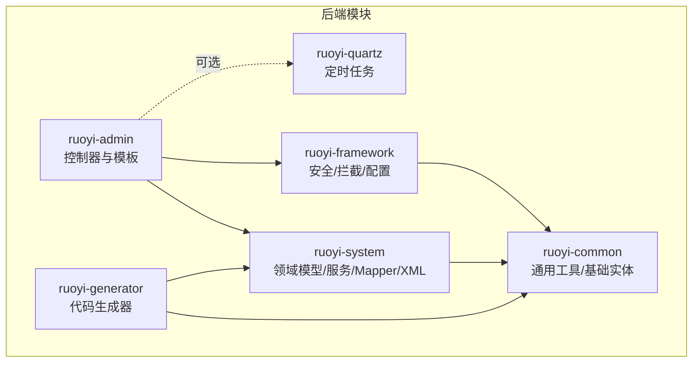
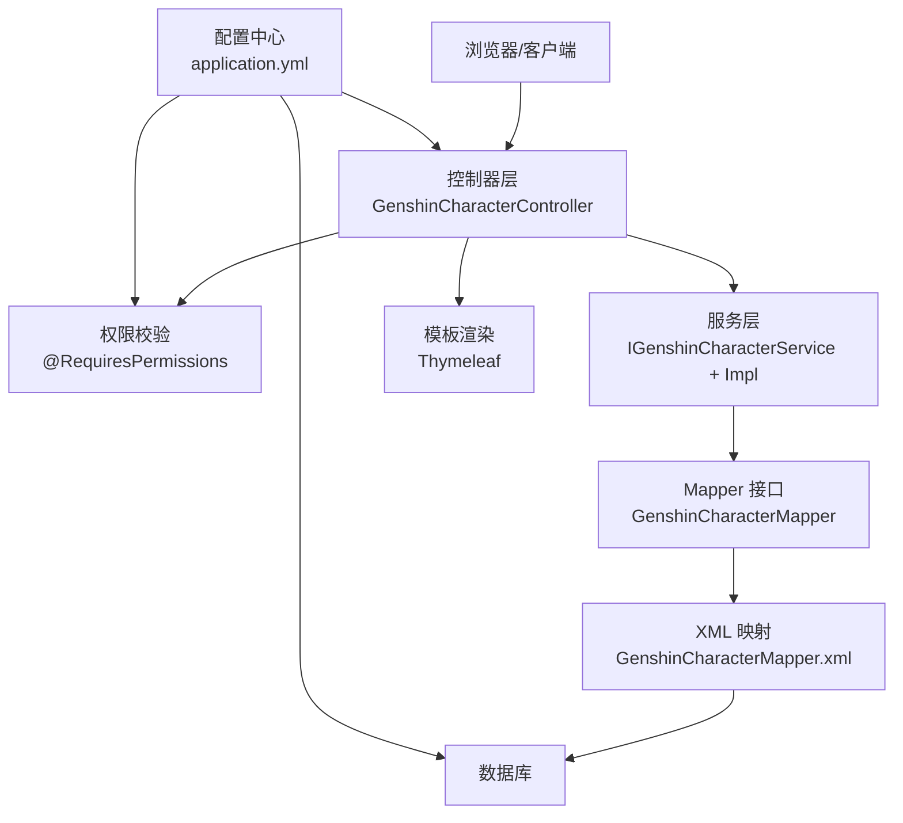
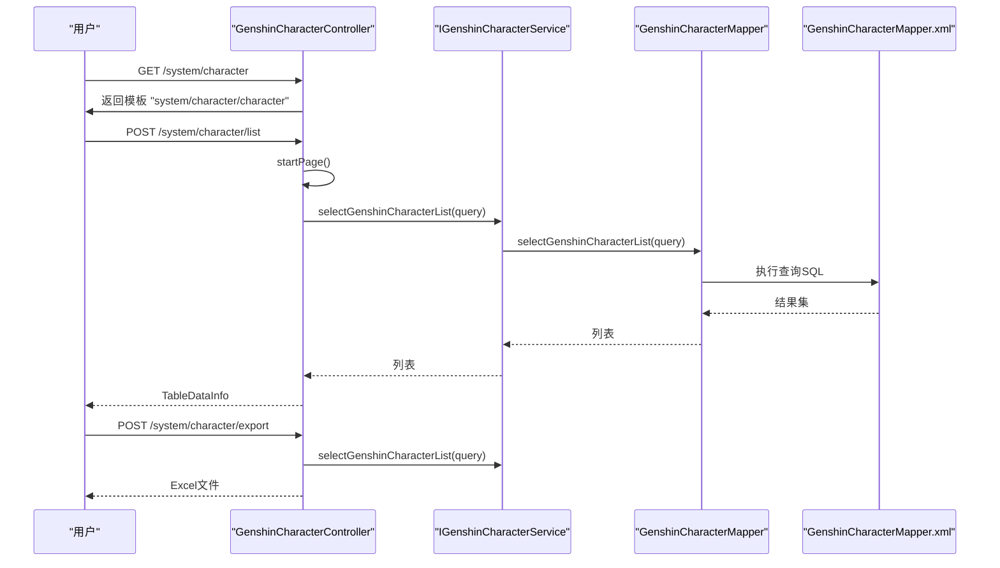
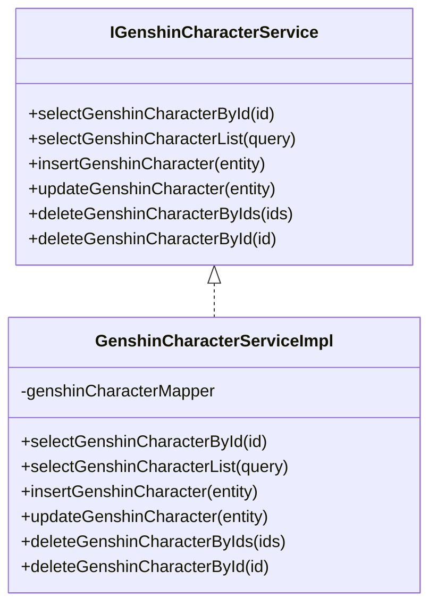
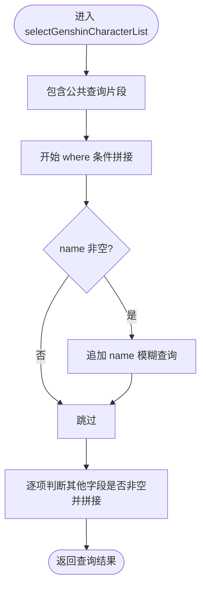
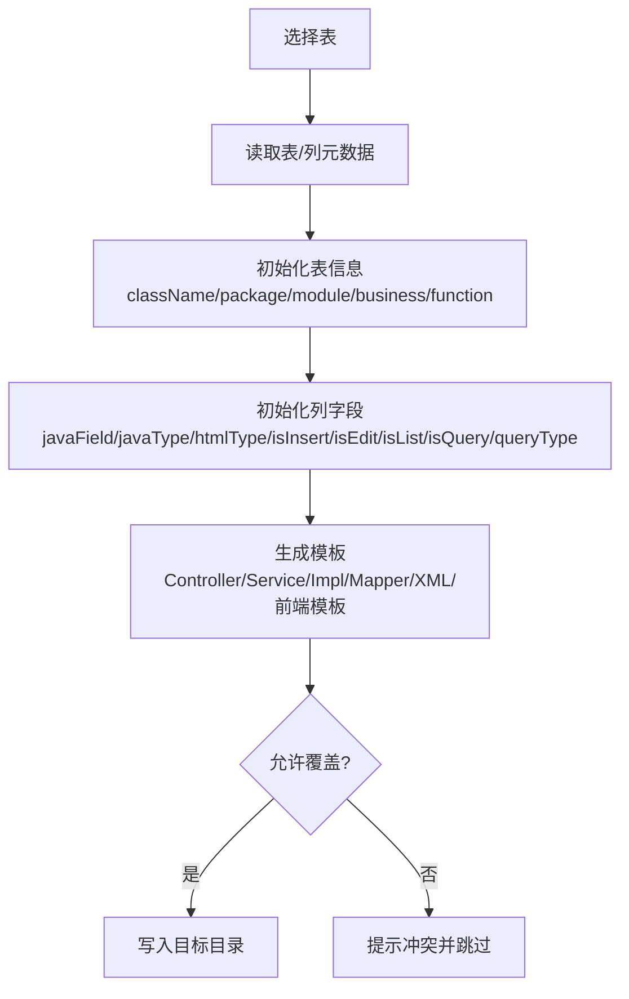
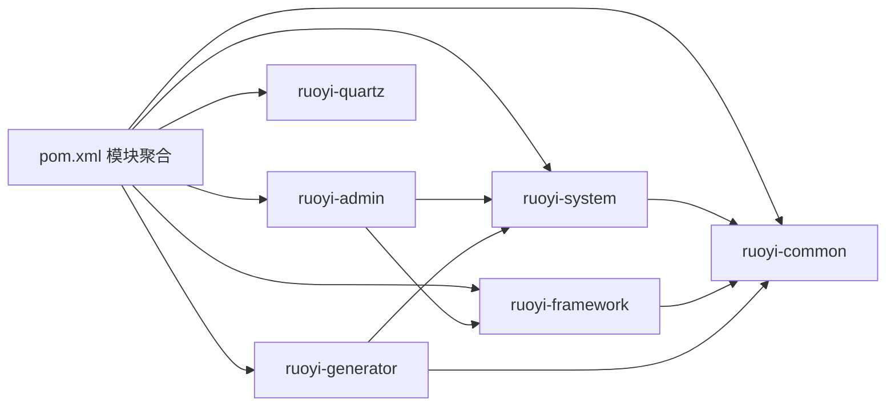

# 功能扩展与二次开发

<cite>
**本文引用的文件**
- [README.md](file://README.md)
- [GENSHIN_MODULE_GUIDE.md](file://GENSHIN_MODULE_GUIDE.md)
- [application.yml](file://ruoyi-admin/src/main/resources/application.yml)
- [pom.xml](file://pom.xml)
- [GenshinCharacter.java](file://ruoyi-system/src/main/java/com/ruoyi/system/domain/GenshinCharacter.java)
- [IGenshinCharacterService.java](file://ruoyi-system/src/main/java/com/ruoyi/system/service/IGenshinCharacterService.java)
- [GenshinCharacterServiceImpl.java](file://ruoyi-system/src/main/java/com/ruoyi/system/service/impl/GenshinCharacterServiceImpl.java)
- [GenshinCharacterMapper.java](file://ruoyi-system/src/main/java/com/ruoyi/system/mapper/GenshinCharacterMapper.java)
- [GenshinCharacterMapper.xml](file://ruoyi-system/src/main/resources/mapper/system/GenshinCharacterMapper.xml)
- [GenshinCharacterController.java](file://ruoyi-admin/src/main/java/com/ruoyi/web/controller/system/GenshinCharacterController.java)
- [BaseEntity.java](file://ruoyi-common/src/main/java/com/ruoyi/common/core/domain/BaseEntity.java)
- [GenUtils.java](file://ruoyi-generator/src/main/java/com/ruoyi/generator/util/GenUtils.java)
- [generator.yml](file://ruoyi-generator/src/main/resources/generator.yml)
</cite>

## 目录
1. [引言](#引言)
2. [项目结构](#项目结构)
3. [核心组件](#核心组件)
4. [架构总览](#架构总览)
5. [详细组件分析](#详细组件分析)
6. [依赖分析](#依赖分析)
7. [性能考虑](#性能考虑)
8. [故障排查指南](#故障排查指南)
9. [结论](#结论)
10. [附录](#附录)

## 引言
本指南面向希望在“原神攻略系统”基础上进行功能扩展与二次开发的工程师。系统基于若依（RuoYi）权限底座，采用前后端分离架构，后端以 Spring Boot + MyBatis 为核心，前端通过 Thymeleaf 模板渲染。本文将围绕 Controller、Service、Mapper、XML 文件的完整开发流程展开，详解代码生成器的使用与定制，模块集成最佳实践（菜单权限、前端路由、国际化），以及扩展现有功能（新增字段、修改业务逻辑、新增校验规则）的方法论与实操步骤。

## 项目结构
项目采用多模块聚合工程，核心模块包括：
- ruoyi-admin：Web 控制器与前端模板
- ruoyi-system：领域模型、服务接口与实现、MyBatis Mapper/XML
- ruoyi-common：通用常量、工具、基础实体与异常
- ruoyi-framework：安全、拦截、配置、异步等框架能力
- ruoyi-generator：代码生成器
- ruoyi-quartz：定时任务（可选）

图表来源
- [pom.xml:208-215](file://pom.xml#L208-L215)

章节来源
- [pom.xml:1-264](file://pom.xml#L1-L264)

## 核心组件
- 控制器层：负责接收请求、鉴权、调用服务、返回响应与模板渲染
- 服务层：封装业务逻辑，协调 Mapper 与外部依赖
- Mapper 层：定义数据访问接口
- XML 映射：SQL 语句与结果映射
- 基础实体：统一的创建/更新时间、搜索值、备注等字段
- 代码生成器：基于表结构自动生成 CRUD 代码与模板

章节来源
- [GenshinCharacterController.java:38-198](file://ruoyi-admin/src/main/java/com/ruoyi/web/controller/system/GenshinCharacterController.java#L38-L198)
- [IGenshinCharacterService.java:12-61](file://ruoyi-system/src/main/java/com/ruoyi/system/service/IGenshinCharacterService.java#L12-L61)
- [GenshinCharacterServiceImpl.java:17-95](file://ruoyi-system/src/main/java/com/ruoyi/system/service/impl/GenshinCharacterServiceImpl.java#L17-L95)
- [GenshinCharacterMapper.java:12-61](file://ruoyi-system/src/main/java/com/ruoyi/system/mapper/GenshinCharacterMapper.java#L12-L61)
- [GenshinCharacterMapper.xml:5-169](file://ruoyi-system/src/main/resources/mapper/system/GenshinCharacterMapper.xml#L5-L169)
- [BaseEntity.java:16-119](file://ruoyi-common/src/main/java/com/ruoyi/common/core/domain/BaseEntity.java#L16-L119)

## 架构总览
系统遵循经典的分层架构：Web 控制器 → 业务服务 → 数据访问 → 数据库。权限控制通过 Shiro 注解实现；MyBatis 负责 ORM；Thymeleaf 提供模板渲染；国际化通过 Spring Messages 配置；分页通过 PageHelper 插件。

图表来源
- [GenshinCharacterController.java:38-198](file://ruoyi-admin/src/main/java/com/ruoyi/web/controller/system/GenshinCharacterController.java#L38-L198)
- [IGenshinCharacterService.java:12-61](file://ruoyi-system/src/main/java/com/ruoyi/system/service/IGenshinCharacterService.java#L12-L61)
- [GenshinCharacterMapper.java:12-61](file://ruoyi-system/src/main/java/com/ruoyi/system/mapper/GenshinCharacterMapper.java#L12-L61)
- [GenshinCharacterMapper.xml:5-169](file://ruoyi-system/src/main/resources/mapper/system/GenshinCharacterMapper.xml#L5-L169)
- [application.yml:47-154](file://ruoyi-admin/src/main/resources/application.yml#L47-L154)

## 详细组件分析

### 控制器层（Controller）
- 职责：暴露 REST/HTML 接口，绑定参数，调用服务，返回 AjaxResult 或跳转模板
- 关键点：
  - 权限注解：@RequiresPermissions 控制菜单/按钮级权限
  - 分页：startPage() 与 TableDataInfo 支持表格分页
  - 导出：ExcelUtil 将查询结果导出为 Excel
  - 模板：返回 "system/character/xxx" 对应前端模板

图表来源
- [GenshinCharacterController.java:60-91](file://ruoyi-admin/src/main/java/com/ruoyi/web/controller/system/GenshinCharacterController.java#L60-L91)
- [IGenshinCharacterService.java:20-28](file://ruoyi-system/src/main/java/com/ruoyi/system/service/IGenshinCharacterService.java#L20-L28)
- [GenshinCharacterMapper.xml:38-65](file://ruoyi-system/src/main/resources/mapper/system/GenshinCharacterMapper.xml#L38-L65)

章节来源
- [GenshinCharacterController.java:38-198](file://ruoyi-admin/src/main/java/com/ruoyi/web/controller/system/GenshinCharacterController.java#L38-L198)

### 服务层（Service）
- 职责：封装业务规则，协调 Mapper，处理事务边界
- 关键点：
  - 接口定义标准 CRUD 方法
  - 实现类直接委派给 Mapper
  - Convert 工具用于字符串转数组等

图表来源
- [IGenshinCharacterService.java:12-61](file://ruoyi-system/src/main/java/com/ruoyi/system/service/IGenshinCharacterService.java#L12-L61)
- [GenshinCharacterServiceImpl.java:17-95](file://ruoyi-system/src/main/java/com/ruoyi/system/service/impl/GenshinCharacterServiceImpl.java#L17-L95)

章节来源
- [IGenshinCharacterService.java:12-61](file://ruoyi-system/src/main/java/com/ruoyi/system/service/IGenshinCharacterService.java#L12-L61)
- [GenshinCharacterServiceImpl.java:17-95](file://ruoyi-system/src/main/java/com/ruoyi/system/service/impl/GenshinCharacterServiceImpl.java#L17-L95)

### 数据访问层（Mapper/XML）
- Mapper 接口：声明 CRUD 方法
- XML 映射：定义 SQL、结果映射、条件拼装、分页查询片段
- 关键点：
  - resultMap 将列名映射到驼峰字段
  - <where>/<if> 动态拼装查询条件
  - insert/update 支持按非空字段动态拼接

图表来源
- [GenshinCharacterMapper.xml:34-65](file://ruoyi-system/src/main/resources/mapper/system/GenshinCharacterMapper.xml#L34-L65)

章节来源
- [GenshinCharacterMapper.java:12-61](file://ruoyi-system/src/main/java/com/ruoyi/system/mapper/GenshinCharacterMapper.java#L12-L61)
- [GenshinCharacterMapper.xml:5-169](file://ruoyi-system/src/main/resources/mapper/system/GenshinCharacterMapper.xml#L5-L169)

### 基础实体（BaseEntity）
- 统一字段：搜索值、创建者、创建时间、更新者、更新时间、备注、请求参数 Map
- JSON 注解：时间格式化、忽略序列化、空值不输出

章节来源
- [BaseEntity.java:16-119](file://ruoyi-common/src/main/java/com/ruoyi/common/core/domain/BaseEntity.java#L16-L119)

### 代码生成器（Generator）
- 作用：基于表结构一键生成 Controller/Service/Mapper/XML/模板
- 配置：generator.yml 控制作者、包名、表前缀、是否允许覆盖
- 工具：GenUtils 负责表/列信息初始化、Java 类型推断、HTML 控件类型推断、业务名提取等

图表来源
- [generator.yml:2-13](file://ruoyi-generator/src/main/resources/generator.yml#L2-L13)
- [GenUtils.java:21-126](file://ruoyi-generator/src/main/java/com/ruoyi/generator/util/GenUtils.java#L21-L126)

章节来源
- [generator.yml:1-13](file://ruoyi-generator/src/main/resources/generator.yml#L1-L13)
- [GenUtils.java:16-253](file://ruoyi-generator/src/main/java/com/ruoyi/generator/util/GenUtils.java#L16-L253)

## 依赖分析
- 模块依赖：pom.xml 中定义了各模块的依赖关系与版本管理
- 运行配置：application.yml 配置了 MyBatis、分页、Shiro、国际化、Swagger 等
- 国际化：messages.basename 指向静态资源 i18n/messages，前端可通过 i18n 标签使用

图表来源
- [pom.xml:208-215](file://pom.xml#L208-L215)

章节来源
- [pom.xml:1-264](file://pom.xml#L1-L264)
- [application.yml:58-60](file://ruoyi-admin/src/main/resources/application.yml#L58-L60)

## 性能考虑
- 分页：使用 PageHelper，避免一次性加载大量数据
- SQL：MyBatis XML 中使用 <where>/<if> 动态拼接，注意索引与条件选择性
- 缓存：可结合 EhCache 或 Redis 缓存热点数据（需自行扩展）
- 导出：大批量导出建议异步任务或分批处理
- 日志：合理设置日志级别，避免生产环境过多 debug 输出

## 故障排查指南
- 404/路由问题：检查 Controller @RequestMapping 与前端模板路径是否一致
- 权限不足：确认菜单与按钮权限标识是否正确配置，用户角色是否授权
- 数据库连接：核对 application.yml 中数据库配置与实际库名
- 类找不到：确保复制/生成的文件位于正确包路径，Maven 重新编译
- 导出失败：确认 ExcelUtil 使用的实体类与字段映射一致

章节来源
- [GENSHIN_MODULE_GUIDE.md:146-167](file://GENSHIN_MODULE_GUIDE.md#L146-L167)

## 结论
通过遵循“控制器-服务-数据访问-模板”的分层设计，结合代码生成器与模块化工程结构，开发者可以高效地在原神攻略系统上进行功能扩展与二次开发。建议在新增模块时严格遵循现有规范，确保权限、国际化、分页、导出等基础设施的一致性。

## 附录

### 一、基于现有模块开发新功能的完整流程
- 需求分析：明确业务场景、字段、查询条件、权限范围
- 数据库设计：设计表结构，准备 SQL 脚本
- 代码生成：配置 generator.yml，执行生成器，获得 Controller/Service/Mapper/XML
- 手工完善：补充业务逻辑、校验规则、权限注解、模板页面
- 集成测试：启动项目，验证增删改查、分页、导出、权限

章节来源
- [GENSHIN_MODULE_GUIDE.md:19-143](file://GENSHIN_MODULE_GUIDE.md#L19-L143)
- [generator.yml:2-13](file://ruoyi-generator/src/main/resources/generator.yml#L2-L13)

### 二、代码生成器使用与定制
- 配置生成模板：修改 generator.yml 中作者、包名、表前缀、覆盖策略
- 自定义规则：在 GenUtils 中扩展列类型推断、HTML 控件类型、查询类型等
- 批量生成：选择多表，统一生成，再手工微调

章节来源
- [generator.yml:2-13](file://ruoyi-generator/src/main/resources/generator.yml#L2-L13)
- [GenUtils.java:35-126](file://ruoyi-generator/src/main/java/com/ruoyi/generator/util/GenUtils.java#L35-L126)

### 三、模块集成最佳实践
- 菜单权限配置：在后台“系统管理 → 菜单管理”添加菜单与按钮权限标识
- 前端路由：将模板放置于 ruoyi-admin/templates/system 下，控制器返回对应路径
- 国际化：在 static/i18n/messages 下维护多语言资源文件

章节来源
- [GENSHIN_MODULE_GUIDE.md:87-108](file://GENSHIN_MODULE_GUIDE.md#L87-L108)
- [application.yml:58-60](file://ruoyi-admin/src/main/resources/application.yml#L58-L60)

### 四、扩展现有功能示例（从需求到实现）
- 需求：为角色实体新增“生日月份”字段
- 步骤：
  1) 数据库：在表中新增字段
  2) 代码生成：重新生成实体、Mapper、XML
  3) 实体：在 GenshinCharacter.java 中添加字段与 getter/setter
  4) Mapper/XML：在 XML 中增加列映射与 insert/update 动态片段
  5) 控制器：在列表查询与导出中加入该字段的查询条件
  6) 权限：在菜单管理中为该字段所在功能配置权限
  7) 国际化：在 i18n 资源中添加对应文案
  8) 测试：验证新增字段的增删改查与导出

章节来源
- [GenshinCharacter.java:14-383](file://ruoyi-system/src/main/java/com/ruoyi/system/domain/GenshinCharacter.java#L14-L383)
- [GenshinCharacterMapper.xml:34-169](file://ruoyi-system/src/main/resources/mapper/system/GenshinCharacterMapper.xml#L34-L169)
- [GenshinCharacterController.java:69-91](file://ruoyi-admin/src/main/java/com/ruoyi/web/controller/system/GenshinCharacterController.java#L69-L91)

### 五、插件化开发思路
- 抽象接口：将可变业务抽象为接口，便于替换实现
- SPI 扩展：通过配置或注册机制加载不同实现
- 模块隔离：每个功能作为独立模块，通过依赖注入组合
- 配置驱动：通过 application.yml 或数据库配置启用/禁用功能

### 六、测试策略与质量保证
- 单元测试：针对 Service 方法编写单元测试，Mock Mapper 行为
- 集成测试：启动完整应用，验证控制器、权限、模板渲染、导出
- 回归测试：每次新增字段或修改业务逻辑后，回归 CRUD 与导出
- 性能测试：对高频查询与导出进行压力测试，优化 SQL 与分页