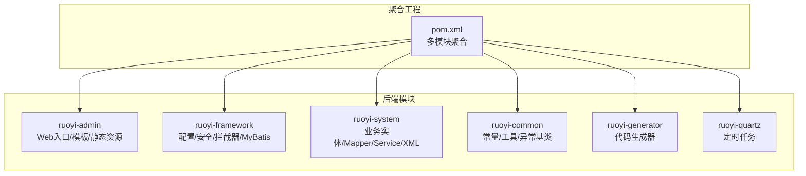
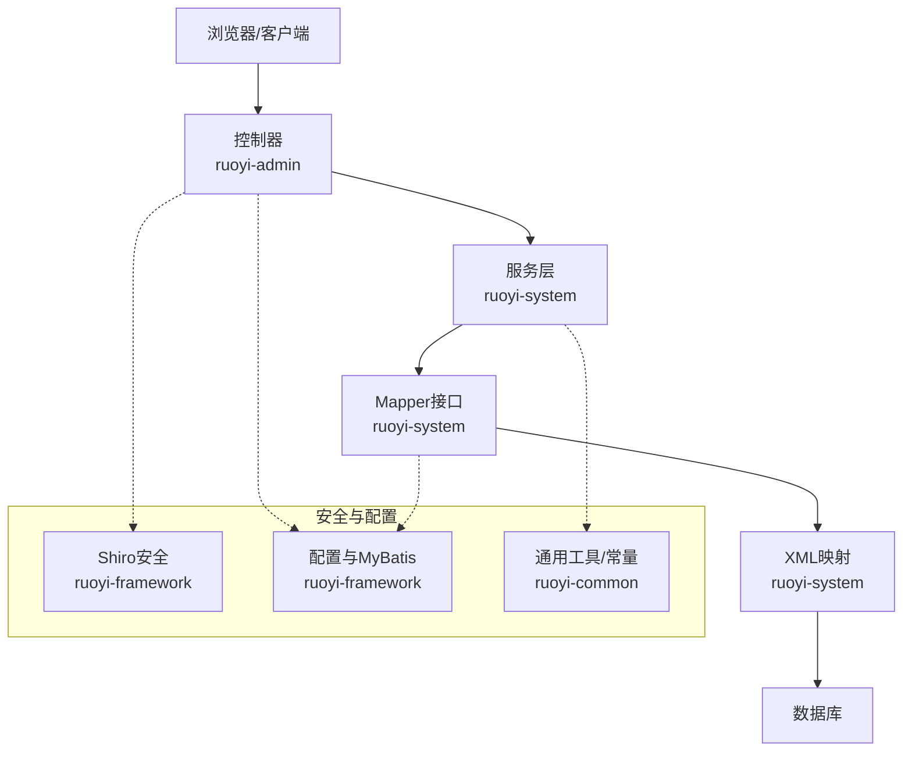
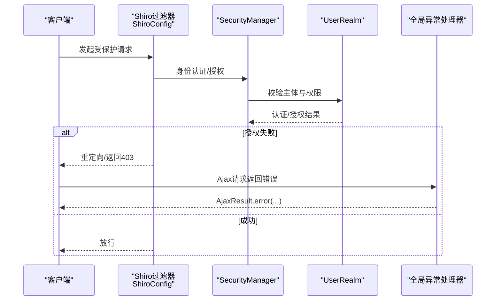
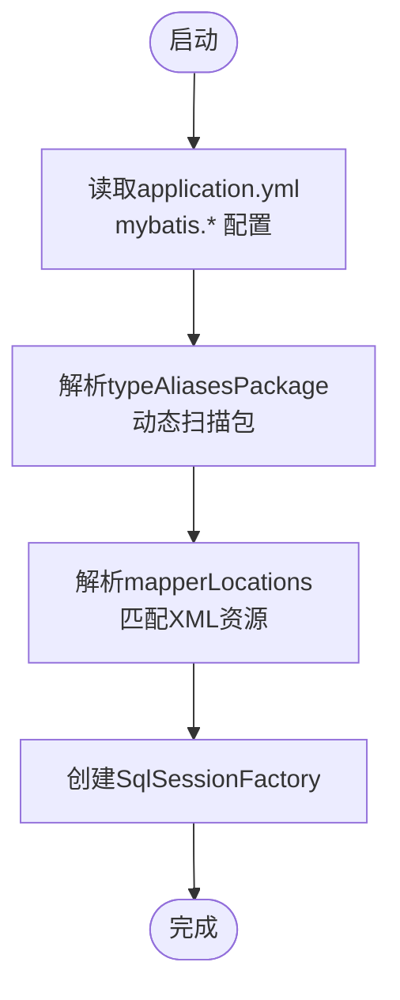
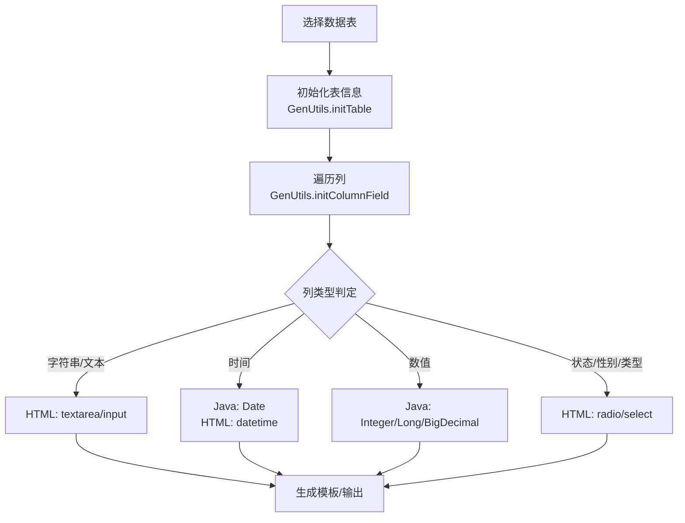
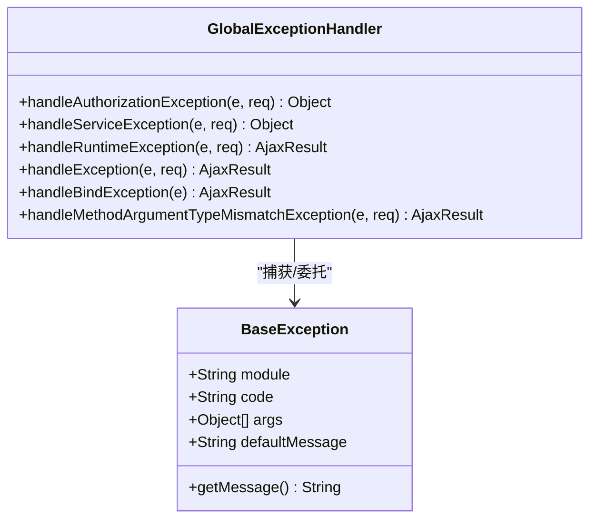
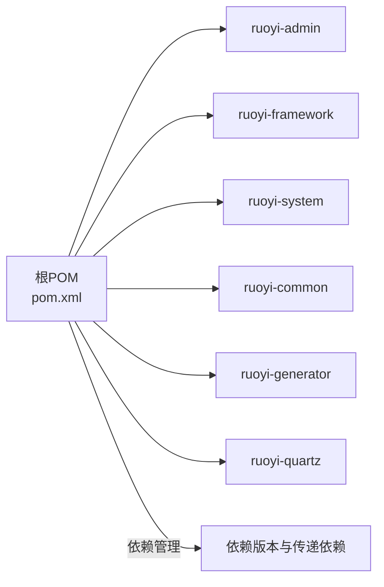

# 开发指南

<cite>
**本文引用的文件**
- [README.md](file://README.md)
- [pom.xml](file://pom.xml)
- [application.yml](file://ruoyi-admin/src/main/resources/application.yml)
- [GENSHIN_MODULE_GUIDE.md](file://GENSHIN_MODULE_GUIDE.md)
- [Constants.java](file://ruoyi-common/src/main/java/com/ruoyi/common/constant/Constants.java)
- [ApplicationConfig.java](file://ruoyi-framework/src/main/java/com/ruoyi/framework/config/ApplicationConfig.java)
- [MyBatisConfig.java](file://ruoyi-framework/src/main/java/com/ruoyi/framework/config/MyBatisConfig.java)
- [ShiroConfig.java](file://ruoyi-framework/src/main/java/com/ruoyi/framework/config/ShiroConfig.java)
- [GenUtils.java](file://ruoyi-generator/src/main/java/com/ruoyi/generator/util/GenUtils.java)
- [StringUtils.java](file://ruoyi-common/src/main/java/com/ruoyi/common/utils/StringUtils.java)
- [BaseException.java](file://ruoyi-common/src/main/java/com/ruoyi/common/exception/base/BaseException.java)
- [GlobalExceptionHandler.java](file://ruoyi-framework/src/main/java/com/ruoyi/framework/web/exception/GlobalExceptionHandler.java)
- [迁移指南.md](file://迁移指南.md)
- [ry.bat](file://ry.bat)
- [ry.sh](file://ry.sh)
</cite>

## 目录
1. [简介](#简介)
2. [项目结构](#项目结构)
3. [核心组件](#核心组件)
4. [架构总览](#架构总览)
5. [详细组件分析](#详细组件分析)
6. [依赖分析](#依赖分析)
7. [性能考虑](#性能考虑)
8. [故障排查指南](#故障排查指南)
9. [结论](#结论)
10. [附录](#附录)

## 简介
本开发指南面向“原神攻略系统”的二次开发与扩展，基于若依（RuoYi）框架的模块化结构，围绕开发环境搭建、IDE配置、Maven与数据库配置、代码规范与最佳实践、构建与部署、功能扩展与修改、调试与开发工具、单元测试与覆盖率、以及代码生成器使用与模板定制等方面，提供系统化的指导。

## 项目结构
项目采用多模块聚合工程结构，核心模块包括：
- ruoyi-admin：后端管理端入口模块，负责Web控制器、模板与静态资源
- ruoyi-framework：框架支撑模块，包含配置、拦截器、Shiro安全、MyBatis配置等
- ruoyi-system：业务模块，包含原神相关实体、Mapper、Service与XML映射
- ruoyi-common：通用工具与常量
- ruoyi-generator：代码生成器模块
- ruoyi-quartz：定时任务模块（可选）

图表来源
- [pom.xml:208-216](file://pom.xml#L208-L216)
- [README.md:24-33](file://README.md#L24-L33)

章节来源
- [pom.xml:208-216](file://pom.xml#L208-L216)
- [README.md:24-33](file://README.md#L24-L33)

## 核心组件
- 配置与启动
  - 入口类与Servlet初始化：RuoYiApplication、RuoYiServletInitializer
  - Web与安全配置：ApplicationConfig、ShiroConfig、MyBatisConfig
  - 应用配置：application.yml（端口、日志、MyBatis、Shiro、XSS/CSRF、Swagger等）
- 通用能力
  - 常量与工具：Constants、StringUtils
  - 异常体系：BaseException、GlobalExceptionHandler
- 代码生成
  - GenUtils：表与列信息初始化、类型推断、HTML控件类型映射

章节来源
- [ApplicationConfig.java:12-20](file://ruoyi-framework/src/main/java/com/ruoyi/framework/config/ApplicationConfig.java#L12-L20)
- [ShiroConfig.java:50-449](file://ruoyi-framework/src/main/java/com/ruoyi/framework/config/ShiroConfig.java#L50-L449)
- [MyBatisConfig.java:32-132](file://ruoyi-framework/src/main/java/com/ruoyi/framework/config/MyBatisConfig.java#L32-L132)
- [application.yml:16-154](file://ruoyi-admin/src/main/resources/application.yml#L16-L154)
- [Constants.java:10-154](file://ruoyi-common/src/main/java/com/ruoyi/common/constant/Constants.java#L10-L154)
- [StringUtils.java:19-800](file://ruoyi-common/src/main/java/com/ruoyi/common/utils/StringUtils.java#L19-L800)
- [BaseException.java:11-98](file://ruoyi-common/src/main/java/com/ruoyi/common/exception/base/BaseException.java#L11-L98)
- [GlobalExceptionHandler.java:28-150](file://ruoyi-framework/src/main/java/com/ruoyi/framework/web/exception/GlobalExceptionHandler.java#L28-L150)
- [GenUtils.java:16-253](file://ruoyi-generator/src/main/java/com/ruoyi/generator/util/GenUtils.java#L16-L253)

## 架构总览
系统采用经典的三层架构与模块化分层：
- 表现层：Spring MVC 控制器（ruoyi-admin）
- 领域层：Service（ruoyi-system）
- 数据持久层：MyBatis Mapper + XML（ruoyi-system）
- 安全与基础设施：Shiro（ruoyi-framework）、配置（ruoyi-framework）、通用工具（ruoyi-common）
- 代码生成：Velocity 模板驱动（ruoyi-generator）

图表来源
- [ApplicationConfig.java:12-20](file://ruoyi-framework/src/main/java/com/ruoyi/framework/config/ApplicationConfig.java#L12-L20)
- [MyBatisConfig.java:116-132](file://ruoyi-framework/src/main/java/com/ruoyi/framework/config/MyBatisConfig.java#L116-L132)
- [ShiroConfig.java:296-346](file://ruoyi-framework/src/main/java/com/ruoyi/framework/config/ShiroConfig.java#L296-L346)

## 详细组件分析

### 安全与权限控制（Shiro）
- 功能要点
  - 会话管理：OnlineWebSessionManager、OnlineSessionDAO、OnlineSessionFactory
  - 记住我：CustomCookieRememberMeManager，支持cipherKey动态或随机生成
  - 过滤链：anon、captchaValidate、csrfValidateFilter、kickout、onlineSession、syncOnlineSession、logout
  - 配置来源：application.yml中的shiro.*、csrf.*、xss.*
- 异常处理
  - GlobalExceptionHandler统一捕获权限异常、业务异常、运行时异常等，区分Ajax与页面跳转

图表来源
- [ShiroConfig.java:296-346](file://ruoyi-framework/src/main/java/com/ruoyi/framework/config/ShiroConfig.java#L296-L346)
- [GlobalExceptionHandler.java:36-100](file://ruoyi-framework/src/main/java/com/ruoyi/framework/web/exception/GlobalExceptionHandler.java#L36-L100)

章节来源
- [ShiroConfig.java:50-449](file://ruoyi-framework/src/main/java/com/ruoyi/framework/config/ShiroConfig.java#L50-L449)
- [application.yml:86-154](file://ruoyi-admin/src/main/resources/application.yml#L86-L154)
- [GlobalExceptionHandler.java:28-150](file://ruoyi-framework/src/main/java/com/ruoyi/framework/web/exception/GlobalExceptionHandler.java#L28-L150)

### MyBatis配置与扫描
- Mapper扫描：ApplicationConfig启用@MapperScan，自动扫描com.ruoyi.**.mapper
- SqlSessionFactory：MyBatisConfig读取application.yml中的typeAliasesPackage、mapperLocations、configLocation，动态解析包与XML路径
- VFS：集成SpringBootVFS，兼容Spring Boot资源加载

图表来源
- [MyBatisConfig.java:94-132](file://ruoyi-framework/src/main/java/com/ruoyi/framework/config/MyBatisConfig.java#L94-L132)
- [ApplicationConfig.java:12-20](file://ruoyi-framework/src/main/java/com/ruoyi/framework/config/ApplicationConfig.java#L12-L20)
- [application.yml:71-79](file://ruoyi-admin/src/main/resources/application.yml#L71-L79)

章节来源
- [ApplicationConfig.java:12-20](file://ruoyi-framework/src/main/java/com/ruoyi/framework/config/ApplicationConfig.java#L12-L20)
- [MyBatisConfig.java:32-132](file://ruoyi-framework/src/main/java/com/ruoyi/framework/config/MyBatisConfig.java#L32-L132)
- [application.yml:71-79](file://ruoyi-admin/src/main/resources/application.yml#L71-L79)

### 代码生成器（Generator）
- 功能要点
  - 表与列初始化：GenUtils.initTable、initColumnField
  - 类型推断：根据数据库类型推导Java类型、HTML控件类型、查询类型
  - 模块/业务名提取：convertClassName、getModuleName、getBusinessName
- 模板与输出
  - Velocity模板位于ruoyi-generator/resources/vm/{html,java,sql,xml}
  - 生成内容包括Controller、Service、Mapper、XML、前端页面与SQL脚本

图表来源
- [GenUtils.java:21-126](file://ruoyi-generator/src/main/java/com/ruoyi/generator/util/GenUtils.java#L21-L126)

章节来源
- [GenUtils.java:16-253](file://ruoyi-generator/src/main/java/com/ruoyi/generator/util/GenUtils.java#L16-L253)

### 异常与错误处理
- 异常基类：BaseException，支持国际化消息解析
- 全局异常：GlobalExceptionHandler，统一处理权限、业务、运行时、参数绑定、方法参数类型不匹配等异常，并区分Ajax与页面响应

图表来源
- [BaseException.java:11-98](file://ruoyi-common/src/main/java/com/ruoyi/common/exception/base/BaseException.java#L11-L98)
- [GlobalExceptionHandler.java:28-150](file://ruoyi-framework/src/main/java/com/ruoyi/framework/web/exception/GlobalExceptionHandler.java#L28-L150)

章节来源
- [BaseException.java:11-98](file://ruoyi-common/src/main/java/com/ruoyi/common/exception/base/BaseException.java#L11-L98)
- [GlobalExceptionHandler.java:28-150](file://ruoyi-framework/src/main/java/com/ruoyi/framework/web/exception/GlobalExceptionHandler.java#L28-L150)

### 原神模块集成与运行
- 模块清单：角色、元素、敌人、调查、奖励、圣遗物/队伍/武器推荐、用户收藏、天赋消耗
- 集成步骤：复制Controller/Domain/Mapper/Service/Mapper XML/前端模板到对应模块
- 数据库初始化：执行genshin_module.sql或通过Navicat/Workbench导入
- 权限配置：在后台“系统管理 → 菜单管理”添加菜单与按钮权限
- 运行方式：Maven打包后java -jar，或IDE直接运行RuoYiApplication

章节来源
- [GENSHIN_MODULE_GUIDE.md:1-252](file://GENSHIN_MODULE_GUIDE.md#L1-L252)
- [迁移指南.md:1-98](file://迁移指南.md#L1-L98)

## 依赖分析
- Java与Spring Boot版本：pom.xml中定义java.version与spring-boot.version
- 依赖管理：集中于dependencyManagement，统一版本号与传递依赖
- 模块聚合：pom.xml定义ruoyi-admin、ruoyi-framework、ruoyi-system、ruoyi-quartz、ruoyi-generator、ruoyi-common
- 关键依赖：Shiro、MyBatis、PageHelper、Druid、Kaptcha、SpringDoc/OpenAPI、Apache Commons等

图表来源
- [pom.xml:37-206](file://pom.xml#L37-L206)
- [pom.xml:208-216](file://pom.xml#L208-L216)

章节来源
- [pom.xml:14-34](file://pom.xml#L14-L34)
- [pom.xml:37-206](file://pom.xml#L37-L206)
- [pom.xml:208-216](file://pom.xml#L208-L216)

## 性能考虑
- 连接池与监控：Druid Starter，建议结合监控页面观察连接池状态与慢SQL
- 分页插件：PageHelper，合理设置方言与参数，避免N+1查询
- 缓存：Shiro EhCache缓存管理器，注意缓存键命名与失效策略
- 安全过滤：Shiro过滤链与XSS/CSRF配置，避免过度拦截影响性能
- 日志级别：开发环境可适度降低日志级别，生产环境建议warn以上

## 故障排查指南
- 启动失败
  - 检查application.yml端口占用与上下文路径
  - 确认数据库连接配置与连通性
- 权限问题
  - 核对Shiro过滤链与菜单权限配置
  - 检查角色与用户权限映射
- 数据库问题
  - 确认SQL脚本执行成功，表与索引存在
  - 校验MyBatis mapperLocations与XML路径
- 代码生成问题
  - 检查Velocity模板与GenConfig配置
  - 确认表前缀与自动去除前缀策略

章节来源
- [application.yml:16-154](file://ruoyi-admin/src/main/resources/application.yml#L16-L154)
- [ShiroConfig.java:296-346](file://ruoyi-framework/src/main/java/com/ruoyi/framework/config/ShiroConfig.java#L296-L346)
- [GENSHIN_MODULE_GUIDE.md:146-168](file://GENSHIN_MODULE_GUIDE.md#L146-L168)

## 结论
本指南提供了从环境搭建、配置、安全、持久化、异常处理到代码生成与模块集成的完整开发路径。遵循本文档的规范与流程，可高效完成原神攻略系统的二次开发与功能扩展。

## 附录

### 开发环境与IDE设置
- JDK版本：pom.xml中定义java.version为17
- Maven仓库：使用阿里云公共仓库镜像
- IDE建议：IntelliJ IDEA，启用注解处理与Lombok支持（如使用）
- 运行入口：RuoYiApplication（ruoyi-admin）

章节来源
- [pom.xml:18](file://pom.xml#L18)
- [pom.xml:239-262](file://pom.xml#L239-L262)

### Maven配置与构建
- 构建命令：mvn clean package
- 运行命令：java -jar ruoyi-admin/target/ruoyi-admin.jar
- 批处理脚本：ry.bat/ry.sh（Windows/Linux）

章节来源
- [GENSHIN_MODULE_GUIDE.md:113-132](file://GENSHIN_MODULE_GUIDE.md#L113-L132)
- [ry.bat](file://ry.bat)
- [ry.sh](file://ry.sh)

### 数据库连接与初始化
- application.yml中配置ruoyi.profile（文件上传路径）与spring.profiles.active（示例为druid）
- 建议使用Druid连接池与监控页面
- 数据库脚本：genshin_module.sql（或rytest.sql）

章节来源
- [application.yml:1-154](file://ruoyi-admin/src/main/resources/application.yml#L1-L154)
- [GENSHIN_MODULE_GUIDE.md:61-84](file://GENSHIN_MODULE_GUIDE.md#L61-L84)

### 代码规范与最佳实践
- 命名约定
  - 包名：com.ruoyi.system（领域模块）
  - 类名：帕斯卡命名，如GenshinCharacter
  - 方法：驼峰命名，如listCharacters
  - 常量：全大写下划线，如RESOURCE_PREFIX
- 注释规范
  - 类/方法使用Javadoc注释，简述职责与参数
  - 复杂逻辑添加行内注释说明
- 异常处理
  - 使用BaseException与国际化消息
  - 全局异常处理器统一捕获与响应
- 安全
  - Shiro权限注解与URL过滤链配合
  - XSS/CSRF开关与白名单配置

章节来源
- [Constants.java:10-154](file://ruoyi-common/src/main/java/com/ruoyi/common/constant/Constants.java#L10-L154)
- [BaseException.java:11-98](file://ruoyi-common/src/main/java/com/ruoyi/common/exception/base/BaseException.java#L11-L98)
- [GlobalExceptionHandler.java:28-150](file://ruoyi-framework/src/main/java/com/ruoyi/framework/web/exception/GlobalExceptionHandler.java#L28-L150)
- [application.yml:139-154](file://ruoyi-admin/src/main/resources/application.yml#L139-L154)

### 扩展新功能模块与修改现有功能
- 新增模块步骤
  - 在ruoyi-system新增Domain/Mapper/Service/Impl/XML
  - 在ruoyi-admin新增Controller与前端模板
  - 在MyBatisConfig与MapperScan确保扫描路径正确
  - 在ShiroConfig中完善权限过滤链
- 修改现有功能
  - 优先通过配置调整（application.yml、ShiroConfig）
  - 代码层面遵循单一职责与最小改动原则

章节来源
- [MyBatisConfig.java:116-132](file://ruoyi-framework/src/main/java/com/ruoyi/framework/config/MyBatisConfig.java#L116-L132)
- [ApplicationConfig.java:12-20](file://ruoyi-framework/src/main/java/com/ruoyi/framework/config/ApplicationConfig.java#L12-L20)
- [ShiroConfig.java:296-346](file://ruoyi-framework/src/main/java/com/ruoyi/framework/config/ShiroConfig.java#L296-L346)

### 调试技巧与开发工具
- 日志：application.yml中设置com.ruoyi为debug，便于定位问题
- Shiro：开启captchaEnabled与unauthorizedUrl，快速验证权限链
- Swagger：springdoc配置启用Swagger UI，便于接口联调
- 代码生成：使用ruoyi-generator生成CRUD骨架，减少重复劳动

章节来源
- [application.yml:35-138](file://ruoyi-admin/src/main/resources/application.yml#L35-L138)
- [ShiroConfig.java:76-140](file://ruoyi-framework/src/main/java/com/ruoyi/framework/config/ShiroConfig.java#L76-L140)
- [GenUtils.java:16-253](file://ruoyi-generator/src/main/java/com/ruoyi/generator/util/GenUtils.java#L16-L253)

### 单元测试编写指南与覆盖率
- 建议使用JUnit 5与Mockito进行Service层测试
- 针对复杂逻辑（如GenUtils的类型推断）编写边界条件测试
- 使用JaCoCo或SonarQube统计覆盖率，目标不低于80%
- 注意：本仓库未包含测试模块，需自行创建ruoyi-system/src/test

章节来源
- [GenUtils.java:16-253](file://ruoyi-generator/src/main/java/com/ruoyi/generator/util/GenUtils.java#L16-L253)

### 代码生成器使用与模板定制
- 使用入口：ruoyi-generator模块，通过GenUtils初始化表与列信息
- 模板位置：ruoyi-generator/resources/vm/{html,java,sql,xml}
- 自定义模板
  - 在vm目录下新增模板文件
  - 在GenUtils中扩展列类型映射与HTML控件类型
  - 更新generator.yml（如存在）以适配新模板

章节来源
- [GenUtils.java:16-253](file://ruoyi-generator/src/main/java/com/ruoyi/generator/util/GenUtils.java#L16-L253)