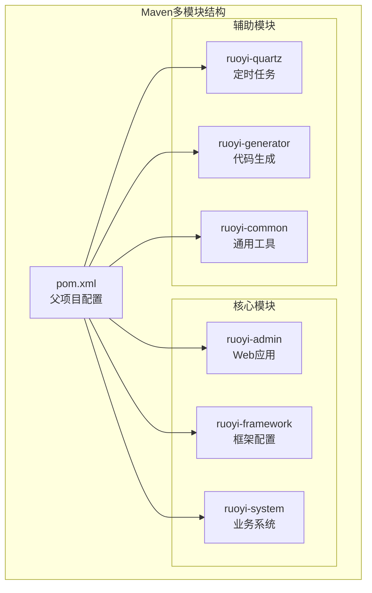
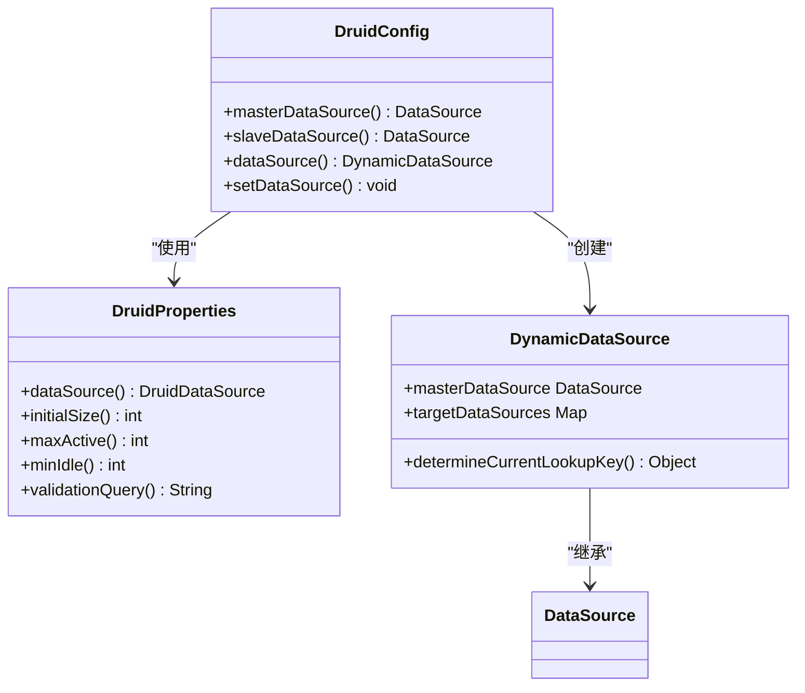
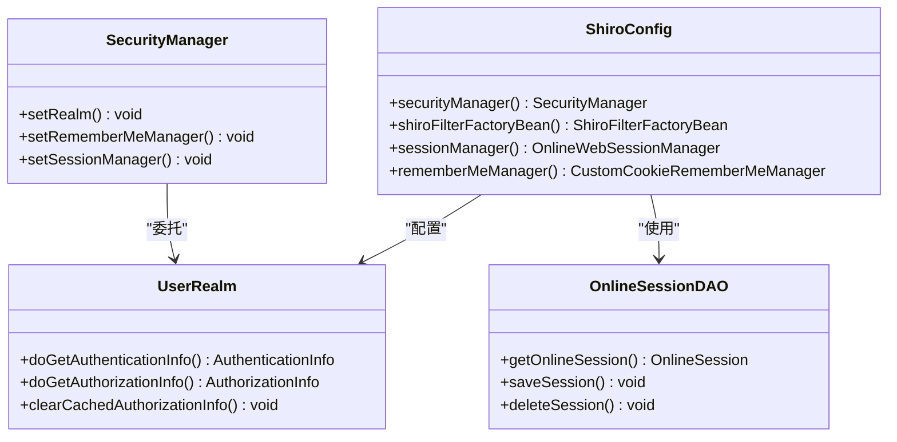
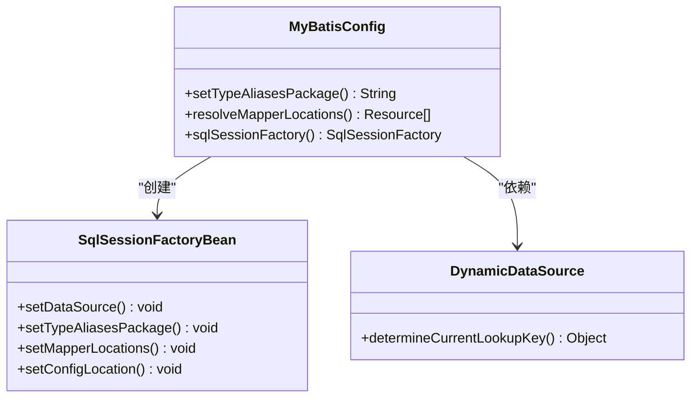
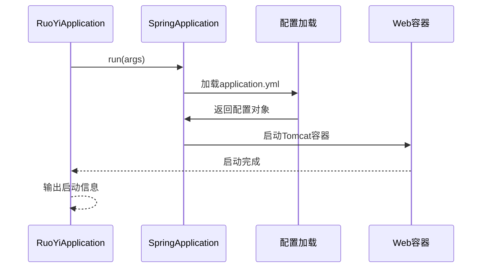
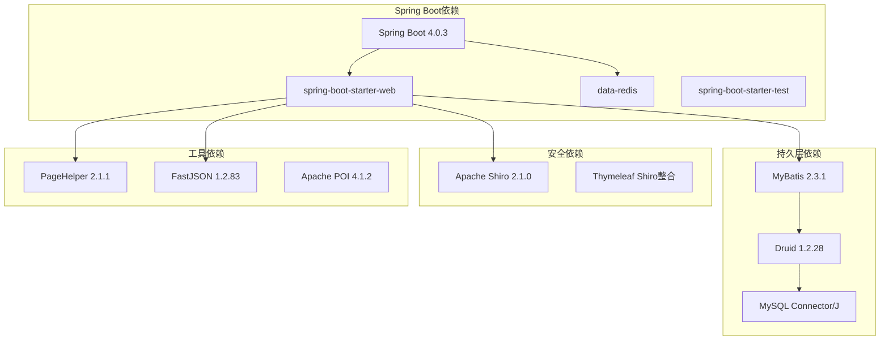

# 开发环境搭建

<cite>
**本文引用的文件**
- [pom.xml](file://GenShin/RuoYi-master/pom.xml)
- [application.yml](file://GenShin/RuoYi-master/ruoyi-admin/src/main/resources/application.yml)
- [application-druid.yml](file://GenShin/RuoYi-master/ruoyi-admin/src/main/resources/application-druid.yml)
- [DruidConfig.java](file://GenShin/RuoYi-master/ruoyi-framework/src/main/java/com/ruoyi/framework/config/DruidConfig.java)
- [ShiroConfig.java](file://GenShin/RuoYi-master/ruoyi-framework/src/main/java/com/ruoyi/framework/config/ShiroConfig.java)
- [MyBatisConfig.java](file://GenShin/RuoYi-master/ruoyi-framework/src/main/java/com/ruoyi/framework/config/MyBatisConfig.java)
- [RuoYiApplication.java](file://GenShin/RuoYi-master/ruoyi-admin/src/main/java/com/ruoyi/RuoYiApplication.java)
- [GENSHIN_MODULE_GUIDE.md](file://GenShin/RuoYi-master/GENSHIN_MODULE_GUIDE.md)
- [README.md](file://GenShin/RuoYi-master/README.md)
- [genshin_all.sql](file://GenShin/RuoYi-master/sql/genshin_all.sql)
- [run.bat](file://GenShin/RuoYi-master/bin/run.bat)
</cite>

## 目录
1. [简介](#简介)
2. [项目结构](#项目结构)
3. [核心组件](#核心组件)
4. [架构概览](#架构概览)
5. [详细组件分析](#详细组件分析)
6. [依赖分析](#依赖分析)
7. [性能考虑](#性能考虑)
8. [故障排除指南](#故障排除指南)
9. [结论](#结论)
10. [附录](#附录)

## 简介
本指南面向原神攻略系统的开发者，提供完整的开发环境搭建方案。该系统基于若依（RuoYi）框架，采用Spring Boot + MyBatis + Apache Shiro技术栈，支持多模块架构和动态数据源配置。系统包含角色管理、元素系统、敌人管理、圣遗物推荐、队伍推荐、武器推荐等功能模块。

## 项目结构
该项目采用多模块Maven结构，主要包含以下核心模块：
- ruoyi-admin：Web应用模块，包含控制器、前端模板等
- ruoyi-framework：框架核心配置模块，包含数据源、安全、MyBatis等配置
- ruoyi-system：业务系统模块，包含具体的业务实体和数据访问层
- ruoyi-quartz：定时任务模块
- ruoyi-generator：代码生成模块
- ruoyi-common：通用工具模块



**图表来源**
- [pom.xml:208-215](file://GenShin/RuoYi-master/pom.xml#L208-L215)

**章节来源**
- [pom.xml:1-264](file://GenShin/RuoYi-master/pom.xml#L1-L264)
- [README.md:24-33](file://GenShin/RuoYi-master/README.md#L24-L33)

## 核心组件
系统的核心技术栈和版本要求如下：

### JDK版本要求
- **推荐版本**：JDK 8 或 JDK 17
- **当前配置**：JDK 17（Spring Boot 4.x）
- **兼容性说明**：Spring Boot 4.x 需要JDK 17+，Spring Boot 3.x 需要JDK 17+，Spring Boot 2.x 支持JDK 8+

### 核心框架版本
- **Spring Boot**：4.0.3（基于Spring Framework 6.x）
- **MyBatis**：2.3.1（MyBatis-Spring-Boot-Starter）
- **Apache Shiro**：2.1.0（Jakarta EE兼容版本）
- **Druid**：1.2.28（数据库连接池）
- **PageHelper**：2.1.1（分页插件）

### 开发工具配置
- **IDE**：IntelliJ IDEA 或 Eclipse
- **Maven**：3.6+
- **数据库**：MySQL 8.0+
- **前端**：基于Hplus主题的静态资源

**章节来源**
- [pom.xml:14-34](file://GenShin/RuoYi-master/pom.xml#L14-L34)
- [README.md:26-32](file://GenShin/RuoYi-master/README.md#L26-L32)

## 架构概览
系统采用经典的三层架构模式，结合Spring Boot的自动配置特性：

```mermaid
graph TB
subgraph "表现层"
CONTROLLER[Web控制器<br/>@RestController]
FRONTEND[前端模板<br/>Thymeleaf]
end
subgraph "业务层"
SERVICE[业务服务层<br/>@Service]
INTERCEPTOR[拦截器<br/>@Component]
end
subgraph "数据访问层"
MAPPER[数据访问层<br/>@Mapper]
DAO[数据访问对象<br/>MyBatis]
end
subgraph "基础设施"
SHIRO[安全框架<br/>Apache Shiro]
DRUID[连接池<br/>Alibaba Druid]
MYSQL[数据库<br/>MySQL 8.0]
end
CONTROLLER --> SERVICE
SERVICE --> MAPPER
MAPPER --> DAO
DAO --> DRUID
DRUID --> MYSQL
SHIRO -.-> CONTROLLER
FRONTEND -.-> CONTROLLER
```

**图表来源**
- [ShiroConfig.java:296-346](file://GenShin/RuoYi-master/ruoyi-framework/src/main/java/com/ruoyi/framework/config/ShiroConfig.java#L296-L346)
- [DruidConfig.java:32-60](file://GenShin/RuoYi-master/ruoyi-framework/src/main/java/com/ruoyi/framework/config/DruidConfig.java#L32-L60)

## 详细组件分析

### 数据库配置组件
系统采用Druid连接池和动态数据源配置：



**图表来源**
- [DruidConfig.java:32-80](file://GenShin/RuoYi-master/ruoyi-framework/src/main/java/com/ruoyi/framework/config/DruidConfig.java#L32-L80)

### 安全认证组件
系统集成Apache Shiro进行权限控制：



**图表来源**
- [ShiroConfig.java:257-270](file://GenShin/RuoYi-master/ruoyi-framework/src/main/java/com/ruoyi/framework/config/ShiroConfig.java#L257-L270)

### MyBatis配置组件
系统通过MyBatis配置实现ORM映射：



**图表来源**
- [MyBatisConfig.java:116-131](file://GenShin/RuoYi-master/ruoyi-framework/src/main/java/com/ruoyi/framework/config/MyBatisConfig.java#L116-L131)

### 应用启动组件
主应用类负责系统启动：



**图表来源**
- [RuoYiApplication.java:12-28](file://GenShin/RuoYi-master/ruoyi-admin/src/main/java/com/ruoyi/RuoYiApplication.java#L12-L28)

**章节来源**
- [DruidConfig.java:1-129](file://GenShin/RuoYi-master/ruoyi-framework/src/main/java/com/ruoyi/framework/config/DruidConfig.java#L1-L129)
- [ShiroConfig.java:1-449](file://GenShin/RuoYi-master/ruoyi-framework/src/main/java/com/ruoyi/framework/config/ShiroConfig.java#L1-L449)
- [MyBatisConfig.java:1-132](file://GenShin/RuoYi-master/ruoyi-framework/src/main/java/com/ruoyi/framework/config/MyBatisConfig.java#L1-L132)
- [RuoYiApplication.java:1-29](file://GenShin/RuoYi-master/ruoyi-admin/src/main/java/com/ruoyi/RuoYiApplication.java#L1-L29)

## 依赖分析
系统依赖关系采用Maven依赖管理，核心依赖如下：



**图表来源**
- [pom.xml:37-206](file://GenShin/RuoYi-master/pom.xml#L37-L206)

**章节来源**
- [pom.xml:37-206](file://GenShin/RuoYi-master/pom.xml#L37-L206)

## 性能考虑
系统在配置层面已经考虑了性能优化：

### 数据库连接池配置
- **初始连接数**：5
- **最大连接数**：20
- **最小空闲连接**：10
- **连接超时时间**：30000ms
- **慢SQL监控**：启用，阈值1000ms

### 应用服务器配置
- **最大线程数**：800
- **最小空闲线程**：100
- **接受队列长度**：1000
- **Tomcat URI编码**：UTF-8

### JVM内存配置
- **初始堆内存**：256m
- **最大堆内存**：1024m
- **元空间**：512m

**章节来源**
- [application-druid.yml:19-61](file://GenShin/RuoYi-master/ruoyi-admin/src/main/resources/application-druid.yml#L19-L61)
- [application.yml:17-33](file://GenShin/RuoYi-master/ruoyi-admin/src/main/resources/application.yml#L17-L33)
- [run.bat:9-11](file://GenShin/RuoYi-master/bin/run.bat#L9-L11)

## 故障排除指南

### 数据库连接问题
**问题症状**：启动时报数据库连接失败
**解决步骤**：
1. 检查MySQL服务是否启动
2. 验证数据库连接参数
3. 确认数据库存在且可访问
4. 检查Druid连接池配置

**章节来源**
- [application-druid.yml:8-11](file://GenShin/RuoYi-master/ruoyi-admin/src/main/resources/application-druid.yml#L8-L11)

### 权限认证问题
**问题症状**：登录失败或权限不足
**解决步骤**：
1. 检查Shiro配置文件
2. 验证用户角色权限
3. 确认RememberMe配置
4. 检查Session管理配置

**章节来源**
- [ShiroConfig.java:55-117](file://GenShin/RuoYi-master/ruoyi-framework/src/main/java/com/ruoyi/framework/config/ShiroConfig.java#L55-L117)

### MyBatis映射问题
**问题症状**：查询失败或映射异常
**解决步骤**：
1. 检查Mapper XML文件路径
2. 验证实体类包扫描配置
3. 确认数据库表结构
4. 检查SQL语句语法

**章节来源**
- [MyBatisConfig.java:116-131](file://GenShin/RuoYi-master/ruoyi-framework/src/main/java/com/ruoyi/framework/config/MyBatisConfig.java#L116-L131)

### 端口冲突问题
**问题症状**：应用启动失败，提示端口占用
**解决步骤**：
1. 修改application.yml中的server.port
2. 检查系统端口占用情况
3. 使用netstat命令排查
4. 更换其他可用端口

**章节来源**
- [application.yml:17-19](file://GenShin/RuoYi-master/ruoyi-admin/src/main/resources/application.yml#L17-L19)

## 结论
原神攻略系统基于成熟的若依框架，提供了完整的开发环境配置方案。系统采用现代化的技术栈，具备良好的扩展性和维护性。通过合理的配置管理和依赖控制，开发者可以快速搭建起稳定可靠的开发环境。

## 附录

### 开发工具推荐
- **IDE**：IntelliJ IDEA Ultimate版（推荐）或 Eclipse
- **数据库工具**：Navicat Premium 或 MySQL Workbench
- **API测试**：Postman
- **版本控制**：Git
- **文档工具**：Swagger UI

### 环境变量配置
- **JAVA_HOME**：JDK安装路径
- **MAVEN_HOME**：Maven安装路径
- **PATH**：包含%JAVA_HOME%/bin和%MAVEN_HOME%/bin

### 常用命令
- **启动应用**：`mvn spring-boot:run`
- **打包应用**：`mvn clean package`
- **运行JAR**：`java -jar ruoyi-admin/target/ruoyi-admin.jar`

**章节来源**
- [GENSHIN_MODULE_GUIDE.md:111-132](file://GenShin/RuoYi-master/GENSHIN_MODULE_GUIDE.md#L111-L132)