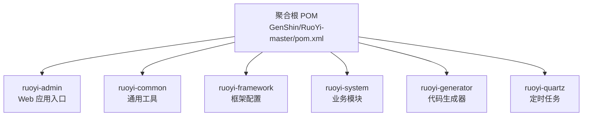
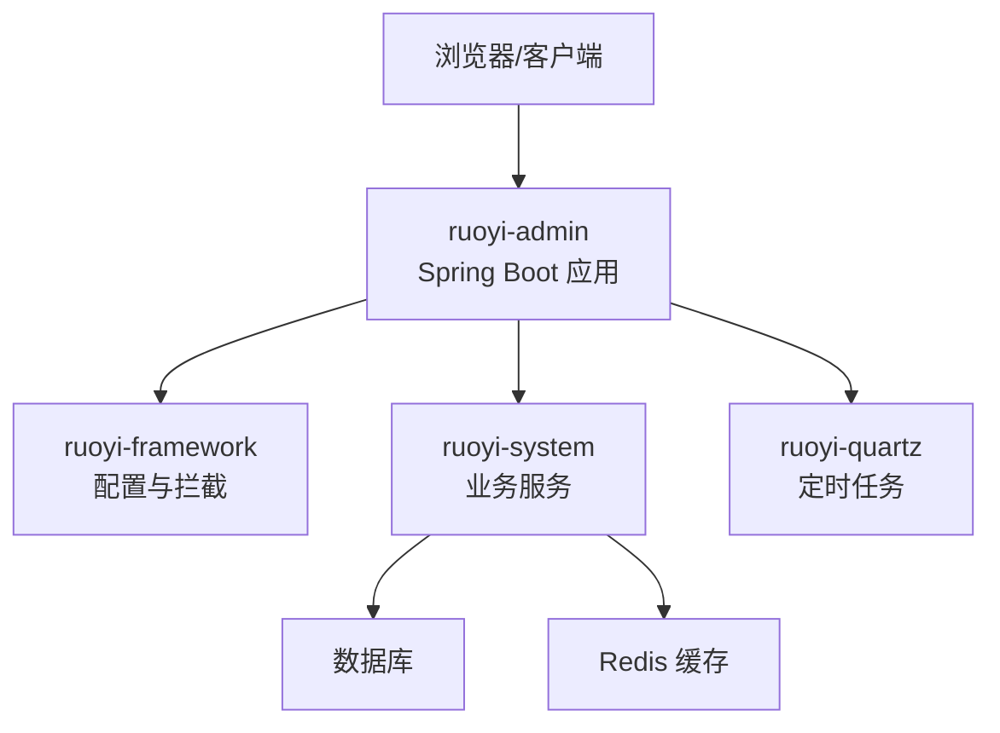
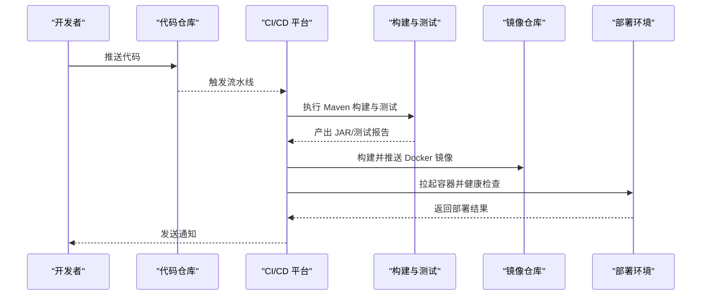
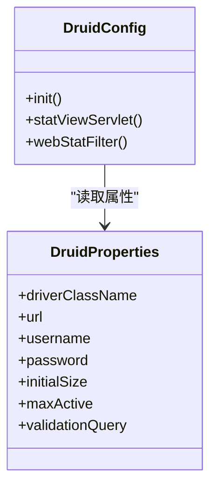
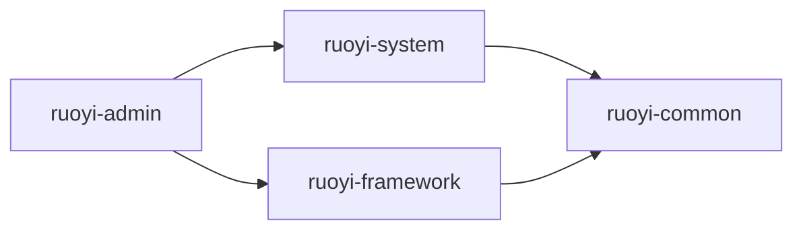

# 构建与部署

<cite>
**本文引用的文件**
- [pom.xml](file://GenShin/RuoYi-master/pom.xml)
- [ruoyi-admin/pom.xml](file://GenShin/RuoYi-master/ruoyi-admin/pom.xml)
- [application.yml](file://GenShin/RuoYi-master/ruoyi-admin/src/main/resources/application.yml)
- [application-druid.yml](file://GenShin/RuoYi-master/ruoyi-admin/src/main/resources/application-druid.yml)
- [RuoYiApplication.java](file://GenShin/RuoYi-master/ruoyi-admin/src/main/java/com/ruoyi/web/RuoYiApplication.java)
- [RuoYiServletInitializer.java](file://GenShin/RuoYi-master/ruoyi-admin/src/main/java/com/ruoyi/web/RuoYiServletInitializer.java)
- [DruidConfig.java](file://GenShin/RuoYi-master/ruoyi-framework/src/main/java/com/ruoyi/framework/config/DruidConfig.java)
- [DruidProperties.java](file://GenShin/RuoYi-master/ruoyi-framework/src/main/java/com/ruoyi/framework/config/properties/DruidProperties.java)
- [ry.sh](file://GenShin/RuoYi-master/ry.sh)
- [ry.bat](file://GenShin/RuoYi-master/ry.bat)
- [Dockerfile（示例）](file://GenShin/RuoYi-master/Dockerfile)
- [ci-cd.yml（示例）](file://GenShin/RuoYi-master/.github/workflows/ci-cd.yml)
</cite>

## 目录
1. [简介](#简介)
2. [项目结构](#项目结构)
3. [核心组件](#核心组件)
4. [架构总览](#架构总览)
5. [详细组件分析](#详细组件分析)
6. [依赖分析](#依赖分析)
7. [性能考虑](#性能考虑)
8. [故障排查指南](#故障排查指南)
9. [结论](#结论)
10. [附录](#附录)

## 简介
本指南面向“原神攻略系统”的构建与部署，基于 Maven 多模块工程，覆盖 Maven 生命周期阶段、打包产物与配置处理、多环境部署策略、Docker 容器化与 CI/CD 流水线配置、性能优化建议以及部署后验证与监控要点。内容以仓库现有文件为依据，避免臆测，确保可操作性。

## 项目结构
该系统采用 Maven 多模块结构，核心模块包括：
- 聚合根 POM：统一管理版本与插件
- ruoyi-admin：Web 应用入口模块，包含启动类与资源配置
- ruoyi-common：通用工具与常量
- ruoyi-framework：框架配置与拦截器、安全、数据源切换等
- ruoyi-system：业务模块（含原神角色、武器、推荐阵容等）
- ruoyi-generator：代码生成器
- ruoyi-quartz：定时任务模块

**图表来源**
- [pom.xml](file://GenShin/RuoYi-master/pom.xml)
- [ruoyi-admin/pom.xml](file://GenShin/RuoYi-master/ruoyi-admin/pom.xml)

**章节来源**
- [pom.xml](file://GenShin/RuoYi-master/pom.xml)
- [ruoyi-admin/pom.xml](file://GenShin/RuoYi-master/ruoyi-admin/pom.xml)

## 核心组件
- 启动类与应用入口
  - Web 应用入口类负责引导 Spring Boot 应用启动，通常位于 ruoyi-admin 模块中。
  - 参考路径：[RuoYiApplication.java](file://GenShin/RuoYi-master/ruoyi-admin/src/main/java/com/ruoyi/web/RuoYiApplication.java)
- 配置文件
  - 主配置：ruoyi-admin/src/main/resources/application.yml
  - 数据源与连接池配置：ruoyi-admin/src/main/resources/application-druid.yml
  - 日志与 Banner：ruoyi-admin/src/main/resources/logback.xml、banner.txt
- 框架配置
  - Druid 连接池配置：ruoyi-framework/src/main/java/com/ruoyi/framework/config/DruidConfig.java
  - Druid 属性配置：ruoyi-framework/src/main/java/com/ruoyi/framework/config/properties/DruidProperties.java
- 启动脚本
  - Linux/macOS：ry.sh
  - Windows：ry.bat

**章节来源**
- [RuoYiApplication.java](file://GenShin/RuoYi-master/ruoyi-admin/src/main/java/com/ruoyi/web/RuoYiApplication.java)
- [application.yml](file://GenShin/RuoYi-master/ruoyi-admin/src/main/resources/application.yml)
- [application-druid.yml](file://GenShin/RuoYi-master/ruoyi-admin/src/main/resources/application-druid.yml)
- [DruidConfig.java](file://GenShin/RuoYi-master/ruoyi-framework/src/main/java/com/ruoyi/framework/config/DruidConfig.java)
- [DruidProperties.java](file://GenShin/RuoYi-master/ruoyi-framework/src/main/java/com/ruoyi/framework/config/properties/DruidProperties.java)
- [ry.sh](file://GenShin/RuoYi-master/ry.sh)
- [ry.bat](file://GenShin/RuoYi-master/ry.bat)

## 架构总览
系统采用前后端分离思路（前端模板位于 ruoyi-admin/resources/templates），后端通过 Spring Boot 提供 REST 接口；数据访问层基于 MyBatis，支持动态数据源与 Druid 连接池；定时任务模块提供异步调度能力。

**图表来源**
- [RuoYiApplication.java](file://GenShin/RuoYi-master/ruoyi-admin/src/main/java/com/ruoyi/web/RuoYiApplication.java)
- [DruidConfig.java](file://GenShin/RuoYi-master/ruoyi-framework/src/main/java/com/ruoyi/framework/config/DruidConfig.java)
- [application.yml](file://GenShin/RuoYi-master/ruoyi-admin/src/main/resources/application.yml)

## 详细组件分析

### Maven 构建生命周期与阶段说明
- clean
  - 清理目标目录，删除 target 子目录，避免旧编译产物影响。
  - 建议在全新构建前执行，确保一致性。
- compile
  - 编译主代码与资源文件，生成 classes 目标产物。
- test-compile/test
  - 编译并运行单元测试（如存在），失败会阻断后续阶段。
- package
  - 打包为可执行 JAR（fat jar），包含依赖与配置，便于部署。
  - 若需生成 WAR 包，请在对应模块的 Maven 插件配置中启用打包类型并调整启动类。
- install/deploy
  - 将构件安装到本地仓库或远程仓库（如配置了私服）。

提示
- 多模块工程建议在聚合根 POM 执行生命周期，以保证模块顺序与依赖一致。
- 如需跳过测试，可在命令行添加相应参数。

**章节来源**
- [pom.xml](file://GenShin/RuoYi-master/pom.xml)
- [ruoyi-admin/pom.xml](file://GenShin/RuoYi-master/ruoyi-admin/pom.xml)

### 打包方式与可执行 JAR 生成
- 可执行 JAR
  - 通过 Spring Boot Maven 插件生成，包含启动类与所有依赖，适合容器化与单机部署。
  - 启动类参考：[RuoYiApplication.java](file://GenShin/RuoYi-master/ruoyi-admin/src/main/java/com/ruoyi/web/RuoYiApplication.java)
  - WAR 包支持（如需）：在模块 POM 中设置 packaging 为 war，并配置嵌入式 servlet 容器排除。
- 配置文件处理
  - 主配置 application.yml 与 Druid 配置 application-druid.yml 会随 JAR 打包进入 resources。
  - 多环境配置可通过 Spring Profile 切换，或通过外部化配置（如挂载卷、环境变量）覆盖。

**章节来源**
- [RuoYiApplication.java](file://GenShin/RuoYi-master/ruoyi-admin/src/main/java/com/ruoyi/web/RuoYiApplication.java)
- [application.yml](file://GenShin/RuoYi-master/ruoyi-admin/src/main/resources/application.yml)
- [application-druid.yml](file://GenShin/RuoYi-master/ruoyi-admin/src/main/resources/application-druid.yml)

### 不同环境的部署方案
- 开发环境
  - 使用 application.yml 的默认配置，本地数据库与 Redis。
  - 启动脚本：Linux/macOS 使用 [ry.sh](file://GenShin/RuoYi-master/ry.sh)，Windows 使用 [ry.bat](file://GenShin/RuoYi-master/ry.bat)。
- 测试环境
  - 通过 Spring Profile 或外部配置文件覆盖数据库连接、缓存地址、日志级别等。
  - 建议将 application.yml 与 application-druid.yml 放置于容器挂载目录，实现无侵入更新。
- 生产环境
  - 使用只读配置与最小权限数据库账号；开启连接池监控与慢查询日志。
  - 建议使用容器编排平台（如 Kubernetes）进行滚动更新与健康检查。

**章节来源**
- [application.yml](file://GenShin/RuoYi-master/ruoyi-admin/src/main/resources/application.yml)
- [application-druid.yml](file://GenShin/RuoYi-master/ruoyi-admin/src/main/resources/application-druid.yml)
- [ry.sh](file://GenShin/RuoYi-master/ry.sh)
- [ry.bat](file://GenShin/RuoYi-master/ry.bat)

### Docker 容器化部署
- Dockerfile 示例
  - 基于官方 JDK 镜像，复制可执行 JAR 与必要配置，暴露端口，设置启动命令与健康检查。
  - 参考文件：[Dockerfile（示例）](file://GenShin/RuoYi-master/Dockerfile)
- 镜像构建与运行
  - 构建：docker build -t genshin-strategy-app .
  - 运行：docker run -d -p 8080:8080 --name app -v /host/config:/app/config genshin-strategy-app
  - 建议将 application.yml 与 application-druid.yml 通过挂载卷注入容器，便于多环境切换。
- 多阶段构建（可选）
  - 使用多阶段构建减少镜像体积，先在构建阶段生成 JAR，再拷贝至运行时基础镜像。

**章节来源**
- [Dockerfile（示例）](file://GenShin/RuoYi-master/Dockerfile)
- [application.yml](file://GenShin/RuoYi-master/ruoyi-admin/src/main/resources/application.yml)
- [application-druid.yml](file://GenShin/RuoYi-master/ruoyi-admin/src/main/resources/application-druid.yml)

### CI/CD 流水线配置
- 自动化构建与测试
  - 触发条件：push 到分支或标签；PR 合并。
  - 步骤：安装 JDK 与 Maven；执行 mvn clean test（或 clean package）；上传测试报告与制品。
- 部署
  - 成功后构建 Docker 镜像并推送到镜像仓库；在目标环境拉起容器并执行健康检查。
- 示例工作流
  - 参考文件：[ci-cd.yml（示例）](file://GenShin/RuoYi-master/.github/workflows/ci-cd.yml)

**图表来源**
- [ci-cd.yml（示例）](file://GenShin/RuoYi-master/.github/workflows/ci-cd.yml)

**章节来源**
- [ci-cd.yml（示例）](file://GenShin/RuoYi-master/.github/workflows/ci-cd.yml)

### 数据库连接池与配置
- Druid 连接池
  - 配置类：[DruidConfig.java](file://GenShin/RuoYi-master/ruoyi-framework/src/main/java/com/ruoyi/framework/config/DruidConfig.java)
  - 属性类：[DruidProperties.java](file://GenShin/RuoYi-master/ruoyi-framework/src/main/java/com/ruoyi/framework/config/properties/DruidProperties.java)
  - 关键点：初始化大小、最大连接数、超时时间、监控页面与 SQL 防御。
- 多数据源与动态切换
  - 动态数据源实现位于 ruoyi-framework 模块，支持按需切换数据源。

**图表来源**
- [DruidConfig.java](file://GenShin/RuoYi-master/ruoyi-framework/src/main/java/com/ruoyi/framework/config/DruidConfig.java)
- [DruidProperties.java](file://GenShin/RuoYi-master/ruoyi-framework/src/main/java/com/ruoyi/framework/config/properties/DruidProperties.java)

**章节来源**
- [DruidConfig.java](file://GenShin/RuoYi-master/ruoyi-framework/src/main/java/com/ruoyi/framework/config/DruidConfig.java)
- [DruidProperties.java](file://GenShin/RuoYi-master/ruoyi-framework/src/main/java/com/ruoyi/framework/config/properties/DruidProperties.java)

### 启动与部署脚本
- Linux/macOS：ry.sh
  - 用于启动/停止应用，可扩展为热部署、日志查看等功能。
- Windows：ry.bat
  - 等价功能的批处理脚本。

**章节来源**
- [ry.sh](file://GenShin/RuoYi-master/ry.sh)
- [ry.bat](file://GenShin/RuoYi-master/ry.bat)

## 依赖分析
- 模块耦合
  - ruoyi-admin 依赖 ruoyi-framework 与 ruoyi-system；ruoyi-system 依赖 ruoyi-common。
  - ruoyi-framework 提供配置与基础设施，降低业务模块耦合度。
- 外部依赖
  - Spring Boot、MyBatis、Druid、Shiro、Quartz 等，版本由聚合根 POM 统一管理。

**图表来源**
- [pom.xml](file://GenShin/RuoYi-master/pom.xml)
- [ruoyi-admin/pom.xml](file://GenShin/RuoYi-master/ruoyi-admin/pom.xml)

**章节来源**
- [pom.xml](file://GenShin/RuoYi-master/pom.xml)
- [ruoyi-admin/pom.xml](file://GenShin/RuoYi-master/ruoyi-admin/pom.xml)

## 性能考虑
- JVM 参数调优
  - 堆大小：根据容器内存限制设置初始与最大堆；开启 G1GC 与合适的元空间大小。
  - GC 日志：开启 GC 日志以便分析停顿与回收行为。
  - 元数据：合理设置 MetaspaceSize，避免类加载过多导致溢出。
- 数据库连接池
  - 初始化大小与最大连接数：结合并发请求与数据库承载能力设定。
  - 超时与重试：合理设置连接超时与 SQL 查询超时，避免线程池耗尽。
  - 监控：开启 Druid 监控页面与慢查询日志。
- 静态资源优化
  - 前端模板与静态文件位于 ruoyi-admin/resources/static 与 templates，建议在网关或 CDN 上缓存与压缩。
- 缓存策略
  - Redis 缓存热点数据，设置合理的过期时间与淘汰策略。
- 异步与限流
  - 对高并发接口使用异步处理与限流（令牌桶/漏桶），避免雪崩。

[本节为通用指导，不直接分析具体文件]

## 故障排查指南
- 启动失败
  - 检查 application.yml 与 application-druid.yml 是否正确挂载；确认数据库连通性与账号权限。
  - 查看容器日志与 Spring Boot 启动异常信息。
- 数据库连接问题
  - 核对 Druid 连接池配置与数据库驱动版本；检查防火墙与网络策略。
- 性能问题
  - 通过 Druid 监控页面观察连接池状态与慢查询；结合 GC 日志分析内存与回收情况。
- 容器健康检查
  - 在 Dockerfile 中配置健康检查探针，确保容器编排平台能自动重启异常实例。

**章节来源**
- [application.yml](file://GenShin/RuoYi-master/ruoyi-admin/src/main/resources/application.yml)
- [application-druid.yml](file://GenShin/RuoYi-master/ruoyi-admin/src/main/resources/application-druid.yml)
- [DruidConfig.java](file://GenShin/RuoYi-master/ruoyi-framework/src/main/java/com/ruoyi/framework/config/DruidConfig.java)

## 结论
本指南基于仓库现有文件，给出了从 Maven 构建到容器化与 CI/CD 的完整落地路径，并提供了性能优化与故障排查建议。实际部署时请结合团队规范与环境约束进行细化与加固。

## 附录
- 快速启动
  - 在 ruoyi-admin 模块执行 Maven 构建，生成可执行 JAR；使用 ry.sh/ry.bat 启动或通过 Docker 运行。
- 配置覆盖
  - 通过 Spring Profile 或外部挂载配置文件实现多环境差异化。
- 监控与可观测性
  - 结合 Druid 监控、应用日志与容器指标，建立统一告警与追踪体系。

[本节为总结性内容，不直接分析具体文件]