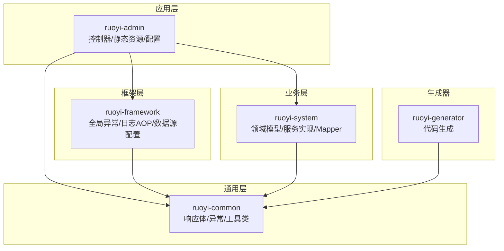
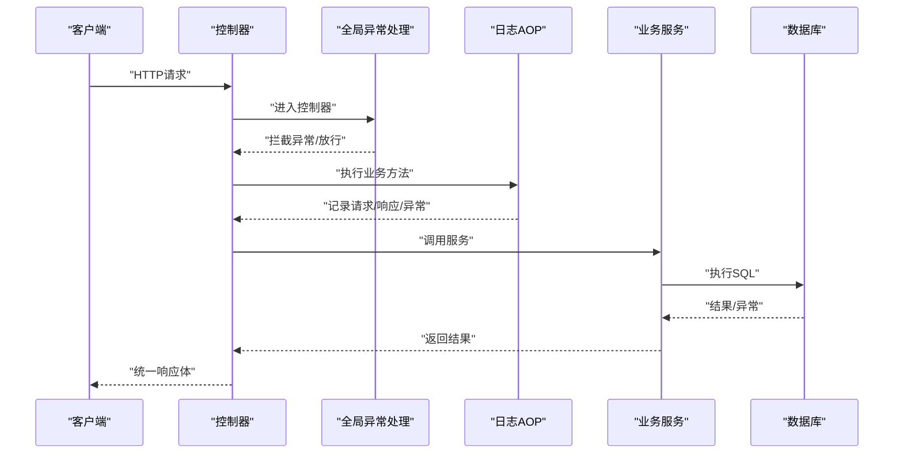
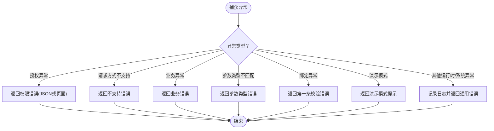
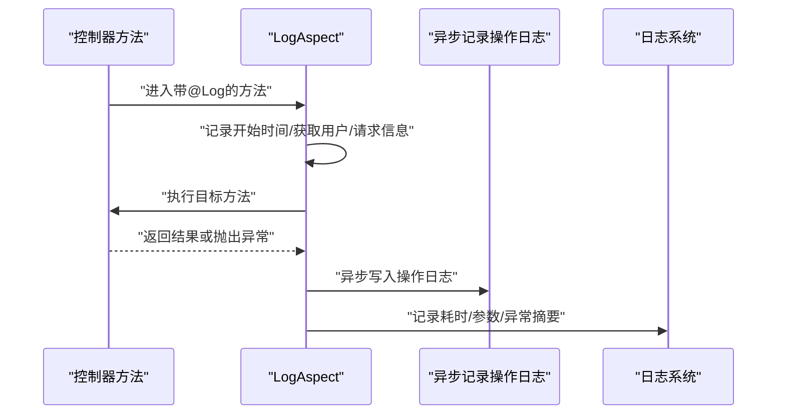
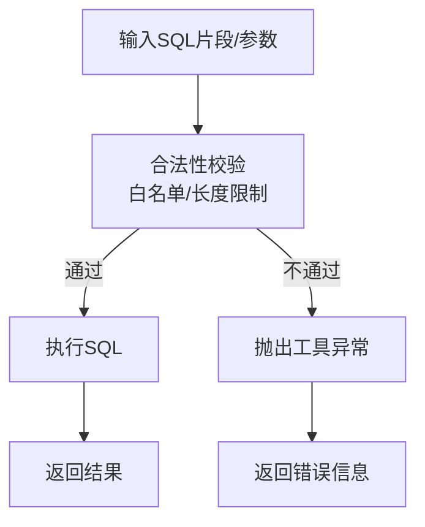
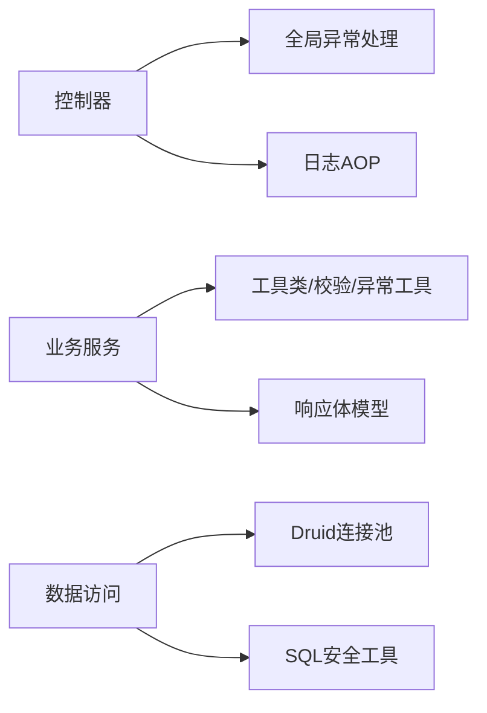

# 调试技巧与测试

<cite>
**本文引用的文件**
- [AjaxResult.java](file://ruoyi-common/src/main/java/com/ruoyi/common/core/domain/AjaxResult.java)
- [R.java](file://ruoyi-common/src/main/java/com/ruoyi/common/core/domain/R.java)
- [GlobalExceptionHandler.java](file://ruoyi-framework/src/main/java/com/ruoyi/framework/web/exception/GlobalExceptionHandler.java)
- [GlobalException.java](file://ruoyi-common/src/main/java/com/ruoyi/common/exception/GlobalException.java)
- [ServiceException.java](file://ruoyi-common/src/main/java/com/ruoyi/common/exception/ServiceException.java)
- [ExceptionUtil.java](file://ruoyi-common/src/main/java/com/ruoyi/common/utils/ExceptionUtil.java)
- [LogAspect.java](file://ruoyi-framework/src/main/java/com/ruoyi/framework/aspectj/LogAspect.java)
- [LogUtils.java](file://ruoyi-common/src/main/java/com/ruoyi/common/utils/LogUtils.java)
- [application.yml](file://ruoyi-admin/src/main/resources/application.yml)
- [logback.xml](file://ruoyi-admin/src/main/resources/logback.xml)
- [DruidConfig.java](file://ruoyi-framework/src/main/java/com/ruoyi/framework/config/DruidConfig.java)
- [application-druid.yml](file://ruoyi-admin/src/main/resources/application-druid.yml)
- [SqlUtil.java](file://ruoyi-common/src/main/java/com/ruoyi/common/utils/sql/SqlUtil.java)
- [TestController.java](file://ruoyi-admin/src/main/java/com/ruoyi/web/controller/tool/TestController.java)
- [SysUserServiceImpl.java](file://ruoyi-system/src/main/java/com/ruoyi/system/service/impl/SysUserServiceImpl.java)
- [BeanValidators.java](file://ruoyi-common/src/main/java/com/ruoyi/common/utils/bean/BeanValidators.java)
- [Threads.java](file://ruoyi-common/src/main/java/com/ruoyi/common/utils/Threads.java)
</cite>

## 目录
1. [简介](#简介)
2. [项目结构](#项目结构)
3. [核心组件](#核心组件)
4. [架构总览](#架构总览)
5. [详细组件分析](#详细组件分析)
6. [依赖关系分析](#依赖关系分析)
7. [性能考量](#性能考量)
8. [故障排查指南](#故障排查指南)
9. [结论](#结论)
10. [附录](#附录)

## 简介
本指南面向原神攻略系统的开发与测试团队，聚焦于开发过程中的调试方法（IDE断点调试、日志调试、SQL调试）、全局异常处理机制（异常分类、错误信息格式化、用户友好提示）、单元与集成测试实践（JUnit、Mock、接口与数据库测试、性能测试）、测试覆盖率要求与提升策略、常见问题定位（内存泄漏、并发问题、数据库死锁）以及测试工具使用（Postman、JMeter、JProfiler）与测试数据管理策略。文档以仓库现有代码为依据，结合可落地的流程与图示，帮助快速定位问题、稳定交付。

## 项目结构
系统采用多模块分层组织，前端模板与静态资源位于 admin 模块，通用能力（响应体、异常、工具类）位于 common 模块，Web 层（控制器、全局异常、AOP 日志）位于 framework 模块，业务模块（system）包含领域模型、Mapper、Service 及其实现，生成器模块（generator）提供代码生成能力。

**图表来源**
- [application.yml:1-154](file://ruoyi-admin/src/main/resources/application.yml#L1-L154)
- [logback.xml:1-96](file://ruoyi-admin/src/main/resources/logback.xml#L1-L96)
- [DruidConfig.java:1-98](file://ruoyi-framework/src/main/java/com/ruoyi/framework/config/DruidConfig.java#L1-L98)

**章节来源**
- [application.yml:1-154](file://ruoyi-admin/src/main/resources/application.yml#L1-L154)
- [logback.xml:1-96](file://ruoyi-admin/src/main/resources/logback.xml#L1-L96)

## 核心组件
- 统一响应体：AjaxResult 与 R 提供统一的返回结构，便于前端与接口测试消费。
- 全局异常处理：GlobalExceptionHandler 将各类异常转换为统一响应，保障用户体验与可观测性。
- 日志与审计：LogAspect 通过注解切面记录操作日志，LogUtils 输出访问与错误日志。
- 数据库与SQL安全：DruidConfig 提供连接池配置；SqlUtil 提供SQL注入防护与校验。
- 测试与验证：TestController 提供简单接口用于手工测试；BeanValidators 提供参数校验能力。

**章节来源**
- [AjaxResult.java:1-228](file://ruoyi-common/src/main/java/com/ruoyi/common/core/domain/AjaxResult.java#L1-L228)
- [R.java:1-115](file://ruoyi-common/src/main/java/com/ruoyi/common/core/domain/R.java#L1-L115)
- [GlobalExceptionHandler.java:1-149](file://ruoyi-framework/src/main/java/com/ruoyi/framework/web/exception/GlobalExceptionHandler.java#L1-L149)
- [LogAspect.java:1-266](file://ruoyi-framework/src/main/java/com/ruoyi/framework/aspectj/LogAspect.java#L1-L266)
- [LogUtils.java:77-135](file://ruoyi-common/src/main/java/com/ruoyi/common/utils/LogUtils.java#L77-L135)
- [DruidConfig.java:1-98](file://ruoyi-framework/src/main/java/com/ruoyi/framework/config/DruidConfig.java#L1-L98)
- [SqlUtil.java:1-50](file://ruoyi-common/src/main/java/com/ruoyi/common/utils/sql/SqlUtil.java#L1-L50)
- [TestController.java:1-135](file://ruoyi-admin/src/main/java/com/ruoyi/web/controller/tool/TestController.java#L1-L135)
- [BeanValidators.java:1-24](file://ruoyi-common/src/main/java/com/ruoyi/common/utils/bean/BeanValidators.java#L1-L24)

## 架构总览
系统请求流经控制器，进入全局异常处理与AOP日志切面，随后调用业务服务，最终访问数据库。异常与日志贯穿全链路，确保问题可追踪。

**图表来源**
- [GlobalExceptionHandler.java:28-149](file://ruoyi-framework/src/main/java/com/ruoyi/framework/web/exception/GlobalExceptionHandler.java#L28-L149)
- [LogAspect.java:56-137](file://ruoyi-framework/src/main/java/com/ruoyi/framework/aspectj/LogAspect.java#L56-L137)
- [AjaxResult.java:12-228](file://ruoyi-common/src/main/java/com/ruoyi/common/core/domain/AjaxResult.java#L12-L228)

## 详细组件分析

### 组件A：全局异常处理机制
- 异常分类与处理：
  - 权限校验失败：返回统一错误结构，AJAX与非AJAX分别走JSON或页面重定向。
  - 请求方式不支持、参数类型不匹配、绑定异常、演示模式等均有专门分支。
  - 业务异常 ServiceException：由业务层抛出，统一包装为用户可读提示。
  - 未知运行时异常与系统异常：记录日志并返回通用错误信息。
- 错误信息格式化：
  - 使用 AjaxResult/R 统一返回结构，包含状态码、消息与可选数据。
  - 异常详情可通过 ExceptionUtil 获取根因与堆栈信息，便于审计与定位。
- 用户友好提示设计：
  - 优先返回简洁明确的消息；对于参数类型不匹配等场景，给出具体期望类型与实际值，辅助前端修复。

**图表来源**
- [GlobalExceptionHandler.java:36-149](file://ruoyi-framework/src/main/java/com/ruoyi/framework/web/exception/GlobalExceptionHandler.java#L36-L149)
- [ServiceException.java:8-58](file://ruoyi-common/src/main/java/com/ruoyi/common/exception/ServiceException.java#L8-L58)
- [AjaxResult.java:12-228](file://ruoyi-common/src/main/java/com/ruoyi/common/core/domain/AjaxResult.java#L12-L228)

**章节来源**
- [GlobalExceptionHandler.java:1-149](file://ruoyi-framework/src/main/java/com/ruoyi/framework/web/exception/GlobalExceptionHandler.java#L1-L149)
- [ServiceException.java:1-58](file://ruoyi-common/src/main/java/com/ruoyi/common/exception/ServiceException.java#L1-L58)
- [AjaxResult.java:1-228](file://ruoyi-common/src/main/java/com/ruoyi/common/core/domain/AjaxResult.java#L1-L228)
- [R.java:1-115](file://ruoyi-common/src/main/java/com/ruoyi/common/core/domain/R.java#L1-L115)

### 组件B：日志与审计（AOP + 访问日志）
- AOP日志：
  - 通过注解 @Log 标记的方法自动记录操作人、IP、URL、请求方式、耗时、请求参数、响应结果与异常信息。
  - 敏感字段（如密码）会被过滤，避免泄露。
- 访问与错误日志：
  - LogUtils 收集请求URI、异常链、Referer、参数等，输出到 ERROR_LOG。
  - logback.xml 配置了控制台、滚动文件与按级别过滤，便于生产与开发环境差异化输出。

**图表来源**
- [LogAspect.java:56-137](file://ruoyi-framework/src/main/java/com/ruoyi/framework/aspectj/LogAspect.java#L56-L137)
- [LogUtils.java:77-135](file://ruoyi-common/src/main/java/com/ruoyi/common/utils/LogUtils.java#L77-L135)
- [logback.xml:1-96](file://ruoyi-admin/src/main/resources/logback.xml#L1-L96)

**章节来源**
- [LogAspect.java:1-266](file://ruoyi-framework/src/main/java/com/ruoyi/framework/aspectj/LogAspect.java#L1-L266)
- [LogUtils.java:77-135](file://ruoyi-common/src/main/java/com/ruoyi/common/utils/LogUtils.java#L77-L135)
- [logback.xml:1-96](file://ruoyi-admin/src/main/resources/logback.xml#L1-L96)

### 组件C：数据库与SQL安全
- 连接池配置：
  - DruidConfig 与 application-druid.yml 提供主从数据源、连接池参数、健康检测与移除广告等配置。
- SQL安全：
  - SqlUtil 对 orderBy 子句进行白名单校验与长度限制，防止注入与滥用。
  - BeanValidators 提供参数校验，减少非法参数进入SQL层。

**图表来源**
- [SqlUtil.java:1-50](file://ruoyi-common/src/main/java/com/ruoyi/common/utils/sql/SqlUtil.java#L1-L50)
- [DruidConfig.java:1-98](file://ruoyi-framework/src/main/java/com/ruoyi/framework/config/DruidConfig.java#L1-L98)
- [application-druid.yml:1-34](file://ruoyi-admin/src/main/resources/application-druid.yml#L1-L34)

**章节来源**
- [DruidConfig.java:1-98](file://ruoyi-framework/src/main/java/com/ruoyi/framework/config/DruidConfig.java#L1-L98)
- [application-druid.yml:1-34](file://ruoyi-admin/src/main/resources/application-druid.yml#L1-L34)
- [SqlUtil.java:1-50](file://ruoyi-common/src/main/java/com/ruoyi/common/utils/sql/SqlUtil.java#L1-L50)
- [BeanValidators.java:1-24](file://ruoyi-common/src/main/java/com/ruoyi/common/utils/bean/BeanValidators.java#L1-L24)

### 组件D：测试与验证入口
- TestController 提供基础增删改查接口，适合手工测试与接口自动化脚本验证。
- SysUserServiceImpl 展示了事务、校验、加密与异常处理的组合使用，是单元测试与集成测试的良好样本。

**章节来源**
- [TestController.java:1-135](file://ruoyi-admin/src/main/java/com/ruoyi/web/controller/tool/TestController.java#L1-L135)
- [SysUserServiceImpl.java:1-32](file://ruoyi-system/src/main/java/com/ruoyi/system/service/impl/SysUserServiceImpl.java#L1-L32)

## 依赖关系分析
- 控制器依赖框架层的全局异常处理与AOP日志，确保所有请求具备一致的可观测性与错误处理。
- 业务服务依赖通用层的工具类（校验、加密、异常工具）与响应体模型，保证跨模块一致性。
- 数据访问层依赖连接池配置与SQL安全工具，降低风险。

**图表来源**
- [GlobalExceptionHandler.java:28-149](file://ruoyi-framework/src/main/java/com/ruoyi/framework/web/exception/GlobalExceptionHandler.java#L28-L149)
- [LogAspect.java:56-137](file://ruoyi-framework/src/main/java/com/ruoyi/framework/aspectj/LogAspect.java#L56-L137)
- [AjaxResult.java:12-228](file://ruoyi-common/src/main/java/com/ruoyi/common/core/domain/AjaxResult.java#L12-L228)
- [R.java:1-115](file://ruoyi-common/src/main/java/com/ruoyi/common/core/domain/R.java#L1-L115)
- [DruidConfig.java:52-60](file://ruoyi-framework/src/main/java/com/ruoyi/framework/config/DruidConfig.java#L52-L60)
- [SqlUtil.java:1-50](file://ruoyi-common/src/main/java/com/ruoyi/common/utils/sql/SqlUtil.java#L1-L50)

**章节来源**
- [GlobalExceptionHandler.java:1-149](file://ruoyi-framework/src/main/java/com/ruoyi/framework/web/exception/GlobalExceptionHandler.java#L1-L149)
- [LogAspect.java:1-266](file://ruoyi-framework/src/main/java/com/ruoyi/framework/aspectj/LogAspect.java#L1-L266)
- [AjaxResult.java:1-228](file://ruoyi-common/src/main/java/com/ruoyi/common/core/domain/AjaxResult.java#L1-L228)
- [R.java:1-115](file://ruoyi-common/src/main/java/com/ruoyi/common/core/domain/R.java#L1-L115)
- [DruidConfig.java:1-98](file://ruoyi-framework/src/main/java/com/ruoyi/framework/config/DruidConfig.java#L1-L98)
- [SqlUtil.java:1-50](file://ruoyi-common/src/main/java/com/ruoyi/common/utils/sql/SqlUtil.java#L1-L50)

## 性能考量
- 连接池参数：initialSize、minIdle、maxActive、maxWait、connectTimeout、socketTimeout 等直接影响吞吐与延迟，需结合压测结果调整。
- AOP开销：日志切面会增加方法调用成本，建议在高并发场景下评估“保存请求/响应数据”的开关与参数长度限制。
- SQL优化：遵循 SqlUtil 的校验与限制，避免复杂排序与超长条件；必要时引入索引与分页。
- 并发与线程：Threads.printException 提供线程池异常打印，有助于发现异步任务中的隐藏问题。

**章节来源**
- [application-druid.yml:1-34](file://ruoyi-admin/src/main/resources/application-druid.yml#L1-L34)
- [DruidConfig.java:54-88](file://ruoyi-framework/src/main/java/com/ruoyi/framework/config/DruidConfig.java#L54-L88)
- [LogAspect.java:48-51](file://ruoyi-framework/src/main/java/com/ruoyi/framework/aspectj/LogAspect.java#L48-L51)
- [Threads.java:69-99](file://ruoyi-common/src/main/java/com/ruoyi/common/utils/Threads.java#L69-L99)

## 故障排查指南

### 调试方法
- IDE断点调试：在控制器、服务实现与异常处理处设置断点，观察请求上下文、参数与返回值。
- 日志调试：根据 application.yml 与 logback.xml 的日志级别，临时提升 com.ruoyi 与业务包的日志等级，配合 LogAspect 的操作日志定位问题。
- SQL调试：在业务层打印执行的SQL片段与参数，结合 SqlUtil 的校验信息判断是否触发安全拦截。

**章节来源**
- [application.yml:34-78](file://ruoyi-admin/src/main/resources/application.yml#L34-L78)
- [logback.xml:72-96](file://ruoyi-admin/src/main/resources/logback.xml#L72-L96)
- [LogAspect.java:146-165](file://ruoyi-framework/src/main/java/com/ruoyi/framework/aspectj/LogAspect.java#L146-L165)
- [SqlUtil.java:31-42](file://ruoyi-common/src/main/java/com/ruoyi/common/utils/sql/SqlUtil.java#L31-L42)

### 全局异常处理与错误信息
- 异常分类：授权失败、请求方式不支持、业务异常、参数类型不匹配、绑定异常、演示模式、未知运行时/系统异常。
- 错误格式化：统一使用 AjaxResult/R，异常详情通过 ExceptionUtil 获取根因与堆栈。
- 用户提示：优先简洁明确；参数类型不匹配场景给出期望类型与实际值。

**章节来源**
- [GlobalExceptionHandler.java:36-149](file://ruoyi-framework/src/main/java/com/ruoyi/framework/web/exception/GlobalExceptionHandler.java#L36-L149)
- [ExceptionUtil.java:17-66](file://ruoyi-common/src/main/java/com/ruoyi/common/utils/ExceptionUtil.java#L17-L66)
- [AjaxResult.java:12-228](file://ruoyi-common/src/main/java/com/ruoyi/common/core/domain/AjaxResult.java#L12-L228)

### 常见问题与解决思路
- 内存泄漏：关注长时间运行的任务与缓存使用，结合 JProfiler 分析堆快照；避免在请求上下文中持有大对象。
- 并发问题：检查线程池配置与异步任务异常处理（Threads.printException），确保 Future/Callable 的异常被正确捕获与记录。
- 数据库死锁：减少长事务、避免跨表顺序写入冲突、启用超时与重试；结合 Druid 监控查看慢SQL与连接占用。

**章节来源**
- [Threads.java:69-99](file://ruoyi-common/src/main/java/com/ruoyi/common/utils/Threads.java#L69-L99)
- [application-druid.yml:1-34](file://ruoyi-admin/src/main/resources/application-druid.yml#L1-L34)

### 单元测试与集成测试
- JUnit与Mock：在 SysUserServiceImpl 的基础上，使用 Mockito 对依赖（Mapper、加密、校验）进行Mock，覆盖正常与异常分支。
- 接口测试：利用 TestController 的接口进行手工验证与自动化脚本（如 Postman/Newman）回归。
- 数据库测试：使用嵌入式数据库或独立测试库，确保事务回滚与隔离性；对 SqlUtil 的校验逻辑进行边界测试。
- 性能测试：使用 JMeter 对热点接口施压，结合 Druid 监控与日志分析瓶颈。

**章节来源**
- [SysUserServiceImpl.java:1-32](file://ruoyi-system/src/main/java/com/ruoyi/system/service/impl/SysUserServiceImpl.java#L1-L32)
- [TestController.java:1-135](file://ruoyi-admin/src/main/java/com/ruoyi/web/controller/tool/TestController.java#L1-L135)
- [SqlUtil.java:1-50](file://ruoyi-common/src/main/java/com/ruoyi/common/utils/sql/SqlUtil.java#L1-L50)

### 测试覆盖率与提升
- 覆盖率目标：建议关键路径（Service/DAO）达到80%以上，接口层达到90%以上。
- 提升策略：针对分支与异常路径补充用例；对AOP切面与异常处理分支单独编写单元测试；对SQL安全工具进行边界与负例测试。

**章节来源**
- [LogAspect.java:85-137](file://ruoyi-framework/src/main/java/com/ruoyi/framework/aspectj/LogAspect.java#L85-L137)
- [GlobalExceptionHandler.java:66-100](file://ruoyi-framework/src/main/java/com/ruoyi/framework/web/exception/GlobalExceptionHandler.java#L66-L100)

### 测试工具使用
- Postman：导入接口集合，执行 TestController 与业务接口，验证响应结构与状态码。
- JMeter：构建线程组与HTTP请求采样器，模拟并发请求，观察吞吐、延迟与错误率。
- JProfiler：连接本地进程，采样CPU、内存与线程，定位热点与泄漏。

**章节来源**
- [TestController.java:1-135](file://ruoyi-admin/src/main/java/com/ruoyi/web/controller/tool/TestController.java#L1-L135)

### 测试数据准备与管理
- 手工测试：使用 TestController 的增删改查接口快速构造/清理测试数据。
- 自动化测试：在测试环境中准备种子数据与清理脚本，确保每次执行的确定性。
- 数据隔离：不同环境使用独立数据库或Schema，避免交叉污染。

**章节来源**
- [TestController.java:32-105](file://ruoyi-admin/src/main/java/com/ruoyi/web/controller/tool/TestController.java#L32-L105)

## 结论
通过统一的异常处理、完善的日志审计、安全的SQL工具与健壮的数据源配置，原神攻略系统具备良好的可观测性与稳定性基础。结合JMeter、JProfiler与Postman等工具，形成从单元到集成再到性能的完整测试闭环，能够高效定位问题并持续提升质量与性能。

## 附录
- 关键配置参考：
  - 日志级别与输出：[application.yml:34-78](file://ruoyi-admin/src/main/resources/application.yml#L34-L78)、[logback.xml:72-96](file://ruoyi-admin/src/main/resources/logback.xml#L72-L96)
  - 数据源与连接池：[application-druid.yml:1-34](file://ruoyi-admin/src/main/resources/application-druid.yml#L1-L34)、[DruidConfig.java:52-88](file://ruoyi-framework/src/main/java/com/ruoyi/framework/config/DruidConfig.java#L52-L88)
- 响应体与异常：
  - [AjaxResult.java:12-228](file://ruoyi-common/src/main/java/com/ruoyi/common/core/domain/AjaxResult.java#L12-L228)
  - [R.java:1-115](file://ruoyi-common/src/main/java/com/ruoyi/common/core/domain/R.java#L1-L115)
  - [ServiceException.java:8-58](file://ruoyi-common/src/main/java/com/ruoyi/common/exception/ServiceException.java#L8-L58)
  - [GlobalException.java:8-58](file://ruoyi-common/src/main/java/com/ruoyi/common/exception/GlobalException.java#L8-L58)
- 日志与审计：
  - [LogAspect.java:56-137](file://ruoyi-framework/src/main/java/com/ruoyi/framework/aspectj/LogAspect.java#L56-L137)
  - [LogUtils.java:77-135](file://ruoyi-common/src/main/java/com/ruoyi/common/utils/LogUtils.java#L77-L135)
- SQL安全与校验：
  - [SqlUtil.java:1-50](file://ruoyi-common/src/main/java/com/ruoyi/common/utils/sql/SqlUtil.java#L1-L50)
  - [BeanValidators.java:1-24](file://ruoyi-common/src/main/java/com/ruoyi/common/utils/bean/BeanValidators.java#L1-L24)
- 测试入口：
  - [TestController.java:1-135](file://ruoyi-admin/src/main/java/com/ruoyi/web/controller/tool/TestController.java#L1-L135)
  - [SysUserServiceImpl.java:1-32](file://ruoyi-system/src/main/java/com/ruoyi/system/service/impl/SysUserServiceImpl.java#L1-L32)