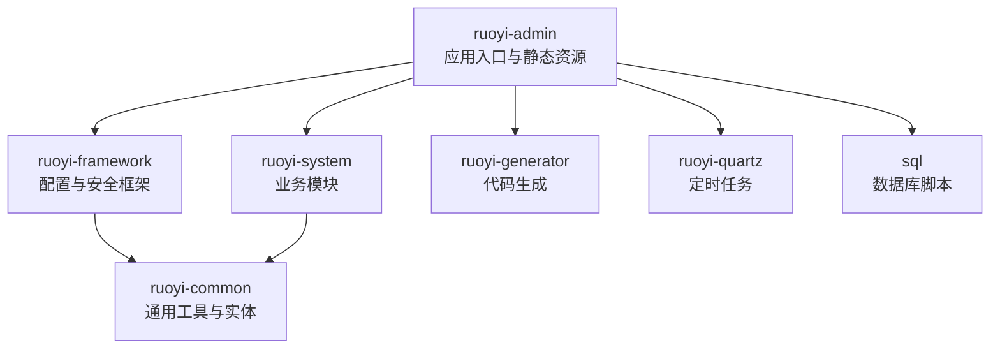
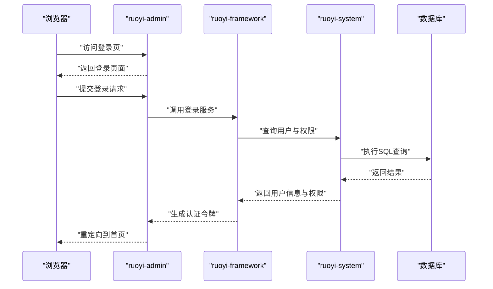
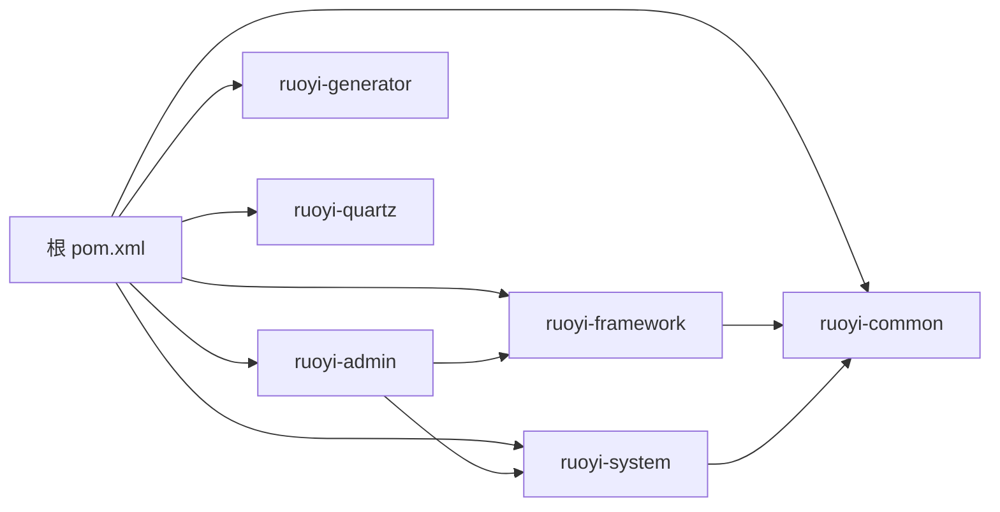
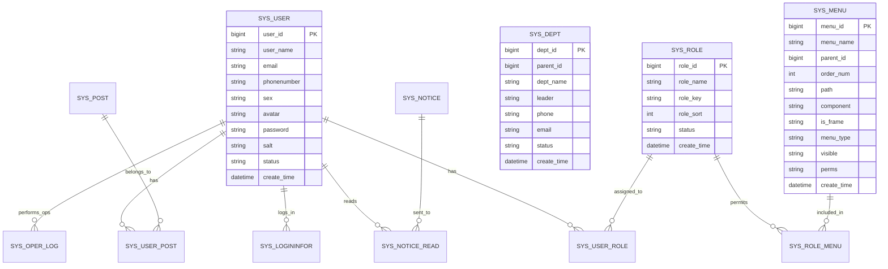

# 快速开始

<cite>
**本文引用的文件**
- [README.md](file://README.md)
- [GENSHIN_MODULE_GUIDE.md](file://GENSHIN_MODULE_GUIDE.md)
- [迁移指南.md](file://迁移指南.md)
- [pom.xml](file://pom.xml)
- [RuoYiApplication.java](file://ruoyi-admin/src/main/java/com/ruoyi/RuoYiApplication.java)
- [application.yml](file://ruoyi-admin/src/main/resources/application.yml)
- [application-druid.yml](file://ruoyi-admin/src/main/resources/application-druid.yml)
- [DruidConfig.java](file://ruoyi-framework/src/main/java/com/ruoyi/framework/config/DruidConfig.java)
- [DruidProperties.java](file://ruoyi-framework/src/main/java/com/ruoyi/framework/config/properties/DruidProperties.java)
- [SysConfig.java](file://ruoyi-system/src/main/java/com/ruoyi/system/domain/SysConfig.java)
- [ISysConfigService.java](file://ruoyi-system/src/main/java/com/ruoyi/system/service/ISysConfigService.java)
- [SysConfigMapper.java](file://ruoyi-system/src/main/java/com/ruoyi/system/mapper/SysConfigMapper.java)
- [SysConfigMapper.xml](file://ruoyi-system/src/main/resources/mapper/system/SysConfigMapper.xml)
- [SysLoginService.java](file://ruoyi-framework/src/main/java/com/ruoyi/framework/shiro/service/SysLoginService.java)
- [SysPasswordService.java](file://ruoyi-framework/src/main/java/com/ruoyi/framework/shiro/service/SysPasswordService.java)
- [SysRegisterService.java](file://ruoyi-framework/src/main/java/com/ruoyi/framework/shiro/service/SysRegisterService.java)
- [SysShiroService.java](file://ruoyi-framework/src/main/java/com/ruoyi/framework/shiro/service/SysShiroService.java)
- [SysUser.java](file://ruoyi-common/src/main/java/com/ruoyi/common/core/domain/entity/SysUser.java)
- [SysRole.java](file://ruoyi-common/src/main/java/com/ruoyi/common/core/domain/entity/SysRole.java)
- [SysMenu.java](file://ruoyi-common/src/main/java/com/ruoyi/common/core/domain/entity/SysMenu.java)
- [SysDept.java](file://ruoyi-common/src/main/java/com/ruoyi/common/core/domain/entity/SysDept.java)
- [SysNotice.java](file://ruoyi-system/src/main/java/com/ruoyi/system/domain/SysNotice.java)
- [SysNoticeRead.java](file://ruoyi-system/src/main/java/com/ruoyi/system/domain/SysNoticeRead.java)
- [SysOperLog.java](file://ruoyi-system/src/main/java/com/ruoyi/system/domain/SysOperLog.java)
- [SysLogininfor.java](file://ruoyi-system/src/main/java/com/ruoyi/system/domain/SysLogininfor.java)
- [SysPost.java](file://ruoyi-system/src/main/java/com/ruoyi/system/domain/SysPost.java)
- [SysRoleDept.java](file://ruoyi-system/src/main/java/com/ruoyi/system/domain/SysRoleDept.java)
- [SysRoleMenu.java](file://ruoyi-system/src/main/java/com/ruoyi/system/domain/SysRoleMenu.java)
- [SysUserPost.java](file://ruoyi-system/src/main/java/com/ruoyi/system/domain/SysUserPost.java)
- [SysUserRole.java](file://ruoyi-system/src/main/java/com/ruoyi/system/domain/SysUserRole.java)
- [GenshinCharacter.java](file://ruoyi-system/src/main/java/com/ruoyi/system/domain/GenshinCharacter.java)
- [GenshinWeapon.java](file://ruoyi-system/src/main/java/com/ruoyi/system/domain/GenshinWeapon.java)
- [GenshinCraft.java](file://ruoyi-system/src/main/java/com/ruoyi/system/domain/GenshinCraft.java)
- [GenshinDomain.java](file://ruoyi-system/src/main/java/com/ruoyi/system/domain/GenshinDomain.java)
- [GenshinEnemy.java](file://ruoyi-system/src/main/java/com/ruoyi/system/domain/GenshinEnemy.java)
- [GenshinUserFavorite.java](file://ruoyi-system/src/main/java/com/ruoyi/system/domain/GenshinUserFavorite.java)
- [Materials.java](file://ruoyi-system/src/main/java/com/ruoyi/system/domain/Materials.java)
- [TalentCosts.java](file://ruoyi-system/src/main/java/com/ruoyi/system/domain/TalentCosts.java)
- [IGenshinCharacterService.java](file://ruoyi-system/src/main/java/com/ruoyi/system/service/IGenshinCharacterService.java)
- [IGenshinWeaponService.java](file://ruoyi-system/src/main/java/com/ruoyi/system/service/IGenshinWeaponService.java)
- [IGenshinCraftService.java](file://ruoyi-system/src/main/java/com/ruoyi/system/service/IGenshinCraftService.java)
- [IGenshinDomainService.java](file://ruoyi-system/src/main/java/com/ruoyi/system/service/IGenshinDomainService.java)
- [IGenshinEnemyService.java](file://ruoyi-system/src/main/java/com/ruoyi/system/service/IGenshinEnemyService.java)
- [IGenshinUserFavoriteService.java](file://ruoyi-system/src/main/java/com/ruoyi/system/service/IGenshinUserFavoriteService.java)
- [IMaterialsService.java](file://ruoyi-system/src/main/java/com/ruoyi/system/service/IMaterialsService.java)
- [ITalentCostsService.java](file://ruoyi-system/src/main/java/com/ruoyi/system/service/ITalentCostsService.java)
- [IGenshinCharacterCostService.java](file://ruoyi-system/src/main/java/com/ruoyi/system/service/IGenshinCharacterCostService.java)
- [IGenshinRecommendArtifactService.java](file://ruoyi-system/src/main/java/com/ruoyi/system/service/IGenshinRecommendArtifactService.java)
- [IGenshinRecommendTeamService.java](file://ruoyi-system/src/main/java/com/ruoyi/system/service/IGenshinRecommendTeamService.java)
- [IGenshinRecommendWeaponService.java](file://ruoyi-system/src/main/java/com/ruoyi/system/service/IGenshinRecommendWeaponService.java)
- [IGenshinEnemyInvestigationService.java](file://ruoyi-system/src/main/java/com/ruoyi/system/service/IGenshinEnemyInvestigationService.java)
- [IGenshinEnemyRewardService.java](file://ruoyi-system/src/main/java/com/ruoyi/system/service/IGenshinEnemyRewardService.java)
- [GenshinCharacterMapper.java](file://ruoyi-system/src/main/java/com/ruoyi/system/mapper/GenshinCharacterMapper.java)
- [GenshinWeaponMapper.java](file://ruoyi-system/src/main/java/com/ruoyi/system/mapper/GenshinWeaponMapper.java)
- [GenshinCraftMapper.java](file://ruoyi-system/src/main/java/com/ruoyi/system/mapper/GenshinCraftMapper.java)
- [GenshinDomainMapper.java](file://ruoyi-system/src/main/java/com/ruoyi/system/mapper/GenshinDomainMapper.java)
- [GenshinEnemyMapper.java](file://ruoyi-system/src/main/java/com/ruoyi/system/mapper/GenshinEnemyMapper.java)
- [GenshinUserFavoriteMapper.java](file://ruoyi-system/src/main/java/com/ruoyi/system/mapper/GenshinUserFavoriteMapper.java)
- [MaterialsMapper.java](file://ruoyi-system/src/main/java/com/ruoyi/system/mapper/MaterialsMapper.java)
- [GenshinCharacterCostMapper.java](file://ruoyi-system/src/main/java/com/ruoyi/system/mapper/GenshinCharacterCostMapper.java)
- [GenshinRecommendArtifactMapper.java](file://ruoyi-system/src/main/java/com/ruoyi/system/mapper/GenshinRecommendArtifactMapper.java)
- [GenshinRecommendTeamMapper.java](file://ruoyi-system/src/main/java/com/ruoyi/system/mapper/GenshinRecommendTeamMapper.java)
- [GenshinRecommendWeaponMapper.java](file://ruoyi-system/src/main/java/com/ruoyi/system/mapper/GenshinRecommendWeaponMapper.java)
- [GenshinEnemyInvestigationMapper.java](file://ruoyi-system/src/main/java/com/ruoyi/system/mapper/GenshinEnemyInvestigationMapper.java)
- [GenshinEnemyRewardMapper.java](file://ruoyi-system/src/main/java/com/ruoyi/system/mapper/GenshinEnemyRewardMapper.java)
- [GenshinCharacterMapper.xml](file://ruoyi-system/src/main/resources/mapper/system/GenshinCharacterMapper.xml)
- [GenshinWeaponMapper.xml](file://ruoyi-system/src/main/resources/mapper/system/GenshinWeaponMapper.xml)
- [GenshinCraftMapper.xml](file://ruoyi-system/src/main/resources/mapper/system/GenshinCraftMapper.xml)
- [GenshinDomainMapper.xml](file://ruoyi-system/src/main/resources/mapper/system/GenshinDomainMapper.xml)
- [GenshinEnemyMapper.xml](file://ruoyi-system/src/main/resources/mapper/system/GenshinEnemyMapper.xml)
- [GenshinUserFavoriteMapper.xml](file://ruoyi-system/src/main/resources/mapper/system/GenshinUserFavoriteMapper.xml)
- [MaterialsMapper.xml](file://ruoyi-system/src/main/resources/mapper/system/MaterialsMapper.xml)
- [GenshinCharacterCostMapper.xml](file://ruoyi-system/src/main/resources/mapper/system/GenshinCharacterCostMapper.xml)
- [GenshinRecommendArtifactMapper.xml](file://ruoyi-system/src/main/resources/mapper/system/GenshinRecommendArtifactMapper.xml)
- [GenshinRecommendTeamMapper.xml](file://ruoyi-system/src/main/resources/mapper/system/GenshinRecommendTeamMapper.xml)
- [GenshinRecommendWeaponMapper.xml](file://ruoyi-system/src/main/resources/mapper/system/GenshinRecommendWeaponMapper.xml)
- [GenshinEnemyInvestigationMapper.xml](file://ruoyi-system/src/main/resources/mapper/system/GenshinEnemyInvestigationMapper.xml)
- [GenshinEnemyRewardMapper.xml](file://ruoyi-system/src/main/resources/mapper/system/GenshinEnemyRewardMapper.xml)
- [ry.bat](file://ry.bat)
- [ry.sh](file://ry.sh)
- [genshin_all.sql](file://sql/genshin_all.sql)
- [rytest.sql](file://sql/rytest.sql)
</cite>

## 目录
1. [简介](#简介)
2. [项目结构](#项目结构)
3. [核心组件](#核心组件)
4. [架构总览](#架构总览)
5. [详细组件分析](#详细组件分析)
6. [依赖分析](#依赖分析)
7. [性能考虑](#性能考虑)
8. [故障排除指南](#故障排除指南)
9. [结论](#结论)
10. [附录](#附录)

## 简介
本指南面向首次接触“原神攻略系统”的开发者，提供从零开始的快速上手流程，涵盖开发环境准备、数据库初始化、项目配置与启动、常见部署方式以及首次启动后的基础配置与测试方法。系统基于 RuoYi 框架构建，采用 Spring Boot + MyBatis + Shiro + Druid 等技术栈，模块化清晰，便于扩展与维护。

## 项目结构
该仓库为“原神攻略系统”，基于 RuoYi 分层架构组织，主要模块包括：
- ruoyi-admin：Web 后端入口模块，包含应用启动类与前端资源
- ruoyi-common：通用工具与实体类
- ruoyi-framework：框架配置与拦截器、安全、任务调度等基础设施
- ruoyi-system：业务模块，包含角色、用户、菜单、公告、原神角色/武器/材料/敌人等数据模型与服务
- ruoyi-generator：代码生成器
- ruoyi-quartz：定时任务模块
- sql：数据库初始化 SQL 脚本

图表来源
- [pom.xml](file://pom.xml)
- [ruoyi-admin/pom.xml](file://ruoyi-admin/pom.xml)
- [ruoyi-framework/pom.xml](file://ruoyi-framework/pom.xml)
- [ruoyi-system/pom.xml](file://ruoyi-system/pom.xml)
- [ruoyi-generator/pom.xml](file://ruoyi-generator/pom.xml)
- [ruoyi-quartz/pom.xml](file://ruoyi-quartz/pom.xml)

章节来源
- [pom.xml](file://pom.xml)
- [GENSHIN_MODULE_GUIDE.md](file://GENSHIN_MODULE_GUIDE.md)

## 核心组件
- 应用启动类：负责应用上下文加载与启动
- 配置文件：application.yml 与 application-druid.yml 提供系统运行所需的核心参数
- 数据源与监控：Druid 数据源配置与属性绑定
- 安全与权限：Shiro 登录、注册、密码服务与授权
- 业务实体与映射：原神相关领域模型与 MyBatis 映射
- 基础设施：定时任务、代码生成、全局异常处理等

章节来源
- [RuoYiApplication.java](file://ruoyi-admin/src/main/java/com/ruoyi/RuoYiApplication.java)
- [application.yml](file://ruoyi-admin/src/main/resources/application.yml)
- [application-druid.yml](file://ruoyi-admin/src/main/resources/application-druid.yml)
- [DruidConfig.java](file://ruoyi-framework/src/main/java/com/ruoyi/framework/config/DruidConfig.java)
- [DruidProperties.java](file://ruoyi-framework/src/main/java/com/ruoyi/framework/config/properties/DruidProperties.java)
- [SysLoginService.java](file://ruoyi-framework/src/main/java/com/ruoyi/framework/shiro/service/SysLoginService.java)
- [SysPasswordService.java](file://ruoyi-framework/src/main/java/com/ruoyi/framework/shiro/service/SysPasswordService.java)
- [SysRegisterService.java](file://ruoyi-framework/src/main/java/com/ruoyi/framework/shiro/service/SysRegisterService.java)
- [SysShiroService.java](file://ruoyi-framework/src/main/java/com/ruoyi/framework/shiro/service/SysShiroService.java)

## 架构总览
系统采用前后端分离架构，后端通过 Spring Boot 提供 REST 接口，前端模板位于 ruoyi-admin 的静态资源中。核心交互链路如下：

图表来源
- [RuoYiApplication.java](file://ruoyi-admin/src/main/java/com/ruoyi/RuoYiApplication.java)
- [SysLoginService.java](file://ruoyi-framework/src/main/java/com/ruoyi/framework/shiro/service/SysLoginService.java)
- [SysUser.java](file://ruoyi-common/src/main/java/com/ruoyi/common/core/domain/entity/SysUser.java)
- [SysRole.java](file://ruoyi-common/src/main/java/com/ruoyi/common/core/domain/entity/SysRole.java)
- [SysMenu.java](file://ruoyi-common/src/main/java/com/ruoyi/common/core/domain/entity/SysMenu.java)

## 详细组件分析

### 开发环境要求
- JDK 版本：建议使用 Java 8 或 Java 17（以项目实际为准）
- Maven 版本：推荐使用 Maven 3.6+（以项目实际为准）
- 数据库：MySQL 5.7+ 或更高版本
- IDE：IntelliJ IDEA 或 Eclipse（可选）
- 浏览器：Chrome/Firefox（用于访问管理后台）

章节来源
- [pom.xml](file://pom.xml)
- [README.md](file://README.md)

### 安装与部署步骤
1) 克隆或导入项目至本地
2) 准备数据库
- 创建数据库与账号
- 执行初始化 SQL 脚本
3) 配置 application.yml 与 application-druid.yml
4) 编译与打包
5) 启动应用并访问管理后台
6) 首次登录与基础配置

章节来源
- [application.yml](file://ruoyi-admin/src/main/resources/application.yml)
- [application-druid.yml](file://ruoyi-admin/src/main/resources/application-druid.yml)
- [genshin_all.sql](file://sql/genshin_all.sql)

### 数据库初始化
- 使用数据库客户端连接数据库
- 执行初始化脚本完成表结构与基础数据创建
- 校验关键表是否存在及数据是否正确

章节来源
- [genshin_all.sql](file://sql/genshin_all.sql)
- [rytest.sql](file://sql/rytest.sql)

### 项目配置
- application.yml：应用基础配置（端口、日志、文件上传、国际化等）
- application-druid.yml：Druid 数据源与监控配置（连接池、SQL 监控、慢 SQL 等）

章节来源
- [application.yml](file://ruoyi-admin/src/main/resources/application.yml)
- [application-druid.yml](file://ruoyi-admin/src/main/resources/application-druid.yml)
- [DruidConfig.java](file://ruoyi-framework/src/main/java/com/ruoyi/framework/config/DruidConfig.java)
- [DruidProperties.java](file://ruoyi-framework/src/main/java/com/ruoyi/framework/config/properties/DruidProperties.java)

### 启动运行
- 使用 Maven 打包后运行 JAR 包
- 或在 IDE 中直接运行应用启动类
- 访问管理后台地址，进行登录与功能验证

章节来源
- [RuoYiApplication.java](file://ruoyi-admin/src/main/java/com/ruoyi/RuoYiApplication.java)
- [ry.bat](file://ry.bat)
- [ry.sh](file://ry.sh)

### 常见部署方式
- 本地开发：IDE 直接运行，便于调试与热更新
- Docker 部署：需准备镜像与容器编排文件（详见部署文档）
- 生产环境部署：JAR 包 + Nginx 反向代理 + 数据库实例

章节来源
- [README.md](file://README.md)

### 首次启动后的基本配置与测试
- 登录系统，修改初始管理员密码
- 配置系统参数（如站点名称、首页路径等）
- 创建角色与菜单，分配权限
- 测试公告发布、用户管理、原神角色/武器/材料等业务功能

章节来源
- [SysConfig.java](file://ruoyi-system/src/main/java/com/ruoyi/system/domain/SysConfig.java)
- [ISysConfigService.java](file://ruoyi-system/src/main/java/com/ruoyi/system/service/ISysConfigService.java)
- [SysConfigMapper.java](file://ruoyi-system/src/main/java/com/ruoyi/system/mapper/SysConfigMapper.java)
- [SysConfigMapper.xml](file://ruoyi-system/src/main/resources/mapper/system/SysConfigMapper.xml)
- [SysNotice.java](file://ruoyi-system/src/main/java/com/ruoyi/system/domain/SysNotice.java)
- [SysNoticeRead.java](file://ruoyi-system/src/main/java/com/ruoyi/system/domain/SysNoticeRead.java)
- [SysOperLog.java](file://ruoyi-system/src/main/java/com/ruoyi/system/domain/SysOperLog.java)
- [SysLogininfor.java](file://ruoyi-system/src/main/java/com/ruoyi/system/domain/SysLogininfor.java)

## 依赖分析
系统采用多模块 Maven 结构，各模块职责明确，耦合度低，便于独立开发与测试。

图表来源
- [pom.xml](file://pom.xml)
- [ruoyi-admin/pom.xml](file://ruoyi-admin/pom.xml)
- [ruoyi-framework/pom.xml](file://ruoyi-framework/pom.xml)
- [ruoyi-system/pom.xml](file://ruoyi-system/pom.xml)
- [ruoyi-generator/pom.xml](file://ruoyi-generator/pom.xml)
- [ruoyi-quartz/pom.xml](file://ruoyi-quartz/pom.xml)

章节来源
- [pom.xml](file://pom.xml)

## 性能考虑
- 数据库连接池：合理配置 Druid 连接池大小与超时时间
- SQL 监控：开启慢 SQL 日志，定期优化热点查询
- 缓存策略：结合业务场景引入缓存，降低数据库压力
- 并发控制：对高频接口增加限流与幂等校验

## 故障排除指南
- 启动失败（端口占用）：检查 application.yml 中端口配置，更换可用端口
- 数据库连接失败：核对 application.yml 与 application-druid.yml 中的数据库连接参数
- 登录异常：确认初始管理员账号与密码，检查 Shiro 权限配置
- SQL 执行错误：核对数据库初始化脚本是否完整执行
- 权限不足：检查角色与菜单权限分配，确保用户具备访问权限

章节来源
- [application.yml](file://ruoyi-admin/src/main/resources/application.yml)
- [application-druid.yml](file://ruoyi-admin/src/main/resources/application-druid.yml)
- [SysLoginService.java](file://ruoyi-framework/src/main/java/com/ruoyi/framework/shiro/service/SysLoginService.java)
- [SysPasswordService.java](file://ruoyi-framework/src/main/java/com/ruoyi/framework/shiro/service/SysPasswordService.java)
- [SysShiroService.java](file://ruoyi-framework/src/main/java/com/ruoyi/framework/shiro/service/SysShiroService.java)

## 结论
通过本快速开始指南，您可以在本地快速搭建并运行“原神攻略系统”。建议先完成数据库初始化与配置文件调整，再启动应用进行功能验证。后续可根据需要扩展业务模块与优化性能配置。

## 附录

### application.yml 关键参数说明
- 服务器端口与上下文路径
- 数据库连接参数（驱动、URL、用户名、密码）
- 文件上传路径与大小限制
- 国际化与日志级别
- 安全与跨域配置（按需启用）

章节来源
- [application.yml](file://ruoyi-admin/src/main/resources/application.yml)

### application-druid.yml 关键参数说明
- 初始连接数与最大连接数
- 获取连接超时时间与连接池监控
- SQL 监控与慢 SQL 阈值
- Web Stat 管理页面与过滤器配置

章节来源
- [application-druid.yml](file://ruoyi-admin/src/main/resources/application-druid.yml)
- [DruidConfig.java](file://ruoyi-framework/src/main/java/com/ruoyi/framework/config/DruidConfig.java)
- [DruidProperties.java](file://ruoyi-framework/src/main/java/com/ruoyi/framework/config/properties/DruidProperties.java)

### 首次启动后的基础配置清单
- 修改管理员密码
- 配置系统参数（站点名称、首页路径等）
- 新增角色与菜单，分配权限
- 发布公告与测试用户管理
- 验证原神角色/武器/材料等业务功能

章节来源
- [SysConfig.java](file://ruoyi-system/src/main/java/com/ruoyi/system/domain/SysConfig.java)
- [ISysConfigService.java](file://ruoyi-system/src/main/java/com/ruoyi/system/service/ISysConfigService.java)
- [SysNotice.java](file://ruoyi-system/src/main/java/com/ruoyi/system/domain/SysNotice.java)
- [SysNoticeRead.java](file://ruoyi-system/src/main/java/com/ruoyi/system/domain/SysNoticeRead.java)

### 数据模型关系图

图表来源
- [SysUser.java](file://ruoyi-common/src/main/java/com/ruoyi/common/core/domain/entity/SysUser.java)
- [SysRole.java](file://ruoyi-common/src/main/java/com/ruoyi/common/core/domain/entity/SysRole.java)
- [SysMenu.java](file://ruoyi-common/src/main/java/com/ruoyi/common/core/domain/entity/SysMenu.java)
- [SysDept.java](file://ruoyi-common/src/main/java/com/ruoyi/common/core/domain/entity/SysDept.java)
- [SysPost.java](file://ruoyi-system/src/main/java/com/ruoyi/system/domain/SysPost.java)
- [SysRoleDept.java](file://ruoyi-system/src/main/java/com/ruoyi/system/domain/SysRoleDept.java)
- [SysRoleMenu.java](file://ruoyi-system/src/main/java/com/ruoyi/system/domain/SysRoleMenu.java)
- [SysUserPost.java](file://ruoyi-system/src/main/java/com/ruoyi/system/domain/SysUserPost.java)
- [SysUserRole.java](file://ruoyi-system/src/main/java/com/ruoyi/system/domain/SysUserRole.java)
- [SysLogininfor.java](file://ruoyi-system/src/main/java/com/ruoyi/system/domain/SysLogininfor.java)
- [SysOperLog.java](file://ruoyi-system/src/main/java/com/ruoyi/system/domain/SysOperLog.java)
- [SysNotice.java](file://ruoyi-system/src/main/java/com/ruoyi/system/domain/SysNotice.java)
- [SysNoticeRead.java](file://ruoyi-system/src/main/java/com/ruoyi/system/domain/SysNoticeRead.java)