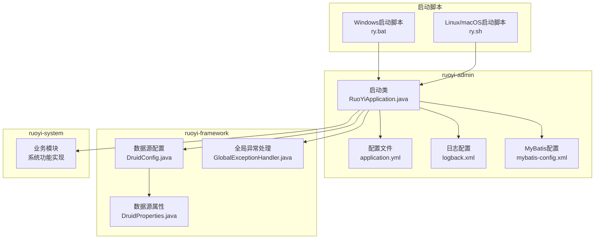
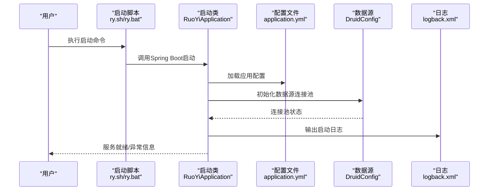
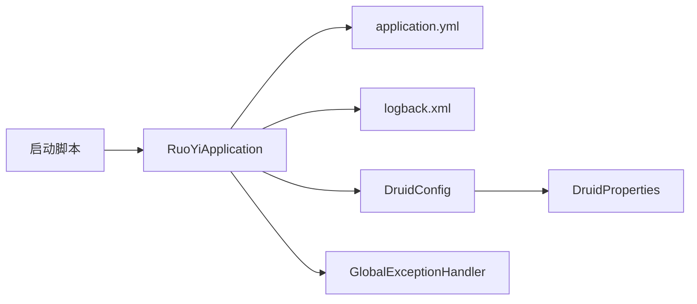

# 启动问题

<cite>
**本文引用的文件**
- [RuoYiApplication.java](file://GenShin/RuoYi-master/ruoyi-admin/src/main/java/com/ruoyi/RuoYiApplication.java)
- [application.yml](file://GenShin/RuoYi-master/ruoyi-admin/src/main/resources/application.yml)
- [ry.sh](file://GenShin/RuoYi-master/ry.sh)
- [ry.bat](file://GenShin/RuoYi-master/ry.bat)
- [pom.xml](file://GenShin/RuoYi-master/pom.xml)
- [mybatis-config.xml](file://GenShin/RuoYi-master/ruoyi-admin/src/main/resources/mybatis/mybatis-config.xml)
- [logback.xml](file://GenShin/RuoYi-master/ruoyi-admin/src/main/resources/logback.xml)
- [DruidConfig.java](file://GenShin/RuoYi-master/ruoyi-framework/src/main/java/com/ruoyi/framework/config/DruidConfig.java)
- [DruidProperties.java](file://GenShin/RuoYi-master/ruoyi-framework/src/main/java/com/ruoyi/framework/config/properties/DruidProperties.java)
- [SwaggerConfig.java](file://GenShin/RuoYi-master/ruoyi-admin/src/main/java/com/ruoyi/web/config/SwaggerConfig.java)
- [GlobalExceptionHandler.java](file://GenShin/RuoYi-master/ruoyi-framework/src/main/java/com/ruoyi/framework/web/exception/GlobalExceptionHandler.java)
- [README.md](file://GenShin/RuoYi-master/README.md)
</cite>

## 目录
1. [简介](#简介)
2. [项目结构](#项目结构)
3. [核心组件](#核心组件)
4. [架构总览](#架构总览)
5. [详细组件分析](#详细组件分析)
6. [依赖关系分析](#依赖关系分析)
7. [性能考虑](#性能考虑)
8. [故障排除指南](#故障排除指南)
9. [结论](#结论)
10. [附录](#附录)

## 简介
本指南聚焦于原神攻略系统（基于 RuoYi 框架）在启动阶段可能出现的问题与排障流程，覆盖 JVM 内存不足、端口占用、配置文件错误、数据库连接失败、依赖缺失等常见异常，并提供启动前环境检查清单、跨平台启动差异说明以及启动日志分析方法。读者可依据本指南快速定位并解决问题。

## 项目结构
该系统采用多模块 Maven 架构，核心启动入口位于 ruoyi-admin 模块，配置集中在 application.yml，框架层位于 ruoyi-framework，业务模块位于 ruoyi-system。启动脚本提供 Windows（ry.bat）与 Linux/macOS（ry.sh）两种方式。

**图表来源**
- [RuoYiApplication.java:1-200](file://GenShin/RuoYi-master/ruoyi-admin/src/main/java/com/ruoyi/RuoYiApplication.java#L1-L200)
- [application.yml:1-300](file://GenShin/RuoYi-master/ruoyi-admin/src/main/resources/application.yml#L1-L300)
- [logback.xml:1-200](file://GenShin/RuoYi-master/ruoyi-admin/src/main/resources/logback.xml#L1-L200)
- [mybatis-config.xml:1-200](file://GenShin/RuoYi-master/ruoyi-admin/src/main/resources/mybatis/mybatis-config.xml#L1-L200)
- [DruidConfig.java:1-200](file://GenShin/RuoYi-master/ruoyi-framework/src/main/java/com/ruoyi/framework/config/DruidConfig.java#L1-L200)
- [DruidProperties.java:1-200](file://GenShin/RuoYi-master/ruoyi-framework/src/main/java/com/ruoyi/framework/config/properties/DruidProperties.java#L1-L200)
- [GlobalExceptionHandler.java:1-200](file://GenShin/RuoYi-master/ruoyi-framework/src/main/java/com/ruoyi/framework/web/exception/GlobalExceptionHandler.java#L1-L200)
- [ry.sh:1-200](file://GenShin/RuoYi-master/ry.sh#L1-L200)
- [ry.bat:1-200](file://GenShin/RuoYi-master/ry.bat#L1-L200)

**章节来源**
- [RuoYiApplication.java:1-200](file://GenShin/RuoYi-master/ruoyi-admin/src/main/java/com/ruoyi/RuoYiApplication.java#L1-L200)
- [application.yml:1-300](file://GenShin/RuoYi-master/ruoyi-admin/src/main/resources/application.yml#L1-L300)
- [ry.sh:1-200](file://GenShin/RuoYi-master/ry.sh#L1-L200)
- [ry.bat:1-200](file://GenShin/RuoYi-master/ry.bat#L1-L200)

## 核心组件
- 应用启动入口：负责加载 Spring Boot 上下文、扫描组件与配置，初始化数据源与 Web 容器。
- 配置中心：application.yml 提供服务器端口、数据库连接、日志级别、Swagger 开关等关键参数。
- 数据源配置：DruidConfig 与 DruidProperties 统一管理连接池参数，影响启动时数据库连接建立。
- 日志系统：logback.xml 控制日志输出位置、格式与级别，是启动问题诊断的重要依据。
- 全局异常：GlobalExceptionHandler 在启动阶段若出现未捕获异常会统一拦截并记录。
- 启动脚本：ry.sh/ry.bat 封装了打包构建与运行命令，便于跨平台一键启动。

**章节来源**
- [RuoYiApplication.java:1-200](file://GenShin/RuoYi-master/ruoyi-admin/src/main/java/com/ruoyi/RuoYiApplication.java#L1-L200)
- [application.yml:1-300](file://GenShin/RuoYi-master/ruoyi-admin/src/main/resources/application.yml#L1-L300)
- [DruidConfig.java:1-200](file://GenShin/RuoYi-master/ruoyi-framework/src/main/java/com/ruoyi/framework/config/DruidConfig.java#L1-L200)
- [DruidProperties.java:1-200](file://GenShin/RuoYi-master/ruoyi-framework/src/main/java/com/ruoyi/framework/config/properties/DruidProperties.java#L1-L200)
- [logback.xml:1-200](file://GenShin/RuoYi-master/ruoyi-admin/src/main/resources/logback.xml#L1-L200)
- [GlobalExceptionHandler.java:1-200](file://GenShin/RuoYi-master/ruoyi-framework/src/main/java/com/ruoyi/framework/web/exception/GlobalExceptionHandler.java#L1-L200)

## 架构总览
系统启动流程从启动类开始，加载配置与数据源，初始化 Web 容器，随后进入业务模块注册与路由映射阶段。异常处理与日志配置贯穿启动过程，为问题定位提供依据。

**图表来源**
- [RuoYiApplication.java:1-200](file://GenShin/RuoYi-master/ruoyi-admin/src/main/java/com/ruoyi/RuoYiApplication.java#L1-L200)
- [application.yml:1-300](file://GenShin/RuoYi-master/ruoyi-admin/src/main/resources/application.yml#L1-L300)
- [DruidConfig.java:1-200](file://GenShin/RuoYi-master/ruoyi-framework/src/main/java/com/ruoyi/framework/config/DruidConfig.java#L1-L200)
- [logback.xml:1-200](file://GenShin/RuoYi-master/ruoyi-admin/src/main/resources/logback.xml#L1-L200)

## 详细组件分析

### 启动类与上下文初始化
- 责任：作为 Spring Boot 应用入口，负责扫描组件、加载配置、初始化 Web 容器与安全过滤器链。
- 关键点：确保主类注解与包扫描路径正确；避免循环依赖；关注启动阶段的日志输出。
- 常见问题：类路径错误导致组件扫描失败、端口被占用、配置文件解析异常。

**章节来源**
- [RuoYiApplication.java:1-200](file://GenShin/RuoYi-master/ruoyi-admin/src/main/java/com/ruoyi/RuoYiApplication.java#L1-L200)

### 配置文件与参数校验
- 责任：集中管理服务器端口、数据库连接、日志级别、Swagger 开关、静态资源路径等。
- 关键点：端口冲突（默认端口）、数据库连接串格式、用户名密码、驱动类名、SSL 参数等。
- 常见问题：端口被占用、数据库凭据错误、MyBatis 映射文件路径错误、日志路径不可写。

**章节来源**
- [application.yml:1-300](file://GenShin/RuoYi-master/ruoyi-admin/src/main/resources/application.yml#L1-L300)

### 数据源与连接池
- 责任：通过 DruidConfig 与 DruidProperties 统一管理连接池大小、超时时间、监控参数。
- 关键点：最小空闲连接、最大活跃连接、获取连接超时、监控页面访问控制。
- 常见问题：连接池耗尽、数据库不可达、事务初始化失败、监控页面无法访问。

**章节来源**
- [DruidConfig.java:1-200](file://GenShin/RuoYi-master/ruoyi-framework/src/main/java/com/ruoyi/framework/config/DruidConfig.java#L1-L200)
- [DruidProperties.java:1-200](file://GenShin/RuoYi-master/ruoyi-framework/src/main/java/com/ruoyi/framework/config/properties/DruidProperties.java#L1-L200)

### 日志系统与启动日志分析
- 责任：通过 logback.xml 控制日志输出位置、级别、格式，启动阶段输出关键信息。
- 关键点：ERROR/WARN 级别异常堆栈、数据库连接失败提示、端口占用提示、配置解析失败。
- 常见问题：日志路径不存在或权限不足、日志滚动策略导致磁盘占满、日志级别过高影响性能。

**章节来源**
- [logback.xml:1-200](file://GenShin/RuoYi-master/ruoyi-admin/src/main/resources/logback.xml#L1-L200)

### 全局异常处理与启动期异常
- 责任：在启动阶段若出现未捕获异常，由 GlobalExceptionHandler 统一拦截并记录。
- 关键点：区分启动期异常与运行期异常；关注异常类型与堆栈信息中的关键节点。
- 常见问题：数据库连接异常、配置加载异常、类加载异常、Web 路由冲突。

**章节来源**
- [GlobalExceptionHandler.java:1-200](file://GenShin/RuoYi-master/ruoyi-framework/src/main/java/com/ruoyi/framework/web/exception/GlobalExceptionHandler.java#L1-L200)

### 启动脚本与跨平台差异
- 责任：封装构建与运行命令，简化启动流程。
- 关键点：Java 版本要求、JVM 参数设置、工作目录与日志输出路径。
- 差异：Windows 使用 .bat，Linux/macOS 使用 .sh；路径分隔符、换行符、权限差异。

**章节来源**
- [ry.sh:1-200](file://GenShin/RuoYi-master/ry.sh#L1-L200)
- [ry.bat:1-200](file://GenShin/RuoYi-master/ry.bat#L1-L200)

## 依赖关系分析
系统启动依赖关系围绕配置、数据源、日志与异常处理展开，启动脚本负责触发应用启动。

**图表来源**
- [RuoYiApplication.java:1-200](file://GenShin/RuoYi-master/ruoyi-admin/src/main/java/com/ruoyi/RuoYiApplication.java#L1-L200)
- [application.yml:1-300](file://GenShin/RuoYi-master/ruoyi-admin/src/main/resources/application.yml#L1-L300)
- [DruidConfig.java:1-200](file://GenShin/RuoYi-master/ruoyi-framework/src/main/java/com/ruoyi/framework/config/DruidConfig.java#L1-L200)
- [DruidProperties.java:1-200](file://GenShin/RuoYi-master/ruoyi-framework/src/main/java/com/ruoyi/framework/config/properties/DruidProperties.java#L1-L200)
- [GlobalExceptionHandler.java:1-200](file://GenShin/RuoYi-master/ruoyi-framework/src/main/java/com/ruoyi/framework/web/exception/GlobalExceptionHandler.java#L1-L200)
- [ry.sh:1-200](file://GenShin/RuoYi-master/ry.sh#L1-L200)
- [ry.bat:1-200](file://GenShin/RuoYi-master/ry.bat#L1-L200)

**章节来源**
- [pom.xml:1-200](file://GenShin/RuoYi-master/pom.xml#L1-L200)

## 性能考虑
- JVM 内存：合理设置堆大小与 GC 参数，避免启动阶段内存不足导致 OOM。
- 连接池：根据并发量调整连接池参数，避免连接池耗尽引发启动延迟。
- 日志级别：生产环境建议 INFO 或 WARN，避免过细粒度日志影响启动性能。
- 依赖版本：确保 Spring Boot、MyBatis、Druid 等版本兼容，减少启动期类加载冲突。

[本节为通用指导，无需引用具体文件]

## 故障排除指南

### 启动前环境检查清单
- Java 环境：确认已安装符合要求的 JDK 版本，可通过命令验证版本。
- Maven 环境：确保 Maven 可用，网络可访问中央仓库。
- 数据库：确认数据库服务可用、网络连通、账号密码正确。
- 端口：确认应用端口未被占用，必要时修改配置文件中的端口。
- 文件权限：确认日志目录存在且具备写入权限。
- 防火墙：确保数据库与应用端口未被防火墙阻断。

**章节来源**
- [application.yml:1-300](file://GenShin/RuoYi-master/ruoyi-admin/src/main/resources/application.yml#L1-L300)
- [logback.xml:1-200](file://GenShin/RuoYi-master/ruoyi-admin/src/main/resources/logback.xml#L1-L200)

### JVM 内存不足
- 症状：启动过程中抛出内存溢出或初始化失败。
- 排查：查看启动日志中是否有内存相关异常信息。
- 解决：在启动脚本中增加 JVM 堆大小参数，或调整应用配置中的内存相关参数。

**章节来源**
- [ry.sh:1-200](file://GenShin/RuoYi-master/ry.sh#L1-L200)
- [ry.bat:1-200](file://GenShin/RuoYi-master/ry.bat#L1-L200)

### 端口占用冲突
- 症状：启动时报端口被占用或连接拒绝。
- 排查：查看启动日志中的端口绑定信息与异常堆栈。
- 解决：修改配置文件中的端口号，或释放占用端口的服务。

**章节来源**
- [application.yml:1-300](file://GenShin/RuoYi-master/ruoyi-admin/src/main/resources/application.yml#L1-L300)

### 配置文件错误
- 症状：启动阶段报配置解析失败、字段缺失或类型不匹配。
- 排查：核对配置文件语法与字段名称，查看日志中的配置加载路径。
- 解决：修正配置文件内容，确保字段完整且类型正确。

**章节来源**
- [application.yml:1-300](file://GenShin/RuoYi-master/ruoyi-admin/src/main/resources/application.yml#L1-L300)

### 数据库连接失败
- 症状：启动阶段数据库连接超时、认证失败或驱动类找不到。
- 排查：查看连接池初始化日志与数据库访问异常堆栈。
- 解决：检查数据库地址、端口、账号密码、驱动类名与 SSL 设置；确认网络连通性。

**章节来源**
- [DruidConfig.java:1-200](file://GenShin/RuoYi-master/ruoyi-framework/src/main/java/com/ruoyi/framework/config/DruidConfig.java#L1-L200)
- [DruidProperties.java:1-200](file://GenShin/RuoYi-master/ruoyi-framework/src/main/java/com/ruoyi/framework/config/properties/DruidProperties.java#L1-L200)

### 依赖包缺失
- 症状：启动阶段类加载失败或找不到依赖。
- 排查：查看启动日志中的类缺失信息与依赖解析错误。
- 解决：清理本地仓库缓存后重新拉取依赖，或检查私服配置。

**章节来源**
- [pom.xml:1-200](file://GenShin/RuoYi-master/pom.xml#L1-L200)

### 启动日志分析方法
- 定位关键信息：关注 ERROR/WARN 级别日志，特别是数据库连接、端口绑定、配置解析、类加载等段落。
- 异常堆栈：从异常根因入手，逐层查看调用链，定位到具体配置或代码位置。
- 日志级别：临时提升日志级别以获取更多上下文，问题解决后恢复默认级别。

**章节来源**
- [logback.xml:1-200](file://GenShin/RuoYi-master/ruoyi-admin/src/main/resources/logback.xml#L1-L200)
- [GlobalExceptionHandler.java:1-200](file://GenShin/RuoYi-master/ruoyi-framework/src/main/java/com/ruoyi/framework/web/exception/GlobalExceptionHandler.java#L1-L200)

### 不同操作系统下的启动问题
- Windows：使用 ry.bat 启动，注意路径分隔符与环境变量；若出现权限问题，尝试以管理员身份运行。
- Linux/macOS：使用 ry.sh 启动，注意脚本执行权限；若出现字符集问题，检查 locale 设置。
- 共同点：均需保证 JDK 版本一致、Maven 依赖完整、数据库可达。

**章节来源**
- [ry.sh:1-200](file://GenShin/RuoYi-master/ry.sh#L1-L200)
- [ry.bat:1-200](file://GenShin/RuoYi-master/ry.bat#L1-L200)

## 结论
通过系统化的启动前检查、对配置文件与数据源的细致核对、结合启动日志的异常堆栈分析，绝大多数启动问题均可快速定位并解决。建议在生产环境中固化启动脚本参数、统一日志级别与路径，并定期进行健康巡检以降低启动风险。

[本节为总结性内容，无需引用具体文件]

## 附录

### 常见启动异常与解决步骤对照
- 端口被占用：修改端口配置 → 重启应用 → 验证端口可用性
- 数据库连接失败：核对连接串与凭据 → 检查网络与防火墙 → 重试连接
- 配置文件错误：修正字段与类型 → 重启应用 → 查看配置加载日志
- 依赖缺失：清理缓存后重新拉取 → 检查私服与代理 → 重启应用
- JVM 内存不足：调整 JVM 堆大小参数 → 优化应用配置 → 重启应用

**章节来源**
- [application.yml:1-300](file://GenShin/RuoYi-master/ruoyi-admin/src/main/resources/application.yml#L1-L300)
- [DruidConfig.java:1-200](file://GenShin/RuoYi-master/ruoyi-framework/src/main/java/com/ruoyi/framework/config/DruidConfig.java#L1-L200)
- [ry.sh:1-200](file://GenShin/RuoYi-master/ry.sh#L1-L200)
- [ry.bat:1-200](file://GenShin/RuoYi-master/ry.bat#L1-L200)