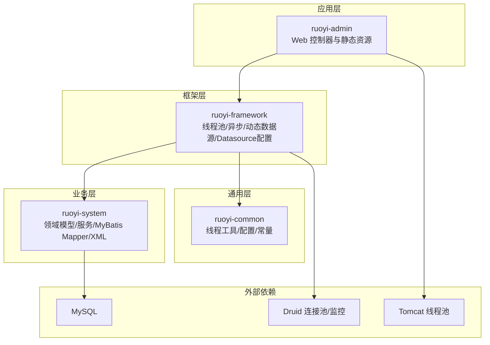
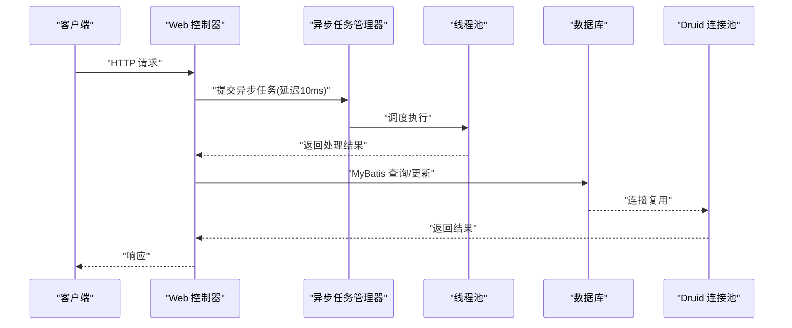
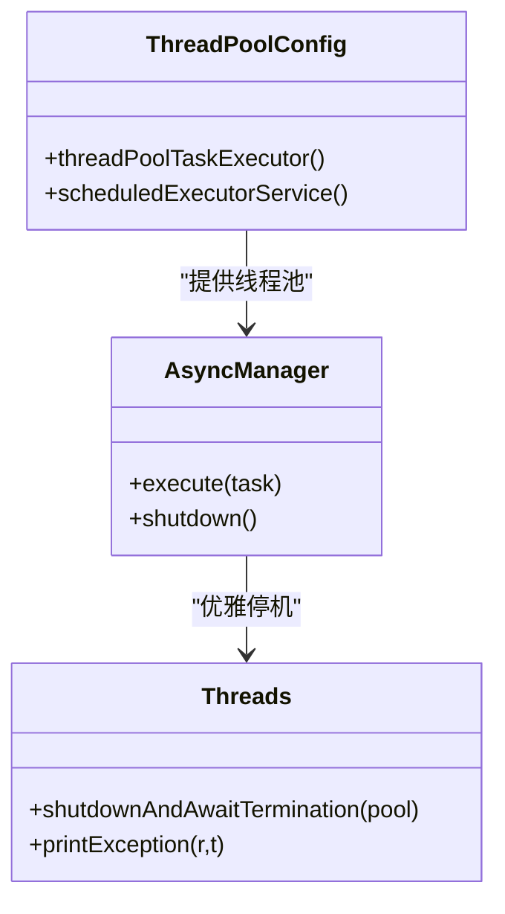
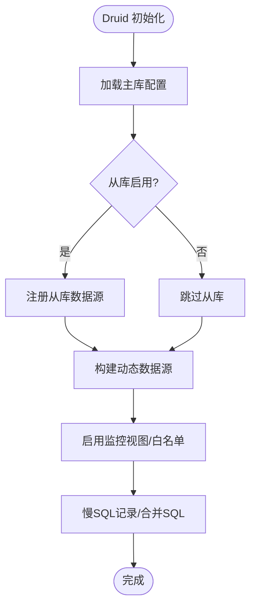
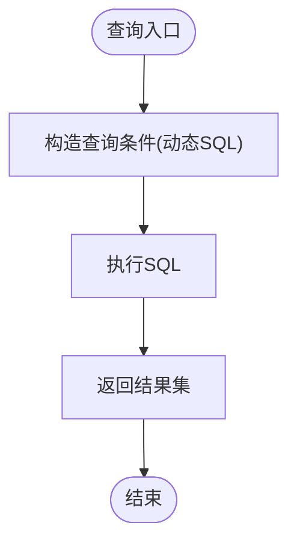
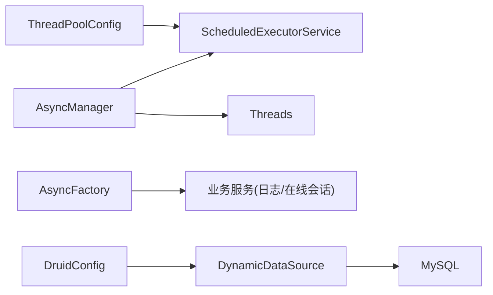

# 性能问题

<cite>
**本文引用的文件**
- [application.yml](file://GenShin/RuoYi-master/ruoyi-admin/src/main/resources/application.yml)
- [application-druid.yml](file://GenShin/RuoYi-master/ruoyi-admin/src/main/resources/application-druid.yml)
- [ThreadPoolConfig.java](file://GenShin/RuoYi-master/ruoyi-common/src/main/java/com/ruoyi/common/config/thread/ThreadPoolConfig.java)
- [DruidConfig.java](file://GenShin/RuoYi-master/ruoyi-framework/src/main/java/com/ruoyi/framework/config/DruidConfig.java)
- [AsyncFactory.java](file://GenShin/RuoYi-master/ruoyi-framework/src/main/java/com/ruoyi/framework/manager/factory/AsyncFactory.java)
- [AsyncManager.java](file://GenShin/RuoYi-master/ruoyi-framework/src/main/java/com/ruoyi/framework/manager/AsyncManager.java)
- [Threads.java](file://GenShin/RuoYi-master/ruoyi-common/src/main/java/com/ruoyi/common/utils/Threads.java)
- [GenshinCharacterMapper.xml](file://GenShin/RuoYi-master/ruoyi-system/src/main/resources/mapper/system/GenshinCharacterMapper.xml)
</cite>

## 目录
1. [简介](#简介)
2. [项目结构](#项目结构)
3. [核心组件](#核心组件)
4. [架构总览](#架构总览)
5. [详细组件分析](#详细组件分析)
6. [依赖分析](#依赖分析)
7. [性能考量](#性能考量)
8. [故障排查指南](#故障排查指南)
9. [结论](#结论)
10. [附录](#附录)

## 简介
本指南聚焦于原神攻略系统的性能问题诊断与优化，覆盖系统响应慢、数据库查询缓慢、并发访问问题、内存泄漏等瓶颈的识别与解决方法，并提供JVM监控、数据库性能分析、线程池监控等工具使用要点；同时给出异步任务处理、缓存策略、数据库连接池优化等技术方案，以及性能测试与基准测试的实施步骤和预防措施与最佳实践。

## 项目结构
该系统基于 RuoYi 框架，采用多模块结构：通用工具与配置（ruoyi-common）、框架层（ruoyi-framework）、业务模块（ruoyi-system）、后台管理（ruoyi-admin）等。性能相关的关键点集中在：
- 线程池与异步任务调度
- 数据库连接池与监控
- MyBatis 映射与 SQL 查询
- Web 容器线程与连接参数
- 日志与慢查询记录

**章节来源**
- [application.yml:17-33](file://GenShin/RuoYi-master/ruoyi-admin/src/main/resources/application.yml#L17-L33)
- [application.yml:47-79](file://GenShin/RuoYi-master/ruoyi-admin/src/main/resources/application.yml#L47-L79)

## 核心组件
- 线程池与异步任务
  - 线程池配置：核心池大小、最大池大小、队列容量、空闲存活时间、拒绝策略
  - 异步任务管理器：统一调度与延迟执行
  - 线程工具：优雅停机与异常打印
- 数据库连接池与监控
  - Druid 多数据源配置与动态切换
  - 慢 SQL 记录、统计视图、白名单控制
- MyBatis 映射与查询
  - XML 映射文件定义查询条件与结果映射
- Web 层参数
  - Tomcat 线程池参数、连接排队数、上下文路径等

**章节来源**
- [ThreadPoolConfig.java:20-43](file://GenShin/RuoYi-master/ruoyi-common/src/main/java/com/ruoyi/common/config/thread/ThreadPoolConfig.java#L20-L43)
- [AsyncManager.java:14-46](file://GenShin/RuoYi-master/ruoyi-framework/src/main/java/com/ruoyi/framework/manager/AsyncManager.java#L14-L46)
- [Threads.java:42-64](file://GenShin/RuoYi-master/ruoyi-common/src/main/java/com/ruoyi/common/utils/Threads.java#L42-L64)
- [DruidConfig.java:35-60](file://GenShin/RuoYi-master/ruoyi-framework/src/main/java/com/ruoyi/framework/config/DruidConfig.java#L35-L60)
- [application-druid.yml:6-61](file://GenShin/RuoYi-master/ruoyi-admin/src/main/resources/application-druid.yml#L6-L61)
- [GenshinCharacterMapper.xml:34-65](file://GenShin/RuoYi-master/ruoyi-system/src/main/resources/mapper/system/GenshinCharacterMapper.xml#L34-L65)

## 架构总览
系统性能相关的关键交互如下：

**图表来源**
- [AsyncManager.java:43-45](file://GenShin/RuoYi-master/ruoyi-framework/src/main/java/com/ruoyi/framework/manager/AsyncManager.java#L43-L45)
- [ThreadPoolConfig.java:32-43](file://GenShin/RuoYi-master/ruoyi-common/src/main/java/com/ruoyi/common/config/thread/ThreadPoolConfig.java#L32-L43)
- [DruidConfig.java:52-60](file://GenShin/RuoYi-master/ruoyi-framework/src/main/java/com/ruoyi/framework/config/DruidConfig.java#L52-L60)

## 详细组件分析

### 线程池与异步任务
- 设计要点
  - 使用 Spring 线程池任务执行器，支持核心/最大池大小、队列容量、空闲存活时间
  - 定时任务使用 ScheduledExecutorService，带拒绝策略与异常打印
  - 异步管理器统一调度，延迟 10ms 执行，避免高频同步阻塞
  - 优雅停机：shutdown 并等待终止，超时强制关闭
- 性能影响
  - 线程池过小导致请求排队与响应延迟上升
  - 队列过大导致内存占用增加与 GC 压力
  - 拒绝策略选择不当可能引发业务失败或阻塞主线程
- 优化建议
  - 根据 CPU 核心数与 IO 密集度调整核心池大小
  - 结合压测结果设定最大池大小与队列容量
  - 对长时间任务拆分，避免阻塞核心线程
  - 使用有界队列并结合拒绝策略（如 CallerRunsPolicy）

**图表来源**
- [ThreadPoolConfig.java:32-62](file://GenShin/RuoYi-master/ruoyi-common/src/main/java/com/ruoyi/common/config/thread/ThreadPoolConfig.java#L32-L62)
- [AsyncManager.java:24-54](file://GenShin/RuoYi-master/ruoyi-framework/src/main/java/com/ruoyi/framework/manager/AsyncManager.java#L24-L54)
- [Threads.java:42-98](file://GenShin/RuoYi-master/ruoyi-common/src/main/java/com/ruoyi/common/utils/Threads.java#L42-L98)

**章节来源**
- [ThreadPoolConfig.java:20-62](file://GenShin/RuoYi-master/ruoyi-common/src/main/java/com/ruoyi/common/config/thread/ThreadPoolConfig.java#L20-L62)
- [AsyncManager.java:14-46](file://GenShin/RuoYi-master/ruoyi-framework/src/main/java/com/ruoyi/framework/manager/AsyncManager.java#L14-L46)
- [Threads.java:42-98](file://GenShin/RuoYi-master/ruoyi-common/src/main/java/com/ruoyi/common/utils/Threads.java#L42-L98)

### 数据库连接池与监控（Druid）
- 设计要点
  - 支持主从数据源配置与动态切换
  - 提供慢 SQL 记录、SQL 合并、白名单控制
  - 统一移除监控页广告，便于内网访问
- 性能影响
  - 连接池初始大小、最大活跃连接、空闲回收周期直接影响并发与资源占用
  - 慢 SQL 记录有助于定位热点 SQL，但需注意日志开销
- 优化建议
  - 根据 QPS 与事务持续时间设置初始连接与最大连接
  - 启用合理的空闲回收与连接超时，避免连接泄露
  - 结合慢 SQL 分析优化索引与查询语句
  - 限制监控页面访问范围，避免生产环境暴露

**图表来源**
- [DruidConfig.java:35-79](file://GenShin/RuoYi-master/ruoyi-framework/src/main/java/com/ruoyi/framework/config/DruidConfig.java#L35-L79)
- [application-druid.yml:6-61](file://GenShin/RuoYi-master/ruoyi-admin/src/main/resources/application-druid.yml#L6-L61)

**章节来源**
- [DruidConfig.java:35-127](file://GenShin/RuoYi-master/ruoyi-framework/src/main/java/com/ruoyi/framework/config/DruidConfig.java#L35-L127)
- [application-druid.yml:6-61](file://GenShin/RuoYi-master/ruoyi-admin/src/main/resources/application-druid.yml#L6-L61)

### MyBatis 映射与查询
- 设计要点
  - XML 中定义字段映射与查询条件，支持多条件 where 动态拼接
  - 提供列表查询、按 ID 查询、插入/更新/删除等常用操作
- 性能影响
  - 多条件查询若未命中索引将导致全表扫描
  - like '%xxx%' 无法使用索引，应评估改写或添加合适索引
- 优化建议
  - 为高频查询字段建立索引
  - 避免 select *，明确字段列表
  - 使用分页插件限制结果集大小
  - 对复杂条件拆分或引入缓存

**图表来源**
- [GenshinCharacterMapper.xml:34-65](file://GenShin/RuoYi-master/ruoyi-system/src/main/resources/mapper/system/GenshinCharacterMapper.xml#L34-L65)

**章节来源**
- [GenshinCharacterMapper.xml:34-169](file://GenShin/RuoYi-master/ruoyi-system/src/main/resources/mapper/system/GenshinCharacterMapper.xml#L34-L169)

### Web 层线程与连接参数
- 设计要点
  - Tomcat 最大线程数、最小空闲线程、接受队列长度等参数
  - 上下文路径、URI 编码等
- 性能影响
  - 线程数过小导致请求排队与超时
  - 接受队列过小导致连接被拒绝
- 优化建议
  - 结合并发请求数与响应时间调优线程池参数
  - 合理设置连接超时与空闲超时，避免资源浪费

**章节来源**
- [application.yml:23-32](file://GenShin/RuoYi-master/ruoyi-admin/src/main/resources/application.yml#L23-L32)

## 依赖分析
- 组件耦合
  - AsyncManager 依赖 Spring 注入的 ScheduledExecutorService
  - AsyncFactory 通过 SpringUtils 获取服务并持久化日志/会话
  - ThreadPoolConfig 与 AsyncManager 共同构成异步处理链路
  - DruidConfig 提供数据源与监控能力，被业务层 MyBatis 使用
- 外部依赖
  - MySQL 作为存储后端
  - Druid 作为连接池与监控中心
  - Tomcat 作为容器线程池

**图表来源**
- [AsyncManager.java:24](file://GenShin/RuoYi-master/ruoyi-framework/src/main/java/com/ruoyi/framework/manager/AsyncManager.java#L24)
- [ThreadPoolConfig.java:32-43](file://GenShin/RuoYi-master/ruoyi-common/src/main/java/com/ruoyi/common/config/thread/ThreadPoolConfig.java#L32-L43)
- [DruidConfig.java:52-60](file://GenShin/RuoYi-master/ruoyi-framework/src/main/java/com/ruoyi/framework/config/DruidConfig.java#L52-L60)

**章节来源**
- [AsyncManager.java:14-56](file://GenShin/RuoYi-master/ruoyi-framework/src/main/java/com/ruoyi/framework/manager/AsyncManager.java#L14-L56)
- [ThreadPoolConfig.java:18-62](file://GenShin/RuoYi-master/ruoyi-common/src/main/java/com/ruoyi/common/config/thread/ThreadPoolConfig.java#L18-L62)
- [DruidConfig.java:32-79](file://GenShin/RuoYi-master/ruoyi-framework/src/main/java/com/ruoyi/framework/config/DruidConfig.java#L32-L79)

## 性能考量
- 系统响应慢
  - 检查线程池饱和与队列堆积情况
  - 关注慢 SQL 与锁竞争
  - 评估静态资源与模板渲染开销
- 数据库查询缓慢
  - 使用 Druid 监控面板查看慢 SQL
  - 分析执行计划，补充索引
  - 优化动态 SQL 条件与分页
- 并发访问问题
  - 调整 Tomcat 与线程池参数
  - 降低长耗时请求比例
  - 使用限流与熔断保护
- 内存泄漏
  - 关注线程池与连接池的正确关闭
  - 避免静态集合持有对象引用
  - 定期检查堆栈与线程转储

[本节为通用指导，无需具体文件引用]

## 故障排查指南
- JVM 监控
  - 使用 JConsole/JProfiler/Arthas 查看线程状态、堆内存、GC 次数与耗时
  - 关注线程池拒绝次数与队列长度
- 数据库性能分析
  - 通过 Druid 监控页查看慢 SQL、SQL 合计、连接数、活动/空闲连接
  - 结合慢 SQL 与 EXPLAIN 分析索引使用情况
- 线程池监控
  - 观察线程池活跃线程数、队列长度、拒绝次数
  - 使用 afterExecute 打印异常，定位失败原因
- 优雅停机与异常捕获
  - 使用 Threads 工具进行优雅停机，避免请求丢失
  - 对异步任务异常进行集中打印与告警

**章节来源**
- [application-druid.yml:44-58](file://GenShin/RuoYi-master/ruoyi-admin/src/main/resources/application-druid.yml#L44-L58)
- [ThreadPoolConfig.java:56-62](file://GenShin/RuoYi-master/ruoyi-common/src/main/java/com/ruoyi/common/config/thread/ThreadPoolConfig.java#L56-L62)
- [Threads.java:42-98](file://GenShin/RuoYi-master/ruoyi-common/src/main/java/com/ruoyi/common/utils/Threads.java#L42-L98)

## 结论
通过合理配置线程池与异步任务、优化数据库连接池与 SQL、调优 Web 容器参数，并结合监控工具进行持续观测，可以显著提升原神攻略系统的整体性能与稳定性。建议以压测驱动参数调优，形成“观测—分析—优化—回归”的闭环。

[本节为总结，无需具体文件引用]

## 附录
- 性能测试与基准测试实施步骤
  - 明确指标：吞吐量、P99 延迟、CPU/内存/GC、数据库 QPS/慢 SQL 比例
  - 选择工具：JMeter/Locust/WRK 或自研压测脚本
  - 场景设计：峰值场景、压力递增、长时间稳定负载
  - 数据采集：JVM 指标、数据库指标、应用日志、线程转储
  - 回归验证：每次优化后重复测试，对比基线
- 常见性能问题预防与最佳实践
  - 线程池
    - 使用有界队列，拒绝策略与告警联动
    - 核心池大小与 CPU 密集度匹配，最大池大小与突发流量匹配
  - 数据库
    - 为高频查询字段建索引，避免全表扫描
    - 分页查询与 LIMIT 使用，避免一次性拉取大量数据
    - 连接池参数与数据库最大连接数匹配
  - 异步任务
    - 长耗时任务拆分，避免阻塞核心线程
    - 对失败任务进行重试与死信处理
  - 缓存策略
    - 读多写少场景引入 Redis 缓存热点数据
    - 缓存失效策略与一致性保障（TTL/双写/失效策略）
  - 监控与告警
    - 建立关键指标阈值与自动告警
    - 定期复盘慢 SQL 与异常日志

[本节为通用指导，无需具体文件引用]