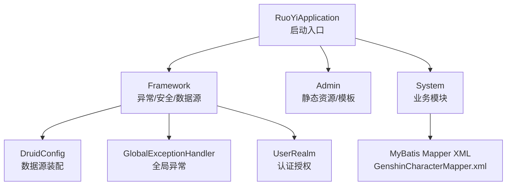
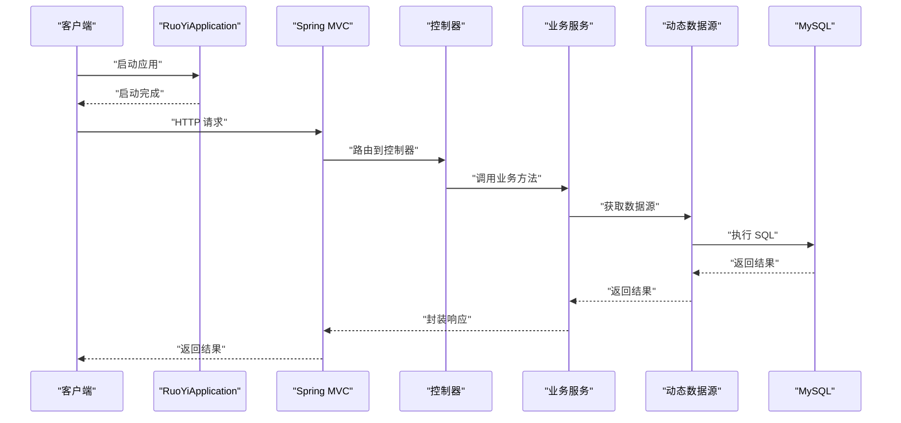
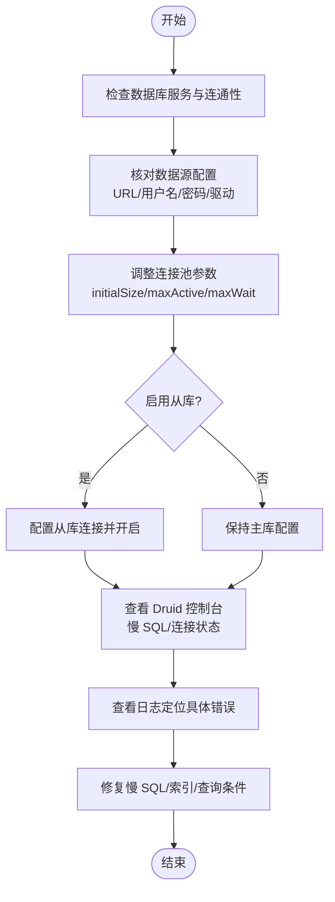
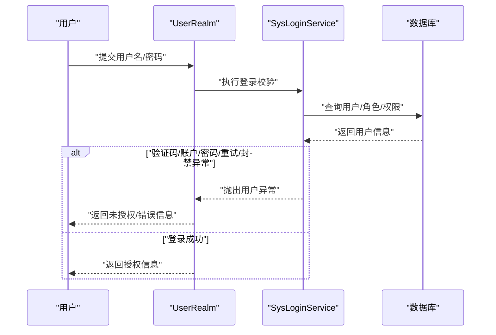
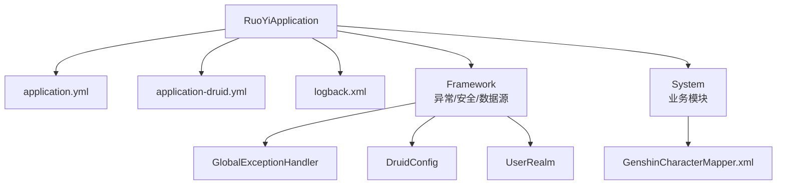

# 故障排除

<cite>
**本文引用的文件**
- [application.yml](file://GenShin/RuoYi-master/ruoyi-admin/src/main/resources/application.yml)
- [application-druid.yml](file://GenShin/RuoYi-master/ruoyi-admin/src/main/resources/application-druid.yml)
- [logback.xml](file://GenShin/RuoYi-master/ruoyi-admin/src/main/resources/logback.xml)
- [RuoYiApplication.java](file://GenShin/RuoYi-master/ruoyi-admin/src/main/java/com/ruoyi/RuoYiApplication.java)
- [GlobalExceptionHandler.java](file://GenShin/RuoYi-master/ruoyi-framework/src/main/java/com/ruoyi/framework/web/exception/GlobalExceptionHandler.java)
- [ServiceException.java](file://GenShin/RuoYi-master/ruoyi-common/src/main/java/com/ruoyi/common/exception/ServiceException.java)
- [UserException.java](file://GenShin/RuoYi-master/ruoyi-common/src/main/java/com/ruoyi/common/exception/user/UserException.java)
- [DruidConfig.java](file://GenShin/RuoYi-master/ruoyi-framework/src/main/java/com/ruoyi/framework/config/DruidConfig.java)
- [DynamicDataSource.java](file://GenShin/RuoYi-master/ruoyi-framework/src/main/java/com/ruoyi/framework/datasource/DynamicDataSource.java)
- [UserRealm.java](file://GenShin/RuoYi-master/ruoyi-framework/src/main/java/com/ruoyi/framework/shiro/realm/UserRealm.java)
- [RuoYiConfig.java](file://GenShin/RuoYi-master/ruoyi-common/src/main/java/com/ruoyi/common/config/RuoYiConfig.java)
- [GenshinCharacterMapper.xml](file://GenShin/RuoYi-master/ruoyi-system/src/main/resources/mapper/system/GenshinCharacterMapper.xml)
- [GENSHIN_MODULE_GUIDE.md](file://GenShin/RuoYi-master/GENSHIN_MODULE_GUIDE.md)
- [迁移指南.md](file://GenShin/RuoYi-master/迁移指南.md)
</cite>

## 目录
1. [简介](#简介)
2. [项目结构](#项目结构)
3. [核心组件](#核心组件)
4. [架构总览](#架构总览)
5. [详细组件分析](#详细组件分析)
6. [依赖分析](#依赖分析)
7. [性能考虑](#性能考虑)
8. [故障排除指南](#故障排除指南)
9. [结论](#结论)
10. [附录](#附录)

## 简介
本指南面向“原神攻略系统”的运维与开发人员，聚焦于系统启动失败、数据库连接问题、权限错误、性能问题、日志分析、数据库排查与修复、配置错误定位与修正、以及版本迁移过程中的问题处理与数据恢复方案。内容基于仓库中的实际配置与异常处理实现，提供可操作的诊断步骤与解决建议。

## 项目结构
系统采用前后端分离的典型后端工程结构，核心模块包括：
- ruoyi-admin：Web 启动与前端模板资源
- ruoyi-framework：框架层（异常、Shiro、动态数据源、Druid 配置等）
- ruoyi-common：通用常量、异常基类、工具类
- ruoyi-system：业务模块（原神相关实体、Mapper、Service、XML）
- ruoyi-quartz、ruoyi-generator：定时任务与代码生成（与故障排除相关度较低）

图表来源
- [RuoYiApplication.java:12-28](file://GenShin/RuoYi-master/ruoyi-admin/src/main/java/com/ruoyi/RuoYiApplication.java#L12-L28)
- [DruidConfig.java:32-60](file://GenShin/RuoYi-master/ruoyi-framework/src/main/java/com/ruoyi/framework/config/DruidConfig.java#L32-L60)
- [GlobalExceptionHandler.java:28-83](file://GenShin/RuoYi-master/ruoyi-framework/src/main/java/com/ruoyi/framework/web/exception/GlobalExceptionHandler.java#L28-L83)
- [UserRealm.java:40-133](file://GenShin/RuoYi-master/ruoyi-framework/src/main/java/com/ruoyi/framework/shiro/realm/UserRealm.java#L40-L133)
- [GenshinCharacterMapper.xml:1-36](file://GenShin/RuoYi-master/ruoyi-system/src/main/resources/mapper/system/GenshinCharacterMapper.xml#L1-L36)

章节来源
- [RuoYiApplication.java:12-28](file://GenShin/RuoYi-master/ruoyi-admin/src/main/java/com/ruoyi/RuoYiApplication.java#L12-L28)
- [GENSHIN_MODULE_GUIDE.md:1-252](file://GenShin/RuoYi-master/GENSHIN_MODULE_GUIDE.md#L1-L252)

## 核心组件
- 启动入口与排除自动配置
  - 启动类显式排除数据源自动配置，由框架自定义装配，便于集中管理数据源与动态切换。
- 异常处理
  - 全局异常处理器统一拦截权限校验、请求方式不支持、运行时异常、系统异常、业务异常、参数绑定与类型不匹配等，并按 AJAX/页面 返回相应结果。
- 安全与权限
  - 自定义 Realm 负责认证与授权，捕获多种用户状态异常（不存在、密码不匹配、重试超限、封禁等），并记录日志。
- 数据源与监控
  - Druid 多数据源配置，支持主从切换；Druid 控制台开启，慢 SQL 记录与白名单配置。
- 日志
  - Logback 分级输出，控制台、INFO/ERROR 文件滚动日志，以及用户操作日志独立输出。

章节来源
- [RuoYiApplication.java:12-28](file://GenShin/RuoYi-master/ruoyi-admin/src/main/java/com/ruoyi/RuoYiApplication.java#L12-L28)
- [GlobalExceptionHandler.java:28-149](file://GenShin/RuoYi-master/ruoyi-framework/src/main/java/com/ruoyi/framework/web/exception/GlobalExceptionHandler.java#L28-L149)
- [UserRealm.java:40-133](file://GenShin/RuoYi-master/ruoyi-framework/src/main/java/com/ruoyi/framework/shiro/realm/UserRealm.java#L40-L133)
- [DruidConfig.java:32-127](file://GenShin/RuoYi-master/ruoyi-framework/src/main/java/com/ruoyi/framework/config/DruidConfig.java#L32-L127)
- [application-druid.yml:1-61](file://GenShin/RuoYi-master/ruoyi-admin/src/main/resources/application-druid.yml#L1-L61)
- [logback.xml:1-96](file://GenShin/RuoYi-master/ruoyi-admin/src/main/resources/logback.xml#L1-L96)

## 架构总览
系统启动与请求处理的关键链路如下：

图表来源
- [RuoYiApplication.java:12-28](file://GenShin/RuoYi-master/ruoyi-admin/src/main/java/com/ruoyi/RuoYiApplication.java#L12-L28)
- [DynamicDataSource.java:13-27](file://GenShin/RuoYi-master/ruoyi-framework/src/main/java/com/ruoyi/framework/datasource/DynamicDataSource.java#L13-L27)
- [GenshinCharacterMapper.xml:38-65](file://GenShin/RuoYi-master/ruoyi-system/src/main/resources/mapper/system/GenshinCharacterMapper.xml#L38-L65)

## 详细组件分析

### 启动失败排查
- 排查要点
  - 端口占用与权限：确认 server.port 未被占用，Windows 需管理员权限。
  - 依赖与打包：确保 Maven 清理并重新打包，IDE 启动时依赖已下载。
  - 配置文件激活：profiles.active 是否正确指向 druid。
  - 数据源排除：启动类已排除自动数据源配置，需确认自定义数据源装配成功。
- 关联配置
  - 服务器端口、Tomcat 线程池、上下文路径
  - Spring 配置、Jackson 时间格式、Thymeleaf、国际化
  - Druid 数据源主库连接、白名单、慢 SQL
  - 日志级别与输出路径

章节来源
- [application.yml:17-79](file://GenShin/RuoYi-master/ruoyi-admin/src/main/resources/application.yml#L17-L79)
- [application-druid.yml:1-61](file://GenShin/RuoYi-master/ruoyi-admin/src/main/resources/application-druid.yml#L1-L61)
- [RuoYiApplication.java:12-28](file://GenShin/RuoYi-master/ruoyi-admin/src/main/java/com/ruoyi/RuoYiApplication.java#L12-L28)

### 数据库连接问题
- 常见症状
  - 启动时报连接超时、驱动找不到、连接池耗尽
  - 请求阶段出现 SQL 执行异常或超时
- 诊断步骤
  - 检查数据库服务是否启动、网络连通性
  - 核对 application-druid.yml 中 master.url、username、password
  - 确认驱动类名与数据库版本兼容
  - 观察 Druid 控制台（/druid）状态与慢 SQL
  - 查看日志中数据库连接与 SQL 执行错误
- 修复建议
  - 调整连接池参数（初始连接、最大活跃、等待超时）
  - 启用从库（slave.enabled=true）并配置从库连接
  - 优化慢 SQL，必要时增加索引或调整查询条件

图表来源
- [application-druid.yml:1-61](file://GenShin/RuoYi-master/ruoyi-admin/src/main/resources/application-druid.yml#L1-L61)
- [DruidConfig.java:32-127](file://GenShin/RuoYi-master/ruoyi-framework/src/main/java/com/ruoyi/framework/config/DruidConfig.java#L32-L127)
- [logback.xml:1-96](file://GenShin/RuoYi-master/ruoyi-admin/src/main/resources/logback.xml#L1-L96)

章节来源
- [application-druid.yml:1-61](file://GenShin/RuoYi-master/ruoyi-admin/src/main/resources/application-druid.yml#L1-L61)
- [DruidConfig.java:32-127](file://GenShin/RuoYi-master/ruoyi-framework/src/main/java/com/ruoyi/framework/config/DruidConfig.java#L32-L127)
- [logback.xml:1-96](file://GenShin/RuoYi-master/ruoyi-admin/src/main/resources/logback.xml#L1-L96)

### 权限错误与认证失败
- 常见症状
  - 403/未授权页面或返回 JSON 未授权
  - 登录失败（账户不存在、密码错误、重试超限、封禁）
- 诊断步骤
  - 检查 Shiro 配置（登录地址、验证码、会话超时、记住我）
  - 核对用户角色与权限标识是否正确分配
  - 查看 UserRealm 认证异常分支与日志
- 修复建议
  - 为角色分配相应权限（如 system:character:*）
  - 临时关闭验证码或调整重试策略进行验证
  - 清理授权缓存或重启应用以生效

图表来源
- [UserRealm.java:86-133](file://GenShin/RuoYi-master/ruoyi-framework/src/main/java/com/ruoyi/framework/shiro/realm/UserRealm.java#L86-L133)
- [application.yml:86-124](file://GenShin/RuoYi-master/ruoyi-admin/src/main/resources/application.yml#L86-L124)

章节来源
- [UserRealm.java:40-159](file://GenShin/RuoYi-master/ruoyi-framework/src/main/java/com/ruoyi/framework/shiro/realm/UserRealm.java#L40-L159)
- [application.yml:86-124](file://GenShin/RuoYi-master/ruoyi-admin/src/main/resources/application.yml#L86-L124)

### 性能问题诊断与优化
- 诊断工具
  - Druid 控制台：慢 SQL、SQL 合并统计、连接池状态
  - 日志：ERROR 级别日志快速定位异常；INFO/DEBUG 辅助排查业务逻辑
  - JVM 与线程池：结合 Tomcat 线程池参数与业务并发情况评估
- 优化建议
  - 调整连接池参数（maxActive、minIdle、maxWait、socketTimeout）
  - 优化慢 SQL，增加必要索引，减少 N+1 查询
  - 合理设置分页参数，避免一次性加载过多数据
  - 降低日志级别或采样输出，减少 IO 压力

章节来源
- [application-druid.yml:19-61](file://GenShin/RuoYi-master/ruoyi-admin/src/main/resources/application-druid.yml#L19-L61)
- [logback.xml:1-96](file://GenShin/RuoYi-master/ruoyi-admin/src/main/resources/logback.xml#L1-L96)
- [application.yml:17-33](file://GenShin/RuoYi-master/ruoyi-admin/src/main/resources/application.yml#L17-L33)

### 日志分析与关键错误识别
- 日志输出
  - 控制台输出与滚动文件输出分离，ERROR 级别单独归档
  - 系统模块与 Spring 日志级别可控，便于缩小范围
- 关键错误识别
  - 全局异常处理器记录请求 URI 与异常堆栈，优先查看 4xx/5xx 对应接口
  - 权限异常：关注未授权页面或 JSON 返回
  - 数据库异常：关注连接超时、SQL 执行异常、慢 SQL 报警
- 建议
  - 生产环境适当提高日志级别，减少 IO
  - 结合 Druid 控制台与业务日志交叉验证

章节来源
- [logback.xml:1-96](file://GenShin/RuoYi-master/ruoyi-admin/src/main/resources/logback.xml#L1-L96)
- [GlobalExceptionHandler.java:31-83](file://GenShin/RuoYi-master/ruoyi-framework/src/main/java/com/ruoyi/framework/web/exception/GlobalExceptionHandler.java#L31-L83)

### 数据库问题排查与修复
- 表结构缺失
  - 症状：404 或业务异常提示表不存在
  - 处理：执行模块初始化 SQL，确认数据库名与配置一致
- 查询异常
  - 检查 Mapper XML 与实体字段映射是否一致
  - 核对查询条件与索引，避免全表扫描
- 连接异常
  - 调整连接池参数，启用从库，观察慢 SQL
- 修复流程
  - 备份现有数据库
  - 重新执行初始化 SQL
  - 校验关键表与索引
  - 逐步回归测试

章节来源
- [GENSHIN_MODULE_GUIDE.md:61-84](file://GenShin/RuoYi-master/GENSHIN_MODULE_GUIDE.md#L61-L84)
- [GenshinCharacterMapper.xml:34-169](file://GenShin/RuoYi-master/ruoyi-system/src/main/resources/mapper/system/GenshinCharacterMapper.xml#L34-L169)
- [application-druid.yml:1-61](file://GenShin/RuoYi-master/ruoyi-admin/src/main/resources/application-druid.yml#L1-L61)

### 配置错误的常见原因与修正
- 常见问题
  - 数据库连接信息错误（URL/用户名/密码）
  - 文件上传路径不可写或不存在
  - Shiro 配置不当导致登录失败
  - 日志路径不可写或权限不足
- 修正方法
  - 逐项核对 application.yml 与 application-druid.yml
  - 确认文件上传目录存在且具备写权限
  - 检查 profiles.active 与 druid 配置一致性
  - 修改日志路径与权限，确保进程可写

章节来源
- [application.yml:1-154](file://GenShin/RuoYi-master/ruoyi-admin/src/main/resources/application.yml#L1-L154)
- [application-druid.yml:1-61](file://GenShin/RuoYi-master/ruoyi-admin/src/main/resources/application-druid.yml#L1-L61)
- [logback.xml:1-96](file://GenShin/RuoYi-master/ruoyi-admin/src/main/resources/logback.xml#L1-L96)

### 版本迁移过程中的问题处理与数据恢复
- 迁移清单
  - Controller、Domain、Mapper、Service、HTML 模板等文件的复制与放置
- 迁移后验证
  - 重新编译并启动，检查菜单与权限配置
- 数据恢复
  - 迁移前备份数据库与配置
  - 如遇异常，回退到上一个稳定版本，恢复备份后再试

章节来源
- [迁移指南.md:1-98](file://GenShin/RuoYi-master/迁移指南.md#L1-L98)
- [GENSHIN_MODULE_GUIDE.md:146-168](file://GenShin/RuoYi-master/GENSHIN_MODULE_GUIDE.md#L146-L168)

## 依赖分析
系统关键依赖关系如下：

图表来源
- [RuoYiApplication.java:12-28](file://GenShin/RuoYi-master/ruoyi-admin/src/main/java/com/ruoyi/RuoYiApplication.java#L12-L28)
- [application.yml:1-154](file://GenShin/RuoYi-master/ruoyi-admin/src/main/resources/application.yml#L1-L154)
- [application-druid.yml:1-61](file://GenShin/RuoYi-master/ruoyi-admin/src/main/resources/application-druid.yml#L1-L61)
- [logback.xml:1-96](file://GenShin/RuoYi-master/ruoyi-admin/src/main/resources/logback.xml#L1-L96)
- [GlobalExceptionHandler.java:28-83](file://GenShin/RuoYi-master/ruoyi-framework/src/main/java/com/ruoyi/framework/web/exception/GlobalExceptionHandler.java#L28-L83)
- [DruidConfig.java:32-60](file://GenShin/RuoYi-master/ruoyi-framework/src/main/java/com/ruoyi/framework/config/DruidConfig.java#L32-L60)
- [UserRealm.java:40-133](file://GenShin/RuoYi-master/ruoyi-framework/src/main/java/com/ruoyi/framework/shiro/realm/UserRealm.java#L40-L133)
- [GenshinCharacterMapper.xml:1-36](file://GenShin/RuoYi-master/ruoyi-system/src/main/resources/mapper/system/GenshinCharacterMapper.xml#L1-L36)

章节来源
- [RuoYiApplication.java:12-28](file://GenShin/RuoYi-master/ruoyi-admin/src/main/java/com/ruoyi/RuoYiApplication.java#L12-L28)
- [DruidConfig.java:32-60](file://GenShin/RuoYi-master/ruoyi-framework/src/main/java/com/ruoyi/framework/config/DruidConfig.java#L32-L60)
- [GlobalExceptionHandler.java:28-83](file://GenShin/RuoYi-master/ruoyi-framework/src/main/java/com/ruoyi/framework/web/exception/GlobalExceptionHandler.java#L28-L83)
- [UserRealm.java:40-133](file://GenShin/RuoYi-master/ruoyi-framework/src/main/java/com/ruoyi/framework/shiro/realm/UserRealm.java#L40-L133)
- [GenshinCharacterMapper.xml:1-36](file://GenShin/RuoYi-master/ruoyi-system/src/main/resources/mapper/system/GenshinCharacterMapper.xml#L1-L36)

## 性能考虑
- 连接池参数调优：根据并发与响应时间目标调整初始连接、最大活跃、等待超时与网络超时
- SQL 优化：利用 Druid 控制台识别慢 SQL，补充索引，拆分复杂查询
- 日志与监控：生产环境适度降低日志级别，避免 IO 放大
- 线程与容器：合理设置 Tomcat 线程池参数，避免高并发下的连接排队

## 故障排除指南

### 系统错误分类与解决步骤
- 启动失败
  - 端口冲突、权限不足、依赖缺失、配置错误
  - 解决：更换端口、以管理员运行、清理并重新构建、核对配置文件
- 数据库连接问题
  - 驱动/URL/凭据错误、连接池耗尽、网络不可达
  - 解决：修正连接信息、调整连接池参数、检查网络与防火墙
- 权限错误
  - 用户状态异常、权限不足、验证码/会话配置不当
  - 解决：分配权限、临时关闭验证码、清理缓存或重启
- 性能问题
  - 慢 SQL、连接池瓶颈、日志 IO 压力
  - 解决：优化 SQL、调参连接池、降低日志级别或采样
- 配置错误
  - 文件路径、国际化、Shiro、日志路径
  - 解决：逐项核对并修正，确保进程具备写权限

章节来源
- [application.yml:1-154](file://GenShin/RuoYi-master/ruoyi-admin/src/main/resources/application.yml#L1-L154)
- [application-druid.yml:1-61](file://GenShin/RuoYi-master/ruoyi-admin/src/main/resources/application-druid.yml#L1-L61)
- [logback.xml:1-96](file://GenShin/RuoYi-master/ruoyi-admin/src/main/resources/logback.xml#L1-L96)
- [GENSHIN_MODULE_GUIDE.md:146-168](file://GenShin/RuoYi-master/GENSHIN_MODULE_GUIDE.md#L146-L168)

### 日志分析方法与关键错误识别
- 分析步骤
  - 定位 ERROR 日志，结合请求 URI 与异常堆栈
  - 使用全局异常处理器返回的错误信息判断类型（业务/权限/参数）
  - 结合 Druid 控制台慢 SQL 与连接状态辅助定位
- 关键错误识别
  - 权限不足：未授权页面或 JSON 未授权
  - 参数不匹配：请求参数类型与期望不符
  - 业务异常：ServiceException 抛出的业务提示

章节来源
- [GlobalExceptionHandler.java:31-149](file://GenShin/RuoYi-master/ruoyi-framework/src/main/java/com/ruoyi/framework/web/exception/GlobalExceptionHandler.java#L31-L149)
- [ServiceException.java:8-58](file://GenShin/RuoYi-master/ruoyi-common/src/main/java/com/ruoyi/common/exception/ServiceException.java#L8-L58)
- [UserException.java:10-19](file://GenShin/RuoYi-master/ruoyi-common/src/main/java/com/ruoyi/common/exception/user/UserException.java#L10-L19)

### 数据库问题排查流程与修复方法
- 排查流程
  - 确认数据库服务与网络
  - 核对数据源配置与驱动
  - 检查表结构与索引
  - 观察 Druid 控制台慢 SQL
- 修复方法
  - 修正配置后重启
  - 重新执行初始化 SQL
  - 优化慢 SQL 并补充索引

章节来源
- [application-druid.yml:1-61](file://GenShin/RuoYi-master/ruoyi-admin/src/main/resources/application-druid.yml#L1-L61)
- [GENSHIN_MODULE_GUIDE.md:61-84](file://GenShin/RuoYi-master/GENSHIN_MODULE_GUIDE.md#L61-L84)
- [GenshinCharacterMapper.xml:34-169](file://GenShin/RuoYi-master/ruoyi-system/src/main/resources/mapper/system/GenshinCharacterMapper.xml#L34-L169)

### 配置错误的常见原因与修正方法
- 常见原因
  - application.yml 与 application-druid.yml 不一致
  - 文件上传路径不存在或权限不足
  - Shiro 配置与实际需求不匹配
- 修正方法
  - 逐项比对并修正配置
  - 确保路径存在且具备写权限
  - 调整 profiles.active 与 druid 配置

章节来源
- [application.yml:1-154](file://GenShin/RuoYi-master/ruoyi-admin/src/main/resources/application.yml#L1-L154)
- [application-druid.yml:1-61](file://GenShin/RuoYi-master/ruoyi-admin/src/main/resources/application-druid.yml#L1-L61)
- [logback.xml:1-96](file://GenShin/RuoYi-master/ruoyi-admin/src/main/resources/logback.xml#L1-L96)

### 版本迁移过程中的问题处理与数据恢复方案
- 迁移步骤
  - 复制文件到目标目录
  - 重新编译并启动
  - 配置菜单与权限
- 数据恢复
  - 迁移前备份数据库与配置
  - 出现异常时回退到上一个稳定版本
  - 恢复备份后再次尝试迁移

章节来源
- [迁移指南.md:1-98](file://GenShin/RuoYi-master/迁移指南.md#L1-L98)
- [GENSHIN_MODULE_GUIDE.md:146-168](file://GenShin/RuoYi-master/GENSHIN_MODULE_GUIDE.md#L146-L168)

## 结论
本指南基于仓库中的实际配置与异常处理实现，提供了系统化的故障排除方法。通过核对配置、利用全局异常与日志、结合 Druid 监控与慢 SQL 分析，能够高效定位并解决启动失败、数据库连接问题、权限错误与性能瓶颈等问题。版本迁移与数据恢复建议遵循“备份先行、回退可控”的原则，确保变更风险受控。

## 附录
- 快速检查清单
  - 端口与权限：确认端口未被占用、以管理员运行
  - 数据库：服务可用、URL/凭据正确、连接池参数合理
  - 配置：application.yml 与 application-druid.yml 一致
  - 日志：ERROR 日志与 Druid 控制台状态正常
  - 权限：用户角色与权限标识正确分配
  - 迁移：备份数据库与配置，按清单执行