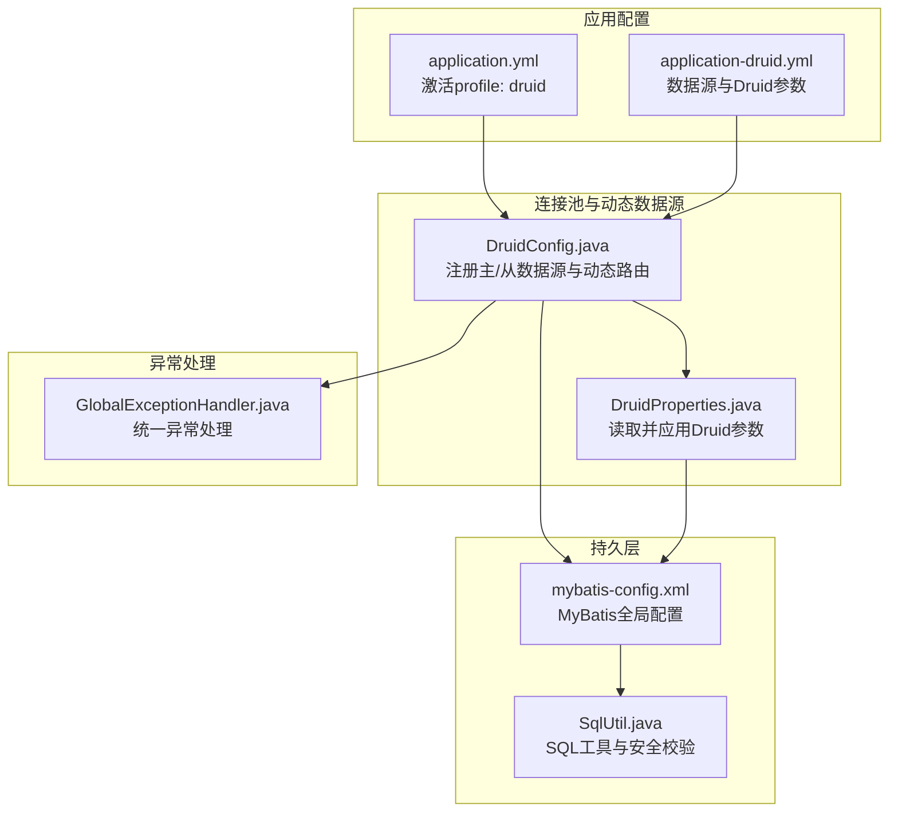
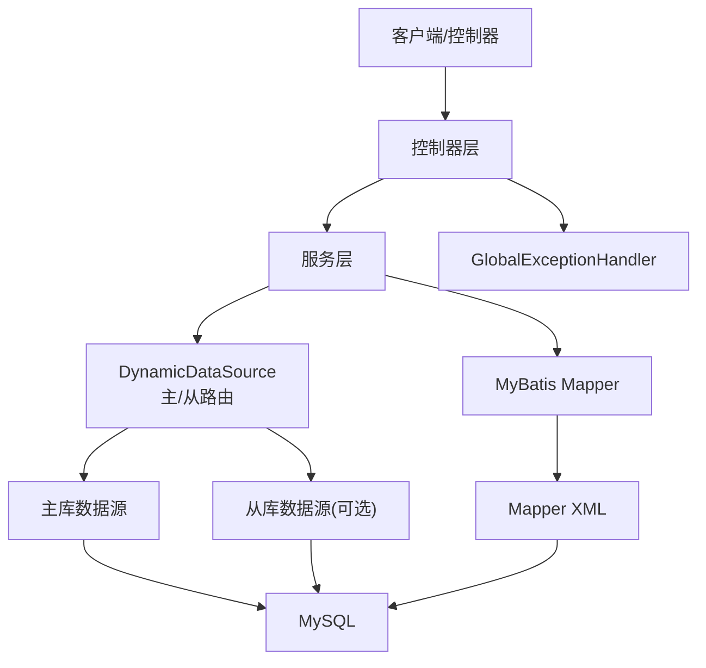
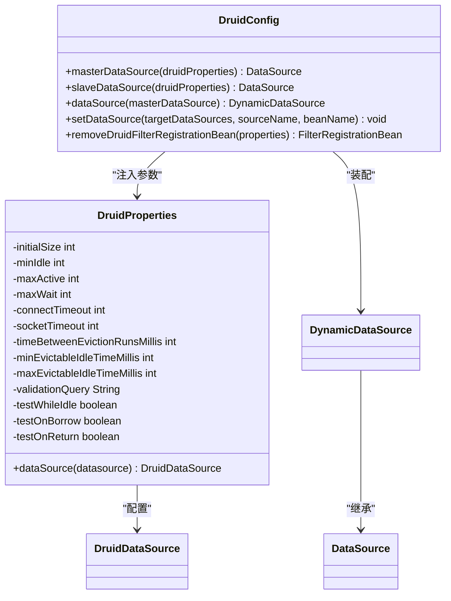
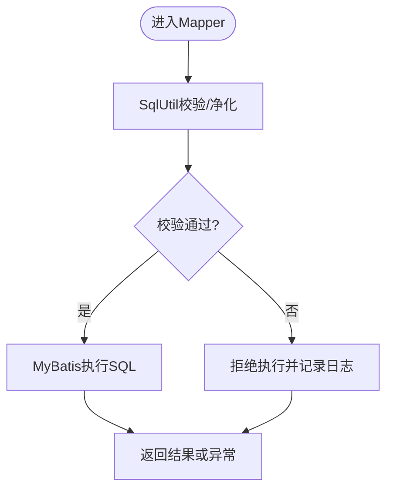
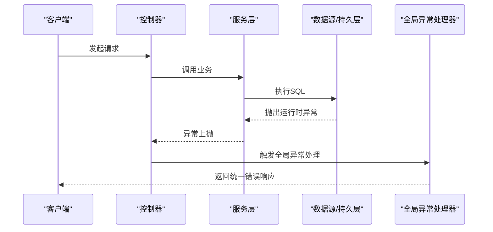
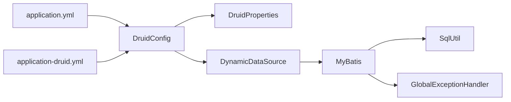

# 数据库问题

<cite>
**本文引用的文件**
- [application.yml](file://GenShin/RuoYi-master/ruoyi-admin/src/main/resources/application.yml)
- [application-druid.yml](file://GenShin/RuoYi-master/ruoyi-admin/src/main/resources/application-druid.yml)
- [DruidConfig.java](file://GenShin/RuoYi-master/ruoyi-framework/src/main/java/com/ruoyi/framework/config/DruidConfig.java)
- [DruidProperties.java](file://GenShin/RuoYi-master/ruoyi-framework/src/main/java/com/ruoyi/framework/config/properties/DruidProperties.java)
- [GlobalExceptionHandler.java](file://GenShin/RuoYi-master/ruoyi-framework/src/main/java/com/ruoyi/framework/web/exception/GlobalExceptionHandler.java)
- [mybatis-config.xml](file://GenShin/RuoYi-master/ruoyi-admin/src/main/resources/mybatis/mybatis-config.xml)
- [SqlUtil.java](file://GenShin/RuoYi-master/ruoyi-common/src/main/java/com/ruoyi/common/utils/sql/SqlUtil.java)
</cite>

## 目录
1. [简介](#简介)
2. [项目结构](#项目结构)
3. [核心组件](#核心组件)
4. [架构总览](#架构总览)
5. [详细组件分析](#详细组件分析)
6. [依赖关系分析](#依赖关系分析)
7. [性能考虑](#性能考虑)
8. [故障排除指南](#故障排除指南)
9. [结论](#结论)
10. [附录](#附录)

## 简介
本指南面向原神攻略系统数据库专业故障排除场景，聚焦以下主题：
- 数据库连接失败、SQL语法错误、表结构不匹配、数据导入导出问题的诊断与修复
- 数据库连接池（Druid）配置与监控、慢SQL与安全策略调优
- 常见数据库错误（死锁、超时、索引失效）的定位与解决
- 数据备份与恢复流程建议
- SQL调试与执行计划分析方法
- 性能优化建议与最佳实践

## 项目结构
该系统基于RuoYi框架，数据库层通过Spring Boot自动装配Druid连接池，结合动态数据源与MyBatis进行持久层访问。关键配置位于应用配置文件与Druid配置类中。

**图表来源**
- [application.yml:61-62](file://GenShin/RuoYi-master/ruoyi-admin/src/main/resources/application.yml#L61-L62)
- [application-druid.yml:1-61](file://GenShin/RuoYi-master/ruoyi-admin/src/main/resources/application-druid.yml#L1-L61)
- [DruidConfig.java:32-60](file://GenShin/RuoYi-master/ruoyi-framework/src/main/java/com/ruoyi/framework/config/DruidConfig.java#L32-L60)
- [DruidProperties.java:12-88](file://GenShin/RuoYi-master/ruoyi-framework/src/main/java/com/ruoyi/framework/config/properties/DruidProperties.java#L12-L88)
- [mybatis-config.xml](file://GenShin/RuoYi-master/ruoyi-admin/src/main/resources/mybatis/mybatis-config.xml)
- [SqlUtil.java](file://GenShin/RuoYi-master/ruoyi-common/src/main/java/com/ruoyi/common/utils/sql/SqlUtil.java)
- [GlobalExceptionHandler.java:28-149](file://GenShin/RuoYi-master/ruoyi-framework/src/main/java/com/ruoyi/framework/web/exception/GlobalExceptionHandler.java#L28-L149)

**章节来源**
- [application.yml:61-62](file://GenShin/RuoYi-master/ruoyi-admin/src/main/resources/application.yml#L61-L62)
- [application-druid.yml:1-61](file://GenShin/RuoYi-master/ruoyi-admin/src/main/resources/application-druid.yml#L1-L61)
- [DruidConfig.java:32-60](file://GenShin/RuoYi-master/ruoyi-framework/src/main/java/com/ruoyi/framework/config/DruidConfig.java#L32-L60)
- [DruidProperties.java:12-88](file://GenShin/RuoYi-master/ruoyi-framework/src/main/java/com/ruoyi/framework/config/properties/DruidProperties.java#L12-L88)
- [mybatis-config.xml](file://GenShin/RuoYi-master/ruoyi-admin/src/main/resources/mybatis/mybatis-config.xml)
- [SqlUtil.java](file://GenShin/RuoYi-master/ruoyi-common/src/main/java/com/ruoyi/common/utils/sql/SqlUtil.java)
- [GlobalExceptionHandler.java:28-149](file://GenShin/RuoYi-master/ruoyi-framework/src/main/java/com/ruoyi/framework/web/exception/GlobalExceptionHandler.java#L28-L149)

## 核心组件
- 应用配置与激活
  - 通过profiles.active启用druid配置文件，加载Druid数据源参数。
- Druid连接池配置
  - 在DruidConfig中注册主/从数据源，构建DynamicDataSource作为Primary数据源。
  - DruidProperties读取配置项并应用到DruidDataSource实例。
- MyBatis与SQL工具
  - mybatis-config.xml集中配置MyBatis；SqlUtil提供SQL安全与校验能力。
- 异常处理
  - GlobalExceptionHandler统一捕获运行时异常，保障接口稳定性。

**章节来源**
- [application.yml:61-62](file://GenShin/RuoYi-master/ruoyi-admin/src/main/resources/application.yml#L61-L62)
- [application-druid.yml:1-61](file://GenShin/RuoYi-master/ruoyi-admin/src/main/resources/application-druid.yml#L1-L61)
- [DruidConfig.java:32-60](file://GenShin/RuoYi-master/ruoyi-framework/src/main/java/com/ruoyi/framework/config/DruidConfig.java#L32-L60)
- [DruidProperties.java:12-88](file://GenShin/RuoYi-master/ruoyi-framework/src/main/java/com/ruoyi/framework/config/properties/DruidProperties.java#L12-L88)
- [mybatis-config.xml](file://GenShin/RuoYi-master/ruoyi-admin/src/main/resources/mybatis/mybatis-config.xml)
- [SqlUtil.java](file://GenShin/RuoYi-master/ruoyi-common/src/main/java/com/ruoyi/common/utils/sql/SqlUtil.java)
- [GlobalExceptionHandler.java:28-149](file://GenShin/RuoYi-master/ruoyi-framework/src/main/java/com/ruoyi/framework/web/exception/GlobalExceptionHandler.java#L28-L149)

## 架构总览
系统数据库层采用“配置驱动 + 动态数据源 + 连接池 + 持久层”的分层架构。DruidConfig负责装配数据源与动态路由，DruidProperties负责参数注入，MyBatis负责SQL映射与执行，异常处理统一拦截运行时错误。

**图表来源**
- [DruidConfig.java:52-60](file://GenShin/RuoYi-master/ruoyi-framework/src/main/java/com/ruoyi/framework/config/DruidConfig.java#L52-L60)
- [application-druid.yml:8-18](file://GenShin/RuoYi-master/ruoyi-admin/src/main/resources/application-druid.yml#L8-L18)
- [mybatis-config.xml](file://GenShin/RuoYi-master/ruoyi-admin/src/main/resources/mybatis/mybatis-config.xml)
- [GlobalExceptionHandler.java:66-83](file://GenShin/RuoYi-master/ruoyi-framework/src/main/java/com/ruoyi/framework/web/exception/GlobalExceptionHandler.java#L66-L83)

## 详细组件分析

### 组件一：Druid连接池与动态数据源
- 关键点
  - 主/从数据源Bean注册与条件装配
  - 动态数据源路由与Primary优先级
  - 广告过滤器对监控页面的处理
- 参数要点
  - 连接池大小、等待超时、网络超时、空闲检测、有效性检测等
  - 控制台白名单、慢SQL阈值、SQL合并统计

**图表来源**
- [DruidConfig.java:32-79](file://GenShin/RuoYi-master/ruoyi-framework/src/main/java/com/ruoyi/framework/config/DruidConfig.java#L32-L79)
- [DruidProperties.java:12-88](file://GenShin/RuoYi-master/ruoyi-framework/src/main/java/com/ruoyi/framework/config/properties/DruidProperties.java#L12-L88)

**章节来源**
- [DruidConfig.java:32-79](file://GenShin/RuoYi-master/ruoyi-framework/src/main/java/com/ruoyi/framework/config/DruidConfig.java#L32-L79)
- [DruidProperties.java:12-88](file://GenShin/RuoYi-master/ruoyi-framework/src/main/java/com/ruoyi/framework/config/properties/DruidProperties.java#L12-L88)
- [application-druid.yml:19-61](file://GenShin/RuoYi-master/ruoyi-admin/src/main/resources/application-druid.yml#L19-L61)

### 组件二：MyBatis与SQL工具
- 关键点
  - MyBatis全局配置集中管理
  - SqlUtil提供SQL安全与校验能力，避免注入与越权
- 作用
  - 规范SQL执行路径，辅助异常定位与日志输出

**图表来源**
- [mybatis-config.xml](file://GenShin/RuoYi-master/ruoyi-admin/src/main/resources/mybatis/mybatis-config.xml)
- [SqlUtil.java](file://GenShin/RuoYi-master/ruoyi-common/src/main/java/com/ruoyi/common/utils/sql/SqlUtil.java)

**章节来源**
- [mybatis-config.xml](file://GenShin/RuoYi-master/ruoyi-admin/src/main/resources/mybatis/mybatis-config.xml)
- [SqlUtil.java](file://GenShin/RuoYi-master/ruoyi-common/src/main/java/com/ruoyi/common/utils/sql/SqlUtil.java)

### 组件三：全局异常处理
- 关键点
  - 捕获运行时异常并统一返回AjaxResult或视图
  - 对业务异常、权限异常、参数异常进行分类处理
- 价值
  - 便于前端与运维快速识别错误类型与上下文

**图表来源**
- [GlobalExceptionHandler.java:66-83](file://GenShin/RuoYi-master/ruoyi-framework/src/main/java/com/ruoyi/framework/web/exception/GlobalExceptionHandler.java#L66-L83)

**章节来源**
- [GlobalExceptionHandler.java:28-149](file://GenShin/RuoYi-master/ruoyi-framework/src/main/java/com/ruoyi/framework/web/exception/GlobalExceptionHandler.java#L28-L149)

## 依赖关系分析
- 配置依赖
  - application.yml激活druid profile，application-druid.yml提供Druid参数
- 组件依赖
  - DruidConfig依赖DruidProperties与DynamicDataSource
  - MyBatis依赖Mapper XML与SqlUtil
  - 全局异常处理器独立于数据库层，但接收数据库异常并统一返回

**图表来源**
- [application.yml:61-62](file://GenShin/RuoYi-master/ruoyi-admin/src/main/resources/application.yml#L61-L62)
- [application-druid.yml:1-61](file://GenShin/RuoYi-master/ruoyi-admin/src/main/resources/application-druid.yml#L1-L61)
- [DruidConfig.java:32-60](file://GenShin/RuoYi-master/ruoyi-framework/src/main/java/com/ruoyi/framework/config/DruidConfig.java#L32-L60)
- [DruidProperties.java:12-88](file://GenShin/RuoYi-master/ruoyi-framework/src/main/java/com/ruoyi/framework/config/properties/DruidProperties.java#L12-L88)
- [mybatis-config.xml](file://GenShin/RuoYi-master/ruoyi-admin/src/main/resources/mybatis/mybatis-config.xml)
- [SqlUtil.java](file://GenShin/RuoYi-master/ruoyi-common/src/main/java/com/ruoyi/common/utils/sql/SqlUtil.java)
- [GlobalExceptionHandler.java:28-149](file://GenShin/RuoYi-master/ruoyi-framework/src/main/java/com/ruoyi/framework/web/exception/GlobalExceptionHandler.java#L28-L149)

**章节来源**
- [application.yml:61-62](file://GenShin/RuoYi-master/ruoyi-admin/src/main/resources/application.yml#L61-L62)
- [application-druid.yml:1-61](file://GenShin/RuoYi-master/ruoyi-admin/src/main/resources/application-druid.yml#L1-L61)
- [DruidConfig.java:32-60](file://GenShin/RuoYi-master/ruoyi-framework/src/main/java/com/ruoyi/framework/config/DruidConfig.java#L32-L60)
- [DruidProperties.java:12-88](file://GenShin/RuoYi-master/ruoyi-framework/src/main/java/com/ruoyi/framework/config/properties/DruidProperties.java#L12-L88)
- [mybatis-config.xml](file://GenShin/RuoYi-master/ruoyi-admin/src/main/resources/mybatis/mybatis-config.xml)
- [SqlUtil.java](file://GenShin/RuoYi-master/ruoyi-common/src/main/java/com/ruoyi/common/utils/sql/SqlUtil.java)
- [GlobalExceptionHandler.java:28-149](file://GenShin/RuoYi-master/ruoyi-framework/src/main/java/com/ruoyi/framework/web/exception/GlobalExceptionHandler.java#L28-L149)

## 性能考虑
- 连接池参数调优
  - 初始连接、最小空闲、最大活跃、获取等待超时、连接/网络超时
  - 空闲连接检测周期与有效性检测策略
- 慢SQL与安全
  - 开启慢SQL记录与阈值设置
  - SQL合并统计与白名单控制
- 监控与可观测性
  - 控制台登录与白名单配置
  - 结合日志级别与异常处理器输出

**章节来源**
- [application-druid.yml:19-61](file://GenShin/RuoYi-master/ruoyi-admin/src/main/resources/application-druid.yml#L19-L61)
- [DruidProperties.java:54-88](file://GenShin/RuoYi-master/ruoyi-framework/src/main/java/com/ruoyi/framework/config/properties/DruidProperties.java#L54-L88)
- [application.yml:34-39](file://GenShin/RuoYi-master/ruoyi-admin/src/main/resources/application.yml#L34-L39)

## 故障排除指南

### 一、数据库连接失败
- 常见原因
  - 地址/端口/数据库名错误
  - 用户名/密码错误
  - 驱动类未加载或版本不兼容
  - 网络连通性问题
  - 连接池参数不合理导致获取连接超时
- 排查步骤
  - 校验application-druid.yml中的master数据源URL、用户名、密码
  - 使用命令行或数据库客户端验证连通性
  - 查看Druid控制台（若启用）确认连接状态
  - 检查连接池等待与超时参数是否合理
  - 审核日志中异常堆栈，定位具体阶段
- 修复建议
  - 修正URL与凭据
  - 调整maxWait/connectTimeout/socketTimeout
  - 确认驱动类与MySQL版本兼容

**章节来源**
- [application-druid.yml:8-11](file://GenShin/RuoYi-master/ruoyi-admin/src/main/resources/application-druid.yml#L8-L11)
- [application-druid.yml:25-30](file://GenShin/RuoYi-master/ruoyi-admin/src/main/resources/application-druid.yml#L25-L30)
- [DruidProperties.java:61-68](file://GenShin/RuoYi-master/ruoyi-framework/src/main/java/com/ruoyi/framework/config/properties/DruidProperties.java#L61-L68)
- [application.yml:34-39](file://GenShin/RuoYi-master/ruoyi-admin/src/main/resources/application.yml#L34-L39)

### 二、SQL语法错误
- 常见原因
  - Mapper XML中SQL语法错误
  - 参数绑定或字段名不匹配
  - 动态SQL拼接不当
- 排查步骤
  - 定位具体Mapper XML与SQL片段
  - 使用数据库客户端执行相同SQL验证
  - 检查SqlUtil是否对SQL进行了过滤或改写
  - 查看异常处理器输出的错误信息
- 修复建议
  - 修正XML中的语法与字段名
  - 使用占位符与参数化查询
  - 增加单元测试覆盖关键SQL

**章节来源**
- [mybatis-config.xml](file://GenShin/RuoYi-master/ruoyi-admin/src/main/resources/mybatis/mybatis-config.xml)
- [SqlUtil.java](file://GenShin/RuoYi-master/ruoyi-common/src/main/java/com/ruoyi/common/utils/sql/SqlUtil.java)
- [GlobalExceptionHandler.java:66-83](file://GenShin/RuoYi-master/ruoyi-framework/src/main/java/com/ruoyi/framework/web/exception/GlobalExceptionHandler.java#L66-L83)

### 三、表结构不匹配
- 常见原因
  - 新增/删除字段后未同步更新实体与Mapper
  - 字段类型变更导致映射失败
- 排查步骤
  - 对照数据库实际结构与实体类字段
  - 检查Mapper XML中的列名与字段映射
  - 确认MyBatis类型处理器与JDBC类型一致
- 修复建议
  - 同步更新实体、Mapper与数据库
  - 使用迁移脚本或工具保证一致性

**章节来源**
- [mybatis-config.xml](file://GenShin/RuoYi-master/ruoyi-admin/src/main/resources/mybatis/mybatis-config.xml)

### 四、数据导入导出问题
- 常见原因
  - 编码不一致、分隔符错误、字段顺序不符
  - 大量数据导致内存溢出或超时
- 排查步骤
  - 校验文件编码与分隔符
  - 分批导入并观察中间状态
  - 检查数据库字符集与排序规则
- 修复建议
  - 统一编码（UTF-8）与分隔符
  - 使用流式处理与事务分片
  - 导出时按需选择字段与限制行数

### 五、数据库连接池配置问题（Druid）
- 监控与调优
  - 控制台白名单与登录凭据
  - 慢SQL阈值与SQL合并统计
  - 连接池大小与等待超时
- 排查步骤
  - 登录/druid查看实时指标
  - 关注活跃连接、等待队列、慢SQL数量
  - 根据业务峰值调整initialSize/minIdle/maxActive
- 修复建议
  - 将slow-sql-millis设为合理阈值（如1000ms）
  - 适当提高maxActive与maxWait以应对突发流量
  - 启用validationQuery并设置testWhileIdle为true

**章节来源**
- [application-druid.yml:44-58](file://GenShin/RuoYi-master/ruoyi-admin/src/main/resources/application-druid.yml#L44-L58)
- [DruidProperties.java:77-86](file://GenShin/RuoYi-master/ruoyi-framework/src/main/java/com/ruoyi/framework/config/properties/DruidProperties.java#L77-L86)

### 六、常见数据库错误
- 死锁
  - 现象：事务长时间无法提交
  - 处理：回滚低价值事务，重试或调整锁顺序
- 超时
  - 连接超时/网络超时/查询超时
  - 处理：增大connectTimeout/socketTimeout/maxWait；优化SQL
- 索引失效
  - 现象：全表扫描频繁
  - 处理：分析执行计划，补充必要索引，避免函数作用于列

**章节来源**
- [application-druid.yml:25-30](file://GenShin/RuoYi-master/ruoyi-admin/src/main/resources/application-druid.yml#L25-L30)
- [DruidProperties.java:61-68](file://GenShin/RuoYi-master/ruoyi-framework/src/main/java/com/ruoyi/framework/config/properties/DruidProperties.java#L61-L68)

### 七、数据备份与恢复
- 备份
  - 使用逻辑备份（如mysqldump）定期导出结构与数据
  - 按模块拆分备份，保留增量备份
- 恢复
  - 在隔离环境中验证备份完整性
  - 使用事务包裹恢复过程，失败可回滚
  - 恢复后执行一致性校验与性能回归测试

### 八、SQL调试与执行计划分析
- 方法
  - 在Druid控制台查看慢SQL与合并统计
  - 使用数据库自带执行计划工具分析扫描与索引使用
  - 在开发环境开启MyBatis日志，观察最终执行SQL
- 建议
  - 对热点SQL增加索引或改写
  - 减少N+1查询，使用批量查询或关联查询
  - 控制单次查询返回行数，避免内存压力

**章节来源**
- [application-druid.yml:55-58](file://GenShin/RuoYi-master/ruoyi-admin/src/main/resources/application-druid.yml#L55-L58)
- [application.yml:34-39](file://GenShin/RuoYi-master/ruoyi-admin/src/main/resources/application.yml#L34-L39)

## 结论
本指南围绕原神攻略系统的数据库层，给出了从连接池配置、异常处理到性能优化与故障排除的完整路径。建议在生产环境中：
- 严格校验Druid参数与监控配置
- 建立完善的SQL审核与执行计划分析机制
- 制定标准化的备份与恢复流程
- 通过异常处理器与日志体系提升可观测性

## 附录
- 参考配置位置
  - 应用配置与激活：[application.yml:61-62](file://GenShin/RuoYi-master/ruoyi-admin/src/main/resources/application.yml#L61-L62)
  - Druid参数：[application-druid.yml:1-61](file://GenShin/RuoYi-master/ruoyi-admin/src/main/resources/application-druid.yml#L1-L61)
  - 连接池装配：[DruidConfig.java:32-60](file://GenShin/RuoYi-master/ruoyi-framework/src/main/java/com/ruoyi/framework/config/DruidConfig.java#L32-L60)
  - 参数注入：[DruidProperties.java:12-88](file://GenShin/RuoYi-master/ruoyi-framework/src/main/java/com/ruoyi/framework/config/properties/DruidProperties.java#L12-L88)
  - MyBatis配置：[mybatis-config.xml](file://GenShin/RuoYi-master/ruoyi-admin/src/main/resources/mybatis/mybatis-config.xml)
  - SQL工具：[SqlUtil.java](file://GenShin/RuoYi-master/ruoyi-common/src/main/java/com/ruoyi/common/utils/sql/SqlUtil.java)
  - 异常处理：[GlobalExceptionHandler.java:28-149](file://GenShin/RuoYi-master/ruoyi-framework/src/main/java/com/ruoyi/framework/web/exception/GlobalExceptionHandler.java#L28-L149)