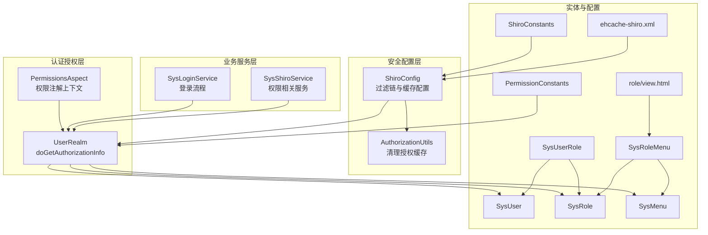
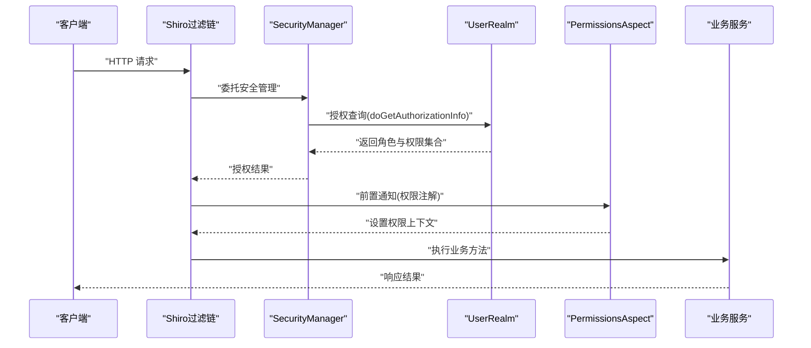
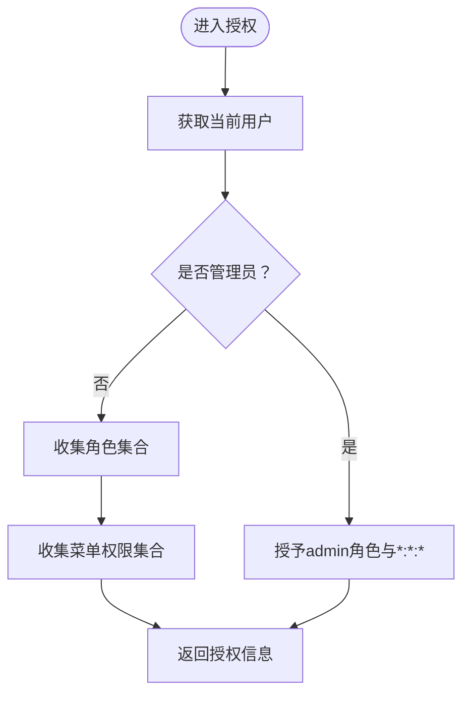
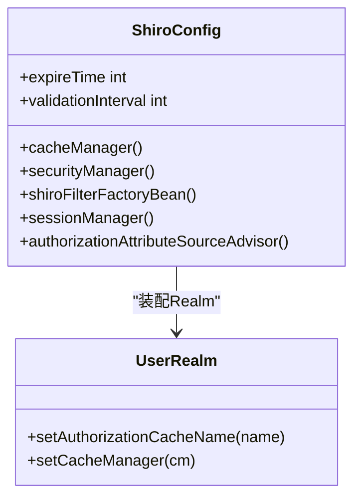
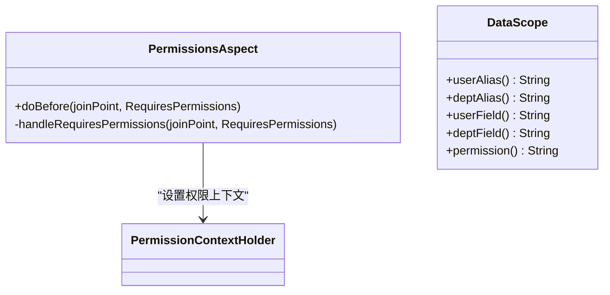
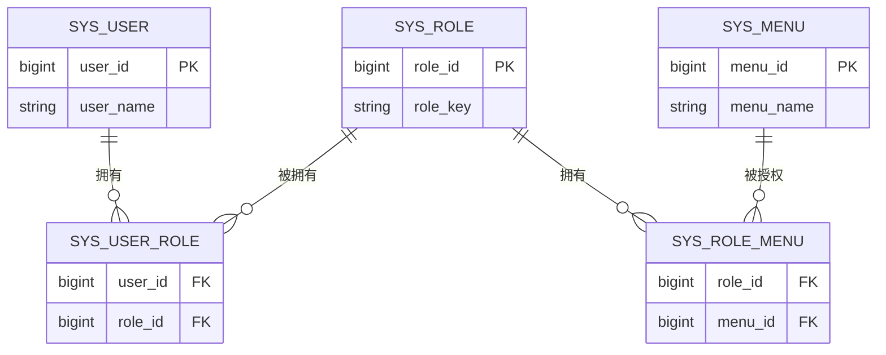
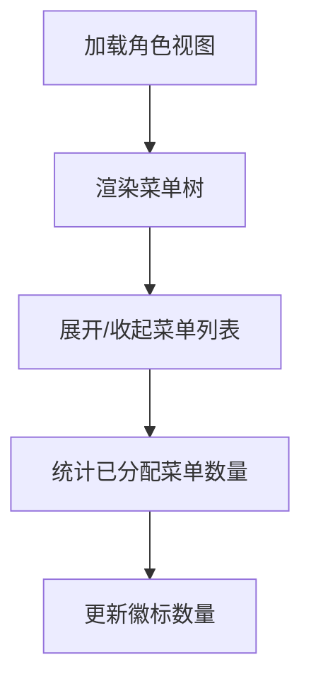
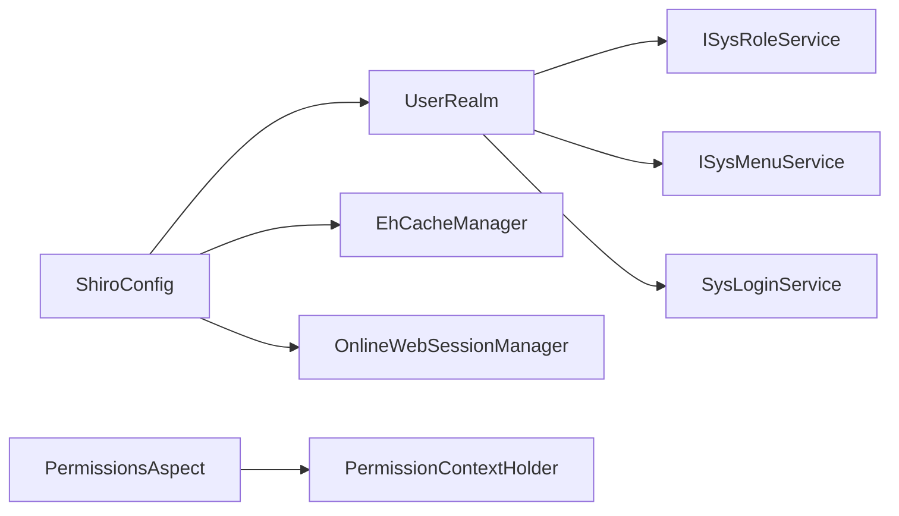

# 权限问题

<cite>
**本文引用的文件**
- [UserRealm.java](file://GenShin/RuoYi-master/ruoyi-framework/src/main/java/com/ruoyi/framework/shiro/realm/UserRealm.java)
- [ShiroConfig.java](file://GenShin/RuoYi-master/ruoyi-framework/src/main/java/com/ruoyi/framework/config/ShiroConfig.java)
- [ehcache-shiro.xml](file://GenShin/RuoYi-master/ruoyi-admin/src/main/resources/ehcache/ehcache-shiro.xml)
- [AuthorizationUtils.java](file://GenShin/RuoYi-master/ruoyi-framework/src/main/java/com/ruoyi/framework/shiro/util/AuthorizationUtils.java)
- [PermissionsAspect.java](file://GenShin/RuoYi-master/ruoyi-framework/src/main/java/com/ruoyi/framework/aspectj/PermissionsAspect.java)
- [DataScope.java](file://GenShin/RuoYi-master/ruoyi-common/src/main/java/com/ruoyi/common/annotation/DataScope.java)
- [PermissionConstants.java](file://GenShin/RuoYi-master/ruoyi-common/src/main/java/com/ruoyi/common/constant/PermissionConstants.java)
- [ShiroConstants.java](file://GenShin/RuoYi-master/ruoyi-common/src/main/java/com/ruoyi/common/constant/ShiroConstants.java)
- [SysShiroService.java](file://GenShin/RuoYi-master/ruoyi-framework/src/main/java/com/ruoyi/framework/shiro/service/SysShiroService.java)
- [SysLoginService.java](file://GenShin/RuoYi-master/ruoyi-framework/src/main/java/com/ruoyi/framework/shiro/service/SysLoginService.java)
- [SysRole.java](file://GenShin/RuoYi-master/ruoyi-common/src/main/java/com/ruoyi/common/core/domain/entity/SysRole.java)
- [SysUser.java](file://GenShin/RuoYi-master/ruoyi-common/src/main/java/com/ruoyi/common/core/domain/entity/SysUser.java)
- [SysMenu.java](file://GenShin/RuoYi-master/ruoyi-common/src/main/java/com/ruoyi/common/core/domain/entity/SysMenu.java)
- [SysUserRole.java](file://GenShin/RuoYi-master/ruoyi-system/src/main/java/com/ruoyi/system/domain/SysUserRole.java)
- [SysRoleMenu.java](file://GenShin/RuoYi-master/ruoyi-system/src/main/java/com/ruoyi/system/domain/SysRoleMenu.java)
- [view.html](file://GenShin/RuoYi-master/ruoyi-admin/src/main/resources/templates/system/role/view.html)
- [application.yml](file://GenShin/RuoYi-master/ruoyi-admin/src/main/resources/application.yml)
- [logback.xml](file://GenShin/RuoYi-master/ruoyi-admin/src/main/resources/logback.xml)
</cite>

## 目录
1. [简介](#简介)
2. [项目结构](#项目结构)
3. [核心组件](#核心组件)
4. [架构总览](#架构总览)
5. [详细组件分析](#详细组件分析)
6. [依赖分析](#依赖分析)
7. [性能考虑](#性能考虑)
8. [故障排除指南](#故障排除指南)
9. [结论](#结论)
10. [附录](#附录)

## 简介
本指南面向原神攻略系统的权限问题，聚焦于用户登录失败、权限验证错误、角色权限配置问题的诊断与修复。内容覆盖 Shiro 安全框架在本项目中的配置与使用，包括 Realm 配置、权限注解、会话管理、权限缓存、权限继承与菜单权限配置等常见问题，并提供调试工具与日志分析方法，帮助快速定位与解决问题。

## 项目结构
围绕权限与安全的关键模块分布如下：
- 安全配置与过滤链：ShiroConfig、CustomShiroFilterFactoryBean
- 认证与授权核心：UserRealm、AuthorizationUtils
- 权限注解与数据范围：PermissionsAspect、DataScope
- 常量与配置：PermissionConstants、ShiroConstants、application.yml
- 实体与映射：SysUser、SysRole、SysMenu、SysUserRole、SysRoleMenu
- 缓存配置：ehcache-shiro.xml
- 视图与前端交互：role/view.html（菜单权限勾选界面）

图表来源
- [ShiroConfig.java:196-211](file://GenShin/RuoYi-master/ruoyi-framework/src/main/java/com/ruoyi/framework/config/ShiroConfig.java#L196-L211)
- [UserRealm.java:56-70](file://GenShin/RuoYi-master/ruoyi-framework/src/main/java/com/ruoyi/framework/shiro/realm/UserRealm.java#L56-L70)
- [PermissionsAspect.java:20-29](file://GenShin/RuoYi-master/ruoyi-framework/src/main/java/com/ruoyi/framework/aspectj/PermissionsAspect.java#L20-L29)
- [SysLoginService.java](file://GenShin/RuoYi-master/ruoyi-framework/src/main/java/com/ruoyi/framework/shiro/service/SysLoginService.java)
- [SysShiroService.java](file://GenShin/RuoYi-master/ruoyi-framework/src/main/java/com/ruoyi/framework/shiro/service/SysShiroService.java)
- [SysUserRole.java](file://GenShin/RuoYi-master/ruoyi-system/src/main/java/com/ruoyi/system/domain/SysUserRole.java)
- [SysRoleMenu.java](file://GenShin/RuoYi-master/ruoyi-system/src/main/java/com/ruoyi/system/domain/SysRoleMenu.java)
- [PermissionConstants.java](file://GenShin/RuoYi-master/ruoyi-common/src/main/java/com/ruoyi/common/constant/PermissionConstants.java)
- [ShiroConstants.java](file://GenShin/RuoYi-master/ruoyi-common/src/main/java/com/ruoyi/common/constant/ShiroConstants.java)
- [ehcache-shiro.xml:45-54](file://GenShin/RuoYi-master/ruoyi-admin/src/main/resources/ehcache/ehcache-shiro.xml#L45-L54)
- [view.html:346-419](file://GenShin/RuoYi-master/ruoyi-admin/src/main/resources/templates/system/role/view.html#L346-L419)

章节来源
- [ShiroConfig.java:196-211](file://GenShin/RuoYi-master/ruoyi-framework/src/main/java/com/ruoyi/framework/config/ShiroConfig.java#L196-L211)
- [UserRealm.java:56-70](file://GenShin/RuoYi-master/ruoyi-framework/src/main/java/com/ruoyi/framework/shiro/realm/UserRealm.java#L56-L70)
- [PermissionsAspect.java:20-29](file://GenShin/RuoYi-master/ruoyi-framework/src/main/java/com/ruoyi/framework/aspectj/PermissionsAspect.java#L20-L29)

## 核心组件
- UserRealm：实现授权逻辑，基于当前用户的角色与菜单构建授权信息；管理员拥有全部权限；支持清理授权缓存。
- ShiroConfig：定义 SecurityManager、Realm、缓存管理器、过滤链、会话管理器等；提供 Ehcache 配置输入流以避免热部署问题。
- AuthorizationUtils：提供清理所有用户授权缓存的能力，便于权限变更后的强制刷新。
- PermissionsAspect：将控制器上的权限注解值注入到请求上下文中，支持多角色匹配的权限校验。
- DataScope：数据权限注解，支持按用户或部门维度进行数据范围控制。
- 实体与映射：SysUser、SysRole、SysMenu、SysUserRole、SysRoleMenu 构成用户-角色-菜单三层关系。
- 缓存配置：ehcache-shiro.xml 中定义 sys-authCache 等缓存项，确保授权信息可缓存但不过度过期。
- 视图：role/view.html 提供菜单权限勾选界面，前端通过 JS 统计已分配菜单数量。

章节来源
- [UserRealm.java:56-70](file://GenShin/RuoYi-master/ruoyi-framework/src/main/java/com/ruoyi/framework/shiro/realm/UserRealm.java#L56-L70)
- [UserRealm.java:141-158](file://GenShin/RuoYi-master/ruoyi-framework/src/main/java/com/ruoyi/framework/shiro/realm/UserRealm.java#L141-L158)
- [ShiroConfig.java:196-211](file://GenShin/RuoYi-master/ruoyi-framework/src/main/java/com/ruoyi/framework/config/ShiroConfig.java#L196-L211)
- [AuthorizationUtils.java:14-30](file://GenShin/RuoYi-master/ruoyi-framework/src/main/java/com/ruoyi/framework/shiro/util/AuthorizationUtils.java#L14-L30)
- [PermissionsAspect.java:20-29](file://GenShin/RuoYi-master/ruoyi-framework/src/main/java/com/ruoyi/framework/aspectj/PermissionsAspect.java#L20-L29)
- [DataScope.java:14-43](file://GenShin/RuoYi-master/ruoyi-common/src/main/java/com/ruoyi/common/annotation/DataScope.java#L14-L43)
- [ehcache-shiro.xml:45-54](file://GenShin/RuoYi-master/ruoyi-admin/src/main/resources/ehcache/ehcache-shiro.xml#L45-L54)
- [view.html:385-400](file://GenShin/RuoYi-master/ruoyi-admin/src/main/resources/templates/system/role/view.html#L385-L400)

## 架构总览
下图展示从请求进入、过滤链处理、Realm 授权、到权限注解生效的整体流程。

图表来源
- [ShiroConfig.java:196-211](file://GenShin/RuoYi-master/ruoyi-framework/src/main/java/com/ruoyi/framework/config/ShiroConfig.java#L196-L211)
- [UserRealm.java:56-70](file://GenShin/RuoYi-master/ruoyi-framework/src/main/java/com/ruoyi/framework/shiro/realm/UserRealm.java#L56-L70)
- [PermissionsAspect.java:20-29](file://GenShin/RuoYi-master/ruoyi-framework/src/main/java/com/ruoyi/framework/aspectj/PermissionsAspect.java#L20-L29)

## 详细组件分析

### UserRealm 授权流程
- 管理员直接授予 admin 角色与通配权限；普通用户通过角色与菜单构建授权集合。
- 支持清理单个主体或全部授权缓存，便于权限变更后即时生效。

图表来源
- [UserRealm.java:56-70](file://GenShin/RuoYi-master/ruoyi-framework/src/main/java/com/ruoyi/framework/shiro/realm/UserRealm.java#L56-L70)
- [UserRealm.java:141-158](file://GenShin/RuoYi-master/ruoyi-framework/src/main/java/com/ruoyi/framework/shiro/realm/UserRealm.java#L141-L158)

章节来源
- [UserRealm.java:56-70](file://GenShin/RuoYi-master/ruoyi-framework/src/main/java/com/ruoyi/framework/shiro/realm/UserRealm.java#L56-L70)
- [UserRealm.java:141-158](file://GenShin/RuoYi-master/ruoyi-framework/src/main/java/com/ruoyi/framework/shiro/realm/UserRealm.java#L141-L158)

### ShiroConfig 安全配置
- 定义 SecurityManager、Realm、缓存管理器、过滤链工厂、会话管理器与调度器。
- 使用 EhCache 管理器并提供动态读取 ehcache 配置的输入流，避免热部署时配置文件被占用导致无法重载。

图表来源
- [ShiroConfig.java:196-211](file://GenShin/RuoYi-master/ruoyi-framework/src/main/java/com/ruoyi/framework/config/ShiroConfig.java#L196-L211)

章节来源
- [ShiroConfig.java:196-211](file://GenShin/RuoYi-master/ruoyi-framework/src/main/java/com/ruoyi/framework/config/ShiroConfig.java#L196-L211)

### 权限注解与数据范围
- PermissionsAspect 将控制器上的权限注解值放入请求上下文，便于后续权限校验。
- DataScope 注解用于方法级数据权限过滤，支持用户与部门字段别名及权限字符串。

图表来源
- [PermissionsAspect.java:20-29](file://GenShin/RuoYi-master/ruoyi-framework/src/main/java/com/ruoyi/framework/aspectj/PermissionsAspect.java#L20-L29)
- [DataScope.java:14-43](file://GenShin/RuoYi-master/ruoyi-common/src/main/java/com/ruoyi/common/annotation/DataScope.java#L14-L43)

章节来源
- [PermissionsAspect.java:20-29](file://GenShin/RuoYi-master/ruoyi-framework/src/main/java/com/ruoyi/framework/aspectj/PermissionsAspect.java#L20-L29)
- [DataScope.java:14-43](file://GenShin/RuoYi-master/ruoyi-common/src/main/java/com/ruoyi/common/annotation/DataScope.java#L14-L43)

### 实体与权限映射
- 用户-角色：SysUserRole
- 角色-菜单：SysRoleMenu
- 用户-菜单：通过角色间接关联

图表来源
- [SysUserRole.java](file://GenShin/RuoYi-master/ruoyi-system/src/main/java/com/ruoyi/system/domain/SysUserRole.java)
- [SysRoleMenu.java](file://GenShin/RuoYi-master/ruoyi-system/src/main/java/com/ruoyi/system/domain/SysRoleMenu.java)
- [SysUser.java](file://GenShin/RuoYi-master/ruoyi-common/src/main/java/com/ruoyi/common/core/domain/entity/SysUser.java)
- [SysRole.java](file://GenShin/RuoYi-master/ruoyi-common/src/main/java/com/ruoyi/common/core/domain/entity/SysRole.java)
- [SysMenu.java](file://GenShin/RuoYi-master/ruoyi-common/src/main/java/com/ruoyi/common/core/domain/entity/SysMenu.java)

章节来源
- [SysUserRole.java](file://GenShin/RuoYi-master/ruoyi-system/src/main/java/com/ruoyi/system/domain/SysUserRole.java)
- [SysRoleMenu.java](file://GenShin/RuoYi-master/ruoyi-system/src/main/java/com/ruoyi/system/domain/SysRoleMenu.java)
- [SysUser.java](file://GenShin/RuoYi-master/ruoyi-common/src/main/java/com/ruoyi/common/core/domain/entity/SysUser.java)
- [SysRole.java](file://GenShin/RuoYi-master/ruoyi-common/src/main/java/com/ruoyi/common/core/domain/entity/SysRole.java)
- [SysMenu.java](file://GenShin/RuoYi-master/ruoyi-common/src/main/java/com/ruoyi/common/core/domain/entity/SysMenu.java)

### 菜单权限配置界面
- role/view.html 提供菜单树形选择与数量统计，支持展开/收起菜单列表，便于管理员批量勾选菜单权限。

图表来源
- [view.html:346-419](file://GenShin/RuoYi-master/ruoyi-admin/src/main/resources/templates/system/role/view.html#L346-L419)

章节来源
- [view.html:346-419](file://GenShin/RuoYi-master/ruoyi-admin/src/main/resources/templates/system/role/view.html#L346-L419)

## 依赖分析
- ShiroConfig 依赖 UserRealm、EhCacheManager、在线会话管理器等组件。
- UserRealm 依赖 SysLoginService、ISysRoleService、ISysMenuService 以及 Shiro 工具类。
- PermissionsAspect 依赖 PermissionContextHolder 与 RequiresPermissions 注解。
- 缓存依赖 ehcache-shiro.xml 中的 sys-authCache 配置。

图表来源
- [ShiroConfig.java:196-211](file://GenShin/RuoYi-master/ruoyi-framework/src/main/java/com/ruoyi/framework/config/ShiroConfig.java#L196-L211)
- [UserRealm.java:44-51](file://GenShin/RuoYi-master/ruoyi-framework/src/main/java/com/ruoyi/framework/shiro/realm/UserRealm.java#L44-L51)
- [PermissionsAspect.java:20-29](file://GenShin/RuoYi-master/ruoyi-framework/src/main/java/com/ruoyi/framework/aspectj/PermissionsAspect.java#L20-L29)

章节来源
- [ShiroConfig.java:196-211](file://GenShin/RuoYi-master/ruoyi-framework/src/main/java/com/ruoyi/framework/config/ShiroConfig.java#L196-L211)
- [UserRealm.java:44-51](file://GenShin/RuoYi-master/ruoyi-framework/src/main/java/com/ruoyi/framework/shiro/realm/UserRealm.java#L44-L51)
- [PermissionsAspect.java:20-29](file://GenShin/RuoYi-master/ruoyi-framework/src/main/java/com/ruoyi/framework/aspectj/PermissionsAspect.java#L20-L29)

## 性能考虑
- 合理设置会话超时与验证间隔，避免频繁重建会话或过度扫描无效会话。
- 授权缓存建议启用且不过度过期，结合 AuthorizationUtils 在权限变更后主动清理缓存。
- 过滤链顺序应尽量减少不必要的拦截器调用，优先放行静态资源与公开接口。

## 故障排除指南

### 一、用户登录失败
常见原因与排查步骤：
1. 检查登录凭据是否正确，确认密码服务与加密方式一致。
2. 查看登录服务是否抛出用户不存在、密码不匹配、账户锁定等异常。
3. 确认 Shiro 过滤链未拦截登录请求路径，检查 PermitAllUrl 配置。
4. 检查会话管理器与在线会话 DAO 是否正常初始化。

建议定位文件
- [SysLoginService.java](file://GenShin/RuoYi-master/ruoyi-framework/src/main/java/com/ruoyi/framework/shiro/service/SysLoginService.java)
- [ShiroConfig.java:196-211](file://GenShin/RuoYi-master/ruoyi-framework/src/main/java/com/ruoyi/framework/config/ShiroConfig.java#L196-L211)
- [application.yml](file://GenShin/RuoYi-master/ruoyi-admin/src/main/resources/application.yml)

章节来源
- [SysLoginService.java](file://GenShin/RuoYi-master/ruoyi-framework/src/main/java/com/ruoyi/framework/shiro/service/SysLoginService.java)
- [ShiroConfig.java:196-211](file://GenShin/RuoYi-master/ruoyi-framework/src/main/java/com/ruoyi/framework/config/ShiroConfig.java#L196-L211)

### 二、权限验证错误
常见原因与排查步骤：
1. 确认控制器方法上是否正确添加权限注解，PermissionsAspect 是否生效。
2. 检查权限字符串格式与数据库中配置是否一致。
3. 若出现权限继承或通配符问题，核对管理员角色与通配权限配置。
4. 权限变更后未生效时，使用 AuthorizationUtils 清理授权缓存。

建议定位文件
- [PermissionsAspect.java:20-29](file://GenShin/RuoYi-master/ruoyi-framework/src/main/java/com/ruoyi/framework/aspectj/PermissionsAspect.java#L20-L29)
- [UserRealm.java:56-70](file://GenShin/RuoYi-master/ruoyi-framework/src/main/java/com/ruoyi/framework/shiro/realm/UserRealm.java#L56-L70)
- [AuthorizationUtils.java:14-30](file://GenShin/RuoYi-master/ruoyi-framework/src/main/java/com/ruoyi/framework/shiro/util/AuthorizationUtils.java#L14-L30)

章节来源
- [PermissionsAspect.java:20-29](file://GenShin/RuoYi-master/ruoyi-framework/src/main/java/com/ruoyi/framework/aspectj/PermissionsAspect.java#L20-L29)
- [UserRealm.java:56-70](file://GenShin/RuoYi-master/ruoyi-framework/src/main/java/com/ruoyi/framework/shiro/realm/UserRealm.java#L56-L70)
- [AuthorizationUtils.java:14-30](file://GenShin/RuoYi-master/ruoyi-framework/src/main/java/com/ruoyi/framework/shiro/util/AuthorizationUtils.java#L14-L30)

### 三、角色权限配置问题
常见原因与排查步骤：
1. 确认用户与角色的关联关系是否正确写入 SysUserRole。
2. 确认角色与菜单的关联关系是否正确写入 SysRoleMenu。
3. 检查菜单权限勾选界面是否正确提交，查看前端统计数量是否与预期一致。

建议定位文件
- [SysUserRole.java](file://GenShin/RuoYi-master/ruoyi-system/src/main/java/com/ruoyi/system/domain/SysUserRole.java)
- [SysRoleMenu.java](file://GenShin/RuoYi-master/ruoyi-system/src/main/java/com/ruoyi/system/domain/SysRoleMenu.java)
- [view.html:385-400](file://GenShin/RuoYi-master/ruoyi-admin/src/main/resources/templates/system/role/view.html#L385-L400)

章节来源
- [SysUserRole.java](file://GenShin/RuoYi-master/ruoyi-system/src/main/java/com/ruoyi/system/domain/SysUserRole.java)
- [SysRoleMenu.java](file://GenShin/RuoYi-master/ruoyi-system/src/main/java/com/ruoyi/system/domain/SysRoleMenu.java)
- [view.html:385-400](file://GenShin/RuoYi-master/ruoyi-admin/src/main/resources/templates/system/role/view.html#L385-L400)

### 四、Shiro 相关问题排查
- Realm 配置：确认 UserRealm 的缓存名称与缓存管理器正确装配。
- 权限注解：确认 @RequiresPermissions 注解与 PermissionsAspect 协同工作。
- 会话管理：检查在线会话 DAO、会话工厂与会话管理器配置。
- 缓存问题：确认 ehcache-shiro.xml 中 sys-authCache 配置合理，必要时通过 AuthorizationUtils 清理。

建议定位文件
- [ShiroConfig.java:196-211](file://GenShin/RuoYi-master/ruoyi-framework/src/main/java/com/ruoyi/framework/config/ShiroConfig.java#L196-L211)
- [UserRealm.java:141-158](file://GenShin/RuoYi-master/ruoyi-framework/src/main/java/com/ruoyi/framework/shiro/realm/UserRealm.java#L141-L158)
- [ehcache-shiro.xml:45-54](file://GenShin/RuoYi-master/ruoyi-admin/src/main/resources/ehcache/ehcache-shiro.xml#L45-L54)
- [AuthorizationUtils.java:14-30](file://GenShin/RuoYi-master/ruoyi-framework/src/main/java/com/ruoyi/framework/shiro/util/AuthorizationUtils.java#L14-L30)

章节来源
- [ShiroConfig.java:196-211](file://GenShin/RuoYi-master/ruoyi-framework/src/main/java/com/ruoyi/framework/config/ShiroConfig.java#L196-L211)
- [UserRealm.java:141-158](file://GenShin/RuoYi-master/ruoyi-framework/src/main/java/com/ruoyi/framework/shiro/realm/UserRealm.java#L141-L158)
- [ehcache-shiro.xml:45-54](file://GenShin/RuoYi-master/ruoyi-admin/src/main/resources/ehcache/ehcache-shiro.xml#L45-L54)
- [AuthorizationUtils.java:14-30](file://GenShin/RuoYi-master/ruoyi-framework/src/main/java/com/ruoyi/framework/shiro/util/AuthorizationUtils.java#L14-L30)

### 五、权限缓存问题
- 现象：权限变更后仍沿用旧权限。
- 处理：调用 AuthorizationUtils 清理授权缓存；检查 EhCache 配置是否正确加载。
- 验证：重新登录或触发一次授权查询，确认新权限生效。

建议定位文件
- [AuthorizationUtils.java:14-30](file://GenShin/RuoYi-master/ruoyi-framework/src/main/java/com/ruoyi/framework/shiro/util/AuthorizationUtils.java#L14-L30)
- [ehcache-shiro.xml:45-54](file://GenShin/RuoYi-master/ruoyi-admin/src/main/resources/ehcache/ehcache-shiro.xml#L45-L54)

章节来源
- [AuthorizationUtils.java:14-30](file://GenShin/RuoYi-master/ruoyi-framework/src/main/java/com/ruoyi/framework/shiro/util/AuthorizationUtils.java#L14-L30)
- [ehcache-shiro.xml:45-54](file://GenShin/RuoYi-master/ruoyi-admin/src/main/resources/ehcache/ehcache-shiro.xml#L45-L54)

### 六、权限继承关系错误
- 现象：管理员角色未获得全部权限。
- 处理：检查 UserRealm 中管理员权限授予逻辑；确认角色键与权限字符串一致。
- 验证：以管理员身份登录，尝试访问所有受控功能。

建议定位文件
- [UserRealm.java:56-70](file://GenShin/RuoYi-master/ruoyi-framework/src/main/java/com/ruoyi/framework/shiro/realm/UserRealm.java#L56-L70)

章节来源
- [UserRealm.java:56-70](file://GenShin/RuoYi-master/ruoyi-framework/src/main/java/com/ruoyi/framework/shiro/realm/UserRealm.java#L56-L70)

### 七、菜单权限配置错误
- 现象：菜单不可见或按钮无权限。
- 处理：在角色视图中勾选对应菜单；确认 SysRoleMenu 写入成功；检查菜单树渲染与数量统计。
- 验证：切换角色后刷新页面，确认菜单显示与按钮可用性。

建议定位文件
- [view.html:346-419](file://GenShin/RuoYi-master/ruoyi-admin/src/main/resources/templates/system/role/view.html#L346-L419)
- [SysRoleMenu.java](file://GenShin/RuoYi-master/ruoyi-system/src/main/java/com/ruoyi/system/domain/SysRoleMenu.java)

章节来源
- [view.html:346-419](file://GenShin/RuoYi-master/ruoyi-admin/src/main/resources/templates/system/role/view.html#L346-L419)
- [SysRoleMenu.java](file://GenShin/RuoYi-master/ruoyi-system/src/main/java/com/ruoyi/system/domain/SysRoleMenu.java)

### 八、权限调试工具与日志分析
- 调试工具：AuthorizationUtils 提供清理授权缓存能力；PermissionsAspect 将权限注解读入上下文，便于断点观察。
- 日志分析：结合 logback.xml 输出 Shiro 与业务日志，关注认证、授权、会话状态变化等关键节点。

建议定位文件
- [AuthorizationUtils.java:14-30](file://GenShin/RuoYi-master/ruoyi-framework/src/main/java/com/ruoyi/framework/shiro/util/AuthorizationUtils.java#L14-L30)
- [PermissionsAspect.java:20-29](file://GenShin/RuoYi-master/ruoyi-framework/src/main/java/com/ruoyi/framework/aspectj/PermissionsAspect.java#L20-L29)
- [logback.xml](file://GenShin/RuoYi-master/ruoyi-admin/src/main/resources/logback.xml)

章节来源
- [AuthorizationUtils.java:14-30](file://GenShin/RuoYi-master/ruoyi-framework/src/main/java/com/ruoyi/framework/shiro/util/AuthorizationUtils.java#L14-L30)
- [PermissionsAspect.java:20-29](file://GenShin/RuoYi-master/ruoyi-framework/src/main/java/com/ruoyi/framework/aspectj/PermissionsAspect.java#L20-L29)
- [logback.xml](file://GenShin/RuoYi-master/ruoyi-admin/src/main/resources/logback.xml)

## 结论
本指南围绕原神攻略系统的权限问题提供了从架构到实现细节的系统化排查路径。通过理解 UserRealm 的授权机制、ShiroConfig 的配置要点、权限注解与数据范围的协同、以及缓存与会话管理的配合，可以高效定位并解决登录失败、权限验证错误、角色与菜单配置问题。建议在权限变更后及时清理授权缓存，并结合日志与调试工具进行验证。

## 附录
- 常用常量参考
  - [PermissionConstants.java](file://GenShin/RuoYi-master/ruoyi-common/src/main/java/com/ruoyi/common/constant/PermissionConstants.java)
  - [ShiroConstants.java](file://GenShin/RuoYi-master/ruoyi-common/src/main/java/com/ruoyi/common/constant/ShiroConstants.java)
- 配置文件参考
  - [application.yml](file://GenShin/RuoYi-master/ruoyi-admin/src/main/resources/application.yml)
  - [logback.xml](file://GenShin/RuoYi-master/ruoyi-admin/src/main/resources/logback.xml)
  - [ehcache-shiro.xml](file://GenShin/RuoYi-master/ruoyi-admin/src/main/resources/ehcache/ehcache-shiro.xml)