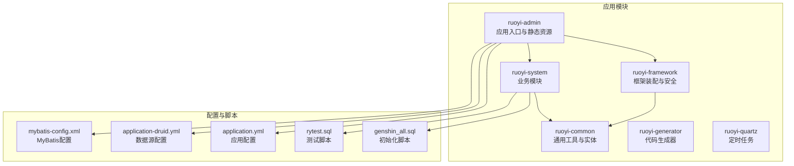
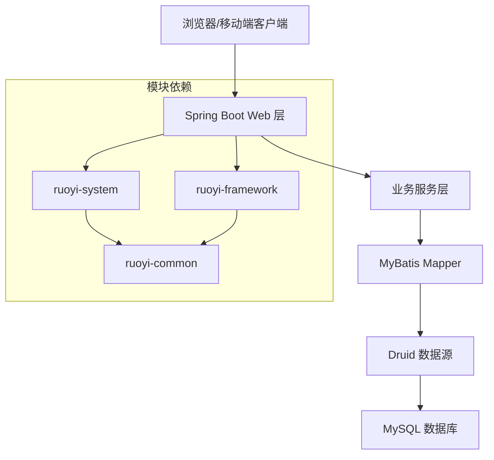
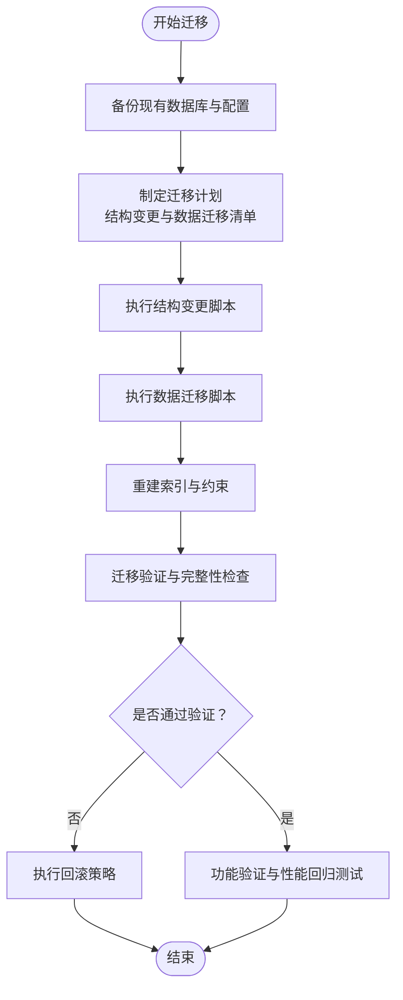
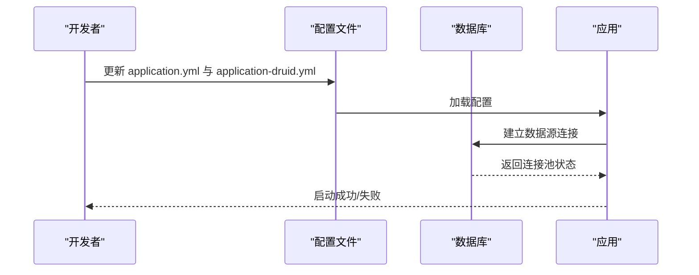
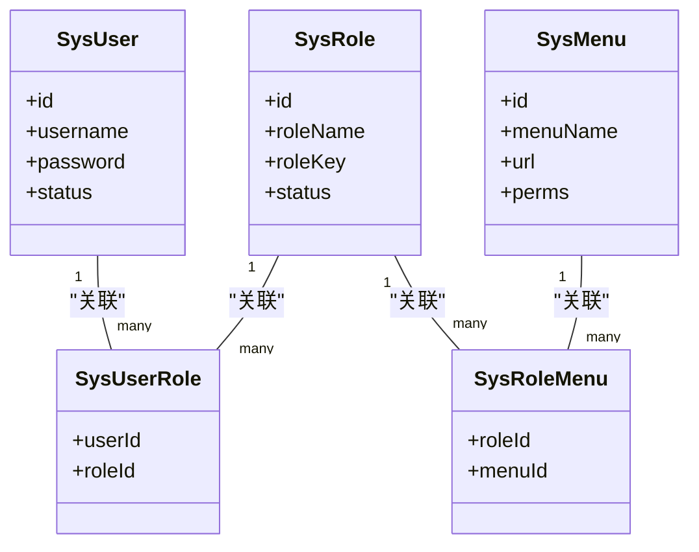
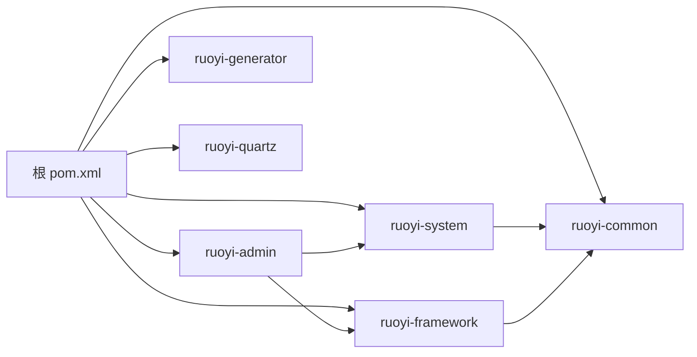

# 迁移问题

<cite>
**本文引用的文件**
- [GENSHIN_MODULE_GUIDE.md](file://GenShin/RuoYi-master/GENSHIN_MODULE_GUIDE.md)
- [迁移指南.md](file://GenShin/RuoYi-master/迁移指南.md)
- [README.md](file://GenShin/RuoYi-master/README.md)
- [pom.xml](file://GenShin/RuoYi-master/pom.xml)
- [ruoyi-admin/pom.xml](file://GenShin/RuoYi-master/ruoyi-admin/pom.xml)
- [ruoyi-common/pom.xml](file://GenShin/RuoYi-master/ruoyi-common/pom.xml)
- [ruoyi-framework/pom.xml](file://GenShin/RuoYi-master/ruoyi-framework/pom.xml)
- [ruoyi-generator/pom.xml](file://GenShin/RuoYi-master/ruoyi-generator/pom.xml)
- [ruoyi-quartz/pom.xml](file://GenShin/RuoYi-master/ruoyi-quartz/pom.xml)
- [ruoyi-system/pom.xml](file://GenShin/RuoYi-master/ruoyi-system/pom.xml)
- [application.yml](file://GenShin/RuoYi-master/ruoyi-admin/src/main/resources/application.yml)
- [application-druid.yml](file://GenShin/RuoYi-master/ruoyi-admin/src/main/resources/application-druid.yml)
- [mybatis-config.xml](file://GenShin/RuoYi-master/ruoyi-admin/src/main/resources/mybatis/mybatis-config.xml)
- [genshin_all.sql](file://GenShin/RuoYi-master/sql/genshin_all.sql)
- [rytest.sql](file://GenShin/RuoYi-master/sql/rytest.sql)
</cite>

## 目录
1. [简介](#简介)
2. [项目结构](#项目结构)
3. [核心组件](#核心组件)
4. [架构总览](#架构总览)
5. [详细组件分析](#详细组件分析)
6. [依赖分析](#依赖分析)
7. [性能考虑](#性能考虑)
8. [故障排除指南](#故障排除指南)
9. [结论](#结论)
10. [附录](#附录)

## 简介
本指南面向原神攻略系统在版本升级与数据迁移过程中的专业运维与开发人员，聚焦以下目标：
- 版本升级过程中的数据兼容性问题识别与处理
- 数据库结构变更的迁移策略与验证方法
- 配置文件更新与环境适配要点
- 迁移全流程：备份、迁移、验证、回滚
- 升级后功能验证、数据完整性检查与性能回归测试
- 常见迁移错误的预防与应急处理
- 完整迁移流程与最佳实践建议

本项目基于 RuoYi 框架构建，采用多模块 Maven 结构，前端模板与后端服务分离，数据库访问通过 MyBatis 实现，配置集中于 application.yml 与 druid 数据源配置。

## 项目结构
项目采用分层与模块化组织方式，核心模块包括：
- ruoyi-admin：管理端应用入口与静态资源
- ruoyi-common：通用工具、常量、异常与实体基类
- ruoyi-framework：框架装配、拦截器、Shiro 安全、MyBatis 配置
- ruoyi-system：业务模块（角色、用户、字典、公告、角色菜单权限等）
- ruoyi-generator：代码生成器
- ruoyi-quartz：定时任务调度
- sql：数据库初始化与测试脚本

**图表来源**
- [pom.xml:1-200](file://GenShin/RuoYi-master/pom.xml#L1-L200)
- [ruoyi-admin/pom.xml:1-120](file://GenShin/RuoYi-master/ruoyi-admin/pom.xml#L1-L120)
- [ruoyi-system/pom.xml:1-120](file://GenShin/RuoYi-master/ruoyi-system/pom.xml#L1-L120)
- [application.yml:1-200](file://GenShin/RuoYi-master/ruoyi-admin/src/main/resources/application.yml#L1-L200)
- [application-druid.yml:1-200](file://GenShin/RuoYi-master/ruoyi-admin/src/main/resources/application-druid.yml#L1-L200)
- [mybatis-config.xml:1-200](file://GenShin/RuoYi-master/ruoyi-admin/src/main/resources/mybatis/mybatis-config.xml#L1-L200)
- [genshin_all.sql:1-200](file://GenShin/RuoYi-master/sql/genshin_all.sql#L1-L200)
- [rytest.sql:1-200](file://GenShin/RuoYi-master/sql/rytest.sql#L1-L200)

**章节来源**
- [pom.xml:1-200](file://GenShin/RuoYi-master/pom.xml#L1-L200)
- [README.md:1-200](file://GenShin/RuoYi-master/README.md#L1-L200)

## 核心组件
- 应用入口与启动类：ruoyi-admin 模块包含应用启动类与静态资源，负责加载配置与启动 Web 容器。
- 框架装配：ruoyi-framework 提供 MyBatis 配置、Shiro 安全配置、过滤器链、异步任务管理等。
- 业务模块：ruoyi-system 提供角色、用户、字典、公告、角色菜单权限等业务接口与 Mapper/XML。
- 通用工具：ruoyi-common 提供实体基类、分页模型、常量、工具类与异常体系。
- 代码生成器：ruoyi-generator 支持根据表结构生成前后端代码，便于快速迭代与结构变更。
- 定时任务：ruoyi-quartz 提供作业调度能力，可用于数据同步或周期性维护任务。
- 配置文件：application.yml 与 application-druid.yml 统一管理数据库连接、日志、缓存等参数。
- 数据库脚本：sql 目录包含初始化与测试脚本，用于数据库结构与基础数据准备。

**章节来源**
- [ruoyi-admin/pom.xml:1-120](file://GenShin/RuoYi-master/ruoyi-admin/pom.xml#L1-L120)
- [ruoyi-framework/pom.xml:1-120](file://GenShin/RuoYi-master/ruoyi-framework/pom.xml#L1-L120)
- [ruoyi-system/pom.xml:1-120](file://GenShin/RuoYi-master/ruoyi-system/pom.xml#L1-L120)
- [ruoyi-common/pom.xml:1-120](file://GenShin/RuoYi-master/ruoyi-common/pom.xml#L1-L120)
- [ruoyi-generator/pom.xml:1-120](file://GenShin/RuoYi-master/ruoyi-generator/pom.xml#L1-L120)
- [ruoyi-quartz/pom.xml:1-120](file://GenShin/RuoYi-master/ruoyi-quartz/pom.xml#L1-L120)

## 架构总览
系统采用前后端分离架构，后端以 Spring Boot + MyBatis 为核心，通过多模块聚合构建，统一配置与依赖管理。数据库访问通过 MyBatis 映射器与 XML SQL 定义实现，数据源由 Druid 提供连接池能力。

**图表来源**
- [application.yml:1-200](file://GenShin/RuoYi-master/ruoyi-admin/src/main/resources/application.yml#L1-L200)
- [application-druid.yml:1-200](file://GenShin/RuoYi-master/ruoyi-admin/src/main/resources/application-druid.yml#L1-L200)
- [mybatis-config.xml:1-200](file://GenShin/RuoYi-master/ruoyi-admin/src/main/resources/mybatis/mybatis-config.xml#L1-L200)
- [pom.xml:1-200](file://GenShin/RuoYi-master/pom.xml#L1-L200)

## 详细组件分析

### 数据库层与迁移策略
- 初始化与增量脚本：使用 sql 目录下的脚本进行数据库初始化与测试数据准备。迁移时应优先执行结构变更脚本，再执行数据迁移脚本，最后执行索引与约束重建。
- 数据源配置：application-druid.yml 提供 Druid 连接池参数，包括初始化大小、最小/最大空闲、超时时间等，需结合业务并发调整。
- MyBatis 配置：mybatis-config.xml 控制映射器扫描路径与全局设置，确保新增 Mapper 能被正确发现与加载。

**图表来源**
- [migration_guide.md:1-200](file://GenShin/RuoYi-master/迁移指南.md#L1-L200)
- [genshin_all.sql:1-200](file://GenShin/RuoYi-master/sql/genshin_all.sql#L1-L200)
- [rytest.sql:1-200](file://GenShin/RuoYi-master/sql/rytest.sql#L1-L200)
- [application-druid.yml:1-200](file://GenShin/RuoYi-master/ruoyi-admin/src/main/resources/application-druid.yml#L1-L200)
- [mybatis-config.xml:1-200](file://GenShin/RuoYi-master/ruoyi-admin/src/main/resources/mybatis/mybatis-config.xml#L1-L200)

**章节来源**
- [migration_guide.md:1-200](file://GenShin/RuoYi-master/迁移指南.md#L1-L200)
- [genshin_all.sql:1-200](file://GenShin/RuoYi-master/sql/genshin_all.sql#L1-L200)
- [rytest.sql:1-200](file://GenShin/RuoYi-master/sql/rytest.sql#L1-L200)
- [application-druid.yml:1-200](file://GenShin/RuoYi-master/ruoyi-admin/src/main/resources/application-druid.yml#L1-L200)
- [mybatis-config.xml:1-200](file://GenShin/RuoYi-master/ruoyi-admin/src/main/resources/mybatis/mybatis-config.xml#L1-L200)

### 配置文件与环境适配
- application.yml：集中管理应用运行参数，如端口、日志级别、缓存、数据库连接等。升级时需核对新增配置项与默认值变化。
- application-druid.yml：集中管理数据源参数，包括连接池大小、超时、监控等。升级后需评估连接池参数与业务负载匹配度。
- mybatis-config.xml：控制 MyBatis 扫描包与全局设置，新增 Mapper 路径需在此处声明。

**图表来源**
- [application.yml:1-200](file://GenShin/RuoYi-master/ruoyi-admin/src/main/resources/application.yml#L1-L200)
- [application-druid.yml:1-200](file://GenShin/RuoYi-master/ruoyi-admin/src/main/resources/application-druid.yml#L1-L200)
- [mybatis-config.xml:1-200](file://GenShin/RuoYi-master/ruoyi-admin/src/main/resources/mybatis/mybatis-config.xml#L1-L200)

**章节来源**
- [application.yml:1-200](file://GenShin/RuoYi-master/ruoyi-admin/src/main/resources/application.yml#L1-L200)
- [application-druid.yml:1-200](file://GenShin/RuoYi-master/ruoyi-admin/src/main/resources/application-druid.yml#L1-L200)
- [mybatis-config.xml:1-200](file://GenShin/RuoYi-master/ruoyi-admin/src/main/resources/mybatis/mybatis-config.xml#L1-L200)

### 业务模块与数据一致性
- 业务模块 ruoyi-system 提供角色、用户、字典、公告、角色菜单权限等业务能力。升级涉及结构变更时，需确保业务接口与数据模型保持一致。
- 代码生成器 ruoyi-generator 可辅助生成 CRUD 对应的 Mapper、XML 与控制器，减少手工维护成本，降低迁移过程中的遗漏风险。

**图表来源**
- [ruoyi-system/pom.xml:1-120](file://GenShin/RuoYi-master/ruoyi-system/pom.xml#L1-L120)

**章节来源**
- [ruoyi-system/pom.xml:1-120](file://GenShin/RuoYi-master/ruoyi-system/pom.xml#L1-L120)

## 依赖分析
- 聚合工程：根 pom.xml 管理各模块依赖与插件，确保版本统一与构建一致性。
- 模块间耦合：ruoyi-admin 依赖 ruoyi-framework 与 ruoyi-system；ruoyi-system 依赖 ruoyi-common；ruoyi-framework 依赖 ruoyi-common。升级时需关注跨模块接口变更与兼容性。
- 外部依赖：MyBatis、Druid、Shiro、Quartz 等核心组件版本升级需进行兼容性测试。

**图表来源**
- [pom.xml:1-200](file://GenShin/RuoYi-master/pom.xml#L1-L200)
- [ruoyi-admin/pom.xml:1-120](file://GenShin/RuoYi-master/ruoyi-admin/pom.xml#L1-L120)
- [ruoyi-framework/pom.xml:1-120](file://GenShin/RuoYi-master/ruoyi-framework/pom.xml#L1-L120)
- [ruoyi-system/pom.xml:1-120](file://GenShin/RuoYi-master/ruoyi-system/pom.xml#L1-L120)
- [ruoyi-common/pom.xml:1-120](file://GenShin/RuoYi-master/ruoyi-common/pom.xml#L1-L120)
- [ruoyi-generator/pom.xml:1-120](file://GenShin/RuoYi-master/ruoyi-generator/pom.xml#L1-L120)
- [ruoyi-quartz/pom.xml:1-120](file://GenShin/RuoYi-master/ruoyi-quartz/pom.xml#L1-L120)

**章节来源**
- [pom.xml:1-200](file://GenShin/RuoYi-master/pom.xml#L1-L200)

## 性能考虑
- 连接池参数：根据业务峰值 QPS 调整 Druid 连接池大小与超时阈值，避免连接争用与超时。
- SQL 优化：迁移后对热点查询添加必要索引，避免全表扫描；定期分析慢查询日志。
- 缓存策略：合理利用本地缓存与分布式缓存，降低数据库压力。
- 异步任务：使用 ruoyi-quartz 将非实时任务异步化，减轻主业务线压力。

## 故障排除指南

### 1) 数据库连接失败
- 现象：应用启动时报数据库连接异常或连接池初始化失败。
- 排查步骤：
  - 检查 application-druid.yml 中数据库地址、用户名、密码是否正确。
  - 确认数据库服务可用且网络连通。
  - 查看连接池参数是否合理（最小空闲、最大活跃、超时）。
- 处理建议：修正配置后重启应用；若为首次部署，先执行 genshin_all.sql 初始化数据库。

**章节来源**
- [application-druid.yml:1-200](file://GenShin/RuoYi-master/ruoyi-admin/src/main/resources/application-druid.yml#L1-L200)
- [genshin_all.sql:1-200](file://GenShin/RuoYi-master/sql/genshin_all.sql#L1-L200)

### 2) MyBatis 映射器未加载
- 现象：调用业务接口时报找不到 Mapper 或 SQL 映射异常。
- 排查步骤：
  - 检查 mybatis-config.xml 是否包含新增 Mapper 的扫描路径。
  - 确认 Mapper XML 文件路径与命名空间一致。
- 处理建议：补充扫描路径或修复命名空间后重新编译打包。

**章节来源**
- [mybatis-config.xml:1-200](file://GenShin/RuoYi-master/ruoyi-admin/src/main/resources/mybatis/mybatis-config.xml#L1-L200)

### 3) 升级后功能异常
- 现象：页面报错、接口返回异常或部分功能不可用。
- 排查步骤：
  - 检查 application.yml 中新增配置项是否正确。
  - 确认业务模块与通用模块版本匹配，避免接口不兼容。
  - 使用 rytest.sql 导入测试数据，验证核心流程。
- 处理建议：回滚至稳定版本，修复不兼容变更后再重试。

**章节来源**
- [application.yml:1-200](file://GenShin/RuoYi-master/ruoyi-admin/src/main/resources/application.yml#L1-L200)
- [rytest.sql:1-200](file://GenShin/RuoYi-master/sql/rytest.sql#L1-L200)

### 4) 数据迁移中断或不完整
- 现象：迁移后出现数据缺失、重复或字段类型不一致。
- 排查步骤：
  - 对比迁移前后的数据库结构差异，确认脚本执行顺序。
  - 校验数据迁移脚本的幂等性与边界条件。
- 处理建议：按结构变更 → 数据迁移 → 索引重建的顺序重试；必要时手动修复数据。

**章节来源**
- [migration_guide.md:1-200](file://GenShin/RuoYi-master/迁移指南.md#L1-L200)
- [genshin_all.sql:1-200](file://GenShin/RuoYi-master/sql/genshin_all.sql#L1-L200)

### 5) 性能下降或超时
- 现象：接口响应缓慢或数据库连接超时。
- 排查步骤：
  - 检查 Druid 连接池参数与数据库负载。
  - 分析慢查询日志，优化热点 SQL。
- 处理建议：调整连接池参数与 SQL 索引；引入缓存与异步任务。

**章节来源**
- [application-druid.yml:1-200](file://GenShin/RuoYi-master/ruoyi-admin/src/main/resources/application-druid.yml#L1-L200)

## 结论
版本迁移与数据迁移是一项系统工程，需要严格的计划、备份与验证流程。通过规范化的迁移步骤、完善的回滚策略与全面的功能验证，可以显著降低升级风险。建议在预生产环境先行演练，确保迁移过程可控、可追溯、可恢复。

## 附录

### A. 迁移流程最佳实践
- 制定迁移计划：明确变更范围、影响面与时间窗口。
- 全量备份：备份数据库、配置文件与应用制品。
- 逐步执行：结构变更 → 数据迁移 → 索引重建 → 功能验证。
- 回滚预案：准备回滚脚本与配置，确保快速恢复。
- 监控告警：迁移期间加强监控，及时发现异常。

### B. 常用检查清单
- 数据库：连接可用性、表结构一致性、索引完整性。
- 配置：application.yml 与 application-druid.yml 参数校验。
- 业务：核心接口可用性、数据准确性、权限逻辑正确性。
- 性能：QPS、响应时间、连接池利用率、慢查询统计。