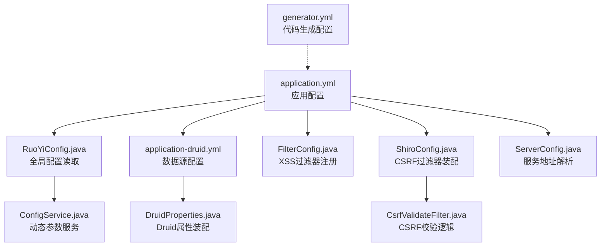
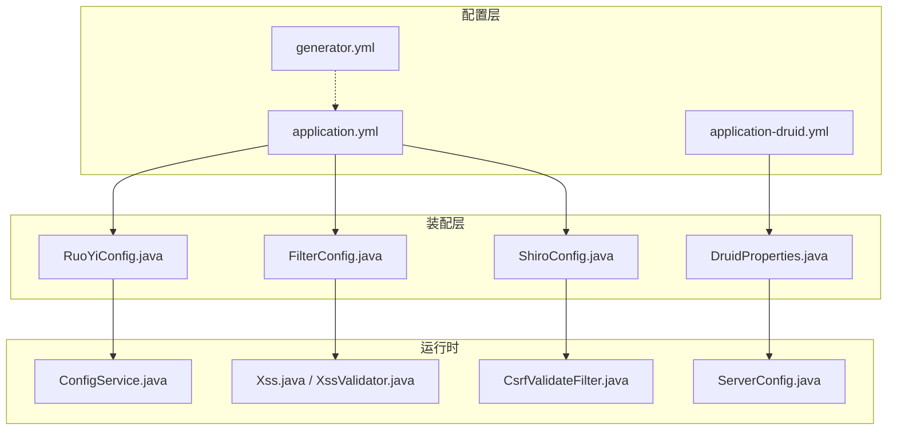
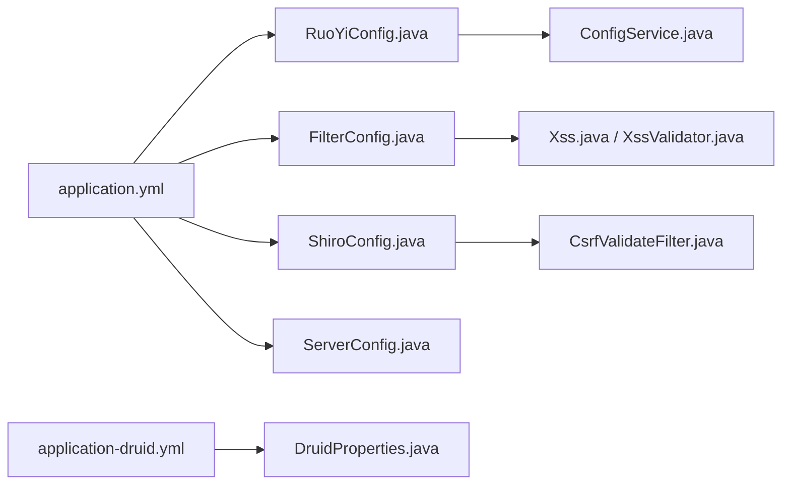
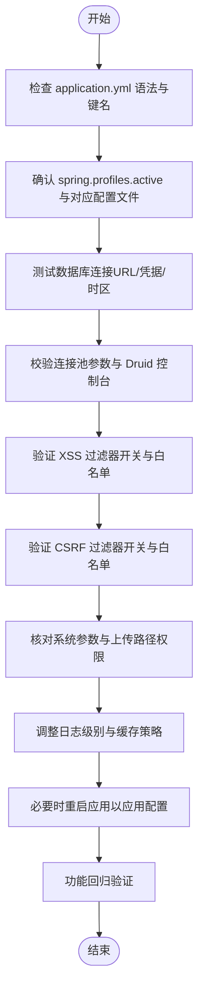

# 配置问题

<cite>
**本文引用的文件**
- [application.yml](file://GenShin/RuoYi-master/ruoyi-admin/src/main/resources/application.yml)
- [application-druid.yml](file://GenShin/RuoYi-master/ruoyi-admin/src/main/resources/application-druid.yml)
- [RuoYiConfig.java](file://GenShin/RuoYi-master/ruoyi-common/src/main/java/com/ruoyi/common/config/RuoYiConfig.java)
- [ConfigService.java](file://GenShin/RuoYi-master/ruoyi-framework/src/main/java/com/ruoyi/framework/web/service/ConfigService.java)
- [ServerConfig.java](file://GenShin/RuoYi-master/ruoyi-common/src/main/java/com/ruoyi/common/config/ServerConfig.java)
- [DruidProperties.java](file://GenShin/RuoYi-master/ruoyi-framework/src/main/java/com/ruoyi/framework/config/properties/DruidProperties.java)
- [FilterConfig.java](file://GenShin/RuoYi-master/ruoyi-framework/src/main/java/com/ruoyi/framework/config/FilterConfig.java)
- [ShiroConfig.java](file://GenShin/RuoYi-master/ruoyi-framework/src/main/java/com/ruoyi/framework/config/ShiroConfig.java)
- [CsrfValidateFilter.java](file://GenShin/RuoYi-master/ruoyi-framework/src/main/java/com/ruoyi/framework/shiro/web/filter/csrf/CsrfValidateFilter.java)
- [Xss.java](file://GenShin/RuoYi-master/ruoyi-common/src/main/java/com/ruoyi/common/xss/Xss.java)
- [XssValidator.java](file://GenShin/RuoYi-master/ruoyi-common/src/main/java/com/ruoyi/common/xss/XssValidator.java)
- [generator.yml](file://GenShin/RuoYi-master/ruoyi-generator/src/main/resources/generator.yml)
</cite>

## 目录
1. [简介](#简介)
2. [项目结构](#项目结构)
3. [核心组件](#核心组件)
4. [架构总览](#架构总览)
5. [详细组件分析](#详细组件分析)
6. [依赖关系分析](#依赖关系分析)
7. [性能考量](#性能考量)
8. [故障排除指南](#故障排除指南)
9. [结论](#结论)
10. [附录](#附录)

## 简介
本指南聚焦于原神攻略系统（基于 RuoYi 框架）的配置问题，围绕 application.yml 配置文件错误、环境变量与 Profile 切换、系统参数不当、安全防护配置（XSS/CSRF）、数据库连接池配置、以及配置热更新与版本管理等主题，提供可操作的诊断与修复流程。内容兼顾初学者与进阶用户，帮助快速定位并解决配置相关问题。

## 项目结构
与配置相关的关键位置如下：
- 应用主配置：ruoyi-admin/src/main/resources/application.yml
- 数据源与 Druid 配置：ruoyi-admin/src/main/resources/application-druid.yml
- 全局配置读取：ruoyi-common/src/main/java/com/ruoyi/common/config/RuoYiConfig.java
- 动态参数服务：ruoyi-framework/src/main/java/com/ruoyi/framework/web/service/ConfigService.java
- 服务器地址配置：ruoyi-common/src/main/java/com/ruoyi/common/config/ServerConfig.java
- Druid 属性装配：ruoyi-framework/src/main/java/com/ruoyi/framework/config/properties/DruidProperties.java
- XSS/CSRF 过滤器配置：ruoyi-framework/src/main/java/com/ruoyi/framework/config/FilterConfig.java、ruoyi-framework/src/main/java/com/ruoyi/framework/config/ShiroConfig.java、ruoyi-framework/src/main/java/com/ruoyi/framework/shiro/web/filter/csrf/CsrfValidateFilter.java
- XSS 注解与校验器：ruoyi-common/src/main/java/com/ruoyi/common/xss/Xss.java、ruoyi-common/src/main/java/com/ruoyi/common/xss/XssValidator.java
- 代码生成配置：ruoyi-generator/src/main/resources/generator.yml

图表来源
- [application.yml:1-154](file://GenShin/RuoYi-master/ruoyi-admin/src/main/resources/application.yml#L1-L154)
- [application-druid.yml:1-61](file://GenShin/RuoYi-master/ruoyi-admin/src/main/resources/application-druid.yml#L1-L61)
- [RuoYiConfig.java:1-125](file://GenShin/RuoYi-master/ruoyi-common/src/main/java/com/ruoyi/common/config/RuoYiConfig.java#L1-L125)
- [DruidProperties.java:1-89](file://GenShin/RuoYi-master/ruoyi-framework/src/main/java/com/ruoyi/framework/config/properties/DruidProperties.java#L1-L89)
- [FilterConfig.java:1-44](file://GenShin/RuoYi-master/ruoyi-framework/src/main/java/com/ruoyi/framework/config/FilterConfig.java#L1-L44)
- [ShiroConfig.java:246-313](file://GenShin/RuoYi-master/ruoyi-framework/src/main/java/com/ruoyi/framework/config/ShiroConfig.java#L246-L313)
- [CsrfValidateFilter.java:1-76](file://GenShin/RuoYi-master/ruoyi-framework/src/main/java/com/ruoyi/framework/shiro/web/filter/csrf/CsrfValidateFilter.java#L1-L76)
- [ConfigService.java:1-29](file://GenShin/RuoYi-master/ruoyi-framework/src/main/java/com/ruoyi/framework/web/service/ConfigService.java#L1-L29)
- [ServerConfig.java:1-34](file://GenShin/RuoYi-master/ruoyi-common/src/main/java/com/ruoyi/common/config/ServerConfig.java#L1-L34)
- [generator.yml](file://GenShin/RuoYi-master/ruoyi-generator/src/main/resources/generator.yml)

章节来源
- [application.yml:1-154](file://GenShin/RuoYi-master/ruoyi-admin/src/main/resources/application.yml#L1-L154)
- [application-druid.yml:1-61](file://GenShin/RuoYi-master/ruoyi-admin/src/main/resources/application-druid.yml#L1-L61)
- [RuoYiConfig.java:1-125](file://GenShin/RuoYi-master/ruoyi-common/src/main/java/com/ruoyi/common/config/RuoYiConfig.java#L1-L125)
- [DruidProperties.java:1-89](file://GenShin/RuoYi-master/ruoyi-framework/src/main/java/com/ruoyi/framework/config/properties/DruidProperties.java#L1-L89)
- [FilterConfig.java:1-44](file://GenShin/RuoYi-master/ruoyi-framework/src/main/java/com/ruoyi/framework/config/FilterConfig.java#L1-L44)
- [ShiroConfig.java:246-313](file://GenShin/RuoYi-master/ruoyi-framework/src/main/java/com/ruoyi/framework/config/ShiroConfig.java#L246-L313)
- [CsrfValidateFilter.java:1-76](file://GenShin/RuoYi-master/ruoyi-framework/src/main/java/com/ruoyi/framework/shiro/web/filter/csrf/CsrfValidateFilter.java#L1-L76)
- [ConfigService.java:1-29](file://GenShin/RuoYi-master/ruoyi-framework/src/main/java/com/ruoyi/framework/web/service/ConfigService.java#L1-L29)
- [ServerConfig.java:1-34](file://GenShin/RuoYi-master/ruoyi-common/src/main/java/com/ruoyi/common/config/ServerConfig.java#L1-L34)
- [generator.yml](file://GenShin/RuoYi-master/ruoyi-generator/src/main/resources/generator.yml)

## 核心组件
- 全局配置读取：通过 RuoYiConfig 绑定 ruoyi.* 前缀的配置项，提供统一访问入口。
- 动态参数服务：ConfigService 封装对系统参数表的查询，支持模板/前端调用。
- 服务器地址解析：ServerConfig 基于 HttpServletRequest 解析完整请求地址，便于生成外链或回调地址。
- 数据源与 Druid：application-druid.yml 提供数据库连接池参数；DruidProperties 将配置注入到 DruidDataSource。
- 安全过滤器：FilterConfig 条件注册 XSS 过滤器；ShiroConfig 装配 CSRF 过滤器；CsrfValidateFilter 执行令牌校验。
- 代码生成配置：generator.yml 控制代码生成器行为，与应用配置相互独立但同属工程配置范畴。

章节来源
- [RuoYiConfig.java:11-91](file://GenShin/RuoYi-master/ruoyi-common/src/main/java/com/ruoyi/common/config/RuoYiConfig.java#L11-L91)
- [ConfigService.java:12-28](file://GenShin/RuoYi-master/ruoyi-framework/src/main/java/com/ruoyi/framework/web/service/ConfigService.java#L12-L28)
- [ServerConfig.java:14-33](file://GenShin/RuoYi-master/ruoyi-common/src/main/java/com/ruoyi/common/config/ServerConfig.java#L14-L33)
- [application-druid.yml:2-61](file://GenShin/RuoYi-master/ruoyi-admin/src/main/resources/application-druid.yml#L2-L61)
- [DruidProperties.java:12-88](file://GenShin/RuoYi-master/ruoyi-framework/src/main/java/com/ruoyi/framework/config/properties/DruidProperties.java#L12-L88)
- [FilterConfig.java:19-43](file://GenShin/RuoYi-master/ruoyi-framework/src/main/java/com/ruoyi/framework/config/FilterConfig.java#L19-L43)
- [ShiroConfig.java:285-291](file://GenShin/RuoYi-master/ruoyi-framework/src/main/java/com/ruoyi/framework/config/ShiroConfig.java#L285-L291)
- [CsrfValidateFilter.java:20-59](file://GenShin/RuoYi-master/ruoyi-framework/src/main/java/com/ruoyi/framework/shiro/web/filter/csrf/CsrfValidateFilter.java#L20-L59)
- [generator.yml](file://GenShin/RuoYi-master/ruoyi-generator/src/main/resources/generator.yml)

## 架构总览
下图展示配置在系统中的流转与影响范围：

图表来源
- [application.yml:1-154](file://GenShin/RuoYi-master/ruoyi-admin/src/main/resources/application.yml#L1-L154)
- [application-druid.yml:1-61](file://GenShin/RuoYi-master/ruoyi-admin/src/main/resources/application-druid.yml#L1-L61)
- [RuoYiConfig.java:11-91](file://GenShin/RuoYi-master/ruoyi-common/src/main/java/com/ruoyi/common/config/RuoYiConfig.java#L11-L91)
- [DruidProperties.java:12-88](file://GenShin/RuoYi-master/ruoyi-framework/src/main/java/com/ruoyi/framework/config/properties/DruidProperties.java#L12-L88)
- [FilterConfig.java:19-43](file://GenShin/RuoYi-master/ruoyi-framework/src/main/java/com/ruoyi/framework/config/FilterConfig.java#L19-L43)
- [ShiroConfig.java:285-291](file://GenShin/RuoYi-master/ruoyi-framework/src/main/java/com/ruoyi/framework/config/ShiroConfig.java#L285-L291)
- [ConfigService.java:12-28](file://GenShin/RuoYi-master/ruoyi-framework/src/main/java/com/ruoyi/framework/web/service/ConfigService.java#L12-L28)
- [ServerConfig.java:14-33](file://GenShin/RuoYi-master/ruoyi-common/src/main/java/com/ruoyi/common/config/ServerConfig.java#L14-L33)
- [Xss.java:15-27](file://GenShin/RuoYi-master/ruoyi-common/src/main/java/com/ruoyi/common/xss/Xss.java#L15-L27)
- [XssValidator.java:14-39](file://GenShin/RuoYi-master/ruoyi-common/src/main/java/com/ruoyi/common/xss/XssValidator.java#L14-L39)
- [CsrfValidateFilter.java:20-59](file://GenShin/RuoYi-master/ruoyi-framework/src/main/java/com/ruoyi/framework/shiro/web/filter/csrf/CsrfValidateFilter.java#L20-L59)
- [generator.yml](file://GenShin/RuoYi-master/ruoyi-generator/src/main/resources/generator.yml)

## 详细组件分析

### 全局配置读取（RuoYiConfig）
- 作用：将 ruoyi.* 前缀的配置绑定为静态字段，提供统一访问。
- 关键点：
  - 支持项目名称、版本、版权年份、演示开关、上传路径、IP 地址开关等。
  - 提供导入/头像/下载/上传路径拼接工具方法，避免硬编码。
- 常见问题：
  - 配置项缺失或拼写错误导致默认值生效。
  - 上传路径不存在或权限不足导致文件上传失败。
- 修复建议：
  - 在 application.yml 中核对 ruoyi.* 键名与类型。
  - 确保 profile 指向的目录存在且具备读写权限。

章节来源
- [RuoYiConfig.java:11-124](file://GenShin/RuoYi-master/ruoyi-common/src/main/java/com/ruoyi/common/config/RuoYiConfig.java#L11-L124)
- [application.yml:2-14](file://GenShin/RuoYi-master/ruoyi-admin/src/main/resources/application.yml#L2-L14)

### 动态参数服务（ConfigService）
- 作用：根据参数键名查询系统参数值，用于模板渲染或业务逻辑。
- 常见问题：
  - 参数键名不存在或大小写不一致导致返回空。
  - 参数值变更后未生效（需确认是否支持热更新或重启）。
- 修复建议：
  - 在数据库 sys_config 表中核对键名与值。
  - 若需热更新，确保参数读取逻辑支持刷新或采用缓存策略。

章节来源
- [ConfigService.java:12-28](file://GenShin/RuoYi-master/ruoyi-framework/src/main/java/com/ruoyi/framework/web/service/ConfigService.java#L12-L28)

### 服务器地址解析（ServerConfig）
- 作用：基于 HttpServletRequest 解析完整域名、端口与上下文路径。
- 常见问题：
  - 反向代理场景下获取的域名可能不正确。
  - 上下文路径配置与实际部署不一致。
- 修复建议：
  - 在网关或反代层正确传递 Host/Forwarded 头。
  - 核对 server.servlet.context-path 与实际访问路径。

章节来源
- [ServerConfig.java:14-33](file://GenShin/RuoYi-master/ruoyi-common/src/main/java/com/ruoyi/common/config/ServerConfig.java#L14-L33)
- [application.yml:17-22](file://GenShin/RuoYi-master/ruoyi-admin/src/main/resources/application.yml#L17-L22)

### 数据源与 Druid 配置（application-druid.yml + DruidProperties）
- 作用：配置主从库、连接池参数、Druid 控制台与慢 SQL 记录。
- 关键点：
  - master/slave 数据源、初始/最小/最大连接数、超时时间、空闲检测周期。
  - Druid 控制台登录凭据与白名单。
- 常见问题：
  - 数据库连接失败（URL/用户名/密码错误）。
  - 连接池参数不合理导致高延迟或连接耗尽。
  - 控制台访问受限或凭据泄露风险。
- 修复建议：
  - 使用 application-druid.yml 的示例键名逐项核对。
  - 调整连接池参数以匹配业务并发与数据库性能。
  - 生产环境修改默认控制台凭据并限制访问白名单。

章节来源
- [application-druid.yml:2-61](file://GenShin/RuoYi-master/ruoyi-admin/src/main/resources/application-druid.yml#L2-L61)
- [DruidProperties.java:12-88](file://GenShin/RuoYi-master/ruoyi-framework/src/main/java/com/ruoyi/framework/config/properties/DruidProperties.java#L12-L88)

### XSS 与 CSRF 安全配置
- XSS：
  - FilterConfig 条件注册，受 xss.enabled 控制。
  - Xss 注解与 XssValidator 实现字段级校验。
- CSRF：
  - ShiroConfig 装配 CsrfValidateFilter，受 csrf.enabled 控制。
  - CsrfValidateFilter 校验请求头中的 X-CSRF-TOKEN 与 Session 中的令牌一致性。
- 常见问题：
  - XSS/CSRF 过滤器未生效（enabled=false 或未注册）。
  - CSRF 白名单配置不当导致正常请求被拦截。
  - 令牌缺失或过期导致鉴权失败。
- 修复建议：
  - 确认 application.yml 中 xss.enabled 与 csrf.enabled。
  - 校验白名单列表与实际请求路径匹配。
  - 在前端正确携带与刷新令牌。

章节来源
- [FilterConfig.java:19-43](file://GenShin/RuoYi-master/ruoyi-framework/src/main/java/com/ruoyi/framework/config/FilterConfig.java#L19-L43)
- [ShiroConfig.java:285-291](file://GenShin/RuoYi-master/ruoyi-framework/src/main/java/com/ruoyi/framework/config/ShiroConfig.java#L285-L291)
- [CsrfValidateFilter.java:20-59](file://GenShin/RuoYi-master/ruoyi-framework/src/main/java/com/ruoyi/framework/shiro/web/filter/csrf/CsrfValidateFilter.java#L20-L59)
- [Xss.java:15-27](file://GenShin/RuoYi-master/ruoyi-common/src/main/java/com/ruoyi/common/xss/Xss.java#L15-L27)
- [XssValidator.java:14-39](file://GenShin/RuoYi-master/ruoyi-common/src/main/java/com/ruoyi/common/xss/XssValidator.java#L14-L39)
- [application.yml:139-153](file://GenShin/RuoYi-master/ruoyi-admin/src/main/resources/application.yml#L139-L153)

### 代码生成配置（generator.yml）
- 作用：控制代码生成器的模板、表映射与输出策略。
- 常见问题：
  - 生成结果不符合预期（模板或表映射配置错误）。
  - 生成路径或命名规则与现有工程冲突。
- 修复建议：
  - 根据实际数据库表结构调整 generator.yml。
  - 生成前先预览模板，确认输出路径与命名规范。

章节来源
- [generator.yml](file://GenShin/RuoYi-master/ruoyi-generator/src/main/resources/generator.yml)

## 依赖关系分析
- 配置文件与装配类：
  - application.yml → RuoYiConfig（ruoyi.*）、FilterConfig（xss.*）、ShiroConfig（csrf.*）、ServerConfig（server.*）。
  - application-druid.yml → DruidProperties（spring.datasource.druid.*）。
- 组件耦合：
  - ConfigService 依赖 ISysConfigService，间接依赖参数表。
  - XSS/CSRF 过滤器依赖配置开关与白名单。
- 循环依赖风险：
  - 当前结构以配置为中心，无明显循环依赖迹象。

图表来源
- [application.yml:1-154](file://GenShin/RuoYi-master/ruoyi-admin/src/main/resources/application.yml#L1-L154)
- [application-druid.yml:1-61](file://GenShin/RuoYi-master/ruoyi-admin/src/main/resources/application-druid.yml#L1-L61)
- [RuoYiConfig.java:11-91](file://GenShin/RuoYi-master/ruoyi-common/src/main/java/com/ruoyi/common/config/RuoYiConfig.java#L11-L91)
- [DruidProperties.java:12-88](file://GenShin/RuoYi-master/ruoyi-framework/src/main/java/com/ruoyi/framework/config/properties/DruidProperties.java#L12-L88)
- [FilterConfig.java:19-43](file://GenShin/RuoYi-master/ruoyi-framework/src/main/java/com/ruoyi/framework/config/FilterConfig.java#L19-L43)
- [ShiroConfig.java:285-291](file://GenShin/RuoYi-master/ruoyi-framework/src/main/java/com/ruoyi/framework/config/ShiroConfig.java#L285-L291)
- [ConfigService.java:12-28](file://GenShin/RuoYi-master/ruoyi-framework/src/main/java/com/ruoyi/framework/web/service/ConfigService.java#L12-L28)
- [ServerConfig.java:14-33](file://GenShin/RuoYi-master/ruoyi-common/src/main/java/com/ruoyi/common/config/ServerConfig.java#L14-L33)
- [Xss.java:15-27](file://GenShin/RuoYi-master/ruoyi-common/src/main/java/com/ruoyi/common/xss/Xss.java#L15-L27)
- [XssValidator.java:14-39](file://GenShin/RuoYi-master/ruoyi-common/src/main/java/com/ruoyi/common/xss/XssValidator.java#L14-L39)
- [CsrfValidateFilter.java:20-59](file://GenShin/RuoYi-master/ruoyi-framework/src/main/java/com/ruoyi/framework/shiro/web/filter/csrf/CsrfValidateFilter.java#L20-L59)

## 性能考量
- 连接池参数：
  - 初始连接数、最小空闲、最大活跃、等待超时、网络超时、空闲检测周期等直接影响数据库访问性能与稳定性。
  - 建议结合压测结果与数据库规格调整，避免过大导致资源浪费，过小导致排队等待。
- 线程与 Tomcat：
  - server.tomcat.threads.max/min-spare 与 accept-count 需与业务并发匹配。
- 缓存与日志：
  - Thymeleaf cache 关闭与日志级别应按环境调整，避免开发环境性能开销过大。
- XSS/CSRF：
  - 过滤器仅在启用时生效，避免不必要的性能损耗。

章节来源
- [application.yml:17-32](file://GenShin/RuoYi-master/ruoyi-admin/src/main/resources/application.yml#L17-L32)
- [application-druid.yml:19-41](file://GenShin/RuoYi-master/ruoyi-admin/src/main/resources/application-druid.yml#L19-L41)
- [DruidProperties.java:54-88](file://GenShin/RuoYi-master/ruoyi-framework/src/main/java/com/ruoyi/framework/config/properties/DruidProperties.java#L54-L88)

## 故障排除指南

### 一、application.yml 配置文件错误
- 语法检查
  - 使用在线 YAML 校验工具或 IDE 插件检查缩进与键名。
  - 关注常见问题：键名大小写、冒号后空格、特殊字符转义。
- 常见错误与修复
  - 键名拼写错误：如 ruoy.name → ruoyi.name。
  - 类型不匹配：布尔值写成字符串，数值写成字符串。
  - 缩进不一致：导致层级错乱。
- 快速定位步骤
  - 逐段注释法：注释一半配置，启动验证；定位到出错段落再细分。
  - 分模块对比：与官方示例逐项比对。
- 参考路径
  - [application.yml:1-154](file://GenShin/RuoYi-master/ruoyi-admin/src/main/resources/application.yml#L1-L154)

章节来源
- [application.yml:1-154](file://GenShin/RuoYi-master/ruoyi-admin/src/main/resources/application.yml#L1-L154)

### 二、环境变量与 Profile 切换问题
- Profile 激活
  - spring.profiles.active: druid 用于激活 application-druid.yml。
  - 如需切换至其他环境，应在启动参数或外部配置中修改。
- 环境差异
  - 开发：关闭缓存、开启调试日志、允许本地访问。
  - 测试：中等日志级别、适度连接池参数。
  - 生产：严格日志级别、最小化暴露面、强化安全过滤器。
- 常见问题
  - Profile 未生效：检查激活值与文件命名是否一致。
  - 多 Profile 冲突：确保各环境配置互斥且覆盖顺序正确。
- 参考路径
  - [application.yml:61-62](file://GenShin/RuoYi-master/ruoyi-admin/src/main/resources/application.yml#L61-L62)
  - [application-druid.yml:1-61](file://GenShin/RuoYi-master/ruoyi-admin/src/main/resources/application-druid.yml#L1-L61)

章节来源
- [application.yml:61-62](file://GenShin/RuoYi-master/ruoyi-admin/src/main/resources/application.yml#L61-L62)
- [application-druid.yml:1-61](file://GenShin/RuoYi-master/ruoyi-admin/src/main/resources/application-druid.yml#L1-L61)

### 三、系统参数配置不当
- 上传路径与权限
  - profile 指向的目录必须存在且具备读写权限。
  - 上传/下载/头像/导入路径由 RuoYiConfig 统一拼接。
- 日志级别与模板缓存
  - 开发环境关闭 Thymeleaf 缓存，生产环境开启以提升性能。
  - logging.level 调整至合适级别，避免过多 I/O。
- 参考路径
  - [application.yml:11-14](file://GenShin/RuoYi-master/ruoyi-admin/src/main/resources/application.yml#L11-L14)
  - [application.yml:52-56](file://GenShin/RuoYi-master/ruoyi-admin/src/main/resources/application.yml#L52-L56)
  - [application.yml:34-38](file://GenShin/RuoYi-master/ruoyi-admin/src/main/resources/application.yml#L34-L38)
  - [RuoYiConfig.java:96-123](file://GenShin/RuoYi-master/ruoyi-common/src/main/java/com/ruoyi/common/config/RuoYiConfig.java#L96-L123)

章节来源
- [application.yml:11-14](file://GenShin/RuoYi-master/ruoyi-admin/src/main/resources/application.yml#L11-L14)
- [application.yml:52-56](file://GenShin/RuoYi-master/ruoyi-admin/src/main/resources/application.yml#L52-L56)
- [application.yml:34-38](file://GenShin/RuoYi-master/ruoyi-admin/src/main/resources/application.yml#L34-L38)
- [RuoYiConfig.java:96-123](file://GenShin/RuoYi-master/ruoyi-common/src/main/java/com/ruoyi/common/config/RuoYiConfig.java#L96-L123)

### 四、数据库连接池问题
- 诊断要点
  - 连接失败：检查 URL、用户名、密码、时区与 SSL 配置。
  - 连接池异常：观察初始/最小/最大连接数与等待超时设置。
  - 控制台访问：确认白名单与登录凭据。
- 修复建议
  - 使用 application-druid.yml 的示例键名逐项核对。
  - 结合业务并发调整连接池参数。
  - 生产环境修改默认凭据并限制访问。
- 参考路径
  - [application-druid.yml:8-11](file://GenShin/RuoYi-master/ruoyi-admin/src/main/resources/application-druid.yml#L8-L11)
  - [application-druid.yml:19-41](file://GenShin/RuoYi-master/ruoyi-admin/src/main/resources/application-druid.yml#L19-L41)
  - [DruidProperties.java:54-88](file://GenShin/RuoYi-master/ruoyi-framework/src/main/java/com/ruoyi/framework/config/properties/DruidProperties.java#L54-L88)

章节来源
- [application-druid.yml:8-11](file://GenShin/RuoYi-master/ruoyi-admin/src/main/resources/application-druid.yml#L8-L11)
- [application-druid.yml:19-41](file://GenShin/RuoYi-master/ruoyi-admin/src/main/resources/application-druid.yml#L19-L41)
- [DruidProperties.java:54-88](file://GenShin/RuoYi-master/ruoyi-framework/src/main/java/com/ruoyi/framework/config/properties/DruidProperties.java#L54-L88)

### 五、安全过滤器（XSS/CSRF）问题
- XSS
  - 确认 xss.enabled 为 true，urlPatterns 与 excludes 正确。
  - 字段级校验使用 @Xss 注解，避免富文本场景误伤。
- CSRF
  - 确认 csrf.enabled 为 true，白名单与请求路径匹配。
  - 前端需正确携带 X-CSRF-TOKEN 请求头。
- 参考路径
  - [application.yml:139-153](file://GenShin/RuoYi-master/ruoyi-admin/src/main/resources/application.yml#L139-L153)
  - [FilterConfig.java:19-43](file://GenShin/RuoYi-master/ruoyi-framework/src/main/java/com/ruoyi/framework/config/FilterConfig.java#L19-L43)
  - [ShiroConfig.java:285-291](file://GenShin/RuoYi-master/ruoyi-framework/src/main/java/com/ruoyi/framework/config/ShiroConfig.java#L285-L291)
  - [CsrfValidateFilter.java:20-59](file://GenShin/RuoYi-master/ruoyi-framework/src/main/java/com/ruoyi/framework/shiro/web/filter/csrf/CsrfValidateFilter.java#L20-L59)
  - [Xss.java:15-27](file://GenShin/RuoYi-master/ruoyi-common/src/main/java/com/ruoyi/common/xss/Xss.java#L15-L27)
  - [XssValidator.java:14-39](file://GenShin/RuoYi-master/ruoyi-common/src/main/java/com/ruoyi/common/xss/XssValidator.java#L14-L39)

章节来源
- [application.yml:139-153](file://GenShin/RuoYi-master/ruoyi-admin/src/main/resources/application.yml#L139-L153)
- [FilterConfig.java:19-43](file://GenShin/RuoYi-master/ruoyi-framework/src/main/java/com/ruoyi/framework/config/FilterConfig.java#L19-L43)
- [ShiroConfig.java:285-291](file://GenShin/RuoYi-master/ruoyi-framework/src/main/java/com/ruoyi/framework/config/ShiroConfig.java#L285-L291)
- [CsrfValidateFilter.java:20-59](file://GenShin/RuoYi-master/ruoyi-framework/src/main/java/com/ruoyi/framework/shiro/web/filter/csrf/CsrfValidateFilter.java#L20-L59)
- [Xss.java:15-27](file://GenShin/RuoYi-master/ruoyi-common/src/main/java/com/ruoyi/common/xss/Xss.java#L15-L27)
- [XssValidator.java:14-39](file://GenShin/RuoYi-master/ruoyi-common/src/main/java/com/ruoyi/common/xss/XssValidator.java#L14-L39)

### 六、配置热更新与版本管理
- 热更新现状
  - application.yml 与 application-druid.yml 通常在启动时加载，运行时修改需重启生效。
  - 动态参数（sys_config）可通过 ConfigService 查询，建议配合缓存策略实现近似热更新。
- 建议实践
  - 使用外部化配置中心（如 Nacos/Consul），集中管理多环境配置。
  - 对敏感配置（数据库凭据、密钥）使用密文存储与解密。
  - 配置变更走变更流程与灰度发布，保留版本快照。
- 参考路径
  - [ConfigService.java:12-28](file://GenShin/RuoYi-master/ruoyi-framework/src/main/java/com/ruoyi/framework/web/service/ConfigService.java#L12-L28)

章节来源
- [ConfigService.java:12-28](file://GenShin/RuoYi-master/ruoyi-framework/src/main/java/com/ruoyi/framework/web/service/ConfigService.java#L12-L28)

### 七、配置文件加密与敏感信息保护
- 建议措施
  - 对数据库密码、控制台凭据、cipherKey 等敏感字段进行加密存储。
  - 使用 Spring Cloud Vault/KMS 或本地密钥管理工具。
  - 限制配置文件与日志的访问权限，避免明文泄露。
- 注意事项
  - 加密解密过程需与启动流程集成，确保服务启动时可用。
  - 定期轮换密钥与凭据，避免长期使用默认值。

章节来源
- [application-druid.yml:46-51](file://GenShin/RuoYi-master/ruoyi-admin/src/main/resources/application-druid.yml#L46-L51)
- [application.yml:108-109](file://GenShin/RuoYi-master/ruoyi-admin/src/main/resources/application.yml#L108-L109)

### 八、不同环境的配置管理策略
- 开发环境
  - 开启 Thymeleaf 缓存关闭、调试日志、允许本地访问。
  - 使用轻量连接池与本地数据库。
- 测试环境
  - 与生产相近的连接池参数，开启必要的安全过滤器。
- 生产环境
  - 严格日志级别、最小暴露面、强化安全过滤器与访问白名单。
  - 使用外部化配置中心与密文存储。

章节来源
- [application.yml:52-56](file://GenShin/RuoYi-master/ruoyi-admin/src/main/resources/application.yml#L52-L56)
- [application.yml:34-38](file://GenShin/RuoYi-master/ruoyi-admin/src/main/resources/application.yml#L34-L38)
- [application.yml:139-153](file://GenShin/RuoYi-master/ruoyi-admin/src/main/resources/application.yml#L139-L153)

### 九、配置问题的快速定位与修复流程

图表来源
- [application.yml:1-154](file://GenShin/RuoYi-master/ruoyi-admin/src/main/resources/application.yml#L1-L154)
- [application-druid.yml:1-61](file://GenShin/RuoYi-master/ruoyi-admin/src/main/resources/application-druid.yml#L1-L61)
- [FilterConfig.java:19-43](file://GenShin/RuoYi-master/ruoyi-framework/src/main/java/com/ruoyi/framework/config/FilterConfig.java#L19-L43)
- [ShiroConfig.java:285-291](file://GenShin/RuoYi-master/ruoyi-framework/src/main/java/com/ruoyi/framework/config/ShiroConfig.java#L285-L291)
- [RuoYiConfig.java:96-123](file://GenShin/RuoYi-master/ruoyi-common/src/main/java/com/ruoyi/common/config/RuoYiConfig.java#L96-L123)

## 结论
配置问题的根因多源于键名拼写、类型不匹配、环境差异与安全过滤器开关不当。通过分模块校验、逐步注释定位、结合官方示例比对，可高效修复。建议在生产环境引入外部化配置中心、密文存储与版本管理，配合严格的灰度发布流程，持续提升配置治理水平。

## 附录
- 相关配置文件路径参考
  - [application.yml](file://GenShin/RuoYi-master/ruoyi-admin/src/main/resources/application.yml)
  - [application-druid.yml](file://GenShin/RuoYi-master/ruoyi-admin/src/main/resources/application-druid.yml)
  - [RuoYiConfig.java](file://GenShin/RuoYi-master/ruoyi-common/src/main/java/com/ruoyi/common/config/RuoYiConfig.java)
  - [ConfigService.java](file://GenShin/RuoYi-master/ruoyi-framework/src/main/java/com/ruoyi/framework/web/service/ConfigService.java)
  - [ServerConfig.java](file://GenShin/RuoYi-master/ruoyi-common/src/main/java/com/ruoyi/common/config/ServerConfig.java)
  - [DruidProperties.java](file://GenShin/RuoYi-master/ruoyi-framework/src/main/java/com/ruoyi/framework/config/properties/DruidProperties.java)
  - [FilterConfig.java](file://GenShin/RuoYi-master/ruoyi-framework/src/main/java/com/ruoyi/framework/config/FilterConfig.java)
  - [ShiroConfig.java](file://GenShin/RuoYi-master/ruoyi-framework/src/main/java/com/ruoyi/framework/config/ShiroConfig.java)
  - [CsrfValidateFilter.java](file://GenShin/RuoYi-master/ruoyi-framework/src/main/java/com/ruoyi/framework/shiro/web/filter/csrf/CsrfValidateFilter.java)
  - [Xss.java](file://GenShin/RuoYi-master/ruoyi-common/src/main/java/com/ruoyi/common/xss/Xss.java)
  - [XssValidator.java](file://GenShin/RuoYi-master/ruoyi-common/src/main/java/com/ruoyi/common/xss/XssValidator.java)
  - [generator.yml](file://GenShin/RuoYi-master/ruoyi-generator/src/main/resources/generator.yml)