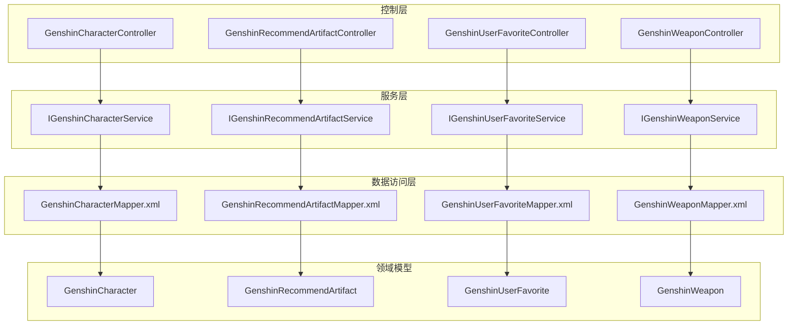
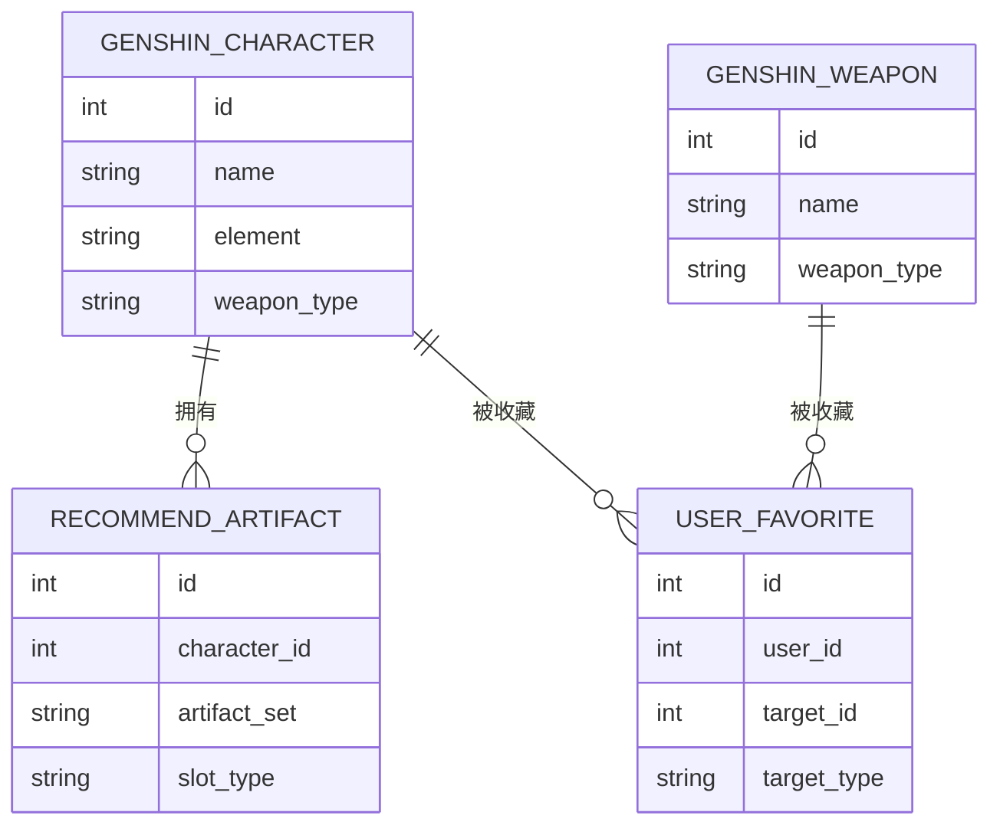
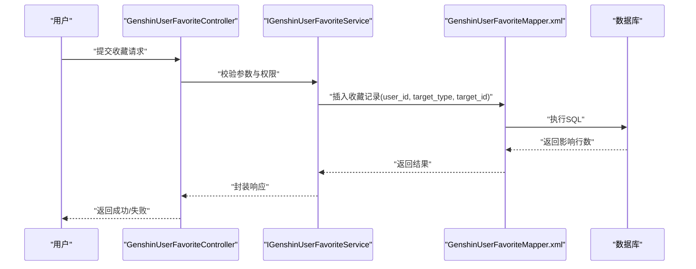
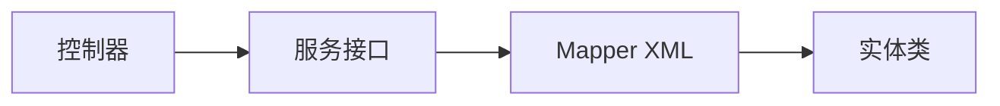

# 实体关系图

<cite>
**本文引用的文件**
- [GenshinCharacter.java](file://GenShin/RuoYi-master/ruoyi-system/src/main/java/com/ruoyi/system/domain/GenshinCharacter.java)
- [GenshinRecommendArtifact.java](file://GenShin/RuoYi-master/ruoyi-system/src/main/java/com/ruoyi/system/domain/GenshinRecommendArtifact.java)
- [GenshinUserFavorite.java](file://GenShin/RuoYi-master/ruoyi-system/src/main/java/com/ruoyi/system/domain/GenshinUserFavorite.java)
- [GenshinWeapon.java](file://GenShin/RuoYi-master/ruoyi-system/src/main/java/com/ruoyi/system/domain/GenshinWeapon.java)
- [GenshinCharacterMapper.xml](file://GenShin/RuoYi-master/ruoyi-system/src/main/resources/mapper/system/GenshinCharacterMapper.xml)
- [GenshinRecommendArtifactMapper.xml](file://GenShin/RuoYi-master/ruoyi-system/src/main/resources/mapper/system/GenshinRecommendArtifactMapper.xml)
- [GenshinUserFavoriteMapper.xml](file://GenShin/RuoYi-master/ruoyi-system/src/main/resources/mapper/system/GenshinUserFavoriteMapper.xml)
- [GenshinWeaponMapper.xml](file://GenShin/RuoYi-master/ruoyi-system/src/main/resources/mapper/system/GenshinWeaponMapper.xml)
- [IGenshinCharacterService.java](file://GenShin/RuoYi-master/ruoyi-system/src/main/java/com/ruoyi/system/service/IGenshinCharacterService.java)
- [IGenshinRecommendArtifactService.java](file://GenShin/RuoYi-master/ruoyi-system/src/main/java/com/ruoyi/system/service/IGenshinRecommendArtifactService.java)
- [IGenshinUserFavoriteService.java](file://GenShin/RuoYi-master/ruoyi-system/src/main/java/com/ruoyi/system/service/IGenshinUserFavoriteService.java)
- [IGenshinWeaponService.java](file://GenShin/RuoYi-master/ruoyi-system/src/main/java/com/ruoyi/system/service/IGenshinWeaponService.java)
- [GenshinCharacterController.java](file://GenShin/RuoYi-master/ruoyi-admin/src/main/java/com/ruoyi/web/controller/system/GenshinCharacterController.java)
- [GenshinRecommendArtifactController.java](file://GenShin/RuoYi-master/ruoyi-admin/src/main/java/com/ruoyi/web/controller/system/GenshinRecommendArtifactController.java)
- [GenshinUserFavoriteController.java](file://GenShin/RuoYi-master/ruoyi-admin/src/main/java/com/ruoyi/web/controller/system/GenshinUserFavoriteController.java)
- [GenshinWeaponController.java](file://GenShin/RuoYi-master/ruoyi-admin/src/main/java/com/ruoyi/web/controller/system/GenshinWeaponController.java)
</cite>

## 目录
1. [引言](#引言)
2. [项目结构](#项目结构)
3. [核心组件](#核心组件)
4. [架构总览](#架构总览)
5. [详细组件分析](#详细组件分析)
6. [依赖分析](#依赖分析)
7. [性能考虑](#性能考虑)
8. [故障排除指南](#故障排除指南)
9. [结论](#结论)
10. [附录](#附录)

## 引言
本文件面向原神攻略系统的数据库实体关系设计，聚焦于核心实体：GenshinCharacter（角色）、GenshinRecommendArtifact（推荐圣遗物）、GenshinUserFavorite（用户收藏）、GenshinWeapon（武器）。通过实体关系图（ER）与代码级映射文件相互印证，系统性阐述一对一、一对多、多对多关系的实现方式与业务场景；解释关系表的设计模式与中间表策略；并提供关系图的维护与更新策略，确保与代码实现保持一致。

## 项目结构
系统采用前后端分离的典型分层架构：
- 控制层：各实体对应的控制器负责请求接入与响应输出
- 服务层：接口定义业务能力边界，具体实现位于 impl 包
- 数据访问层：MyBatis Mapper XML 映射 SQL 与实体字段
- 领域模型：实体类承载数据结构与业务属性

图表来源
- [GenshinCharacterController.java](file://GenShin/RuoYi-master/ruoyi-admin/src/main/java/com/ruoyi/web/controller/system/GenshinCharacterController.java)
- [GenshinRecommendArtifactController.java](file://GenShin/RuoYi-master/ruoyi-admin/src/main/java/com/ruoyi/web/controller/system/GenshinRecommendArtifactController.java)
- [GenshinUserFavoriteController.java](file://GenShin/RuoYi-master/ruoyi-admin/src/main/java/com/ruoyi/web/controller/system/GenshinUserFavoriteController.java)
- [GenshinWeaponController.java](file://GenShin/RuoYi-master/ruoyi-admin/src/main/java/com/ruoyi/web/controller/system/GenshinWeaponController.java)
- [IGenshinCharacterService.java](file://GenShin/RuoYi-master/ruoyi-system/src/main/java/com/ruoyi/system/service/IGenshinCharacterService.java)
- [IGenshinRecommendArtifactService.java](file://GenShin/RuoYi-master/ruoyi-system/src/main/java/com/ruoyi/system/service/IGenshinRecommendArtifactService.java)
- [IGenshinUserFavoriteService.java](file://GenShin/RuoYi-master/ruoyi-system/src/main/java/com/ruoyi/system/service/IGenshinUserFavoriteService.java)
- [IGenshinWeaponService.java](file://GenShin/RuoYi-master/ruoyi-system/src/main/java/com/ruoyi/system/service/IGenshinWeaponService.java)
- [GenshinCharacterMapper.xml](file://GenShin/RuoYi-master/ruoyi-system/src/main/resources/mapper/system/GenshinCharacterMapper.xml)
- [GenshinRecommendArtifactMapper.xml](file://GenShin/RuoYi-master/ruoyi-system/src/main/resources/mapper/system/GenshinRecommendArtifactMapper.xml)
- [GenshinUserFavoriteMapper.xml](file://GenShin/RuoYi-master/ruoyi-system/src/main/resources/mapper/system/GenshinUserFavoriteMapper.xml)
- [GenshinWeaponMapper.xml](file://GenShin/RuoYi-master/ruoyi-system/src/main/resources/mapper/system/GenshinWeaponMapper.xml)
- [GenshinCharacter.java](file://GenShin/RuoYi-master/ruoyi-system/src/main/java/com/ruoyi/system/domain/GenshinCharacter.java)
- [GenshinRecommendArtifact.java](file://GenShin/RuoYi-master/ruoyi-system/src/main/java/com/ruoyi/system/domain/GenshinRecommendArtifact.java)
- [GenshinUserFavorite.java](file://GenShin/RuoYi-master/ruoyi-system/src/main/java/com/ruoyi/system/domain/GenshinUserFavorite.java)
- [GenshinWeapon.java](file://GenShin/RuoYi-master/ruoyi-system/src/main/java/com/ruoyi/system/domain/GenshinWeapon.java)

章节来源
- [GenshinCharacterController.java](file://GenShin/RuoYi-master/ruoyi-admin/src/main/java/com/ruoyi/web/controller/system/GenshinCharacterController.java)
- [GenshinRecommendArtifactController.java](file://GenShin/RuoYi-master/ruoyi-admin/src/main/java/com/ruoyi/web/controller/system/GenshinRecommendArtifactController.java)
- [GenshinUserFavoriteController.java](file://GenShin/RuoYi-master/ruoyi-admin/src/main/java/com/ruoyi/web/controller/system/GenshinUserFavoriteController.java)
- [GenshinWeaponController.java](file://GenShin/RuoYi-master/ruoyi-admin/src/main/java/com/ruoyi/web/controller/system/GenshinWeaponController.java)

## 核心组件
- GenshinCharacter：角色实体，承载角色基础信息与唯一标识
- GenshinRecommendArtifact：推荐圣遗物实体，承载推荐配置与关联键
- GenshinUserFavorite：用户收藏实体，承载用户与目标对象的收藏关系
- GenshinWeapon：武器实体，承载武器基础信息与唯一标识

章节来源
- [GenshinCharacter.java](file://GenShin/RuoYi-master/ruoyi-system/src/main/java/com/ruoyi/system/domain/GenshinCharacter.java)
- [GenshinRecommendArtifact.java](file://GenShin/RuoYi-master/ruoyi-system/src/main/java/com/ruoyi/system/domain/GenshinRecommendArtifact.java)
- [GenshinUserFavorite.java](file://GenShin/RuoYi-master/ruoyi-system/src/main/java/com/ruoyi/system/domain/GenshinUserFavorite.java)
- [GenshinWeapon.java](file://GenShin/RuoYi-master/ruoyi-system/src/main/java/com/ruoyi/system/domain/GenshinWeapon.java)

## 架构总览
下图给出基于代码映射的实体关系视图，展示核心实体间的关联与约束：

图表来源
- [GenshinCharacter.java](file://GenShin/RuoYi-master/ruoyi-system/src/main/java/com/ruoyi/system/domain/GenshinCharacter.java)
- [GenshinRecommendArtifact.java](file://GenShin/RuoYi-master/ruoyi-system/src/main/java/com/ruoyi/system/domain/GenshinRecommendArtifact.java)
- [GenshinUserFavorite.java](file://GenShin/RuoYi-master/ruoyi-system/src/main/java/com/ruoyi/system/domain/GenshinUserFavorite.java)
- [GenshinWeapon.java](file://GenShin/RuoYi-master/ruoyi-system/src/main/java/com/ruoyi/system/domain/GenshinWeapon.java)
- [GenshinCharacterMapper.xml](file://GenShin/RuoYi-master/ruoyi-system/src/main/resources/mapper/system/GenshinCharacterMapper.xml)
- [GenshinRecommendArtifactMapper.xml](file://GenShin/RuoYi-master/ruoyi-system/src/main/resources/mapper/system/GenshinRecommendArtifactMapper.xml)
- [GenshinUserFavoriteMapper.xml](file://GenShin/RuoYi-master/ruoyi-system/src/main/resources/mapper/system/GenshinUserFavoriteMapper.xml)
- [GenshinWeaponMapper.xml](file://GenShin/RuoYi-master/ruoyi-system/src/main/resources/mapper/system/GenshinWeaponMapper.xml)

## 详细组件分析

### 角色实体（GenshinCharacter）
- 职责：存储角色基本信息，作为推荐与收藏的起点
- 关系：
  - 一对多：一个角色可对应多个推荐圣遗物
  - 一对多：一个角色可被多个用户收藏
- 业务场景：角色筛选、推荐生成、收藏统计

章节来源
- [GenshinCharacter.java](file://GenShin/RuoYi-master/ruoyi-system/src/main/java/com/ruoyi/system/domain/GenshinCharacter.java)
- [GenshinCharacterMapper.xml](file://GenShin/RuoYi-master/ruoyi-system/src/main/resources/mapper/system/GenshinCharacterMapper.xml)

### 推荐圣遗物实体（GenshinRecommendArtifact）
- 职责：记录针对特定角色的推荐圣遗物配置
- 关系：
  - 多对一：多条推荐记录指向同一角色
  - 一对一/多对一：可与角色形成一对一或一对多的推荐关系
- 业务场景：角色推荐、套牌匹配、评分排序

章节来源
- [GenshinRecommendArtifact.java](file://GenShin/RuoYi-master/ruoyi-system/src/main/java/com/ruoyi/system/domain/GenshinRecommendArtifact.java)
- [GenshinRecommendArtifactMapper.xml](file://GenShin/RuoYi-master/ruoyi-system/src/main/resources/mapper/system/GenshinRecommendArtifactMapper.xml)

### 用户收藏实体（GenshinUserFavorite）
- 职责：统一管理用户对角色与武器的收藏关系
- 关系：
  - 多对一：多条收藏记录属于同一用户
  - 多态关联：target_type + target_id 统一指向不同目标类型（角色/武器）
- 业务场景：个人收藏夹、偏好分析、个性化推荐

章节来源
- [GenshinUserFavorite.java](file://GenShin/RuoYi-master/ruoyi-system/src/main/java/com/ruoyi/system/domain/GenshinUserFavorite.java)
- [GenshinUserFavoriteMapper.xml](file://GenShin/RuoYi-master/ruoyi-system/src/main/resources/mapper/system/GenshinUserFavoriteMapper.xml)

### 武器实体（GenshinWeapon）
- 职责：存储武器基本信息
- 关系：
  - 一对多：一个武器可被多个用户收藏
- 业务场景：武器收藏、搭配建议、成本统计

章节来源
- [GenshinWeapon.java](file://GenShin/RuoYi-master/ruoyi-system/src/main/java/com/ruoyi/system/domain/GenshinWeapon.java)
- [GenshinWeaponMapper.xml](file://GenShin/RuoYi-master/ruoyi-system/src/main/resources/mapper/system/GenshinWeaponMapper.xml)

### 关系表设计模式与中间表策略
- 多对多关系的实现：
  - 使用统一的多态收藏表（GenshinUserFavorite）承载“用户-目标”关系，避免为每种目标类型单独建立中间表
  - 通过 target_type 与 target_id 的组合实现跨实体的多对多关系
- 约束与一致性：
  - 建议在数据库层面增加外键约束与检查约束，确保 target_type 合法且 target_id 存在
  - 在服务层进行参数校验与存在性验证，防止脏数据进入
- 性能优化：
  - 对 user_id、target_type、target_id 建立复合索引，提升查询与去重效率
  - 收藏查询按用户维度分页，避免全表扫描

章节来源
- [GenshinUserFavorite.java](file://GenShin/RuoYi-master/ruoyi-system/src/main/java/com/ruoyi/system/domain/GenshinUserFavorite.java)
- [GenshinUserFavoriteMapper.xml](file://GenShin/RuoYi-master/ruoyi-system/src/main/resources/mapper/system/GenshinUserFavoriteMapper.xml)

### 业务流程示意（收藏流程）

图表来源
- [GenshinUserFavoriteController.java](file://GenShin/RuoYi-master/ruoyi-admin/src/main/java/com/ruoyi/web/controller/system/GenshinUserFavoriteController.java)
- [IGenshinUserFavoriteService.java](file://GenShin/RuoYi-master/ruoyi-system/src/main/java/com/ruoyi/system/service/IGenshinUserFavoriteService.java)
- [GenshinUserFavoriteMapper.xml](file://GenShin/RuoYi-master/ruoyi-system/src/main/resources/mapper/system/GenshinUserFavoriteMapper.xml)

## 依赖分析
- 控制层依赖服务层接口，遵循依赖倒置原则
- 服务层依赖 Mapper XML 执行持久化操作
- Mapper XML 与实体类字段一一对应，保证 ORM 映射正确性
- 收藏关系通过多态字段解耦，降低新增目标类型的耦合度

图表来源
- [GenshinCharacterController.java](file://GenShin/RuoYi-master/ruoyi-admin/src/main/java/com/ruoyi/web/controller/system/GenshinCharacterController.java)
- [IGenshinCharacterService.java](file://GenShin/RuoYi-master/ruoyi-system/src/main/java/com/ruoyi/system/service/IGenshinCharacterService.java)
- [GenshinCharacterMapper.xml](file://GenShin/RuoYi-master/ruoyi-system/src/main/resources/mapper/system/GenshinCharacterMapper.xml)
- [GenshinCharacter.java](file://GenShin/RuoYi-master/ruoyi-system/src/main/java/com/ruoyi/system/domain/GenshinCharacter.java)

章节来源
- [GenshinCharacterController.java](file://GenShin/RuoYi-master/ruoyi-admin/src/main/java/com/ruoyi/web/controller/system/GenshinCharacterController.java)
- [GenshinRecommendArtifactController.java](file://GenShin/RuoYi-master/ruoyi-admin/src/main/java/com/ruoyi/web/controller/system/GenshinRecommendArtifactController.java)
- [GenshinUserFavoriteController.java](file://GenShin/RuoYi-master/ruoyi-admin/src/main/java/com/ruoyi/web/controller/system/GenshinUserFavoriteController.java)
- [GenshinWeaponController.java](file://GenShin/RuoYi-master/ruoyi-admin/src/main/java/com/ruoyi/web/controller/system/GenshinWeaponController.java)

## 性能考虑
- 查询优化
  - 对 user_id 建立索引，支持快速检索用户收藏
  - 对 target_type + target_id 建立复合索引，加速去重与过滤
- 写入优化
  - 批量插入收藏时减少往返次数，提升吞吐
  - 使用事务包裹批量操作，保证一致性
- 缓存策略
  - 将热门角色与推荐集合缓存至 Redis，降低数据库压力
  - 收藏列表按用户维度分页缓存，避免重复计算

## 故障排除指南
- 常见问题
  - 收藏失败：检查 target_type 是否合法、target_id 是否存在
  - 重复收藏：在插入前进行去重判断，或使用数据库唯一约束
  - 查询异常：确认索引是否存在，SQL 是否命中索引
- 定位方法
  - 查看服务层日志与异常栈
  - 检查 Mapper XML 中的 SQL 与实体字段映射
  - 使用数据库慢查询日志定位热点 SQL

章节来源
- [GenshinUserFavoriteMapper.xml](file://GenShin/RuoYi-master/ruoyi-system/src/main/resources/mapper/system/GenshinUserFavoriteMapper.xml)
- [GenshinUserFavoriteController.java](file://GenShin/RuoYi-master/ruoyi-admin/src/main/java/com/ruoyi/web/controller/system/GenshinUserFavoriteController.java)

## 结论
本 ER 设计以多态收藏表为核心，统一管理用户与多类目标（角色、武器）的收藏关系，既满足业务灵活性，又降低维护成本。通过明确的一对一、一对多、多对多关系与合理的索引策略，系统可在高并发场景下保持稳定与高效。建议在后续迭代中持续完善约束与索引，并结合监控指标优化热点查询与写入路径。

## 附录
- 维护与更新策略
  - 版本化管理：每次数据库结构变更均需配套迁移脚本与注释
  - 变更同步：实体类字段变更需同步更新 Mapper XML 与服务层逻辑
  - 回滚预案：对关键变更进行灰度发布与回滚演练
  - 文档更新：随代码同步更新 ER 图与字段说明