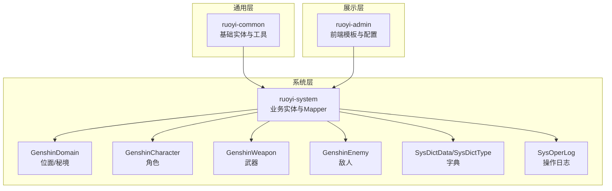
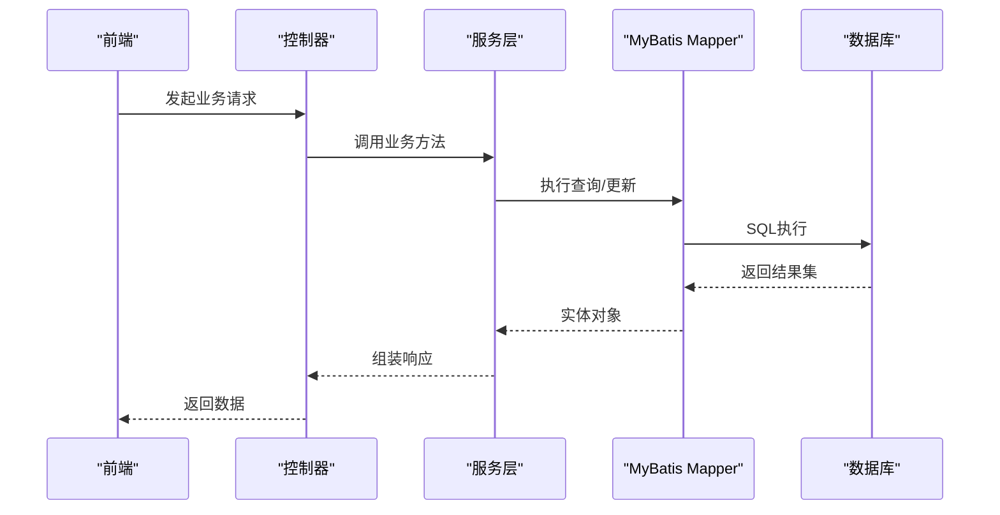
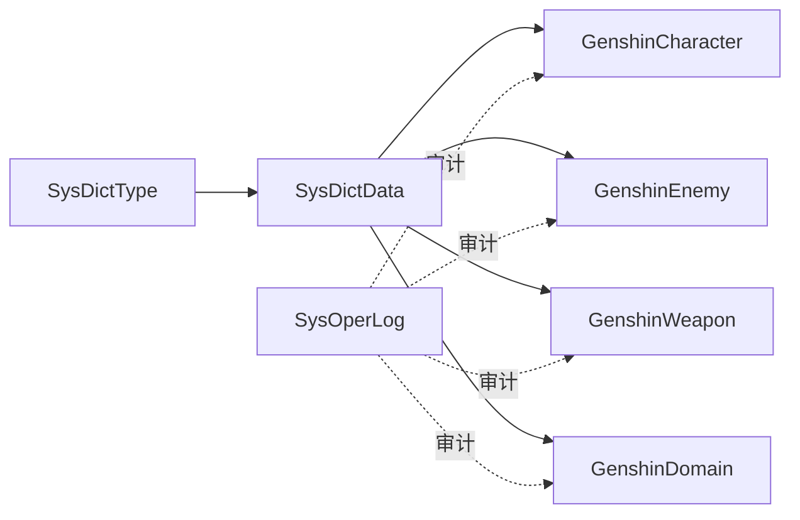

# 数据字典

<cite>
**本文引用的文件**
- [GenshinCharacterMapper.xml](file://GenShin/RuoYi-master/ruoyi-system/src/main/resources/mapper/system/GenshinCharacterMapper.xml)
- [GenshinEnemyMapper.xml](file://GenShin/RuoYi-master/ruoyi-system/src/main/resources/mapper/system/GenshinEnemyMapper.xml)
- [GenshinDomainMapper.xml](file://GenShin/RuoYi-master/ruoyi-system/src/main/resources/mapper/system/GenshinDomainMapper.xml)
- [SysDictData.java](file://GenShin/RuoYi-master/ruoyi-common/src/main/java/com/ruoyi/common/core/domain/entity/SysDictData.java)
- [SysDictType.java](file://GenShin/RuoYi-master/ruoyi-common/src/main/java/com/ruoyi/common/core/domain/entity/SysDictType.java)
- [GenshinWeapon.java](file://GenShin/RuoYi-master/ruoyi-system/src/main/java/com/ruoyi/system/domain/GenshinWeapon.java)
- [SysOperLog.java](file://GenShin/RuoYi-master/ruoyi-system/src/main/java/com/ruoyi/system/domain/SysOperLog.java)
- [GENSHIN_MODULE_GUIDE.md](file://GenShin/RuoYi-master/GENSHIN_MODULE_GUIDE.md)
- [迁移指南.md](file://GenShin/RuoYi-master/迁移指南.md)
- [application.yml](file://GenShin/RuoYi-master/ruoyi-admin/src/main/resources/application.yml)
</cite>

## 目录
1. 引言
2. 项目结构
3. 核心组件
4. 架构总览
5. 详细组件分析
6. 依赖分析
7. 性能考虑
8. 故障排查指南
9. 结论
10. 附录

## 引言
本数据字典面向“原神攻略系统”的企业级落地实践，基于现有代码库中的实体映射与领域模型，梳理并标准化各业务表字段的定义、类型、长度、取值范围、业务含义、空值策略与默认值等，形成可追溯、可演进、可合规的数据资产。文档同时给出字段命名规范、数据质量标准、枚举值定义、版本与变更管理流程、影响评估与迁移策略，以及与业务规则及合规要求的对应关系。

## 项目结构
围绕“原神攻略系统”，后端采用 RuoYi 框架分层架构：通用模块提供基础能力（如字典、分页、校验），系统模块承载业务域模型与 Mapper 映射，Admin 提供前端模板与配置。数据字典聚焦系统模块中的核心业务表及其字段。

图示来源
- [GENSHIN_MODULE_GUIDE.md](file://GenShin/RuoYi-master/GENSHIN_MODULE_GUIDE.md)
- [SysDictData.java](file://GenShin/RuoYi-master/ruoyi-common/src/main/java/com/ruoyi/common/core/domain/entity/SysDictData.java)
- [SysDictType.java](file://GenShin/RuoYi-master/ruoyi-common/src/main/java/com/ruoyi/common/core/domain/entity/SysDictType.java)
- [GenshinDomainMapper.xml](file://GenShin/RuoYi-master/ruoyi-system/src/main/resources/mapper/system/GenshinDomainMapper.xml)
- [GenshinCharacterMapper.xml](file://GenShin/RuoYi-master/ruoyi-system/src/main/resources/mapper/system/GenshinCharacterMapper.xml)
- [GenshinWeapon.java](file://GenShin/RuoYi-master/ruoyi-system/src/main/java/com/ruoyi/system/domain/GenshinWeapon.java)
- [GenshinEnemyMapper.xml](file://GenShin/RuoYi-master/ruoyi-system/src/main/resources/mapper/system/GenshinEnemyMapper.xml)
- [SysOperLog.java](file://GenShin/RuoYi-master/ruoyi-system/src/main/java/com/ruoyi/system/domain/SysOperLog.java)

章节来源
- [GENSHIN_MODULE_GUIDE.md](file://GenShin/RuoYi-master/GENSHIN_MODULE_GUIDE.md)

## 核心组件
本节对与数据字典直接相关的核心实体进行字段级定义与质量标准说明，覆盖以下主题：
- 字段命名规范与统一风格
- 数据类型与长度约束
- 取值范围与枚举值
- 默认值与空值策略
- 数据质量标准与校验规则
- 与业务规则的对应关系
- 合规性要求（如脱敏、审计）

章节来源
- [GenshinCharacterMapper.xml](file://GenShin/RuoYi-master/ruoyi-system/src/main/resources/mapper/system/GenshinCharacterMapper.xml)
- [GenshinEnemyMapper.xml](file://GenShin/RuoYi-master/ruoyi-system/src/main/resources/mapper/system/GenshinEnemyMapper.xml)
- [GenshinDomainMapper.xml](file://GenShin/RuoYi-master/ruoyi-system/src/main/resources/mapper/system/GenshinDomainMapper.xml)
- [SysDictData.java](file://GenShin/RuoYi-master/ruoyi-common/src/main/java/com/ruoyi/common/core/domain/entity/SysDictData.java)
- [SysDictType.java](file://GenShin/RuoYi-master/ruoyi-common/src/main/java/com/ruoyi/common/core/domain/entity/SysDictType.java)
- [GenshinWeapon.java](file://GenShin/RuoYi-master/ruoyi-system/src/main/java/com/ruoyi/system/domain/GenshinWeapon.java)
- [SysOperLog.java](file://GenShin/RuoYi-master/ruoyi-system/src/main/java/com/ruoyi/system/domain/SysOperLog.java)

## 架构总览
数据流从前端请求进入控制器，经服务层调用业务逻辑，持久化通过 MyBatis Mapper 完成。字典与日志作为横切能力贯穿各模块。

图示来源
- [GenshinCharacterMapper.xml](file://GenShin/RuoYi-master/ruoyi-system/src/main/resources/mapper/system/GenshinCharacterMapper.xml)
- [GenshinDomainMapper.xml](file://GenShin/RuoYi-master/ruoyi-system/src/main/resources/mapper/system/GenshinDomainMapper.xml)
- [GenshinEnemyMapper.xml](file://GenShin/RuoYi-master/ruoyi-system/src/main/resources/mapper/system/GenshinEnemyMapper.xml)

## 详细组件分析

### 角色表（genshin_character）
- 字段命名规范：采用 snake_case，主键自增 id；描述类字段统一带 _text 后缀以区分文本与枚举值。
- 数据类型与长度：整型 id、字符串 name/title/description 等，长度由数据库与校验共同约束。
- 取值范围与枚举值：
  - 武器类型：如 sword、claymore、polearm、catalyst、bow 等（以实际枚举为准）。
  - 身体类型/性别：按业务枚举定义。
  - 声优字段：cv_chinese/cv_english/cv_japanese/cv_korean，建议统一格式或外键关联声优字典。
- 默认值与空值策略：
  - 主键自增，非空。
  - 描述类字段允许为空，但建议在业务层补充默认文案。
- 数据质量标准：
  - 名称唯一性校验；武器类型与文本需一致。
- 业务规则对应：
  - 角色与武器搭配推荐、突破材料需求等依赖该表字段。
- 合规性：
  - 声优信息可能涉及个人敏感数据，需遵循隐私保护与最小化原则。

章节来源
- [GenshinCharacterMapper.xml](file://GenShin/RuoYi-master/ruoyi-system/src/main/resources/mapper/system/GenshinCharacterMapper.xml)

### 敌人表（genshin_enemy）
- 字段命名规范：snake_case；特殊名称 special_names 用于存储多语言别名。
- 数据类型与长度：整型 monster_id、字符串 name/special_names/monster_type/enemy_type/category_type/text 等。
- 取值范围与枚举值：
  - monster_type/enemy_type/category_type 等建议通过字典表统一管理。
- 默认值与空值策略：
  - 主键自增；名称必填；类别文本可为空时需明确默认语义。
- 数据质量标准：
  - 特殊名称与主名称应保持一致性；类型字段需与字典项匹配。
- 业务规则对应：
  - 掉落奖励、挑战难度、元素反应等依赖该表。
- 合规性：
  - 多语言字段需符合本地化规范与内容安全要求。

章节来源
- [GenshinEnemyMapper.xml](file://GenShin/RuoYi-master/ruoyi-system/src/main/resources/mapper/system/GenshinEnemyMapper.xml)

### 位面/秘境表（genshin_domain）
- 字段命名规范：snake_case；日期字段 days_of_week 使用复数形式表示集合。
- 数据类型与长度：整型/字符串混合；推荐使用 JSON 存储复杂字段。
- 取值范围与枚举值：
  - domain_type 与 recommended_elements 建议通过字典表统一。
- 默认值与空值策略：
  - 推荐等级与解锁等级可为空；集合字段为空表示不限制。
- 数据质量标准：
  - 推荐元素与难度需一致；开放日期与解锁等级需逻辑一致。
- 业务规则对应：
  - 团队编组、元素反应、每日刷新等依赖该表。
- 合规性：
  - 日程类字段需与运营排期一致，避免误导用户。

章节来源
- [GenshinDomainMapper.xml](file://GenShin/RuoYi-master/ruoyi-system/src/main/resources/mapper/system/GenshinDomainMapper.xml)

### 武器表（genshin_weapon）
- 字段命名规范：snake_case；强化描述字段以 R1/R2/R3/R4/R5 后缀区分等级。
- 数据类型与长度：整型 costs_json 存储 JSON；字符串 story/createdAt/updatedAt 等。
- 取值范围与枚举值：
  - 武器类型、精炼等级等通过字典表统一。
- 默认值与空值策略：
  - 成长类型、突破材料等可为空；故事描述可为空但建议补全。
- 数据质量标准：
  - 成长曲线与突破材料需与策划配置一致；强化描述需与等级一一对应。
- 业务规则对应：
  - 武器培养、队伍搭配、材料需求等依赖该表。
- 合规性：
  - JSON 字段需进行安全校验与长度控制，防止注入与超长。

章节来源
- [GenshinWeapon.java](file://GenShin/RuoYi-master/ruoyi-system/src/main/java/com/ruoyi/system/domain/GenshinWeapon.java)

### 字典表（sys_dict_data/sys_dict_type）
- 字段命名规范：snake_case；字典类型 dict_type 采用小写+下划线，且以字母开头。
- 数据类型与长度：
  - dict_type 长度限制为不超过 100 字符，正则约束仅允许小写字母、数字、下划线，且以字母开头。
  - dict_label/dict_value/dict_type 等长度与业务场景匹配。
- 取值范围与枚举值：
  - dict_type 唯一性约束；status 建议使用统一枚举（启用/停用）。
- 默认值与空值策略：
  - dict_sort 数值型排序字段；is_default 建议默认 N，仅在特定场景设 Y。
- 数据质量标准：
  - 字典类型唯一性校验；标签与键值需一一对应；样式类字段用于前端渲染。
- 业务规则对应：
  - 全局枚举值管理，支撑角色、武器、敌人等多表的类型字段。
- 合规性：
  - 字典类型命名与内容需符合内部规范与审计要求。

章节来源
- [SysDictData.java](file://GenShin/RuoYi-master/ruoyi-common/src/main/java/com/ruoyi/common/core/domain/entity/SysDictData.java)
- [SysDictType.java](file://GenShin/RuoYi-master/ruoyi-common/src/main/java/com/ruoyi/common/core/domain/entity/SysDictType.java)

### 操作日志表（sys_oper_log）
- 字段命名规范：snake_case；操作人、部门、IP、位置、参数、结果、状态等字段清晰表达业务含义。
- 数据类型与长度：字符串 operName/deptName/operUrl/operIp/operLocation/operParam/jsonResult 等；状态字段为数值型。
- 取值范围与枚举值：
  - 状态字段建议使用统一枚举（成功/失败/异常）。
- 默认值与空值策略：
  - 参数与结果可为空；状态默认 0 或空，表示未明确。
- 数据质量标准：
  - IP 与位置解析需准确；参数与结果需脱敏处理。
- 业务规则对应：
  - 审计追踪、合规检查、问题定位依赖该表。
- 合规性：
  - 日志中不得保留敏感信息；需满足 GDPR/网络安全法等要求。

章节来源
- [SysOperLog.java](file://GenShin/RuoYi-master/ruoyi-system/src/main/java/com/ruoyi/system/domain/SysOperLog.java)

## 依赖分析
- 字典表为全局枚举中心，被角色、敌人、武器等多表引用。
- 操作日志贯穿所有业务操作，提供审计与回溯能力。
- Mapper 层负责 SQL 生成与条件拼接，确保字段与实体一致。

图示来源
- [SysDictData.java](file://GenShin/RuoYi-master/ruoyi-common/src/main/java/com/ruoyi/common/core/domain/entity/SysDictData.java)
- [SysDictType.java](file://GenShin/RuoYi-master/ruoyi-common/src/main/java/com/ruoyi/common/core/domain/entity/SysDictType.java)
- [GenshinCharacterMapper.xml](file://GenShin/RuoYi-master/ruoyi-system/src/main/resources/mapper/system/GenshinCharacterMapper.xml)
- [GenshinEnemyMapper.xml](file://GenShin/RuoYi-master/ruoyi-system/src/main/resources/mapper/system/GenshinEnemyMapper.xml)
- [GenshinDomainMapper.xml](file://GenShin/RuoYi-master/ruoyi-system/src/main/resources/mapper/system/GenshinDomainMapper.xml)
- [GenshinWeapon.java](file://GenShin/RuoYi-master/ruoyi-system/src/main/java/com/ruoyi/system/domain/GenshinWeapon.java)
- [SysOperLog.java](file://GenShin/RuoYi-master/ruoyi-system/src/main/java/com/ruoyi/system/domain/SysOperLog.java)

## 性能考虑
- 索引策略：对常用过滤字段（如角色名、敌人类型、位面类型）建立索引；对组合查询建立复合索引。
- 分页与缓存：列表查询使用分页；高频枚举值通过字典表缓存。
- 写入优化：批量插入与条件更新，减少网络往返与锁竞争。
- 日志落库：操作日志异步写入，避免阻塞主业务。

## 故障排查指南
- 字段不一致：检查实体类与 Mapper XML 的字段映射，确保大小写与 snake_case 一致。
- 枚举不生效：确认字典类型唯一且状态正常；前端渲染需与后端枚举一致。
- 日志缺失：核对操作日志拦截器配置与开关；检查日志表权限与容量。
- 性能问题：分析慢查询日志，确认索引与 SQL 条件；必要时引入缓存。

章节来源
- [GenshinCharacterMapper.xml](file://GenShin/RuoYi-master/ruoyi-system/src/main/resources/mapper/system/GenshinCharacterMapper.xml)
- [GenshinEnemyMapper.xml](file://GenShin/RuoYi-master/ruoyi-system/src/main/resources/mapper/system/GenshinEnemyMapper.xml)
- [GenshinDomainMapper.xml](file://GenShin/RuoYi-master/ruoyi-system/src/main/resources/mapper/system/GenshinDomainMapper.xml)
- [SysOperLog.java](file://GenShin/RuoYi-master/ruoyi-system/src/main/java/com/ruoyi/system/domain/SysOperLog.java)

## 结论
本数据字典以“原神攻略系统”现有代码为基础，建立了统一的字段命名、类型、取值范围、默认值与空值策略，并明确了与业务规则、字典体系与合规要求的对应关系。建议在后续迭代中持续完善字典项、增强字段校验与日志脱敏，并制定严格的版本与变更管理流程，确保数据资产的稳定性与可维护性。

## 附录

### 字段命名规范
- 统一使用 snake_case。
- 主键字段统一为 id；描述类字段统一带 _text 后缀。
- 枚举字段统一带 _type/_value 后缀，便于与字典表关联。
- 集合类字段使用复数形式（如 days_of_week）。

### 数据质量标准
- 唯一性：主键唯一；字典类型唯一；角色名在同服唯一。
- 完整性：必填字段不允许为空；可选字段需有明确默认语义。
- 一致性：枚举值与字典表一致；文本与类型字段相互匹配。
- 安全性：日志与导出需脱敏；JSON 字段需校验长度与结构。

### 枚举值定义（示例）
- 武器类型：sword、claymore、polearm、catalyst、bow
- 身体类型/性别：male、female、other
- 字典状态：0（启用）、1（停用）
- 操作日志状态：0（正常）、1（异常）

### 默认值与空值策略
- 主键：自增，非空。
- 描述类字段：允许为空，建议业务层提供默认文案。
- 枚举类字段：建议默认值为“未知”或“未设置”，便于识别脏数据。
- 集合类字段：为空表示不限制；建议提供默认空集合。

### 数据字典维护流程与版本管理
- 变更申请：提出字段变更需求，明确业务背景与影响范围。
- 影响评估：评估对实体、Mapper、字典、前端与报表的影响。
- 设计评审：组织开发、测试、产品与运维评审。
- 版本发布：在灰度环境验证后，纳入正式版本。
- 回滚预案：准备回滚脚本与数据修复方案。

章节来源
- [GENSHIN_MODULE_GUIDE.md](file://GenShin/RuoYi-master/GENSHIN_MODULE_GUIDE.md)
- [迁移指南.md](file://GenShin/RuoYi-master/迁移指南.md)
- [application.yml](file://GenShin/RuoYi-master/ruoyi-admin/src/main/resources/application.yml)