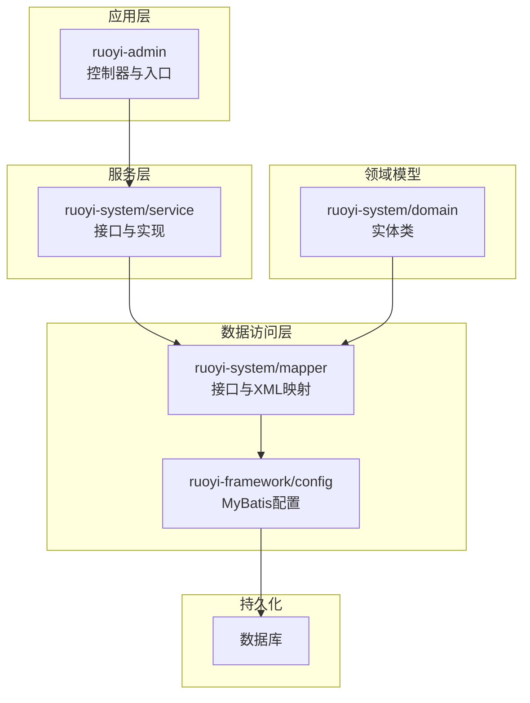
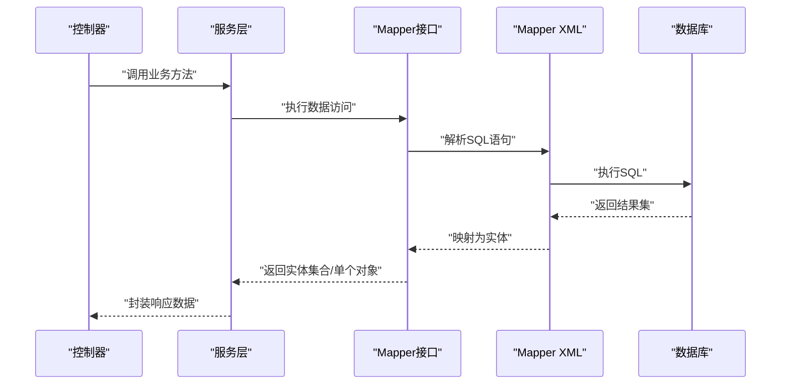
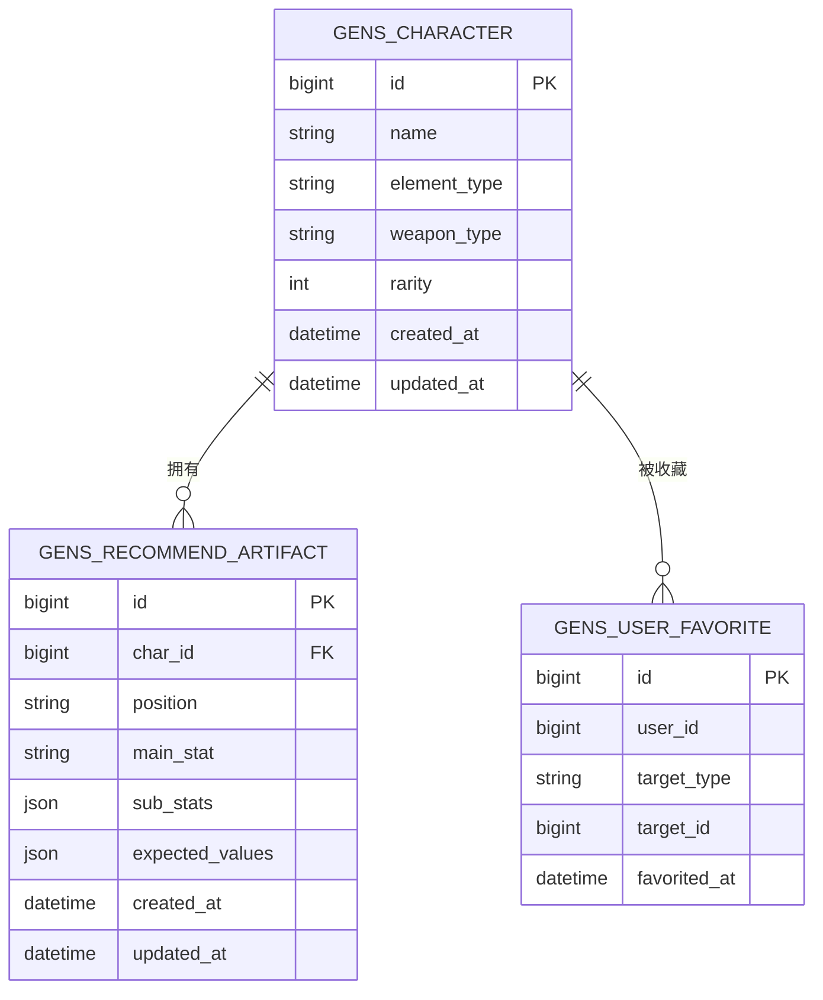
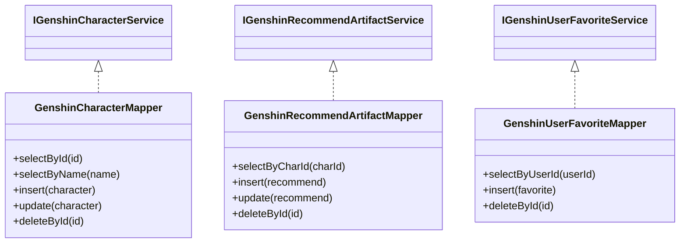
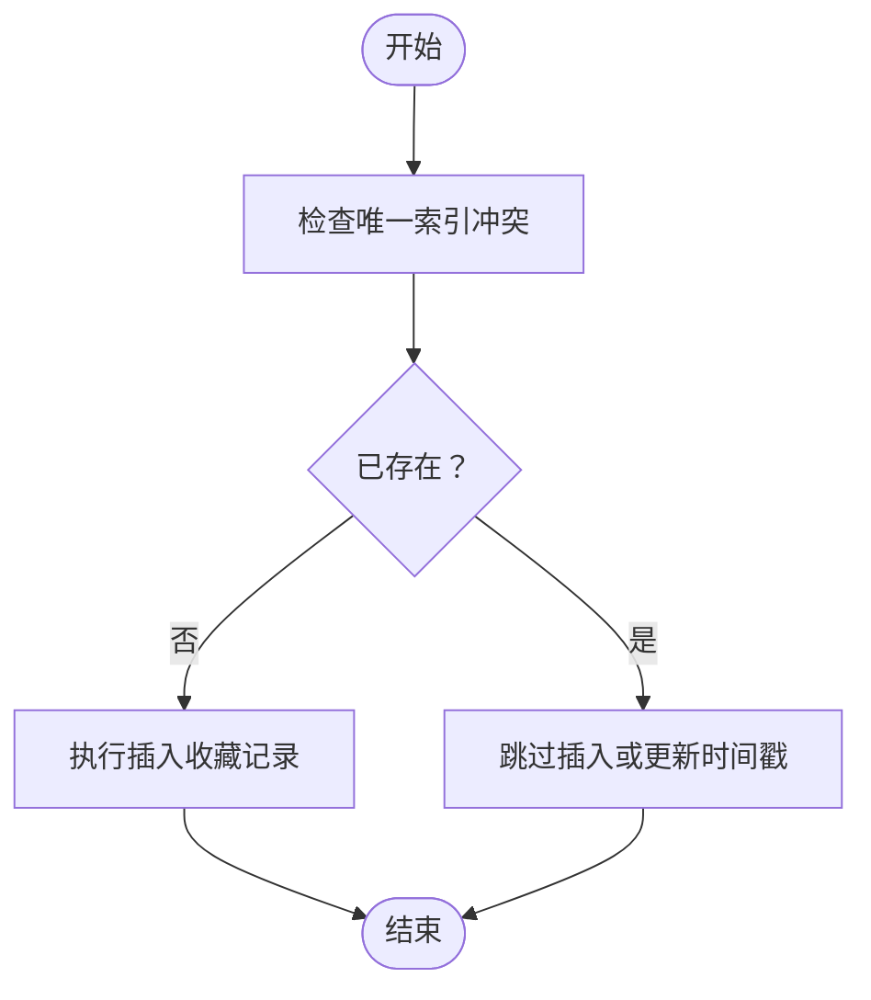
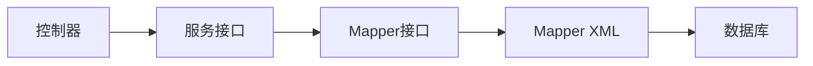

# 数据库设计

<cite>
**本文引用的文件**
- [GenshinCharacter.java](file://ruoyi-system/src/main/java/com/ruoyi/system/domain/GenshinCharacter.java)
- [GenshinRecommendArtifact.java](file://ruoyi-system/src/main/java/com/ruoyi/system/domain/GenshinRecommendArtifact.java)
- [GenshinUserFavorite.java](file://ruoyi-system/src/main/java/com/ruoyi/system/domain/GenshinUserFavorite.java)
- [GenshinCharacterMapper.java](file://ruoyi-system/src/main/java/com/ruoyi/system/mapper/GenshinCharacterMapper.java)
- [GenshinRecommendArtifactMapper.java](file://ruoyi-system/src/main/java/com/ruoyi/system/mapper/GenshinRecommendArtifactMapper.java)
- [GenshinUserFavoriteMapper.java](file://ruoyi-system/src/main/java/com/ruoyi/system/mapper/GenshinUserFavoriteMapper.java)
- [GenshinCharacterMapper.xml](file://ruoyi-system/src/main/resources/mapper/system/GenshinCharacterMapper.xml)
- [GenshinRecommendArtifactMapper.xml](file://ruoyi-system/src/main/resources/mapper/system/GenshinRecommendArtifactMapper.xml)
- [GenshinUserFavoriteMapper.xml](file://ruoyi-system/src/main/resources/mapper/system/GenshinUserFavoriteMapper.xml)
- [IGenshinCharacterService.java](file://ruoyi-system/src/main/java/com/ruoyi/system/service/IGenshinCharacterService.java)
- [IGenshinRecommendArtifactService.java](file://ruoyi-system/src/main/java/com/ruoyi/system/service/IGenshinRecommendArtifactService.java)
- [IGenshinUserFavoriteService.java](file://ruoyi-system/src/main/java/com/ruoyi/system/service/IGenshinUserFavoriteService.java)
- [application.yml](file://ruoyi-admin/src/main/resources/application.yml)
- [MyBatisConfig.java](file://ruoyi-framework/src/main/java/com/ruoyi/framework/config/MyBatisConfig.java)
- [RuoYiApplication.java](file://ruoyi-admin/src/main/java/com/ruoyi/RuoYiApplication.java)
- [sql 脚本文件](file://docx/详细设计/sql脚本文件)
</cite>

## 目录
1. [简介](#简介)
2. [项目结构](#项目结构)
3. [核心组件](#核心组件)
4. [架构总览](#架构总览)
5. [详细组件分析](#详细组件分析)
6. [依赖分析](#依赖分析)
7. [性能考虑](#性能考虑)
8. [故障排查指南](#故障排查指南)
9. [结论](#结论)
10. [附录](#附录)

## 简介
本文件面向“原神攻略系统”的数据库设计与实现，聚焦于核心实体：GenshinCharacter（角色）、GenshinRecommendArtifact（推荐圣遗物）、GenshinUserFavorite（用户收藏）的数据模型设计、ER 关系、索引策略、完整性约束与业务规则，并给出数据字典、初始化脚本与迁移方案建议，以及基于 MyBatis 的数据访问层设计模式与 ORM 映射关系说明。

## 项目结构
系统采用前后端分离的典型分层架构，后端基于 RuoYi 框架，数据库访问通过 MyBatis 实现。核心模块位于 ruoyi-system，包含领域对象、Mapper 接口与 XML 映射、Service 层接口；配置位于 ruoyi-admin 的 application.yml；框架层在 ruoyi-framework 中提供 MyBatis 配置与动态数据源支持。

**图表来源**
- [RuoYiApplication.java](file://ruoyi-admin/src/main/java/com/ruoyi/RuoYiApplication.java)
- [MyBatisConfig.java](file://ruoyi-framework/src/main/java/com/ruoyi/framework/config/MyBatisConfig.java)
- [GenshinCharacterMapper.java](file://ruoyi-system/src/main/java/com/ruoyi/system/mapper/GenshinCharacterMapper.java)
- [GenshinRecommendArtifactMapper.java](file://ruoyi-system/src/main/java/com/ruoyi/system/mapper/GenshinRecommendArtifactMapper.java)
- [GenshinUserFavoriteMapper.java](file://ruoyi-system/src/main/java/com/ruoyi/system/mapper/GenshinUserFavoriteMapper.java)

**章节来源**
- [application.yml](file://ruoyi-admin/src/main/resources/application.yml)
- [RuoYiApplication.java](file://ruoyi-admin/src/main/java/com/ruoyi/RuoYiApplication.java)
- [MyBatisConfig.java](file://ruoyi-framework/src/main/java/com/ruoyi/framework/config/MyBatisConfig.java)

## 核心组件
本节对三个关键实体进行字段定义、数据类型、业务含义与约束的梳理，并结合其 Mapper/XML 映射关系说明主外键与索引策略。

- GenshinCharacter（角色）
  - 字段与类型：包含角色标识、名称、元素属性、武器类型、星级、基础属性等字段（具体字段以实体类为准）。
  - 业务含义：描述原神角色的基础信息与可选配置项，用于推荐与计算。
  - 约束与索引：建议主键自增；按“角色名”建立唯一索引；按“元素/武器类型”建立普通索引以优化查询。
  - 外键：无直接外键依赖，但与其他推荐表存在逻辑关联。

- GenshinRecommendArtifact（推荐圣遗物）
  - 字段与类型：包含推荐标识、角色ID、部位、主属性、副词条、期望数值等字段。
  - 业务含义：为指定角色提供最优圣遗物搭配建议，支撑“推荐”功能。
  - 约束与索引：建议主键自增；按“角色ID+部位”组合索引；按“主属性/副词条”建立索引。
  - 外键：建议外键指向 GenshinCharacter 角色表，保证数据一致性。

- GenshinUserFavorite（用户收藏）
  - 字段与类型：包含收藏标识、用户ID、目标类型（如角色/推荐）、目标ID、收藏时间等字段。
  - 业务含义：记录用户的偏好与收藏，支持个性化展示。
  - 约束与索引：建议主键自增；按“用户ID+目标类型+目标ID”建立唯一索引，避免重复收藏；按“收藏时间”建立索引。
  - 外键：建议外键指向被收藏的目标（如 GenshinCharacter 或推荐表），视业务需要而定。

**章节来源**
- [GenshinCharacter.java](file://ruoyi-system/src/main/java/com/ruoyi/system/domain/GenshinCharacter.java)
- [GenshinRecommendArtifact.java](file://ruoyi-system/src/main/java/com/ruoyi/system/domain/GenshinRecommendArtifact.java)
- [GenshinUserFavorite.java](file://ruoyi-system/src/main/java/com/ruoyi/system/domain/GenshinUserFavorite.java)

## 架构总览
下图展示了从控制器到服务、Mapper、XML 映射与数据库的完整调用链路，体现典型的 MyBatis 分层架构。

**图表来源**
- [GenshinCharacterMapper.java](file://ruoyi-system/src/main/java/com/ruoyi/system/mapper/GenshinCharacterMapper.java)
- [GenshinRecommendArtifactMapper.java](file://ruoyi-system/src/main/java/com/ruoyi/system/mapper/GenshinRecommendArtifactMapper.java)
- [GenshinUserFavoriteMapper.java](file://ruoyi-system/src/main/java/com/ruoyi/system/mapper/GenshinUserFavoriteMapper.java)
- [GenshinCharacterMapper.xml](file://ruoyi-system/src/main/resources/mapper/system/GenshinCharacterMapper.xml)
- [GenshinRecommendArtifactMapper.xml](file://ruoyi-system/src/main/resources/mapper/system/GenshinRecommendArtifactMapper.xml)
- [GenshinUserFavoriteMapper.xml](file://ruoyi-system/src/main/resources/mapper/system/GenshinUserFavoriteMapper.xml)

## 详细组件分析

### ER 关系与表结构设计
基于实体职责与业务关系，建议以下 ER 设计：

- 主键策略：所有表采用自增主键，确保唯一性与高并发下的稳定性。
- 外键策略：推荐表与用户收藏表建议维护外键约束，以保证引用完整性。
- 索引策略：
  - GenshinCharacter：唯一索引（name），普通索引（element_type, weapon_type）。
  - GenshinRecommendArtifact：唯一索引（char_id, position），普通索引（main_stat）。
  - GenshinUserFavorite：唯一索引（user_id, target_type, target_id），普通索引（favorited_at）。

**图表来源**
- [GenshinCharacter.java](file://ruoyi-system/src/main/java/com/ruoyi/system/domain/GenshinCharacter.java)
- [GenshinRecommendArtifact.java](file://ruoyi-system/src/main/java/com/ruoyi/system/domain/GenshinRecommendArtifact.java)
- [GenshinUserFavorite.java](file://ruoyi-system/src/main/java/com/ruoyi/system/domain/GenshinUserFavorite.java)

**章节来源**
- [GenshinCharacterMapper.xml](file://ruoyi-system/src/main/resources/mapper/system/GenshinCharacterMapper.xml)
- [GenshinRecommendArtifactMapper.xml](file://ruoyi-system/src/main/resources/mapper/system/GenshinRecommendArtifactMapper.xml)
- [GenshinUserFavoriteMapper.xml](file://ruoyi-system/src/main/resources/mapper/system/GenshinUserFavoriteMapper.xml)

### 数据访问层设计模式与 ORM 映射
- 设计模式
  - DAO/Repository 模式：通过 Mapper 接口抽象数据访问，Service 层仅依赖接口，降低耦合。
  - 单元测试友好：接口化便于 Mock 与隔离测试。
- ORM 映射
  - MyBatis XML 映射：在 XML 中集中管理 SQL 与结果映射，支持复杂查询与批量操作。
  - 注解映射：可在简单场景中使用注解，但复杂查询建议保持在 XML 中以便维护。
- 事务与连接
  - 基于 Spring 的声明式事务管理，确保跨多个 Mapper 的一致性。
  - 动态数据源与多租户支持（框架层提供），可根据业务扩展。

**图表来源**
- [GenshinCharacterMapper.java](file://ruoyi-system/src/main/java/com/ruoyi/system/mapper/GenshinCharacterMapper.java)
- [GenshinRecommendArtifactMapper.java](file://ruoyi-system/src/main/java/com/ruoyi/system/mapper/GenshinRecommendArtifactMapper.java)
- [GenshinUserFavoriteMapper.java](file://ruoyi-system/src/main/java/com/ruoyi/system/mapper/GenshinUserFavoriteMapper.java)
- [IGenshinCharacterService.java](file://ruoyi-system/src/main/java/com/ruoyi/system/service/IGenshinCharacterService.java)
- [IGenshinRecommendArtifactService.java](file://ruoyi-system/src/main/java/com/ruoyi/system/service/IGenshinRecommendArtifactService.java)
- [IGenshinUserFavoriteService.java](file://ruoyi-system/src/main/java/com/ruoyi/system/service/IGenshinUserFavoriteService.java)

**章节来源**
- [MyBatisConfig.java](file://ruoyi-framework/src/main/java/com/ruoyi/framework/config/MyBatisConfig.java)
- [GenshinCharacterMapper.java](file://ruoyi-system/src/main/java/com/ruoyi/system/mapper/GenshinCharacterMapper.java)
- [GenshinRecommendArtifactMapper.java](file://ruoyi-system/src/main/java/com/ruoyi/system/mapper/GenshinRecommendArtifactMapper.java)
- [GenshinUserFavoriteMapper.java](file://ruoyi-system/src/main/java/com/ruoyi/system/mapper/GenshinUserFavoriteMapper.java)

### 复杂逻辑流程（示例：用户收藏去重）
当用户收藏同一目标时，应避免重复插入。流程如下：

**图表来源**
- [GenshinUserFavoriteMapper.xml](file://ruoyi-system/src/main/resources/mapper/system/GenshinUserFavoriteMapper.xml)

## 依赖分析
- 组件内聚与耦合
  - Mapper 与 XML 强耦合，便于 SQL 维护；通过接口与 Service 解耦。
  - Service 依赖 Mapper 接口，不关心具体实现，提升可测试性。
- 外部依赖
  - MyBatis 作为 ORM 框架，负责 SQL 与对象映射。
  - Spring 管理事务与生命周期，提供 AOP 支持。
- 潜在循环依赖
  - 当前结构清晰，未见循环依赖迹象；若后续扩展，需避免 Service 间相互调用导致环状依赖。

**图表来源**
- [GenshinCharacterMapper.java](file://ruoyi-system/src/main/java/com/ruoyi/system/mapper/GenshinCharacterMapper.java)
- [GenshinRecommendArtifactMapper.java](file://ruoyi-system/src/main/java/com/ruoyi/system/mapper/GenshinRecommendArtifactMapper.java)
- [GenshinUserFavoriteMapper.java](file://ruoyi-system/src/main/java/com/ruoyi/system/mapper/GenshinUserFavoriteMapper.java)

**章节来源**
- [application.yml](file://ruoyi-admin/src/main/resources/application.yml)

## 性能考虑
- 查询优化
  - 为高频过滤字段（如角色名、元素类型、武器类型、收藏时间）建立合适索引。
  - 使用分页查询与延迟加载，避免一次性加载大结果集。
- 写入优化
  - 批量插入/更新推荐与收藏数据，减少往返次数。
  - 合理设置数据库连接池参数，避免阻塞。
- 缓存策略
  - 对热点角色与推荐数据引入缓存（如 Redis），降低数据库压力。
- 监控与诊断
  - 开启慢查询日志与执行计划分析，持续优化关键 SQL。

## 故障排查指南
- 常见问题
  - 插入失败（唯一约束冲突）：检查唯一索引是否覆盖业务需求，必要时调整索引或提示用户。
  - 外键约束失败：确认被引用记录是否存在，或在业务层先创建主数据再写入从表。
  - 查询性能差：检查执行计划，补充缺失索引或重构 SQL。
- 排查步骤
  - 查看应用日志与数据库慢查询日志。
  - 使用 EXPLAIN 分析 SQL 执行计划。
  - 在测试环境复现问题，逐步缩小范围。

**章节来源**
- [GenshinUserFavoriteMapper.xml](file://ruoyi-system/src/main/resources/mapper/system/GenshinUserFavoriteMapper.xml)

## 结论
本文基于现有代码结构，给出了 GenshinCharacter、GenshinRecommendArtifact、GenshinUserFavorite 的数据库设计建议，明确了 ER 关系、索引策略与业务规则，并总结了数据访问层的分层设计与 ORM 映射方式。建议在生产环境中进一步完善索引、缓存与监控体系，持续优化查询与写入性能。

## 附录

### 数据字典与字段说明
- GenshinCharacter（角色）
  - id：主键，自增
  - name：角色名，唯一索引
  - element_type：元素类型
  - weapon_type：武器类型
  - rarity：星级
  - created_at/updated_at：创建与更新时间

- GenshinRecommendArtifact（推荐圣遗物）
  - id：主键，自增
  - char_id：角色ID，外键（建议）
  - position：部位
  - main_stat：主属性
  - sub_stats：副词条（JSON）
  - expected_values：期望数值（JSON）
  - created_at/updated_at：创建与更新时间

- GenshinUserFavorite（用户收藏）
  - id：主键，自增
  - user_id：用户ID
  - target_type：目标类型（角色/推荐等）
  - target_id：目标ID
  - favorited_at：收藏时间

**章节来源**
- [GenshinCharacter.java](file://ruoyi-system/src/main/java/com/ruoyi/system/domain/GenshinCharacter.java)
- [GenshinRecommendArtifact.java](file://ruoyi-system/src/main/java/com/ruoyi/system/domain/GenshinRecommendArtifact.java)
- [GenshinUserFavorite.java](file://ruoyi-system/src/main/java/com/ruoyi/system/domain/GenshinUserFavorite.java)

### 初始化脚本与迁移方案
- 初始化脚本
  - 建议在 docx/详细设计/sql脚本文件中提供建表 SQL、索引与约束定义，以及初始数据样例。
- 迁移方案
  - 采用版本化迁移（如 Flyway/Liquibase），每次变更生成新迁移脚本，记录变更历史。
  - 先在测试环境验证，再灰度发布至生产，确保回滚策略完备。

**章节来源**
- [sql 脚本文件](file://docx/详细设计/sql脚本文件)