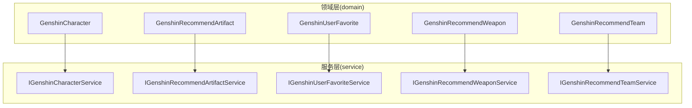
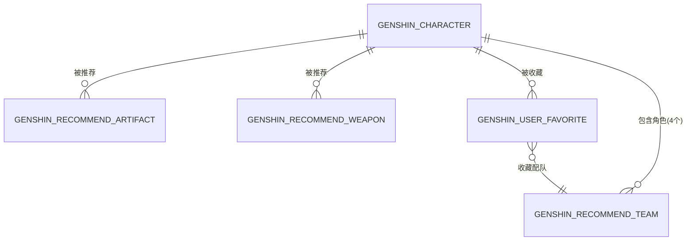
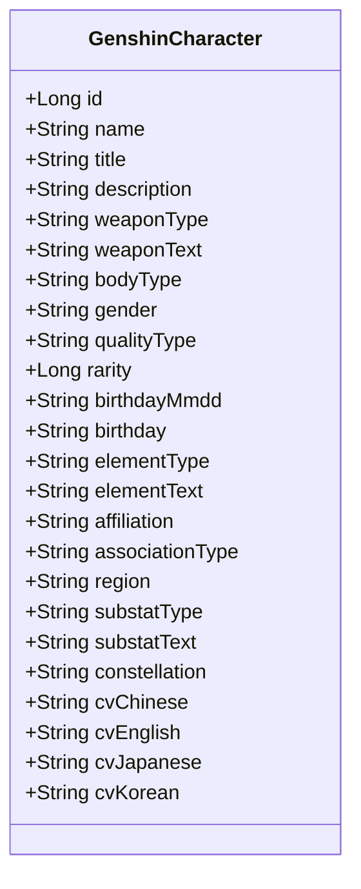
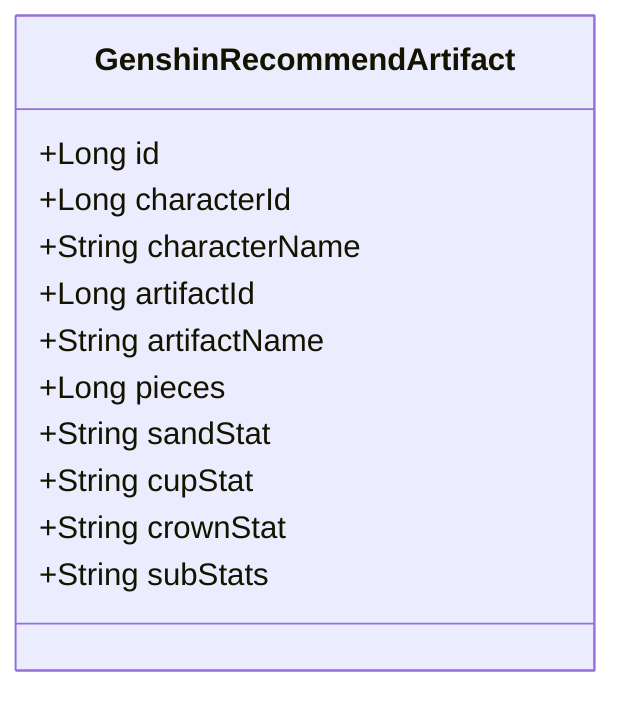
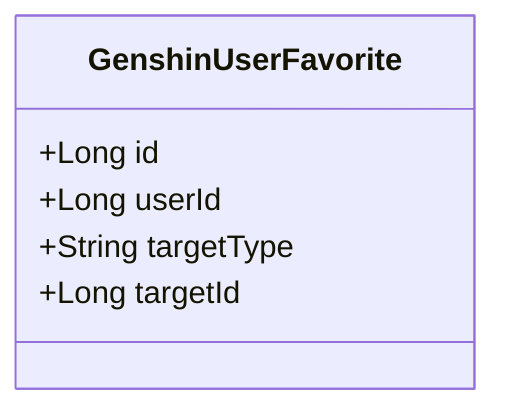
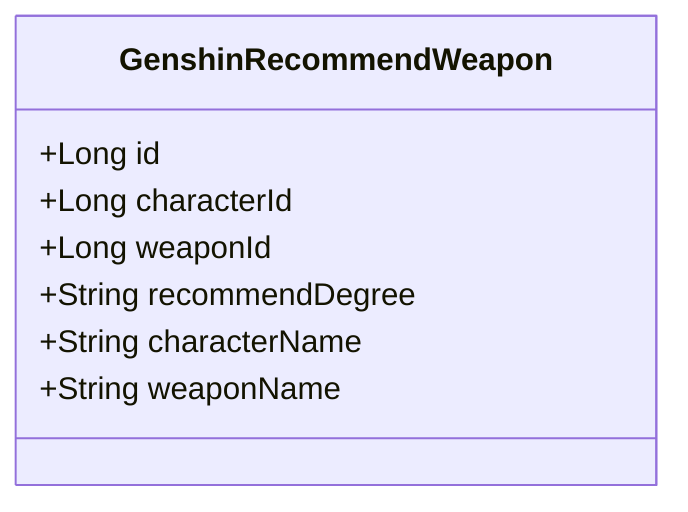
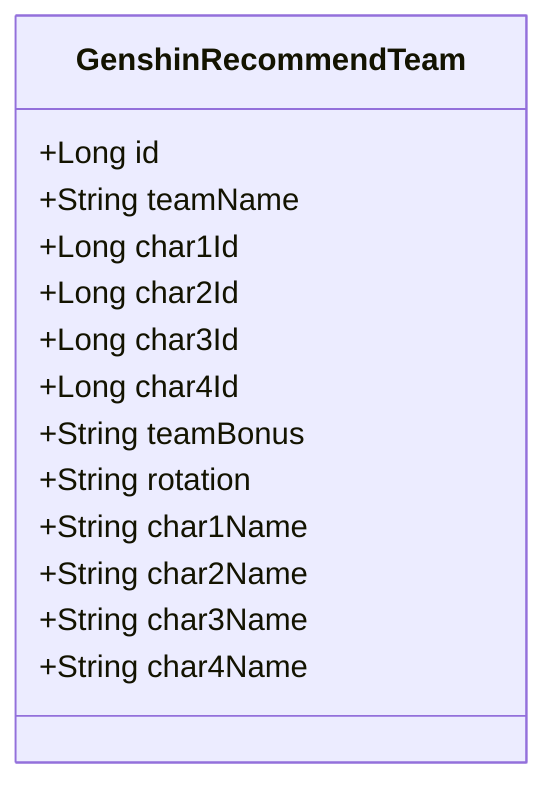
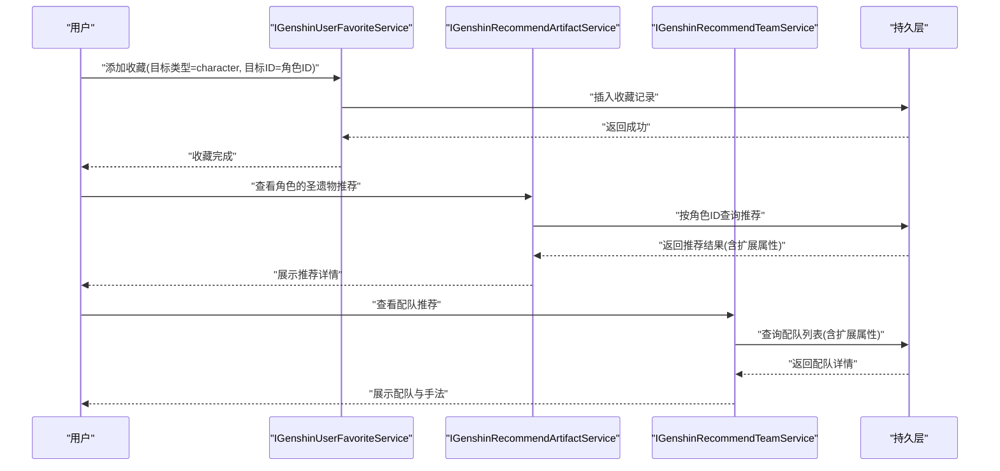
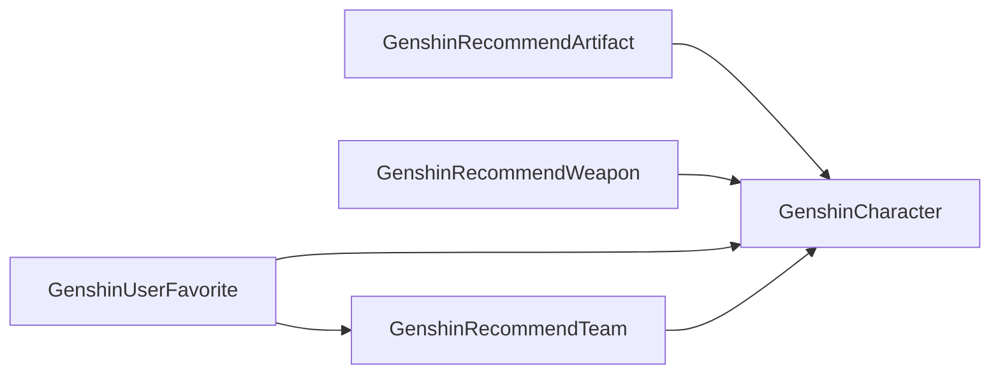

# 数据模型设计

<cite>
**本文引用的文件**
- [GenshinCharacter.java](file://GenShin/RuoYi-master/ruoyi-system/src/main/java/com/ruoyi/system/domain/GenshinCharacter.java)
- [GenshinRecommendArtifact.java](file://GenShin/RuoYi-master/ruoyi-system/src/main/java/com/ruoyi/system/domain/GenshinRecommendArtifact.java)
- [GenshinUserFavorite.java](file://GenShin/RuoYi-master/ruoyi-system/src/main/java/com/ruoyi/system/domain/GenshinUserFavorite.java)
- [GenshinRecommendWeapon.java](file://GenShin/RuoYi-master/ruoyi-system/src/main/java/com/ruoyi/system/domain/GenshinRecommendWeapon.java)
- [GenshinRecommendTeam.java](file://GenShin/RuoYi-master/ruoyi-system/src/main/java/com/ruoyi/system/domain/GenshinRecommendTeam.java)
- [IGenshinCharacterService.java](file://GenShin/RuoYi-master/ruoyi-system/src/main/java/com/ruoyi/system/service/IGenshinCharacterService.java)
- [IGenshinRecommendArtifactService.java](file://GenShin/RuoYi-master/ruoyi-system/src/main/java/com/ruoyi/system/service/IGenshinRecommendArtifactService.java)
- [IGenshinUserFavoriteService.java](file://GenShin/RuoYi-master/ruoyi-system/src/main/java/com/ruoyi/system/service/IGenshinUserFavoriteService.java)
- [IGenshinRecommendWeaponService.java](file://GenShin/RuoYi-master/ruoyi-system/src/main/java/com/ruoyi/system/service/IGenshinRecommendWeaponService.java)
- [IGenshinRecommendTeamService.java](file://GenShin/RuoYi-master/ruoyi-system/src/main/java/com/ruoyi/system/service/IGenshinRecommendTeamService.java)
</cite>

## 目录
1. [引言](#引言)
2. [项目结构](#项目结构)
3. [核心组件](#核心组件)
4. [架构总览](#架构总览)
5. [详细组件分析](#详细组件分析)
6. [依赖分析](#依赖分析)
7. [性能考量](#性能考量)
8. [故障排查指南](#故障排查指南)
9. [结论](#结论)
10. [附录](#附录)

## 引言
本文件面向“原神攻略系统”的数据层，聚焦于核心实体类的设计与业务建模，涵盖以下关键实体：
- 角色模型：GenshinCharacter
- 圣遗物推荐模型：GenshinRecommendArtifact
- 用户收藏模型：GenshinUserFavorite
- 武器推荐模型：GenshinRecommendWeapon
- 配队推荐模型：GenshinRecommendTeam

我们将从字段定义、数据类型选择、业务约束、关系映射、继承与组合关系、DDD 视角下的模型划分与设计模式应用、以及模型演进与版本兼容性等方面进行系统化阐述，并辅以可视化图示帮助理解。

## 项目结构
围绕数据模型，系统采用“领域对象 + 服务接口 + Mapper/XML”的分层设计，其中：
- 领域对象位于 domain 包，承载业务属性与行为边界
- 服务接口位于 service 包，定义用例契约
- Mapper/XML 负责持久化映射（在本仓库中通过 MyBatis 映射 XML 实现）

图表来源
- [GenshinCharacter.java:1-383](file://GenShin/RuoYi-master/ruoyi-system/src/main/java/com/ruoyi/system/domain/GenshinCharacter.java#L1-L383)
- [GenshinRecommendArtifact.java:1-163](file://GenShin/RuoYi-master/ruoyi-system/src/main/java/com/ruoyi/system/domain/GenshinRecommendArtifact.java#L1-L163)
- [GenshinUserFavorite.java:1-84](file://GenShin/RuoYi-master/ruoyi-system/src/main/java/com/ruoyi/system/domain/GenshinUserFavorite.java#L1-L84)
- [GenshinRecommendWeapon.java:1-102](file://GenShin/RuoYi-master/ruoyi-system/src/main/java/com/ruoyi/system/domain/GenshinRecommendWeapon.java#L1-L102)
- [GenshinRecommendTeam.java:1-168](file://GenShin/RuoYi-master/ruoyi-system/src/main/java/com/ruoyi/system/domain/GenshinRecommendTeam.java#L1-L168)
- [IGenshinCharacterService.java](file://GenShin/RuoYi-master/ruoyi-system/src/main/java/com/ruoyi/system/service/IGenshinCharacterService.java)
- [IGenshinRecommendArtifactService.java](file://GenShin/RuoYi-master/ruoyi-system/src/main/java/com/ruoyi/system/service/IGenshinRecommendArtifactService.java)
- [IGenshinUserFavoriteService.java](file://GenShin/RuoYi-master/ruoyi-system/src/main/java/com/ruoyi/system/service/IGenshinUserFavoriteService.java)
- [IGenshinRecommendWeaponService.java](file://GenShin/RuoYi-master/ruoyi-system/src/main/java/com/ruoyi/system/service/IGenshinRecommendWeaponService.java)
- [IGenshinRecommendTeamService.java](file://GenShin/RuoYi-master/ruoyi-system/src/main/java/com/ruoyi/system/service/IGenshinRecommendTeamService.java)

章节来源
- [GenshinCharacter.java:1-383](file://GenShin/RuoYi-master/ruoyi-system/src/main/java/com/ruoyi/system/domain/GenshinCharacter.java#L1-L383)
- [GenshinRecommendArtifact.java:1-163](file://GenShin/RuoYi-master/ruoyi-system/src/main/java/com/ruoyi/system/domain/GenshinRecommendArtifact.java#L1-L163)
- [GenshinUserFavorite.java:1-84](file://GenShin/RuoYi-master/ruoyi-system/src/main/java/com/ruoyi/system/domain/GenshinUserFavorite.java#L1-L84)
- [GenshinRecommendWeapon.java:1-102](file://GenShin/RuoYi-master/ruoyi-system/src/main/java/com/ruoyi/system/domain/GenshinRecommendWeapon.java#L1-L102)
- [GenshinRecommendTeam.java:1-168](file://GenShin/RuoYi-master/ruoyi-system/src/main/java/com/ruoyi/system/domain/GenshinRecommendTeam.java#L1-L168)

## 核心组件
本节对五个核心实体进行逐项解析，包括字段语义、数据类型、业务约束与关系映射。

- GenshinCharacter（角色）
  - 字段要点：角色唯一标识、名称、称号、描述；武器类型（编码/文本）、体型、性别；品质（编码/星级）；生日（月日/日期）；元素（编码/文本）、所属组织、阵营类型、地区；副属性（编码/文本）；命之座；各语言声优。
  - 数据类型选择：字符串型用于文本与枚举编码；数值型用于星级与整数编码；日期型用于生日。
  - 业务约束：字段多为可选或展示用途，建议在服务层进行输入校验与默认值处理；元素与武器类型需与字典/枚举保持一致。
  - 关系映射：作为被推荐对象，被 GenshinRecommendArtifact、GenshinRecommendWeapon、GenshinUserFavorite 等引用。

- GenshinRecommendArtifact（角色圣遗物推荐）
  - 字段要点：角色ID、角色名；推荐圣遗物ID、名称；件套需求（4件套/2件套）；沙漏/杯子/头冠主词条推荐；副词条优先级。
  - 数据类型选择：主键与外键使用长整型；文本字段用于词条与优先级描述。
  - 业务约束：件套需求与主词条需与游戏机制一致；副词条优先级建议标准化为可排序的枚举或固定格式。
  - 关系映射：一对一关联到角色；一对一关联到圣遗物（通过名称/ID）。

- GenshinUserFavorite（用户收藏）
  - 字段要点：收藏记录主键；用户ID（关联 sys_user 的 userId）；目标类型（如 character、team）；目标ID（角色或配队ID）。
  - 数据类型选择：长整型主键与外键；字符串枚举类型值。
  - 业务约束：目标类型与目标ID需成对出现且指向有效实体；同一用户对同一目标类型仅允许唯一收藏（可由服务层保证）。
  - 关系映射：多对一到用户；多态关联到角色或配队。

- GenshinRecommendWeapon（武器推荐）
  - 字段要点：角色ID；推荐武器ID；推荐梯度（T0/T1/T2）；扩展属性：角色名、武器名。
  - 数据类型选择：长整型主键与外键；字符串枚举梯度。
  - 业务约束：推荐梯度需与角色定位匹配；扩展属性用于展示优化。
  - 关系映射：一对一关联到角色；一对一关联到武器。

- GenshinRecommendTeam（配队推荐）
  - 字段要点：队伍名称；四号位角色ID（主C/副C/增伤/辅助/生存/盾奶）；元素共鸣；输出手法/简评；扩展属性：四角色名。
  - 数据类型选择：长整型主键与角色ID；字符串文本。
  - 业务约束：角色位置与职责需明确；元素共鸣与手法描述需与玩法一致。
  - 关系映射：四角色均一对一关联到角色；多条记录构成不同配队方案。

章节来源
- [GenshinCharacter.java:1-383](file://GenShin/RuoYi-master/ruoyi-system/src/main/java/com/ruoyi/system/domain/GenshinCharacter.java#L1-L383)
- [GenshinRecommendArtifact.java:1-163](file://GenShin/RuoYi-master/ruoyi-system/src/main/java/com/ruoyi/system/domain/GenshinRecommendArtifact.java#L1-L163)
- [GenshinUserFavorite.java:1-84](file://GenShin/RuoYi-master/ruoyi-system/src/main/java/com/ruoyi/system/domain/GenshinUserFavorite.java#L1-L84)
- [GenshinRecommendWeapon.java:1-102](file://GenShin/RuoYi-master/ruoyi-system/src/main/java/com/ruoyi/system/domain/GenshinRecommendWeapon.java#L1-L102)
- [GenshinRecommendTeam.java:1-168](file://GenShin/RuoYi-master/ruoyi-system/src/main/java/com/ruoyi/system/domain/GenshinRecommendTeam.java#L1-L168)

## 架构总览
下图展示了实体之间的关联关系与典型查询路径（含扩展属性拼接场景）：

图表来源
- [GenshinCharacter.java:1-383](file://GenShin/RuoYi-master/ruoyi-system/src/main/java/com/ruoyi/system/domain/GenshinCharacter.java#L1-L383)
- [GenshinRecommendArtifact.java:1-163](file://GenShin/RuoYi-master/ruoyi-system/src/main/java/com/ruoyi/system/domain/GenshinRecommendArtifact.java#L1-L163)
- [GenshinUserFavorite.java:1-84](file://GenShin/RuoYi-master/ruoyi-system/src/main/java/com/ruoyi/system/domain/GenshinUserFavorite.java#L1-L84)
- [GenshinRecommendWeapon.java:1-102](file://GenShin/RuoYi-master/ruoyi-system/src/main/java/com/ruoyi/system/domain/GenshinRecommendWeapon.java#L1-L102)
- [GenshinRecommendTeam.java:1-168](file://GenShin/RuoYi-master/ruoyi-system/src/main/java/com/ruoyi/system/domain/GenshinRecommendTeam.java#L1-L168)

## 详细组件分析

### 角色模型 GenshinCharacter
- 设计理念：承载角色的基础属性与元数据，支持国际化与扩展（如声优信息），便于上层推荐与收藏模块复用。
- 关键字段与约束：
  - 唯一标识：Long 类型，主键
  - 名称/标题/描述：String，用于展示与检索
  - 武器类型/元素/副属性：编码+文本双字段，兼顾存储与展示
  - 星级：Long，用于品质筛选
  - 生日：MMDD 与完整日期双字段，满足不同展示需求
  - 声优：多语言字段，便于本地化
- 继承与组合：继承通用基类，组合于推荐与收藏实体
- DDD 视角：作为聚合根的候选，围绕角色构建推荐与收藏上下文

图表来源
- [GenshinCharacter.java:1-383](file://GenShin/RuoYi-master/ruoyi-system/src/main/java/com/ruoyi/system/domain/GenshinCharacter.java#L1-L383)

章节来源
- [GenshinCharacter.java:1-383](file://GenShin/RuoYi-master/ruoyi-system/src/main/java/com/ruoyi/system/domain/GenshinCharacter.java#L1-L383)

### 圣遗物推荐模型 GenshinRecommendArtifact
- 设计理念：以角色为中心的推荐视图，提供主副词条与套装需求的策略建议。
- 关键字段与约束：
  - 角色ID与名称：建立与角色的关联
  - 套装需求：件套数量（2/4）
  - 主词条推荐：沙漏/杯子/头冠三位置
  - 副词条优先级：字符串化策略，建议统一格式
- 关系映射：一对一到角色；与实际圣遗物实体通过名称/ID关联

图表来源
- [GenshinRecommendArtifact.java:1-163](file://GenShin/RuoYi-master/ruoyi-system/src/main/java/com/ruoyi/system/domain/GenshinRecommendArtifact.java#L1-L163)

章节来源
- [GenshinRecommendArtifact.java:1-163](file://GenShin/RuoYi-master/ruoyi-system/src/main/java/com/ruoyi/system/domain/GenshinRecommendArtifact.java#L1-L163)

### 用户收藏模型 GenshinUserFavorite
- 设计理念：抽象收藏目标，支持多态目标类型（角色、配队等），实现统一管理。
- 关键字段与约束：
  - 用户ID：关联平台用户体系
  - 目标类型：枚举字符串（如 character、team）
  - 目标ID：根据类型指向具体实体
- 关系映射：多对一到用户；多态关联到角色或配队

图表来源
- [GenshinUserFavorite.java:1-84](file://GenShin/RuoYi-master/ruoyi-system/src/main/java/com/ruoyi/system/domain/GenshinUserFavorite.java#L1-L84)

章节来源
- [GenshinUserFavorite.java:1-84](file://GenShin/RuoYi-master/ruoyi-system/src/main/java/com/ruoyi/system/domain/GenshinUserFavorite.java#L1-L84)

### 武器推荐模型 GenshinRecommendWeapon
- 设计理念：基于角色定位给出推荐武器与梯度，扩展属性用于展示优化。
- 关键字段与约束：
  - 角色ID与武器ID：建立与角色/武器的关联
  - 推荐梯度：字符串枚举（T0/T1/T2）
  - 扩展属性：角色名、武器名，减少联表查询成本

图表来源
- [GenshinRecommendWeapon.java:1-102](file://GenShin/RuoYi-master/ruoyi-system/src/main/java/com/ruoyi/system/domain/GenshinRecommendWeapon.java#L1-L102)

章节来源
- [GenshinRecommendWeapon.java:1-102](file://GenShin/RuoYi-master/ruoyi-system/src/main/java/com/ruoyi/system/domain/GenshinRecommendWeapon.java#L1-L102)

### 配队推荐模型 GenshinRecommendTeam
- 设计理念：以四角色为核心构建配队，提供元素共鸣与输出手法说明。
- 关键字段与约束：
  - 四号位角色ID：明确主C/副C/增伤/辅助/生存/盾奶职责
  - 元素共鸣与简评：策略性描述
  - 扩展属性：四角色名，提升展示体验

图表来源
- [GenshinRecommendTeam.java:1-168](file://GenShin/RuoYi-master/ruoyi-system/src/main/java/com/ruoyi/system/domain/GenshinRecommendTeam.java#L1-L168)

章节来源
- [GenshinRecommendTeam.java:1-168](file://GenShin/RuoYi-master/ruoyi-system/src/main/java/com/ruoyi/system/domain/GenshinRecommendTeam.java#L1-L168)

### 典型流程：收藏与推荐联动

图表来源
- [IGenshinUserFavoriteService.java](file://GenShin/RuoYi-master/ruoyi-system/src/main/java/com/ruoyi/system/service/IGenshinUserFavoriteService.java)
- [IGenshinRecommendArtifactService.java](file://GenShin/RuoYi-master/ruoyi-system/src/main/java/com/ruoyi/system/service/IGenshinRecommendArtifactService.java)
- [IGenshinRecommendTeamService.java](file://GenShin/RuoYi-master/ruoyi-system/src/main/java/com/ruoyi/system/service/IGenshinRecommendTeamService.java)

## 依赖分析
- 组件耦合
  - GenshinRecommendArtifact 与 GenshinRecommendWeapon 依赖 GenshinCharacter
  - GenshinUserFavorite 与 GenshinRecommendTeam 依赖 GenshinCharacter
  - GenshinUserFavorite 与 GenshinRecommendTeam 之间无直接依赖，但可通过用户上下文关联
- 外部依赖
  - 服务接口与领域对象解耦，便于替换实现与测试
- 循环依赖
  - 当前模型未见循环依赖迹象

图表来源
- [GenshinRecommendArtifact.java:1-163](file://GenShin/RuoYi-master/ruoyi-system/src/main/java/com/ruoyi/system/domain/GenshinRecommendArtifact.java#L1-L163)
- [GenshinRecommendWeapon.java:1-102](file://GenShin/RuoYi-master/ruoyi-system/src/main/java/com/ruoyi/system/domain/GenshinRecommendWeapon.java#L1-L102)
- [GenshinUserFavorite.java:1-84](file://GenShin/RuoYi-master/ruoyi-system/src/main/java/com/ruoyi/system/domain/GenshinUserFavorite.java#L1-L84)
- [GenshinRecommendTeam.java:1-168](file://GenShin/RuoYi-master/ruoyi-system/src/main/java/com/ruoyi/system/domain/GenshinRecommendTeam.java#L1-L168)

章节来源
- [GenshinRecommendArtifact.java:1-163](file://GenShin/RuoYi-master/ruoyi-system/src/main/java/com/ruoyi/system/domain/GenshinRecommendArtifact.java#L1-L163)
- [GenshinRecommendWeapon.java:1-102](file://GenShin/RuoYi-master/ruoyi-system/src/main/java/com/ruoyi/system/domain/GenshinRecommendWeapon.java#L1-L102)
- [GenshinUserFavorite.java:1-84](file://GenShin/RuoYi-master/ruoyi-system/src/main/java/com/ruoyi/system/domain/GenshinUserFavorite.java#L1-L84)
- [GenshinRecommendTeam.java:1-168](file://GenShin/RuoYi-master/ruoyi-system/src/main/java/com/ruoyi/system/domain/GenshinRecommendTeam.java#L1-L168)

## 性能考量
- 查询路径优化
  - 扩展属性（角色名/武器名/角色名）可减少联表次数，提升读取性能
  - 建议在推荐与收藏查询时批量加载，避免 N+1 查询
- 索引与分区
  - 在角色ID、用户ID、目标类型/目标ID组合上建立索引，加速过滤与去重
- 缓存策略
  - 对热门角色与推荐配置进行缓存，降低数据库压力
- 分页与排序
  - 列表查询建议分页与稳定排序，结合前端虚拟滚动优化大列表体验

## 故障排查指南
- 常见问题
  - 收藏失败：检查用户ID是否有效、目标类型与目标ID是否匹配
  - 推荐为空：确认角色是否存在、推荐数据是否已导入
  - 展示异常：检查扩展属性是否正确填充（角色名/武器名）
- 定位方法
  - 通过服务接口日志与事务边界定位异常点
  - 使用单元测试覆盖边界条件（空值、非法枚举、越界ID）

章节来源
- [IGenshinUserFavoriteService.java](file://GenShin/RuoYi-master/ruoyi-system/src/main/java/com/ruoyi/system/service/IGenshinUserFavoriteService.java)
- [IGenshinRecommendArtifactService.java](file://GenShin/RuoYi-master/ruoyi-system/src/main/java/com/ruoyi/system/service/IGenshinRecommendArtifactService.java)
- [IGenshinRecommendTeamService.java](file://GenShin/RuoYi-master/ruoyi-system/src/main/java/com/ruoyi/system/service/IGenshinRecommendTeamService.java)

## 结论
本数据模型以角色为核心，围绕推荐与收藏两大业务场景展开，采用清晰的字段语义与合理的数据类型选择，既满足当前功能需求，又为后续扩展留有余地。通过服务接口与领域对象的解耦设计，配合扩展属性与索引策略，可在保证一致性的同时提升性能与可维护性。

## 附录
- DDD 模型划分原则
  - 聚合边界：以角色为聚合根，围绕其构建推荐与收藏上下文
  - 值对象：词条、优先级等可视为值对象，便于复用与不可变性
  - 领域服务：跨聚合的推荐计算与收藏去重逻辑下沉至服务层
- 设计模式应用
  - 工厂/仓储：用于创建与持久化实体
  - 适配器：扩展属性用于 DTO 适配，减少映射复杂度
- 模型演进与版本兼容
  - 新增字段建议采用可选与默认值策略，避免破坏既有查询
  - 枚举字段建议引入字典表或常量枚举，确保跨版本一致性
  - 版本升级时保留历史推荐与收藏数据，提供迁移脚本与回滚策略