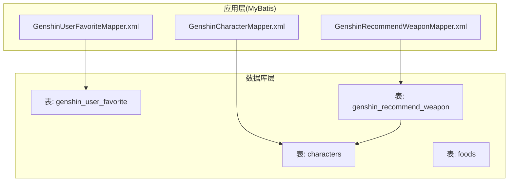
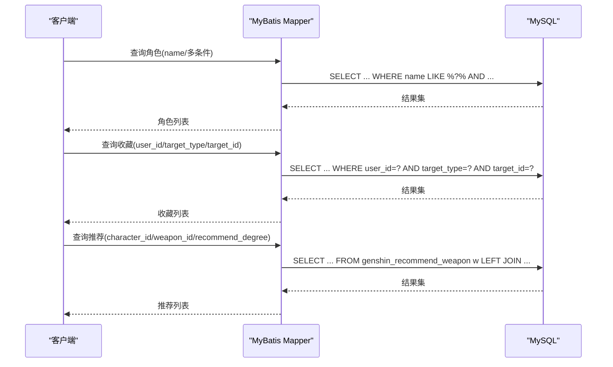
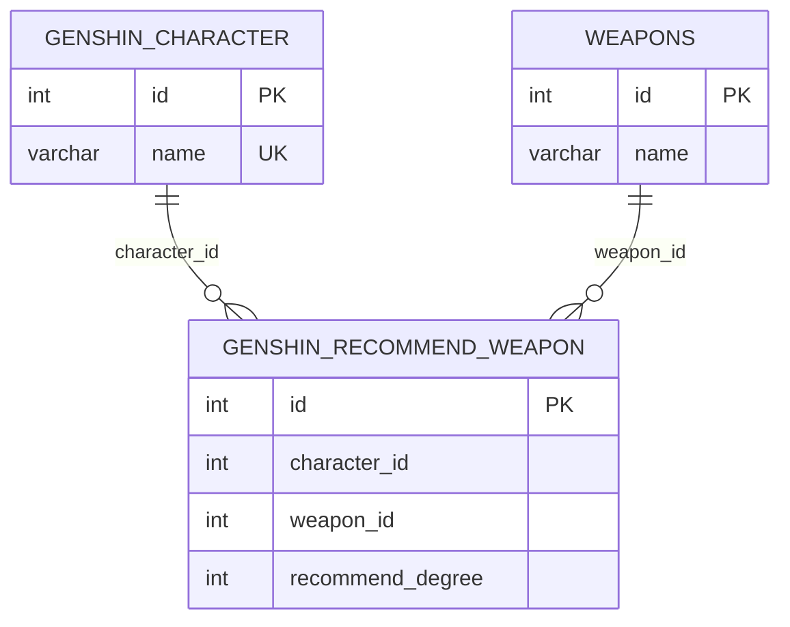

# 索引策略

<cite>
**本文档引用的文件**
- [genshin_all.sql](file://sql/genshin_all.sql)
- [GenshinCharacterMapper.xml](file://ruoyi-system/src/main/resources/mapper/system/GenshinCharacterMapper.xml)
- [GenshinUserFavoriteMapper.xml](file://ruoyi-system/src/main/resources/mapper/system/GenshinUserFavoriteMapper.xml)
- [GenshinRecommendWeaponMapper.xml](file://ruoyi-system/src/main/resources/mapper/system/GenshinRecommendWeaponMapper.xml)
</cite>

## 目录
1. [简介](#简介)
2. [项目结构](#项目结构)
3. [核心组件](#核心组件)
4. [架构总览](#架构总览)
5. [详细组件分析](#详细组件分析)
6. [依赖分析](#依赖分析)
7. [性能考虑](#性能考虑)
8. [故障排查指南](#故障排查指南)
9. [结论](#结论)
10. [附录](#附录)

## 简介
本文件面向“原神攻略系统”的数据库索引策略，结合现有表结构与查询映射文件，系统阐述各表的主键索引、唯一索引、复合索引与全文索引的设计原则、使用场景与性能权衡。文档同时给出索引优化建议、维护计划与最佳实践，帮助在高并发与多样化查询场景下实现稳定高效的数据库性能。

## 项目结构
- 数据库脚本位于 sql/genshin_all.sql，包含主要业务表（如 characters、foods 等）的建表语句与索引定义。
- MyBatis 映射文件位于 ruoyi-system 模块的 mapper/system 下，包含查询条件与关联关系，为索引设计提供依据。

图表来源
- [genshin_all.sql](file://sql/genshin_all.sql)
- [GenshinCharacterMapper.xml](file://ruoyi-system/src/main/resources/mapper/system/GenshinCharacterMapper.xml)
- [GenshinUserFavoriteMapper.xml](file://ruoyi-system/src/main/resources/mapper/system/GenshinUserFavoriteMapper.xml)
- [GenshinRecommendWeaponMapper.xml](file://ruoyi-system/src/main/resources/mapper/system/GenshinRecommendWeaponMapper.xml)

章节来源
- [genshin_all.sql](file://sql/genshin_all.sql)
- [GenshinCharacterMapper.xml](file://ruoyi-system/src/main/resources/mapper/system/GenshinCharacterMapper.xml)
- [GenshinUserFavoriteMapper.xml](file://ruoyi-system/src/main/resources/mapper/system/GenshinUserFavoriteMapper.xml)
- [GenshinRecommendWeaponMapper.xml](file://ruoyi-system/src/main/resources/mapper/system/GenshinRecommendWeaponMapper.xml)

## 核心组件
- 角色表（characters）
  - 主键：id
  - 唯一索引：name
  - 其他索引：无
- 菜品表（foods）
  - 主键：id
  - 唯一索引：无
  - 其他索引：rarity、foodtype、filter_type、character_name
- 用户收藏表（genshin_user_favorite）
  - 主键：id
  - 其他索引：user_id、target_type、target_id
- 推荐武器表（genshin_recommend_weapon）
  - 主键：id
  - 其他索引：character_id、weapon_id、recommend_degree

章节来源
- [genshin_all.sql](file://sql/genshin_all.sql)
- [GenshinCharacterMapper.xml](file://ruoyi-system/src/main/resources/mapper/system/GenshinCharacterMapper.xml)
- [GenshinUserFavoriteMapper.xml](file://ruoyi-system/src/main/resources/mapper/system/GenshinUserFavoriteMapper.xml)
- [GenshinRecommendWeaponMapper.xml](file://ruoyi-system/src/main/resources/mapper/system/GenshinRecommendWeaponMapper.xml)

## 架构总览
- 查询路径
  - 角色查询：基于名称模糊匹配与多字段过滤，适合在 name 上建立唯一索引以支持精确查找与去重。
  - 收藏查询：按用户维度聚合，适合在 user_id 上建立索引；同时按目标类型与目标ID过滤，可考虑复合索引。
  - 推荐查询：涉及多表关联，character_id 与 weapon_id 的过滤较为频繁，适合在两张表上分别建立索引。
  - 菜品查询：按稀有度、类型、筛选类型、角色名等字段过滤，适合在对应列上建立单列索引或复合索引。

图表来源
- [GenshinCharacterMapper.xml](file://ruoyi-system/src/main/resources/mapper/system/GenshinCharacterMapper.xml)
- [GenshinUserFavoriteMapper.xml](file://ruoyi-system/src/main/resources/mapper/system/GenshinUserFavoriteMapper.xml)
- [GenshinRecommendWeaponMapper.xml](file://ruoyi-system/src/main/resources/mapper/system/GenshinRecommendWeaponMapper.xml)

## 详细组件分析

### 角色表（characters）
- 设计要点
  - 主键：id（自增或业务主键），确保每条记录唯一标识。
  - 唯一索引：name（保证角色名称唯一，便于精确检索与去重）。
- 查询模式
  - 精确查找：按 id 或 name 精确匹配。
  - 模糊查找：按 name 进行模糊匹配（如 name LIKE CONCAT('%', ?, '%')）。
- 索引策略
  - 主键索引：自动创建，无需额外维护。
  - 唯一索引：name，保障唯一性与高效精确查找。
  - 复合索引：暂不需要，当前查询以单字段为主。
- 性能考量
  - 唯一索引有利于去重与精确匹配，但会增加写入成本。
  - 若存在高频的多字段过滤（如元素类型、武器类型等），可评估是否新增复合索引。
- 维护建议
  - 定期检查唯一约束冲突与索引碎片。
  - 写入高峰后执行 ANALYZE/REBUILD 以保持统计信息准确。

章节来源
- [genshin_all.sql](file://sql/genshin_all.sql)
- [GenshinCharacterMapper.xml](file://ruoyi-system/src/main/resources/mapper/system/GenshinCharacterMapper.xml)

### 菜品表（foods）
- 设计要点
  - 主键：id。
  - 单列索引：rarity、foodtype、filter_type、character_name。
- 查询模式
  - 按稀有度、类型、筛选类型、角色名过滤。
  - 可能存在多条件组合查询。
- 索引策略
  - 单列索引：rarity、foodtype、filter_type、character_name，覆盖常见过滤场景。
  - 复合索引：若存在高频的两列/三列组合过滤，可考虑 (rarity, foodtype)、(filter_type, character_name) 等。
- 性能考量
  - 单列索引维护成本低，但多列过滤时可能无法命中单一索引。
  - 对于高选择性的列优先建立索引。
- 维护建议
  - 定期统计各索引的使用率与回表次数，淘汰低效索引。
  - 对热点列进行分区或归档，降低扫描范围。

章节来源
- [genshin_all.sql](file://sql/genshin_all.sql)

### 用户收藏表（genshin_user_favorite）
- 设计要点
  - 主键：id。
  - 单列索引：user_id、target_type、target_id。
- 查询模式
  - 按用户维度查询收藏列表。
  - 按目标类型与目标ID过滤。
- 索引策略
  - user_id：高频按用户查询，建议建立索引。
  - target_type + target_id：用于按目标类型与ID过滤，建议建立复合索引以减少回表。
- 性能考量
  - 复合索引可显著提升多条件过滤效率。
  - 写入频繁时注意索引同步成本。
- 维护建议
  - 定期清理无效收藏，压缩表空间。
  - 对 user_id 进行分片或分区，避免单表过大。

章节来源
- [genshin_all.sql](file://sql/genshin_all.sql)
- [GenshinUserFavoriteMapper.xml](file://ruoyi-system/src/main/resources/mapper/system/GenshinUserFavoriteMapper.xml)

### 推荐武器表（genshin_recommend_weapon）
- 设计要点
  - 主键：id。
  - 单列索引：character_id、weapon_id、recommend_degree。
- 查询模式
  - 按角色ID查询推荐武器。
  - 按武器ID查询推荐情况。
  - 按推荐等级过滤。
- 索引策略
  - character_id、weapon_id：高频过滤字段，建议建立索引。
  - recommend_degree：排序或范围查询时可考虑建立索引。
- 性能考量
  - 与角色表、武器表存在关联查询，建议在关联键上建立索引以减少 JOIN 成本。
- 维护建议
  - 定期分析慢查询日志，识别低效 JOIN。
  - 对大表进行归档或冷热分离。

章节来源
- [genshin_all.sql](file://sql/genshin_all.sql)
- [GenshinRecommendWeaponMapper.xml](file://ruoyi-system/src/main/resources/mapper/system/GenshinRecommendWeaponMapper.xml)

### 全文索引（建议）
- 当前表结构未见全文索引定义。
- 适用场景
  - 对菜品描述、角色描述等大文本字段进行关键词检索。
- 实施建议
  - 为 description、effect、ingredients 等字段建立全文索引。
  - 使用全文检索函数（如 MATCH AGAINST）替代 LIKE %...% 提升性能。
  - 注意全文索引的维护成本与写入延迟。

章节来源
- [genshin_all.sql](file://sql/genshin_all.sql)

## 依赖分析
- 表间关系
  - genshin_recommend_weapon 通过 character_id 关联角色表，通过 weapon_id 关联武器表（假设存在）。
- 查询依赖
  - 角色查询依赖 name 唯一索引。
  - 收藏查询依赖 user_id、target_type、target_id 索引。
  - 推荐查询依赖 character_id、weapon_id 索引。

图表来源
- [genshin_all.sql](file://sql/genshin_all.sql)
- [GenshinRecommendWeaponMapper.xml](file://ruoyi-system/src/main/resources/mapper/system/GenshinRecommendWeaponMapper.xml)

章节来源
- [genshin_all.sql](file://sql/genshin_all.sql)
- [GenshinRecommendWeaponMapper.xml](file://ruoyi-system/src/main/resources/mapper/system/GenshinRecommendWeaponMapper.xml)

## 性能考虑
- 查询频率与选择性
  - 高频且高选择性的字段优先建立索引（如 user_id、character_id）。
  - 低选择性字段（如性别、类型枚举）建立索引收益有限。
- 写入性能影响
  - 索引越多，INSERT/UPDATE/DELETE 开销越大。
  - 建议在业务低峰期执行索引维护操作。
- 统计信息与执行计划
  - 定期执行 ANALYZE 更新统计信息，确保优化器选择最优执行计划。
  - 使用 EXPLAIN 分析关键查询的索引使用情况。
- 缓存与读写分离
  - 将热点查询结果缓存，减少数据库压力。
  - 读写分离：写库负责写入，读库负责查询，降低锁竞争。

## 故障排查指南
- 常见问题
  - 查询慢：检查是否存在全表扫描、缺少必要索引或复合索引未命中。
  - 写入慢：检查索引数量与写入峰值，评估是否需要分批写入或异步处理。
  - 唯一约束冲突：检查 name 等唯一字段的重复插入。
- 排查步骤
  - 使用 EXPLAIN 分析 SQL 执行计划。
  - 查看慢查询日志，定位热点 SQL。
  - 检查索引使用率与碎片，必要时重建索引。
  - 监控表大小与分区状态，避免单表过大。

章节来源
- [GenshinCharacterMapper.xml](file://ruoyi-system/src/main/resources/mapper/system/GenshinCharacterMapper.xml)
- [GenshinUserFavoriteMapper.xml](file://ruoyi-system/src/main/resources/mapper/system/GenshinUserFavoriteMapper.xml)
- [GenshinRecommendWeaponMapper.xml](file://ruoyi-system/src/main/resources/mapper/system/GenshinRecommendWeaponMapper.xml)

## 结论
- 当前索引设计基本覆盖高频查询场景：角色表的 name 唯一索引、菜品表的多列单列索引、收藏表与推荐表的关键过滤字段索引。
- 建议进一步完善：针对多条件过滤场景引入复合索引；对大文本字段引入全文索引；定期维护统计信息与索引碎片。
- 在高并发与海量数据场景下，应结合缓存、读写分离与分区策略，持续优化查询与写入性能。

## 附录
- 索引维护计划
  - 周期性任务：每周执行 ANALYZE，每月重建碎片严重索引。
  - 监控告警：索引失效、慢查询突增、写入延迟升高触发告警。
- 统计信息更新
  - 生产环境建议每日自动更新全局统计信息。
- 索引重建策略
  - 对长期未使用或低效索引进行归档与重建，减少冗余索引。
- 最佳实践清单
  - 优先为高选择性字段建立索引。
  - 复合索引遵循“最左前缀”原则，避免回表。
  - 对大文本字段启用全文检索，替代 LIKE %...%。
  - 写入高峰期避免大规模 DDL 操作。