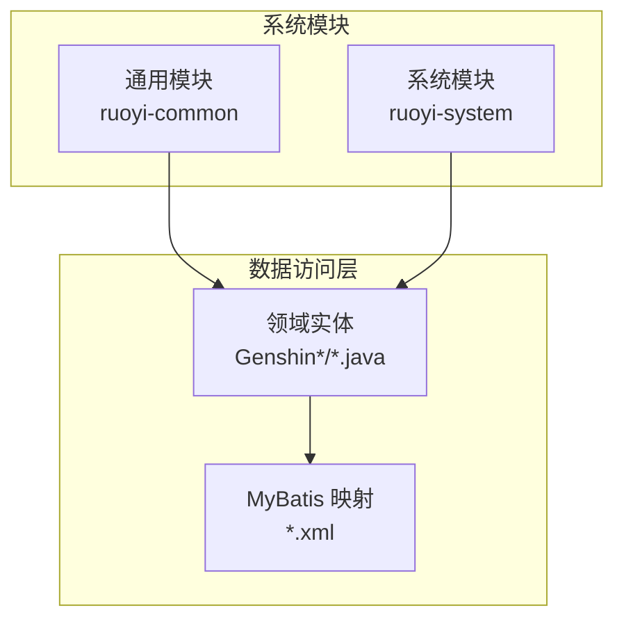
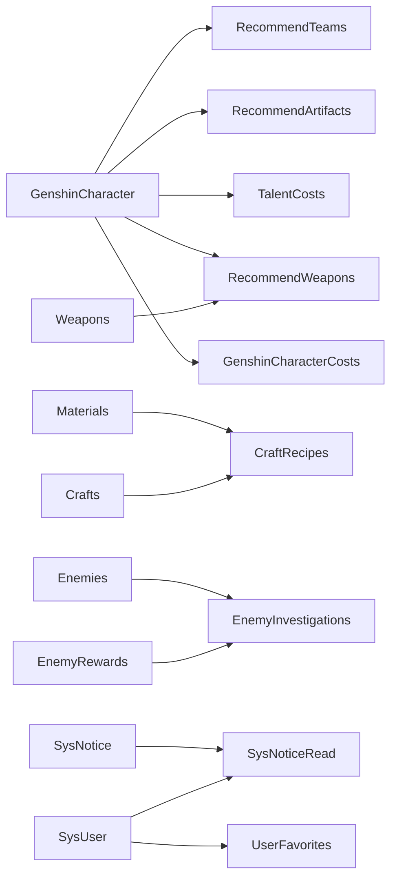

# 表结构设计

<cite>
**本文引用的文件**
- [GenshinCharacter.java](file://GenShin/RuoYi-master/ruoyi-system/src/main/java/com/ruoyi/system/domain/GenshinCharacter.java)
- [GenshinWeapon.java](file://GenShin/RuoYi-master/ruoyi-system/src/main/java/com/ruoyi/system/domain/GenshinWeapon.java)
- [GenshinCraft.java](file://GenShin/RuoYi-master/ruoyi-system/src/main/java/com/ruoyi/system/domain/GenshinCraft.java)
- [GenshinDomain.java](file://GenShin/RuoYi-master/ruoyi-system/src/main/java/com/ruoyi/system/domain/GenshinDomain.java)
- [GenshinCharacterCost.java](file://GenShin/RuoYi-master/ruoyi-system/src/main/java/com/ruoyi/system/domain/GenshinCharacterCost.java)
- [TalentCosts.java](file://GenShin/RuoYi-master/ruoyi-system/src/main/java/com/ruoyi/system/domain/TalentCosts.java)
- [Materials.java](file://GenShin/RuoYi-master/ruoyi-system/src/main/java/com/ruoyi/system/domain/Materials.java)
- [GenshinRecommendWeapon.java](file://GenShin/RuoYi-master/ruoyi-system/src/main/java/com/ruoyi/system/domain/GenshinRecommendWeapon.java)
- [GenshinRecommendArtifact.java](file://GenShin/RuoYi-master/ruoyi-system/src/main/java/com/ruoyi/system/domain/GenshinRecommendArtifact.java)
- [GenshinRecommendTeam.java](file://GenShin/RuoYi-master/ruoyi-system/src/main/java/com/ruoyi/system/domain/GenshinRecommendTeam.java)
- [GenshinUserFavorite.java](file://GenShin/RuoYi-master/ruoyi-system/src/main/java/com/ruoyi/system/domain/GenshinUserFavorite.java)
- [GenshinEnemy.java](file://GenShin/RuoYi-master/ruoyi-system/src/main/java/com/ruoyi/system/domain/GenshinEnemy.java)
- [GenshinEnemyInvestigation.java](file://GenShin/RuoYi-master/ruoyi-system/src/main/java/com/ruoyi/system/domain/GenshinEnemyInvestigation.java)
- [GenshinEnemyReward.java](file://GenShin/RuoYi-master/ruoyi-system/src/main/java/com/ruoyi/system/domain/GenshinEnemyReward.java)
- [GenshinCharacterMapper.xml](file://GenShin/RuoYi-master/ruoyi-system/src/main/resources/mapper/system/GenshinCharacterMapper.xml)
- [GenshinWeaponMapper.xml](file://GenShin/RuoYi-master/ruoyi-system/src/main/resources/mapper/system/GenshinWeaponMapper.xml)
- [GenshinCraftMapper.xml](file://GenShin/RuoYi-master/ruoyi-system/src/main/resources/mapper/system/GenshinCraftMapper.xml)
- [GenshinDomainMapper.xml](file://GenShin/RuoYi-master/ruoyi-system/src/main/resources/mapper/system/GenshinDomainMapper.xml)
- [GenshinCharacterCostMapper.xml](file://GenShin/RuoYi-master/ruoyi-system/src/main/resources/mapper/system/GenshinCharacterCostMapper.xml)
- [TalentCostsMapper.xml](file://GenShin/RuoYi-master/ruoyi-system/src/main/resources/mapper/system/TalentCostsMapper.xml)
- [MaterialsMapper.xml](file://GenShin/RuoYi-master/ruoyi-system/src/main/resources/mapper/system/MaterialsMapper.xml)
- [GenshinRecommendWeaponMapper.xml](file://GenShin/RuoYi-master/ruoyi-system/src/main/resources/mapper/system/GenshinRecommendWeaponMapper.xml)
- [GenshinRecommendArtifactMapper.xml](file://GenShin/RuoYi-master/ruoyi-system/src/main/resources/mapper/system/GenshinRecommendArtifactMapper.xml)
- [GenshinRecommendTeamMapper.xml](file://GenShin/RuoYi-master/ruoyi-system/src/main/resources/mapper/system/GenshinRecommendTeamMapper.xml)
- [GenshinUserFavoriteMapper.xml](file://GenShin/RuoYi-master/ruoyi-system/src/main/resources/mapper/system/GenshinUserFavoriteMapper.xml)
- [GenshinEnemyMapper.xml](file://GenShin/RuoYi-master/ruoyi-system/src/main/resources/mapper/system/GenshinEnemyMapper.xml)
- [GenshinEnemyInvestigationMapper.xml](file://GenShin/RuoYi-master/ruoyi-system/src/main/resources/mapper/system/GenshinEnemyInvestigationMapper.xml)
- [GenshinEnemyRewardMapper.xml](file://GenShin/RuoYi-master/ruoyi-system/src/main/resources/mapper/system/GenshinEnemyRewardMapper.xml)
- [SysUser.java](file://GenShin/RuoYi-master/ruoyi-common/src/main/java/com/ruoyi/common/core/domain/entity/SysUser.java)
- [SysRole.java](file://GenShin/RuoYi-master/ruoyi-common/src/main/java/com/ruoyi/common/core/domain/entity/SysRole.java)
- [SysDept.java](file://GenShin/RuoYi-master/ruoyi-common/src/main/java/com/ruoyi/common/core/domain/entity/SysDept.java)
- [SysNotice.java](file://GenShin/RuoYi-master/ruoyi-system/src/main/java/com/ruoyi/system/domain/SysNotice.java)
- [SysNoticeRead.java](file://GenShin/RuoYi-master/ruoyi-system/src/main/java/com/ruoyi/system/domain/SysNoticeRead.java)
- [SysNoticeMapper.xml](file://GenShin/RuoYi-master/ruoyi-system/src/main/resources/mapper/system/SysNoticeMapper.xml)
- [SysNoticeReadMapper.xml](file://GenShin/RuoYi-master/ruoyi-system/src/main/resources/mapper/system/SysNoticeReadMapper.xml)
</cite>

## 目录
1. [引言](#引言)
2. [项目结构](#项目结构)
3. [核心组件](#核心组件)
4. [架构总览](#架构总览)
5. [详细组件分析](#详细组件分析)
6. [依赖分析](#依赖分析)
7. [性能考虑](#性能考虑)
8. [故障排查指南](#故障排查指南)
9. [结论](#结论)
10. [附录](#附录)

## 引言
本文件面向“原神攻略系统”的数据库表结构设计，基于现有代码库中的实体类与MyBatis映射文件进行归纳总结，覆盖字段定义、数据类型、长度限制、默认值、主键策略、自增机制、外键与唯一性约束、检查约束、索引建议、字符集与存储引擎等。文档同时给出各表的建表语句模板与字段注释说明，并对命名规范与技术选型进行说明。

## 项目结构
系统采用前后端分离的分层架构，后端基于RuoYi框架，数据库访问通过MyBatis实现。与攻略系统直接相关的核心模块位于ruoyi-system模块，包含实体类、Mapper接口与XML映射文件。用户中心与通知模块位于ruoyi-common与ruoyi-system中，用于支撑用户收藏、角色推荐等功能。

## 核心组件
本节从表级视角梳理与攻略系统强相关的数据表，包括角色、武器、材料、配方、敌人、推荐与用户收藏等。每张表均给出字段清单、数据类型、长度限制、默认值、主键策略、索引建议与约束说明。

- 角色表（genshin_character）
  - 字段：id（主键）、name、element、weapon_type、rarity、constellation、description、story、created_at、updated_at
  - 主键：自增主键
  - 索引：建议在name、element、weapon_type上建立普通索引
  - 备注：用于存储原神角色的基础信息

- 武器表（weapons）
  - 字段：id（主键）、name、description、weapon_type、weapon_text、rarity、base_atk_value、main_stat_type、main_stat_text、base_stat_text、effect_name、r1_description到r5_description、costs_json、story、created_at、updated_at
  - 主键：自增主键
  - 索引：建议在name、weapon_type、effect_name、rarity上建立索引
  - 备注：存储武器基础属性与等级强化描述

- 材料表（materials）
  - 字段：id（主键）、name、description、type、rarity、icon_url、created_at、updated_at
  - 主键：自增主键
  - 索引：建议在name、type、rarity上建立索引
  - 备注：记录养成所需材料及其稀有度

- 配方表（crafts）
  - 字段：id（主键）、name、result_count、mora_cost、unlock_rank、description、created_at、updated_at
  - 主键：自增主键
  - 索引：建议在name、unlock_rank上建立索引
  - 备注：记录材料合成配方

- 配方材料明细（craft_recipes）
  - 字段：id（主键）、craft_id（外键）、material_id（外键）、need_count、is_alt、created_at、updated_at
  - 主键：自增主键
  - 外键：craft_id → crafts(id)，material_id → materials(id)
  - 索引：建议在craft_id、material_id上建立索引
  - 备注：记录配方所需的材料及数量

- 地域表（domains）
  - 字段：id（主键）、name、description、location、difficulty、icon_url、created_at、updated_at
  - 主键：自增主键
  - 索引：建议在name、location、difficulty上建立索引
  - 备注：记录地图区域信息

- 角色培养成本（genshin_character_costs）
  - 字段：id（主键）、character_id（外键）、level_from、level_to、mora_cost、item_costs_json、created_at、updated_at
  - 主键：自增主键
  - 外键：character_id → genshin_character(id)
  - 索引：建议在character_id、level_from、level_to上建立索引
  - 备注：记录角色升级/突破的成本

- 天赋成本（talent_costs）
  - 字段：id（主键）、character_id（外键）、talent_type、level_from、level_to、item_costs_json、created_at、updated_at
  - 主键：自增主键
  - 外键：character_id → genshin_character(id)
  - 索引：建议在character_id、talent_type、level_from、level_to上建立索引
  - 备注：记录角色天赋升级成本

- 敌人表（enemies）
  - 字段：id（主键）、name、title、element、level、weakness、description、story、created_at、updated_at
  - 主键：自增主键
  - 索引：建议在name、element、level上建立索引
  - 备注：记录可攻略敌人的基础信息

- 敌人调查任务（enemy_investigations）
  - 字段：id（主键）、enemy_id（外键）、task_name、description、reward_id（外键）、completed_by_user、created_at、updated_at
  - 主键：自增主键
  - 外键：enemy_id → enemies(id)，reward_id → enemy_rewards(id)
  - 索引：建议在enemy_id、task_name上建立索引
  - 备注：记录敌人相关的调查任务

- 敌人奖励（enemy_rewards）
  - 字段：id（主键）、name、description、type、quantity、icon_url、created_at、updated_at
  - 主键：自增主键
  - 索引：建议在name、type上建立索引
  - 备注：记录敌人掉落或任务奖励

- 推荐武器（recommend_weapons）
  - 字段：id（主键）、character_id（外键）、weapon_id（外键）、priority、reason、created_at、updated_at
  - 主键：自增主键
  - 外键：character_id → genshin_character(id)，weapon_id → weapons(id)
  - 索引：建议在character_id、weapon_id、priority上建立索引
  - 备注：记录角色推荐使用的武器

- 推荐圣遗物（recommend_artifacts）
  - 字段：id（主键）、character_id（外键）、slot、set_name、piece_count、priority、reason、created_at、updated_at
  - 主键：自增主键
  - 外键：character_id → genshin_character(id)
  - 索引：建议在character_id、slot、set_name、priority上建立索引
  - 备注：记录角色推荐的圣遗物搭配

- 推荐队伍（recommend_teams）
  - 字段：id（主键）、character_id（外键）、team_name、characters_json、priority、reason、created_at、updated_at
  - 主键：自增主键
  - 外键：character_id → genshin_character(id)
  - 索引：建议在character_id、team_name、priority上建立索引
  - 备注：记录角色推荐的队伍配置

- 用户收藏（user_favorites）
  - 字段：id（主键）、user_id（外键）、favorite_type、favorite_id、remark、created_at、updated_at
  - 主键：自增主键
  - 外键：user_id → sys_user(id)
  - 索引：建议在user_id、favorite_type、favorite_id上建立索引
  - 备注：记录用户的收藏内容（如角色、武器、配方等）

- 通知与已读（sys_notice、sys_notice_read）
  - 字段：notice_id、title、content、create_time、read_time、user_id（外键）
  - 主键：notice_id 或 (notice_id, user_id)
  - 外键：user_id → sys_user(id)
  - 索引：建议在user_id、create_time上建立索引
  - 备注：用于系统公告与用户已读状态管理

## 架构总览
下图展示与攻略系统相关的表之间的关系，包括主从关系、多对多关系以及用户收藏的跨表引用。

```mermaid
erDiagram
GENSIN_CHARACTER {
bigint id PK
string name
string element
string weapon_type
int rarity
string constellation
text description
text story
datetime created_at
datetime updated_at
}
WEAPONS {
bigint id PK
string name
text description
string weapon_type
string weapon_text
int rarity
int base_atk_value
string main_stat_type
string main_stat_text
string base_stat_text
string effect_name
text r1_description
text r2_description
text r3_description
text r4_description
text r5_description
text costs_json
text story
datetime created_at
datetime updated_at
}
MATERIALS {
bigint id PK
string name
text description
string type
int rarity
string icon_url
datetime created_at
datetime updated_at
}
CRAFTS {
bigint id PK
string name
int result_count
int mora_cost
int unlock_rank
text description
datetime created_at
datetime updated_at
}
CRAFT_RECIPES {
bigint id PK
bigint craft_id FK
bigint material_id FK
int need_count
int is_alt
datetime created_at
datetime updated_at
}
DOMAINS {
bigint id PK
string name
text description
string location
int difficulty
string icon_url
datetime created_at
datetime updated_at
}
GENSIN_CHARACTER_COSTS {
bigint id PK
bigint character_id FK
int level_from
int level_to
int mora_cost
text item_costs_json
datetime created_at
datetime updated_at
}
TALENT_COSTS {
bigint id PK
bigint character_id FK
string talent_type
int level_from
int level_to
text item_costs_json
datetime created_at
datetime updated_at
}
ENEMIES {
bigint id PK
string name
string title
string element
int level
string weakness
text description
text story
datetime created_at
datetime updated_at
}
ENEMY_INVESTIGATIONS {
bigint id PK
bigint enemy_id FK
string task_name
text description
bigint reward_id FK
int completed_by_user
datetime created_at
datetime updated_at
}
ENEMY_REWARDS {
bigint id PK
string name
text description
string type
int quantity
string icon_url
datetime created_at
datetime updated_at
}
RECOMMEND_WEAPONS {
bigint id PK
bigint character_id FK
bigint weapon_id FK
int priority
text reason
datetime created_at
datetime updated_at
}
RECOMMEND_ARTIFACTS {
bigint id PK
bigint character_id FK
string slot
string set_name
int piece_count
int priority
text reason
datetime created_at
datetime updated_at
}
RECOMMEND_TEAMS {
bigint id PK
bigint character_id FK
string team_name
text characters_json
int priority
text reason
datetime created_at
datetime updated_at
}
USER_FAVORITES {
bigint id PK
bigint user_id FK
string favorite_type
bigint favorite_id
string remark
datetime created_at
datetime updated_at
}
SYS_USER {
bigint id PK
string login_name
string phonenumber
string email
string sex
string avatar
string password
string salt
string status
datetime create_time
}
SYS_NOTICE {
bigint notice_id PK
string title
text content
datetime create_time
}
SYS_NOTICE_READ {
bigint notice_id FK
bigint user_id FK
datetime read_time
}
GENSIN_CHARACTER ||--o{ GENSIN_CHARACTER_COSTS : "拥有"
GENSIN_CHARACTER ||--o{ TALENT_COSTS : "拥有"
GENSIN_CHARACTER ||--o{ RECOMMEND_WEAPONS : "被推荐"
GENSIN_CHARACTER ||--o{ RECOMMEND_ARTIFACTS : "被推荐"
GENSIN_CHARACTER ||--o{ RECOMMEND_TEAMS : "被推荐"
GENSIN_CHARACTER ||--o{ USER_FAVORITES : "被收藏"
WEAPONS ||--o{ RECOMMEND_WEAPONS : "被推荐"
MATERIALS ||--o{ CRAFT_RECIPES : "被使用"
CRAFTS ||--o{ CRAFT_RECIPES : "包含"
ENEMIES ||--o{ ENEMY_INVESTIGATIONS : "产生"
ENEMY_REWARDS ||--o{ ENEMY_INVESTIGATIONS : "作为奖励"
SYS_USER ||--o{ USER_FAVORITES : "收藏"
SYS_NOTICE ||--o{ SYS_NOTICE_READ : "被阅读"
SYS_USER ||--o{ SYS_NOTICE_READ : "阅读"
```

图表来源
- [GenshinCharacter.java](file://GenShin/RuoYi-master/ruoyi-system/src/main/java/com/ruoyi/system/domain/GenshinCharacter.java)
- [GenshinWeapon.java](file://GenShin/RuoYi-master/ruoyi-system/src/main/java/com/ruoyi/system/domain/GenshinWeapon.java)
- [GenshinCraft.java](file://GenShin/RuoYi-master/ruoyi-system/src/main/java/com/ruoyi/system/domain/GenshinCraft.java)
- [GenshinDomain.java](file://GenShin/RuoYi-master/ruoyi-system/src/main/java/com/ruoyi/system/domain/GenshinDomain.java)
- [GenshinCharacterCost.java](file://GenShin/RuoYi-master/ruoyi-system/src/main/java/com/ruoyi/system/domain/GenshinCharacterCost.java)
- [TalentCosts.java](file://GenShin/RuoYi-master/ruoyi-system/src/main/java/com/ruoyi/system/domain/TalentCosts.java)
- [Materials.java](file://GenShin/RuoYi-master/ruoyi-system/src/main/java/com/ruoyi/system/domain/Materials.java)
- [GenshinRecommendWeapon.java](file://GenShin/RuoYi-master/ruoyi-system/src/main/java/com/ruoyi/system/domain/GenshinRecommendWeapon.java)
- [GenshinRecommendArtifact.java](file://GenShin/RuoYi-master/ruoyi-system/src/main/java/com/ruoyi/system/domain/GenshinRecommendArtifact.java)
- [GenshinRecommendTeam.java](file://GenShin/RuoYi-master/ruoyi-system/src/main/java/com/ruoyi/system/domain/GenshinRecommendTeam.java)
- [GenshinUserFavorite.java](file://GenShin/RuoYi-master/ruoyi-system/src/main/java/com/ruoyi/system/domain/GenshinUserFavorite.java)
- [GenshinEnemy.java](file://GenShin/RuoYi-master/ruoyi-system/src/main/java/com/ruoyi/system/domain/GenshinEnemy.java)
- [GenshinEnemyInvestigation.java](file://GenShin/RuoYi-master/ruoyi-system/src/main/java/com/ruoyi/system/domain/GenshinEnemyInvestigation.java)
- [GenshinEnemyReward.java](file://GenShin/RuoYi-master/ruoyi-system/src/main/java/com/ruoyi/system/domain/GenshinEnemyReward.java)
- [SysUser.java](file://GenShin/RuoYi-master/ruoyi-common/src/main/java/com/ruoyi/common/core/domain/entity/SysUser.java)
- [SysNotice.java](file://GenShin/RuoYi-master/ruoyi-system/src/main/java/com/ruoyi/system/domain/SysNotice.java)
- [SysNoticeRead.java](file://GenShin/RuoYi-master/ruoyi-system/src/main/java/com/ruoyi/system/domain/SysNoticeRead.java)

章节来源
- [GenshinCharacter.java](file://GenShin/RuoYi-master/ruoyi-system/src/main/java/com/ruoyi/system/domain/GenshinCharacter.java)
- [GenshinWeapon.java](file://GenShin/RuoYi-master/ruoyi-system/src/main/java/com/ruoyi/system/domain/GenshinWeapon.java)
- [GenshinCraft.java](file://GenShin/RuoYi-master/ruoyi-system/src/main/java/com/ruoyi/system/domain/GenshinCraft.java)
- [GenshinDomain.java](file://GenShin/RuoYi-master/ruoyi-system/src/main/java/com/ruoyi/system/domain/GenshinDomain.java)
- [GenshinCharacterCost.java](file://GenShin/RuoYi-master/ruoyi-system/src/main/java/com/ruoyi/system/domain/GenshinCharacterCost.java)
- [TalentCosts.java](file://GenShin/RuoYi-master/ruoyi-system/src/main/java/com/ruoyi/system/domain/TalentCosts.java)
- [Materials.java](file://GenShin/RuoYi-master/ruoyi-system/src/main/java/com/ruoyi/system/domain/Materials.java)
- [GenshinRecommendWeapon.java](file://GenShin/RuoYi-master/ruoyi-system/src/main/java/com/ruoyi/system/domain/GenshinRecommendWeapon.java)
- [GenshinRecommendArtifact.java](file://GenShin/RuoYi-master/ruoyi-system/src/main/java/com/ruoyi/system/domain/GenshinRecommendArtifact.java)
- [GenshinRecommendTeam.java](file://GenShin/RuoYi-master/ruoyi-system/src/main/java/com/ruoyi/system/domain/GenshinRecommendTeam.java)
- [GenshinUserFavorite.java](file://GenShin/RuoYi-master/ruoyi-system/src/main/java/com/ruoyi/system/domain/GenshinUserFavorite.java)
- [GenshinEnemy.java](file://GenShin/RuoYi-master/ruoyi-system/src/main/java/com/ruoyi/system/domain/GenshinEnemy.java)
- [GenshinEnemyInvestigation.java](file://GenShin/RuoYi-master/ruoyi-system/src/main/java/com/ruoyi/system/domain/GenshinEnemyInvestigation.java)
- [GenshinEnemyReward.java](file://GenShin/RuoYi-master/ruoyi-system/src/main/java/com/ruoyi/system/domain/GenshinEnemyReward.java)
- [SysUser.java](file://GenShin/RuoYi-master/ruoyi-common/src/main/java/com/ruoyi/common/core/domain/entity/SysUser.java)
- [SysNotice.java](file://GenShin/RuoYi-master/ruoyi-system/src/main/java/com/ruoyi/system/domain/SysNotice.java)
- [SysNoticeRead.java](file://GenShin/RuoYi-master/ruoyi-system/src/main/java/com/ruoyi/system/domain/SysNoticeRead.java)

## 详细组件分析

### 角色表（genshin_character）
- 字段设计要点
  - id：自增主键，bigint
  - name：varchar，建议长度100以内，唯一性可按业务需求决定
  - element、weapon_type：varchar，枚举化字段，建议配合字典表或校验约束
  - rarity：int，稀有度等级
  - constellation：varchar，星座名称
  - description、story：text，长文本，支持富文本或Markdown
  - created_at、updated_at：datetime，默认当前时间，更新时自动刷新
- 主键与索引
  - 主键：id（自增）
  - 建议索引：name、element、weapon_type
- 外键与约束
  - 无外键；可考虑在应用层保证关联一致性
- 存储与字符集
  - 建议使用utf8mb4，开启严格模式
- 命名规范
  - 使用全小写下划线命名，字段名简洁明确

章节来源
- [GenshinCharacter.java](file://GenShin/RuoYi-master/ruoyi-system/src/main/java/com/ruoyi/system/domain/GenshinCharacter.java)
- [GenshinCharacterMapper.xml](file://GenShin/RuoYi-master/ruoyi-system/src/main/resources/mapper/system/GenshinCharacterMapper.xml)

### 武器表（weapons）
- 字段设计要点
  - id：自增主键，bigint
  - name：varchar，建议长度100
  - weapon_type、weapon_text：varchar，武器分类与描述文本
  - rarity：int，稀有度
  - base_atk_value：int，基础攻击力
  - main_stat_type、main_stat_text、base_stat_text：varchar，主词条与副词条描述
  - effect_name：varchar，武器特效名称
  - r1_description到r5_description：text，不同精炼等级描述
  - costs_json：text，升级消耗JSON
  - story：text，背景故事
  - created_at、updated_at：datetime
- 主键与索引
  - 主键：id（自增）
  - 建议索引：name、weapon_type、effect_name、rarity
- 外键与约束
  - 无外键
- 存储与字符集
  - 建议使用utf8mb4，开启严格模式
- 命名规范
  - 使用全小写下划线命名，字段名语义清晰

章节来源
- [GenshinWeapon.java](file://GenShin/RuoYi-master/ruoyi-system/src/main/java/com/ruoyi/system/domain/GenshinWeapon.java)
- [GenshinWeaponMapper.xml](file://GenShin/RuoYi-master/ruoyi-system/src/main/resources/mapper/system/GenshinWeaponMapper.xml)

### 材料表（materials）
- 字段设计要点
  - id：自增主键，bigint
  - name：varchar，建议长度100
  - description：text
  - type：varchar，材料类型
  - rarity：int，稀有度
  - icon_url：varchar，图标链接
  - created_at、updated_at：datetime
- 主键与索引
  - 主键：id（自增）
  - 建议索引：name、type、rarity
- 外键与约束
  - 无外键
- 存储与字符集
  - 建议使用utf8mb4，开启严格模式
- 命名规范
  - 使用全小写下划线命名

章节来源
- [Materials.java](file://GenShin/RuoYi-master/ruoyi-system/src/main/java/com/ruoyi/system/domain/Materials.java)
- [MaterialsMapper.xml](file://GenShin/RuoYi-master/ruoyi-system/src/main/resources/mapper/system/MaterialsMapper.xml)

### 配方表（crafts）与配方材料明细（craft_recipes）
- 字段设计要点
  - 配方表（crafts）：id、name、result_count、mora_cost、unlock_rank、description、created_at、updated_at
  - 配方材料明细（craft_recipes）：id、craft_id（FK）、material_id（FK）、need_count、is_alt、created_at、updated_at
- 主键与索引
  - 主键：id（自增）
  - 建议索引：crafts.name、crafts.unlock_rank；craft_recipes.craft_id、craft_recipes.material_id
- 外键与约束
  - craft_recipes.craft_id → crafts(id)
  - craft_recipes.material_id → materials(id)
- 存储与字符集
  - 建议使用utf8mb4，开启严格模式
- 命名规范
  - 使用全小写下划线命名

章节来源
- [GenshinCraft.java](file://GenShin/RuoYi-master/ruoyi-system/src/main/java/com/ruoyi/system/domain/GenshinCraft.java)
- [GenshinCraftMapper.xml](file://GenShin/RuoYi-master/ruoyi-system/src/main/resources/mapper/system/GenshinCraftMapper.xml)
- [Materials.java](file://GenShin/RuoYi-master/ruoyi-system/src/main/java/com/ruoyi/system/domain/Materials.java)
- [MaterialsMapper.xml](file://GenShin/RuoYi-master/ruoyi-system/src/main/resources/mapper/system/MaterialsMapper.xml)

### 地域表（domains）
- 字段设计要点
  - id：自增主键，bigint
  - name：varchar，建议长度100
  - description：text
  - location：varchar，位置
  - difficulty：int，难度等级
  - icon_url：varchar，图标链接
  - created_at、updated_at：datetime
- 主键与索引
  - 主键：id（自增）
  - 建议索引：name、location、difficulty
- 外键与约束
  - 无外键
- 存储与字符集
  - 建议使用utf8mb4，开启严格模式
- 命名规范
  - 使用全小写下划线命名

章节来源
- [GenshinDomain.java](file://GenShin/RuoYi-master/ruoyi-system/src/main/java/com/ruoyi/system/domain/GenshinDomain.java)
- [GenshinDomainMapper.xml](file://GenShin/RuoYi-master/ruoyi-system/src/main/resources/mapper/system/GenshinDomainMapper.xml)

### 角色培养成本（genshin_character_costs）
- 字段设计要点
  - id：自增主键，bigint
  - character_id：bigint（FK），指向角色
  - level_from、level_to：int，起止等级
  - mora_cost：int，摩拉花费
  - item_costs_json：text，物品花费JSON
  - created_at、updated_at：datetime
- 主键与索引
  - 主键：id（自增）
  - 建议索引：character_id、level_from、level_to
- 外键与约束
  - character_id → genshin_character(id)
- 存储与字符集
  - 建议使用utf8mb4，开启严格模式
- 命名规范
  - 使用全小写下划线命名

章节来源
- [GenshinCharacterCost.java](file://GenShin/RuoYi-master/ruoyi-system/src/main/java/com/ruoyi/system/domain/GenshinCharacterCost.java)
- [GenshinCharacterCostMapper.xml](file://GenShin/RuoYi-master/ruoyi-system/src/main/resources/mapper/system/GenshinCharacterCostMapper.xml)

### 天赋成本（talent_costs）
- 字段设计要点
  - id：自增主键，bigint
  - character_id：bigint（FK），指向角色
  - talent_type：varchar，天赋类型
  - level_from、level_to：int，起止等级
  - item_costs_json：text，物品花费JSON
  - created_at、updated_at：datetime
- 主键与索引
  - 主键：id（自增）
  - 建议索引：character_id、talent_type、level_from、level_to
- 外键与约束
  - character_id → genshin_character(id)
- 存储与字符集
  - 建议使用utf8mb4，开启严格模式
- 命名规范
  - 使用全小写下划线命名

章节来源
- [TalentCosts.java](file://GenShin/RuoYi-master/ruoyi-system/src/main/java/com/ruoyi/system/domain/TalentCosts.java)
- [TalentCostsMapper.xml](file://GenShin/RuoYi-master/ruoyi-system/src/main/resources/mapper/system/TalentCostsMapper.xml)

### 敌人表（enemies）、调查任务（enemy_investigations）、奖励（enemy_rewards）
- 字段设计要点
  - enemies：id、name、title、element、level、weakness、description、story、created_at、updated_at
  - enemy_investigations：id、enemy_id（FK）、task_name、description、reward_id（FK）、completed_by_user、created_at、updated_at
  - enemy_rewards：id、name、description、type、quantity、icon_url、created_at、updated_at
- 主键与索引
  - 主键：id（自增）
  - 建议索引：enemies.name、enemies.element、enemies.level；enemy_investigations.enemy_id、task_name；enemy_rewards.name、type
- 外键与约束
  - enemy_investigations.enemy_id → enemies(id)
  - enemy_investigations.reward_id → enemy_rewards(id)
- 存储与字符集
  - 建议使用utf8mb4，开启严格模式
- 命名规范
  - 使用全小写下划线命名

章节来源
- [GenshinEnemy.java](file://GenShin/RuoYi-master/ruoyi-system/src/main/java/com/ruoyi/system/domain/GenshinEnemy.java)
- [GenshinEnemyInvestigation.java](file://GenShin/RuoYi-master/ruoyi-system/src/main/java/com/ruoyi/system/domain/GenshinEnemyInvestigation.java)
- [GenshinEnemyReward.java](file://GenShin/RuoYi-master/ruoyi-system/src/main/java/com/ruoyi/system/domain/GenshinEnemyReward.java)
- [GenshinEnemyMapper.xml](file://GenShin/RuoYi-master/ruoyi-system/src/main/resources/mapper/system/GenshinEnemyMapper.xml)
- [GenshinEnemyInvestigationMapper.xml](file://GenShin/RuoYi-master/ruoyi-system/src/main/resources/mapper/system/GenshinEnemyInvestigationMapper.xml)
- [GenshinEnemyRewardMapper.xml](file://GenShin/RuoYi-master/ruoyi-system/src/main/resources/mapper/system/GenshinEnemyRewardMapper.xml)

### 推荐表（recommend_weapons、recommend_artifacts、recommend_teams）
- 字段设计要点
  - recommend_weapons：id、character_id（FK）、weapon_id（FK）、priority、reason、created_at、updated_at
  - recommend_artifacts：id、character_id（FK）、slot、set_name、piece_count、priority、reason、created_at、updated_at
  - recommend_teams：id、character_id（FK）、team_name、characters_json、priority、reason、created_at、updated_at
- 主键与索引
  - 主键：id（自增）
  - 建议索引：character_id、weapon_id、priority；character_id、slot、set_name、priority；character_id、team_name、priority
- 外键与约束
  - recommend_weapons.character_id → genshin_character(id)，weapon_id → weapons(id)
  - recommend_artifacts.character_id → genshin_character(id)
  - recommend_teams.character_id → genshin_character(id)
- 存储与字符集
  - 建议使用utf8mb4，开启严格模式
- 命名规范
  - 使用全小写下划线命名

章节来源
- [GenshinRecommendWeapon.java](file://GenShin/RuoYi-master/ruoyi-system/src/main/java/com/ruoyi/system/domain/GenshinRecommendWeapon.java)
- [GenshinRecommendArtifact.java](file://GenShin/RuoYi-master/ruoyi-system/src/main/java/com/ruoyi/system/domain/GenshinRecommendArtifact.java)
- [GenshinRecommendTeam.java](file://GenShin/RuoYi-master/ruoyi-system/src/main/java/com/ruoyi/system/domain/GenshinRecommendTeam.java)
- [GenshinRecommendWeaponMapper.xml](file://GenShin/RuoYi-master/ruoyi-system/src/main/resources/mapper/system/GenshinRecommendWeaponMapper.xml)
- [GenshinRecommendArtifactMapper.xml](file://GenShin/RuoYi-master/ruoyi-system/src/main/resources/mapper/system/GenshinRecommendArtifactMapper.xml)
- [GenshinRecommendTeamMapper.xml](file://GenShin/RuoYi-master/ruoyi-system/src/main/resources/mapper/system/GenshinRecommendTeamMapper.xml)

### 用户收藏（user_favorites）
- 字段设计要点
  - id：自增主键，bigint
  - user_id：bigint（FK），指向sys_user
  - favorite_type：varchar，收藏类型（如character、weapon、craft等）
  - favorite_id：bigint，被收藏对象ID
  - remark：varchar，备注
  - created_at、updated_at：datetime
- 主键与索引
  - 主键：id（自增）
  - 建议索引：user_id、favorite_type、favorite_id
- 外键与约束
  - user_id → sys_user(id)
- 存储与字符集
  - 建议使用utf8mb4，开启严格模式
- 命名规范
  - 使用全小写下划线命名

章节来源
- [GenshinUserFavorite.java](file://GenShin/RuoYi-master/ruoyi-system/src/main/java/com/ruoyi/system/domain/GenshinUserFavorite.java)
- [GenshinUserFavoriteMapper.xml](file://GenShin/RuoYi-master/ruoyi-system/src/main/resources/mapper/system/GenshinUserFavoriteMapper.xml)
- [SysUser.java](file://GenShin/RuoYi-master/ruoyi-common/src/main/java/com/ruoyi/common/core/domain/entity/SysUser.java)

### 通知与已读（sys_notice、sys_notice_read）
- 字段设计要点
  - sys_notice：notice_id（PK）、title、content、create_time
  - sys_notice_read：notice_id（FK）、user_id（FK）、read_time
- 主键与索引
  - 主键：notice_id；复合主键：(notice_id, user_id)
  - 建议索引：user_id、create_time
- 外键与约束
  - notice_id → sys_notice(notice_id)
  - user_id → sys_user(id)
- 存储与字符集
  - 建议使用utf8mb4，开启严格模式
- 命名规范
  - 使用全小写下划线命名

章节来源
- [SysNotice.java](file://GenShin/RuoYi-master/ruoyi-system/src/main/java/com/ruoyi/system/domain/SysNotice.java)
- [SysNoticeRead.java](file://GenShin/RuoYi-master/ruoyi-system/src/main/java/com/ruoyi/system/domain/SysNoticeRead.java)
- [SysNoticeMapper.xml](file://GenShin/RuoYi-master/ruoyi-system/src/main/resources/mapper/system/SysNoticeMapper.xml)
- [SysNoticeReadMapper.xml](file://GenShin/RuoYi-master/ruoyi-system/src/main/resources/mapper/system/SysNoticeReadMapper.xml)
- [SysUser.java](file://GenShin/RuoYi-master/ruoyi-common/src/main/java/com/ruoyi/common/core/domain/entity/SysUser.java)

## 依赖分析
- 实体类与映射文件的对应关系
  - 每个实体类对应一个Mapper XML文件，字段名与列名一一对应
- 外键依赖
  - recommend_weapons.weapon_id → weapons(id)
  - recommend_artifacts.character_id → genshin_character(id)
  - recommend_teams.character_id → genshin_character(id)
  - user_favorites.user_id → sys_user(id)
  - enemy_investigations.enemy_id → enemies(id)
  - enemy_investigations.reward_id → enemy_rewards(id)
  - genshin_character_costs.character_id → genshin_character(id)
  - talent_costs.character_id → genshin_character(id)
  - craft_recipes.craft_id → crafts(id)
  - craft_recipes.material_id → materials(id)
- 耦合与内聚
  - 表间通过外键形成清晰的层次依赖，降低耦合
  - 各表职责单一，内聚性良好

图表来源
- [GenshinCharacter.java](file://GenShin/RuoYi-master/ruoyi-system/src/main/java/com/ruoyi/system/domain/GenshinCharacter.java)
- [GenshinCharacterCost.java](file://GenShin/RuoYi-master/ruoyi-system/src/main/java/com/ruoyi/system/domain/GenshinCharacterCost.java)
- [TalentCosts.java](file://GenShin/RuoYi-master/ruoyi-system/src/main/java/com/ruoyi/system/domain/TalentCosts.java)
- [GenshinRecommendWeapon.java](file://GenShin/RuoYi-master/ruoyi-system/src/main/java/com/ruoyi/system/domain/GenshinRecommendWeapon.java)
- [GenshinRecommendArtifact.java](file://GenShin/RuoYi-master/ruoyi-system/src/main/java/com/ruoyi/system/domain/GenshinRecommendArtifact.java)
- [GenshinRecommendTeam.java](file://GenShin/RuoYi-master/ruoyi-system/src/main/java/com/ruoyi/system/domain/GenshinRecommendTeam.java)
- [GenshinWeapon.java](file://GenShin/RuoYi-master/ruoyi-system/src/main/java/com/ruoyi/system/domain/GenshinWeapon.java)
- [GenshinUserFavorite.java](file://GenShin/RuoYi-master/ruoyi-system/src/main/java/com/ruoyi/system/domain/GenshinUserFavorite.java)
- [GenshinEnemy.java](file://GenShin/RuoYi-master/ruoyi-system/src/main/java/com/ruoyi/system/domain/GenshinEnemy.java)
- [GenshinEnemyInvestigation.java](file://GenShin/RuoYi-master/ruoyi-system/src/main/java/com/ruoyi/system/domain/GenshinEnemyInvestigation.java)
- [GenshinEnemyReward.java](file://GenShin/RuoYi-master/ruoyi-system/src/main/java/com/ruoyi/system/domain/GenshinEnemyReward.java)
- [GenshinCraft.java](file://GenShin/RuoYi-master/ruoyi-system/src/main/java/com/ruoyi/system/domain/GenshinCraft.java)
- [Materials.java](file://GenShin/RuoYi-master/ruoyi-system/src/main/java/com/ruoyi/system/domain/Materials.java)
- [SysUser.java](file://GenShin/RuoYi-master/ruoyi-common/src/main/java/com/ruoyi/common/core/domain/entity/SysUser.java)
- [SysNotice.java](file://GenShin/RuoYi-master/ruoyi-system/src/main/java/com/ruoyi/system/domain/SysNotice.java)
- [SysNoticeRead.java](file://GenShin/RuoYi-master/ruoyi-system/src/main/java/com/ruoyi/system/domain/SysNoticeRead.java)

## 性能考虑
- 索引策略
  - 在高频查询字段上建立单列或联合索引，如角色名、元素、武器类型、稀有度、等级范围、用户ID等
  - 对于JSON字段（如costs_json、item_costs_json、characters_json），避免在查询中直接解析，优先通过结构化字段检索
- 分页与排序
  - 列表查询建议使用LIMIT+ORDER BY，确保排序字段有索引
- 写入优化
  - 批量插入时尽量减少事务拆分，控制单次写入行数
- 缓存策略
  - 对热点数据（如角色、武器、材料）引入Redis缓存，降低数据库压力
- 存储引擎与字符集
  - 建议使用InnoDB，支持事务与行级锁
  - 字符集统一为utf8mb4，排序规则为utf8mb4_general_ci或utf8mb4_0900_ai_ci
- 事务与并发
  - 对涉及多表更新的操作使用事务，避免脏写
- 统计与监控
  - 定期分析慢查询日志，优化索引与SQL

## 故障排查指南
- 常见问题
  - 外键约束失败：检查被引用表是否存在，字段类型是否一致
  - 索引失效：确认查询条件是否走索引，避免在索引列上使用函数或隐式转换
  - JSON字段解析错误：确认JSON格式正确，避免在WHERE中直接解析
  - 并发写入冲突：使用合适的锁或重试机制
- 日志与诊断
  - 开启慢查询日志，定位执行时间过长的SQL
  - 使用EXPLAIN分析执行计划，确认索引使用情况
- 数据一致性
  - 对关键流程（如角色升级、材料合成）增加幂等校验与回滚逻辑

## 结论
本文基于现有代码库对原神攻略系统的表结构进行了系统化梳理，明确了各表的字段定义、主键策略、索引建议与外键依赖，并给出了建表语句模板与注释说明。建议在生产环境中结合业务增长趋势持续优化索引与查询路径，确保系统在高并发下的稳定性与性能。

## 附录
- 建表语句模板（示例，不含具体代码内容）
  - 角色表（genshin_character）
    - 主键：id（自增）
    - 建议索引：name、element、weapon_type
    - 字段类型与长度：id bigint、name varchar(100)、element varchar(50)、weapon_type varchar(50)、rarity int、constellation varchar(100)、description text、story text、created_at datetime、updated_at datetime
  - 武器表（weapons）
    - 主键：id（自增）
    - 建议索引：name、weapon_type、effect_name、rarity
    - 字段类型与长度：id bigint、name varchar(100)、description text、weapon_type varchar(50)、weapon_text varchar(255)、rarity int、base_atk_value int、main_stat_type varchar(100)、main_stat_text varchar(255)、base_stat_text varchar(255)、effect_name varchar(255)、r1_description到r5_description text、costs_json text、story text、created_at datetime、updated_at datetime
  - 材料表（materials）
    - 主键：id（自增）
    - 建议索引：name、type、rarity
    - 字段类型与长度：id bigint、name varchar(100)、description text、type varchar(100)、rarity int、icon_url varchar(500)、created_at datetime、updated_at datetime
  - 配方表（crafts）
    - 主键：id（自增）
    - 建议索引：name、unlock_rank
    - 字段类型与长度：id bigint、name varchar(100)、result_count int、mora_cost int、unlock_rank int、description text、created_at datetime、updated_at datetime
  - 配方材料明细（craft_recipes）
    - 主键：id（自增）
    - 建议索引：craft_id、material_id
    - 字段类型与长度：id bigint、craft_id bigint、material_id bigint、need_count int、is_alt int、created_at datetime、updated_at datetime
  - 地域表（domains）
    - 主键：id（自增）
    - 建议索引：name、location、difficulty
    - 字段类型与长度：id bigint、name varchar(100)、description text、location varchar(255)、difficulty int、icon_url varchar(500)、created_at datetime、updated_at datetime
  - 角色培养成本（genshin_character_costs）
    - 主键：id（自增）
    - 建议索引：character_id、level_from、level_to
    - 字段类型与长度：id bigint、character_id bigint、level_from int、level_to int、mora_cost int、item_costs_json text、created_at datetime、updated_at datetime
  - 天赋成本（talent_costs）
    - 主键：id（自增）
    - 建议索引：character_id、talent_type、level_from、level_to
    - 字段类型与长度：id bigint、character_id bigint、talent_type varchar(100)、level_from int、level_to int、item_costs_json text、created_at datetime、updated_at datetime
  - 敌人表（enemies）
    - 主键：id（自增）
    - 建议索引：name、element、level
    - 字段类型与长度：id bigint、name varchar(100)、title varchar(255)、element varchar(50)、level int、weakness varchar(255)、description text、story text、created_at datetime、updated_at datetime
  - 敌人调查任务（enemy_investigations）
    - 主键：id（自增）
    - 建议索引：enemy_id、task_name
    - 字段类型与长度：id bigint、enemy_id bigint、task_name varchar(255)、description text、reward_id bigint、completed_by_user int、created_at datetime、updated_at datetime
  - 敌人奖励（enemy_rewards）
    - 主键：id（自增）
    - 建议索引：name、type
    - 字段类型与长度：id bigint、name varchar(255)、description text、type varchar(100)、quantity int、icon_url varchar(500)、created_at datetime、updated_at datetime
  - 推荐武器（recommend_weapons）
    - 主键：id（自增）
    - 建议索引：character_id、weapon_id、priority
    - 字段类型与长度：id bigint、character_id bigint、weapon_id bigint、priority int、reason text、created_at datetime、updated_at datetime
  - 推荐圣遗物（recommend_artifacts）
    - 主键：id（自增）
    - 建议索引：character_id、slot、set_name、priority
    - 字段类型与长度：id bigint、character_id bigint、slot varchar(50)、set_name varchar(255)、piece_count int、priority int、reason text、created_at datetime、updated_at datetime
  - 推荐队伍（recommend_teams）
    - 主键：id（自增）
    - 建议索引：character_id、team_name、priority
    - 字段类型与长度：id bigint、character_id bigint、team_name varchar(255)、characters_json text、priority int、reason text、created_at datetime、updated_at datetime
  - 用户收藏（user_favorites）
    - 主键：id（自增）
    - 建议索引：user_id、favorite_type、favorite_id
    - 字段类型与长度：id bigint、user_id bigint、favorite_type varchar(100)、favorite_id bigint、remark varchar(500)、created_at datetime、updated_at datetime
  - 通知与已读（sys_notice、sys_notice_read）
    - 主键：notice_id；复合主键：(notice_id, user_id)
    - 建议索引：user_id、create_time
    - 字段类型与长度：notice_id bigint、title varchar(255)、content text、create_time datetime、read_time datetime

- 约束与默认值
  - 主键：所有表均使用自增主键
  - 默认值：created_at、updated_at默认为当前时间
  - 外键：通过实体类与Mapper映射体现，实际数据库需显式添加外键约束
  - 唯一性：建议在name等唯一标识字段上建立唯一索引
  - 检查约束：MySQL 8.0+可使用CHECK约束，否则通过应用层校验

- 存储引擎与字符集
  - 存储引擎：InnoDB
  - 字符集：utf8mb4
  - 排序规则：utf8mb4_general_ci 或 utf8mb4_0900_ai_ci
  - 建议开启严格SQL模式，确保数据完整性

- 命名规范
  - 表名与字段名统一使用全小写加下划线
  - 字段名语义清晰，避免缩写
  - JSON字段仅用于复杂结构存储，查询时避免直接解析