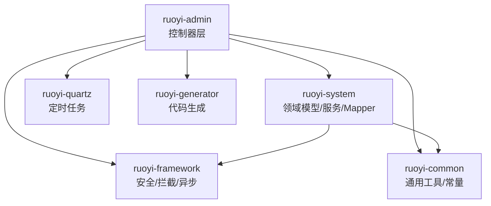
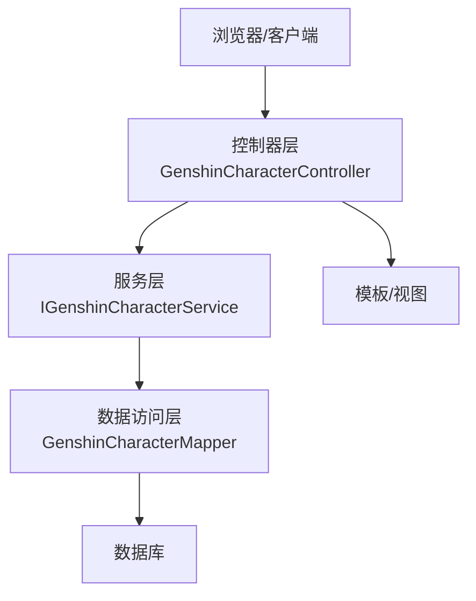
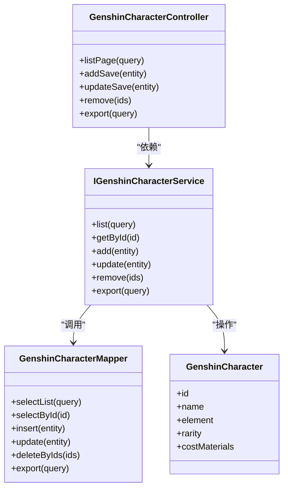
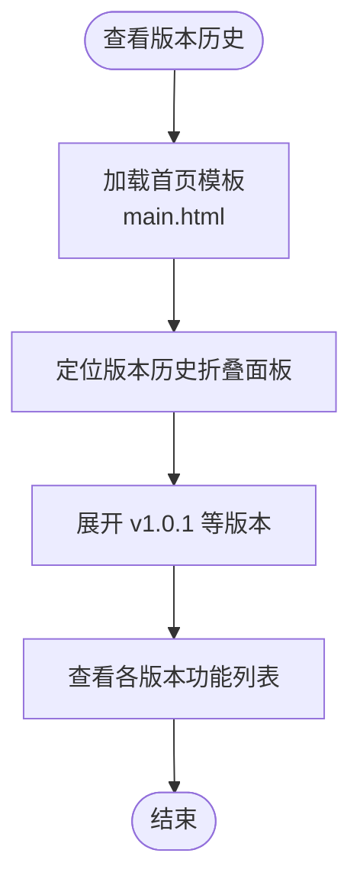
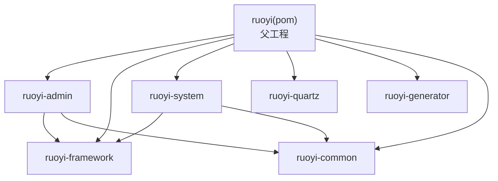

# 更新日志

<cite>
**本文引用的文件**   
- [README.md](file://README.md)
- [GENSHIN_MODULE_GUIDE.md](file://GENSHIN_MODULE_GUIDE.md)
- [迁移指南.md](file://迁移指南.md)
- [pom.xml](file://pom.xml)
- [main.html](file://ruoyi-admin/src/main/resources/templates/main.html)
- [GenshinCharacter.java](file://ruoyi-system/src/main/java/com/ruoyi/system/domain/GenshinCharacter.java)
- [GenshinCharacterMapper.java](file://ruoyi-system/src/main/java/com/ruoyi/system/mapper/GenshinCharacterMapper.java)
- [IGenshinCharacterService.java](file://ruoyi-system/src/main/java/com/ruoyi/system/service/IGenshinCharacterService.java)
- [GenshinCharacterController.java](file://ruoyi-admin/src/main/java/com/ruoyi/web/controller/system/GenshinCharacterController.java)
</cite>

## 目录
1. [引言](#引言)
2. [项目结构](#项目结构)
3. [核心组件](#核心组件)
4. [架构总览](#架构总览)
5. [详细组件分析](#详细组件分析)
6. [依赖分析](#依赖分析)
7. [性能考虑](#性能考虑)
8. [故障排查指南](#故障排查指南)
9. [结论](#结论)
10. [附录](#附录)

## 引言
本更新日志面向“原神攻略系统”使用者与维护者，系统基于主流 JavaEE 架构与若依（RuoYi）权限管理底座进行二次业务开发，围绕《原神》完整数据集构建角色、元素、敌人、圣遗物推荐、队伍推荐、武器推荐、用户收藏、天赋消耗等模块，提供面向普通玩家的培养参考与面向管理员的数据维护能力。本文档记录版本变更历史、破坏性变更、兼容性与迁移注意事项、升级指导、功能发展历程与未来规划，并给出版本选择建议与维护策略。

## 项目结构
系统采用多模块 Maven 结构，核心模块包括：
- ruoyi-admin：后端管理端入口与控制器层
- ruoyi-system：业务领域模型、Mapper、Service 与持久化映射
- ruoyi-framework：安全、分页、拦截器、异步管理等基础能力
- ruoyi-common：通用常量、异常、工具类与实体基类
- ruoyi-quartz：定时任务模块
- ruoyi-generator：代码生成模块

图表来源
- [pom.xml:208-215](file://pom.xml#L208-L215)

章节来源
- [pom.xml:208-215](file://pom.xml#L208-L215)
- [README.md:24-33](file://README.md#L24-L33)

## 核心组件
- 角色管理（GenshinCharacter）：角色基础属性、元素类型、星级、突破材料等
- 元素系统（GenshinDomain）：区域/元素相关数据
- 敌人管理（GenshinEnemy）：敌人基础与掉落
- 敌人调查（GenshinEnemyInvestigation）：调查任务与进度
- 敌人奖励（GenshinEnemyReward）：敌人掉落与奖励
- 圣遗物推荐（GenshinRecommendArtifact）：推荐圣遗物套装与主副词条
- 队伍推荐（GenshinRecommendTeam）：推荐队伍搭配
- 武器推荐（GenshinRecommendWeapon）：推荐武器与精炼
- 用户收藏（GenshinUserFavorite）：用户收藏的角色/推荐
- 天赋消耗（TalentCosts）：天赋消耗材料与等级

章节来源
- [GENSHIN_MODULE_GUIDE.md:5-16](file://GENSHIN_MODULE_GUIDE.md#L5-L16)

## 架构总览
系统采用经典的三层架构与 MVC 模式：
- 表现层（Admin）：控制器接收请求，调用服务层，渲染模板或返回 JSON
- 领域层（System）：领域对象、服务接口与实现、MyBatis Mapper
- 基础设施（Framework/Common）：安全认证、权限控制、分页、缓存、异常处理

图表来源
- [GenshinCharacterController.java](file://ruoyi-admin/src/main/java/com/ruoyi/web/controller/system/GenshinCharacterController.java)
- [IGenshinCharacterService.java](file://ruoyi-system/src/main/java/com/ruoyi/system/service/IGenshinCharacterService.java)
- [GenshinCharacterMapper.java](file://ruoyi-system/src/main/java/com/ruoyi/system/mapper/GenshinCharacterMapper.java)

## 详细组件分析

### 角色管理模块（GenshinCharacter）
- 数据模型：包含角色基础信息、元素类型、星级、突破材料等字段
- 控制器：提供角色的增删改查、导出等接口
- 服务层：封装业务逻辑，如角色数据校验、推荐联动
- Mapper：定义角色相关 SQL 查询与更新语句

图表来源
- [GenshinCharacter.java](file://ruoyi-system/src/main/java/com/ruoyi/system/domain/GenshinCharacter.java)
- [IGenshinCharacterService.java](file://ruoyi-system/src/main/java/com/ruoyi/system/service/IGenshinCharacterService.java)
- [GenshinCharacterController.java](file://ruoyi-admin/src/main/java/com/ruoyi/web/controller/system/GenshinCharacterController.java)
- [GenshinCharacterMapper.java](file://ruoyi-system/src/main/java/com/ruoyi/system/mapper/GenshinCharacterMapper.java)

章节来源
- [GENSHIN_MODULE_GUIDE.md:172-182](file://GENSHIN_MODULE_GUIDE.md#L172-L182)
- [GENSHIN_MODULE_GUIDE.md:196-206](file://GENSHIN_MODULE_GUIDE.md#L196-L206)
- [GENSHIN_MODULE_GUIDE.md:220-230](file://GENSHIN_MODULE_GUIDE.md#L220-L230)

### 版本与发布历史
以下为系统层面的版本信息与历史记录要点（基于仓库内现有文件）：

- 若依框架版本：v4.8.3（Spring Boot 4.x，JDK 17+）
- 版本分支：master（Spring Boot 4.x）、springboot3（Spring Boot 3.x）、springboot2（Spring Boot 2.x）
- 历史记录展示：系统首页模板中包含版本历史折叠面板，展示了早期版本的功能迭代（如在线用户、登录日志、操作日志、数据监控等）

图表来源
- [main.html:1815-1836](file://ruoyi-admin/src/main/resources/templates/main.html#L1815-L1836)

章节来源
- [README.md:4-33](file://README.md#L4-L33)
- [main.html:1815-1836](file://ruoyi-admin/src/main/resources/templates/main.html#L1815-L1836)

### 版本对比与升级指导
- 升级至 Spring Boot 4.x（JDK 17+）
  - 适用场景：追求最新生态与性能优化，需确保 JDK 17+ 环境
  - 升级步骤：参考若依官方分支与依赖版本，调整项目 JDK 与 Spring Boot 版本
- 升级至 Spring Boot 3.x（JDK 17+）
  - 适用场景：需要较新的生态但对 Spring Boot 4 的实验性特性不敏感
  - 注意：Jakarta EE 迁移与部分依赖的命名空间变化
- 保持 Spring Boot 2.x（JDK 8+）
  - 适用场景：遗留系统或对 JDK 8 有强制要求
  - 注意：安全与生态支持窗口有限

章节来源
- [README.md:24-33](file://README.md#L24-L33)

### 兼容性与破坏性变更
- 模块迁移与集成
  - 将 genshin 模块文件复制到 ruoyi-admin 与 ruoyi-system 对应目录
  - 配置菜单权限，确保前端路由与组件路径正确
  - 初始化数据库，执行 genshin_module.sql 脚本
- 前后端兼容性
  - 控制器层路径与模板路径需与前端路由一致
  - 权限注解与菜单配置需匹配，避免 403/404
- 数据库兼容性
  - 确认数据库名称与连接配置一致
  - 执行初始化脚本后再启动应用

章节来源
- [GENSHIN_MODULE_GUIDE.md:21-58](file://GENSHIN_MODULE_GUIDE.md#L21-L58)
- [GENSHIN_MODULE_GUIDE.md:87-108](file://GENSHIN_MODULE_GUIDE.md#L87-L108)
- [GENSHIN_MODULE_GUIDE.md:146-167](file://GENSHIN_MODULE_GUIDE.md#L146-L167)

### 功能发展历程与未来规划
- 发展历程
  - 早期版本：在线用户、登录日志、操作日志、数据监控等基础能力逐步完善
  - 近期版本：引入版本历史展示，便于用户了解系统演进
- 未来规划（概念性建议）
  - 性能优化：引入缓存策略、分页优化、索引优化
  - 安全加固：完善权限体系、审计日志、防重复提交
  - 可用性提升：前端交互优化、移动端适配、国际化支持
  - 可扩展性：模块化拆分、插件化机制、可观测性增强

章节来源
- [main.html:1815-1836](file://ruoyi-admin/src/main/resources/templates/main.html#L1815-L1836)

### 版本选择建议与维护策略
- 版本选择建议
  - 生产环境优先：Spring Boot 3.x（JDK 17+），兼顾生态与稳定性
  - 新项目：Spring Boot 4.x（JDK 17+），拥抱最新特性
  - 历史系统：Spring Boot 2.x（JDK 8+），注意安全与生态支持窗口
- 维护策略
  - 定期升级：关注框架与依赖的安全补丁与性能优化
  - 渐进迁移：先在测试环境验证，再逐步推广到生产
  - 回滚预案：保留旧版本镜像与备份，确保快速回滚

章节来源
- [README.md:24-33](file://README.md#L24-L33)

### 废弃功能与替代方案
- 若存在废弃功能，通常通过以下方式处理：
  - 标记为过时并在后续版本移除
  - 提供替代方案或迁移指引
  - 在版本历史中明确标注破坏性变更
- 替代方案
  - 使用新版 API 或服务接口
  - 采用新的数据模型或字段
  - 通过配置开关或条件逻辑过渡

（本节为通用指导，未直接分析具体废弃文件）

## 依赖分析
系统依赖关系如下，重点依赖包括 Spring Boot、MyBatis、Shiro、Druid、PageHelper、OpenAPI 等。

图表来源
- [pom.xml:208-215](file://pom.xml#L208-L215)

章节来源
- [pom.xml:37-206](file://pom.xml#L37-L206)

## 性能考虑
- 数据访问层
  - 合理使用分页插件，避免一次性加载大量数据
  - 为高频查询字段建立索引，减少慢查询
- 缓存策略
  - 对热点数据引入本地/分布式缓存，降低数据库压力
- 并发与异步
  - 使用异步任务处理耗时操作，提升响应速度
- 安全与鉴权
  - 合理配置 Shiro 权限与会话管理，避免频繁鉴权开销

（本节提供通用建议，未直接分析具体文件）

## 故障排查指南
- 常见问题
  - 找不到类或方法：确认文件已复制到正确目录，检查包名与编译状态
  - 数据库表不存在：确认已执行 genshin_module.sql，检查数据库名称与连接配置
  - 404 错误：检查控制器 @RequestMapping 路径与前端模板路径，确认权限配置
  - 权限不足：确认当前用户具备相应权限，必要时临时注释权限注解进行测试
- 迁移与集成
  - 确保 Controller、Domain、Mapper、Service、XML、模板文件均已迁移
  - 重新编译并重启应用，检查菜单配置

章节来源
- [GENSHIN_MODULE_GUIDE.md:146-167](file://GENSHIN_MODULE_GUIDE.md#L146-L167)
- [迁移指南.md:93-98](file://迁移指南.md#L93-L98)

## 结论
本更新日志梳理了“原神攻略系统”的版本历史、模块结构、核心组件与依赖关系，并提供了版本选择建议、兼容性与迁移注意事项、升级指导以及故障排查指南。建议在生产环境中优先采用 Spring Boot 3.x（JDK 17+），并结合缓存、分页与索引等手段持续优化性能与可用性。

## 附录
- 快速开始
  - 复制 genshin 模块文件到 ruoyi-admin 与 ruoyi-system
  - 初始化数据库并执行 genshin_module.sql
  - 配置菜单权限并启动项目
- 参考文件
  - 若依框架版本与分支说明
  - 版本历史展示（main.html 折叠面板）

章节来源
- [GENSHIN_MODULE_GUIDE.md:19-143](file://GENSHIN_MODULE_GUIDE.md#L19-L143)
- [README.md:24-33](file://README.md#L24-L33)