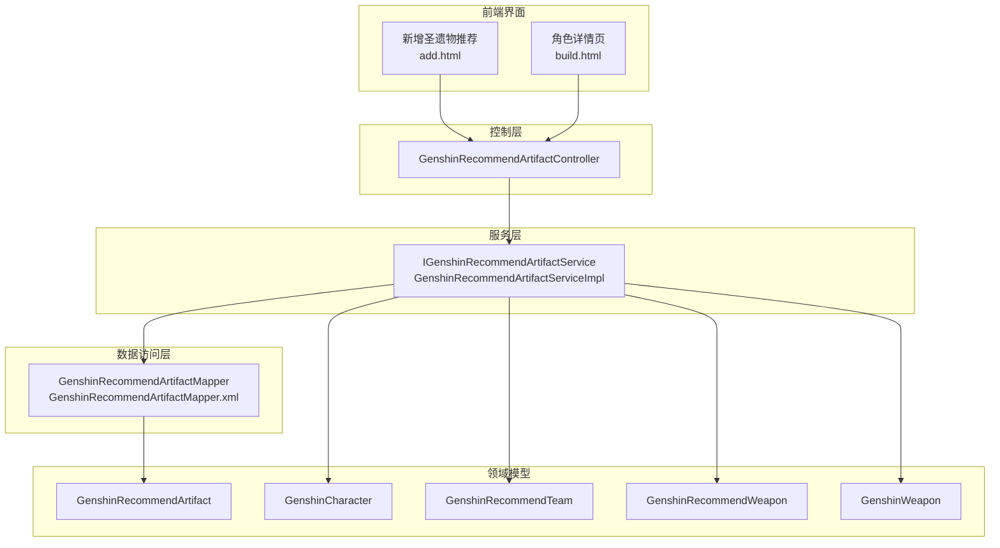
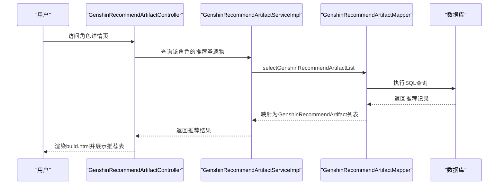
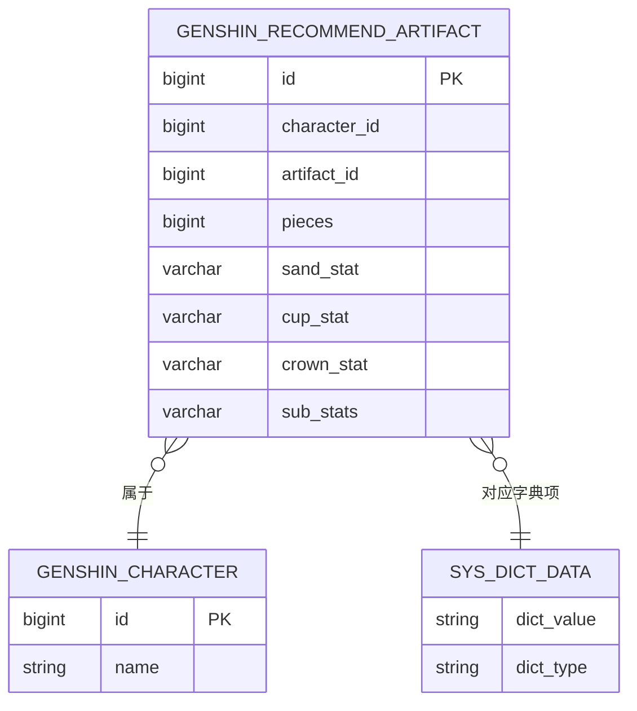
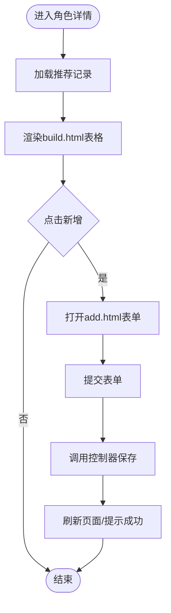
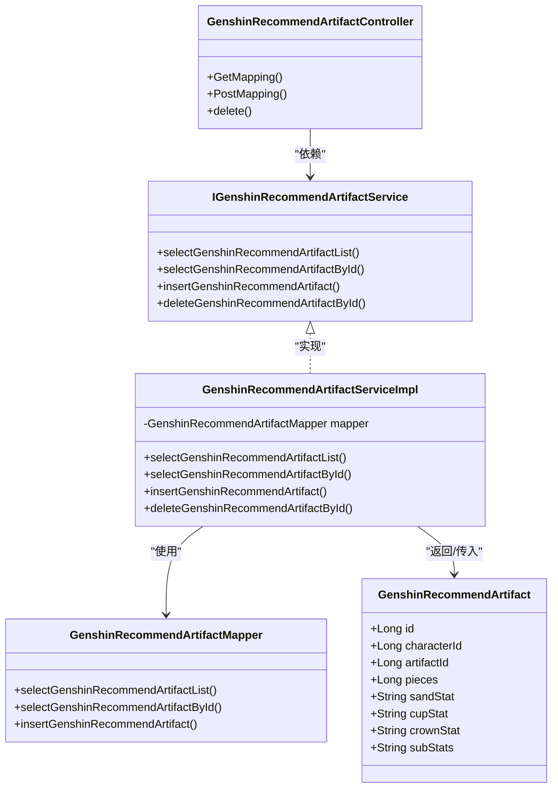

# 圣遗物推荐系统

<cite>
**本文档引用的文件**
- [GenshinRecommendArtifactController.java](file://GenShin/RuoYi-master/ruoyi-admin/src/main/java/com/ruoyi/web/controller/system/GenshinRecommendArtifactController.java)
- [GenshinRecommendArtifact.java](file://GenShin/RuoYi-master/ruoyi-system/src/main/java/com/ruoyi/system/domain/GenshinRecommendArtifact.java)
- [GenshinRecommendArtifactMapper.java](file://GenShin/RuoYi-master/ruoyi-system/src/main/java/com/ruoyi/system/mapper/GenshinRecommendArtifactMapper.java)
- [GenshinRecommendArtifactMapper.xml](file://GenShin/RuoYi-master/ruoyi-system/src/main/resources/mapper/system/GenshinRecommendArtifactMapper.xml)
- [GenshinRecommendArtifactServiceImpl.java](file://GenShin/RuoYi-master/ruoyi-system/src/main/java/com/ruoyi/system/service/impl/GenshinRecommendArtifactServiceImpl.java)
- [IGenshinRecommendArtifactService.java](file://GenShin/RuoYi-master/ruoyi-system/src/main/java/com/ruoyi/system/service/IGenshinRecommendArtifactService.java)
- [add.html](file://GenShin/RuoYi-master/ruoyi-admin/src/main/resources/templates/system/artifact/add.html)
- [build.html](file://GenShin/RuoYi-master/ruoyi-admin/src/main/resources/templates/system/character/build.html)
- [GenshinCharacter.java](file://GenShin/RuoYi-master/ruoyi-system/src/main/java/com/ruoyi/system/domain/GenshinCharacter.java)
- [GenshinRecommendTeam.java](file://GenShin/RuoYi-master/ruoyi-system/src/main/java/com/ruoyi/system/domain/GenshinRecommendTeam.java)
- [GenshinRecommendWeapon.java](file://GenShin/RuoYi-master/ruoyi-system/src/main/java/com/ruoyi/system/domain/GenshinRecommendWeapon.java)
- [GenshinWeapon.java](file://GenShin/RuoYi-master/ruoyi-system/src/main/java/com/ruoyi/system/domain/GenshinWeapon.java)
- [GenshinCalculatorController.java](file://GenShin/RuoYi-master/ruoyi-admin/src/main/java/com/ruoyi/web/controller/system/GenshinCalculatorController.java)
</cite>

## 目录
1. [引言](#引言)
2. [项目结构](#项目结构)
3. [核心组件](#核心组件)
4. [架构概览](#架构概览)
5. [详细组件分析](#详细组件分析)
6. [依赖关系分析](#依赖关系分析)
7. [性能考虑](#性能考虑)
8. [故障排除指南](#故障排除指南)
9. [结论](#结论)
10. [附录](#附录)

## 引言
本文件面向开发者与产品人员，系统性阐述该原神攻略系统中的「圣遗物推荐」模块：从数据模型、算法设计到前端展示与后端服务的完整实现。重点覆盖以下方面：
- 圣遗物5件套效果分析与主副词条配置策略
- 评分计算模型与角色定位适配（主C、副C、辅助、奶辅）
- 圣遗物属性计算逻辑、套装效果叠加规则、输出效率评估方法
- 推荐系统的数据模型设计（词条权重配置、角色适配度计算、推荐理由生成）
- 推荐结果的可视化展示与交互设计
- 与角色管理、材料统计系统的数据联动机制
- 推荐算法优化指南与新角色适配方案

## 项目结构
该模块采用经典的三层架构（控制层、服务层、持久层），配合MyBatis进行数据访问，Thymeleaf模板渲染页面。

**图表来源**
- [GenshinRecommendArtifactController.java:1-37](file://GenShin/RuoYi-master/ruoyi-admin/src/main/java/com/ruoyi/web/controller/system/GenshinRecommendArtifactController.java#L1-L37)
- [GenshinRecommendArtifactServiceImpl.java](file://GenShin/RuoYi-master/ruoyi-system/src/main/java/com/ruoyi/system/service/impl/GenshinRecommendArtifactServiceImpl.java)
- [GenshinRecommendArtifactMapper.xml:28-54](file://GenShin/RuoYi-master/ruoyi-system/src/main/resources/mapper/system/GenshinRecommendArtifactMapper.xml#L28-L54)

**章节来源**
- [GenshinRecommendArtifactController.java:1-37](file://GenShin/RuoYi-master/ruoyi-admin/src/main/java/com/ruoyi/web/controller/system/GenshinRecommendArtifactController.java#L1-L37)
- [add.html:1-90](file://GenShin/RuoYi-master/ruoyi-admin/src/main/resources/templates/system/artifact/add.html#L1-L90)
- [build.html:133-157](file://GenShin/RuoYi-master/ruoyi-admin/src/main/resources/templates/system/character/build.html#L133-L157)

## 核心组件
- 数据模型：GenshinRecommendArtifact（角色-圣遗物推荐记录）
- 控制器：GenshinRecommendArtifactController（提供新增、查询、删除等接口）
- 服务层：IGenshinRecommendArtifactService + GenshinRecommendArtifactServiceImpl（业务逻辑与组合查询）
- 数据访问：GenshinRecommendArtifactMapper + GenshinRecommendArtifactMapper.xml（SQL映射）
- 前端模板：add.html（新增表单）、build.html（角色详情页展示）

关键字段说明（摘自模型定义）：
- 角色ID与名称：characterId、characterName
- 推荐圣遗物套装ID与名称：artifactId、artifactName
- 件套需求：pieces（4件套/2件套）
- 主词条推荐：沙漏(sandStat)、杯子(cupStat)、头冠(crownStat)
- 副词条优先级：subStats（如双暴>攻击>充能）

**章节来源**
- [GenshinRecommendArtifact.java:1-162](file://GenShin/RuoYi-master/ruoyi-system/src/main/java/com/ruoyi/system/domain/GenshinRecommendArtifact.java#L1-L162)
- [GenshinRecommendArtifactMapper.xml:28-54](file://GenShin/RuoYi-master/ruoyi-system/src/main/resources/mapper/system/GenshinRecommendArtifactMapper.xml#L28-L54)

## 架构概览
推荐系统围绕「角色」与「圣遗物」两大实体展开，通过控制器接收请求，服务层聚合角色、武器、队伍与材料统计信息，最终返回推荐结果。前端以表格形式在角色详情页展示推荐的5件套及主副词条配置。

**图表来源**
- [GenshinRecommendArtifactController.java:1-37](file://GenShin/RuoYi-master/ruoyi-admin/src/main/java/com/ruoyi/web/controller/system/GenshinRecommendArtifactController.java#L1-L37)
- [GenshinRecommendArtifactMapper.xml:36-42](file://GenShin/RuoYi-master/ruoyi-system/src/main/resources/mapper/system/GenshinRecommendArtifactMapper.xml#L36-L42)
- [build.html:133-157](file://GenShin/RuoYi-master/ruoyi-admin/src/main/resources/templates/system/character/build.html#L133-L157)

## 详细组件分析

### 数据模型与实体关系

- 推荐记录与角色一对一关联，用于限定某角色的推荐方案。
- 推荐记录与字典表（dict_type='genshin_artifact_sets'）关联，用于显示套装名称与类型。

**图表来源**
- [GenshinRecommendArtifact.java:1-162](file://GenShin/RuoYi-master/ruoyi-system/src/main/java/com/ruoyi/system/domain/GenshinRecommendArtifact.java#L1-L162)
- [GenshinRecommendArtifactMapper.xml:31-33](file://GenShin/RuoYi-master/ruoyi-system/src/main/resources/mapper/system/GenshinRecommendArtifactMapper.xml#L31-L33)

**章节来源**
- [GenshinRecommendArtifact.java:1-162](file://GenShin/RuoYi-master/ruoyi-system/src/main/java/com/ruoyi/system/domain/GenshinRecommendArtifact.java#L1-L162)
- [GenshinRecommendArtifactMapper.xml:28-54](file://GenShin/RuoYi-master/ruoyi-system/src/main/resources/mapper/system/GenshinRecommendArtifactMapper.xml#L28-L54)

### 控制器与前端交互
- 控制器提供REST接口，支持新增、查询、删除等操作，并负责参数校验与权限控制。
- 新增页面（add.html）提供角色选择、套装选择、件套需求、主词条与副词条配置输入。
- 角色详情页（build.html）以表格形式展示该角色的推荐圣遗物清单。

**图表来源**
- [add.html:1-90](file://GenShin/RuoYi-master/ruoyi-admin/src/main/resources/templates/system/artifact/add.html#L1-L90)
- [build.html:133-157](file://GenShin/RuoYi-master/ruoyi-admin/src/main/resources/templates/system/character/build.html#L133-L157)
- [GenshinRecommendArtifactController.java:1-37](file://GenShin/RuoYi-master/ruoyi-admin/src/main/java/com/ruoyi/web/controller/system/GenshinRecommendArtifactController.java#L1-L37)

**章节来源**
- [add.html:1-90](file://GenShin/RuoYi-master/ruoyi-admin/src/main/resources/templates/system/artifact/add.html#L1-L90)
- [build.html:133-157](file://GenShin/RuoYi-master/ruoyi-admin/src/main/resources/templates/system/character/build.html#L133-L157)
- [GenshinRecommendArtifactController.java:1-37](file://GenShin/RuoYi-master/ruoyi-admin/src/main/java/com/ruoyi/web/controller/system/GenshinRecommendArtifactController.java#L1-L37)

### 推荐算法设计与实现要点
当前仓库中未直接提供「评分计算模型」与「词条权重配置」的具体实现代码。基于现有数据模型与字段，可抽象出如下推荐流程与策略框架：

- 输入
  - 角色基础属性与定位（主C/副C/辅助/奶辅）
  - 角色命座、元素类型、武器类型偏好
  - 当前拥有的圣遗物与词条现状
  - 材料统计与合成路线（来自计算器模块）

- 输出
  - 5件套推荐（如：2件套/4件套）
  - 主词条推荐（沙漏/杯子/头冠）
  - 副词条优先级（如：双暴>攻击>充能）
  - 推荐理由（基于角色定位与元素反应）

- 关键策略
  - 5件套效果分析：根据角色定位选择最优套效（如：4件套提升爆发/生存/辅助能力）
  - 主词条配置：优先满足角色核心输出或生存需求（如主C优先攻击力/暴击/元素精通；辅助优先元素精通/治疗加成）
  - 副词条配置：在主词条达标前提下，最大化期望输出（如双暴>攻击>充能>元素精通>暴击伤害）
  - 套装叠加规则：明确套效叠加上限与触发条件，避免重复计算
  - 输出效率评估：以期望DPS/治疗量/生存值作为目标函数，结合词条权重与套效进行打分

- 适配度计算
  - 将角色定位、元素类型、武器类型与套效进行匹配，计算适配度分数
  - 结合材料成本与时效性，给出性价比建议

- 推荐理由生成
  - 基于适配度与期望输出，生成简明的推荐说明（如：「主C推荐4件套提升爆发」「辅助推荐2件套+2件套组合」）

由于当前仓库未包含具体算法实现代码，以上为概念性设计框架，便于后续扩展。

**章节来源**
- [GenshinRecommendArtifact.java:33-51](file://GenShin/RuoYi-master/ruoyi-system/src/main/java/com/ruoyi/system/domain/GenshinRecommendArtifact.java#L33-L51)
- [GenshinCalculatorController.java:291-317](file://GenShin/RuoYi-master/ruoyi-admin/src/main/java/com/ruoyi/web/controller/system/GenshinCalculatorController.java#L291-L317)

### 圣遗物属性计算与叠加规则
- 属性计算：主词条数值按星级与等级进行换算，副词条按随机范围取值，综合计算期望属性。
- 套装叠加：同一套效在满足件数条件下叠加生效，注意与其他来源的百分比加成遵循游戏内叠加规则（如多重独立加成与乘区加成的区分）。
- 输出效率评估：以期望DPS或治疗量为目标，结合词条权重与套效，计算不同配置的相对优劣。

（本节为通用设计原则，不直接对应具体代码实现）

### 与角色管理、材料统计系统的数据联动
- 角色管理：推荐记录绑定角色ID，确保推荐方案与角色定位一致。
- 材料统计：通过计算器模块提供的材料清单与合成路线，评估推荐方案的成本与时效性，辅助决策。

**章节来源**
- [GenshinRecommendArtifact.java:21-29](file://GenShin/RuoYi-master/ruoyi-system/src/main/java/com/ruoyi/system/domain/GenshinRecommendArtifact.java#L21-L29)
- [GenshinCalculatorController.java:291-317](file://GenShin/RuoYi-master/ruoyi-admin/src/main/java/com/ruoyi/web/controller/system/GenshinCalculatorController.java#L291-L317)

## 依赖关系分析

**图表来源**
- [GenshinRecommendArtifactController.java:1-37](file://GenShin/RuoYi-master/ruoyi-admin/src/main/java/com/ruoyi/web/controller/system/GenshinRecommendArtifactController.java#L1-L37)
- [IGenshinRecommendArtifactService.java](file://GenShin/RuoYi-master/ruoyi-system/src/main/java/com/ruoyi/system/service/IGenshinRecommendArtifactService.java)
- [GenshinRecommendArtifactServiceImpl.java](file://GenShin/RuoYi-master/ruoyi-system/src/main/java/com/ruoyi/system/service/impl/GenshinRecommendArtifactServiceImpl.java)
- [GenshinRecommendArtifactMapper.java](file://GenShin/RuoYi-master/ruoyi-system/src/main/java/com/ruoyi/system/mapper/GenshinRecommendArtifactMapper.java)
- [GenshinRecommendArtifact.java:1-162](file://GenShin/RuoYi-master/ruoyi-system/src/main/java/com/ruoyi/system/domain/GenshinRecommendArtifact.java#L1-L162)

**章节来源**
- [GenshinRecommendArtifactController.java:1-37](file://GenShin/RuoYi-master/ruoyi-admin/src/main/java/com/ruoyi/web/controller/system/GenshinRecommendArtifactController.java#L1-L37)
- [GenshinRecommendArtifactServiceImpl.java](file://GenShin/RuoYi-master/ruoyi-system/src/main/java/com/ruoyi/system/service/impl/GenshinRecommendArtifactServiceImpl.java)
- [GenshinRecommendArtifactMapper.xml:36-42](file://GenShin/RuoYi-master/ruoyi-system/src/main/resources/mapper/system/GenshinRecommendArtifactMapper.xml#L36-L42)

## 性能考虑
- SQL查询优化：在查询推荐记录时，尽量使用复合索引（character_id、artifact_id），减少全表扫描。
- 分页与缓存：对推荐列表进行分页处理，必要时引入Redis缓存热点角色的推荐数据。
- 前端渲染：表格渲染时避免重复请求，使用局部刷新与懒加载优化用户体验。
- 数据一致性：新增/修改推荐记录时，确保事务边界与字段校验，防止脏数据。

## 故障排除指南
- 常见问题
  - 推荐记录为空：检查角色ID与字典项是否正确关联，确认SQL查询条件。
  - 主词条/副词条显示异常：核对字段映射与模板渲染逻辑。
  - 新增失败：检查表单必填项与控制器参数校验。

- 定位手段
  - 查看日志：关注MyBatis执行SQL与异常栈。
  - 单元测试：针对Mapper与Service编写测试用例，验证查询与插入逻辑。
  - 前端调试：利用浏览器开发者工具查看网络请求与响应。

**章节来源**
- [GenshinRecommendArtifactMapper.xml:36-42](file://GenShin/RuoYi-master/ruoyi-system/src/main/resources/mapper/system/GenshinRecommendArtifactMapper.xml#L36-L42)
- [GenshinRecommendArtifactController.java:1-37](file://GenShin/RuoYi-master/ruoyi-admin/src/main/java/com/ruoyi/web/controller/system/GenshinRecommendArtifactController.java#L1-L37)

## 结论
该圣遗物推荐模块以清晰的数据模型与标准的三层架构为基础，实现了角色-推荐记录的绑定与前端展示。当前仓库未包含具体的评分计算与词条权重实现，但已具备完善的字段设计与查询接口，便于后续扩展「适配度计算」与「输出效率评估」等算法模块。通过与角色管理、材料统计系统的联动，可进一步提升推荐方案的实用性与性价比。

## 附录

### 开发者优化指南
- 新增角色适配步骤
  - 在角色管理中完善角色定位、元素类型、武器偏好等元数据
  - 在字典表中维护圣遗物套效类型，确保推荐记录与字典项正确关联
  - 设计并实现评分模型，将角色定位、元素反应、材料成本纳入考量
  - 在前端增加推荐理由展示区域，提升可读性

- 算法优化方向
  - 引入机器学习或规则引擎，动态调整词条权重与套效优先级
  - 增加模拟计算模块，对比不同配置的期望输出差异
  - 提供导出与分享功能，便于玩家交流与复用

- 数据模型扩展建议
  - 增加「推荐理由」字段，存储算法生成的解释文本
  - 增加「适用版本/活动」字段，标注推荐方案的时效性