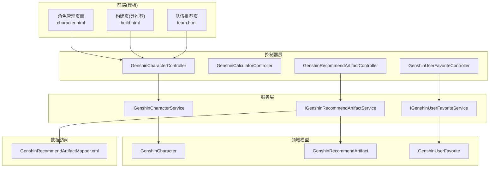
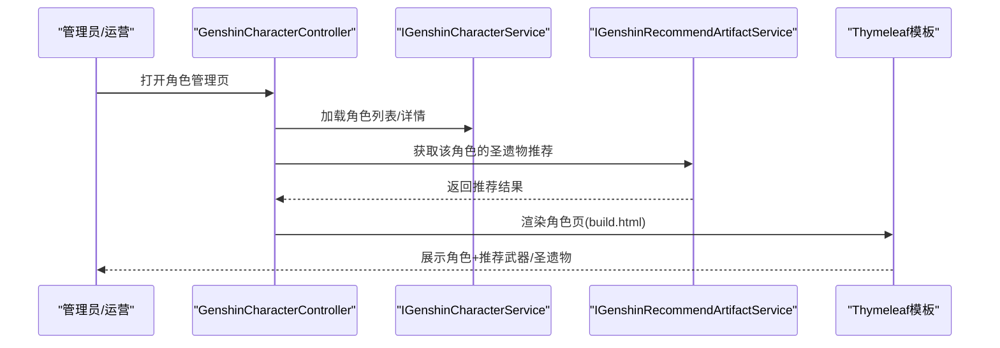
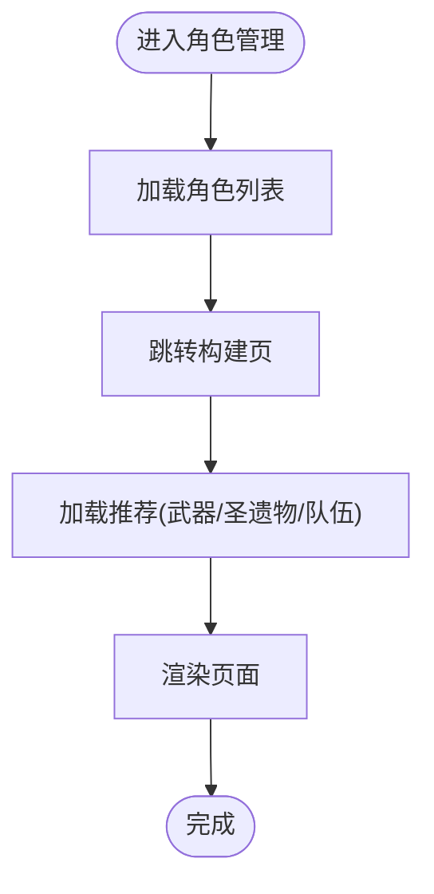
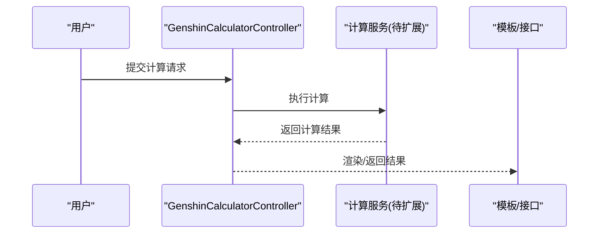
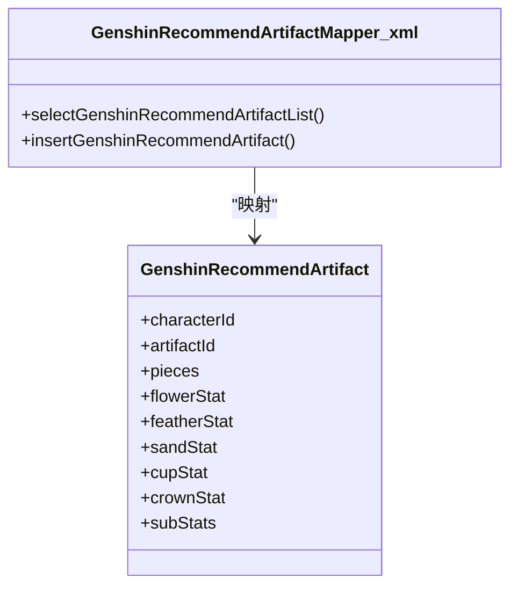
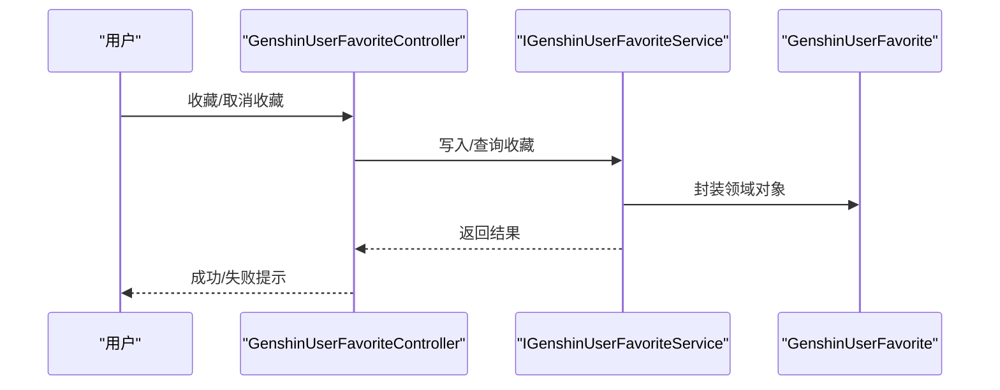
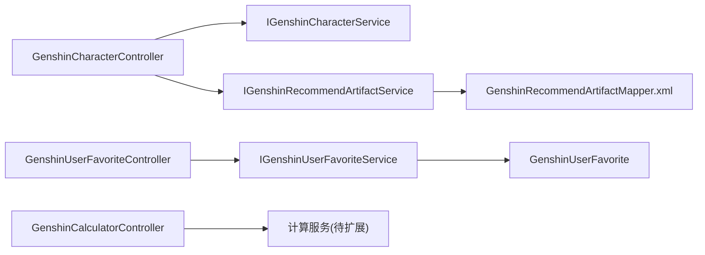

# 核心功能模块

<cite>
**本文引用的文件**
- [RuoYiApplication.java](file://GenShin/RuoYi-master/ruoyi-admin/src/main/java/com/ruoyi/RuoYiApplication.java)
- [GenshinCharacterController.java](file://GenShin/RuoYi-master/ruoyi-admin/src/main/java/com/ruoyi/web/controller/system/GenshinCharacterController.java)
- [GenshinCalculatorController.java](file://GenShin/RuoYi-master/ruoyi-admin/src/main/java/com/ruoyi/web/controller/system/GenshinCalculatorController.java)
- [GenshinRecommendArtifactController.java](file://GenShin/RuoYi-master/ruoyi-admin/src/main/java/com/ruoyi/web/controller/system/GenshinRecommendArtifactController.java)
- [GenshinUserFavoriteController.java](file://GenShin/RuoYi-master/ruoyi-admin/src/main/java/com/ruoyi/web/controller/system/GenshinUserFavoriteController.java)
- [GenshinCharacter.java](file://GenShin/RuoYi-master/ruoyi-system/src/main/java/com/ruoyi/system/domain/GenshinCharacter.java)
- [GenshinRecommendArtifact.java](file://GenShin/RuoYi-master/ruoyi-system/src/main/java/com/ruoyi/system/domain/GenshinRecommendArtifact.java)
- [GenshinUserFavorite.java](file://GenShin/RuoYi-master/ruoyi-system/src/main/java/com/ruoyi/system/domain/GenshinUserFavorite.java)
- [IGenshinCharacterService.java](file://GenShin/RuoYi-master/ruoyi-system/src/main/java/com/ruoyi/system/service/IGenshinCharacterService.java)
- [IGenshinRecommendArtifactService.java](file://GenShin/RuoYi-master/ruoyi-system/src/main/java/com/ruoyi/system/service/IGenshinRecommendArtifactService.java)
- [IGenshinUserFavoriteService.java](file://GenShin/RuoYi-master/ruoyi-system/src/main/java/com/ruoyi/system/service/IGenshinUserFavoriteService.java)
- [GenshinRecommendArtifactMapper.xml](file://GenShin/RuoYi-master/ruoyi-system/src/main/resources/mapper/system/GenshinRecommendArtifactMapper.xml)
- [character.html](file://GenShin/RuoYi-master/ruoyi-admin/src/main/resources/templates/system/character/character.html)
- [build.html](file://GenShin/RuoYi-master/ruoyi-admin/src/main/resources/templates/system/character/build.html)
- [team.html](file://GenShin/RuoYi-master/ruoyi-admin/src/main/resources/templates/system/team/team.html)
- [add.html（角色）](file://GenShin/RuoYi-master/ruoyi-admin/src/main/resources/templates/system/character/add.html)
- [add.html（圣遗物推荐）](file://GenShin/RuoYi-master/ruoyi-admin/src/main/resources/templates/system/artifact/add.html)
- [add.html（队伍）](file://GenShin/RuoYi-master/ruoyi-admin/src/main/resources/templates/system/team/add.html)
- [GENSHIN_MODULE_GUIDE.md](file://GenShin/RuoYi-master/GENSHIN_MODULE_GUIDE.md)
</cite>

## 目录
1. [引言](#引言)
2. [项目结构](#项目结构)
3. [核心组件](#核心组件)
4. [架构总览](#架构总览)
5. [详细组件分析](#详细组件分析)
6. [依赖分析](#依赖分析)
7. [性能考虑](#性能考虑)
8. [故障排查指南](#故障排查指南)
9. [结论](#结论)
10. [附录](#附录)

## 引言
本文件面向原神攻略系统的开发者与产品人员，系统化梳理四大核心业务模块：角色管理系统、计算器系统、圣遗物推荐系统、用户收藏系统。文档从设计理念、功能边界、业务流程、数据流转、模块协作与依赖、典型使用场景与最佳实践、扩展性与演进方向等维度进行深入解析，并以与实际代码一致的术语与路径指引帮助快速落地实现。

## 项目结构
系统采用前后端分离的典型分层架构：
- 控制器层：位于 ruoyi-admin 模块，负责接收前端请求、权限校验、调用服务层并返回视图或数据。
- 服务层：位于 ruoyi-system 模块，封装业务逻辑与领域模型交互。
- 数据持久层：MyBatis 映射 XML 定义 SQL 查询与写入。
- 前端模板：Thymeleaf 模板用于后台管理页面渲染。

图表来源
- [GenshinCharacterController.java:39-74](file://GenShin/RuoYi-master/ruoyi-admin/src/main/java/com/ruoyi/web/controller/system/GenshinCharacterController.java#L39-L74)
- [GenshinRecommendArtifactController.java:34-50](file://GenShin/RuoYi-master/ruoyi-admin/src/main/java/com/ruoyi/web/controller/system/GenshinRecommendArtifactController.java#L34-L50)
- [GenshinUserFavoriteController.java:29-40](file://GenShin/RuoYi-master/ruoyi-admin/src/main/java/com/ruoyi/web/controller/system/GenshinUserFavoriteController.java#L29-L40)
- [GenshinCharacter.java:1-200](file://GenShin/RuoYi-master/ruoyi-system/src/main/java/com/ruoyi/system/domain/GenshinCharacter.java#L1-L200)
- [GenshinRecommendArtifact.java:43-103](file://GenShin/RuoYi-master/ruoyi-system/src/main/java/com/ruoyi/system/domain/GenshinRecommendArtifact.java#L43-L103)
- [GenshinUserFavorite.java:1-200](file://GenShin/RuoYi-master/ruoyi-system/src/main/java/com/ruoyi/system/domain/GenshinUserFavorite.java#L1-L200)
- [GenshinRecommendArtifactMapper.xml:28-54](file://GenShin/RuoYi-master/ruoyi-system/src/main/resources/mapper/system/GenshinRecommendArtifactMapper.xml#L28-L54)

章节来源
- [RuoYiApplication.java:1-200](file://GenShin/RuoYi-master/ruoyi-admin/src/main/java/com/ruoyi/RuoYiApplication.java#L1-L200)
- [character.html:102-142](file://GenShin/RuoYi-master/ruoyi-admin/src/main/resources/templates/system/character/character.html#L102-L142)
- [build.html:26-134](file://GenShin/RuoYi-master/ruoyi-admin/src/main/resources/templates/system/character/build.html#L26-L134)
- [team.html:26-46](file://GenShin/RuoYi-master/ruoyi-admin/src/main/resources/templates/system/team/team.html#L26-L46)

## 核心组件
- 角色管理系统：提供角色基础信息的增删改查、导出、构建页集成推荐武器与圣遗物等功能。
- 计算器系统：提供战斗/培养相关计算入口与结果展示（控制器已存在，具体算法可按需扩展）。
- 圣遗物推荐系统：基于角色与字典配置，输出主副词条与套装组合建议。
- 用户收藏系统：记录用户对角色/推荐内容的收藏状态，支持查询与管理。

章节来源
- [GenshinCharacterController.java:39-74](file://GenShin/RuoYi-master/ruoyi-admin/src/main/java/com/ruoyi/web/controller/system/GenshinCharacterController.java#L39-L74)
- [GenshinCalculatorController.java:34-60](file://GenShin/RuoYi-master/ruoyi-admin/src/main/java/com/ruoyi/web/controller/system/GenshinCalculatorController.java#L34-L60)
- [GenshinRecommendArtifactController.java:34-50](file://GenShin/RuoYi-master/ruoyi-admin/src/main/java/com/ruoyi/web/controller/system/GenshinRecommendArtifactController.java#L34-L50)
- [GenshinUserFavoriteController.java:29-40](file://GenShin/RuoYi-master/ruoyi-admin/src/main/java/com/ruoyi/web/controller/system/GenshinUserFavoriteController.java#L29-L40)

## 架构总览
系统遵循“控制器-服务-领域模型-映射器”的分层设计，控制器负责路由与参数校验，服务层编排业务规则，领域模型承载数据结构，映射器负责与数据库交互。前端通过 Thymeleaf 模板渲染页面并与控制器交互。

图表来源
- [GenshinCharacterController.java:69-120](file://GenShin/RuoYi-master/ruoyi-admin/src/main/java/com/ruoyi/web/controller/system/GenshinCharacterController.java#L69-L120)
- [build.html:91-134](file://GenShin/RuoYi-master/ruoyi-admin/src/main/resources/templates/system/character/build.html#L91-L134)

## 详细组件分析

### 角色管理系统
- 功能边界
  - 角色基础信息维护：新增、编辑、删除、列表查询、导出。
  - 构建页集成：在角色详情页内嵌“推荐武器/圣遗物/队伍”展示区域。
- 业务流程
  - 列表页加载角色数据；点击进入构建页；构建页联动推荐模块返回推荐结果并展示。
- 数据流转
  - 控制器接收请求 -> 调用服务层 -> 组装视图模型 -> 模板渲染。
- 典型使用场景
  - 运营更新角色信息与推荐策略；策划在构建页核对推荐是否匹配当前版本。
- 最佳实践
  - 使用统一的分页与权限注解；对敏感字段进行脱敏处理；推荐数据与字典配置解耦。

图表来源
- [character.html:102-142](file://GenShin/RuoYi-master/ruoyi-admin/src/main/resources/templates/system/character/character.html#L102-L142)
- [build.html:26-134](file://GenShin/RuoYi-master/ruoyi-admin/src/main/resources/templates/system/character/build.html#L26-L134)

章节来源
- [GenshinCharacterController.java:69-120](file://GenShin/RuoYi-master/ruoyi-admin/src/main/java/com/ruoyi/web/controller/system/GenshinCharacterController.java#L69-L120)
- [add.html（角色）:143-161](file://GenShin/RuoYi-master/ruoyi-admin/src/main/resources/templates/system/character/add.html#L143-L161)

### 计算器系统
- 功能边界
  - 提供计算入口与结果展示，支持后续扩展不同类型的计算模型（如期望伤害、培养成本等）。
- 业务流程
  - 用户输入参数 -> 控制器接收 -> 调用计算服务 -> 返回结果 -> 前端渲染。
- 数据流转
  - 参数校验 -> 服务计算 -> 结果封装 -> 视图返回。
- 典型使用场景
  - 计算角色培养成本、期望伤害、最优配队收益等。
- 最佳实践
  - 将计算逻辑抽象为独立服务，便于单元测试与复用；对输入参数进行严格校验与默认值处理。

图表来源
- [GenshinCalculatorController.java:34-60](file://GenShin/RuoYi-master/ruoyi-admin/src/main/java/com/ruoyi/web/controller/system/GenshinCalculatorController.java#L34-L60)

章节来源
- [GenshinCalculatorController.java:34-60](file://GenShin/RuoYi-master/ruoyi-admin/src/main/java/com/ruoyi/web/controller/system/GenshinCalculatorController.java#L34-L60)

### 圣遗物推荐系统
- 功能边界
  - 基于角色与字典配置，输出主副词条与套装组合建议；支持按角色筛选与导出。
- 业务流程
  - 选择角色 -> 查询推荐记录 -> 渲染主词条、副词条、套装与优先级。
- 数据流转
  - 控制器 -> 服务层 -> Mapper -> 关联字典表 -> 返回结果。
- 典型使用场景
  - 策划配置推荐策略；玩家在构建页查看推荐词条与套装。
- 最佳实践
  - 推荐数据与字典解耦，便于运营动态调整；对推荐等级与备注进行标准化。

图表来源
- [GenshinRecommendArtifact.java:43-103](file://GenShin/RuoYi-master/ruoyi-system/src/main/java/com/ruoyi/system/domain/GenshinRecommendArtifact.java#L43-L103)
- [GenshinRecommendArtifactMapper.xml:28-54](file://GenShin/RuoYi-master/ruoyi-system/src/main/resources/mapper/system/GenshinRecommendArtifactMapper.xml#L28-L54)

章节来源
- [GenshinRecommendArtifactController.java:34-50](file://GenShin/RuoYi-master/ruoyi-admin/src/main/java/com/ruoyi/web/controller/system/GenshinRecommendArtifactController.java#L34-L50)
- [add.html（圣遗物推荐）:51-90](file://GenShin/RuoYi-master/ruoyi-admin/src/main/resources/templates/system/artifact/add.html#L51-L90)

### 用户收藏系统
- 功能边界
  - 记录用户对角色/推荐内容的收藏状态；支持查询与管理。
- 业务流程
  - 用户操作收藏 -> 控制器接收 -> 服务层写入/查询 -> 返回结果。
- 数据流转
  - 控制器 -> 服务层 -> 领域模型 -> 持久化。
- 典型使用场景
  - 用户收藏常用角色或推荐组合，便于快速查阅。
- 最佳实践
  - 对收藏去重与状态同步进行约束；提供批量操作接口。

图表来源
- [GenshinUserFavoriteController.java:29-40](file://GenShin/RuoYi-master/ruoyi-admin/src/main/java/com/ruoyi/web/controller/system/GenshinUserFavoriteController.java#L29-L40)
- [GenshinUserFavorite.java:1-200](file://GenShin/RuoYi-master/ruoyi-system/src/main/java/com/ruoyi/system/domain/GenshinUserFavorite.java#L1-L200)

章节来源
- [GenshinUserFavoriteController.java:29-40](file://GenShin/RuoYi-master/ruoyi-admin/src/main/java/com/ruoyi/web/controller/system/GenshinUserFavoriteController.java#L29-L40)

## 依赖分析
- 控制器依赖服务接口，服务依赖领域模型与映射器。
- 角色构建页依赖推荐模块，形成“角色-推荐”闭环。
- 推荐模块依赖字典表（如圣遗物套装），确保推荐与配置解耦。

图表来源
- [GenshinCharacterController.java:44-57](file://GenShin/RuoYi-master/ruoyi-admin/src/main/java/com/ruoyi/web/controller/system/GenshinCharacterController.java#L44-L57)
- [GenshinRecommendArtifactController.java:34-50](file://GenShin/RuoYi-master/ruoyi-admin/src/main/java/com/ruoyi/web/controller/system/GenshinRecommendArtifactController.java#L34-L50)
- [GenshinUserFavoriteController.java:29-40](file://GenShin/RuoYi-master/ruoyi-admin/src/main/java/com/ruoyi/web/controller/system/GenshinUserFavoriteController.java#L29-L40)
- [GenshinRecommendArtifactMapper.xml:28-54](file://GenShin/RuoYi-master/ruoyi-system/src/main/resources/mapper/system/GenshinRecommendArtifactMapper.xml#L28-L54)

章节来源
- [IGenshinCharacterService.java:1-200](file://GenShin/RuoYi-master/ruoyi-system/src/main/java/com/ruoyi/system/service/IGenshinCharacterService.java#L1-L200)
- [IGenshinRecommendArtifactService.java:1-200](file://GenShin/RuoYi-master/ruoyi-system/src/main/java/com/ruoyi/system/service/IGenshinRecommendArtifactService.java#L1-L200)
- [IGenshinUserFavoriteService.java:1-200](file://GenShin/RuoYi-master/ruoyi-system/src/main/java/com/ruoyi/system/service/IGenshinUserFavoriteService.java#L1-L200)

## 性能考虑
- 分页与缓存：列表查询应使用分页组件；热点推荐可引入缓存降低数据库压力。
- SQL优化：推荐查询涉及多表关联，应确保索引覆盖查询条件。
- 前后端分离：模板渲染与接口返回并行，减少页面等待时间。
- 并发控制：收藏/推荐写入需考虑幂等与并发一致性。

## 故障排查指南
- 页面无数据
  - 检查控制器是否正确注入服务；确认模板变量是否传入。
- 推荐为空
  - 核对角色ID与字典配置；检查 Mapper 条件过滤。
- 权限不足
  - 校验权限注解与菜单配置；确认登录用户角色。
- 导出异常
  - 检查 Excel 工具类与字段映射。

章节来源
- [character.html:102-142](file://GenShin/RuoYi-master/ruoyi-admin/src/main/resources/templates/system/character/character.html#L102-L142)
- [build.html:91-134](file://GenShin/RuoYi-master/ruoyi-admin/src/main/resources/templates/system/character/build.html#L91-L134)
- [GenshinRecommendArtifactMapper.xml:36-47](file://GenShin/RuoYi-master/ruoyi-system/src/main/resources/mapper/system/GenshinRecommendArtifactMapper.xml#L36-L47)

## 结论
四大模块围绕“角色-推荐-收藏-计算”主线协同工作：角色管理提供基础数据，推荐系统提供策略依据，收藏系统提升用户体验，计算器系统为深度分析留白。通过清晰的分层与解耦设计，系统具备良好的可维护性与扩展性，适合持续迭代与功能拓展。

## 附录
- 扩展性设计
  - 计算器：抽象计算服务接口，按类型注册不同算法。
  - 推荐：引入权重与评分机制，支持动态排序与A/B实验。
  - 收藏：支持标签分类、批量导入导出、跨设备同步。
- 未来演进方向
  - 引入推荐引擎与用户画像，实现个性化推荐。
  - 增加版本管理与灰度发布能力，保障推荐策略变更的可控性。
  - 完善监控与埋点，支撑数据驱动的策略优化。

章节来源
- [GENSHIN_MODULE_GUIDE.md:1-200](file://GenShin/RuoYi-master/GENSHIN_MODULE_GUIDE.md#L1-L200)