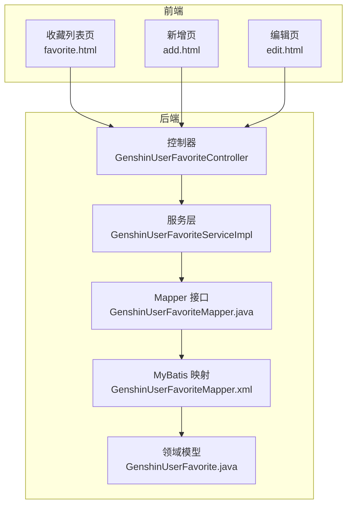
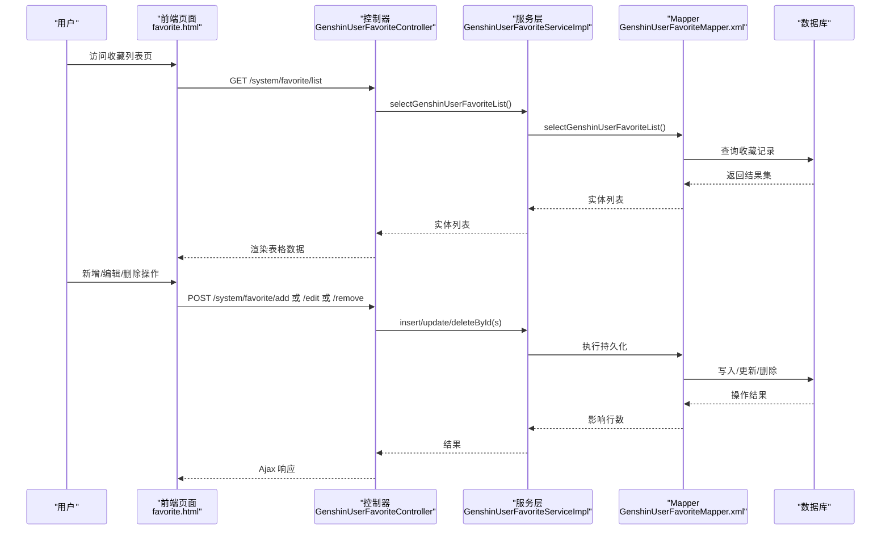
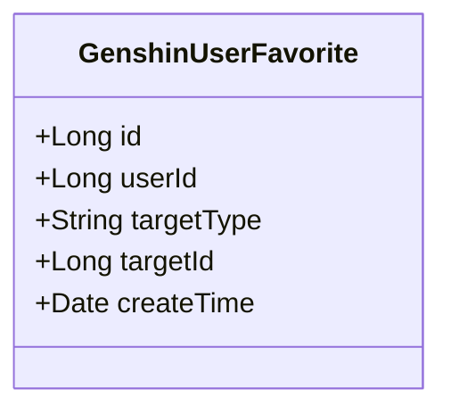
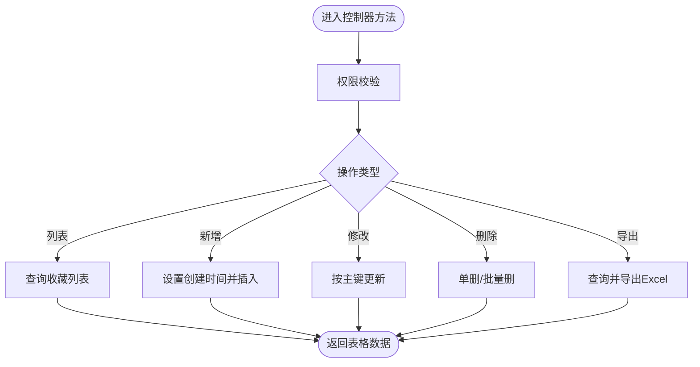
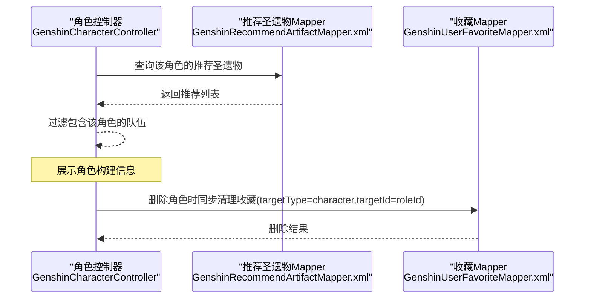
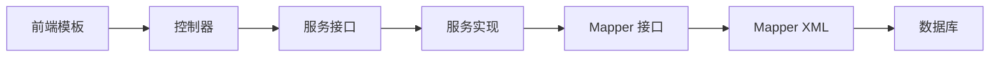

# 用户收藏系统

<cite>
**本文档引用的文件**
- [GenshinUserFavorite.java](file://ruoyi-system/src/main/java/com/ruoyi/system/domain/GenshinUserFavorite.java)
- [GenshinUserFavoriteMapper.java](file://ruoyi-system/src/main/java/com/ruoyi/system/mapper/GenshinUserFavoriteMapper.java)
- [GenshinUserFavoriteMapper.xml](file://ruoyi-system/src/main/resources/mapper/system/GenshinUserFavoriteMapper.xml)
- [IGenshinUserFavoriteService.java](file://ruoyi-system/src/main/java/com/ruoyi/system/service/IGenshinUserFavoriteService.java)
- [GenshinUserFavoriteServiceImpl.java](file://ruoyi-system/src/main/java/com/ruoyi/system/service/impl/GenshinUserFavoriteServiceImpl.java)
- [GenshinUserFavoriteController.java](file://ruoyi-admin/src/main/java/com/ruoyi/web/controller/system/GenshinUserFavoriteController.java)
- [favorite.html](file://ruoyi-admin/src/main/resources/templates/system/favorite/favorite.html)
- [add.html](file://ruoyi-admin/src/main/resources/templates/system/favorite/add.html)
- [edit.html](file://ruoyi-admin/src/main/resources/templates/system/favorite/edit.html)
- [GenshinCharacterController.java](file://ruoyi-admin/src/main/java/com/ruoyi/web/controller/system/GenshinCharacterController.java)
- [GenshinRecommendArtifactMapper.xml](file://ruoyi-system/src/main/resources/mapper/system/GenshinRecommendArtifactMapper.xml)
- [GenshinRecommendArtifact.java](file://ruoyi-system/src/main/java/com/ruoyi/system/domain/GenshinRecommendArtifact.java)
- [build.html](file://ruoyi-admin/src/main/resources/templates/system/character/build.html)
</cite>

## 目录
1. [简介](#简介)
2. [项目结构](#项目结构)
3. [核心组件](#核心组件)
4. [架构总览](#架构总览)
5. [详细组件分析](#详细组件分析)
6. [依赖关系分析](#依赖关系分析)
7. [性能考虑](#性能考虑)
8. [故障排查指南](#故障排查指南)
9. [结论](#结论)
10. [附录](#附录)

## 简介
本文件面向开发者与产品人员，系统性阐述用户收藏功能的设计与实现。该功能基于现有框架，围绕收藏数据模型、业务逻辑、权限控制、前端交互、与各业务模块的数据同步等方面进行深入解析，并提供扩展指南与优化建议。

## 项目结构
收藏功能位于“系统模块”下，采用经典的分层架构：Web 控制器层、服务层、数据访问层与前端模板层协同工作，形成完整的 CRUD 流程与权限控制。

图表来源
- [GenshinUserFavoriteController.java:1-128](file://ruoyi-admin/src/main/java/com/ruoyi/web/controller/system/GenshinUserFavoriteController.java#L1-L128)
- [GenshinUserFavoriteServiceImpl.java:1-97](file://ruoyi-system/src/main/java/com/ruoyi/system/service/impl/GenshinUserFavoriteServiceImpl.java#L1-L97)
- [GenshinUserFavoriteMapper.java:1-61](file://ruoyi-system/src/main/java/com/ruoyi/system/mapper/GenshinUserFavoriteMapper.java#L1-L61)
- [GenshinUserFavoriteMapper.xml:1-71](file://ruoyi-system/src/main/resources/mapper/system/GenshinUserFavoriteMapper.xml#L1-L71)
- [GenshinUserFavorite.java:1-84](file://ruoyi-system/src/main/java/com/ruoyi/system/domain/GenshinUserFavorite.java#L1-L84)
- [favorite.html:1-98](file://ruoyi-admin/src/main/resources/templates/system/favorite/favorite.html#L1-L98)
- [add.html:1-42](file://ruoyi-admin/src/main/resources/templates/system/favorite/add.html#L1-L42)
- [edit.html:1-42](file://ruoyi-admin/src/main/resources/templates/system/favorite/edit.html#L1-L42)

章节来源
- [GenshinUserFavoriteController.java:1-128](file://ruoyi-admin/src/main/java/com/ruoyi/web/controller/system/GenshinUserFavoriteController.java#L1-L128)
- [GenshinUserFavoriteServiceImpl.java:1-97](file://ruoyi-system/src/main/java/com/ruoyi/system/service/impl/GenshinUserFavoriteServiceImpl.java#L1-L97)
- [GenshinUserFavoriteMapper.java:1-61](file://ruoyi-system/src/main/java/com/ruoyi/system/mapper/GenshinUserFavoriteMapper.java#L1-L61)
- [GenshinUserFavoriteMapper.xml:1-71](file://ruoyi-system/src/main/resources/mapper/system/GenshinUserFavoriteMapper.xml#L1-L71)
- [GenshinUserFavorite.java:1-84](file://ruoyi-system/src/main/java/com/ruoyi/system/domain/GenshinUserFavorite.java#L1-L84)
- [favorite.html:1-98](file://ruoyi-admin/src/main/resources/templates/system/favorite/favorite.html#L1-L98)
- [add.html:1-42](file://ruoyi-admin/src/main/resources/templates/system/favorite/add.html#L1-L42)
- [edit.html:1-42](file://ruoyi-admin/src/main/resources/templates/system/favorite/edit.html#L1-L42)

## 核心组件
- 数据模型：用户收藏记录，包含用户标识、目标类型、目标标识与创建时间。
- 控制器：提供收藏的查询、导出、新增、修改、删除等接口。
- 服务层：封装持久化调用与简单的时间戳设置逻辑。
- 数据访问层：通过 MyBatis 映射 SQL，支持条件查询、批量删除等。
- 前端模板：提供列表、新增、编辑页面，集成表格与权限按钮。

章节来源
- [GenshinUserFavorite.java:1-84](file://ruoyi-system/src/main/java/com/ruoyi/system/domain/GenshinUserFavorite.java#L1-L84)
- [GenshinUserFavoriteController.java:1-128](file://ruoyi-admin/src/main/java/com/ruoyi/web/controller/system/GenshinUserFavoriteController.java#L1-L128)
- [GenshinUserFavoriteServiceImpl.java:1-97](file://ruoyi-system/src/main/java/com/ruoyi/system/service/impl/GenshinUserFavoriteServiceImpl.java#L1-L97)
- [GenshinUserFavoriteMapper.xml:1-71](file://ruoyi-system/src/main/resources/mapper/system/GenshinUserFavoriteMapper.xml#L1-L71)
- [favorite.html:1-98](file://ruoyi-admin/src/main/resources/templates/system/favorite/favorite.html#L1-L98)

## 架构总览
收藏功能遵循 MVC 分层与 MyBatis ORM 的标准实现，前端通过 AJAX 调用后端接口，后端通过服务层协调数据访问层完成数据库操作。

图表来源
- [GenshinUserFavoriteController.java:47-127](file://ruoyi-admin/src/main/java/com/ruoyi/web/controller/system/GenshinUserFavoriteController.java#L47-L127)
- [GenshinUserFavoriteServiceImpl.java:42-95](file://ruoyi-system/src/main/java/com/ruoyi/system/service/impl/GenshinUserFavoriteServiceImpl.java#L42-L95)
- [GenshinUserFavoriteMapper.xml:19-71](file://ruoyi-system/src/main/resources/mapper/system/GenshinUserFavoriteMapper.xml#L19-L71)

## 详细组件分析

### 数据模型设计
- 字段定义
  - 主键：自增 ID
  - 用户标识：关联系统用户表的用户 ID
  - 目标类型：字符串，用于区分收藏类别（如角色、队伍等）
  - 目标标识：收藏对象的业务 ID（如角色 ID、队伍 ID）
  - 创建时间：记录收藏创建时间
- 关联机制
  - 用户标识字段直接存储用户 ID，便于快速筛选与权限校验
  - 目标类型与目标标识组合可扩展多种收藏类型
- 复杂度与约束
  - 当前映射未声明唯一索引，需在业务层或数据库层面补充去重策略

图表来源
- [GenshinUserFavorite.java:14-82](file://ruoyi-system/src/main/java/com/ruoyi/system/domain/GenshinUserFavorite.java#L14-L82)

章节来源
- [GenshinUserFavorite.java:1-84](file://ruoyi-system/src/main/java/com/ruoyi/system/domain/GenshinUserFavorite.java#L1-L84)
- [GenshinUserFavoriteMapper.xml:7-17](file://ruoyi-system/src/main/resources/mapper/system/GenshinUserFavoriteMapper.xml#L7-L17)

### 业务逻辑与控制流
- 列表查询：支持按用户 ID、目标类型、目标 ID 条件过滤
- 新增：自动填充创建时间，插入记录
- 更新：按主键更新字段
- 删除：支持单条与批量删除
- 导出：将查询结果导出为 Excel

图表来源
- [GenshinUserFavoriteController.java:47-127](file://ruoyi-admin/src/main/java/com/ruoyi/web/controller/system/GenshinUserFavoriteController.java#L47-L127)
- [GenshinUserFavoriteServiceImpl.java:54-95](file://ruoyi-system/src/main/java/com/ruoyi/system/service/impl/GenshinUserFavoriteServiceImpl.java#L54-L95)
- [GenshinUserFavoriteMapper.xml:19-71](file://ruoyi-system/src/main/resources/mapper/system/GenshinUserFavoriteMapper.xml#L19-L71)

章节来源
- [GenshinUserFavoriteController.java:1-128](file://ruoyi-admin/src/main/java/com/ruoyi/web/controller/system/GenshinUserFavoriteController.java#L1-L128)
- [GenshinUserFavoriteServiceImpl.java:1-97](file://ruoyi-system/src/main/java/com/ruoyi/system/service/impl/GenshinUserFavoriteServiceImpl.java#L1-L97)
- [GenshinUserFavoriteMapper.xml:1-71](file://ruoyi-system/src/main/resources/mapper/system/GenshinUserFavoriteMapper.xml#L1-L71)

### 收藏类型与目标映射
- 目标类型字段用于区分收藏类别，如“character”、“team”等
- 目标标识字段指向具体业务对象 ID
- 建议在数据库层面增加复合唯一索引以避免重复收藏同一目标

章节来源
- [GenshinUserFavorite.java:21-31](file://ruoyi-system/src/main/java/com/ruoyi/system/domain/GenshinUserFavorite.java#L21-L31)
- [GenshinUserFavoriteMapper.xml:19-26](file://ruoyi-system/src/main/resources/mapper/system/GenshinUserFavoriteMapper.xml#L19-L26)

### 权限控制与隐私保护
- 前端按钮根据权限动态显示/隐藏
- 后端接口均标注所需权限点，防止越权访问
- 建议在查询与删除时强制绑定当前登录用户 ID，确保数据隔离

章节来源
- [favorite.html:30-43](file://ruoyi-admin/src/main/resources/templates/system/favorite/favorite.html#L30-L43)
- [GenshinUserFavoriteController.java:37-127](file://ruoyi-admin/src/main/java/com/ruoyi/web/controller/system/GenshinUserFavoriteController.java#L37-L127)

### 与业务模块的数据同步
- 角色详情页会联动加载“推荐武器”、“推荐圣遗物”、“推荐队伍”等数据
- 收藏系统可与这些模块联动：当角色/队伍等被删除时，同步清理相关收藏
- 建议在角色/队伍删除流程中增加“清理收藏”的事务性步骤

图表来源
- [GenshinCharacterController.java:172-188](file://ruoyi-admin/src/main/java/com/ruoyi/web/controller/system/GenshinCharacterController.java#L172-L188)
- [GenshinRecommendArtifactMapper.xml:36-42](file://ruoyi-system/src/main/resources/mapper/system/GenshinRecommendArtifactMapper.xml#L36-L42)
- [GenshinUserFavoriteMapper.xml:19-26](file://ruoyi-system/src/main/resources/mapper/system/GenshinUserFavoriteMapper.xml#L19-L26)

章节来源
- [GenshinCharacterController.java:172-188](file://ruoyi-admin/src/main/java/com/ruoyi/web/controller/system/GenshinCharacterController.java#L172-L188)
- [GenshinRecommendArtifactMapper.xml:36-42](file://ruoyi-system/src/main/resources/mapper/system/GenshinRecommendArtifactMapper.xml#L36-L42)
- [build.html:169-183](file://ruoyi-admin/src/main/resources/templates/system/character/build.html#L169-L183)

### 去重逻辑与批量操作
- 去重建议：在数据库层面建立 (userId, targetType, targetId) 唯一索引；在业务层插入前先查询是否存在相同记录
- 批量操作：服务层已支持批量删除，前端表格支持多选批量删除
- 排序规则：当前未定义排序字段，可在查询时按创建时间倒序

章节来源
- [GenshinUserFavoriteServiceImpl.java:80-83](file://ruoyi-system/src/main/java/com/ruoyi/system/service/impl/GenshinUserFavoriteServiceImpl.java#L80-L83)
- [favorite.html:62-92](file://ruoyi-admin/src/main/resources/templates/system/favorite/favorite.html#L62-L92)

### 统计分析与扩展
- 热门收藏排行：可基于目标 ID 聚合统计数量，结合字典表获取名称
- 收藏趋势：按日期维度统计新增数量，支持折线图展示
- 个性化推荐：可基于用户收藏历史与相似用户画像生成推荐

（本节为概念性说明，不直接分析具体文件）

## 依赖关系分析
- 控制器依赖服务接口
- 服务实现依赖 Mapper 接口
- Mapper XML 定义 SQL 与结果映射
- 前端模板依赖控制器提供的接口与权限常量

图表来源
- [GenshinUserFavoriteController.java:34-35](file://ruoyi-admin/src/main/java/com/ruoyi/web/controller/system/GenshinUserFavoriteController.java#L34-L35)
- [IGenshinUserFavoriteService.java:12-61](file://ruoyi-system/src/main/java/com/ruoyi/system/service/IGenshinUserFavoriteService.java#L12-L61)
- [GenshinUserFavoriteServiceImpl.java:21-22](file://ruoyi-system/src/main/java/com/ruoyi/system/service/impl/GenshinUserFavoriteServiceImpl.java#L21-L22)
- [GenshinUserFavoriteMapper.java:12-61](file://ruoyi-system/src/main/java/com/ruoyi/system/mapper/GenshinUserFavoriteMapper.java#L12-L61)
- [GenshinUserFavoriteMapper.xml:5-13](file://ruoyi-system/src/main/resources/mapper/system/GenshinUserFavoriteMapper.xml#L5-L13)

章节来源
- [IGenshinUserFavoriteService.java:1-61](file://ruoyi-system/src/main/java/com/ruoyi/system/service/IGenshinUserFavoriteService.java#L1-L61)
- [GenshinUserFavoriteServiceImpl.java:1-97](file://ruoyi-system/src/main/java/com/ruoyi/system/service/impl/GenshinUserFavoriteServiceImpl.java#L1-L97)
- [GenshinUserFavoriteMapper.java:1-61](file://ruoyi-system/src/main/java/com/ruoyi/system/mapper/GenshinUserFavoriteMapper.java#L1-L61)
- [GenshinUserFavoriteMapper.xml:1-71](file://ruoyi-system/src/main/resources/mapper/system/GenshinUserFavoriteMapper.xml#L1-L71)

## 性能考虑
- 查询优化：为 (userId, targetType, targetId) 建立联合索引；对高频查询字段添加覆盖索引
- 分页与导出：列表查询已内置分页；导出建议限制导出范围或分批导出
- 缓存策略：对热门收藏目标可引入缓存，降低热点查询压力
- 批量写入：批量删除已支持；批量新增建议使用 JDBC 批处理或 MyBatis 批执行

（本节为通用指导，不直接分析具体文件）

## 故障排查指南
- 权限不足：确认是否具备 system:favorite:* 权限点
- 查询无结果：检查查询参数（userId、targetType、targetId）是否正确
- 插入失败：检查唯一约束冲突与必填字段
- 删除异常：确认传入的 ID 是否存在且属于当前用户

章节来源
- [favorite.html:50-95](file://ruoyi-admin/src/main/resources/templates/system/favorite/favorite.html#L50-L95)
- [GenshinUserFavoriteController.java:37-127](file://ruoyi-admin/src/main/java/com/ruoyi/web/controller/system/GenshinUserFavoriteController.java#L37-L127)
- [GenshinUserFavoriteMapper.xml:19-71](file://ruoyi-system/src/main/resources/mapper/system/GenshinUserFavoriteMapper.xml#L19-L71)

## 结论
该收藏系统以简洁的数据模型与清晰的分层架构实现了基础的收藏 CRUD 能力，并与角色、武器、圣遗物、队伍等业务模块保持良好耦合。后续可在去重、权限隔离、索引优化、统计分析与个性化推荐等方面持续增强，以满足更复杂的业务需求。

## 附录
- 开发者扩展建议
  - 在数据库层面增加 (userId, targetType, targetId) 唯一索引
  - 在服务层实现插入前的去重校验
  - 在删除角色/队伍时同步清理相关收藏
  - 引入缓存与批量操作优化
  - 增加收藏统计与推荐接口

（本节为通用指导，不直接分析具体文件）