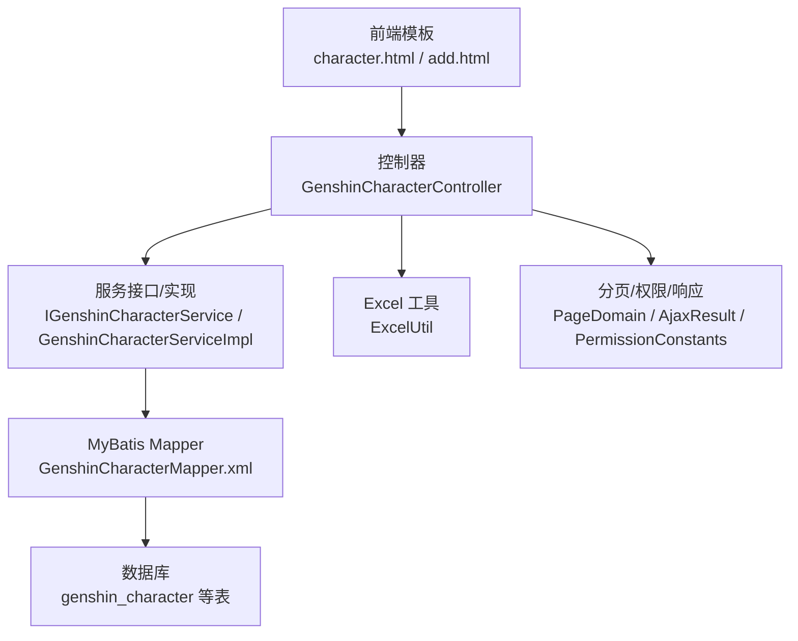
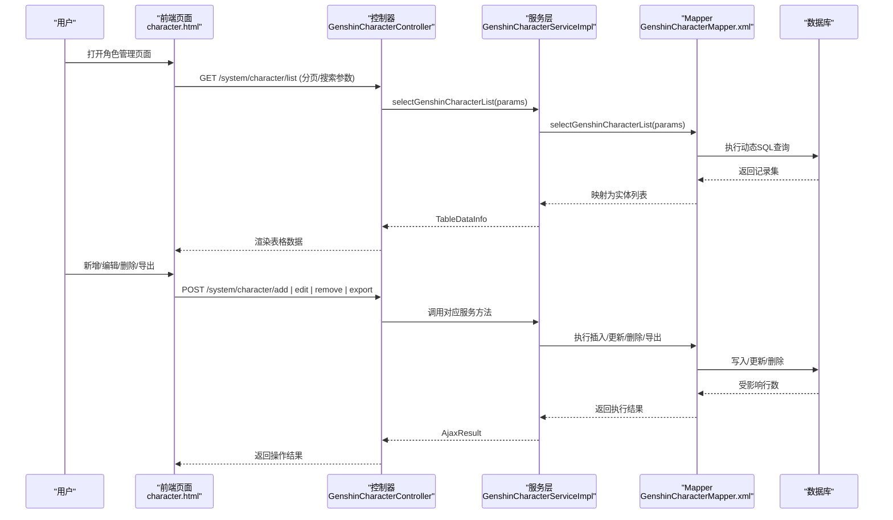
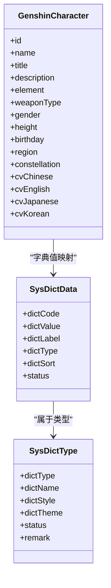
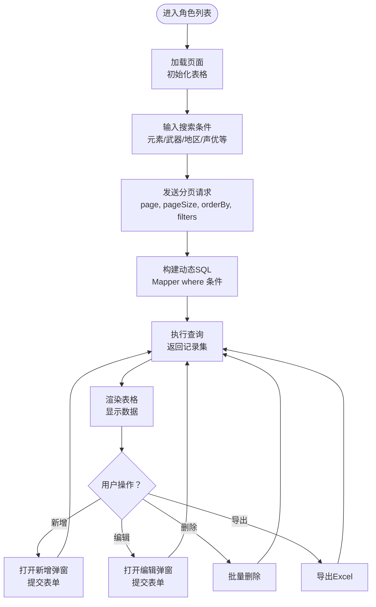
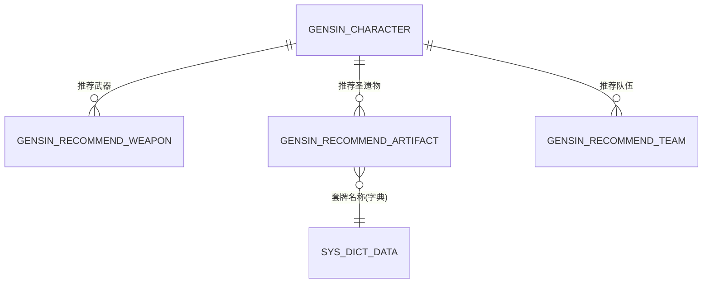
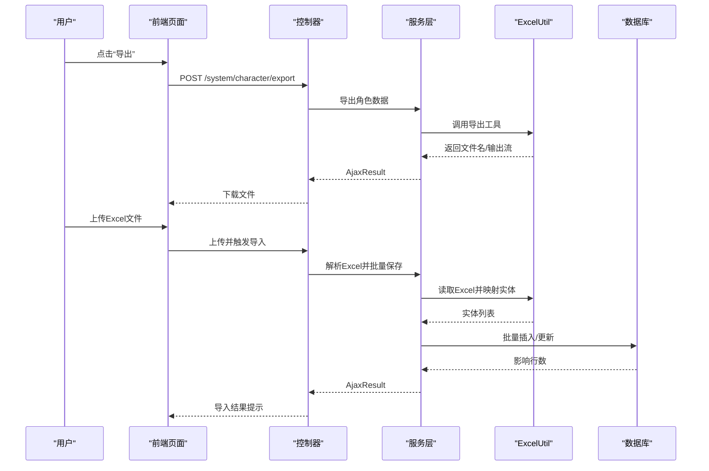
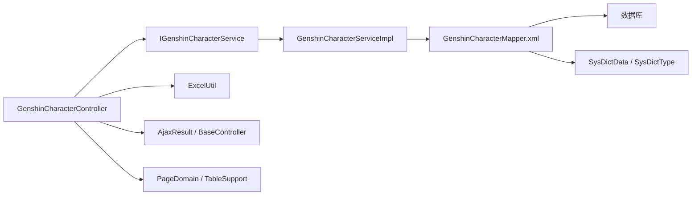

# 角色管理系统

<cite>
**本文引用的文件**
- [GenshinCharacter.java](file://ruoyi-system/src/main/java/com/ruoyi/system/domain/GenshinCharacter.java)
- [IGenshinCharacterService.java](file://ruoyi-system/src/main/java/com/ruoyi/system/service/IGenshinCharacterService.java)
- [GenshinCharacterServiceImpl.java](file://ruoyi-system/src/main/java/com/ruoyi/system/service/impl/GenshinCharacterServiceImpl.java)
- [GenshinCharacterController.java](file://ruoyi-admin/src/main/java/com/ruoyi/web/controller/system/GenshinCharacterController.java)
- [GenshinCharacterMapper.xml](file://ruoyi-system/src/main/resources/mapper/system/GenshinCharacterMapper.xml)
- [character.html](file://ruoyi-admin/src/main/resources/templates/system/character/character.html)
- [add.html](file://ruoyi-admin/src/main/resources/templates/system/character/add.html)
- [ExcelUtil.java](file://ruoyi-common/src/main/java/com/ruoyi/common/utils/poi/ExcelUtil.java)
- [GenshinRecommendArtifactMapper.xml](file://ruoyi-system/src/main/resources/mapper/system/GenshinRecommendArtifactMapper.xml)
- [GenshinRecommendTeamMapper.xml](file://ruoyi-system/src/main/resources/mapper/system/GenshinRecommendTeamMapper.xml)
- [GenshinRecommendWeaponMapper.xml](file://ruoyi-system/src/main/resources/mapper/system/GenshinRecommendWeaponMapper.xml)
- [edit.html](file://ruoyi-admin/src/main/resources/templates/system/team/edit.html)
- [SysDictData.java](file://ruoyi-common/src/main/java/com/ruoyi/common/core/domain/entity/SysDictData.java)
- [SysDictType.java](file://ruoyi-common/src/main/java/com/ruoyi/common/core/domain/entity/SysDictType.java)
- [BaseController.java](file://ruoyi-common/src/main/java/com/ruoyi/common/core/controller/BaseController.java)
- [AjaxResult.java](file://ruoyi-common/src/main/java/com/ruoyi/common/core/domain/AjaxResult.java)
- [PageDomain.java](file://ruoyi-common/src/main/java/com/ruoyi/common/core/page/PageDomain.java)
- [TableSupport.java](file://ruoyi-common/src/main/java/com/ruoyi/common/core/page/TableSupport.java)
- [TableDataInfo.java](file://ruoyi-common/src/main/java/com/ruoyi/common/core/page/TableDataInfo.java)
- [PermissionConstants.java](file://ruoyi-common/src/main/java/com/ruoyi/common/constant/PermissionConstants.java)
- [RequiresPermissions.java](file://ruoyi-framework/src/main/java/org/apache/shiro/authz/annotation/RequiresPermissions.java)
- [GENSHIN_MODULE_GUIDE.md](file://GENSHIN_MODULE_GUIDE.md)
</cite>

## 目录
1. [简介](#简介)
2. [项目结构](#项目结构)
3. [核心组件](#核心组件)
4. [架构总览](#架构总览)
5. [详细组件分析](#详细组件分析)
6. [依赖分析](#依赖分析)
7. [性能考虑](#性能考虑)
8. [故障排除指南](#故障排除指南)
9. [结论](#结论)
10. [附录](#附录)

## 简介
本文件面向开发者与产品人员，系统性阐述原神角色管理模块的设计与实现，覆盖角色基础信息管理（CRUD）、角色分类体系（元素/武器/星级等）、角色属性配置、背景故事管理、角色与武器/圣遗物/队伍组合的关联关系、角色导入导出（Excel）技术实现、搜索过滤与排序分页体验优化、权限控制与数据校验规则，以及扩展指南与最佳实践。

## 项目结构
该系统基于 RuoYi 框架，采用前后端分离的典型三层架构：
- 前端模板层：Thymeleaf 模板与 Bootstrap 表格组件，负责角色列表展示、新增/编辑弹窗、搜索过滤与分页交互。
- 控制器层：Spring MVC 控制器，接收请求、参数封装、调用服务层、返回响应。
- 服务层：业务逻辑编排，事务控制，调用持久层。
- 持久层：MyBatis Mapper XML，SQL 查询与条件组装。
- 通用工具层：Excel 导入导出、分页、权限常量、Ajax 统一响应等。

图表来源
- [GenshinCharacterController.java:1-200](file://ruoyi-admin/src/main/java/com/ruoyi/web/controller/system/GenshinCharacterController.java#L1-L200)
- [GenshinCharacterServiceImpl.java:1-200](file://ruoyi-system/src/main/java/com/ruoyi/system/service/impl/GenshinCharacterServiceImpl.java#L1-L200)
- [GenshinCharacterMapper.xml:1-200](file://ruoyi-system/src/main/resources/mapper/system/GenshinCharacterMapper.xml#L1-L200)
- [character.html:100-180](file://ruoyi-admin/src/main/resources/templates/system/character/character.html#L100-L180)
- [ExcelUtil.java:750-797](file://ruoyi-common/src/main/java/com/ruoyi/common/utils/poi/ExcelUtil.java#L750-L797)
- [PageDomain.java:1-120](file://ruoyi-common/src/main/java/com/ruoyi/common/core/page/PageDomain.java#L1-L120)
- [AjaxResult.java:1-120](file://ruoyi-common/src/main/java/com/ruoyi/common/core/domain/AjaxResult.java#L1-L120)
- [PermissionConstants.java:1-120](file://ruoyi-common/src/main/java/com/ruoyi/common/constant/PermissionConstants.java#L1-L120)

章节来源
- [GenshinCharacterController.java:1-200](file://ruoyi-admin/src/main/java/com/ruoyi/web/controller/system/GenshinCharacterController.java#L1-L200)
- [character.html:100-180](file://ruoyi-admin/src/main/resources/templates/system/character/character.html#L100-L180)

## 核心组件
- 角色实体模型：GenshinCharacter，承载角色基础信息（名称、称号、描述、元素/武器类型、性别/身高/生日等），并支持字典类型字段映射（如武器类型、元素类型、地区等）。
- 角色服务层：IGenshinCharacterService 定义角色 CRUD、分页查询、导入导出等接口；GenshinCharacterServiceImpl 实现具体业务逻辑。
- 角色控制器：GenshinCharacterController 提供列表、新增、修改、删除、导出等 HTTP 接口，并集成权限注解与统一响应。
- 角色 Mapper：GenshinCharacterMapper.xml 负责 SQL 构建、条件筛选、分页排序等。
- Excel 工具：ExcelUtil 支持单/多工作表导出、导入模板生成、批量写入与下载。
- 分页与权限：PageDomain/ TableSupport/ TableDataInfo 统一分页参数解析与结果封装；PermissionConstants 与 RequiresPermissions 提供权限控制。

章节来源
- [GenshinCharacter.java:1-200](file://ruoyi-system/src/main/java/com/ruoyi/system/domain/GenshinCharacter.java#L1-L200)
- [IGenshinCharacterService.java:1-200](file://ruoyi-system/src/main/java/com/ruoyi/system/service/IGenshinCharacterService.java#L1-L200)
- [GenshinCharacterServiceImpl.java:1-200](file://ruoyi-system/src/main/java/com/ruoyi/system/service/impl/GenshinCharacterServiceImpl.java#L1-L200)
- [GenshinCharacterController.java:1-200](file://ruoyi-admin/src/main/java/com/ruoyi/web/controller/system/GenshinCharacterController.java#L1-L200)
- [GenshinCharacterMapper.xml:1-200](file://ruoyi-system/src/main/resources/mapper/system/GenshinCharacterMapper.xml#L1-L200)
- [ExcelUtil.java:750-797](file://ruoyi-common/src/main/java/com/ruoyi/common/utils/poi/ExcelUtil.java#L750-L797)
- [PermissionConstants.java:1-120](file://ruoyi-common/src/main/java/com/ruoyi/common/constant/PermissionConstants.java#L1-L120)
- [RequiresPermissions.java:1-120](file://ruoyi-framework/src/main/java/org/apache/shiro/authz/annotation/RequiresPermissions.java#L1-L120)

## 架构总览
角色管理模块遵循“控制器-服务-持久层”分层，前端通过 Bootstrap Table 展示角色列表，支持搜索、排序、分页与批量操作；后端通过 MyBatis 动态 SQL 实现条件查询与分页；Excel 工具提供导入导出能力；权限注解保障资源访问安全。

图表来源
- [GenshinCharacterController.java:1-200](file://ruoyi-admin/src/main/java/com/ruoyi/web/controller/system/GenshinCharacterController.java#L1-L200)
- [GenshinCharacterServiceImpl.java:1-200](file://ruoyi-system/src/main/java/com/ruoyi/system/service/impl/GenshinCharacterServiceImpl.java#L1-L200)
- [GenshinCharacterMapper.xml:1-200](file://ruoyi-system/src/main/resources/mapper/system/GenshinCharacterMapper.xml#L1-L200)
- [character.html:100-180](file://ruoyi-admin/src/main/resources/templates/system/character/character.html#L100-L180)

## 详细组件分析

### 数据模型与分类体系
- 角色基础字段：名称、称号、描述、元素类型、武器类型、性别、身高、生日、所属地区、命座、声优信息等。
- 字典类型映射：通过 sys_dict_data/sys_dict_type 的字典类型（如武器类型、元素类型、地区、武器类型文本）实现编码与文案的解耦。
- 星级与培养：可通过字典或独立字段表达角色星级；培养消耗材料与摩拉成本可作为独立实体或在角色成本表中维护。

图表来源
- [GenshinCharacter.java:1-200](file://ruoyi-system/src/main/java/com/ruoyi/system/domain/GenshinCharacter.java#L1-L200)
- [SysDictData.java:1-200](file://ruoyi-common/src/main/java/com/ruoyi/common/core/domain/entity/SysDictData.java#L1-L200)
- [SysDictType.java:1-200](file://ruoyi-common/src/main/java/com/ruoyi/common/core/domain/entity/SysDictType.java#L1-L200)

章节来源
- [GenshinCharacter.java:1-200](file://ruoyi-system/src/main/java/com/ruoyi/system/domain/GenshinCharacter.java#L1-L200)
- [SysDictData.java:1-200](file://ruoyi-common/src/main/java/com/ruoyi/common/core/domain/entity/SysDictData.java#L1-L200)
- [SysDictType.java:1-200](file://ruoyi-common/src/main/java/com/ruoyi/common/core/domain/entity/SysDictType.java#L1-L200)

### CRUD 与搜索过滤
- 列表接口：GET /system/character/list，结合 PageDomain/ TableSupport 解析分页与排序参数，Mapper 使用动态 where 条件进行多字段过滤（元素类型、武器类型、地区、命座、声优等）。
- 新增/编辑：POST /system/character/add 与 /edit，前端表单校验后提交序列化数据，控制器调用服务层完成插入/更新。
- 删除：POST /system/character/remove 支持单条与批量删除。
- 搜索过滤：前端 Bootstrap Table 的列定义包含多字段标题，后端通过 Mapper 的 where 条件拼接实现模糊/精确匹配。

图表来源
- [character.html:100-180](file://ruoyi-admin/src/main/resources/templates/system/character/character.html#L100-L180)
- [GenshinCharacterMapper.xml:55-137](file://ruoyi-system/src/main/resources/mapper/system/GenshinCharacterMapper.xml#L55-L137)
- [GenshinCharacterController.java:1-200](file://ruoyi-admin/src/main/java/com/ruoyi/web/controller/system/GenshinCharacterController.java#L1-L200)

章节来源
- [character.html:100-180](file://ruoyi-admin/src/main/resources/templates/system/character/character.html#L100-L180)
- [GenshinCharacterMapper.xml:55-137](file://ruoyi-system/src/main/resources/mapper/system/GenshinCharacterMapper.xml#L55-L137)
- [GenshinCharacterController.java:1-200](file://ruoyi-admin/src/main/java/com/ruoyi/web/controller/system/GenshinCharacterController.java#L1-L200)

### 角色培养路线图与关联关系
- 武器推荐：GenshinRecommendWeaponMapper 提供按角色查询推荐武器的接口，支持按角色 ID 或武器 ID 过滤。
- 圣遗物推荐：GenshinRecommendArtifactMapper 提供按角色查询推荐圣遗物套牌的接口，通过字典类型 genshin_artifact_sets 关联套牌名称。
- 队伍组合：GenshinRecommendTeamMapper 提供推荐队伍配置，包含主C/副C/辅助/增伤等位置的角色 ID 关联。

图表来源
- [GenshinRecommendWeaponMapper.xml:1-200](file://ruoyi-system/src/main/resources/mapper/system/GenshinRecommendWeaponMapper.xml#L1-L200)
- [GenshinRecommendArtifactMapper.xml:28-54](file://ruoyi-system/src/main/resources/mapper/system/GenshinRecommendArtifactMapper.xml#L28-L54)
- [GenshinRecommendTeamMapper.xml:1-200](file://ruoyi-system/src/main/resources/mapper/system/GenshinRecommendTeamMapper.xml#L1-L200)
- [SysDictData.java:1-200](file://ruoyi-common/src/main/java/com/ruoyi/common/core/domain/entity/SysDictData.java#L1-L200)

章节来源
- [GenshinRecommendWeaponMapper.xml:1-200](file://ruoyi-system/src/main/resources/mapper/system/GenshinRecommendWeaponMapper.xml#L1-L200)
- [GenshinRecommendArtifactMapper.xml:28-54](file://ruoyi-system/src/main/resources/mapper/system/GenshinRecommendArtifactMapper.xml#L28-L54)
- [GenshinRecommendTeamMapper.xml:1-200](file://ruoyi-system/src/main/resources/mapper/system/GenshinRecommendTeamMapper.xml#L1-L200)
- [edit.html:25-50](file://ruoyi-admin/src/main/resources/templates/system/team/edit.html#L25-L50)

### 角色导入导出（Excel）
- 导出：ExcelUtil.exportExcel()/exportMultiSheet() 支持将角色列表导出为 Excel 文件，支持多工作表场景。
- 导入：ExcelUtil 支持读取 Excel 并映射到实体列表，结合服务层批量写入数据库。
- 批量优化：利用 Apache POI 的流式写入与分批处理，避免大文件内存溢出；对字典值进行缓存以减少重复查询。

图表来源
- [ExcelUtil.java:617-797](file://ruoyi-common/src/main/java/com/ruoyi/common/utils/poi/ExcelUtil.java#L617-L797)
- [GenshinCharacterController.java:1-200](file://ruoyi-admin/src/main/java/com/ruoyi/web/controller/system/GenshinCharacterController.java#L1-L200)

章节来源
- [ExcelUtil.java:617-797](file://ruoyi-common/src/main/java/com/ruoyi/common/utils/poi/ExcelUtil.java#L617-L797)
- [GenshinCharacterController.java:1-200](file://ruoyi-admin/src/main/java/com/ruoyi/web/controller/system/GenshinCharacterController.java#L1-L200)

### 权限控制与数据验证
- 权限注解：@RequiresPermissions("system:character:*") 保护角色管理相关接口，确保只有具备相应权限的用户才能访问。
- 权限常量：PermissionConstants 定义统一的权限标识，便于前端按钮显隐与后端校验。
- 数据验证：前端使用 jQuery Validate 对表单进行即时校验；后端通过实体字段约束与字典类型校验保证数据一致性。

章节来源
- [RequiresPermissions.java:1-120](file://ruoyi-framework/src/main/java/org/apache/shiro/authz/annotation/RequiresPermissions.java#L1-L120)
- [PermissionConstants.java:1-120](file://ruoyi-common/src/main/java/com/ruoyi/common/constant/PermissionConstants.java#L1-L120)
- [add.html:148-161](file://ruoyi-admin/src/main/resources/templates/system/character/add.html#L148-L161)

### 用户体验优化（搜索/排序/分页）
- 搜索：前端通过 Bootstrap Table 的列定义与后端动态 where 条件实现多字段检索。
- 排序：TableSupport 解析排序参数，Mapper 中使用 ORDER BY 动态拼接。
- 分页：PageDomain/ TableDataInfo 统一封装分页域与返回结构，提升跨模块复用性。

章节来源
- [character.html:100-180](file://ruoyi-admin/src/main/resources/templates/system/character/character.html#L100-L180)
- [TableSupport.java:1-200](file://ruoyi-common/src/main/java/com/ruoyi/common/core/page/TableSupport.java#L1-L200)
- [PageDomain.java:1-120](file://ruoyi-common/src/main/java/com/ruoyi/common/core/page/PageDomain.java#L1-L120)
- [TableDataInfo.java:1-120](file://ruoyi-common/src/main/java/com/ruoyi/common/core/page/TableDataInfo.java#L1-L120)

## 依赖分析
- 控制器依赖服务接口与通用工具类（AjaxResult、BaseController、PageDomain 等）。
- 服务层依赖 Mapper 与字典服务，实现业务编排与事务控制。
- Mapper 依赖数据库表结构与字典类型，实现动态 SQL 与关联查询。
- Excel 工具独立于业务层，提供通用的导入导出能力。

图表来源
- [GenshinCharacterController.java:1-200](file://ruoyi-admin/src/main/java/com/ruoyi/web/controller/system/GenshinCharacterController.java#L1-L200)
- [GenshinCharacterServiceImpl.java:1-200](file://ruoyi-system/src/main/java/com/ruoyi/system/service/impl/GenshinCharacterServiceImpl.java#L1-L200)
- [GenshinCharacterMapper.xml:1-200](file://ruoyi-system/src/main/resources/mapper/system/GenshinCharacterMapper.xml#L1-L200)
- [ExcelUtil.java:750-797](file://ruoyi-common/src/main/java/com/ruoyi/common/utils/poi/ExcelUtil.java#L750-L797)
- [AjaxResult.java:1-120](file://ruoyi-common/src/main/java/com/ruoyi/common/core/domain/AjaxResult.java#L1-L120)
- [BaseController.java:1-200](file://ruoyi-common/src/main/java/com/ruoyi/common/core/controller/BaseController.java#L1-L200)
- [PageDomain.java:1-120](file://ruoyi-common/src/main/java/com/ruoyi/common/core/page/PageDomain.java#L1-L120)

章节来源
- [GenshinCharacterController.java:1-200](file://ruoyi-admin/src/main/java/com/ruoyi/web/controller/system/GenshinCharacterController.java#L1-L200)
- [GenshinCharacterServiceImpl.java:1-200](file://ruoyi-system/src/main/java/com/ruoyi/system/service/impl/GenshinCharacterServiceImpl.java#L1-L200)
- [GenshinCharacterMapper.xml:1-200](file://ruoyi-system/src/main/resources/mapper/system/GenshinCharacterMapper.xml#L1-L200)
- [ExcelUtil.java:750-797](file://ruoyi-common/src/main/java/com/ruoyi/common/utils/poi/ExcelUtil.java#L750-L797)

## 性能考虑
- SQL 优化：使用动态 where 条件与索引字段（元素类型、武器类型、地区、声优等）提高查询效率；避免 N+1 查询，字典值通过缓存减少重复查询。
- 分页与排序：合理设置分页大小，避免一次性加载过多数据；对高频排序字段建立索引。
- Excel 导入导出：采用流式写入与分批处理，限制单次写入行数；多工作表导出时合并写入，减少文件体积。
- 缓存策略：对字典类型与常用枚举进行本地缓存，降低数据库压力。

## 故障排除指南
- Excel 导出失败：检查导出工具的异常日志与文件写入权限；确认导出数据为空时的错误提示。
- 导入数据不生效：核对 Excel 列头与实体字段映射是否一致；检查字典类型是否存在；查看服务层批量写入的回滚与异常处理。
- 权限不足：确认用户角色是否具备 system:character:* 权限；检查权限注解与前端按钮状态。
- 列表无数据：检查分页参数与搜索条件是否正确；确认数据库中是否存在匹配记录。

章节来源
- [ExcelUtil.java:617-797](file://ruoyi-common/src/main/java/com/ruoyi/common/utils/poi/ExcelUtil.java#L617-L797)
- [RequiresPermissions.java:1-120](file://ruoyi-framework/src/main/java/org/apache/shiro/authz/annotation/RequiresPermissions.java#L1-L120)

## 结论
本角色管理模块以清晰的分层架构、完善的权限控制与灵活的搜索过滤为基础，结合 Excel 导入导出与字典映射，实现了角色基础信息与推荐关联的全生命周期管理。通过合理的性能优化与扩展指南，可进一步支撑更复杂的原神攻略场景。

## 附录
- 扩展指南与最佳实践：参考模块开发指南文档，遵循“接口先行、Mapper 动态 SQL、服务层事务与缓存、控制器统一响应”的开发范式；新增推荐关联（武器/圣遗物/队伍）时，优先复用现有字典类型与分页查询模式。

章节来源
- [GENSHIN_MODULE_GUIDE.md:1-200](file://GENSHIN_MODULE_GUIDE.md#L1-L200)