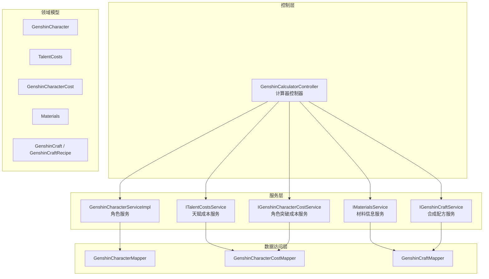
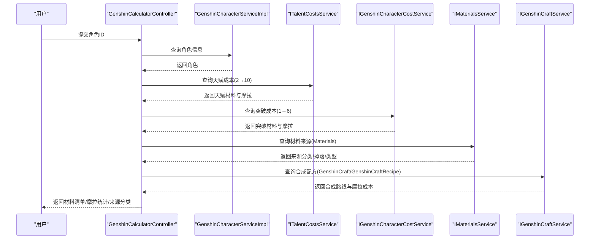
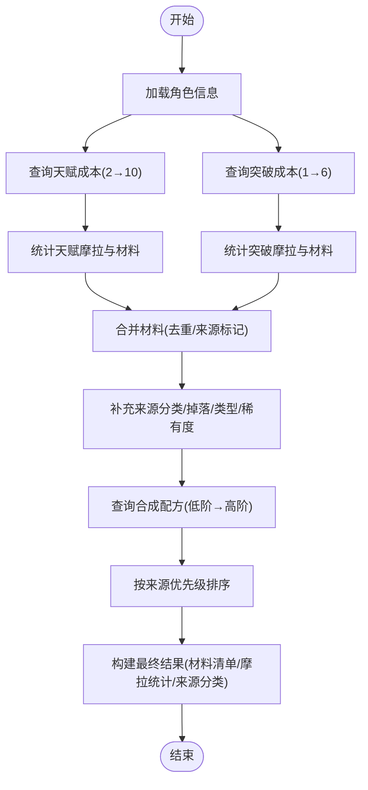
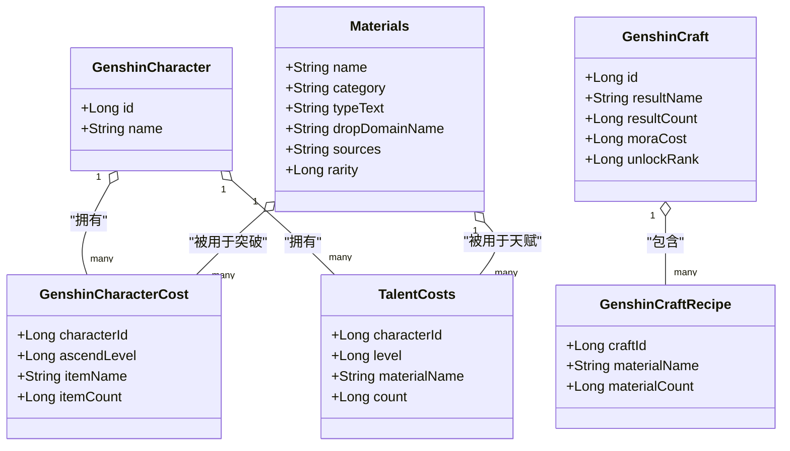
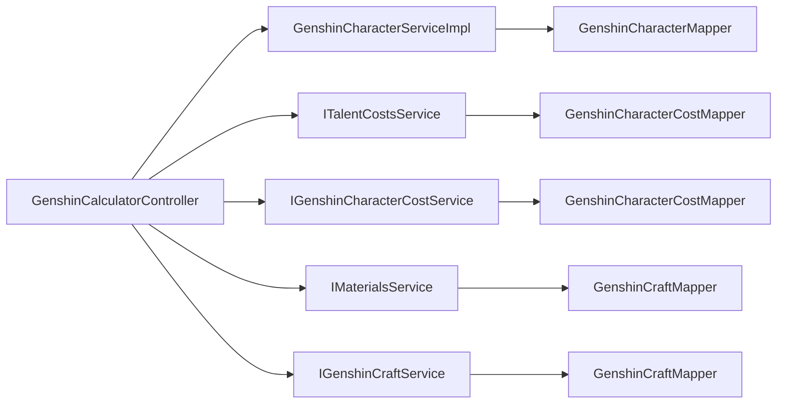

# 计算器系统

<cite>
**本文引用的文件**
- [GenshinCalculatorController.java](file://GenShin/RuoYi-master/ruoyi-admin/src/main/java/com/ruoyi/web/controller/system/GenshinCalculatorController.java)
- [GenshinCharacterCost.java](file://GenShin/RuoYi-master/ruoyi-system/src/main/java/com/ruoyi/system/domain/GenshinCharacterCost.java)
- [TalentCosts.java](file://GenShin/RuoYi-master/ruoyi-system/src/main/java/com/ruoyi/system/domain/TalentCosts.java)
- [Materials.java](file://GenShin/RuoYi-master/ruoyi-system/src/main/java/com/ruoyi/system/domain/Materials.java)
- [GenshinCraft.java](file://GenShin/RuoYi-master/ruoyi-system/src/main/java/com/ruoyi/system/domain/GenshinCraft.java)
- [GenshinCraftRecipe.java](file://GenShin/RuoYi-master/ruoyi-system/src/main/java/com/ruoyi/system/domain/GenshinCraftRecipe.java)
- [GenshinCharacter.java](file://GenShin/RuoYi-master/ruoyi-system/src/main/java/com/ruoyi/system/domain/GenshinCharacter.java)
- [GenshinCharacterCostMapper.java](file://GenShin/RuoYi-master/ruoyi-system/src/main/java/com/ruoyi/system/mapper/GenshinCharacterCostMapper.java)
- [GenshinCharacterMapper.java](file://GenShin/RuoYi-master/ruoyi-system/src/main/java/com/ruoyi/system/mapper/GenshinCharacterMapper.java)
- [GenshinCraftMapper.java](file://GenShin/RuoYi-master/ruoyi-system/src/main/java/com/ruoyi/system/mapper/GenshinCraftMapper.java)
- [GenshinCharacterCostServiceImpl.java](file://GenShin/RuoYi-master/ruoyi-system/src/main/java/com/ruoyi/system/service/impl/GenshinCharacterCostServiceImpl.java)
- [GenshinCharacterServiceImpl.java](file://GenShin/RuoYi-master/ruoyi-system/src/main/java/com/ruoyi/system/service/impl/GenshinCharacterServiceImpl.java)
- [GenshinCraftServiceImpl.java](file://GenShin/RuoYi-master/ruoyi-system/src/main/java/com/ruoyi/system/service/impl/GenshinCraftServiceImpl.java)
</cite>

## 目录
1. [引言](#引言)
2. [项目结构](#项目结构)
3. [核心组件](#核心组件)
4. [架构总览](#架构总览)
5. [详细组件分析](#详细组件分析)
6. [依赖分析](#依赖分析)
7. [性能考虑](#性能考虑)
8. [故障排查指南](#故障排查指南)
9. [结论](#结论)
10. [附录](#附录)

## 引言
本文件面向“原神计算器系统”的综合技术文档，聚焦于角色培养成本计算、材料需求统计与摩拉消耗分析等核心功能。文档从数据模型、计算流程、界面交互到扩展与优化进行全面阐述，并给出与角色、材料、合成配方等模块的集成方式与最佳实践。

## 项目结构
计算器系统位于后端工程中，采用典型的分层架构：
- 控制层：负责接收请求、组织数据、调用服务层并返回结果
- 服务层：封装业务逻辑，协调多个 Mapper 完成数据聚合
- 数据访问层：基于 MyBatis 的 Mapper 实现对数据库的读写
- 领域模型：定义角色、材料、天赋与突破成本、合成配方等实体

图表来源
- [GenshinCalculatorController.java:1-343](file://GenShin/RuoYi-master/ruoyi-admin/src/main/java/com/ruoyi/web/controller/system/GenshinCalculatorController.java#L1-L343)
- [GenshinCharacterServiceImpl.java](file://GenShin/RuoYi-master/ruoyi-system/src/main/java/com/ruoyi/system/service/impl/GenshinCharacterServiceImpl.java)
- [GenshinCharacterCostServiceImpl.java](file://GenShin/RuoYi-master/ruoyi-system/src/main/java/com/ruoyi/system/service/impl/GenshinCharacterCostServiceImpl.java)
- [GenshinCraftServiceImpl.java](file://GenShin/RuoYi-master/ruoyi-system/src/main/java/com/ruoyi/system/service/impl/GenshinCraftServiceImpl.java)

章节来源
- [GenshinCalculatorController.java:34-61](file://GenShin/RuoYi-master/ruoyi-admin/src/main/java/com/ruoyi/web/controller/system/GenshinCalculatorController.java#L34-L61)

## 核心组件
- 计算器控制器：提供页面入口与综合计算接口，负责组装材料清单、来源分类、摩拉统计与合成路线
- 领域模型：
  - 角色与突破成本：记录每个突破等级所需的材料与数量
  - 天赋成本：记录每个天赋等级（2-10）所需的材料与数量
  - 材料信息：记录材料的类别、来源、掉落副本、稀有度等
  - 合成配方：记录材料的合成路线、所需原料与摩拉成本
- 服务与映射器：按角色维度聚合材料，查询材料来源与合成配方

章节来源
- [GenshinCalculatorController.java:66-210](file://GenShin/RuoYi-master/ruoyi-admin/src/main/java/com/ruoyi/web/controller/system/GenshinCalculatorController.java#L66-L210)
- [GenshinCharacterCost.java:1-112](file://GenShin/RuoYi-master/ruoyi-system/src/main/java/com/ruoyi/system/domain/GenshinCharacterCost.java#L1-L112)
- [TalentCosts.java:1-130](file://GenShin/RuoYi-master/ruoyi-system/src/main/java/com/ruoyi/system/domain/TalentCosts.java#L1-L130)
- [Materials.java:1-172](file://GenShin/RuoYi-master/ruoyi-system/src/main/java/com/ruoyi/system/domain/Materials.java#L1-L172)
- [GenshinCraft.java](file://GenShin/RuoYi-master/ruoyi-system/src/main/java/com/ruoyi/system/domain/GenshinCraft.java)
- [GenshinCraftRecipe.java](file://GenShin/RuoYi-master/ruoyi-system/src/main/java/com/ruoyi/system/domain/GenshinCraftRecipe.java)

## 架构总览
计算器系统通过控制器统一调度，围绕“角色”进行数据聚合：
- 获取角色基础信息
- 聚合天赋材料与摩拉（2→10级）
- 聚合突破材料与摩拉（0→90级，对应突破等级1→6）
- 合并重复材料，补充来源分类、秘境信息、合成路线
- 输出材料清单、摩拉统计与按来源分类的结果

图表来源
- [GenshinCalculatorController.java:66-210](file://GenShin/RuoYi-master/ruoyi-admin/src/main/java/com/ruoyi/web/controller/system/GenshinCalculatorController.java#L66-L210)

## 详细组件分析

### 计算器控制器（GenshinCalculatorController）
职责与流程
- 页面入口：加载可用角色列表供选择
- 综合计算：按角色ID聚合天赋与突破材料，统计摩拉，补充来源分类与合成路线
- 结果输出：返回材料清单、总数、摩拉统计、来源分类汇总

关键算法与逻辑
- 天赋材料统计：遍历天赋成本表，过滤等级范围（2-10），累加摩拉与非摩拉材料数量
- 突破材料统计：遍历突破成本表，过滤等级范围（1-6），累加摩拉与非摩拉材料数量
- 材料合并：相同材料名在天赋与突破中合并，标记来源类别（仅天赋/仅突破/两者皆有）
- 来源分类：依据材料来源字段、类型文本与掉落副本类别进行分类（采集/BOSS/秘境/合成/活动/商店）
- 合成路线：查询配方与配方表，输出低阶→高阶合成路径与摩拉成本

图表来源
- [GenshinCalculatorController.java:66-210](file://GenShin/RuoYi-master/ruoyi-admin/src/main/java/com/ruoyi/web/controller/system/GenshinCalculatorController.java#L66-L210)

章节来源
- [GenshinCalculatorController.java:54-61](file://GenShin/RuoYi-master/ruoyi-admin/src/main/java/com/ruoyi/web/controller/system/GenshinCalculatorController.java#L54-L61)
- [GenshinCalculatorController.java:66-210](file://GenShin/RuoYi-master/ruoyi-admin/src/main/java/com/ruoyi/web/controller/system/GenshinCalculatorController.java#L66-L210)
- [GenshinCalculatorController.java:212-295](file://GenShin/RuoYi-master/ruoyi-admin/src/main/java/com/ruoyi/web/controller/system/GenshinCalculatorController.java#L212-L295)
- [GenshinCalculatorController.java:297-331](file://GenShin/RuoYi-master/ruoyi-admin/src/main/java/com/ruoyi/web/controller/system/GenshinCalculatorController.java#L297-L331)

### 领域模型与数据结构
- 角色与突破成本（GenshinCharacterCost）
  - 字段要点：角色ID、突破等级（1-6）、材料名称、数量
  - 复杂度：按角色ID查询，时间复杂度 O(n)，空间复杂度 O(n)
- 天赋成本（TalentCosts）
  - 字段要点：角色ID、等级（2-10）、材料名称、数量
  - 复杂度：按角色ID查询，时间复杂度 O(n)，空间复杂度 O(n)
- 材料信息（Materials）
  - 字段要点：名称、类别、类型文本、掉落副本、来源描述、稀有度
  - 复杂度：按名称查询，时间复杂度 O(1)（索引支持）
- 合成配方（GenshinCraft/GenshinCraftRecipe）
  - 字段要点：配方ID、结果材料、结果数量、摩拉成本、解锁等级；配方条目含原料名称与数量
  - 复杂度：按配方ID查询条目，时间复杂度 O(m)，空间复杂度 O(m)

图表来源
- [GenshinCharacter.java](file://GenShin/RuoYi-master/ruoyi-system/src/main/java/com/ruoyi/system/domain/GenshinCharacter.java)
- [GenshinCharacterCost.java:1-112](file://GenShin/RuoYi-master/ruoyi-system/src/main/java/com/ruoyi/system/domain/GenshinCharacterCost.java#L1-L112)
- [TalentCosts.java:1-130](file://GenShin/RuoYi-master/ruoyi-system/src/main/java/com/ruoyi/system/domain/TalentCosts.java#L1-L130)
- [Materials.java:1-172](file://GenShin/RuoYi-master/ruoyi-system/src/main/java/com/ruoyi/system/domain/Materials.java#L1-L172)
- [GenshinCraft.java](file://GenShin/RuoYi-master/ruoyi-system/src/main/java/com/ruoyi/system/domain/GenshinCraft.java)
- [GenshinCraftRecipe.java](file://GenShin/RuoYi-master/ruoyi-system/src/main/java/com/ruoyi/system/domain/GenshinCraftRecipe.java)

章节来源
- [GenshinCharacterCost.java:13-112](file://GenShin/RuoYi-master/ruoyi-system/src/main/java/com/ruoyi/system/domain/GenshinCharacterCost.java#L13-L112)
- [TalentCosts.java:16-130](file://GenShin/RuoYi-master/ruoyi-system/src/main/java/com/ruoyi/system/domain/TalentCosts.java#L16-L130)
- [Materials.java:13-172](file://GenShin/RuoYi-master/ruoyi-system/src/main/java/com/ruoyi/system/domain/Materials.java#L13-L172)

### 计算逻辑详解
- 天赋升级成本计算
  - 输入：角色ID
  - 处理：筛选等级2-10的天赋成本，按材料名聚合数量，累计摩拉
  - 输出：天赋摩拉与材料清单
- 突破材料需求计算
  - 输入：角色ID
  - 处理：筛选突破等级1-6的成本，按材料名聚合数量，累计摩拉
  - 输出：突破摩拉与材料清单
- 材料来源与分类
  - 输入：材料名称
  - 处理：查询材料来源字段与类型文本，结合掉落副本类别进行分类
  - 输出：来源类型名称与排序权重
- 合成路线查询
  - 输入：材料名称
  - 处理：查询配方与配方条目，输出结果材料、数量、摩拉成本与原料清单
  - 输出：可选的合成路径

章节来源
- [GenshinCalculatorController.java:80-122](file://GenShin/RuoYi-master/ruoyi-admin/src/main/java/com/ruoyi/web/controller/system/GenshinCalculatorController.java#L80-L122)
- [GenshinCalculatorController.java:151-179](file://GenShin/RuoYi-master/ruoyi-admin/src/main/java/com/ruoyi/web/controller/system/GenshinCalculatorController.java#L151-L179)
- [GenshinCalculatorController.java:212-295](file://GenShin/RuoYi-master/ruoyi-admin/src/main/java/com/ruoyi/web/controller/system/GenshinCalculatorController.java#L212-L295)
- [GenshinCalculatorController.java:297-331](file://GenShin/RuoYi-master/ruoyi-admin/src/main/java/com/ruoyi/web/controller/system/GenshinCalculatorController.java#L297-L331)

### 界面交互与用户体验
- 页面入口：进入“系统/计算器”，展示可选角色列表
- 交互流程：选择角色→触发计算→展示材料清单与摩拉统计→按来源分类查看→查看合成路线
- 用户体验优化建议：
  - 加载状态提示与骨架屏
  - 材料清单支持展开/折叠与按来源筛选
  - 合成路线以步骤化展示，突出摩拉成本
  - 支持复制材料清单或导出为表格

章节来源
- [GenshinCalculatorController.java:54-61](file://GenShin/RuoYi-master/ruoyi-admin/src/main/java/com/ruoyi/web/controller/system/GenshinCalculatorController.java#L54-L61)

### 高级特性与扩展
- 批量计算：在控制器中增加批量角色ID参数，循环调用计算逻辑并合并结果
- 历史记录管理：引入历史记录表，记录每次计算的时间、角色、材料清单与摩拉统计，支持查询与删除
- 计算结果导出：将材料清单与统计结果导出为CSV/Excel，便于离线分析
- 与活动加成集成：在材料来源分类中识别“活动奖励”，并在统计时叠加活动倍率

章节来源
- [GenshinCalculatorController.java:66-210](file://GenShin/RuoYi-master/ruoyi-admin/src/main/java/com/ruoyi/web/controller/system/GenshinCalculatorController.java#L66-L210)

## 依赖分析
- 控制器依赖服务层接口，服务层依赖 Mapper 完成数据访问
- 材料来源分类依赖材料表的多字段组合判断
- 合成路线依赖配方与配方条目表的关联查询

图表来源
- [GenshinCalculatorController.java:39-52](file://GenShin/RuoYi-master/ruoyi-admin/src/main/java/com/ruoyi/web/controller/system/GenshinCalculatorController.java#L39-L52)
- [GenshinCharacterMapper.java](file://GenShin/RuoYi-master/ruoyi-system/src/main/java/com/ruoyi/system/mapper/GenshinCharacterMapper.java)
- [GenshinCharacterCostMapper.java](file://GenShin/RuoYi-master/ruoyi-system/src/main/java/com/ruoyi/system/mapper/GenshinCharacterCostMapper.java)
- [GenshinCraftMapper.java](file://GenShin/RuoYi-master/ruoyi-system/src/main/java/com/ruoyi/system/mapper/GenshinCraftMapper.java)

章节来源
- [GenshinCalculatorController.java:39-52](file://GenShin/RuoYi-master/ruoyi-admin/src/main/java/com/ruoyi/web/controller/system/GenshinCalculatorController.java#L39-L52)

## 性能考虑
- 查询优化
  - 使用角色ID作为过滤条件，确保索引命中
  - 对材料名称建立唯一索引，提升来源查询效率
- 聚合策略
  - 在内存中使用哈希表进行材料聚合，避免多次数据库往返
- 排序与展示
  - 源头分类排序在内存完成，建议限制结果集规模或分页
- 缓存建议
  - 材料来源与合成配方可缓存热点数据，降低重复查询开销

## 故障排查指南
- 常见问题
  - 角色为空：检查角色ID是否有效，确认角色表数据完整性
  - 材料来源缺失：检查材料表的来源字段与类型文本是否完整
  - 合成路线为空：确认配方是否存在且配方条目不为空
- 错误处理
  - 控制器对空输入与异常进行捕获并返回友好提示
  - 合成路线查询异常被忽略，保证主流程稳定

章节来源
- [GenshinCalculatorController.java:71-78](file://GenShin/RuoYi-master/ruoyi-admin/src/main/java/com/ruoyi/web/controller/system/GenshinCalculatorController.java#L71-L78)
- [GenshinCalculatorController.java:327-331](file://GenShin/RuoYi-master/ruoyi-admin/src/main/java/com/ruoyi/web/controller/system/GenshinCalculatorController.java#L327-L331)

## 结论
计算器系统通过清晰的分层设计与简洁的聚合逻辑，实现了角色培养成本的快速统计与可视化展示。其核心在于：
- 明确的数据模型与字段约束
- 可扩展的来源分类与合成路线查询
- 友好的前端交互与可拓展的高级特性

建议后续在性能与扩展性上持续优化，完善历史记录与导出能力，并增强活动加成与价格联动。

## 附录
- 计算范围说明
  - 天赋：2→10级（控制器中过滤等级范围）
  - 突破：1→6级（对应0→90等级上限）
- 来源分类对照
  - 采集：大世界采集
  - BOSS：BOSS掉落
  - 秘境：秘境掉落
  - 合成：合成获得
  - 活动：活动奖励
  - 商店：商城兑换

章节来源
- [GenshinCalculatorController.java:87-122](file://GenShin/RuoYi-master/ruoyi-admin/src/main/java/com/ruoyi/web/controller/system/GenshinCalculatorController.java#L87-L122)
- [GenshinCalculatorController.java:196-207](file://GenShin/RuoYi-master/ruoyi-admin/src/main/java/com/ruoyi/web/controller/system/GenshinCalculatorController.java#L196-L207)
- [GenshinCalculatorController.java:269-295](file://GenShin/RuoYi-master/ruoyi-admin/src/main/java/com/ruoyi/web/controller/system/GenshinCalculatorController.java#L269-L295)