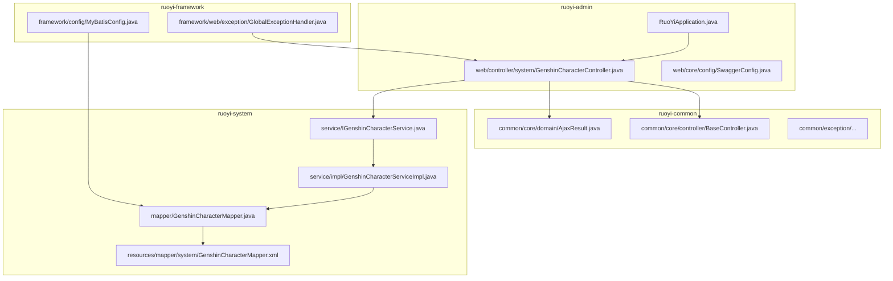
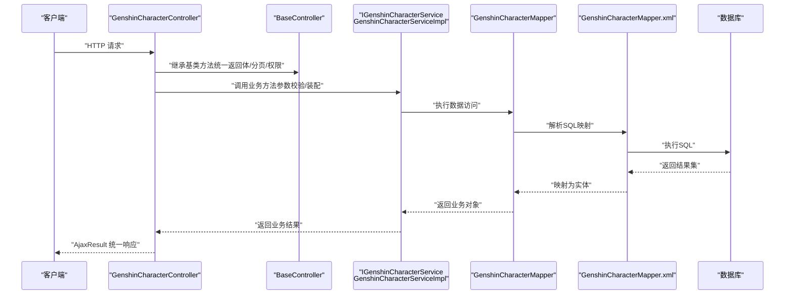
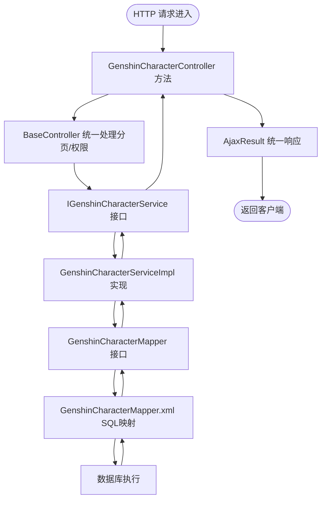
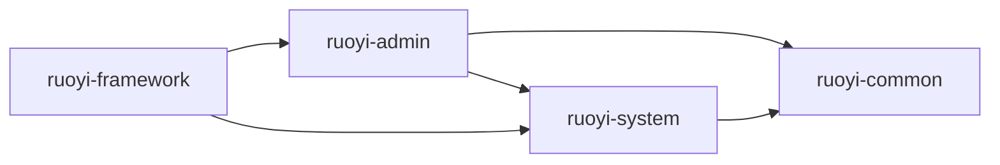

# 分层架构设计

<cite>
**本文引用的文件**
- [RuoYiApplication.java](file://ruoyi-admin/src/main/java/com/ruoyi/RuoYiApplication.java)
- [BaseController.java](file://ruoyi-common/src/main/java/com/ruoyi/common/core/controller/BaseController.java)
- [AjaxResult.java](file://ruoyi-common/src/main/java/com/ruoyi/common/core/domain/AjaxResult.java)
- [GlobalExceptionHandler.java](file://ruoyi-framework/src/main/java/com/ruoyi/framework/web/exception/GlobalExceptionHandler.java)
- [MyBatisConfig.java](file://ruoyi-framework/src/main/java/com/ruoyi/framework/config/MyBatisConfig.java)
- [IGenshinCharacterService.java](file://ruoyi-system/src/main/java/com/ruoyi/system/service/IGenshinCharacterService.java)
- [GenshinCharacterServiceImpl.java](file://ruoyi-system/src/main/java/com/ruoyi/system/service/impl/GenshinCharacterServiceImpl.java)
- [GenshinCharacterMapper.java](file://ruoyi-system/src/main/java/com/ruoyi/system/mapper/GenshinCharacterMapper.java)
- [GenshinCharacterMapper.xml](file://ruoyi-system/src/main/resources/mapper/system/GenshinCharacterMapper.xml)
- [GenshinCharacterController.java](file://ruoyi-admin/src/main/java/com/ruoyi/web/controller/system/GenshinCharacterController.java)
- [application.yml](file://ruoyi-admin/src/main/resources/application.yml)
- [application-druid.yml](file://ruoyi-admin/src/main/resources/application-druid.yml)
- [SwaggerConfig.java](file://ruoyi-admin/src/main/java/com/ruoyi/web/core/config/SwaggerConfig.java)
</cite>

## 目录
1. [引言](#引言)
2. [项目结构](#项目结构)
3. [核心组件](#核心组件)
4. [架构总览](#架构总览)
5. [详细组件分析](#详细组件分析)
6. [依赖分析](#依赖分析)
7. [性能考虑](#性能考虑)
8. [故障排查指南](#故障排查指南)
9. [结论](#结论)
10. [附录](#附录)

## 引言
本设计文档面向“原神攻略系统”，基于仓库中的RuoYi框架实现，系统性阐述分层架构（Controller-Service-Mapper）在该系统中的职责划分、交互关系与最佳实践。文档重点覆盖：
- MVC分层职责与边界
- 控制器层、服务层、持久层的接口与实现
- 公共基类BaseController的设计思想与复用价值
- 依赖注入与事务管理策略
- 异常处理机制与全局错误响应
- 层次调用流程与数据流向
- 性能优化策略与扩展点设计

## 项目结构
该项目采用多模块分层组织，核心模块与职责如下：
- ruoyi-admin：Web应用入口与控制器层，负责HTTP请求接入与视图模板渲染
- ruoyi-common：通用工具、领域模型、基础返回体与异常体系
- ruoyi-framework：框架配置、拦截器、切面、全局异常处理、动态数据源等
- ruoyi-system：业务域模块，包含各业务实体、Service接口与实现、Mapper接口与XML映射
- ruoyi-generator、ruoyi-quartz：代码生成与定时任务模块（非本文重点）

下图给出与本文相关的模块与文件关系概览：

图表来源
- [RuoYiApplication.java:1-200](file://ruoyi-admin/src/main/java/com/ruoyi/RuoYiApplication.java#L1-L200)
- [GenshinCharacterController.java:1-200](file://ruoyi-admin/src/main/java/com/ruoyi/web/controller/system/GenshinCharacterController.java#L1-L200)
- [BaseController.java:1-200](file://ruoyi-common/src/main/java/com/ruoyi/common/core/controller/BaseController.java#L1-L200)
- [AjaxResult.java:1-200](file://ruoyi-common/src/main/java/com/ruoyi/common/core/domain/AjaxResult.java#L1-L200)
- [MyBatisConfig.java:1-200](file://ruoyi-framework/src/main/java/com/ruoyi/framework/config/MyBatisConfig.java#L1-L200)
- [GlobalExceptionHandler.java:1-200](file://ruoyi-framework/src/main/java/com/ruoyi/framework/web/exception/GlobalExceptionHandler.java#L1-L200)
- [IGenshinCharacterService.java:1-200](file://ruoyi-system/src/main/java/com/ruoyi/system/service/IGenshinCharacterService.java#L1-L200)
- [GenshinCharacterServiceImpl.java:1-200](file://ruoyi-system/src/main/java/com/ruoyi/system/service/impl/GenshinCharacterServiceImpl.java#L1-L200)
- [GenshinCharacterMapper.java:1-200](file://ruoyi-system/src/main/java/com/ruoyi/system/mapper/GenshinCharacterMapper.java#L1-L200)
- [GenshinCharacterMapper.xml:1-200](file://ruoyi-system/src/main/resources/mapper/system/GenshinCharacterMapper.xml#L1-L200)

章节来源
- [RuoYiApplication.java:1-200](file://ruoyi-admin/src/main/java/com/ruoyi/RuoYiApplication.java#L1-L200)
- [application.yml:1-200](file://ruoyi-admin/src/main/resources/application.yml#L1-L200)
- [application-druid.yml:1-200](file://ruoyi-admin/src/main/resources/application-druid.yml#L1-L200)

## 核心组件
本节聚焦三层职责与关键构件：
- 控制器层（Controller）
  - 职责：接收HTTP请求、参数校验、调用服务层、封装统一响应
  - 典型实现：GenshinCharacterController
  - 基类：BaseController（提供统一返回体、分页、登录用户信息等）
- 服务层（Service）
  - 职责：编排业务逻辑、事务控制、调用Mapper执行数据访问
  - 接口：IGenshinCharacterService
  - 实现：GenshinCharacterServiceImpl
- 持久层（Mapper）
  - 职责：SQL映射与数据库操作
  - 接口：GenshinCharacterMapper
  - XML：GenshinCharacterMapper.xml

章节来源
- [GenshinCharacterController.java:1-200](file://ruoyi-admin/src/main/java/com/ruoyi/web/controller/system/GenshinCharacterController.java#L1-L200)
- [BaseController.java:1-200](file://ruoyi-common/src/main/java/com/ruoyi/common/core/controller/BaseController.java#L1-L200)
- [AjaxResult.java:1-200](file://ruoyi-common/src/main/java/com/ruoyi/common/core/domain/AjaxResult.java#L1-L200)
- [IGenshinCharacterService.java:1-200](file://ruoyi-system/src/main/java/com/ruoyi/system/service/IGenshinCharacterService.java#L1-L200)
- [GenshinCharacterServiceImpl.java:1-200](file://ruoyi-system/src/main/java/com/ruoyi/system/service/impl/GenshinCharacterServiceImpl.java#L1-L200)
- [GenshinCharacterMapper.java:1-200](file://ruoyi-system/src/main/java/com/ruoyi/system/mapper/GenshinCharacterMapper.java#L1-L200)
- [GenshinCharacterMapper.xml:1-200](file://ruoyi-system/src/main/resources/mapper/system/GenshinCharacterMapper.xml#L1-L200)

## 架构总览
下图展示从HTTP请求到数据库操作的完整数据流，体现MVC分层与依赖注入、事务管理的协作关系。

图表来源
- [GenshinCharacterController.java:1-200](file://ruoyi-admin/src/main/java/com/ruoyi/web/controller/system/GenshinCharacterController.java#L1-L200)
- [BaseController.java:1-200](file://ruoyi-common/src/main/java/com/ruoyi/common/core/controller/BaseController.java#L1-L200)
- [AjaxResult.java:1-200](file://ruoyi-common/src/main/java/com/ruoyi/common/core/domain/AjaxResult.java#L1-L200)
- [IGenshinCharacterService.java:1-200](file://ruoyi-system/src/main/java/com/ruoyi/system/service/IGenshinCharacterService.java#L1-L200)
- [GenshinCharacterServiceImpl.java:1-200](file://ruoyi-system/src/main/java/com/ruoyi/system/service/impl/GenshinCharacterServiceImpl.java#L1-L200)
- [GenshinCharacterMapper.java:1-200](file://ruoyi-system/src/main/java/com/ruoyi/system/mapper/GenshinCharacterMapper.java#L1-L200)
- [GenshinCharacterMapper.xml:1-200](file://ruoyi-system/src/main/resources/mapper/system/GenshinCharacterMapper.xml#L1-L200)

## 详细组件分析

### 控制器层（Controller）
- 设计原则
  - 单一职责：仅处理请求、参数与响应，不直接参与业务逻辑
  - 复用基类：通过BaseController统一返回体、分页、登录上下文
  - 明确边界：与Service层通过接口交互，避免对实现细节耦合
- 关键接口与实现
  - GenshinCharacterController：具体业务控制器，调用IGenshinCharacterService
  - BaseController：提供统一返回体AjaxResult、分页封装、当前用户信息等
- 依赖注入与事务
  - 控制器通过Spring容器注入Service接口；事务由Service层声明式管理
- 典型调用链
  - 控制器方法 -> BaseService（基类） -> Service接口 -> Service实现 -> Mapper接口 -> XML映射 -> 数据库

章节来源
- [GenshinCharacterController.java:1-200](file://ruoyi-admin/src/main/java/com/ruoyi/web/controller/system/GenshinCharacterController.java#L1-L200)
- [BaseController.java:1-200](file://ruoyi-common/src/main/java/com/ruoyi/common/core/controller/BaseController.java#L1-L200)
- [AjaxResult.java:1-200](file://ruoyi-common/src/main/java/com/ruoyi/common/core/domain/AjaxResult.java#L1-L200)

### 服务层（Service）
- 设计原则
  - 业务编排：聚合多个Mapper操作，保证业务一致性
  - 事务边界：通过注解或编程式事务控制，确保原子性
  - 接口隔离：对外暴露接口，内部实现可替换
- 关键接口与实现
  - IGenshinCharacterService：定义业务方法契约
  - GenshinCharacterServiceImpl：实现业务逻辑，调用Mapper执行数据访问
- 事务管理策略
  - 通过Spring声明式事务（如@Transaction）在Service层开启/提交/回滚
  - 对于复杂业务，可在Service内组合多次Mapper调用，保证整体一致性

章节来源
- [IGenshinCharacterService.java:1-200](file://ruoyi-system/src/main/java/com/ruoyi/system/service/IGenshinCharacterService.java#L1-L200)
- [GenshinCharacterServiceImpl.java:1-200](file://ruoyi-system/src/main/java/com/ruoyi/system/service/impl/GenshinCharacterServiceImpl.java#L1-L200)

### 持久层（Mapper）
- 设计原则
  - SQL集中管理：Mapper接口与XML分离，便于维护与复用
  - 映射规范：XML中定义SQL，ResultMap映射实体字段
  - 可测试性：接口与实现解耦，便于单元测试
- 关键接口与映射
  - GenshinCharacterMapper：定义数据访问方法
  - GenshinCharacterMapper.xml：定义SQL与映射规则
- MyBatis配置
  - MyBatisConfig：配置SqlSessionFactory、类型处理器、插件等

章节来源
- [GenshinCharacterMapper.java:1-200](file://ruoyi-system/src/main/java/com/ruoyi/system/mapper/GenshinCharacterMapper.java#L1-L200)
- [GenshinCharacterMapper.xml:1-200](file://ruoyi-system/src/main/resources/mapper/system/GenshinCharacterMapper.xml#L1-L200)
- [MyBatisConfig.java:1-200](file://ruoyi-framework/src/main/java/com/ruoyi/framework/config/MyBatisConfig.java#L1-L200)

### 公共基类 BaseController 的作用与设计思想
- 统一返回体：通过AjaxResult封装成功/失败、消息、数据与状态码
- 分页支持：提供分页参数与结果封装，减少重复代码
- 权限与上下文：提供当前登录用户信息、权限校验辅助方法
- 扩展点：子类控制器可按需重写或扩展基类能力

章节来源
- [BaseController.java:1-200](file://ruoyi-common/src/main/java/com/ruoyi/common/core/controller/BaseController.java#L1-L200)
- [AjaxResult.java:1-200](file://ruoyi-common/src/main/java/com/ruoyi/common/core/domain/AjaxResult.java#L1-L200)

### 依赖注入机制
- 控制器注入服务接口：通过Spring容器自动注入Service实现
- 服务层注入Mapper接口：通过MyBatis自动代理Mapper实现
- 配置来源：application.yml与MyBatisConfig共同决定Bean生命周期与扫描范围

章节来源
- [application.yml:1-200](file://ruoyi-admin/src/main/resources/application.yml#L1-L200)
- [MyBatisConfig.java:1-200](file://ruoyi-framework/src/main/java/com/ruoyi/framework/config/MyBatisConfig.java#L1-L200)

### 事务管理策略
- 声明式事务：在Service层通过注解开启事务，保证业务方法内的数据库操作原子性
- 回滚条件：结合运行时异常与受检异常策略，确保业务失败时回滚
- 传播行为：根据业务需要设置传播属性，避免嵌套事务问题

章节来源
- [GenshinCharacterServiceImpl.java:1-200](file://ruoyi-system/src/main/java/com/ruoyi/system/service/impl/GenshinCharacterServiceImpl.java#L1-L200)

### 异常处理机制
- 全局异常：GlobalExceptionHandler统一捕获控制器与服务层异常，返回标准化错误响应
- 统一返回体：AjaxResult用于前端一致的错误提示与状态码
- 自定义异常：ruoyi-common中定义了多种业务异常类型，便于精确区分错误场景

章节来源
- [GlobalExceptionHandler.java:1-200](file://ruoyi-framework/src/main/java/com/ruoyi/framework/web/exception/GlobalExceptionHandler.java#L1-L200)
- [AjaxResult.java:1-200](file://ruoyi-common/src/main/java/com/ruoyi/common/core/domain/AjaxResult.java#L1-L200)

### 层次调用流程图（代码级）

图表来源
- [GenshinCharacterController.java:1-200](file://ruoyi-admin/src/main/java/com/ruoyi/web/controller/system/GenshinCharacterController.java#L1-L200)
- [BaseController.java:1-200](file://ruoyi-common/src/main/java/com/ruoyi/common/core/controller/BaseController.java#L1-L200)
- [AjaxResult.java:1-200](file://ruoyi-common/src/main/java/com/ruoyi/common/core/domain/AjaxResult.java#L1-L200)
- [IGenshinCharacterService.java:1-200](file://ruoyi-system/src/main/java/com/ruoyi/system/service/IGenshinCharacterService.java#L1-L200)
- [GenshinCharacterServiceImpl.java:1-200](file://ruoyi-system/src/main/java/com/ruoyi/system/service/impl/GenshinCharacterServiceImpl.java#L1-L200)
- [GenshinCharacterMapper.java:1-200](file://ruoyi-system/src/main/java/com/ruoyi/system/mapper/GenshinCharacterMapper.java#L1-L200)
- [GenshinCharacterMapper.xml:1-200](file://ruoyi-system/src/main/resources/mapper/system/GenshinCharacterMapper.xml#L1-L200)

## 依赖分析
- 模块间依赖
  - ruoyi-admin 依赖 ruoyi-common 提供的统一返回体与基类
  - ruoyi-admin 依赖 ruoyi-system 提供的业务服务
  - ruoyi-system 依赖 ruoyi-common 提供的异常与工具
  - ruoyi-framework 为ruoyi-system提供MyBatis配置与全局异常处理
- 组件耦合与内聚
  - 控制器仅依赖Service接口，降低对实现的耦合
  - Service实现依赖Mapper接口，保持业务与数据访问分离
  - Mapper通过XML集中管理SQL，提升内聚性与可维护性

图表来源
- [RuoYiApplication.java:1-200](file://ruoyi-admin/src/main/java/com/ruoyi/RuoYiApplication.java#L1-L200)
- [IGenshinCharacterService.java:1-200](file://ruoyi-system/src/main/java/com/ruoyi/system/service/IGenshinCharacterService.java#L1-L200)
- [MyBatisConfig.java:1-200](file://ruoyi-framework/src/main/java/com/ruoyi/framework/config/MyBatisConfig.java#L1-L200)

## 性能考虑
- 数据访问层
  - 合理使用缓存：结合Redis或本地缓存减少热点查询压力
  - SQL优化：避免N+1查询，使用批量插入/更新与延迟加载策略
  - 分页查询：对大数据量表进行索引优化与分页限制
- 控制器层
  - 参数校验前置：减少无效请求进入服务层
  - 统一响应体：避免重复序列化开销
- 服务层
  - 事务粒度：尽量缩短事务时间，避免长事务锁表
  - 并发控制：对高并发场景使用乐观锁或分布式锁
- 框架配置
  - MyBatis配置：启用二级缓存、延迟加载与合适的超时设置
  - 应用配置：线程池大小、连接池参数与日志级别调优

## 故障排查指南
- 常见问题定位
  - 控制器异常：检查GlobalExceptionHandler是否正确捕获并返回AjaxResult
  - 服务层事务：确认Service方法可见性与事务注解生效范围
  - Mapper映射：核对XML中SQL语法、参数名与ResultMap字段映射
- 日志与监控
  - 开启SQL日志与慢查询记录，定位性能瓶颈
  - 使用Swagger或接口文档验证请求参数与响应格式
- 快速修复建议
  - 参数校验失败：返回AjaxResult失败状态与明确错误信息
  - 数据库异常：捕获异常后包装为业务异常并返回统一错误码

章节来源
- [GlobalExceptionHandler.java:1-200](file://ruoyi-framework/src/main/java/com/ruoyi/framework/web/exception/GlobalExceptionHandler.java#L1-L200)
- [AjaxResult.java:1-200](file://ruoyi-common/src/main/java/com/ruoyi/common/core/domain/AjaxResult.java#L1-L200)
- [GenshinCharacterMapper.xml:1-200](file://ruoyi-system/src/main/resources/mapper/system/GenshinCharacterMapper.xml#L1-L200)

## 结论
本系统以RuoYi为基础，构建了清晰的MVC分层架构：控制器层专注请求与响应，服务层承担业务编排与事务控制，持久层通过Mapper与XML实现SQL与实体映射。通过BaseController统一返回体、AjaxResult标准化响应、GlobalExceptionHandler全局异常处理，以及MyBatis配置与应用配置的协同，实现了高内聚、低耦合、易扩展且具备良好可维护性的分层架构。在实际开发中，应严格遵循接口隔离、单一职责与事务边界原则，并结合缓存、SQL优化与日志监控持续优化性能与稳定性。

## 附录
- Swagger接口文档：用于接口调试与联调
- 应用配置：application.yml与application-druid.yml定义了数据库、缓存与线程池等关键参数

章节来源
- [SwaggerConfig.java:1-200](file://ruoyi-admin/src/main/java/com/ruoyi/web/core/config/SwaggerConfig.java#L1-L200)
- [application.yml:1-200](file://ruoyi-admin/src/main/resources/application.yml#L1-L200)
- [application-druid.yml:1-200](file://ruoyi-admin/src/main/resources/application-druid.yml#L1-L200)