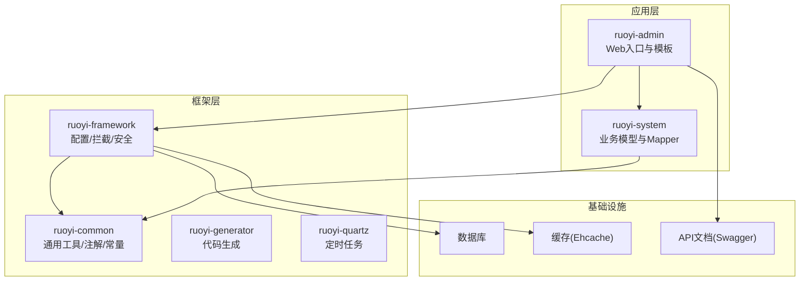
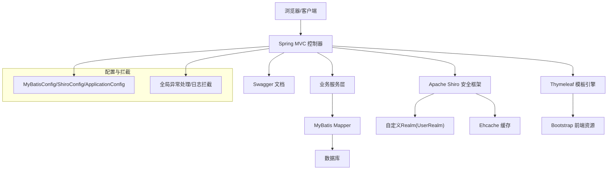
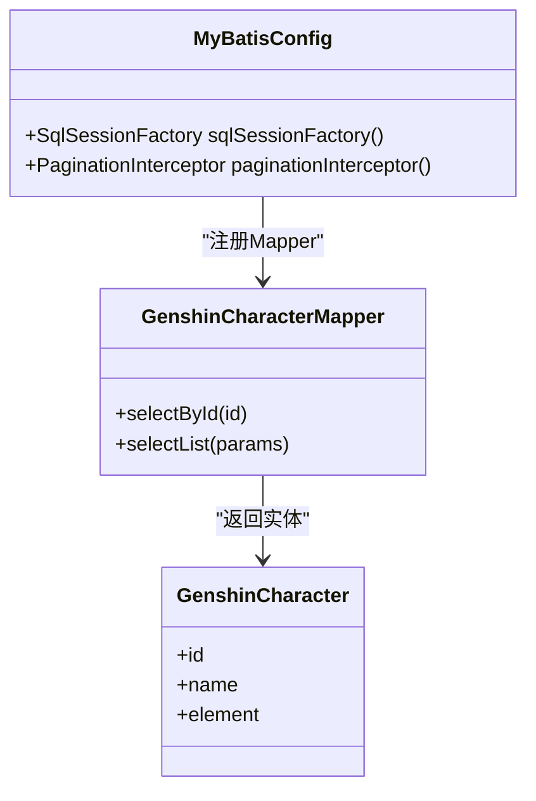
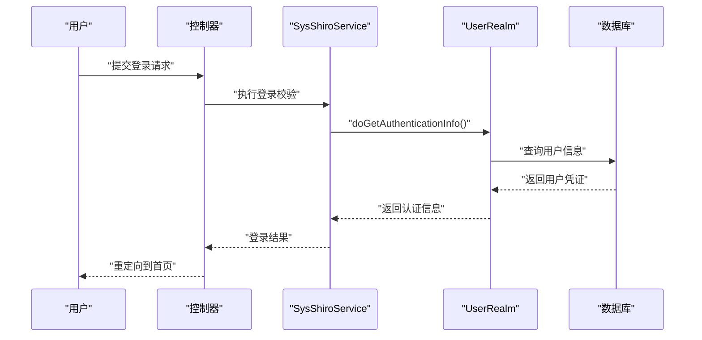
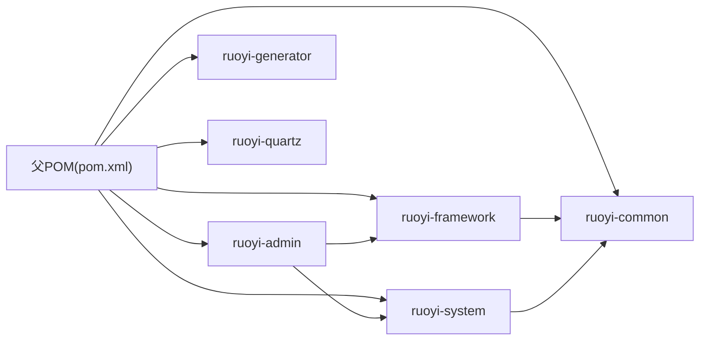

# 技术栈选型

<cite>
**本文引用的文件**
- [pom.xml](file://GenShin/RuoYi-master/pom.xml)
- [RuoYiApplication.java](file://GenShin/RuoYi-master/ruoyi-admin/src/main/java/com/ruoyi/web/RuoYiApplication.java)
- [application.yml](file://GenShin/RuoYi-master/ruoyi-admin/src/main/resources/application.yml)
- [MyBatisConfig.java](file://GenShin/RuoYi-master/ruoyi-framework/src/main/java/com/ruoyi/framework/config/MyBatisConfig.java)
- [ShiroConfig.java](file://GenShin/RuoYi-master/ruoyi-framework/src/main/java/com/ruoyi/framework/config/ShiroConfig.java)
- [ApplicationConfig.java](file://GenShin/RuoYi-master/ruoyi-framework/src/main/java/com/ruoyi/framework/config/ApplicationConfig.java)
- [ehcache-shiro.xml](file://GenShin/RuoYi-master/ruoyi-admin/src/main/resources/ehcache/ehcache-shiro.xml)
- [mybatis-config.xml](file://GenShin/RuoYi-master/ruoyi-admin/src/main/resources/mybatis/mybatis-config.xml)
- [SysShiroService.java](file://GenShin/RuoYi-master/ruoyi-framework/src/main/java/com/ruoyi/framework/shiro/service/SysShiroService.java)
- [SysLoginService.java](file://GenShin/RuoYi-master/ruoyi-framework/src/main/java/com/ruoyi/framework/shiro/service/SysLoginService.java)
- [SysPasswordService.java](file://GenShin/RuoYi-master/ruoyi-framework/src/main/java/com/ruoyi/framework/shiro/service/SysPasswordService.java)
- [UserRealm.java](file://GenShin/RuoYi-master/ruoyi-framework/src/main/java/com/ruoyi/framework/shiro/realm/UserRealm.java)
- [CustomShiroFilterFactoryBean.java](file://GenShin/RuoYi-master/ruoyi-framework/src/main/java/com/ruoyi/framework/shiro/web/CustomShiroFilterFactoryBean.java)
- [GlobalExceptionHandler.java](file://GenShin/RuoYi-master/ruoyi-framework/src/main/java/com/ruoyi/framework/web/exception/GlobalExceptionHandler.java)
- [SwaggerConfig.java](file://GenShin/RuoYi-master/ruoyi-admin/src/main/java/com/ruoyi/web/core/config/SwaggerConfig.java)
- [bootstrap.min.css](file://GenShin/RuoYi-master/ruoyi-admin/src/main/resources/static/css/bootstrap.min.css)
- [bootstrap.min.js](file://GenShin/RuoYi-master/ruoyi-admin/src/main/resources/static/js/bootstrap.min.js)
- [login.html](file://GenShin/RuoYi-master/ruoyi-admin/src/main/resources/templates/login.html)
- [index.html](file://GenShin/RuoYi-master/ruoyi-admin/src/main/resources/templates/index.html)
- [GENSHIN_MODULE_GUIDE.md](file://GenShin/RuoYi-master/GENSHIN_MODULE_GUIDE.md)
- [迁移指南.md](file://GenShin/RuoYi-master/迁移指南.md)
</cite>

## 目录
1. [引言](#引言)
2. [项目结构](#项目结构)
3. [核心组件](#核心组件)
4. [架构总览](#架构总览)
5. [详细组件分析](#详细组件分析)
6. [依赖关系分析](#依赖关系分析)
7. [性能考虑](#性能考虑)
8. [故障排除指南](#故障排除指南)
9. [结论](#结论)
10. [附录](#附录)

## 引言
本技术栈选型文档面向“原神攻略系统”，基于仓库中现有的 RuoYi 框架实现，系统化阐述 Spring Boot、MyBatis、Apache Shiro、Thymeleaf、Bootstrap 等核心技术的选型理由、组件职责与集成方式，并从性能、安全、可维护性、社区支持等维度进行综合评估。同时提供版本兼容性说明、升级路径建议以及替代方案讨论，帮助开发者理解并优化该技术基础。

## 项目结构
该项目采用多模块 Maven 结构，围绕后端服务（Spring Boot）、持久层（MyBatis）、安全框架（Apache Shiro）、模板引擎（Thymeleaf）与前端静态资源（Bootstrap）构建。核心模块包括：
- ruoyi-admin：Web 应用入口与资源模板
- ruoyi-framework：框架配置、拦截器、安全与通用能力
- ruoyi-common：通用注解、常量、工具类与分页模型
- ruoyi-system：业务领域模型与 Mapper/XML
- ruoyi-generator：代码生成器
- ruoyi-quartz：定时任务模块

图表来源
- [pom.xml](file://GenShin/RuoYi-master/pom.xml)
- [RuoYiApplication.java](file://GenShin/RuoYi-master/ruoyi-admin/src/main/java/com/ruoyi/web/RuoYiApplication.java)

章节来源
- [pom.xml](file://GenShin/RuoYi-master/pom.xml)
- [GENSHIN_MODULE_GUIDE.md](file://GenShin/RuoYi-master/GENSHIN_MODULE_GUIDE.md)

## 核心组件
本节聚焦于本次技术栈选型涉及的关键组件及其职责：
- Spring Boot：应用启动与自动配置，统一管理各子模块依赖与运行环境
- MyBatis：数据访问层，提供 SQL 映射与对象映射能力，配合分页与动态数据源
- Apache Shiro：认证授权与会话管理，结合 Ehcache 实现缓存与记住我功能
- Thymeleaf：服务端模板引擎，用于页面渲染与国际化支持
- Bootstrap：前端 UI 框架，提供响应式布局与交互组件

章节来源
- [RuoYiApplication.java](file://GenShin/RuoYi-master/ruoyi-admin/src/main/java/com/ruoyi/web/RuoYiApplication.java)
- [application.yml](file://GenShin/RuoYi-master/ruoyi-admin/src/main/resources/application.yml)

## 架构总览
下图展示系统整体架构与组件交互关系，突出 Web 层、框架层、业务层与外部依赖之间的协作：

图表来源
- [MyBatisConfig.java](file://GenShin/RuoYi-master/ruoyi-framework/src/main/java/com/ruoyi/framework/config/MyBatisConfig.java)
- [ShiroConfig.java](file://GenShin/RuoYi-master/ruoyi-framework/src/main/java/com/ruoyi/framework/config/ShiroConfig.java)
- [ApplicationConfig.java](file://GenShin/RuoYi-master/ruoyi-framework/src/main/java/com/ruoyi/framework/config/ApplicationConfig.java)
- [GlobalExceptionHandler.java](file://GenShin/RuoYi-master/ruoyi-framework/src/main/java/com/ruoyi/framework/web/exception/GlobalExceptionHandler.java)
- [SysShiroService.java](file://GenShin/RuoYi-master/ruoyi-framework/src/main/java/com/ruoyi/framework/shiro/service/SysShiroService.java)
- [UserRealm.java](file://GenShin/RuoYi-master/ruoyi-framework/src/main/java/com/ruoyi/framework/shiro/realm/UserRealm.java)
- [ehcache-shiro.xml](file://GenShin/RuoYi-master/ruoyi-admin/src/main/resources/ehcache/ehcache-shiro.xml)
- [bootstrap.min.css](file://GenShin/RuoYi-master/ruoyi-admin/src/main/resources/static/css/bootstrap.min.css)
- [login.html](file://GenShin/RuoYi-master/ruoyi-admin/src/main/resources/templates/login.html)

## 详细组件分析

### Spring Boot 选型与集成
- 选型理由
  - 快速开发与生产就绪：自动配置、内嵌服务器、健康检查等特性降低开发成本
  - 生态完善：与 MyBatis、Shiro、Swagger 等生态无缝集成
- 在系统中的作用
  - 应用入口与上下文初始化，加载配置与扫描组件
  - 统一管理多模块依赖与打包发布
- 集成方式
  - 通过主类启动应用上下文，读取 application.yml 中的配置项
  - 多模块 Maven 结构便于功能拆分与复用

章节来源
- [RuoYiApplication.java](file://GenShin/RuoYi-master/ruoyi-admin/src/main/java/com/ruoyi/web/RuoYiApplication.java)
- [application.yml](file://GenShin/RuoYi-master/ruoyi-admin/src/main/resources/application.yml)
- [pom.xml](file://GenShin/RuoYi-master/pom.xml)

### MyBatis 选型与集成
- 选型理由
  - SQL 与 Java 对象映射清晰，适合复杂查询与报表场景
  - 支持动态 SQL、分页插件与缓存策略
- 在系统中的作用
  - 提供数据访问接口与 XML 映射，支撑角色、用户、武器、角色等业务实体
  - 配合分页模型与动态数据源实现灵活的数据操作
- 集成方式
  - 通过 MyBatisConfig 注入 SqlSessionFactory
  - 使用 PageDomain/TableDataInfo 等分页模型
  - mybatis-config.xml 提供全局配置（如类型别名、驼峰映射）

图表来源
- [MyBatisConfig.java](file://GenShin/RuoYi-master/ruoyi-framework/src/main/java/com/ruoyi/framework/config/MyBatisConfig.java)
- [GenshinCharacterMapper.java](file://GenShin/RuoYi-master/ruoyi-system/src/main/java/com/ruoyi/system/mapper/GenshinCharacterMapper.java)

章节来源
- [MyBatisConfig.java](file://GenShin/RuoYi-master/ruoyi-framework/src/main/java/com/ruoyi/framework/config/MyBatisConfig.java)
- [mybatis-config.xml](file://GenShin/RuoYi-master/ruoyi-admin/src/main/resources/mybatis/mybatis-config.xml)

### Apache Shiro 选型与集成
- 选型理由
  - 认证授权成熟稳定，支持多种 Realm、会话管理与记住我
  - 与 Ehcache 集成良好，适合中大型后台系统的权限控制
- 在系统中的作用
  - 统一处理登录、权限校验、会话同步与踢出逻辑
  - 通过自定义 Realm 将业务用户体系接入安全框架
- 集成方式
  - ShiroConfig 配置过滤链与安全管理器
  - UserRealm 实现认证与授权逻辑
  - SysShiroService、SysLoginService、SysPasswordService 提供业务服务
  - ehcache-shiro.xml 配置缓存策略

图表来源
- [SysShiroService.java](file://GenShin/RuoYi-master/ruoyi-framework/src/main/java/com/ruoyi/framework/shiro/service/SysShiroService.java)
- [SysLoginService.java](file://GenShin/RuoYi-master/ruoyi-framework/src/main/java/com/ruoyi/framework/shiro/service/SysLoginService.java)
- [UserRealm.java](file://GenShin/RuoYi-master/ruoyi-framework/src/main/java/com/ruoyi/framework/shiro/realm/UserRealm.java)
- [ShiroConfig.java](file://GenShin/RuoYi-master/ruoyi-framework/src/main/java/com/ruoyi/framework/config/ShiroConfig.java)

章节来源
- [ShiroConfig.java](file://GenShin/RuoYi-master/ruoyi-framework/src/main/java/com/ruoyi/framework/config/ShiroConfig.java)
- [ehcache-shiro.xml](file://GenShin/RuoYi-master/ruoyi-admin/src/main/resources/ehcache/ehcache-shiro.xml)
- [SysShiroService.java](file://GenShin/RuoYi-master/ruoyi-framework/src/main/java/com/ruoyi/framework/shiro/service/SysShiroService.java)
- [SysLoginService.java](file://GenShin/RuoYi-master/ruoyi-framework/src/main/java/com/ruoyi/framework/shiro/service/SysLoginService.java)
- [SysPasswordService.java](file://GenShin/RuoYi-master/ruoyi-framework/src/main/java/com/ruoyi/framework/shiro/service/SysPasswordService.java)
- [UserRealm.java](file://GenShin/RuoYi-master/ruoyi-framework/src/main/java/com/ruoyi/framework/shiro/realm/UserRealm.java)

### Thymeleaf 选型与集成
- 选型理由
  - 服务端模板引擎，支持表达式、片段与国际化，适合后台管理系统页面
  - 与 Spring Boot 自动集成，开发体验友好
- 在系统中的作用
  - 渲染登录页、主页与各类业务管理页面
  - 与 Bootstrap 协同提供一致的 UI 体验
- 集成方式
  - 模板位于 templates 目录，静态资源位于 static 目录
  - login.html、index.html 等作为页面入口

章节来源
- [login.html](file://GenShin/RuoYi-master/ruoyi-admin/src/main/resources/templates/login.html)
- [index.html](file://GenShin/RuoYi-master/ruoyi-admin/src/main/resources/templates/index.html)

### Bootstrap 选型与集成
- 选型理由
  - 流行的前端 UI 框架，提供响应式布局与丰富的组件库
  - 与 Thymeleaf 页面结合，快速搭建后台管理界面
- 在系统中的作用
  - 提供样式与脚本资源，支撑登录页与业务页面的视觉与交互
- 集成方式
  - 通过静态资源目录引入 bootstrap.min.css 与 bootstrap.min.js

章节来源
- [bootstrap.min.css](file://GenShin/RuoYi-master/ruoyi-admin/src/main/resources/static/css/bootstrap.min.css)
- [bootstrap.min.js](file://GenShin/RuoYi-master/ruoyi-admin/src/main/resources/static/js/bootstrap.min.js)

## 依赖关系分析
系统采用 Maven 多模块结构，父 POM 统一管理版本与依赖，子模块按职责划分。核心依赖关系如下：

图表来源
- [pom.xml](file://GenShin/RuoYi-master/pom.xml)

章节来源
- [pom.xml](file://GenShin/RuoYi-master/pom.xml)

## 性能考虑
- 数据访问层
  - 合理使用分页模型与索引，避免全表扫描
  - MyBatis 缓存与二级缓存策略需结合业务读写比进行调优
- 安全层
  - Shiro 会话与缓存命中率直接影响登录与权限校验性能
  - 建议对热点用户信息进行本地缓存与异步刷新
- 前端层
  - 合理压缩与合并静态资源，减少请求次数
  - 使用 CDN 加速公共资源加载

## 故障排除指南
- 全局异常处理
  - 框架提供全局异常处理器，统一捕获并返回标准错误响应
- 常见问题定位
  - 登录失败：检查 Shiro 配置与 UserRealm 认证流程
  - 页面空白：确认 Thymeleaf 模板路径与静态资源引入
  - 数据库连接异常：核对 application.yml 中的数据源配置

章节来源
- [GlobalExceptionHandler.java](file://GenShin/RuoYi-master/ruoyi-framework/src/main/java/com/ruoyi/framework/web/exception/GlobalExceptionHandler.java)

## 结论
本技术栈以 Spring Boot 为核心，结合 MyBatis 的数据映射能力、Apache Shiro 的安全控制、Thymeleaf 的模板渲染与 Bootstrap 的前端组件，形成了高内聚、低耦合且易于扩展的后台管理系统基础。在性能、安全与可维护性方面具备良好平衡，适合原神攻略系统的业务发展需求。

## 附录

### 版本兼容性与升级路径
- 版本兼容性
  - Spring Boot 与各子模块版本由父 POM 统一管理，确保依赖一致性
  - MyBatis 与 Spring Boot Starter 版本需匹配，避免运行时异常
  - Shiro 与 Ehcache 版本需兼容，保证缓存策略生效
- 升级路径建议
  - 优先升级 Spring Boot 主版本，再同步升级 MyBatis、Shiro 等依赖
  - 升级前执行完整的回归测试与性能压测
  - 参考迁移指南进行配置调整与代码适配

章节来源
- [pom.xml](file://GenShin/RuoYi-master/pom.xml)
- [迁移指南.md](file://GenShin/RuoYi-master/迁移指南.md)

### 对比分析与替代方案
- Spring Boot vs. Spring MVC
  - 优势：自动配置、Actuator、Starter 生态更易上手
  - 替代：若追求极致轻量化可考虑 Micronaut 或 Quarkus，但学习与迁移成本较高
- MyBatis vs. JPA/Hibernate
  - 优势：SQL 可控性强，复杂查询与报表场景表现更好
  - 替代：JPA 适合简单 CRUD 场景；若需要强类型 SQL 可考虑 MyBatis Plus
- Apache Shiro vs. Spring Security
  - 优势：配置简洁、Realm 扩展灵活，适合传统后台权限模型
  - 替代：Spring Security 生态更丰富，适合微服务与 OAuth2 场景
- Thymeleaf vs. Vue/Angular
  - 优势：服务端渲染、SEO 友好、前后端分离程度低
  - 替代：若需要富交互与单页应用体验，可考虑前后端分离方案

### 配置要点与使用注意事项
- Spring Boot
  - application.yml 中的数据库、Redis、日志等配置需与实际环境一致
  - 多环境 profile 切换需明确区分开发/测试/生产
- MyBatis
  - Mapper 接口与 XML 文件命名规范需保持一致
  - 分页插件需在 SQL 中正确使用 PageDomain
- Shiro
  - 过滤链顺序影响权限控制效果，需谨慎配置
  - 用户密码加密策略需与 SysPasswordService 保持一致
- Thymeleaf
  - 模板路径与变量绑定需与控制器返回值一致
  - 国际化资源文件需按约定放置与命名
- Bootstrap
  - 静态资源版本需与模板引用一致，避免加载失败