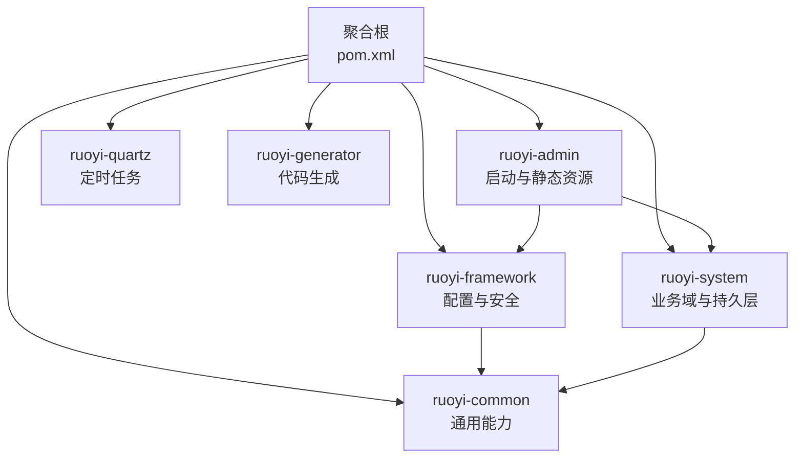
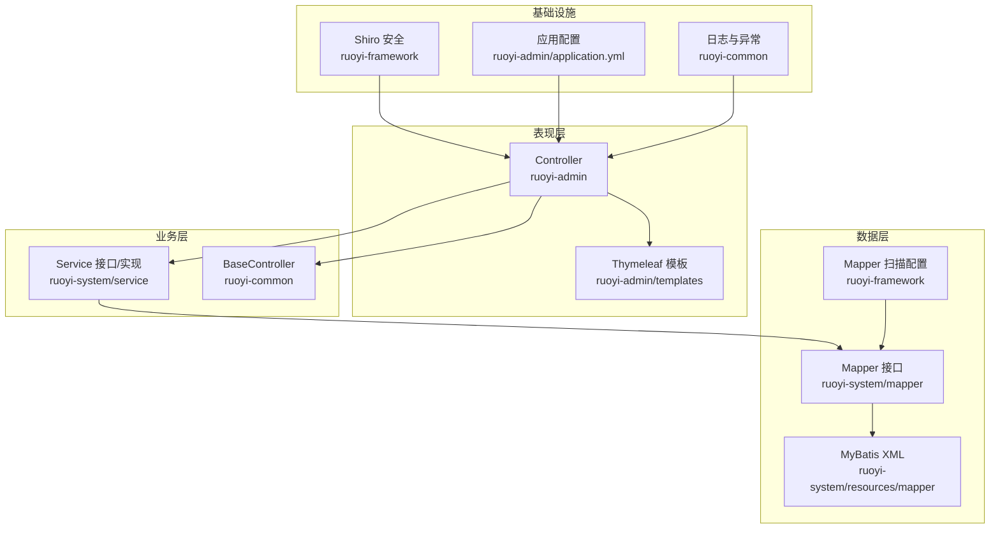
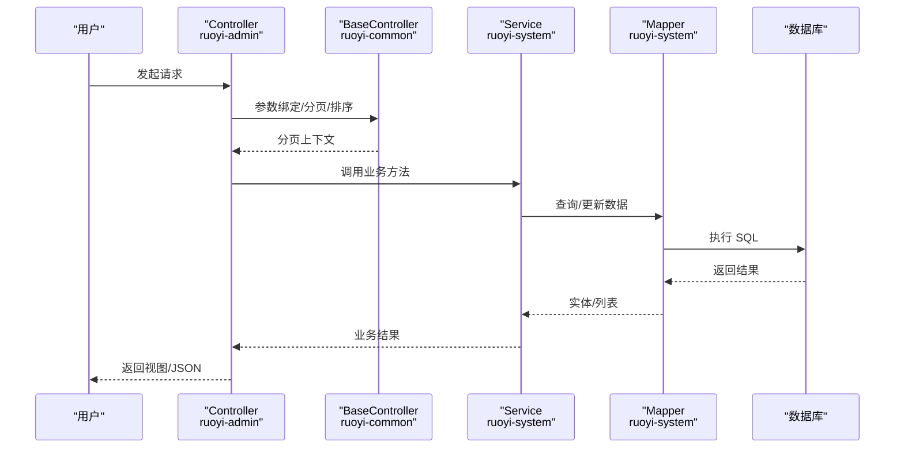
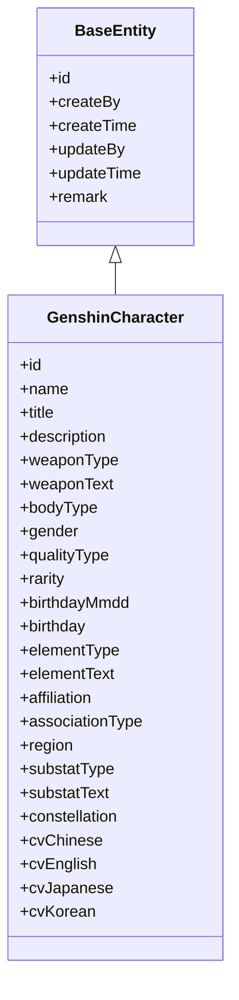
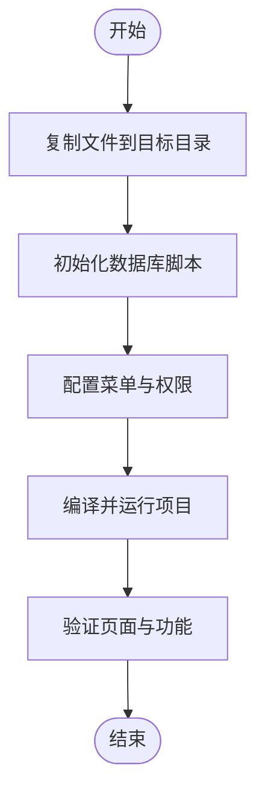
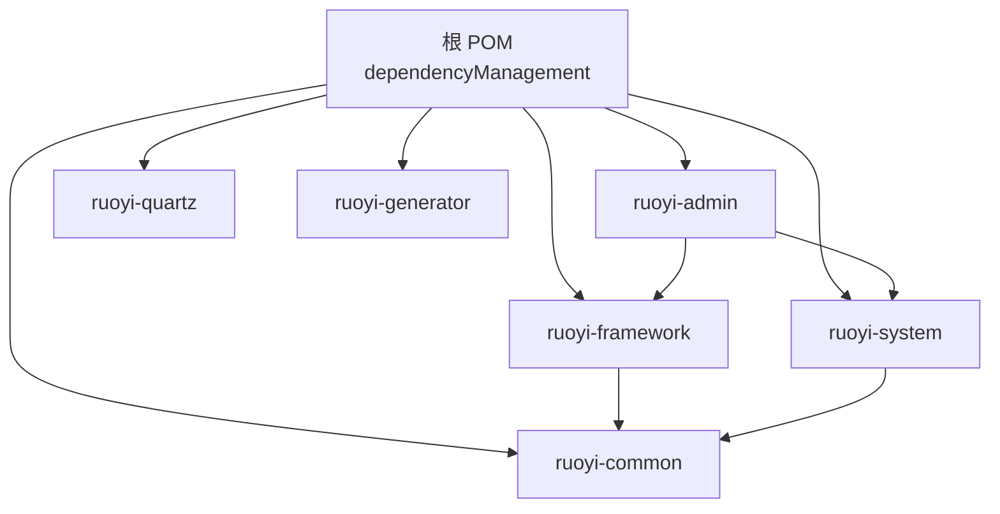

# 整体架构概览

<cite>
**本文引用的文件**
- [pom.xml](file://pom.xml)
- [RuoYiApplication.java](file://ruoyi-admin/src/main/java/com/ruoyi/RuoYiApplication.java)
- [application.yml](file://ruoyi-admin/src/main/resources/application.yml)
- [ApplicationConfig.java](file://ruoyi-framework/src/main/java/com/ruoyi/framework/config/ApplicationConfig.java)
- [BaseController.java](file://ruoyi-common/src/main/java/com/ruoyi/common/core/controller/BaseController.java)
- [GenshinCharacter.java](file://ruoyi-system/src/main/java/com/ruoyi/system/domain/GenshinCharacter.java)
- [GENSHIN_MODULE_GUIDE.md](file://GENSHIN_MODULE_GUIDE.md)
- [README.md](file://README.md)
</cite>

## 目录
1. [引言](#引言)
2. [项目结构](#项目结构)
3. [核心组件](#核心组件)
4. [架构总览](#架构总览)
5. [详细组件分析](#详细组件分析)
6. [依赖分析](#依赖分析)
7. [性能考虑](#性能考虑)
8. [故障排查指南](#故障排查指南)
9. [结论](#结论)
10. [附录](#附录)

## 引言
本文件面向“原神攻略系统”的整体架构与实现，基于 Spring Boot 企业级应用框架，结合若依（RuoYi）的模块化设计，系统化阐述 MVC 架构在项目中的落地方式，明确表现层、业务逻辑层、数据访问层的职责边界，并梳理 ruoyi-admin、ruoyi-system、ruoyi-common、ruoyi-framework 等核心模块的功能定位与相互关系。文档同时提供系统架构图、组件关系图与流程图，帮助开发者快速理解系统设计思路与扩展方向。

## 项目结构
项目采用多模块聚合工程组织，根 POM 声明统一依赖与模块集合，各子模块按领域与职责拆分，形成清晰的分层与模块边界：

- 聚合工程与模块
  - 聚合根：根 POM 统一管理版本、依赖与插件，定义模块清单（ruoyi-admin、ruoyi-framework、ruoyi-system、ruoyi-quartz、ruoyi-generator、ruoyi-common）。
  - 运行入口：ruoyi-admin 提供 Spring Boot 启动类与静态资源、模板页面。
  - 核心框架：ruoyi-framework 提供配置、切面、拦截器、Shiro 安全、异步任务等基础设施。
  - 业务域：ruoyi-system 定义业务实体、Mapper、Service 与 MyBatis XML，承载原神攻略相关业务。
  - 通用能力：ruoyi-common 提供通用注解、常量、工具类、分页、安全工具、异常体系等。
  - 定时任务与代码生成：ruoyi-quartz、ruoyi-generator 作为可选模块提供调度与代码生成能力。

- 配置与启动
  - ruoyi-admin 的 application.yml 配置了服务器端口、MyBatis、分页插件、Shiro、Swagger/OpenAPI、XSS/CSRF 防护等。
  - RuoYiApplication 作为启动类，排除数据源自动装配，交由框架按需配置。

- 原神模块集成
  - GENSHIN_MODULE_GUIDE.md 提供原神模块的复制与集成步骤、数据库初始化、菜单权限配置与运行验证指引，确保业务模块平滑接入现有框架。

**图表来源**
- [pom.xml:208-215](file://pom.xml#L208-L215)
- [RuoYiApplication.java:12](file://ruoyi-admin/src/main/java/com/ruoyi/RuoYiApplication.java#L12)
- [application.yml:16-154](file://ruoyi-admin/src/main/resources/application.yml#L16-L154)

**章节来源**
- [pom.xml:1-264](file://pom.xml#L1-L264)
- [GENSHIN_MODULE_GUIDE.md:1-252](file://GENSHIN_MODULE_GUIDE.md#L1-L252)
- [README.md:1-111](file://README.md#L1-L111)

## 核心组件
围绕原神攻略系统，核心组件包括：

- 表现层（Controller）
  - 位于 ruoyi-admin，负责接收请求、参数绑定、权限校验、调用业务层、返回视图或 JSON。
  - 通用控制器基类 BaseController 提供分页、响应封装、会话与用户上下文访问等通用能力。

- 业务逻辑层（Service）
  - 位于 ruoyi-system，定义业务接口与实现，协调领域模型与数据访问层，处理业务规则与事务边界。

- 数据访问层（Mapper/DAO）
  - 位于 ruoyi-system，定义数据库访问接口，配合 MyBatis XML 执行 SQL。
  - ruoyi-framework 的 ApplicationConfig 统一扫描 Mapper 包路径，简化配置。

- 领域模型（Domain）
  - 位于 ruoyi-system，承载业务实体（如 GenshinCharacter），包含字段、Excel 导出注解与 ToString 输出。

- 通用工具与安全
  - ruoyi-common 提供 AjaxResult、分页、Shiro 工具、异常体系、XSS/SQL 注入防护等。
  - ruoyi-framework 提供 Shiro 配置、过滤器、切面、异步管理等。

**章节来源**
- [BaseController.java:1-230](file://ruoyi-common/src/main/java/com/ruoyi/common/core/controller/BaseController.java#L1-L230)
- [ApplicationConfig.java:1-21](file://ruoyi-framework/src/main/java/com/ruoyi/framework/config/ApplicationConfig.java#L1-L21)
- [GenshinCharacter.java:1-383](file://ruoyi-system/src/main/java/com/ruoyi/system/domain/GenshinCharacter.java#L1-L383)

## 架构总览
系统遵循经典的三层架构（表现层-业务层-数据层）与领域驱动设计（DDD）思想，结合 Spring Boot 自动装配与 MyBatis ORM，形成高内聚、低耦合的模块化结构。

- 技术栈
  - 后端：Spring Boot 4.x、Spring MVC、MyBatis、Shiro、PageHelper、OpenAPI/SpringDoc、Druid 连接池。
  - 前端：Thymeleaf 模板引擎、静态资源与模板页面（位于 ruoyi-admin）。
  - 安全：Shiro 认证授权、XSS/CSRF 防护、记住我、会话同步。
  - 运维：日志、健康监控、定时任务、代码生成。

- 设计原则
  - 分层清晰：表现层只负责交互，业务层专注规则，数据层专注持久化。
  - 可扩展：模块化聚合工程，新增业务模块仅需遵循现有目录与命名规范。
  - 可维护：统一的异常、分页、安全工具与配置，降低重复代码与提升一致性。

**图表来源**
- [application.yml:46-154](file://ruoyi-admin/src/main/resources/application.yml#L46-L154)
- [ApplicationConfig.java:12-20](file://ruoyi-framework/src/main/java/com/ruoyi/framework/config/ApplicationConfig.java#L12-L20)
- [BaseController.java:33-230](file://ruoyi-common/src/main/java/com/ruoyi/common/core/controller/BaseController.java#L33-L230)

**章节来源**
- [application.yml:1-154](file://ruoyi-admin/src/main/resources/application.yml#L1-L154)
- [ApplicationConfig.java:1-21](file://ruoyi-framework/src/main/java/com/ruoyi/framework/config/ApplicationConfig.java#L1-L21)
- [README.md:24-54](file://README.md#L24-L54)

## 详细组件分析

### MVC 架构在项目中的实现
- 表现层（Controller）
  - 通过 BaseController 统一处理分页、排序、响应封装与用户上下文，减少重复代码。
  - ruoyi-admin 的模板与静态资源支撑页面渲染与交互。
- 业务层（Service）
  - 以接口与实现分离的方式组织，便于单元测试与替换实现。
  - 与数据访问层解耦，集中处理业务规则与事务控制。
- 数据层（Mapper/DAO）
  - Mapper 接口由 ruoyi-framework 的 ApplicationConfig 统一扫描，避免分散配置。
  - MyBatis XML 与实体类协同，支持复杂查询与批量操作。

**图表来源**
- [BaseController.java:54-82](file://ruoyi-common/src/main/java/com/ruoyi/common/core/controller/BaseController.java#L54-L82)
- [ApplicationConfig.java:12-20](file://ruoyi-framework/src/main/java/com/ruoyi/framework/config/ApplicationConfig.java#L12-L20)

**章节来源**
- [BaseController.java:1-230](file://ruoyi-common/src/main/java/com/ruoyi/common/core/controller/BaseController.java#L1-L230)
- [ApplicationConfig.java:1-21](file://ruoyi-framework/src/main/java/com/ruoyi/framework/config/ApplicationConfig.java#L1-L21)

### 领域模型与数据结构
- GenshinCharacter 作为角色实体，继承 BaseEntity，具备通用字段与导出注解，体现领域对象的可读性与可维护性。
- 通过注解驱动的实体设计，配合 Service/Mapper 层，实现从数据库到业务对象的映射与转换。

**图表来源**
- [GenshinCharacter.java:14-383](file://ruoyi-system/src/main/java/com/ruoyi/system/domain/GenshinCharacter.java#L14-L383)

**章节来源**
- [GenshinCharacter.java:1-383](file://ruoyi-system/src/main/java/com/ruoyi/system/domain/GenshinCharacter.java#L1-L383)

### 原神模块集成流程
- 文件复制与目录映射：将 genshin 模块的 Controller、Domain、Mapper、Service、XML 与前端模板复制到 ruoyi-admin 与 ruoyi-system 对应目录。
- 数据库初始化：执行 genshin_module.sql 建表脚本，确保实体与表结构一致。
- 菜单与权限：在后台系统中添加菜单与按钮权限标识，使功能在前端菜单中可见。
- 运行与验证：启动项目，访问角色管理页面，确认 CRUD 功能可用。

**图表来源**
- [GENSHIN_MODULE_GUIDE.md:21-143](file://GENSHIN_MODULE_GUIDE.md#L21-L143)

**章节来源**
- [GENSHIN_MODULE_GUIDE.md:1-252](file://GENSHIN_MODULE_GUIDE.md#L1-L252)

## 依赖分析
- 聚合与模块依赖
  - 根 POM 通过 dependencyManagement 统一版本，模块间通过 artifactId 引用（如 ruoyi-quartz、ruoyi-generator、ruoyi-framework、ruoyi-system、ruoyi-common）。
  - ruoyi-admin 作为运行入口，依赖 ruoyi-framework 与 ruoyi-system，同时引入通用能力 ruoyi-common。
- 外部依赖
  - Spring Boot、MyBatis、Shiro、PageHelper、OpenAPI/SpringDoc、Druid、Kaptcha、POI、Velocity 等，覆盖安全、ORM、分页、文档、连接池与模板生成等需求。

**图表来源**
- [pom.xml:37-206](file://pom.xml#L37-L206)

**章节来源**
- [pom.xml:1-264](file://pom.xml#L1-L264)

## 性能考虑
- 连接池与数据库
  - 使用 Druid 连接池，结合监控与 SQL 分析能力，辅助定位慢查询与连接瓶颈。
- 分页与查询
  - PageHelper 分页插件统一处理分页与排序，避免 N+1 查询与过度数据传输。
- 缓存与会话
  - Shiro 会话同步与缓存策略，结合 XSS/CSRF 防护，平衡安全与性能。
- 启动与线程
  - Tomcat 线程池参数可调，结合业务并发峰值合理配置最大线程与排队数。

**章节来源**
- [application.yml:23-32](file://ruoyi-admin/src/main/resources/application.yml#L23-L32)
- [application.yml:80-85](file://ruoyi-admin/src/main/resources/application.yml#L80-L85)

## 故障排查指南
- 启动与端口
  - 确认 server.port 与 context-path 配置，避免端口冲突。
- 数据库与表结构
  - 确认数据库连接、schema 与表结构与实体一致，执行初始化脚本。
- 权限与菜单
  - 若出现 404 或权限不足，检查菜单路由、组件路径与权限标识配置。
- 日志与异常
  - 关注 ruoyi-admin 的日志级别与异常处理器，定位业务异常与参数校验问题。

**章节来源**
- [application.yml:16-79](file://ruoyi-admin/src/main/resources/application.yml#L16-L79)
- [GENSHIN_MODULE_GUIDE.md:146-167](file://GENSHIN_MODULE_GUIDE.md#L146-L167)

## 结论
本项目以 Spring Boot 为基础，结合若依的模块化设计与分层架构，实现了原神攻略系统的可扩展与可维护性。通过 BaseController 统一处理通用能力，ApplicationConfig 统一扫描 Mapper，以及 ruoyi-common/ruoyi-framework 提供的安全与基础设施，系统在保证开发效率的同时兼顾性能与安全性。原神模块的集成流程清晰，便于后续扩展更多业务域。

## 附录
- 快速启动
  - 使用 Maven 打包后运行 jar，或在 IDE 中直接启动 RuoYiApplication。
- 常用配置
  - application.yml 中包含服务器、MyBatis、分页、Shiro、OpenAPI、XSS/CSRF 等关键配置项。
- 文档与演示
  - README 提供版本分支、内置功能与在线演示地址，便于了解框架能力与使用场景。

**章节来源**
- [RuoYiApplication.java:1-29](file://ruoyi-admin/src/main/java/com/ruoyi/RuoYiApplication.java#L1-L29)
- [application.yml:1-154](file://ruoyi-admin/src/main/resources/application.yml#L1-L154)
- [README.md:24-106](file://README.md#L24-L106)