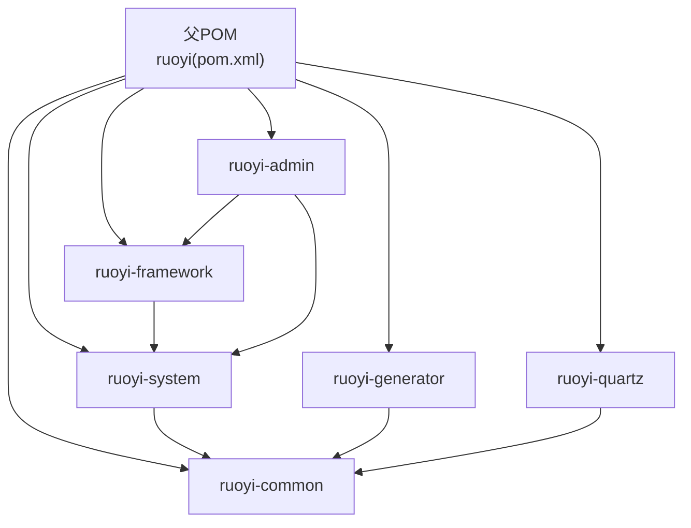
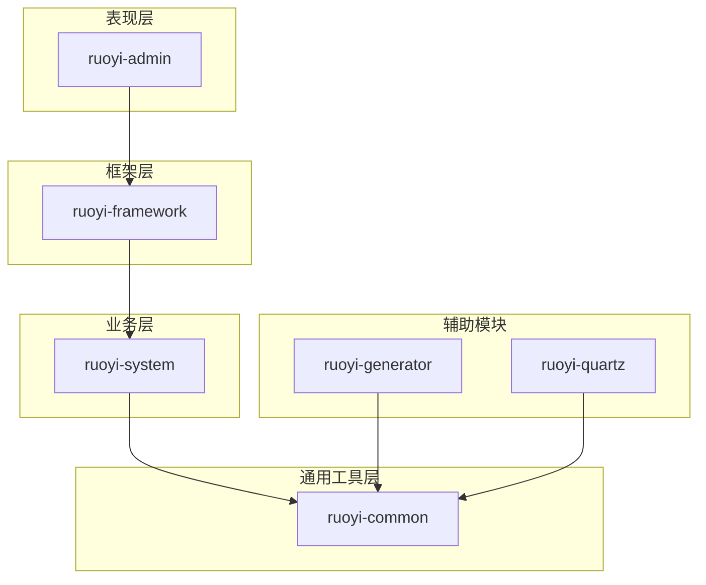
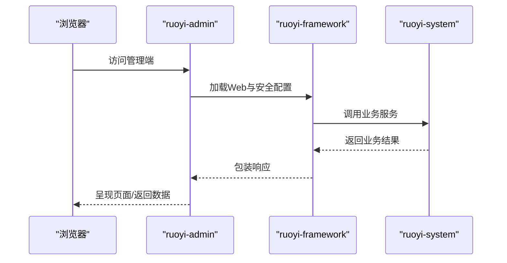
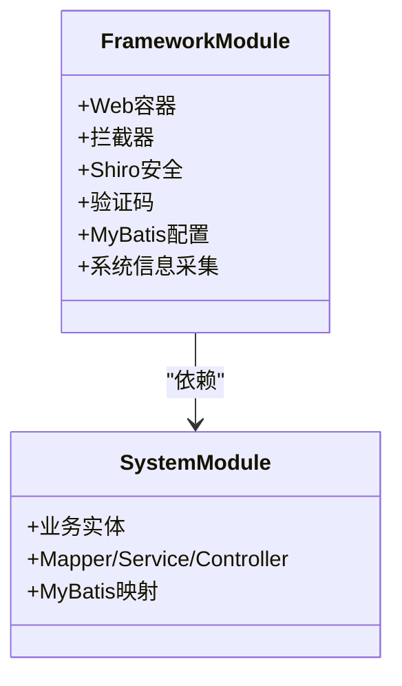
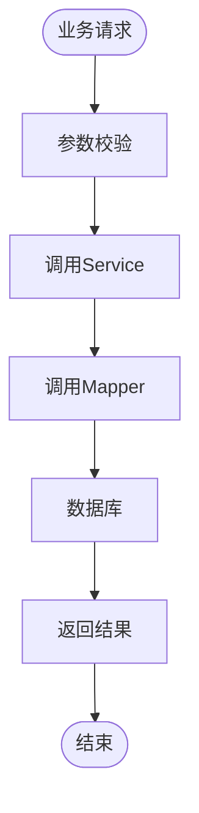
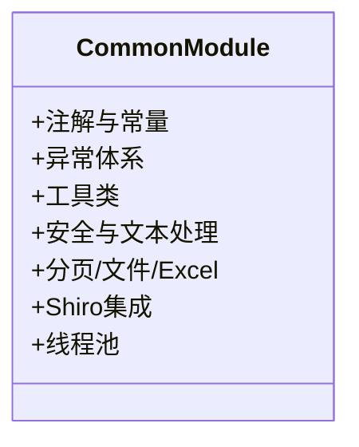
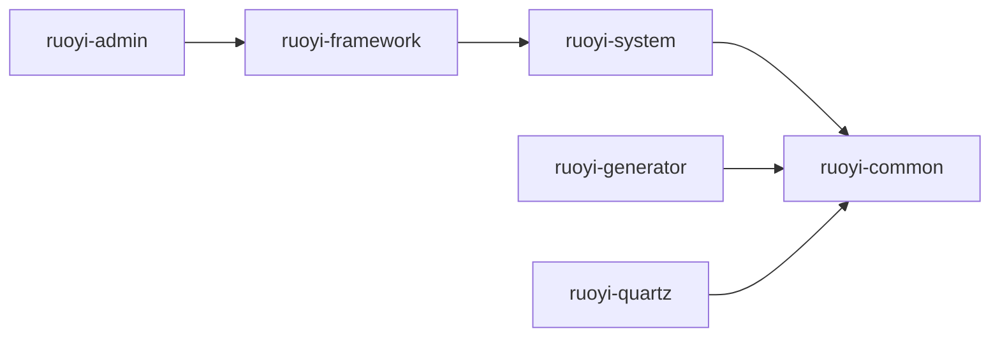

# 模块化架构设计

<cite>
**本文引用的文件**
- [GENSHIN_MODULE_GUIDE.md](file://GENSHIN_MODULE_GUIDE.md)
- [pom.xml](file://pom.xml)
- [RuoYiApplication.java](file://ruoyi-admin/src/main/java/com/ruoyi/RuoYiApplication.java)
- [ruoyi-system/pom.xml](file://ruoyi-system/pom.xml)
- [ruoyi-common/pom.xml](file://ruoyi-common/pom.xml)
- [ruoyi-framework/pom.xml](file://ruoyi-framework/pom.xml)
- [ruoyi-generator/pom.xml](file://ruoyi-generator/pom.xml)
- [ruoyi-quartz/pom.xml](file://ruoyi-quartz/pom.xml)
</cite>

## 目录
1. [引言](#引言)
2. [项目结构](#项目结构)
3. [核心组件](#核心组件)
4. [架构总览](#架构总览)
5. [详细组件分析](#详细组件分析)
6. [依赖分析](#依赖分析)
7. [性能考虑](#性能考虑)
8. [故障排查指南](#故障排查指南)
9. [结论](#结论)
10. [附录](#附录)

## 引言
本项目为基于若依（RuoYi）权限管理底座的 JavaEE 综合实训项目，围绕原神（Genshin Impact）游戏数据集构建“攻略系统”。系统采用多模块分层架构，通过 ruoyi-admin（管理端）、ruoyi-system（业务逻辑）、ruoyi-common（通用工具）、ruoyi-framework（框架核心）、ruoyi-generator（代码生成）、ruoyi-quartz（定时任务）等模块协同工作，实现角色管理、元素系统、敌人管理、推荐系统、用户收藏、天赋消耗等业务能力，并提供菜单权限集成与前后端模板支持。

该架构强调职责分离、代码复用、易于维护与扩展，便于后续接入更多原神相关业务模块。

## 项目结构
项目采用 Maven 多模块聚合结构，父 POM 统一管理版本与依赖，各子模块按职责划分，模块间通过依赖关系耦合，形成清晰的层次化体系。

图表来源
- [pom.xml:208-215](file://pom.xml#L208-L215)

章节来源
- [pom.xml:208-215](file://pom.xml#L208-L215)

## 核心组件
- ruoyi-admin（管理端）
  - 职责：应用入口与前端模板承载，负责对外服务暴露与用户交互。
  - 关键点：排除数据源自动装配，交由框架模块统一配置；作为聚合入口启动应用。
  - 启动类：[RuoYiApplication.java:12-18](file://ruoyi-admin/src/main/java/com/ruoyi/RuoYiApplication.java#L12-L18)

- ruoyi-framework（框架核心）
  - 职责：Web 容器、拦截器、Shiro 安全、MyBatis 配置、验证码、系统信息采集等基础设施。
  - 依赖：依赖 ruoyi-system 提供业务模块能力。
  - 依赖声明：[ruoyi-framework/pom.xml:82-86](file://ruoyi-framework/pom.xml#L82-L86)

- ruoyi-system（业务逻辑）
  - 职责：承载原神相关业务实体、Mapper、Service、Controller 以及 MyBatis XML 映射。
  - 依赖：仅依赖 ruoyi-common。
  - 依赖声明：[ruoyi-system/pom.xml:18-26](file://ruoyi-system/pom.xml#L18-L26)

- ruoyi-common（通用工具）
  - 职责：提供通用注解、常量、异常、工具类、安全与文本处理、分页、文件与Excel、Shiro 集成、线程池等基础能力。
  - 依赖：Spring Web、Shiro、PageHelper、Jackson/Fastjson、POI、Yauaa、Servlet API 等。
  - 依赖声明：[ruoyi-common/pom.xml:18-99](file://ruoyi-common/pom.xml#L18-L99)

- ruoyi-generator（代码生成）
  - 职责：基于 Velocity 模板生成代码，依赖 ruoyi-common 与 Druid。
  - 依赖声明：[ruoyi-generator/pom.xml:18-37](file://ruoyi-generator/pom.xml#L18-L37)

- ruoyi-quartz（定时任务）
  - 职责：提供 Quartz 定时任务调度能力，依赖 ruoyi-common 与 Spring Boot Starter Quartz。
  - 依赖声明：[ruoyi-quartz/pom.xml:18-31](file://ruoyi-quartz/pom.xml#L18-L31)

章节来源
- [RuoYiApplication.java:12-18](file://ruoyi-admin/src/main/java/com/ruoyi/RuoYiApplication.java#L12-L18)
- [ruoyi-system/pom.xml:18-26](file://ruoyi-system/pom.xml#L18-L26)
- [ruoyi-common/pom.xml:18-99](file://ruoyi-common/pom.xml#L18-L99)
- [ruoyi-framework/pom.xml:82-86](file://ruoyi-framework/pom.xml#L82-L86)
- [ruoyi-generator/pom.xml:18-37](file://ruoyi-generator/pom.xml#L18-L37)
- [ruoyi-quartz/pom.xml:18-31](file://ruoyi-quartz/pom.xml#L18-L31)

## 架构总览
系统采用“管理端 + 框架核心 + 业务模块 + 通用工具 + 代码生成 + 定时任务”的分层架构，ruoyi-admin 作为入口，通过 ruoyi-framework 提供 Web 与安全能力，ruoyi-system 实现业务逻辑，ruoyi-common 提供通用能力，ruoyi-generator 与 ruoyi-quartz 作为辅助模块增强开发效率与运维能力。

图表来源
- [pom.xml:208-215](file://pom.xml#L208-L215)
- [ruoyi-framework/pom.xml:82-86](file://ruoyi-framework/pom.xml#L82-L86)
- [ruoyi-system/pom.xml:18-26](file://ruoyi-system/pom.xml#L18-L26)
- [ruoyi-generator/pom.xml:18-37](file://ruoyi-generator/pom.xml#L18-L37)
- [ruoyi-quartz/pom.xml:18-31](file://ruoyi-quartz/pom.xml#L18-L31)

## 详细组件分析

### ruoyi-admin（管理端）
- 设计理念：作为应用入口，不直接承载业务逻辑，专注于对外服务与前端模板。
- 启动策略：排除数据源自动装配，由框架模块统一配置数据源与事务。
- 启动类：[RuoYiApplication.java:12-18](file://ruoyi-admin/src/main/java/com/ruoyi/RuoYiApplication.java#L12-L18)

图表来源
- [RuoYiApplication.java:12-18](file://ruoyi-admin/src/main/java/com/ruoyi/RuoYiApplication.java#L12-L18)
- [ruoyi-framework/pom.xml:82-86](file://ruoyi-framework/pom.xml#L82-L86)
- [ruoyi-system/pom.xml:18-26](file://ruoyi-system/pom.xml#L18-L26)

章节来源
- [RuoYiApplication.java:12-18](file://ruoyi-admin/src/main/java/com/ruoyi/RuoYiApplication.java#L12-L18)

### ruoyi-framework（框架核心）
- 设计理念：集中提供 Web 容器、拦截器、Shiro 安全、验证码、MyBatis 配置、系统信息采集等横切能力。
- 依赖关系：依赖 ruoyi-system 以获得业务模块能力，同时被 ruoyi-admin 依赖。
- 依赖声明：[ruoyi-framework/pom.xml:82-86](file://ruoyi-framework/pom.xml#L82-L86)

图表来源
- [ruoyi-framework/pom.xml:82-86](file://ruoyi-framework/pom.xml#L82-L86)
- [ruoyi-system/pom.xml:18-26](file://ruoyi-system/pom.xml#L18-L26)

章节来源
- [ruoyi-framework/pom.xml:82-86](file://ruoyi-framework/pom.xml#L82-L86)

### ruoyi-system（业务逻辑）
- 设计理念：承载原神业务实体与 CRUD 能力，遵循领域模型与分层架构，避免与表现层耦合。
- 依赖关系：仅依赖 ruoyi-common，确保通用能力下沉，业务模块保持纯净。
- 依赖声明：[ruoyi-system/pom.xml:18-26](file://ruoyi-system/pom.xml#L18-L26)

图表来源
- [ruoyi-system/pom.xml:18-26](file://ruoyi-system/pom.xml#L18-L26)

章节来源
- [ruoyi-system/pom.xml:18-26](file://ruoyi-system/pom.xml#L18-L26)

### ruoyi-common（通用工具）
- 设计理念：提供跨模块复用的通用能力，包括注解、常量、异常、工具类、安全与文本处理、分页、文件与Excel、Shiro 集成、线程池等。
- 依赖声明：涵盖 Spring Web、Shiro、PageHelper、Jackson/Fastjson、POI、Yauaa、Servlet API 等。
- 依赖声明：[ruoyi-common/pom.xml:18-99](file://ruoyi-common/pom.xml#L18-L99)

图表来源
- [ruoyi-common/pom.xml:18-99](file://ruoyi-common/pom.xml#L18-L99)

章节来源
- [ruoyi-common/pom.xml:18-99](file://ruoyi-common/pom.xml#L18-L99)

### ruoyi-generator（代码生成）
- 设计理念：通过 Velocity 模板自动生成代码，提升开发效率，减少重复劳动。
- 依赖关系：依赖 ruoyi-common 与 Druid。
- 依赖声明：[ruoyi-generator/pom.xml:18-37](file://ruoyi-generator/pom.xml#L18-L37)

章节来源
- [ruoyi-generator/pom.xml:18-37](file://ruoyi-generator/pom.xml#L18-L37)

### ruoyi-quartz（定时任务）
- 设计理念：提供 Quartz 定时任务调度能力，支持复杂时间表达式与并发控制。
- 依赖关系：依赖 ruoyi-common 与 Spring Boot Starter Quartz。
- 依赖声明：[ruoyi-quartz/pom.xml:18-31](file://ruoyi-quartz/pom.xml#L18-L31)

章节来源
- [ruoyi-quartz/pom.xml:18-31](file://ruoyi-quartz/pom.xml#L18-L31)

## 依赖分析
模块间依赖关系如下：

图表来源
- [pom.xml:208-215](file://pom.xml#L208-L215)
- [ruoyi-framework/pom.xml:82-86](file://ruoyi-framework/pom.xml#L82-L86)
- [ruoyi-system/pom.xml:18-26](file://ruoyi-system/pom.xml#L18-L26)
- [ruoyi-generator/pom.xml:18-37](file://ruoyi-generator/pom.xml#L18-L37)
- [ruoyi-quartz/pom.xml:18-31](file://ruoyi-quartz/pom.xml#L18-L31)

章节来源
- [pom.xml:208-215](file://pom.xml#L208-L215)

## 性能考虑
- 依赖下沉：将通用能力下沉至 ruoyi-common，避免重复实现，降低内存占用与编译时间。
- 横切关注：通过 ruoyi-framework 集中处理安全、日志、分页等横切逻辑，减少业务模块样板代码。
- 数据访问：ruoyi-system 通过 MyBatis 映射与分页插件优化查询性能，结合 Druid 监控数据库连接池。
- 并发与异步：利用 ruoyi-common 的线程池与 ruoyi-quartz 的定时任务，合理安排后台任务，避免阻塞主线程。
- 代码生成：ruoyi-generator 减少手写 CRUD 代码，降低错误率并提升迭代速度。

## 故障排查指南
- 启动失败
  - 检查 ruoyi-admin 是否正确排除数据源自动装配，确认 ruoyi-framework 已提供数据源配置。
  - 参考：[RuoYiApplication.java:12-18](file://ruoyi-admin/src/main/java/com/ruoyi/RuoYiApplication.java#L12-L18)

- 类或方法找不到
  - 确保已将原神模块文件复制到正确目录（Controller、Domain、Mapper、Service、Mapper XML、前端模板）。
  - 参考：[GENSHIN_MODULE_GUIDE.md:21-57](file://GENSHIN_MODULE_GUIDE.md#L21-L57)

- 数据库表不存在
  - 确认已执行 genshin_module.sql 建表脚本，检查数据库名称与连接配置。
  - 参考：[GENSHIN_MODULE_GUIDE.md:61-84](file://GENSHIN_MODULE_GUIDE.md#L61-L84)

- 404 错误
  - 检查 Controller 的 @RequestMapping 路径与前端模板复制路径，确认权限配置。
  - 参考：[GENSHIN_MODULE_GUIDE.md:153-161](file://GENSHIN_MODULE_GUIDE.md#L153-L161)

- 权限不足
  - 确认用户具备相应权限标识，必要时在角色管理中分配权限。
  - 参考：[GENSHIN_MODULE_GUIDE.md:87-107](file://GENSHIN_MODULE_GUIDE.md#L87-L107)

章节来源
- [GENSHIN_MODULE_GUIDE.md:21-57](file://GENSHIN_MODULE_GUIDE.md#L21-L57)
- [GENSHIN_MODULE_GUIDE.md:61-84](file://GENSHIN_MODULE_GUIDE.md#L61-L84)
- [GENSHIN_MODULE_GUIDE.md:146-167](file://GENSHIN_MODULE_GUIDE.md#L146-L167)
- [RuoYiApplication.java:12-18](file://ruoyi-admin/src/main/java/com/ruoyi/RuoYiApplication.java#L12-L18)

## 结论
本项目通过模块化架构实现了职责清晰、耦合可控、易于维护与扩展的目标。ruoyi-admin 负责对外服务，ruoyi-framework 提供基础设施，ruoyi-system 承载业务逻辑，ruoyi-common 下沉通用能力，ruoyi-generator 与 ruoyi-quartz 辅助开发与运维。该设计为原神攻略系统的持续演进提供了坚实基础。

## 附录
- 运行步骤与常见问题详见：[GENSHIN_MODULE_GUIDE.md:19-167](file://GENSHIN_MODULE_GUIDE.md#L19-L167)
- 模块依赖与版本管理：[pom.xml:14-34](file://pom.xml#L14-L34)