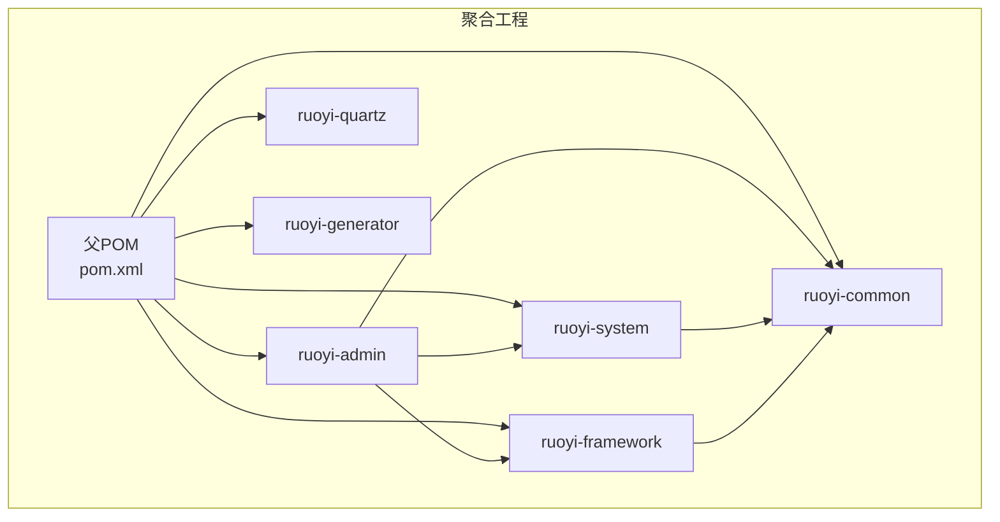
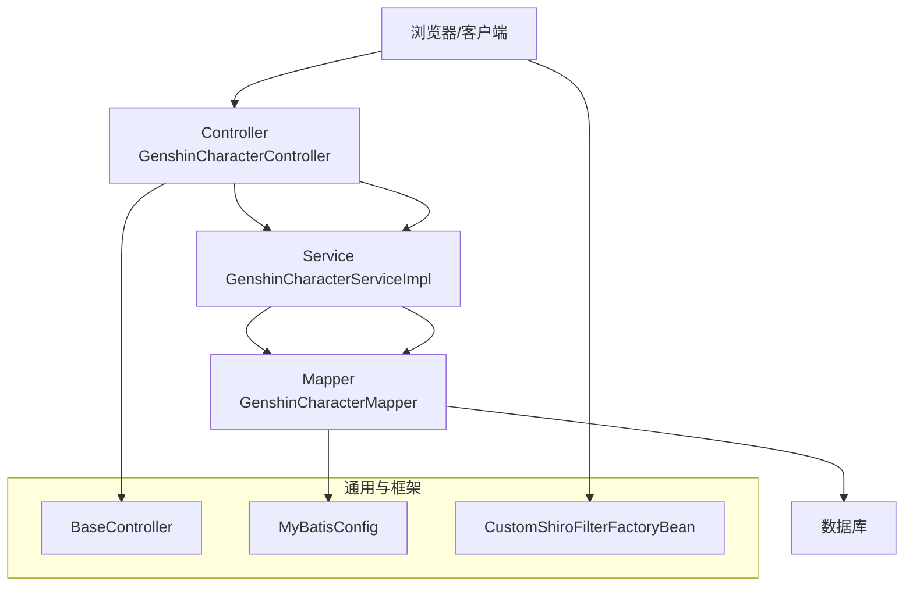
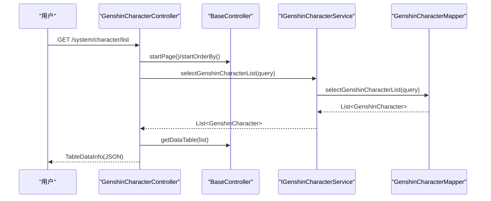
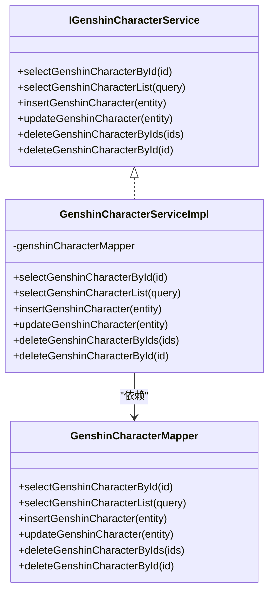
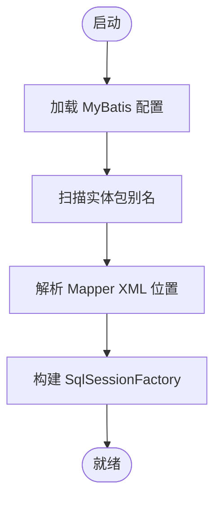
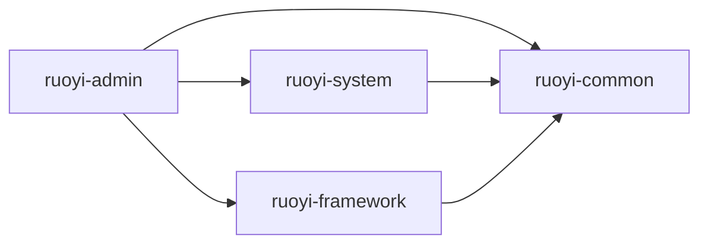

# 系统架构设计

<cite>
**本文引用的文件**
- [pom.xml](file://pom.xml)
- [GENSHIN_MODULE_GUIDE.md](file://GENSHIN_MODULE_GUIDE.md)
- [RuoYiApplication.java](file://ruoyi-admin/src/main/java/com/ruoyi/RuoYiApplication.java)
- [GenshinCharacter.java](file://ruoyi-system/src/main/java/com/ruoyi/system/domain/GenshinCharacter.java)
- [GenshinCharacterMapper.java](file://ruoyi-system/src/main/java/com/ruoyi/system/mapper/GenshinCharacterMapper.java)
- [GenshinCharacterController.java](file://ruoyi-admin/src/main/java/com/ruoyi/web/controller/system/GenshinCharacterController.java)
- [GenshinCharacterServiceImpl.java](file://ruoyi-system/src/main/java/com/ruoyi/system/service/impl/GenshinCharacterServiceImpl.java)
- [BaseController.java](file://ruoyi-common/src/main/java/com/ruoyi/common/core/controller/BaseController.java)
- [MyBatisConfig.java](file://ruoyi-framework/src/main/java/com/ruoyi/framework/config/MyBatisConfig.java)
- [application.yml](file://ruoyi-admin/src/main/resources/application.yml)
- [CustomShiroFilterFactoryBean.java](file://ruoyi-framework/src/main/java/com/ruoyi/framework/shiro/web/CustomShiroFilterFactoryBean.java)
</cite>

## 目录
1. [引言](#引言)
2. [项目结构](#项目结构)
3. [核心组件](#核心组件)
4. [架构总览](#架构总览)
5. [详细组件分析](#详细组件分析)
6. [依赖分析](#依赖分析)
7. [性能考虑](#性能考虑)
8. [故障排查指南](#故障排查指南)
9. [结论](#结论)
10. [附录](#附录)

## 引言
本设计文档面向“原神攻略系统”，基于 Spring Boot 的分层架构与模块化理念，围绕 ruoyi-admin、ruoyi-system、ruoyi-common、ruoyi-framework 等模块，系统化阐述表现层、业务逻辑层、数据访问层的职责划分与交互关系；详解 MVC 架构模式在项目中的落地，明确 Controller、Service、Mapper 三层之间的依赖与协作；给出技术决策、架构约束与设计原则，并通过架构图与组件关系图帮助开发者快速理解系统整体设计与扩展点。

## 项目结构
项目采用多模块聚合工程，父 POM 统一管理版本与依赖，模块按职责拆分：
- ruoyi-admin：Web 展示层入口，承载前端模板与控制器，负责用户交互与视图渲染。
- ruoyi-system：业务域模块，包含领域模型、Mapper 接口、Service 接口与实现，封装业务逻辑。
- ruoyi-common：通用工具与基础能力，提供统一的控制器基类、实体基类、分页与工具类等。
- ruoyi-framework：框架支撑模块，提供 MyBatis 配置、Shiro 安全配置、拦截器、异步管理等基础设施。
- ruoyi-quartz、ruoyi-generator：可选扩展模块，分别用于定时任务与代码生成。

图表来源
- [pom.xml:208-215](file://pom.xml#L208-L215)

章节来源
- [pom.xml:14-34](file://pom.xml#L14-L34)
- [pom.xml:208-215](file://pom.xml#L208-L215)

## 核心组件
- 表现层（Controller）
  - 位于 ruoyi-admin，负责接收请求、参数绑定、权限校验、调用 Service 并返回视图或 JSON。
  - 示例：GenshinCharacterController 提供角色管理的增删改查与导出、培养路线图展示等。
- 业务逻辑层（Service）
  - 位于 ruoyi-system，封装业务规则与流程，协调多个 Mapper 完成复杂操作。
  - 示例：GenshinCharacterServiceImpl 实现角色数据的查询、新增、更新、批量删除。
- 数据访问层（Mapper/DAO）
  - 位于 ruoyi-system，定义数据访问接口，配合 XML 映射文件执行 SQL。
  - 示例：GenshinCharacterMapper 定义按主键/条件查询、插入、更新、删除等方法。
- 通用层（Common）
  - 提供 BaseController、分页工具、AjaxResult、实体基类等，统一处理请求参数、分页、响应格式。
- 框架层（Framework）
  - 提供 MyBatis 配置、Shiro 安全配置、自定义过滤器、异常处理等基础设施。

章节来源
- [GenshinCharacterController.java:38-198](file://ruoyi-admin/src/main/java/com/ruoyi/web/controller/system/GenshinCharacterController.java#L38-L198)
- [GenshinCharacterServiceImpl.java:17-95](file://ruoyi-system/src/main/java/com/ruoyi/system/service/impl/GenshinCharacterServiceImpl.java#L17-L95)
- [GenshinCharacterMapper.java:12-62](file://ruoyi-system/src/main/java/com/ruoyi/system/mapper/GenshinCharacterMapper.java#L12-L62)
- [BaseController.java:33-230](file://ruoyi-common/src/main/java/com/ruoyi/common/core/controller/BaseController.java#L33-L230)
- [MyBatisConfig.java:32-132](file://ruoyi-framework/src/main/java/com/ruoyi/framework/config/MyBatisConfig.java#L32-L132)

## 架构总览
系统采用经典的三层架构与 MVC 模式：
- 表现层（Controller）：接收 HTTP 请求，调用 Service，组装响应（视图或 AjaxResult）。
- 业务层（Service）：编排领域模型与数据访问，处理业务规则与事务边界。
- 数据层（Mapper）：执行 SQL，映射结果集到领域对象。
- 通用与框架层：统一响应、分页、安全、ORM 配置等横切能力下沉。

图表来源
- [GenshinCharacterController.java:38-198](file://ruoyi-admin/src/main/java/com/ruoyi/web/controller/system/GenshinCharacterController.java#L38-L198)
- [GenshinCharacterServiceImpl.java:17-95](file://ruoyi-system/src/main/java/com/ruoyi/system/service/impl/GenshinCharacterServiceImpl.java#L17-L95)
- [GenshinCharacterMapper.java:12-62](file://ruoyi-system/src/main/java/com/ruoyi/system/mapper/GenshinCharacterMapper.java#L12-L62)
- [BaseController.java:33-230](file://ruoyi-common/src/main/java/com/ruoyi/common/core/controller/BaseController.java#L33-L230)
- [MyBatisConfig.java:32-132](file://ruoyi-framework/src/main/java/com/ruoyi/framework/config/MyBatisConfig.java#L32-L132)
- [CustomShiroFilterFactoryBean.java:21-85](file://ruoyi-framework/src/main/java/com/ruoyi/framework/shiro/web/CustomShiroFilterFactoryBean.java#L21-L85)

## 详细组件分析

### 表现层（Controller）分析
- 职责
  - 路由映射与权限控制：使用注解进行权限校验与路由分发。
  - 参数处理与分页：结合 BaseController 提供的分页与排序能力。
  - 响应组装：返回视图路径或 AjaxResult，支持 Excel 导出。
- 关键交互
  - Controller 通过 @Autowired 注入 Service 接口，不依赖具体实现。
  - 支持多模块联动：在角色详情页聚合推荐武器、圣遗物、队伍、天赋材料等数据。

图表来源
- [GenshinCharacterController.java:69-77](file://ruoyi-admin/src/main/java/com/ruoyi/web/controller/system/GenshinCharacterController.java#L69-L77)
- [BaseController.java:57-81](file://ruoyi-common/src/main/java/com/ruoyi/common/core/controller/BaseController.java#L57-L81)
- [GenshinCharacterServiceImpl.java:42-44](file://ruoyi-system/src/main/java/com/ruoyi/system/service/impl/GenshinCharacterServiceImpl.java#L42-L44)
- [GenshinCharacterMapper.java:28-28](file://ruoyi-system/src/main/java/com/ruoyi/system/mapper/GenshinCharacterMapper.java#L28-L28)

章节来源
- [GenshinCharacterController.java:38-198](file://ruoyi-admin/src/main/java/com/ruoyi/web/controller/system/GenshinCharacterController.java#L38-L198)
- [BaseController.java:33-230](file://ruoyi-common/src/main/java/com/ruoyi/common/core/controller/BaseController.java#L33-L230)

### 业务逻辑层（Service）分析
- 职责
  - 封装业务规则与流程，协调多个 Mapper 完成复杂操作。
  - 对外暴露接口，内部委派给 Mapper 执行数据访问。
- 设计要点
  - Service 以接口与实现分离，便于替换与测试。
  - 通过 @Service 注解被 Spring 管理，依赖注入 Mapper。

图表来源
- [GenshinCharacterServiceImpl.java:17-95](file://ruoyi-system/src/main/java/com/ruoyi/system/service/impl/GenshinCharacterServiceImpl.java#L17-L95)
- [GenshinCharacterMapper.java:12-62](file://ruoyi-system/src/main/java/com/ruoyi/system/mapper/GenshinCharacterMapper.java#L12-L62)

章节来源
- [GenshinCharacterServiceImpl.java:17-95](file://ruoyi-system/src/main/java/com/ruoyi/system/service/impl/GenshinCharacterServiceImpl.java#L17-L95)

### 数据访问层（Mapper）分析
- 职责
  - 定义数据访问方法，配合 XML 映射文件执行 SQL。
  - 通过 MyBatis 配置扫描包与映射文件，实现 ORM。
- 配置要点
  - MyBatisConfig 动态扫描 typeAliasesPackage 与 mapperLocations，确保实体与映射文件被正确加载。

图表来源
- [MyBatisConfig.java:94-132](file://ruoyi-framework/src/main/java/com/ruoyi/framework/config/MyBatisConfig.java#L94-L132)

章节来源
- [MyBatisConfig.java:32-132](file://ruoyi-framework/src/main/java/com/ruoyi/framework/config/MyBatisConfig.java#L32-L132)

### 安全与权限控制
- Shiro 集成
  - 自定义 Shiro 过滤链工厂，解决资源中文路径问题与非法请求过滤。
  - 配合注解 @RequiresPermissions 在 Controller 上进行权限校验。
- 配置参考
  - application.yml 中包含 Shiro 登录地址、未授权地址、验证码开关、会话与记住我等配置项。

章节来源
- [CustomShiroFilterFactoryBean.java:21-85](file://ruoyi-framework/src/main/java/com/ruoyi/framework/shiro/web/CustomShiroFilterFactoryBean.java#L21-L85)
- [application.yml:86-124](file://ruoyi-admin/src/main/resources/application.yml#L86-L124)

## 依赖分析
- 模块间依赖
  - ruoyi-admin 依赖 ruoyi-system、ruoyi-common、ruoyi-framework。
  - ruoyi-system 依赖 ruoyi-common。
  - ruoyi-framework 依赖 ruoyi-common。
- 运行入口
  - RuoYiApplication 作为 Spring Boot 启动类，排除数据源自动装配，交由框架模块按需配置。

图表来源
- [pom.xml:208-215](file://pom.xml#L208-L215)
- [RuoYiApplication.java:12-12](file://ruoyi-admin/src/main/java/com/ruoyi/RuoYiApplication.java#L12-L12)

章节来源
- [pom.xml:208-215](file://pom.xml#L208-L215)
- [RuoYiApplication.java:12-12](file://ruoyi-admin/src/main/java/com/ruoyi/RuoYiApplication.java#L12-L12)

## 性能考虑
- 分页与排序
  - BaseController 提供分页与排序能力，结合 PageHelper 与 SQL 注入防护工具，避免 N+1 与 SQL 注入风险。
- ORM 与缓存
  - MyBatisConfig 统一配置 typeAliasesPackage 与 mapperLocations，减少扫描成本；可结合 EhCache 或 Redis 实现二级缓存（需在 ruoyi-framework 中扩展）。
- 并发与会话
  - Shiro 配置支持会话同步、并发会话限制与踢出策略，保障高并发下的会话一致性。

章节来源
- [BaseController.java:57-81](file://ruoyi-common/src/main/java/com/ruoyi/common/core/controller/BaseController.java#L57-L81)
- [MyBatisConfig.java:116-132](file://ruoyi-framework/src/main/java/com/ruoyi/framework/config/MyBatisConfig.java#L116-L132)
- [application.yml:110-124](file://ruoyi-admin/src/main/resources/application.yml#L110-L124)

## 故障排查指南
- 启动失败
  - 确认排除数据源自动装配后，框架模块按需提供数据源配置。
- 404/权限不足
  - 检查 Controller 路由映射与权限注解；确认前端模板路径与菜单配置。
- 数据库连接
  - 核对 application.yml 中数据库配置与 SQL 脚本执行情况。
- MyBatis 映射
  - 确认实体包扫描与 Mapper XML 路径配置正确，避免类型别名或映射文件未加载。

章节来源
- [RuoYiApplication.java:12-12](file://ruoyi-admin/src/main/java/com/ruoyi/RuoYiApplication.java#L12-L12)
- [GENSHIN_MODULE_GUIDE.md:146-167](file://GENSHIN_MODULE_GUIDE.md#L146-L167)
- [application.yml:71-78](file://ruoyi-admin/src/main/resources/application.yml#L71-L78)

## 结论
本系统以 Spring Boot 为基础，采用模块化与分层架构，清晰划分表现层、业务层、数据层职责，结合 ruoyi-common 与 ruoyi-framework 提供的通用能力与基础设施，形成可扩展、易维护的原神攻略系统。通过 Controller-Service-Mapper 的依赖关系与 MyBatis、Shiro 等配置，实现了从请求到数据持久化的完整闭环。建议后续在缓存、监控与分布式场景下进一步增强框架层能力，以满足更高性能与可用性需求。

## 附录
- 运行与集成指南
  - 参考模块集成与运行指南，完成 Controller、Domain、Mapper、Service、XML、前端模板的复制与数据库初始化。
- 配置参考
  - application.yml 中包含服务器端口、MyBatis、PageHelper、Shiro、Swagger 等关键配置项。

章节来源
- [GENSHIN_MODULE_GUIDE.md:19-143](file://GENSHIN_MODULE_GUIDE.md#L19-L143)
- [application.yml:16-154](file://ruoyi-admin/src/main/resources/application.yml#L16-L154)