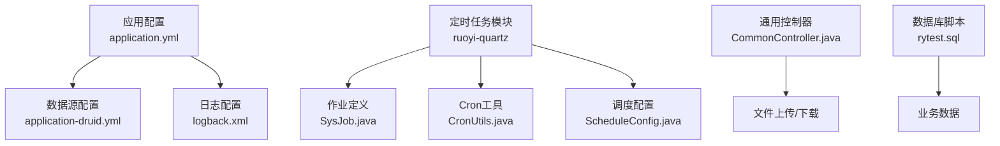
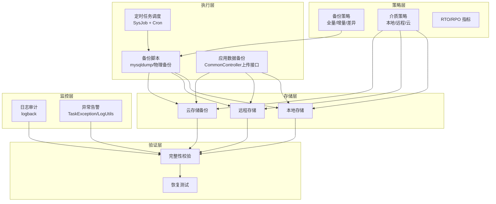
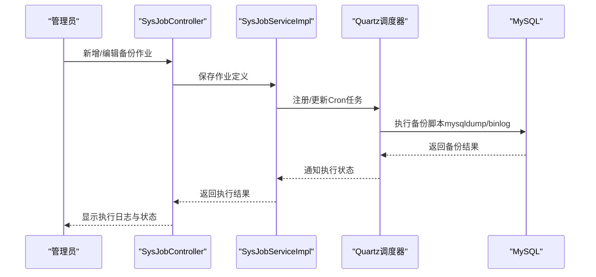
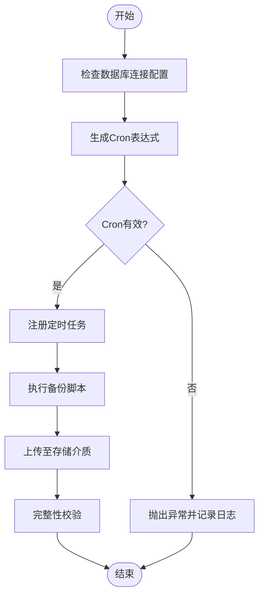
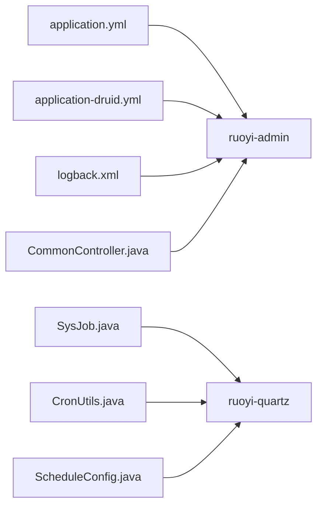

# 备份恢复

<cite>
**本文引用的文件**
- [application.yml](file://GenShin/RuoYi-master/ruoyi-admin/src/main/resources/application.yml)
- [application-druid.yml](file://GenShin/RuoYi-master/ruoyi-admin/src/main/resources/application-druid.yml)
- [logback.xml](file://GenShin/RuoYi-master/ruoyi-admin/src/main/resources/logback.xml)
- [CommonController.java](file://GenShin/RuoYi-master/ruoyi-admin/src/main/java/com/ruoyi/web/controller/common/CommonController.java)
- [SysJob.java](file://GenShin/RuoYi-master/ruoyi-quartz/src/main/java/com/ruoyi/quartz/domain/SysJob.java)
- [CronUtils.java](file://GenShin/RuoYi-master/ruoyi-quartz/src/main/java/com/ruoyi/quartz/util/CronUtils.java)
- [ScheduleConfig.java](file://GenShin/RuoYi-master/ruoyi-quartz/src/main/java/com/ruoyi/quartz/config/ScheduleConfig.java)
- [SysJobServiceImpl.java](file://GenShin/RuoYi-master/ruoyi-quartz/src/main/java/com/ruoyi/quartz/service/impl/SysJobServiceImpl.java)
- [SysJobController.java](file://GenShin/RuoYi-master/ruoyi-quartz/src/main/java/com/ruoyi/quartz/controller/SysJobController.java)
- [rytest.sql](file://GenShin/RuoYi-master/sql/rytest.sql)
- [迁移指南.md](file://GenShin/RuoYi-master/迁移指南.md)
- [TaskException.java](file://GenShin/RuoYi-master/ruoyi-common/src/main/java/com/ruoyi/common/exception/job/TaskException.java)
- [LogUtils.java](file://GenShin/RuoYi-master/ruoyi-common/src/main/java/com/ruoyi/common/utils/LogUtils.java)
- [CacheController.java](file://GenShin/RuoYi-master/ruoyi-admin/src/main/java/com/ruoyi/web/controller/monitor/CacheController.java)
- [server.html](file://GenShin/RuoYi-master/ruoyi-admin/src/main/resources/templates/monitor/server/server.html)
- [cron.js](file://GenShin/RuoYi-master/ruoyi-admin/src/main/resources/static/js/cron.js)
</cite>

## 目录
1. [简介](#简介)
2. [项目结构](#项目结构)
3. [核心组件](#核心组件)
4. [架构总览](#架构总览)
5. [详细组件分析](#详细组件分析)
6. [依赖分析](#依赖分析)
7. [性能考虑](#性能考虑)
8. [故障排查指南](#故障排查指南)
9. [结论](#结论)
10. [附录](#附录)

## 简介
本文件面向“原神攻略系统”的备份与恢复，围绕数据库备份策略（全量/增量）、备份脚本与自动化调度、应用代码与配置文件备份方案、备份介质与存储策略、备份验证与恢复测试流程、灾难恢复计划（含RTO/RPO）、备份监控与告警、以及备份失败应急处置等方面，提供系统化、可落地的实践指导。文档结合仓库现有配置与代码，给出可操作的实施路径。

## 项目结构
- 应用配置集中在 ruoyi-admin 的 resources 目录，包含数据库连接、文件上传路径、日志级别等关键项。
- 定时任务框架 ruoyi-quartz 提供作业调度能力，可用于备份任务的自动化编排。
- 日志系统采用 logback，便于备份/恢复过程中的审计与追踪。
- 文件上传与下载接口位于 ruoyi-admin 的通用控制器中，用于应用数据的备份与恢复。

图表来源
- [application.yml:1-154](file://GenShin/RuoYi-master/ruoyi-admin/src/main/resources/application.yml#L1-L154)
- [application-druid.yml:1-61](file://GenShin/RuoYi-master/ruoyi-admin/src/main/resources/application-druid.yml#L1-L61)
- [logback.xml:1-96](file://GenShin/RuoYi-master/ruoyi-admin/src/main/resources/logback.xml#L1-L96)
- [SysJob.java:1-44](file://GenShin/RuoYi-master/ruoyi-quartz/src/main/java/com/ruoyi/quartz/domain/SysJob.java#L1-L44)
- [CronUtils.java:1-95](file://GenShin/RuoYi-master/ruoyi-quartz/src/main/java/com/ruoyi/quartz/util/CronUtils.java#L1-L95)
- [ScheduleConfig.java:1-58](file://GenShin/RuoYi-master/ruoyi-quartz/src/main/java/com/ruoyi/quartz/config/ScheduleConfig.java#L1-L58)
- [CommonController.java:1-165](file://GenShin/RuoYi-master/ruoyi-admin/src/main/java/com/ruoyi/web/controller/common/CommonController.java#L1-L165)
- [rytest.sql:1-321](file://GenShin/RuoYi-master/sql/rytest.sql#L1-L321)

章节来源
- [application.yml:1-154](file://GenShin/RuoYi-master/ruoyi-admin/src/main/resources/application.yml#L1-L154)
- [application-druid.yml:1-61](file://GenShin/RuoYi-master/ruoyi-admin/src/main/resources/application-druid.yml#L1-L61)
- [logback.xml:1-96](file://GenShin/RuoYi-master/ruoyi-admin/src/main/resources/logback.xml#L1-L96)
- [CommonController.java:1-165](file://GenShin/RuoYi-master/ruoyi-admin/src/main/java/com/ruoyi/web/controller/common/CommonController.java#L1-L165)

## 核心组件
- 数据库连接与池化：通过 druid 数据源配置，明确 JDBC URL、用户名、密码、连接池参数等，为备份脚本提供统一的数据源入口。
- 日志系统：logback 将系统日志、错误日志、用户行为日志按天滚动归档，便于备份完整性审计与问题定位。
- 文件上传与下载：通用控制器提供上传/下载接口，用于应用数据（如图片、文档）的备份与恢复。
- 定时任务：SysJob 作业模型、Cron 工具与调度配置，支撑备份任务的自动化执行与校验。

章节来源
- [application-druid.yml:1-61](file://GenShin/RuoYi-master/ruoyi-admin/src/main/resources/application-druid.yml#L1-L61)
- [logback.xml:1-96](file://GenShin/RuoYi-master/ruoyi-admin/src/main/resources/logback.xml#L1-L96)
- [CommonController.java:70-135](file://GenShin/RuoYi-master/ruoyi-admin/src/main/java/com/ruoyi/web/controller/common/CommonController.java#L70-L135)
- [SysJob.java:1-44](file://GenShin/RuoYi-master/ruoyi-quartz/src/main/java/com/ruoyi/quartz/domain/SysJob.java#L1-L44)
- [CronUtils.java:1-95](file://GenShin/RuoYi-master/ruoyi-quartz/src/main/java/com/ruoyi/quartz/util/CronUtils.java#L1-L95)
- [ScheduleConfig.java:1-58](file://GenShin/RuoYi-master/ruoyi-quartz/src/main/java/com/ruoyi/quartz/config/ScheduleConfig.java#L1-L58)

## 架构总览
备份与恢复体系由“策略层（策略与规范）—执行层（脚本与调度）—存储层（本地/远程/云）—验证层（校验与测试）—监控层（日志与告警）”构成，贯穿数据库与应用数据两条主线。

## 详细组件分析

### 数据库备份策略与实现
- 全量备份
  - 使用 mysqldump 导出数据库结构与数据，结合仓库提供的 SQL 脚本位置，可作为全量备份的参考模板。
  - 关键参数建议：启用单事务导出、压缩传输、忽略触发器/事件等，确保一致性与效率。
  - 参考文件：[rytest.sql:1-321](file://GenShin/RuoYi-master/sql/rytest.sql#L1-L321)
- 增量备份
  - 基于 binlog 的增量备份：开启 binlog，定期归档并清理过期日志；在恢复时按时间点精确还原。
  - 结合定时任务，周期性导出 binlog 并上传至远程/云存储。
- 自动化调度
  - 使用 SysJob 作业模型定义备份任务，Cron 表达式由 CronUtils 校验与生成，ScheduleConfig 支持集群模式（注释部分可启用）。
  - 通过 SysJobController 提供作业的增删改查与执行状态管理。

图表来源
- [SysJobController.java:1-34](file://GenShin/RuoYi-master/ruoyi-quartz/src/main/java/com/ruoyi/quartz/controller/SysJobController.java#L1-L34)
- [SysJobServiceImpl.java:1-42](file://GenShin/RuoYi-master/ruoyi-quartz/src/main/java/com/ruoyi/quartz/service/impl/SysJobServiceImpl.java#L1-L42)
- [SysJob.java:1-44](file://GenShin/RuoYi-master/ruoyi-quartz/src/main/java/com/ruoyi/quartz/domain/SysJob.java#L1-L44)
- [CronUtils.java:1-95](file://GenShin/RuoYi-master/ruoyi-quartz/src/main/java/com/ruoyi/quartz/util/CronUtils.java#L1-L95)
- [ScheduleConfig.java:1-58](file://GenShin/RuoYi-master/ruoyi-quartz/src/main/java/com/ruoyi/quartz/config/ScheduleConfig.java#L1-L58)

章节来源
- [SysJob.java:1-44](file://GenShin/RuoYi-master/ruoyi-quartz/src/main/java/com/ruoyi/quartz/domain/SysJob.java#L1-L44)
- [CronUtils.java:1-95](file://GenShin/RuoYi-master/ruoyi-quartz/src/main/java/com/ruoyi/quartz/util/CronUtils.java#L1-L95)
- [ScheduleConfig.java:1-58](file://GenShin/RuoYi-master/ruoyi-quartz/src/main/java/com/ruoyi/quartz/config/ScheduleConfig.java#L1-L58)
- [SysJobServiceImpl.java:1-42](file://GenShin/RuoYi-master/ruoyi-quartz/src/main/java/com/ruoyi/quartz/service/impl/SysJobServiceImpl.java#L1-L42)
- [SysJobController.java:1-34](file://GenShin/RuoYi-master/ruoyi-quartz/src/main/java/com/ruoyi/quartz/controller/SysJobController.java#L1-L34)

### 备份脚本与自动化调度
- 备份脚本建议
  - 全量备份：mysqldump --single-transaction --routines --triggers --set-gtid-purged=OFF --master-data=2
  - 增量备份：binlog 归档 + 周期性压缩上传
  - 应用数据备份：通过 CommonController 的上传接口将静态资源打包上传
- 调度与校验
  - Cron 表达式由 CronUtils 校验，SysJobServiceImpl 启动时清理并重建任务
  - 通过 logback 输出执行日志，便于审计与问题定位

图表来源
- [CronUtils.java:20-48](file://GenShin/RuoYi-master/ruoyi-quartz/src/main/java/com/ruoyi/quartz/util/CronUtils.java#L20-L48)
- [SysJobServiceImpl.java:35-42](file://GenShin/RuoYi-master/ruoyi-quartz/src/main/java/com/ruoyi/quartz/service/impl/SysJobServiceImpl.java#L35-L42)
- [application-druid.yml:1-61](file://GenShin/RuoYi-master/ruoyi-admin/src/main/resources/application-druid.yml#L1-L61)

章节来源
- [CronUtils.java:1-95](file://GenShin/RuoYi-master/ruoyi-quartz/src/main/java/com/ruoyi/quartz/util/CronUtils.java#L1-L95)
- [SysJobServiceImpl.java:1-42](file://GenShin/RuoYi-master/ruoyi-quartz/src/main/java/com/ruoyi/quartz/service/impl/SysJobServiceImpl.java#L1-L42)
- [application-druid.yml:1-61](file://GenShin/RuoYi-master/ruoyi-admin/src/main/resources/application-druid.yml#L1-L61)

### 应用代码与配置文件备份方案
- 版本控制
  - 使用 Git 对代码与配置进行版本管理，迁移指南明确了文件迁移路径，便于回溯与恢复
- 配置文件备份
  - application.yml、application-druid.yml、logback.xml 等关键配置集中存放，定期打包备份
- 静态资源备份
  - 通过 CommonController 的上传接口将静态资源打包上传，便于跨环境恢复

章节来源
- [迁移指南.md:1-55](file://GenShin/RuoYi-master/迁移指南.md#L1-L55)
- [application.yml:1-154](file://GenShin/RuoYi-master/ruoyi-admin/src/main/resources/application.yml#L1-L154)
- [application-druid.yml:1-61](file://GenShin/RuoYi-master/ruoyi-admin/src/main/resources/application-druid.yml#L1-L61)
- [logback.xml:1-96](file://GenShin/RuoYi-master/ruoyi-admin/src/main/resources/logback.xml#L1-L96)
- [CommonController.java:70-135](file://GenShin/RuoYi-master/ruoyi-admin/src/main/java/com/ruoyi/web/controller/common/CommonController.java#L70-L135)

### 备份介质与存储策略
- 本地备份：快速恢复、低延迟，适合短期保留与日常验证
- 远程备份：异地容灾，建议加密传输与存储
- 云存储备份：弹性扩展、高可用，建议启用版本控制与生命周期管理

章节来源
- [application.yml:10-14](file://GenShin/RuoYi-master/ruoyi-admin/src/main/resources/application.yml#L10-L14)

### 备份验证与恢复测试
- 完整性校验
  - 校验备份文件大小、时间戳、哈希值；核对关键表记录数与关键字段
- 恢复测试
  - 在隔离环境中执行恢复演练，验证业务功能可用性与数据一致性
- 日志审计
  - 通过 logback 的滚动日志与自定义日志工具，记录备份/恢复全过程

章节来源
- [logback.xml:1-96](file://GenShin/RuoYi-master/ruoyi-admin/src/main/resources/logback.xml#L1-L96)
- [LogUtils.java:40-77](file://GenShin/RuoYi-master/ruoyi-common/src/main/java/com/ruoyi/common/utils/LogUtils.java#L40-L77)

### 灾难恢复计划（RTO/RPO）
- RTO（恢复时间目标）：根据业务容忍度设定，如数据库 RTO 为数小时，应用数据 RTO 为数天
- RPO（恢复点目标）：数据库 RPO 为分钟级（binlog），应用数据 RPO 为天级
- 恢复优先级：业务系统 > 数据库 > 应用数据 > 配置文件
- 故障场景：数据库实例故障、存储介质损坏、误操作删除、网络中断

章节来源
- [application-druid.yml:1-61](file://GenShin/RuoYi-master/ruoyi-admin/src/main/resources/application-druid.yml#L1-L61)
- [application.yml:1-154](file://GenShin/RuoYi-master/ruoyi-admin/src/main/resources/application.yml#L1-L154)

### 备份监控与告警
- 日志监控：logback 按天滚动，ERROR 级别单独归档，便于异常告警
- 异常处理：TaskException 统一封装任务异常，LogUtils 记录异常堆栈
- 作业监控：通过 CacheController 与 server.html 展示系统健康状态，辅助判断备份任务执行环境

章节来源
- [logback.xml:1-96](file://GenShin/RuoYi-master/ruoyi-admin/src/main/resources/logback.xml#L1-L96)
- [TaskException.java:1-34](file://GenShin/RuoYi-master/ruoyi-common/src/main/java/com/ruoyi/common/exception/job/TaskException.java#L1-L34)
- [LogUtils.java:40-77](file://GenShin/RuoYi-master/ruoyi-common/src/main/java/com/ruoyi/common/utils/LogUtils.java#L40-L77)
- [CacheController.java:1-41](file://GenShin/RuoYi-master/ruoyi-admin/src/main/java/com/ruoyi/web/controller/monitor/CacheController.java#L1-L41)
- [server.html:1-100](file://GenShin/RuoYi-master/ruoyi-admin/src/main/resources/templates/monitor/server/server.html#L1-L100)

### 备份失败应急处理
- 快速止损：暂停相关作业，检查数据库连接与存储空间
- 重试与补偿：对失败的备份任务进行重试与人工补偿
- 降级恢复：优先恢复关键业务链路，再逐步恢复其他模块
- 事后复盘：通过日志与异常信息定位原因，完善策略与流程

章节来源
- [TaskException.java:1-34](file://GenShin/RuoYi-master/ruoyi-common/src/main/java/com/ruoyi/common/exception/job/TaskException.java#L1-L34)
- [LogUtils.java:40-77](file://GenShin/RuoYi-master/ruoyi-common/src/main/java/com/ruoyi/common/utils/LogUtils.java#L40-L77)

## 依赖分析
- 数据源依赖：ruoyi-admin 依赖 application-druid.yml 提供的 JDBC URL、用户名、密码与池化参数
- 日志依赖：ruoyi-admin 依赖 logback.xml 的滚动策略与日志级别
- 作业依赖：ruoyi-quartz 依赖 SysJob 与 CronUtils，ScheduleConfig 提供调度配置
- 文件依赖：CommonController 依赖 RuoYiConfig 的上传/下载路径

图表来源
- [application.yml:1-154](file://GenShin/RuoYi-master/ruoyi-admin/src/main/resources/application.yml#L1-L154)
- [application-druid.yml:1-61](file://GenShin/RuoYi-master/ruoyi-admin/src/main/resources/application-druid.yml#L1-L61)
- [logback.xml:1-96](file://GenShin/RuoYi-master/ruoyi-admin/src/main/resources/logback.xml#L1-L96)
- [SysJob.java:1-44](file://GenShin/RuoYi-master/ruoyi-quartz/src/main/java/com/ruoyi/quartz/domain/SysJob.java#L1-L44)
- [CronUtils.java:1-95](file://GenShin/RuoYi-master/ruoyi-quartz/src/main/java/com/ruoyi/quartz/util/CronUtils.java#L1-L95)
- [ScheduleConfig.java:1-58](file://GenShin/RuoYi-master/ruoyi-quartz/src/main/java/com/ruoyi/quartz/config/ScheduleConfig.java#L1-L58)
- [CommonController.java:1-165](file://GenShin/RuoYi-master/ruoyi-admin/src/main/java/com/ruoyi/web/controller/common/CommonController.java#L1-L165)

章节来源
- [application.yml:1-154](file://GenShin/RuoYi-master/ruoyi-admin/src/main/resources/application.yml#L1-L154)
- [application-druid.yml:1-61](file://GenShin/RuoYi-master/ruoyi-admin/src/main/resources/application-druid.yml#L1-L61)
- [logback.xml:1-96](file://GenShin/RuoYi-master/ruoyi-admin/src/main/resources/logback.xml#L1-L96)
- [SysJob.java:1-44](file://GenShin/RuoYi-master/ruoyi-quartz/src/main/java/com/ruoyi/quartz/domain/SysJob.java#L1-L44)
- [CronUtils.java:1-95](file://GenShin/RuoYi-master/ruoyi-quartz/src/main/java/com/ruoyi/quartz/util/CronUtils.java#L1-L95)
- [ScheduleConfig.java:1-58](file://GenShin/RuoYi-master/ruoyi-quartz/src/main/java/com/ruoyi/quartz/config/ScheduleConfig.java#L1-L58)
- [CommonController.java:1-165](file://GenShin/RuoYi-master/ruoyi-admin/src/main/java/com/ruoyi/web/controller/common/CommonController.java#L1-L165)

## 性能考虑
- 备份窗口与资源占用：合理安排 Cron 执行时间，避免与业务高峰期冲突
- 存储 I/O：本地/远程/云存储的吞吐能力与延迟需纳入评估
- 日志写入：logback 的滚动策略与文件系统性能需匹配业务规模

## 故障排查指南
- 数据库连接失败：检查 application-druid.yml 中的 JDBC URL、用户名、密码与连接池参数
- 备份任务异常：查看 logback 滚动日志与 TaskException 抛出的错误码
- 作业不可用：确认 SysJobServiceImpl 的启动逻辑与 Quartz 调度器状态
- 文件上传失败：检查 RuoYiConfig 的上传路径与权限，以及 CommonController 的异常处理

章节来源
- [application-druid.yml:1-61](file://GenShin/RuoYi-master/ruoyi-admin/src/main/resources/application-druid.yml#L1-L61)
- [logback.xml:1-96](file://GenShin/RuoYi-master/ruoyi-admin/src/main/resources/logback.xml#L1-L96)
- [TaskException.java:1-34](file://GenShin/RuoYi-master/ruoyi-common/src/main/java/com/ruoyi/common/exception/job/TaskException.java#L1-L34)
- [SysJobServiceImpl.java:1-42](file://GenShin/RuoYi-master/ruoyi-quartz/src/main/java/com/ruoyi/quartz/service/impl/SysJobServiceImpl.java#L1-L42)
- [CommonController.java:1-165](file://GenShin/RuoYi-master/ruoyi-admin/src/main/java/com/ruoyi/web/controller/common/CommonController.java#L1-L165)

## 结论
通过将数据库与应用数据的备份策略、自动化调度、存储介质、验证测试、监控告警与应急处理形成闭环，原神攻略系统可在保障业务连续性的同时，实现可控、可验证、可恢复的备份体系。建议结合实际业务负载与合规要求，细化 RTO/RPO 指标并持续优化备份流程。

## 附录
- Cron 表达式可视化与生成：前端 cron.js 提供交互式界面，便于生成合法表达式
- 服务器监控：server.html 展示 CPU/内存使用率，辅助备份执行环境评估

章节来源
- [cron.js:318-926](file://GenShin/RuoYi-master/ruoyi-admin/src/main/resources/static/js/cron.js#L318-L926)
- [server.html:1-100](file://GenShin/RuoYi-master/ruoyi-admin/src/main/resources/templates/monitor/server/server.html#L1-L100)