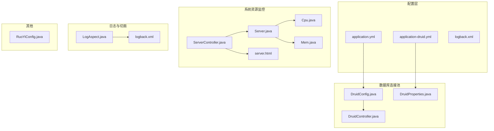
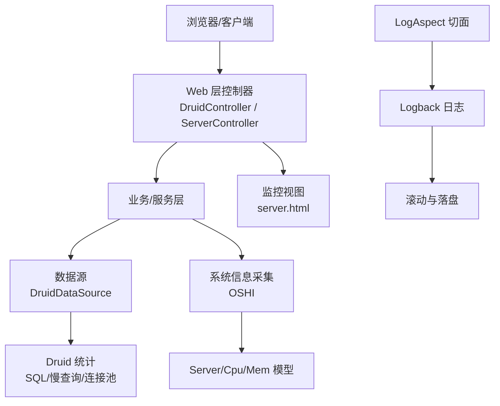
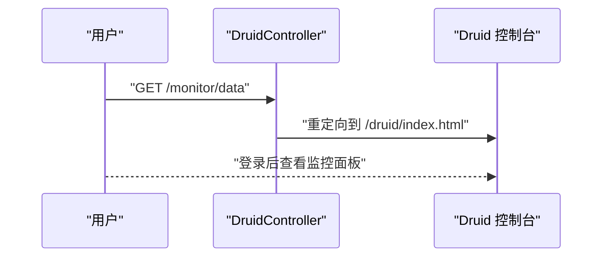
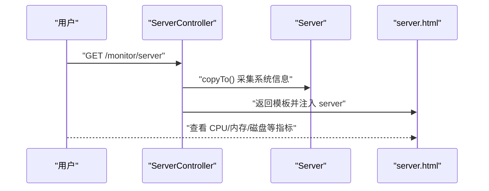
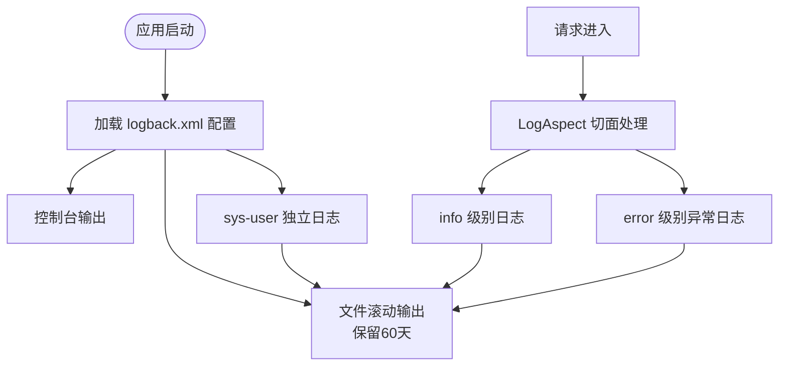
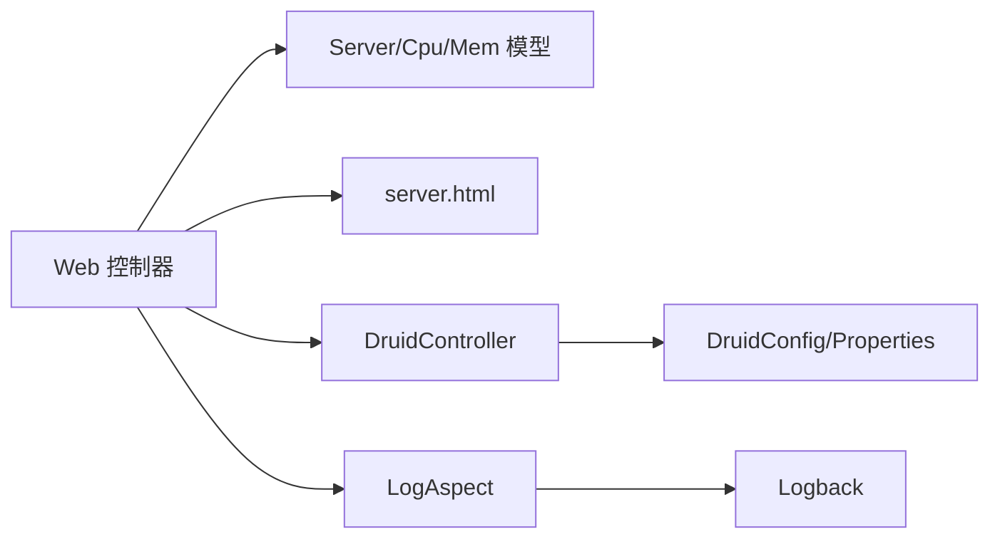

# 性能监控

<cite>
**本文引用的文件**
- [application.yml](file://ruoyi-admin/src/main/resources/application.yml)
- [application-druid.yml](file://ruoyi-admin/src/main/resources/application-druid.yml)
- [logback.xml](file://ruoyi-admin/src/main/resources/logback.xml)
- [DruidConfig.java](file://ruoyi-framework/src/main/java/com/ruoyi/framework/config/DruidConfig.java)
- [DruidProperties.java](file://ruoyi-framework/src/main/java/com/ruoyi/framework/config/properties/DruidProperties.java)
- [DruidController.java](file://ruoyi-admin/src/main/java/com/ruoyi/web/controller/monitor/DruidController.java)
- [ServerController.java](file://ruoyi-admin/src/main/java/com/ruoyi/web/controller/monitor/ServerController.java)
- [Server.java](file://ruoyi-framework/src/main/java/com/ruoyi/framework/web/domain/Server.java)
- [Cpu.java](file://ruoyi-framework/src/main/java/com/ruoyi/framework/web/domain/server/Cpu.java)
- [Mem.java](file://ruoyi-framework/src/main/java/com/ruoyi/framework/web/domain/server/Mem.java)
- [server.html](file://ruoyi-admin/src/main/resources/templates/monitor/server/server.html)
- [RuoYiConfig.java](file://ruoyi-common/src/main/java/com/ruoyi/common/config/RuoYiConfig.java)
- [LogAspect.java](file://ruoyi-framework/src/main/java/com/ruoyi/framework/aspectj/LogAspect.java)
</cite>

## 目录
1. [简介](#简介)
2. [项目结构](#项目结构)
3. [核心组件](#核心组件)
4. [架构总览](#架构总览)
5. [组件详解](#组件详解)
6. [依赖关系分析](#依赖关系分析)
7. [性能考量](#性能考量)
8. [故障排查指南](#故障排查指南)
9. [结论](#结论)
10. [附录](#附录)

## 简介
本文件面向原神攻略系统（基于 RuoYi 框架）的性能监控与运维实践，聚焦以下方面：
- 应用性能监控：Spring Boot Actuator 的启用与端点配置要点
- 数据库连接池监控：Druid 的 SQL 监控、慢查询统计、连接池状态监控配置
- 系统资源监控：CPU、内存、磁盘 IO、网络带宽的指标采集与告警阈值建议
- 日志监控策略：日志级别、滚动策略、异常日志分析与落盘规范
- APM 集成方案：Prometheus、Grafana、ELK Stack 的部署与配置思路
- 性能基准测试与优化建议

## 项目结构
围绕性能监控的关键模块与文件分布如下：
- 配置层：application.yml、application-druid.yml、logback.xml
- 数据库连接池：DruidConfig、DruidProperties、DruidController
- 系统资源监控：ServerController、Server、Cpu、Mem、server.html
- 日志与切面：LogAspect、logback.xml
- 其他：RuoYiConfig（全局配置）

图表来源
- [application.yml](file://ruoyi-admin/src/main/resources/application.yml)
- [application-druid.yml](file://ruoyi-admin/src/main/resources/application-druid.yml)
- [logback.xml](file://ruoyi-admin/src/main/resources/logback.xml)
- [DruidConfig.java](file://ruoyi-framework/src/main/java/com/ruoyi/framework/config/DruidConfig.java)
- [DruidProperties.java](file://ruoyi-framework/src/main/java/com/ruoyi/framework/config/properties/DruidProperties.java)
- [DruidController.java](file://ruoyi-admin/src/main/java/com/ruoyi/web/controller/monitor/DruidController.java)
- [ServerController.java](file://ruoyi-admin/src/main/java/com/ruoyi/web/controller/monitor/ServerController.java)
- [Server.java](file://ruoyi-framework/src/main/java/com/ruoyi/framework/web/domain/Server.java)
- [Cpu.java](file://ruoyi-framework/src/main/java/com/ruoyi/framework/web/domain/server/Cpu.java)
- [Mem.java](file://ruoyi-framework/src/main/java/com/ruoyi/framework/web/domain/server/Mem.java)
- [server.html](file://ruoyi-admin/src/main/resources/templates/monitor/server/server.html)
- [LogAspect.java](file://ruoyi-framework/src/main/java/com/ruoyi/framework/aspectj/LogAspect.java)
- [RuoYiConfig.java](file://ruoyi-common/src/main/java/com/ruoyi/common/config/RuoYiConfig.java)

章节来源
- [application.yml](file://ruoyi-admin/src/main/resources/application.yml)
- [application-druid.yml](file://ruoyi-admin/src/main/resources/application-druid.yml)
- [logback.xml](file://ruoyi-admin/src/main/resources/logback.xml)

## 核心组件
- 数据库连接池（Druid）
  - 通过配置类与属性类加载连接池参数，并暴露 Web 监控页面入口
  - 提供慢 SQL 记录、SQL 合并、白名单过滤等能力
- 系统资源监控（OSHI + 自定义模型）
  - 采集 CPU、内存、JVM、磁盘等指标，渲染到前端模板
- 日志体系（Logback + 切面）
  - 统一日志级别与滚动策略；通过切面增强日志输出与异常捕获
- 全局配置（RuoYiConfig）
  - 提供项目名称、版本、演示开关等全局参数

章节来源
- [DruidConfig.java](file://ruoyi-framework/src/main/java/com/ruoyi/framework/config/DruidConfig.java)
- [DruidProperties.java](file://ruoyi-framework/src/main/java/com/ruoyi/framework/config/properties/DruidProperties.java)
- [DruidController.java](file://ruoyi-admin/src/main/java/com/ruoyi/web/controller/monitor/DruidController.java)
- [ServerController.java](file://ruoyi-admin/src/main/java/com/ruoyi/web/controller/monitor/ServerController.java)
- [Server.java](file://ruoyi-framework/src/main/java/com/ruoyi/framework/web/domain/Server.java)
- [Cpu.java](file://ruoyi-framework/src/main/java/com/ruoyi/framework/web/domain/server/Cpu.java)
- [Mem.java](file://ruoyi-framework/src/main/java/com/ruoyi/framework/web/domain/server/Mem.java)
- [logback.xml](file://ruoyi-admin/src/main/resources/logback.xml)
- [LogAspect.java](file://ruoyi-framework/src/main/java/com/ruoyi/framework/aspectj/LogAspect.java)
- [RuoYiConfig.java](file://ruoyi-common/src/main/java/com/ruoyi/common/config/RuoYiConfig.java)

## 架构总览
下图展示性能监控相关模块之间的交互关系。

图表来源
- [DruidController.java](file://ruoyi-admin/src/main/java/com/ruoyi/web/controller/monitor/DruidController.java)
- [ServerController.java](file://ruoyi-admin/src/main/java/com/ruoyi/web/controller/monitor/ServerController.java)
- [server.html](file://ruoyi-admin/src/main/resources/templates/monitor/server/server.html)
- [DruidConfig.java](file://ruoyi-framework/src/main/java/com/ruoyi/framework/config/DruidConfig.java)
- [DruidProperties.java](file://ruoyi-framework/src/main/java/com/ruoyi/framework/config/properties/DruidProperties.java)
- [Server.java](file://ruoyi-framework/src/main/java/com/ruoyi/framework/web/domain/Server.java)
- [Cpu.java](file://ruoyi-framework/src/main/java/com/ruoyi/framework/web/domain/server/Cpu.java)
- [Mem.java](file://ruoyi-framework/src/main/java/com/ruoyi/framework/web/domain/server/Mem.java)
- [logback.xml](file://ruoyi-admin/src/main/resources/logback.xml)
- [LogAspect.java](file://ruoyi-framework/src/main/java/com/ruoyi/framework/aspectj/LogAspect.java)

## 组件详解

### 数据库连接池（Druid）监控
- 启用与入口
  - Web 控制器提供 /monitor/data 跳转至 /druid/index.html，用于访问 Druid 控制台
  - 权限注解要求具备 monitor:data:view 才可访问
- 关键配置项
  - 连接池参数：初始大小、最小空闲、最大活跃、获取连接最大等待、连接超时、Socket 超时
  - 空闲连接回收：运行周期、最小/最大空闲存活时间
  - 校验：验证 SQL、空闲检测、借用/归还检测
  - Web 统计：StatViewServlet 白名单、登录账号、URL 匹配
  - 过滤器：StatFilter 开启、慢 SQL 记录、慢 SQL 阈值、SQL 合并
  - 安全墙：WallFilter 多语句允许
- 配置位置
  - application-druid.yml 中集中配置 Druid 参数与 Web 控制台、过滤器、慢 SQL 策略

图表来源
- [DruidController.java](file://ruoyi-admin/src/main/java/com/ruoyi/web/controller/monitor/DruidController.java)
- [application-druid.yml](file://ruoyi-admin/src/main/resources/application-druid.yml)

章节来源
- [DruidController.java](file://ruoyi-admin/src/main/java/com/ruoyi/web/controller/monitor/DruidController.java)
- [application-druid.yml](file://ruoyi-admin/src/main/resources/application-druid.yml)
- [DruidConfig.java](file://ruoyi-framework/src/main/java/com/ruoyi/framework/config/DruidConfig.java)
- [DruidProperties.java](file://ruoyi-framework/src/main/java/com/ruoyi/framework/config/properties/DruidProperties.java)

### 系统资源监控（CPU/内存/磁盘）
- 采集与模型
  - Server 汇总 CPU、内存、JVM、系统与磁盘信息
  - Cpu、Mem 提供计算后的百分比与单位换算
- 视图与权限
  - ServerController 提供 /monitor/server 页面，携带 server 模型对象
  - 权限注解要求 monitor:server:view
- 前端展示
  - server.html 展示 CPU 核心数、用户/系统使用率、空闲率
  - 展示内存总量、已用、剩余及 JVM 指标

图表来源
- [ServerController.java](file://ruoyi-admin/src/main/java/com/ruoyi/web/controller/monitor/ServerController.java)
- [Server.java](file://ruoyi-framework/src/main/java/com/ruoyi/framework/web/domain/Server.java)
- [Cpu.java](file://ruoyi-framework/src/main/java/com/ruoyi/framework/web/domain/server/Cpu.java)
- [Mem.java](file://ruoyi-framework/src/main/java/com/ruoyi/framework/web/domain/server/Mem.java)
- [server.html](file://ruoyi-admin/src/main/resources/templates/monitor/server/server.html)

章节来源
- [ServerController.java](file://ruoyi-admin/src/main/java/com/ruoyi/web/controller/monitor/ServerController.java)
- [Server.java](file://ruoyi-framework/src/main/java/com/ruoyi/framework/web/domain/Server.java)
- [Cpu.java](file://ruoyi-framework/src/main/java/com/ruoyi/framework/web/domain/server/Cpu.java)
- [Mem.java](file://ruoyi-framework/src/main/java/com/ruoyi/framework/web/domain/server/Mem.java)
- [server.html](file://ruoyi-admin/src/main/resources/templates/monitor/server/server.html)

### 日志监控策略
- 日志级别
  - 项目包 com.ruoyi 默认 info；Spring 框架 warn；Thymeleaf、springdoc 等按需降低级别
- 日志滚动
  - 控制台与文件输出分离；文件按日期滚动，保留 60 天
- 异常与用户行为
  - 系统用户操作日志通过独立 logger 输出到单独 appender
- 切面增强
  - LogAspect 可统一处理请求日志、异常捕获与审计信息

图表来源
- [logback.xml](file://ruoyi-admin/src/main/resources/logback.xml)
- [LogAspect.java](file://ruoyi-framework/src/main/java/com/ruoyi/framework/aspectj/LogAspect.java)

章节来源
- [logback.xml](file://ruoyi-admin/src/main/resources/logback.xml)
- [LogAspect.java](file://ruoyi-framework/src/main/java/com/ruoyi/framework/aspectj/LogAspect.java)

### APM 集成方案（Prometheus/Grafana/ELK）
- Prometheus
  - 在现有 Spring Boot 项目中引入 actuator 依赖，暴露健康检查、指标端点
  - 使用 micrometer-registry-prometheus 将指标暴露给 Prometheus 抓取
  - Grafana 导入通用模板或自定义仪表板，绑定 Prometheus 数据源
- ELK Stack
  - Logback 输出到文件；Filebeat 收集日志并发送到 Logstash/ES
  - Kibana 可视化日志、构建异常告警规则
- 部署建议
  - Prometheus 与 Grafana 单独容器化部署，通过反向代理暴露
  - ELK 集群按日志量规划节点角色（master/data/logstash）

（本节为概念性说明，未直接分析具体代码文件）

## 依赖关系分析
- 组件耦合
  - Web 控制器依赖领域模型与服务层；Druid 通过配置类与属性类注入参数
  - 日志体系由 Logback 与切面共同构成，覆盖请求与异常路径
- 外部依赖
  - Druid 连接池、OSHI 系统信息采集、Logback 日志框架
- 潜在风险
  - 监控端点权限控制与白名单配置需严格管理
  - 日志滚动策略应结合磁盘容量与 IO 性能评估

图表来源
- [ServerController.java](file://ruoyi-admin/src/main/java/com/ruoyi/web/controller/monitor/ServerController.java)
- [Server.java](file://ruoyi-framework/src/main/java/com/ruoyi/framework/web/domain/Server.java)
- [Cpu.java](file://ruoyi-framework/src/main/java/com/ruoyi/framework/web/domain/server/Cpu.java)
- [Mem.java](file://ruoyi-framework/src/main/java/com/ruoyi/framework/web/domain/server/Mem.java)
- [DruidController.java](file://ruoyi-admin/src/main/java/com/ruoyi/web/controller/monitor/DruidController.java)
- [DruidConfig.java](file://ruoyi-framework/src/main/java/com/ruoyi/framework/config/DruidConfig.java)
- [DruidProperties.java](file://ruoyi-framework/src/main/java/com/ruoyi/framework/config/properties/DruidProperties.java)
- [LogAspect.java](file://ruoyi-framework/src/main/java/com/ruoyi/framework/aspectj/LogAspect.java)

章节来源
- [ServerController.java](file://ruoyi-admin/src/main/java/com/ruoyi/web/controller/monitor/ServerController.java)
- [DruidController.java](file://ruoyi-admin/src/main/java/com/ruoyi/web/controller/monitor/DruidController.java)
- [DruidConfig.java](file://ruoyi-framework/src/main/java/com/ruoyi/framework/config/DruidConfig.java)
- [DruidProperties.java](file://ruoyi-framework/src/main/java/com/ruoyi/framework/config/properties/DruidProperties.java)
- [LogAspect.java](file://ruoyi-framework/src/main/java/com/ruoyi/framework/aspectj/LogAspect.java)

## 性能考量
- 连接池参数调优
  - 初始大小与最大活跃应结合并发与数据库承载能力设定
  - 最大等待与超时时间避免线程长时间阻塞
  - 空闲回收周期与最小/最大空闲存活时间平衡资源占用与重建开销
- SQL 监控与慢查询
  - 启用慢 SQL 记录与合并统计，定期复盘慢查询并优化索引与 SQL 结构
- 日志与 IO
  - 控制台输出仅用于开发环境；生产环境以文件为主，合理设置滚动策略
  - 对高频接口开启切面日志时注意 IO 压力，必要时降级或采样
- 系统资源
  - CPU/内存使用率作为基线，结合业务峰值设定阈值；磁盘空间与 IO 延迟纳入告警

（本节提供通用指导，未直接分析具体代码文件）

## 故障排查指南
- Druid 监控不可见
  - 检查 /monitor/data 是否有权限访问；确认 StatViewServlet 白名单与登录凭据
  - 核对 application-druid.yml 中相关配置是否生效
- SQL 性能问题
  - 查看慢 SQL 统计与执行计划；关注锁等待与回表情况
- 系统资源异常
  - 通过 /monitor/server 页面观察 CPU/内存使用趋势；结合操作系统工具定位瓶颈
- 日志异常
  - 检查 logback.xml 日志级别与滚动策略；确认异常日志是否落盘
  - 使用 LogAspect 关联请求 ID 追踪异常链路

章节来源
- [application-druid.yml](file://ruoyi-admin/src/main/resources/application-druid.yml)
- [DruidController.java](file://ruoyi-admin/src/main/java/com/ruoyi/web/controller/monitor/DruidController.java)
- [ServerController.java](file://ruoyi-admin/src/main/java/com/ruoyi/web/controller/monitor/ServerController.java)
- [logback.xml](file://ruoyi-admin/src/main/resources/logback.xml)
- [LogAspect.java](file://ruoyi-framework/src/main/java/com/ruoyi/framework/aspectj/LogAspect.java)

## 结论
本项目在数据库连接池、系统资源与日志监控方面提供了开箱即用的能力。建议在生产环境中：
- 明确监控端点访问策略与白名单
- 基于慢 SQL 与资源使用趋势制定告警阈值
- 引入 Prometheus/Grafana/ELK 形成闭环监控与可视化
- 持续进行性能基准测试与回归优化

（本节为总结性内容，未直接分析具体代码文件）

## 附录
- 性能基准测试方法
  - 接口压测：使用 JMeter 或 Gatling，覆盖核心业务路径
  - 数据库压测：模拟高并发 SQL，观察连接池与慢查询变化
  - 资源压测：逐步提升负载，记录 CPU/内存/磁盘 IO 峰值
- 常用指标与阈值建议
  - CPU 使用率：平均 < 70%，95 分位 < 90%
  - 内存使用率：可用内存 > 20%
  - 数据库连接池：活跃连接占比 < 80%，等待时间 < 50ms
  - 慢 SQL：P95 > 1s（按业务场景调整）
  - 日志写入：单机每秒日志条目上限与磁盘 IO 带宽

（本节为通用实践建议，未直接分析具体代码文件）