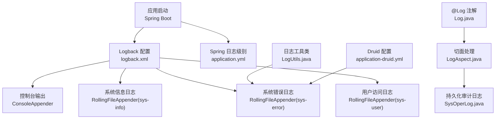
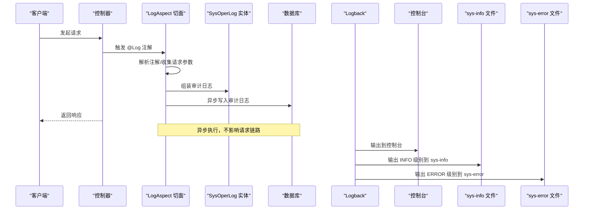
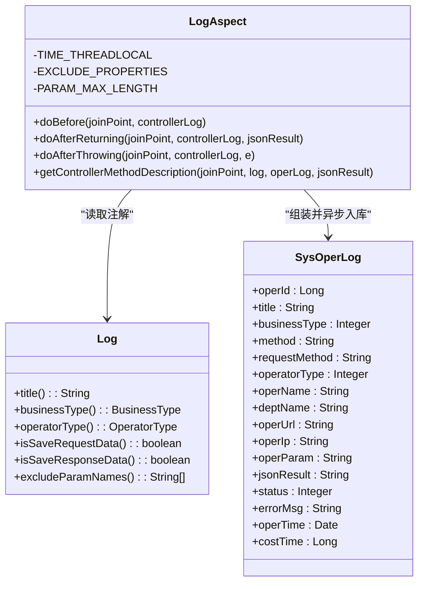
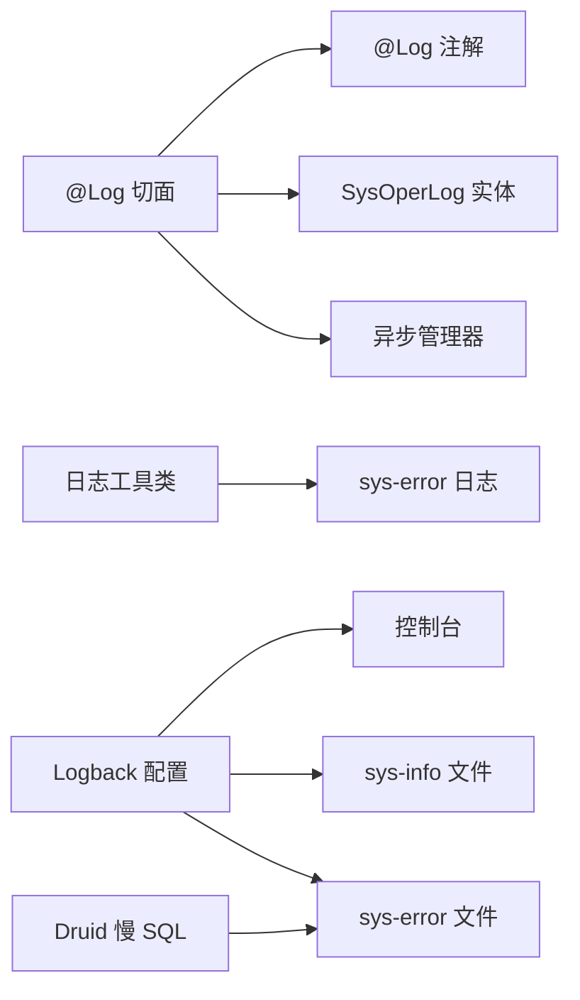

# 日志管理

<cite>
**本文引用的文件**
- [ruoyi-admin/src/main/resources/logback.xml](file://GenShin/RuoYi-master/ruoyi-admin/src/main/resources/logback.xml)
- [ruoyi-admin/src/main/resources/application.yml](file://GenShin/RuoYi-master/ruoyi-admin/src/main/resources/application.yml)
- [ruoyi-admin/src/main/resources/application-druid.yml](file://GenShin/RuoYi-master/ruoyi-admin/src/main/resources/application-druid.yml)
- [ruoyi-common/src/main/java/com/ruoyi/common/annotation/Log.java](file://GenShin/RuoYi-master/ruoyi-common/src/main/java/com/ruoyi/common/annotation/Log.java)
- [ruoyi-common/src/main/java/com/ruoyi/common/utils/LogUtils.java](file://GenShin/RuoYi-master/ruoyi-common/src/main/java/com/ruoyi/common/utils/LogUtils.java)
- [ruoyi-framework/src/main/java/com/ruoyi/framework/aspectj/LogAspect.java](file://GenShin/RuoYi-master/ruoyi-framework/src/main/java/com/ruoyi/framework/aspectj/LogAspect.java)
- [ruoyi-system/src/main/java/com/ruoyi/system/domain/SysOperLog.java](file://GenShin/RuoYi-master/ruoyi-system/src/main/java/com/ruoyi/system/domain/SysOperLog.java)
- [ruoyi-common/src/main/java/com/ruoyi/common/enums/BusinessType.java](file://GenShin/RuoYi-master/ruoyi-common/src/main/java/com/ruoyi/common/enums/BusinessType.java)
- [ruoyi-common/src/main/java/com/ruoyi/common/enums/OperatorType.java](file://GenShin/RuoYi-master/ruoyi-common/src/main/java/com/ruoyi/common/enums/OperatorType.java)
</cite>

## 目录
1. [简介](#简介)
2. [项目结构](#项目结构)
3. [核心组件](#核心组件)
4. [架构总览](#架构总览)
5. [详细组件分析](#详细组件分析)
6. [依赖关系分析](#依赖关系分析)
7. [性能与容量考虑](#性能与容量考虑)
8. [故障排查指南](#故障排查指南)
9. [结论](#结论)
10. [附录](#附录)

## 简介
本文件面向“原神攻略系统”的日志管理，围绕 Logback 日志框架的配置与使用展开，覆盖以下主题：
- 日志级别设置、输出格式与文件路径
- 日志轮转策略（按时间轮转）
- 不同环境（开发/测试/生产）的日志配置差异
- 关键业务日志记录规范（用户操作日志、错误日志、审计日志）
- 日志分析与工具集成建议（ELK/Splunk等）
- 日志安全与隐私保护、存储与归档策略

## 项目结构
与日志相关的关键文件分布如下：
- 日志框架配置：ruoyi-admin/src/main/resources/logback.xml
- Spring Boot 日志级别配置：ruoyi-admin/src/main/resources/application.yml
- 数据源与慢 SQL 日志配置：ruoyi-admin/src/main/resources/application-druid.yml
- 操作日志注解：ruoyi-common/src/main/java/com/ruoyi/common/annotation/Log.java
- 日志工具类：ruoyi-common/src/main/java/com/ruoyi/common/utils/LogUtils.java
- 操作日志切面：ruoyi-framework/src/main/java/com/ruoyi/framework/aspectj/LogAspect.java
- 审计日志实体：ruoyi-system/src/main/java/com/ruoyi/system/domain/SysOperLog.java
- 枚举类型：业务类型、操作人类别

图表来源
- [ruoyi-admin/src/main/resources/logback.xml:1-96](file://GenShin/RuoYi-master/ruoyi-admin/src/main/resources/logback.xml#L1-L96)
- [ruoyi-admin/src/main/resources/application.yml:34-39](file://GenShin/RuoYi-master/ruoyi-admin/src/main/resources/application.yml#L34-L39)
- [ruoyi-common/src/main/java/com/ruoyi/common/annotation/Log.java:19-50](file://GenShin/RuoYi-master/ruoyi-common/src/main/java/com/ruoyi/common/annotation/Log.java#L19-L50)
- [ruoyi-framework/src/main/java/com/ruoyi/framework/aspectj/LogAspect.java:40-137](file://GenShin/RuoYi-master/ruoyi-framework/src/main/java/com/ruoyi/framework/aspectj/LogAspect.java#L40-L137)
- [ruoyi-system/src/main/java/com/ruoyi/system/domain/SysOperLog.java:15-293](file://GenShin/RuoYi-master/ruoyi-system/src/main/java/com/ruoyi/system/domain/SysOperLog.java#L15-L293)
- [ruoyi-common/src/main/java/com/ruoyi/common/utils/LogUtils.java:17-136](file://GenShin/RuoYi-master/ruoyi-common/src/main/java/com/ruoyi/common/utils/LogUtils.java#L17-L136)
- [ruoyi-admin/src/main/resources/application-druid.yml:42-61](file://GenShin/RuoYi-master/ruoyi-admin/src/main/resources/application-druid.yml#L42-L61)

章节来源
- [ruoyi-admin/src/main/resources/logback.xml:1-96](file://GenShin/RuoYi-master/ruoyi-admin/src/main/resources/logback.xml#L1-L96)
- [ruoyi-admin/src/main/resources/application.yml:34-39](file://GenShin/RuoYi-master/ruoyi-admin/src/main/resources/application.yml#L34-L39)

## 核心组件
- Logback 配置文件：定义日志输出位置、格式、根日志级别、模块日志级别、滚动策略与过滤器。
- Spring Boot 日志级别：通过 application.yml 覆盖部分包的日志级别。
- 操作日志注解与切面：通过 @Log 注解与 LogAspect 切面自动采集操作审计日志，并异步落库。
- 日志工具类：封装访问日志与错误日志的统一记录入口。
- Druid 慢 SQL 日志：通过 application-druid.yml 的 stat 过滤器记录慢查询。

章节来源
- [ruoyi-admin/src/main/resources/logback.xml:1-96](file://GenShin/RuoYi-master/ruoyi-admin/src/main/resources/logback.xml#L1-L96)
- [ruoyi-admin/src/main/resources/application.yml:34-39](file://GenShin/RuoYi-master/ruoyi-admin/src/main/resources/application.yml#L34-L39)
- [ruoyi-common/src/main/java/com/ruoyi/common/annotation/Log.java:19-50](file://GenShin/RuoYi-master/ruoyi-common/src/main/java/com/ruoyi/common/annotation/Log.java#L19-L50)
- [ruoyi-framework/src/main/java/com/ruoyi/framework/aspectj/LogAspect.java:40-137](file://GenShin/RuoYi-master/ruoyi-framework/src/main/java/com/ruoyi/framework/aspectj/LogAspect.java#L40-L137)
- [ruoyi-common/src/main/java/com/ruoyi/common/utils/LogUtils.java:17-136](file://GenShin/RuoYi-master/ruoyi-common/src/main/java/com/ruoyi/common/utils/LogUtils.java#L17-L136)
- [ruoyi-admin/src/main/resources/application-druid.yml:42-61](file://GenShin/RuoYi-master/ruoyi-admin/src/main/resources/application-druid.yml#L42-L61)

## 架构总览
下图展示日志从产生到落盘/落库的整体流程，以及与审计系统的交互。

图表来源
- [ruoyi-framework/src/main/java/com/ruoyi/framework/aspectj/LogAspect.java:85-137](file://GenShin/RuoYi-master/ruoyi-framework/src/main/java/com/ruoyi/framework/aspectj/LogAspect.java#L85-L137)
- [ruoyi-system/src/main/java/com/ruoyi/system/domain/SysOperLog.java:15-293](file://GenShin/RuoYi-master/ruoyi-system/src/main/java/com/ruoyi/system/domain/SysOperLog.java#L15-L293)
- [ruoyi-admin/src/main/resources/logback.xml:82-90](file://GenShin/RuoYi-master/ruoyi-admin/src/main/resources/logback.xml#L82-L90)

## 详细组件分析

### Logback 配置与使用
- 日志路径与格式
  - 日志目录：通过属性定义日志目录，便于集中管理与轮转。
  - 输出格式：包含时间戳、线程、级别、Logger 名称、方法行号、消息等，便于快速定位。
- 控制台输出
  - 控制台 Appender 用于开发调试，输出到终端。
- 文件输出与轮转
  - 系统信息日志：仅记录 INFO 级别，按日期滚动，保留 60 天。
  - 系统错误日志：仅记录 ERROR 级别，按日期滚动，保留 60 天。
  - 用户访问日志：按日期滚动，保留 60 天。
- 日志级别控制
  - 根级别：INFO，控制台输出。
  - 系统操作日志：INFO 级别写入文件。
  - 模块级别：com.ruoyi 为 info，org.springframework 为 warn，org.thymeleaf、org.springdoc 等为 error，降低噪音。

章节来源
- [ruoyi-admin/src/main/resources/logback.xml:3-96](file://GenShin/RuoYi-master/ruoyi-admin/src/main/resources/logback.xml#L3-L96)

### Spring Boot 日志级别配置
- 在 application.yml 中设置 com.ruoyi 为 debug，org.springframework 为 warn，便于开发阶段增强诊断能力。
- 生产环境建议将 com.ruoyi 提升至 info 或 warn，以减少冗余日志。

章节来源
- [ruoyi-admin/src/main/resources/application.yml:34-39](file://GenShin/RuoYi-master/ruoyi-admin/src/main/resources/application.yml#L34-L39)

### 操作日志注解与切面
- 注解定义
  - @Log 支持模块标题、业务类型、操作人类别、是否保存请求/响应参数、排除参数列表等。
- 切面逻辑
  - 前置：记录开始时间。
  - 正常返回：记录响应结果（可选）。
  - 异常：记录异常信息与状态。
  - 敏感字段过滤：默认排除 password 等字段，支持自定义排除。
  - 参数长度限制：避免过大参数写入日志。
  - 异步落库：通过异步任务将 SysOperLog 写入数据库，避免阻塞请求。

图表来源
- [ruoyi-common/src/main/java/com/ruoyi/common/annotation/Log.java:19-50](file://GenShin/RuoYi-master/ruoyi-common/src/main/java/com/ruoyi/common/annotation/Log.java#L19-L50)
- [ruoyi-framework/src/main/java/com/ruoyi/framework/aspectj/LogAspect.java:40-137](file://GenShin/RuoYi-master/ruoyi-framework/src/main/java/com/ruoyi/framework/aspectj/LogAspect.java#L40-L137)
- [ruoyi-system/src/main/java/com/ruoyi/system/domain/SysOperLog.java:15-293](file://GenShin/RuoYi-master/ruoyi-system/src/main/java/com/ruoyi/system/domain/SysOperLog.java#L15-L293)

章节来源
- [ruoyi-common/src/main/java/com/ruoyi/common/annotation/Log.java:19-50](file://GenShin/RuoYi-master/ruoyi-common/src/main/java/com/ruoyi/common/annotation/Log.java#L19-L50)
- [ruoyi-framework/src/main/java/com/ruoyi/framework/aspectj/LogAspect.java:85-137](file://GenShin/RuoYi-master/ruoyi-framework/src/main/java/com/ruoyi/framework/aspectj/LogAspect.java#L85-L137)
- [ruoyi-system/src/main/java/com/ruoyi/system/domain/SysOperLog.java:15-293](file://GenShin/RuoYi-master/ruoyi-system/src/main/java/com/ruoyi/system/domain/SysOperLog.java#L15-L293)

### 日志工具类与用户访问日志
- 访问日志：封装了用户名、JSESSIONID、IP、Accept、User-Agent、URL、参数、Referer 等字段，统一以方括号分隔输出。
- 错误日志：记录异常类型、用户名、消息，并将异常堆栈写入 sys-error。
- 页面错误：捕获 Servlet 错误状态、URI、异常链等，统一输出。

章节来源
- [ruoyi-common/src/main/java/com/ruoyi/common/utils/LogUtils.java:17-136](file://GenShin/RuoYi-master/ruoyi-common/src/main/java/com/ruoyi/common/utils/LogUtils.java#L17-L136)

### Druid 慢 SQL 日志
- 通过 stat 过滤器开启慢 SQL 记录，阈值可配置，便于定位性能瓶颈。
- 可结合日志轮转策略统一管理慢 SQL 日志文件。

章节来源
- [ruoyi-admin/src/main/resources/application-druid.yml:52-58](file://GenShin/RuoYi-master/ruoyi-admin/src/main/resources/application-druid.yml#L52-L58)

## 依赖关系分析
- LogAspect 依赖 @Log 注解、SysOperLog 实体、Shiro 工具类、异步管理器。
- LogUtils 依赖 SLF4J Logger、IP 工具、JSON 序列化工具。
- Logback 配置依赖 Spring Boot 自动装配，受 application.yml 中 logging.level 影响。
- Druid 慢 SQL 日志与 Logback 错误日志共同构成数据库层性能与异常观测。

图表来源
- [ruoyi-framework/src/main/java/com/ruoyi/framework/aspectj/LogAspect.java:40-137](file://GenShin/RuoYi-master/ruoyi-framework/src/main/java/com/ruoyi/framework/aspectj/LogAspect.java#L40-L137)
- [ruoyi-common/src/main/java/com/ruoyi/common/annotation/Log.java:19-50](file://GenShin/RuoYi-master/ruoyi-common/src/main/java/com/ruoyi/common/annotation/Log.java#L19-L50)
- [ruoyi-system/src/main/java/com/ruoyi/system/domain/SysOperLog.java:15-293](file://GenShin/RuoYi-master/ruoyi-system/src/main/java/com/ruoyi/system/domain/SysOperLog.java#L15-L293)
- [ruoyi-common/src/main/java/com/ruoyi/common/utils/LogUtils.java:17-136](file://GenShin/RuoYi-master/ruoyi-common/src/main/java/com/ruoyi/common/utils/LogUtils.java#L17-L136)
- [ruoyi-admin/src/main/resources/logback.xml:82-90](file://GenShin/RuoYi-master/ruoyi-admin/src/main/resources/logback.xml#L82-L90)
- [ruoyi-admin/src/main/resources/application-druid.yml:52-58](file://GenShin/RuoYi-master/ruoyi-admin/src/main/resources/application-druid.yml#L52-L58)

## 性能与容量考虑
- 日志级别
  - 开发：com.ruoyi 设为 debug，便于问题定位；生产建议提升至 info/warn。
  - 框架：org.springframework、Thymeleaf、springdoc 等设为 warn/error，降低噪声。
- 轮转策略
  - 当前采用按日期滚动（TimeBasedRollingPolicy），保留 60 天。若流量较大，建议结合大小轮转（SizeBasedTriggeringPolicy）以更细粒度控制单文件大小。
- 异步审计
  - 操作日志通过异步写入数据库，避免阻塞请求，建议配合队列或线程池参数优化吞吐。
- 参数裁剪
  - 切面中对请求/响应参数有长度限制与敏感字段过滤，防止日志膨胀与敏感信息泄露。

章节来源
- [ruoyi-admin/src/main/resources/application.yml:34-39](file://GenShin/RuoYi-master/ruoyi-admin/src/main/resources/application.yml#L34-L39)
- [ruoyi-framework/src/main/java/com/ruoyi/framework/aspectj/LogAspect.java:44-51](file://GenShin/RuoYi-master/ruoyi-framework/src/main/java/com/ruoyi/framework/aspectj/LogAspect.java#L44-L51)
- [ruoyi-framework/src/main/java/com/ruoyi/framework/aspectj/LogAspect.java:195-198](file://GenShin/RuoYi-master/ruoyi-framework/src/main/java/com/ruoyi/framework/aspectj/LogAspect.java#L195-L198)

## 故障排查指南
- 日志未输出到文件
  - 检查日志目录属性与权限，确认 RollingFileAppender 的 fileNamePattern 与 maxHistory 配置。
- 日志级别不生效
  - 确认 application.yml 中 logging.level 的覆盖范围与优先级。
- 审计日志缺失
  - 确认控制器方法上是否添加 @Log 注解，切面是否启用，异步任务是否正常执行。
- 敏感信息泄露
  - 检查 @Log 注解的 excludeParamNames 与切面的 EXCLUDE_PROPERTIES 是否覆盖完整。
- 慢 SQL 未记录
  - 检查 stat 过滤器是否启用、阈值是否合理。

章节来源
- [ruoyi-admin/src/main/resources/logback.xml:16-56](file://GenShin/RuoYi-master/ruoyi-admin/src/main/resources/logback.xml#L16-L56)
- [ruoyi-admin/src/main/resources/application.yml:34-39](file://GenShin/RuoYi-master/ruoyi-admin/src/main/resources/application.yml#L34-L39)
- [ruoyi-framework/src/main/java/com/ruoyi/framework/aspectj/LogAspect.java:195-198](file://GenShin/RuoYi-master/ruoyi-framework/src/main/java/com/ruoyi/framework/aspectj/LogAspect.java#L195-L198)
- [ruoyi-admin/src/main/resources/application-druid.yml:52-58](file://GenShin/RuoYi-master/ruoyi-admin/src/main/resources/application-druid.yml#L52-L58)

## 结论
本项目基于 Logback 实现了清晰的日志分层与轮转策略，结合 @Log 注解与切面实现了完善的审计日志能力，并通过 Spring Boot 的日志级别配置满足多环境需求。建议在生产环境中进一步细化轮转策略、强化敏感信息过滤与异步落库的可靠性，以获得更好的可观测性与稳定性。

## 附录

### 不同环境的日志配置差异建议
- 开发环境
  - 日志级别：com.ruoyi debug，便于问题定位。
  - 输出：控制台 + 文件（INFO/ERROR 分离）。
- 测试环境
  - 日志级别：com.ruoyi info，框架 warn/error。
  - 输出：文件（INFO/ERROR 分离），开启必要的审计日志。
- 生产环境
  - 日志级别：com.ruoyi warn，框架 warn/error。
  - 输出：文件（INFO/ERROR 分离），开启大小轮转与长期归档策略。

章节来源
- [ruoyi-admin/src/main/resources/application.yml:34-39](file://GenShin/RuoYi-master/ruoyi-admin/src/main/resources/application.yml#L34-L39)
- [ruoyi-admin/src/main/resources/logback.xml:71-80](file://GenShin/RuoYi-master/ruoyi-admin/src/main/resources/logback.xml#L71-L80)

### 关键业务日志记录规范
- 用户操作日志
  - 使用 @Log 注解标注控制器方法，记录模块、业务类型、操作人类别、请求/响应参数（含敏感字段过滤）、耗时、状态等。
- 错误日志
  - 使用 LogUtils.logError 记录异常，确保异常链完整。
- 审计日志
  - 由 LogAspect 自动采集并异步入库，SysOperLog 实体承载字段，支持查询与报表。

章节来源
- [ruoyi-common/src/main/java/com/ruoyi/common/annotation/Log.java:19-50](file://GenShin/RuoYi-master/ruoyi-common/src/main/java/com/ruoyi/common/annotation/Log.java#L19-L50)
- [ruoyi-framework/src/main/java/com/ruoyi/framework/aspectj/LogAspect.java:85-137](file://GenShin/RuoYi-master/ruoyi-framework/src/main/java/com/ruoyi/framework/aspectj/LogAspect.java#L85-L137)
- [ruoyi-system/src/main/java/com/ruoyi/system/domain/SysOperLog.java:15-293](file://GenShin/RuoYi-master/ruoyi-system/src/main/java/com/ruoyi/system/domain/SysOperLog.java#L15-L293)
- [ruoyi-common/src/main/java/com/ruoyi/common/utils/LogUtils.java:56-64](file://GenShin/RuoYi-master/ruoyi-common/src/main/java/com/ruoyi/common/utils/LogUtils.java#L56-L64)

### 日志轮转策略
- 当前策略
  - 按日期滚动（TimeBasedRollingPolicy），保留 60 天。
- 建议扩展
  - 同时启用大小轮转（SizeBasedTriggeringPolicy），限制单文件大小，提高检索效率与磁盘占用可控性。

章节来源
- [ruoyi-admin/src/main/resources/logback.xml:18-22](file://GenShin/RuoYi-master/ruoyi-admin/src/main/resources/logback.xml#L18-L22)
- [ruoyi-admin/src/main/resources/logback.xml:39-43](file://GenShin/RuoYi-master/ruoyi-admin/src/main/resources/logback.xml#L39-L43)
- [ruoyi-admin/src/main/resources/logback.xml:60-64](file://GenShin/RuoYi-master/ruoyi-admin/src/main/resources/logback.xml#L60-L64)

### 日志分析与工具集成
- 建议方案
  - ELK Stack：Logstash 收集日志，Elasticsearch 存储，Kibana 可视化。
  - Splunk：集中采集与检索，适合大规模日志分析。
  - Loki/Grafana：轻量替代方案，适合云原生环境。
- 集成要点
  - 将 sys-info/sys-error/sys-user 等日志文件纳入采集。
  - 对审计日志（SysOperLog）建立专门索引与字段映射。
  - 对慢 SQL 日志单独采集与告警。

[本节为通用实践建议，无需特定文件引用]

### 日志安全与隐私保护
- 敏感信息过滤
  - @Log 注解与切面已内置敏感字段过滤，需确保 excludeParamNames 覆盖业务场景。
- 日志脱敏
  - 对手机号、身份证、银行卡等字段进行脱敏处理后再写入日志。
- 访问控制
  - 严格控制日志文件与数据库的访问权限，避免未授权读取。
- 合规要求
  - 遵循 GDPR、网络安全法等法规，对个人数据进行最小化处理与加密存储。

章节来源
- [ruoyi-framework/src/main/java/com/ruoyi/framework/aspectj/LogAspect.java:195-198](file://GenShin/RuoYi-master/ruoyi-framework/src/main/java/com/ruoyi/framework/aspectj/LogAspect.java#L195-L198)

### 日志存储与归档策略
- 本地归档
  - 保留 60 天内的日志，超过期限压缩归档并迁移至冷存储。
- 远程备份
  - 将日志定期备份至对象存储或专用日志服务器。
- 生命周期管理
  - 不同级别日志设定不同的保留期限与清理策略，平衡合规与成本。

章节来源
- [ruoyi-admin/src/main/resources/logback.xml:22](file://GenShin/RuoYi-master/ruoyi-admin/src/main/resources/logback.xml#L22)
- [ruoyi-admin/src/main/resources/logback.xml:43](file://GenShin/RuoYi-master/ruoyi-admin/src/main/resources/logback.xml#L43)
- [ruoyi-admin/src/main/resources/logback.xml:64](file://GenShin/RuoYi-master/ruoyi-admin/src/main/resources/logback.xml#L64)