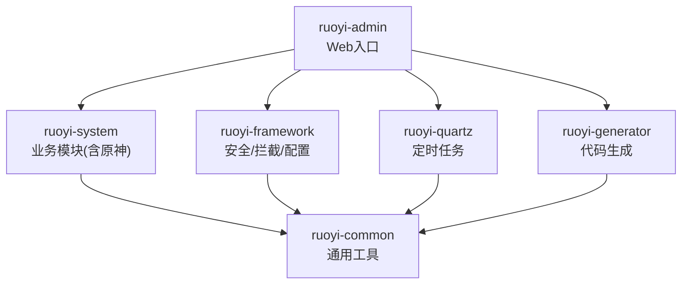
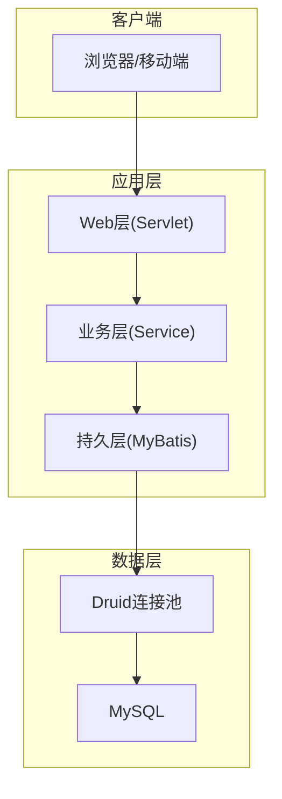
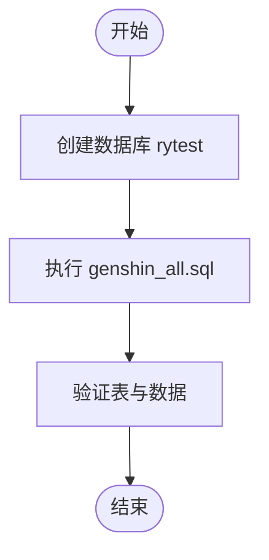
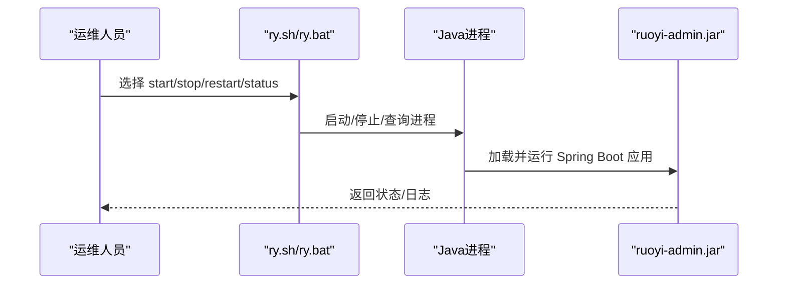
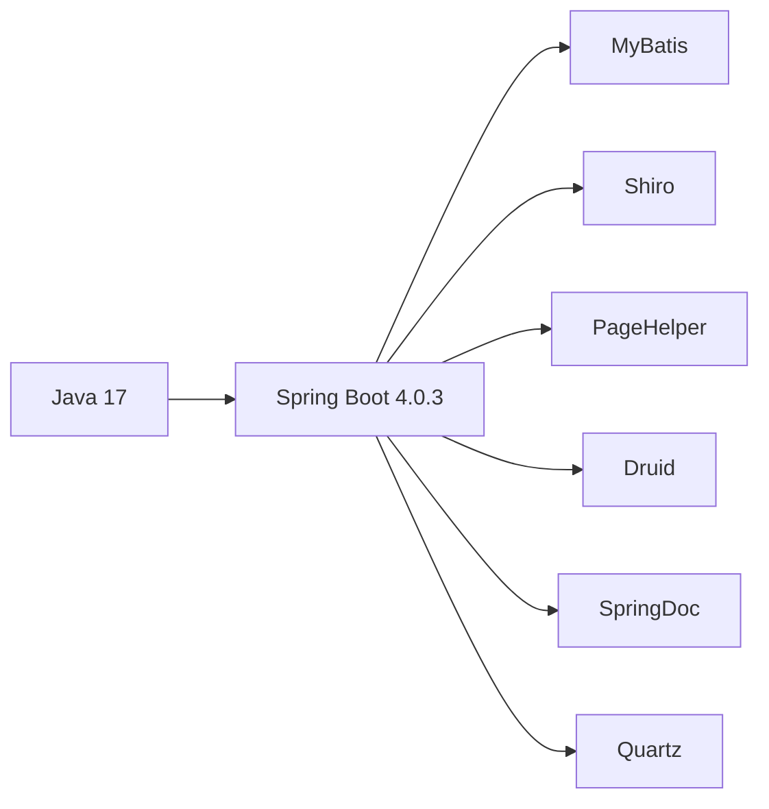

# 环境部署

<cite>
**本文引用的文件**
- [README.md](file://README.md)
- [pom.xml](file://pom.xml)
- [application.yml](file://ruoyi-admin/src/main/resources/application.yml)
- [application-druid.yml](file://ruoyi-admin/src/main/resources/application-druid.yml)
- [ry.sh](file://ry.sh)
- [ry.bat](file://ry.bat)
- [GENSHIN_MODULE_GUIDE.md](file://GENSHIN_MODULE_GUIDE.md)
- [迁移指南.md](file://迁移指南.md)
- [genshin_all.sql](file://sql/genshin_all.sql)
- [RuoYiServletInitializer.java](file://ruoyi-admin/src/main/java/com/ruoyi/RuoYiServletInitializer.java)
</cite>

## 目录
1. [引言](#引言)
2. [项目结构](#项目结构)
3. [核心组件](#核心组件)
4. [架构概览](#架构概览)
5. [详细组件分析](#详细组件分析)
6. [依赖分析](#依赖分析)
7. [性能考虑](#性能考虑)
8. [故障排查指南](#故障排查指南)
9. [结论](#结论)
10. [附录](#附录)

## 引言
本文件面向“原神攻略系统”的生产环境部署，提供从硬件与操作系统、JDK版本、数据库与应用服务器到网络与运维的全流程部署说明，并配套 Linux 与 Windows 的部署脚本与批处理文件使用方法，以及部署前检查清单与常见问题解决方案。

## 项目结构
- 采用 Maven 多模块结构，核心模块包括：
  - ruoyi-admin：Web 后端入口与静态资源
  - ruoyi-framework：安全、日志、拦截器、Shiro、MyBatis 等基础设施
  - ruoyi-system：业务模块（含原神相关实体、Mapper、Service、Controller）
  - ruoyi-quartz：定时任务
  - ruoyi-generator：代码生成
  - ruoyi-common：通用工具与常量
- 原神模块通过复制文件的方式集成至现有工程，包含 Controller、Domain、Mapper、Service、XML、前端模板等。

**图表来源**
- [pom.xml:208-216](file://pom.xml#L208-L216)

**章节来源**
- [pom.xml:208-216](file://pom.xml#L208-L216)

## 核心组件
- JDK 与 Spring Boot 版本
  - Java 版本：17
  - Spring Boot 版本：4.0.3
- 应用服务器
  - 内置 Tomcat（Spring Boot 默认）
  - 支持 WAR 方式部署至外部 Tomcat（通过 RuoYiServletInitializer）
- 数据库
  - MySQL 驱动与连接池：Druid
  - 默认数据库名：rytest
  - 默认账号密码：root/DZQ3182034163（请在生产中修改）
- Web 服务器
  - Nginx/Apache（建议）或直接使用内置 Tomcat
- 文件存储
  - 上传路径配置项：ruoyi.profile（Windows/Linux 路径示例）

**章节来源**
- [pom.xml:18-20](file://pom.xml#L18-L20)
- [application.yml:12-14](file://ruoyi-admin/src/main/resources/application.yml#L12-L14)
- [application-druid.yml:9-11](file://ruoyi-admin/src/main/resources/application-druid.yml#L9-L11)
- [RuoYiServletInitializer.java:11-17](file://ruoyi-admin/src/main/java/com/ruoyi/RuoYiServletInitializer.java#L11-L17)

## 架构概览
系统采用前后端分离的典型三层架构：Web 层（Spring MVC）、业务层（Service）、持久层（MyBatis + Druid）。原神模块以业务扩展形式接入 ruoyi-system 模块。

**图表来源**
- [application.yml:17-32](file://ruoyi-admin/src/main/resources/application.yml#L17-L32)
- [application-druid.yml:4-11](file://ruoyi-admin/src/main/resources/application-druid.yml#L4-L11)

## 详细组件分析

### 1) 基础环境准备
- 硬件建议
  - CPU：至少 2 核（建议 4 核以上）
  - 内存：建议 2 GB 以上（JVM 堆建议 1 GB 以上）
  - 磁盘：剩余空间 ≥ 2 GB（含日志、上传文件）
- 操作系统
  - Linux（CentOS/Ubuntu 等主流发行版）
  - Windows Server/Windows 10/11
- JDK 版本
  - 必须使用 JDK 17（Spring Boot 4.x 对应）
- Maven
  - Maven 3.6+（用于打包与构建）

**章节来源**
- [pom.xml:18-20](file://pom.xml#L18-L20)

### 2) 数据库配置（MySQL）
- 安装与初始化
  - 安装 MySQL（版本建议 8.0+）
  - 创建数据库：rytest（或在配置中修改）
  - 初始化脚本：使用 sql/genshin_all.sql 完成建表与数据导入
- 连接参数
  - 驱动类：com.mysql.cj.jdbc.Driver
  - URL：jdbc:mysql://localhost:3306/rytest?...
  - 用户名/密码：root/DZQ3182034163（生产必须修改）
- Druid 连接池参数
  - 初始连接数、最小空闲、最大活跃、超时等均有默认配置，可根据并发调优

**图表来源**
- [GENSHIN_MODULE_GUIDE.md:61-84](file://GENSHIN_MODULE_GUIDE.md#L61-L84)
- [genshin_all.sql:1-50](file://sql/genshin_all.sql#L1-L50)

**章节来源**
- [application-druid.yml:9-11](file://ruoyi-admin/src/main/resources/application-druid.yml#L9-L11)
- [GENSHIN_MODULE_GUIDE.md:61-84](file://GENSHIN_MODULE_GUIDE.md#L61-L84)

### 3) 应用服务器配置（Spring Boot 内置 Tomcat）
- 端口与上下文
  - 端口：80（可修改）
  - 上下文路径：/（可修改）
- Tomcat 线程池参数
  - 最大线程数、最小空闲线程、接受队列长度等均有默认值
- 日志级别
  - 开发环境默认 debug，生产建议调整为 warn/info

**章节来源**
- [application.yml:17-32](file://ruoyi-admin/src/main/resources/application.yml#L17-L32)
- [application.yml:35-38](file://ruoyi-admin/src/main/resources/application.yml#L35-L38)

### 4) 原神模块集成与运行
- 文件复制
  - 将 genshin 模块的 Controller、Domain、Mapper、Service、XML、前端模板复制到对应目录
- 数据库初始化
  - 执行 genshin_all.sql 完成建表与数据导入
- 权限菜单（可选）
  - 在后台“系统管理 → 菜单管理”中添加原神管理菜单与权限
- 编译与运行
  - Maven 打包后使用 java -jar 启动
  - 或在 IDE 中运行 RuoYiApplication

**章节来源**
- [GENSHIN_MODULE_GUIDE.md:19-142](file://GENSHIN_MODULE_GUIDE.md#L19-L142)
- [迁移指南.md:93-98](file://迁移指南.md#L93-L98)

### 5) 部署脚本与批处理文件（Linux/Windows）
- Linux 脚本
  - 提供 ry.sh，支持 start/stop/restart/status
  - JVM 参数已预设（堆大小、GC 等）
- Windows 批处理
  - 提供 ry.bat，交互式菜单启动/停止/重启/状态查看
  - 使用 javaw 启动，避免控制台窗口

**图表来源**
- [ry.sh:22-32](file://ry.sh#L22-L32)
- [ry.bat:26-40](file://ry.bat#L26-L40)

**章节来源**
- [ry.sh:1-87](file://ry.sh#L1-L87)
- [ry.bat:1-68](file://ry.bat#L1-L68)

### 6) 网络与安全配置
- 端口开放
  - 80（HTTP）或 443（HTTPS，建议配合 Nginx/反向代理）
- 防火墙
  - 开放应用监听端口与数据库端口（3306）
- 域名绑定
  - 建议通过 Nginx/Apache 反向代理到应用端口
- HTTPS
  - 生产环境建议启用 HTTPS 并配置证书

[本节为通用实践说明，不直接分析具体文件]

### 7) 环境变量与文件路径
- 上传路径
  - ruoyi.profile：Windows 示例 D:/ruoyi/uploadPath，Linux 示例 /home/ruoyi/uploadPath
- 时区
  - 已设置 Asia/Shanghai（脚本与 JVM 参数均体现）

**章节来源**
- [application.yml:11-14](file://ruoyi-admin/src/main/resources/application.yml#L11-L14)
- [ry.sh](file://ry.sh#L6)
- [ry.bat](file://ry.bat#L7)

### 8) 部署前检查清单
- 基础设施
  - JDK 17 已安装
  - Maven 可用
  - MySQL 已安装并可访问
- 配置
  - 数据库连接参数正确
  - 上传路径存在且可写
  - 端口未被占用
- 文件
  - 原神模块文件已复制到正确目录
  - SQL 脚本已执行
- 运行
  - Maven 构建成功
  - 通过 ry.sh/ry.bat 启动成功
  - 访问 http://localhost:80 正常

**章节来源**
- [GENSHIN_MODULE_GUIDE.md:146-168](file://GENSHIN_MODULE_GUIDE.md#L146-L168)
- [迁移指南.md:93-98](file://迁移指南.md#L93-L98)

## 依赖分析
- 语言与框架
  - Java 17 + Spring Boot 4.0.3
- 安全与缓存
  - Apache Shiro + EhCache
- ORM 与分页
  - MyBatis + PageHelper
- 文档与监控
  - SpringDoc OpenAPI + Druid 监控
- 定时任务
  - Quartz（ruoyi-quartz 模块）

**图表来源**
- [pom.xml:37-206](file://pom.xml#L37-L206)

**章节来源**
- [pom.xml:37-206](file://pom.xml#L37-L206)

## 性能考虑
- JVM 堆大小
  - 初始堆与最大堆已在脚本中设置，建议根据并发与数据规模调整
- 连接池
  - Druid 连接池参数（初始连接、最大活跃、超时）可按压力测试结果优化
- 线程池
  - Tomcat 最大线程数与接受队列长度可根据请求峰值调整
- 日志级别
  - 生产环境建议降低日志级别，减少 IO 压力

[本节为通用指导，不直接分析具体文件]

## 故障排查指南
- 启动失败
  - 检查 JDK 版本是否为 17
  - 检查 Maven 构建是否成功
  - 查看 ry.sh/ry.bat 输出与日志
- 数据库连接失败
  - 检查 MySQL 是否启动
  - 检查 application-druid.yml 中的 URL、用户名、密码
  - 确认数据库 rytest 已创建并执行 SQL
- 页面 404 或权限不足
  - 确认原神模块文件已复制到正确目录
  - 检查菜单权限是否配置
- 上传失败
  - 检查 ruoyi.profile 指定的目录是否存在且可写

**章节来源**
- [GENSHIN_MODULE_GUIDE.md:146-168](file://GENSHIN_MODULE_GUIDE.md#L146-L168)
- [application-druid.yml:9-11](file://ruoyi-admin/src/main/resources/application-druid.yml#L9-L11)
- [application.yml:11-14](file://ruoyi-admin/src/main/resources/application.yml#L11-L14)

## 结论
本部署文档提供了从环境准备、数据库与应用服务器配置、脚本与批处理使用到网络与运维的完整流程。按照本文档执行，可在 Linux 与 Windows 环境中稳定部署“原神攻略系统”。生产环境中请务必修改默认口令、启用 HTTPS、合理规划 JVM 与连接池参数，并做好备份与监控。

## 附录
- 原神模块集成步骤与文件清单详见 GENSHIN_MODULE_GUIDE.md
- 迁移与复制清单详见 迁移指南.md
- 数据库脚本：sql/genshin_all.sql

**章节来源**
- [GENSHIN_MODULE_GUIDE.md:170-252](file://GENSHIN_MODULE_GUIDE.md#L170-L252)
- [迁移指南.md:1-98](file://迁移指南.md#L1-L98)